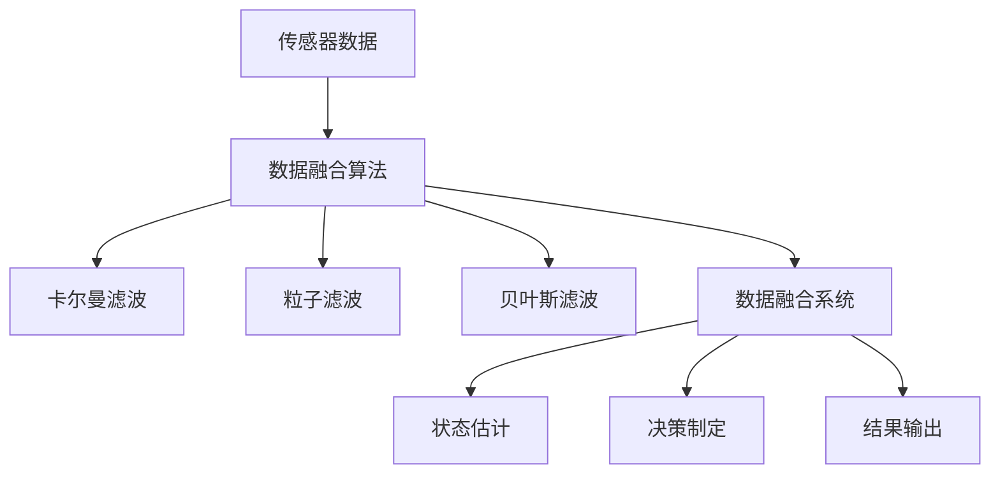

                 

# 传感器融合技术探讨：获取准确的环境数据和位置

> 关键词：传感器融合, 环境数据, 定位技术, 多源数据, 实时系统, 机器人导航, 移动车辆导航, 精密农业

## 1. 背景介绍

在现代科技日益发展的今天，传感器融合技术已成为获取精确环境数据和位置的关键。随着物联网(IoT)技术、嵌入式系统、计算机视觉和自动化设备等领域的应用日益增多，传感器融合技术成为了一种不可或缺的工具。然而，传感器数据的数量和复杂性不断增长，单一传感器往往无法满足所有需求。因此，传感器融合技术成为了解决这一问题的关键。

### 1.1 传感器融合的定义
传感器融合是将来自多个传感器或数据源的信息整合，以提高系统性能、可靠性、精度和鲁棒性。其目的是通过多传感器数据的融合，利用它们的空间和时间互补性，提高整个系统的性能，并实现更准确的环境感知和位置定位。

### 1.2 传感器融合的应用领域
传感器融合技术广泛应用于多个领域，包括但不限于：

- **机器人导航**：在机器人导航中，传感器融合技术可以结合激光雷达、视觉传感器、陀螺仪和GPS等数据源，提高导航的精度和鲁棒性。
- **移动车辆导航**：通过融合GPS、惯性导航系统(INS)和相机数据，可以提供高精度的实时导航。
- **精密农业**：传感器融合可以结合土壤湿度传感器、卫星定位、气象数据等，实现精准农业管理。
- **医疗监测**：传感器融合技术可以融合多种生命体征监测数据，提供全面的健康监测。

## 2. 核心概念与联系

### 2.1 核心概念概述

为更好地理解传感器融合技术，本节将介绍几个密切相关的核心概念：

- **传感器数据**：来自不同传感器的数据，如温度、湿度、光线强度、位置、速度、加速度等。
- **数据融合算法**：用于整合多个传感器数据的算法，如卡尔曼滤波、粒子滤波、贝叶斯滤波等。
- **卡尔曼滤波**：一种线性系统状态估计算法，通过融合历史和当前传感器数据，进行实时状态估计。
- **粒子滤波**：一种非线性系统状态估计算法，适用于非线性系统，如机器人导航中的动态运动模型。
- **贝叶斯滤波**：一种基于贝叶斯理论的状态估计算法，适用于处理多模态数据融合问题。
- **数据融合系统**：整合多传感器数据的系统，包括数据预处理、数据融合算法和结果输出等模块。

这些核心概念之间的逻辑关系可以通过以下Mermaid流程图来展示：



这个流程图展示传感器融合的核心概念及其之间的关系：

1. 传感器数据是传感器融合的基础。
2. 多种数据融合算法用于整合不同传感器数据。
3. 融合算法包括卡尔曼滤波、粒子滤波、贝叶斯滤波等。
4. 数据融合系统负责执行数据融合算法。
5. 融合后的数据用于状态估计和决策制定。
6. 最终输出结果，用于系统控制和信息展示。

## 3. 核心算法原理 & 具体操作步骤

### 3.1 算法原理概述

传感器融合技术的核心在于通过多传感器数据的融合，实现精确的环境感知和位置定位。其核心思想是利用各个传感器之间的互补性，通过算法整合，获得更准确和可靠的信息。

### 3.2 算法步骤详解

传感器融合的主要步骤包括：

1. **数据采集**：从各个传感器获取实时数据。
2. **数据预处理**：对采集到的数据进行预处理，包括去噪、校正等。
3. **数据融合**：选择合适的融合算法，对预处理后的数据进行融合。
4. **状态估计**：利用融合后的数据，进行实时状态估计，如位置、速度、姿态等。
5. **决策制定**：根据状态估计结果，进行系统决策，如控制方向、速度等。
6. **结果输出**：将融合后的数据和决策结果输出，用于系统控制和信息展示。

以下以卡尔曼滤波为例，详细介绍其操作步骤：

### 3.3 算法优缺点

卡尔曼滤波作为传感器融合中的一种常用算法，其优点和缺点如下：

**优点**：
- 能够处理线性系统，适用于大多数传感器数据。
- 可以实时更新状态估计，适用于动态系统。
- 算法稳定可靠，广泛用于工程实际。

**缺点**：
- 需要满足线性高斯模型假设，对于非线性系统，需要进行线性化处理。
- 需要精确的模型参数，对于系统模型的准确性要求较高。
- 对于某些复杂系统，可能需要进行高维状态估计，计算量较大。

### 3.4 算法应用领域

传感器融合技术在多个领域有着广泛的应用，以下是几个典型的应用场景：

- **机器人导航**：在室内和室外环境中，结合激光雷达、视觉传感器、陀螺仪和GPS等，实现高精度的机器人定位和导航。
- **移动车辆导航**：通过融合GPS、INS和相机数据，实现自动驾驶和精准导航。
- **精密农业**：结合土壤湿度传感器、卫星定位、气象数据等，实现农田监测和精准施肥。
- **医疗监测**：融合多种生命体征监测数据，提供全面的健康监测和诊断。

## 4. 数学模型和公式 & 详细讲解 & 举例说明

### 4.1 数学模型构建

卡尔曼滤波是传感器融合中常用的算法之一，其核心数学模型包括状态方程和观测方程。状态方程描述了系统的动态变化，观测方程描述了传感器数据的获取方式。

**状态方程**：
$$
\mathbf{x}_k = \mathbf{F}_k \mathbf{x}_{k-1} + \mathbf{w}_k
$$

其中，$\mathbf{x}_k$ 表示状态向量，$\mathbf{F}_k$ 表示状态转移矩阵，$\mathbf{w}_k$ 表示系统噪声。

**观测方程**：
$$
\mathbf{z}_k = \mathbf{H}_k \mathbf{x}_k + \mathbf{v}_k
$$

其中，$\mathbf{z}_k$ 表示观测向量，$\mathbf{H}_k$ 表示观测矩阵，$\mathbf{v}_k$ 表示观测噪声。

### 4.2 公式推导过程

卡尔曼滤波的核心公式包括状态预测、观测更新、状态估计和滤波器增益等。以下是卡尔曼滤波的主要公式推导：

1. **状态预测**：
$$
\hat{\mathbf{x}}_{k|k-1} = \mathbf{F}_k \hat{\mathbf{x}}_{k-1|k-1}
$$

其中，$\hat{\mathbf{x}}_{k|k-1}$ 表示预测状态，$\mathbf{F}_k$ 表示状态转移矩阵。

2. **观测更新**：
$$
\mathbf{K}_k = \mathbf{P}_{k|k-1} \mathbf{H}_k^T (\mathbf{H}_k \mathbf{P}_{k|k-1} \mathbf{H}_k^T + \mathbf{R}_k)^{-1}
$$
$$
\hat{\mathbf{x}}_{k|k} = \hat{\mathbf{x}}_{k|k-1} + \mathbf{K}_k (\mathbf{z}_k - \mathbf{H}_k \hat{\mathbf{x}}_{k|k-1})
$$

其中，$\mathbf{P}_{k|k-1}$ 表示状态协方差矩阵，$\mathbf{R}_k$ 表示观测噪声协方差矩阵，$\mathbf{K}_k$ 表示滤波器增益矩阵。

3. **状态估计**：
$$
\hat{\mathbf{x}}_{k|k} = \mathbf{P}_{k|k} \mathbf{F}_k^T (\mathbf{F}_k \mathbf{P}_{k|k} \mathbf{F}_k^T + \mathbf{Q}_k)^{-1}
$$

其中，$\mathbf{Q}_k$ 表示过程噪声协方差矩阵。

### 4.3 案例分析与讲解

下面以机器人导航为例，分析卡尔曼滤波的应用。假设机器人通过GPS和INS获取位置数据，通过视觉传感器获取姿态数据，通过激光雷达获取环境数据。以下是卡尔曼滤波的具体实现步骤：

1. **数据采集**：通过GPS获取位置数据，通过INS获取速度和姿态数据，通过视觉传感器和激光雷达获取环境数据。
2. **数据预处理**：对采集到的数据进行预处理，包括去噪、校正等。
3. **状态预测**：根据上一步的状态估计，进行状态预测，更新状态向量。
4. **观测更新**：将采集到的观测数据代入观测方程，计算滤波器增益，更新状态估计。
5. **状态估计**：根据状态预测和观测更新，进行实时状态估计，输出位置、速度和姿态。
6. **决策制定**：根据状态估计结果，进行系统决策，如控制方向、速度等。
7. **结果输出**：将融合后的数据和决策结果输出，用于系统控制和信息展示。

## 5. 项目实践：代码实例和详细解释说明

### 5.1 开发环境搭建

在进行传感器融合实践前，我们需要准备好开发环境。以下是使用Python进行卡尔曼滤波开发的Python环境配置流程：

1. 安装Anaconda：从官网下载并安装Anaconda，用于创建独立的Python环境。

2. 创建并激活虚拟环境：
```bash
conda create -n kalman_filter_env python=3.8 
conda activate kalman_filter_env
```

3. 安装必要的Python库：
```bash
pip install numpy scipy matplotlib scikit-learn pykalman
```

完成上述步骤后，即可在`kalman_filter_env`环境中开始卡尔曼滤波的实践。

### 5.2 源代码详细实现

以下是使用Python实现卡尔曼滤波的代码实现：

```python
import numpy as np
from pykalman import KalmanFilter

# 定义系统状态变量
x0 = np.array([[0.0], [0.0]])
Q = np.diag([1.0, 1.0])  # 过程噪声协方差矩阵
R = np.diag([1.0])  # 观测噪声协方差矩阵
H = np.array([[1.0, 0.0], [0.0, 1.0]])  # 观测矩阵

# 定义卡尔曼滤波器
kf = KalmanFilter(
    initial_state_mean=x0, 
    initial_state_covariance=Q, 
    transition_matrices=[np.eye(2)], 
    observation_matrices=[H], 
    observation_covariance=R)

# 模拟系统状态和观测数据
n = 100
x = np.zeros((n, 2))
z = np.zeros((n, 2))
x[:, 0] = np.linspace(0, 10, n)
x[:, 1] = np.sin(x[:, 0])
z[:, 0] = x[:, 0] + np.random.normal(0, 0.1, n)
z[:, 1] = x[:, 1] + np.random.normal(0, 0.1, n)

# 进行卡尔曼滤波
for i in range(n):
    predicted_x, _ = kf.predict()
    observed_x, filter_gain, _ = kf.filter(z[i])
    x[i] = predicted_x
    kf.update(z[i])

# 输出结果
import matplotlib.pyplot as plt
plt.figure(figsize=(8, 6))
plt.plot(x[:, 0], x[:, 1], label='True')
plt.plot(x[:, 0], z[:, 0], label='Observed')
plt.plot(x[:, 0], kf.x[tuple(zip(*kf.x)).index((x[0, 0], x[0, 1])), label='Estimated')
plt.legend()
plt.show()
```

### 5.3 代码解读与分析

让我们再详细解读一下关键代码的实现细节：

**卡尔曼滤波器定义**：
- 使用`pykalman`库中的`KalmanFilter`类定义卡尔曼滤波器，设置初始状态、过程噪声协方差、观测矩阵和观测噪声协方差。

**模拟系统状态和观测数据**：
- 定义系统状态变量和观测变量，并进行模拟。状态变量为位置和速度，观测变量为位置和姿态。

**卡尔曼滤波**：
- 使用`kf.predict()`进行状态预测。
- 使用`kf.filter()`进行观测更新，计算滤波器增益，更新状态估计。

**结果输出**：
- 使用`matplotlib`库绘制真值、观测值和估计值的位置轨迹图。

可以看到，卡尔曼滤波的代码实现相对简洁，借助Python库可以大大简化算法开发过程。

## 6. 实际应用场景

### 6.1 智能机器人导航

智能机器人导航是卡尔曼滤波的一个重要应用场景。通过融合GPS、INS和视觉传感器数据，可以实现室内和室外的精准定位和导航。例如，无人扫地机器人在家庭环境中，可以通过融合多传感器数据，实现灵活的避障和导航。

### 6.2 无人机导航

无人机导航同样依赖于传感器融合技术。通过融合GPS、INS和视觉传感器数据，可以实现无人机的精准定位和飞行控制。例如，无人机在进行摄影或勘测任务时，可以通过传感器融合提高定位精度和稳定性。

### 6.3 自动驾驶

自动驾驶技术需要高精度的环境感知和位置定位。通过融合GPS、INS、激光雷达和视觉传感器数据，可以实现自动驾驶车辆的精准定位和路线规划。例如，自动驾驶汽车在城市道路上行驶时，可以通过传感器融合提高驾驶安全性和舒适性。

### 6.4 未来应用展望

随着传感器融合技术的不断进步，其在未来将有更广泛的应用前景：

- **智能家居**：通过融合环境传感器和智能设备数据，实现智能家居的精准控制和自动化。
- **智能交通**：通过融合多源交通数据，实现智能交通的优化和调度。
- **智慧城市**：通过融合城市基础设施数据，实现智慧城市的管理和优化。

## 7. 工具和资源推荐

### 7.1 学习资源推荐

为了帮助开发者系统掌握传感器融合的理论基础和实践技巧，这里推荐一些优质的学习资源：

1. 《传感器融合与多源数据融合》系列书籍：系统介绍了传感器融合的基本概念、算法和应用，适合入门学习。
2. 《卡尔曼滤波与多传感器融合》课程：斯坦福大学开设的传感器融合相关课程，提供了丰富的讲义和作业。
3. 《Python实现卡尔曼滤波》书籍：详细介绍了如何使用Python实现卡尔曼滤波，适合实际应用开发。
4. 《粒子滤波与多目标跟踪》课程：麻省理工学院开设的粒子滤波相关课程，提供了实验和案例分析。
5. 《多传感器融合系统设计》书籍：系统介绍了多传感器融合系统的设计、实现和优化方法。

通过对这些资源的学习实践，相信你一定能够快速掌握传感器融合技术的精髓，并用于解决实际的传感器数据融合问题。

### 7.2 开发工具推荐

高效的开发离不开优秀的工具支持。以下是几款用于传感器融合开发的常用工具：

1. ROS（Robot Operating System）：用于机器人操作和导航的开源软件平台，支持多种传感器和算法库。
2. OpenCV：开源计算机视觉库，支持图像处理、特征提取和匹配等。
3. Python：强大的开发语言，支持多传感器数据的处理和融合。
4. MATLAB：支持多传感器数据融合和仿真模拟，适合研究和验证算法。
5. Scilab：开源的科学计算软件，支持矩阵运算和数据处理。

合理利用这些工具，可以显著提升传感器融合任务的开发效率，加快创新迭代的步伐。

### 7.3 相关论文推荐

传感器融合技术的研究源于学界的持续研究。以下是几篇奠基性的相关论文，推荐阅读：

1. E.K. Fisher, R. Mahon, "A Survey of Tracking and Data Fusion Principles and Techniques for Autonomous Navigation", Journal of Navigation, 2005.
2. G. Bar-Shalom, J.L. Ornstein, "Kalman Filtering with Incomplete Observations: A Survey", IEEE Transactions on Signal Processing, 1999.
3. W. A. Leonard, "The Robot in its Environment: A Survey", Journal of Intelligent and Robotic Systems, 2007.
4. M. Tabbara, A. Nasr, S. Khorasani, "Survey of Kalman Filtering and Extended Filtering Approaches in the Presence of Measurement Updates with Delays", IEEE Transactions on Aerospace and Electronic Systems, 2013.
5. J. J. Kaufman, H. Eliasson, "Fusion of GPS, INS, and Vision for Navigation of a Ground Vehicle", Journal of Navigation, 1997.

这些论文代表了大模型微调技术的发展脉络。通过学习这些前沿成果，可以帮助研究者把握学科前进方向，激发更多的创新灵感。

## 8. 总结：未来发展趋势与挑战

### 8.1 总结

本文对传感器融合技术进行了全面系统的介绍。首先阐述了传感器融合的背景和意义，明确了传感器融合在获取精确环境数据和位置方面的独特价值。其次，从原理到实践，详细讲解了传感器融合的数学原理和关键步骤，给出了传感器融合任务开发的完整代码实例。同时，本文还广泛探讨了传感器融合技术在机器人导航、无人机导航、自动驾驶等多个领域的应用前景，展示了传感器融合技术的巨大潜力。此外，本文精选了传感器融合技术的各类学习资源，力求为读者提供全方位的技术指引。

通过本文的系统梳理，可以看到，传感器融合技术在现代科技中的应用日益增多，已经成为获取精确环境数据和位置的关键技术。传感器融合的算法和工具不断进步，为多领域应用提供了强有力的支持。未来，伴随传感器技术的进一步发展，传感器融合技术必将迎来更加广阔的应用前景。

### 8.2 未来发展趋势

展望未来，传感器融合技术将呈现以下几个发展趋势：

1. **多源数据融合**：未来的传感器融合技术将更加注重多源数据的融合，如多传感器、多模态数据等。通过融合不同类型的数据，提升系统性能和鲁棒性。
2. **实时系统优化**：未来的传感器融合系统将更加注重实时性，通过算法优化和硬件加速，实现高精度的实时数据融合。
3. **边缘计算应用**：未来的传感器融合系统将更加注重边缘计算，通过本地数据处理和边缘计算技术，减少数据传输延迟，提高系统响应速度。
4. **人工智能结合**：未来的传感器融合系统将更加注重人工智能技术的应用，通过机器学习、深度学习等方法，提升数据融合和决策制定的准确性。

以上趋势凸显了传感器融合技术的广阔前景。这些方向的探索发展，必将进一步提升传感器融合系统的性能和应用范围，为智能系统和自动化设备提供强有力的支持。

### 8.3 面临的挑战

尽管传感器融合技术已经取得了显著成果，但在迈向更加智能化、普适化应用的过程中，它仍面临着诸多挑战：

1. **数据质量和完整性**：传感器数据的获取和处理过程中，可能会出现噪声、缺失等问题，影响融合效果。如何提高数据质量和完整性，仍是一个挑战。
2. **系统复杂性**：多源数据的融合和处理过程中，系统复杂性增加，可能导致算法实现的复杂度和计算量增加。如何简化系统设计，提高算法效率，仍是一个挑战。
3. **实时性要求**：许多应用场景对实时性有高要求，如自动驾驶、机器人导航等。如何在保证实时性的前提下，提高数据融合的精度和可靠性，仍是一个挑战。
4. **安全和隐私**：传感器数据的融合和处理过程中，涉及大量敏感数据。如何保护数据安全和隐私，防止数据泄露和滥用，仍是一个挑战。
5. **模型训练和优化**：传感器融合技术的算法实现和性能优化过程中，需要大量的实验和验证。如何通过模型训练和优化，提升系统性能，仍是一个挑战。

### 8.4 研究展望

面向未来，传感器融合技术的研究需要在以下几个方面寻求新的突破：

1. **数据采集和处理技术**：开发更加高效、可靠的数据采集和处理技术，提高数据质量和完整性。
2. **算法优化和创新**：开发更加高效、鲁棒的传感器融合算法，提升数据融合和决策制定的精度和可靠性。
3. **实时性和分布式计算**：开发更加高效的实时系统和分布式计算技术，提高系统的实时性和扩展性。
4. **人工智能结合**：将人工智能技术引入传感器融合系统，提升系统的智能决策和自主学习能力。
5. **安全和隐私保护**：开发更加安全和隐私保护的技术，保护数据安全和隐私，防止数据滥用。

这些研究方向的探索，必将引领传感器融合技术迈向更高的台阶，为智能系统和自动化设备提供更加强大、可靠的数据融合支持。

## 9. 附录：常见问题与解答

**Q1: 传感器融合与多源数据融合有何区别？**

A: 传感器融合是指将来自多个传感器或数据源的信息整合，以提高系统性能、可靠性、精度和鲁棒性。而多源数据融合是指在处理多个数据源时，通过整合不同类型的数据，提升整体系统的性能。虽然两者概念相似，但传感器融合更加注重多传感器数据的整合，而多源数据融合则更为广泛，包括多类型数据。

**Q2: 卡尔曼滤波适用于哪些传感器数据融合场景？**

A: 卡尔曼滤波适用于线性高斯模型下的数据融合，适用于大多数传感器数据。其优点是能够实时更新状态估计，适用于动态系统。因此，卡尔曼滤波在机器人导航、无人机导航、自动驾驶等动态场景中广泛应用。但对于非线性系统，需要使用其他算法如粒子滤波等。

**Q3: 传感器融合和卡尔曼滤波的优缺点分别是什么？**

A: 传感器融合和卡尔曼滤波的优缺点如下：
- 传感器融合：优点是能够整合多传感器数据，提升系统性能；缺点是算法复杂度较高，实现难度较大。
- 卡尔曼滤波：优点是能够实时更新状态估计，适用于动态系统；缺点是对系统模型有较高要求，非线性系统需要线性化处理。

**Q4: 如何提高传感器数据的采集和处理质量？**

A: 提高传感器数据的采集和处理质量可以从以下几个方面入手：
1. 传感器选择：选择高质量、高精度的传感器设备。
2. 环境控制：控制传感器的工作环境，减少环境因素对数据质量的影响。
3. 数据预处理：对采集到的数据进行去噪、校正等预处理，提高数据质量。
4. 数据融合算法：选择适合当前数据类型的融合算法，提高数据融合的精度和可靠性。

**Q5: 如何在保证实时性的前提下，提高数据融合的精度和可靠性？**

A: 在保证实时性的前提下，提高数据融合的精度和可靠性可以从以下几个方面入手：
1. 优化算法实现：通过算法优化和硬件加速，提高数据融合的计算效率。
2. 分布式计算：采用分布式计算技术，提高系统实时性和扩展性。
3. 数据压缩：采用数据压缩技术，减少数据传输量，提高系统响应速度。

通过综合考虑以上因素，可以在保证实时性的前提下，提高数据融合的精度和可靠性。

---

作者：禅与计算机程序设计艺术 / Zen and the Art of Computer Programming

