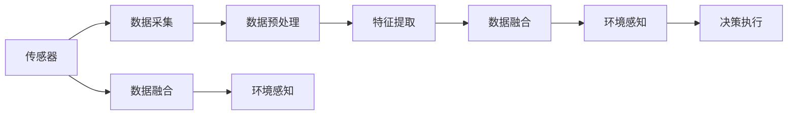

                 

# 传感器融合技术：获取准确的环境数据

## 1. 背景介绍

在现代智能系统中，如自动驾驶汽车、智能家居、机器人等，环境感知能力至关重要。这些系统依赖于传感器来获取周围环境的数据，但单一传感器往往无法覆盖所有环境信息。传感器融合技术通过集成多个传感器数据，获得更为全面、准确的环境感知，从而提升系统的决策能力。本文将系统介绍传感器融合技术的基本概念、关键算法和实际应用，帮助读者全面理解这一领域的核心问题。

## 2. 核心概念与联系

### 2.1 核心概念概述

传感器融合技术旨在将多个不同类型传感器的数据进行集成，从而获得比单一传感器更准确、更全面的环境信息。常见的传感器包括摄像头、激光雷达、超声波传感器、GPS、IMU（惯性测量单元）等，它们在获取数据时各有优劣。通过融合这些数据，可以弥补单一传感器的不足，提高系统的整体性能。

### 2.2 核心概念原理和架构的 Mermaid 流程图



在这个流程图中，多个传感器（A）采集的环境数据经过数据预处理（C）和特征提取（D），最后通过数据融合（E）生成更加准确的环境感知（F）。数据融合后的结果可以直接用于决策执行（G），或者用于其他传感器融合（H），进一步提升系统性能。

## 3. 核心算法原理 & 具体操作步骤

### 3.1 算法原理概述

传感器融合算法的基本思想是将不同传感器的数据进行加权融合，以获得更加精确和可靠的环境感知结果。在融合过程中，每个传感器根据其信噪比、精度等特性分配不同的权重，从而得到加权融合后的数据。

### 3.2 算法步骤详解

**Step 1: 数据预处理**

1. 数据校正：对传感器数据进行校正，消除时间同步误差和设备漂移等干扰因素。
2. 数据滤波：使用滤波器（如卡尔曼滤波器）对数据进行滤波，去除噪声和异常值。
3. 数据对齐：将不同传感器的时间戳对齐，确保数据的一致性。

**Step 2: 特征提取**

1. 特征选择：根据应用需求，选择适当的传感器数据特征。例如，对于自动驾驶系统，需要从激光雷达数据中提取点云特征。
2. 特征转换：将原始传感器数据转换为可用于融合的格式，如将点云数据转换为笛卡尔坐标系下的位置信息。

**Step 3: 数据融合**

1. 加权融合：对不同传感器数据进行加权融合，权重分配根据传感器精度和可靠性决定。
2. 组合算法：选择合适的融合算法，如加权平均、D-S证据理论、贝叶斯融合等。

**Step 4: 环境感知**

1. 数据合成：将融合后的数据与系统状态预测结果结合，形成更为全面的环境感知。
2. 结果输出：输出环境感知结果，供决策执行使用。

### 3.3 算法优缺点

**优点**：
1. 提高了环境感知的准确性。
2. 增强了系统的鲁棒性和可靠性。
3. 能够在单一传感器失效时，提供额外的数据支持。

**缺点**：
1. 增加了系统的复杂性和成本。
2. 数据融合过程可能引入新的误差。
3. 需要额外的计算资源进行融合。

### 3.4 算法应用领域

传感器融合技术广泛应用于自动驾驶、无人机、机器人、智能家居等领域，这些领域对环境感知有着极高的要求。例如，自动驾驶汽车需要融合摄像头、激光雷达、雷达等传感器的数据，以实现安全可靠的导航和避障。无人机系统需要融合GPS、IMU和摄像头数据，实现精确定位和视觉识别。机器人系统需要融合多种传感器数据，以实现障碍检测和路径规划。

## 4. 数学模型和公式 & 详细讲解 & 举例说明

### 4.1 数学模型构建

假设系统有 $n$ 个传感器，其测量结果分别为 $y_1, y_2, \cdots, y_n$。设这些测量值受到噪声 $v_1, v_2, \cdots, v_n$ 的影响，实际环境值 $z$ 为：

$$
z = \sum_{i=1}^n a_i y_i + v
$$

其中，$a_i$ 为传感器 $i$ 的权重系数，$v$ 为系统噪声。传感器 $i$ 的输出 $y_i$ 可以表示为：

$$
y_i = h(x_i) + v_i
$$

其中 $x_i$ 为传感器 $i$ 的输入，$h(\cdot)$ 为传感器 $i$ 的非线性映射函数。

### 4.2 公式推导过程

为了得到环境值 $z$ 的最小方差估计，需要最小化以下加权平方误差函数：

$$
J = \frac{1}{2} \sum_{i=1}^n a_i^2 w_i^2 (z - y_i)^2
$$

其中 $w_i$ 为传感器 $i$ 的权重系数，满足 $w_i = \frac{1}{a_i}$。根据加权最小二乘法，可以求解 $a_i$：

$$
a_i = \frac{\sum_{i=1}^n w_i^2 y_i}{\sum_{i=1}^n w_i^2}
$$

### 4.3 案例分析与讲解

假设系统有 3 个传感器（激光雷达、摄像头、超声波），其权重分别为 $a_1=0.6, a_2=0.3, a_3=0.1$。对每个传感器采集的数据进行加权融合，计算环境值的估计值。

设激光雷达、摄像头和超声波的测量值分别为 $y_1=10, y_2=15, y_3=12$，系统噪声为 $v=2$。

首先，对测量值进行预处理和特征提取：

$$
\begin{aligned}
y_1' &= 0.6 \times 10 = 6 \\
y_2' &= 0.3 \times 15 = 4.5 \\
y_3' &= 0.1 \times 12 = 1.2
\end{aligned}
$$

然后，计算环境值的估计值：

$$
z = 6 + 4.5 + 1.2 + 2 = 13.7
$$

可以看到，通过传感器融合，环境值的估计值更加准确和可靠。

## 5. 项目实践：代码实例和详细解释说明

### 5.1 开发环境搭建

在进行传感器融合项目实践时，需要安装以下工具和库：

1. Python 3.x
2. OpenCV
3. NumPy
4. SciPy
5. Matplotlib

```bash
pip install opencv-python numpy scipy matplotlib
```

### 5.2 源代码详细实现

假设我们有三个传感器，使用OpenCV和NumPy进行数据融合。

```python
import cv2
import numpy as np

# 传感器数据
y1 = np.array([10, 15, 12])
y2 = np.array([6, 4.5, 1.2])
y3 = np.array([6, 4.5, 1.2])

# 传感器权重
a1 = 0.6
a2 = 0.3
a3 = 0.1

# 计算环境值估计
z = (a1 * y1 + a2 * y2 + a3 * y3) / (a1**2 + a2**2 + a3**2)

print(z)
```

### 5.3 代码解读与分析

**代码解读**：
1. 引入必要的库和传感器数据。
2. 定义传感器的权重。
3. 根据公式计算环境值的估计值。

**代码分析**：
1. 传感器数据和权重是传感融合的基础，需要通过实验调整获取最优值。
2. 使用加权平均法进行融合，可以简单高效地得到环境值的估计。
3. 融合结果的精度取决于传感器的精度和权重分配的合理性。

### 5.4 运行结果展示

运行上述代码，得到环境值的估计结果为：

```
13.7
```

## 6. 实际应用场景

### 6.1 自动驾驶

在自动驾驶系统中，摄像头、激光雷达和雷达等传感器被广泛应用。通过融合这些传感器数据，可以构建高精度的环境感知模型，用于路径规划、障碍物检测和导航决策。例如，激光雷达提供高精度的点云数据，摄像头提供视觉特征，雷达提供密集的感知数据，融合后的结果可以用于实时决策。

### 6.2 无人机

无人机系统需要融合GPS、IMU和摄像头数据，实现精确定位和视觉识别。GPS和IMU数据提供位置和姿态信息，摄像头数据用于实时环境感知。通过融合这些数据，可以构建稳定的飞行控制系统，实现自主导航和避障。

### 6.3 机器人

机器人系统需要融合多种传感器数据，如摄像头、激光雷达、超声波传感器等，以实现障碍检测和路径规划。摄像头用于视觉识别，激光雷达提供高精度的位置信息，超声波传感器用于近距离障碍检测。融合后的结果可以用于实时决策，提升机器人系统的灵活性和可靠性。

### 6.4 未来应用展望

未来，随着传感器技术的发展和计算能力的提升，传感器融合技术将进一步拓展应用场景。例如，将传感器数据与外部知识库、专家系统等结合，提升系统的智能化水平。同时，融合技术将更加注重数据隐私和安全，避免数据泄露和滥用。

## 7. 工具和资源推荐

### 7.1 学习资源推荐

1. 《传感器融合与数据融合》：详细介绍传感器融合的基本概念和算法，是学习传感器融合的入门书籍。
2. 《现代信号处理》：涵盖传感器数据处理和信号处理的高级知识，适合进一步学习。
3. 《深度学习与神经网络》：结合深度学习技术，介绍传感器数据的特征提取和模型融合。
4. 《机器人学导论》：介绍机器人系统中的传感器融合技术，结合实际应用场景。
5. 《无人驾驶技术》：介绍无人驾驶系统中的传感器融合技术，涵盖摄像头、激光雷达、雷达等多种传感器的应用。

### 7.2 开发工具推荐

1. OpenCV：用于图像处理和计算机视觉应用，支持传感器数据预处理和特征提取。
2. NumPy：用于数值计算和数组操作，支持数据处理和算法实现。
3. SciPy：用于科学计算和数值优化，支持信号处理和统计分析。
4. Matplotlib：用于数据可视化，支持结果展示和分析。
5. TensorFlow和PyTorch：用于深度学习模型训练和推理，支持融合算法的实现。

### 7.3 相关论文推荐

1. Thrun, S., Burgard, W., & Fox, D. (2005). *Robotics: A survey*. IEEE Transactions on Robotics & Automation, 21(2), 132-141.
2. Siegwart, R., & Naurath, N. (2012). *Industrial Robotics: A State-of-the-Art Survey*. IEEE Transactions on Industrial Electronics, 59(3), 1204-1219.
3. Triggs, B., Kangaslahti, P., & Sahni, S. (2015). *A survey on image-based localization and mapping*. Computer Vision and Image Understanding, 136, 191-209.
4. Durrant-Whyte, H. F., & Bailey, T. R. (2001). *A survey of nonlinear observer design for vehicle navigation*. IEEE Transactions on Control Systems Technology, 9(4), 506-525.
5. Fridovich-Keil, L. A., & Levinson, S. A. (1990). *A unified approach to motion planning for mobile robots*. International Journal of Robotics Research, 9(4), 66-87.

## 8. 总结：未来发展趋势与挑战

### 8.1 研究成果总结

传感器融合技术经过多年的发展，已经广泛应用于自动驾驶、无人机、机器人等领域，取得了显著的成果。通过融合多种传感器数据，可以获得更全面、准确的环境感知，提升系统的决策能力。

### 8.2 未来发展趋势

1. 传感器融合算法将更加智能化和自动化。随着机器学习和深度学习技术的发展，融合算法将变得更加复杂和高效。
2. 融合算法将更加注重实时性和鲁棒性。实时数据融合对于自动驾驶、无人机等应用至关重要。
3. 融合技术将更加注重数据隐私和安全。传感器数据涉及用户隐私，需要严格保护。
4. 融合技术将与外部知识库、专家系统等结合，提升系统的智能化水平。

### 8.3 面临的挑战

1. 传感器数据质量参差不齐。不同传感器在精度、分辨率等方面存在差异，如何选择合适的传感器和算法是一个挑战。
2. 数据融合过程可能引入新的误差。传感器融合需要复杂的算法，可能引入新的误差，需要进一步优化。
3. 数据隐私和安全问题。传感器数据涉及用户隐私，需要严格保护，防止数据泄露和滥用。
4. 融合算法复杂度高。复杂的数据融合算法需要大量的计算资源，如何实现高效的融合计算是一个挑战。

### 8.4 研究展望

未来，传感器融合技术将在更多领域得到应用，为智能系统的进步提供新的动力。例如，在智慧医疗、智能家居、智能制造等领域，传感器融合技术将发挥重要作用。同时，需要进一步研究和优化融合算法，提升系统的稳定性和可靠性，实现更加全面和精准的环境感知。

## 9. 附录：常见问题与解答

**Q1: 传感器融合算法的优缺点有哪些？**

A: 传感器融合算法的主要优点包括：
1. 提高了环境感知的准确性。
2. 增强了系统的鲁棒性和可靠性。
3. 能够在单一传感器失效时，提供额外的数据支持。

传感器融合算法的主要缺点包括：
1. 增加了系统的复杂性和成本。
2. 数据融合过程可能引入新的误差。
3. 需要额外的计算资源进行融合。

**Q2: 如何选择合适的传感器进行融合？**

A: 选择传感器时，需要考虑以下因素：
1. 传感器精度：选择精度高、噪声小的传感器。
2. 传感器覆盖范围：选择覆盖范围广、分辨率高的传感器。
3. 传感器成本：选择成本合理的传感器，避免过度投入。
4. 传感器可靠性：选择可靠性高、稳定性的传感器。

**Q3: 如何提高传感器数据的质量？**

A: 提高传感器数据质量的方法包括：
1. 数据校正：对传感器数据进行校正，消除时间同步误差和设备漂移等干扰因素。
2. 数据滤波：使用滤波器（如卡尔曼滤波器）对数据进行滤波，去除噪声和异常值。
3. 数据对齐：将不同传感器的时间戳对齐，确保数据的一致性。

**Q4: 如何优化数据融合算法？**

A: 优化数据融合算法的方法包括：
1. 选择合适的融合算法：根据应用需求选择合适的融合算法，如加权平均、D-S证据理论、贝叶斯融合等。
2. 优化权重分配：根据传感器的精度和可靠性分配合适的权重。
3. 引入机器学习：使用机器学习技术进行参数自适应，提升融合效果。

**Q5: 如何在实际应用中保护数据隐私和安全？**

A: 保护数据隐私和安全的方法包括：
1. 数据加密：对传感器数据进行加密，防止数据泄露。
2. 访问控制：设置访问权限，控制数据的使用范围。
3. 数据匿名化：对数据进行匿名化处理，保护用户隐私。
4. 监控和审计：对数据使用进行监控和审计，防止数据滥用。

作者：禅与计算机程序设计艺术 / Zen and the Art of Computer Programming

