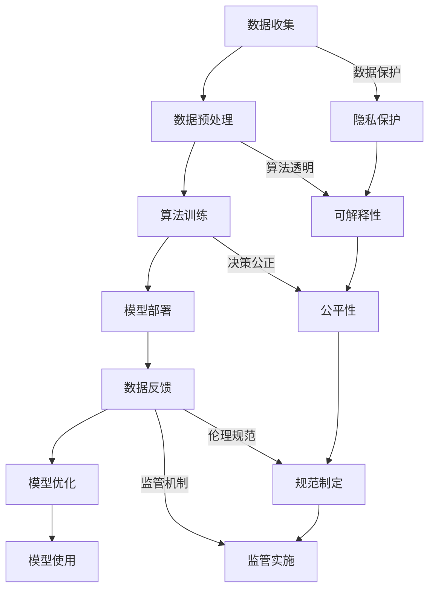

                 

# 伦理挑战：探讨人类计算带来的道德困境

## 1. 背景介绍

随着人工智能技术的迅猛发展，人类计算在各个领域的应用日益广泛，从医疗诊断到自动驾驶，从金融分析到教育培训，都在依赖于算法的驱动。然而，在这些技术的光环背后，隐藏着一个不容忽视的伦理困境：人类计算可能带来道德风险，引发一系列社会问题。

### 1.1 问题由来

现代计算机技术的强大能力，使得算法可以处理和分析海量数据，甚至在某些领域能够超越人类。这固然带来了极大的便利，但同时也可能加剧数据隐私、算法透明、决策公正等方面的道德挑战。

- **数据隐私**：大规模数据收集和分析过程中，个人隐私的保护变得愈发困难。数据泄露、滥用等问题频发，引发社会对隐私保护的广泛关注。
- **算法透明**：复杂的算法模型难以解释其内部逻辑和决策过程，导致“算法黑箱”问题，增加了社会对算法透明性的质疑。
- **决策公正**：算法在处理不同群体数据时，可能存在歧视，引发公平性和偏见问题。如医疗诊断、贷款审批等场景中的决策偏差，可能加剧社会不平等。

### 1.2 问题核心关键点

这些道德困境的核心关键点包括：

- **隐私与数据保护**：如何在利用数据的同时，确保个人隐私不被侵犯。
- **算法透明与可解释性**：如何让复杂算法变得透明，使其内部逻辑可以被理解和审查。
- **决策公正与公平性**：如何避免算法在处理不同群体数据时产生偏见，确保决策的公正性。
- **伦理规范与监管**：如何建立合理的伦理规范和监管机制，防止技术的滥用。

这些核心问题需要技术、伦理和社会三个层面的共同努力，才能有效应对。

## 2. 核心概念与联系

### 2.1 核心概念概述

要深入探讨这些伦理问题，首先需要理解一些核心概念：

- **隐私**：指个人或组织在未经授权的情况下，其个人信息不被公开或泄露的权利。
- **数据保护**：指通过法律和技术手段，保护数据不被滥用、泄露或篡改的措施。
- **算法透明**：指算法的决策过程可以被理解和解释，确保其透明性和可信度。
- **算法可解释性**：指算法的输出结果可以被解释，帮助用户理解其背后的逻辑和依据。
- **公平性**：指算法在处理不同群体数据时，能够做到平等对待，避免歧视和偏见。
- **伦理规范**：指对技术应用中的道德标准和行为准则，确保技术的正确和有益使用。
- **监管机制**：指对技术应用进行监督和管理，防止其被滥用。

这些概念之间紧密联系，共同构成了一个复杂而多维度的伦理问题网络。

### 2.2 核心概念原理和架构的 Mermaid 流程图



这个流程图展示了数据处理、算法训练、模型部署和模型使用过程中涉及的伦理问题，以及它们之间的内在联系。

## 3. 核心算法原理 & 具体操作步骤

### 3.1 算法原理概述

基于人类计算的算法，其核心原理是在大量数据的基础上进行学习，通过统计分析和模式识别，实现对复杂问题的自动化处理。然而，这种自动化处理可能带来道德风险，特别是在隐私保护、算法透明、决策公正等方面。

### 3.2 算法步骤详解

以下详细描述算法在隐私保护、算法透明、决策公正等方面的具体操作步骤：

**隐私保护**：
1. **数据匿名化**：在收集数据时，对个人身份信息进行匿名化处理，防止数据泄露。
2. **数据访问控制**：通过访问控制列表和权限管理，限制对数据的访问，确保只有授权人员可以处理数据。
3. **差分隐私**：在数据分析和处理过程中，加入噪声，保护个人隐私不被滥用。

**算法透明**：
1. **模型解释**：使用可解释性方法（如LIME、SHAP等），对模型的输出进行解释，帮助用户理解决策过程。
2. **特征重要性**：分析输入特征对输出的影响，揭示模型关键因素。
3. **透明模型**：设计透明的模型结构，减少“黑箱”效应，提高可信度。

**决策公正**：
1. **公平性评估**：在模型训练和测试过程中，评估模型的公平性，识别潜在的偏见。
2. **公平性校正**：对模型进行公平性校正，确保不同群体的处理结果一致。
3. **偏见检测**：使用偏见检测工具（如Adversarial Fairness），识别和消除算法偏见。

### 3.3 算法优缺点

**优点**：
- **效率高**：算法能够快速处理和分析大量数据，提高决策效率。
- **准确性**：基于数据的自动化决策往往比人工决策更为准确。

**缺点**：
- **隐私风险**：大规模数据收集和分析可能带来隐私风险，侵犯个人隐私。
- **算法不透明**：复杂的算法模型难以解释，增加了社会对算法透明性的质疑。
- **决策不公正**：算法可能存在偏见，导致不公平的决策。

### 3.4 算法应用领域

尽管存在这些缺点，基于人类计算的算法仍然广泛应用于各个领域，包括但不限于：

- **医疗诊断**：通过分析医疗数据，提供精准的诊断和治疗建议。
- **金融分析**：利用大量交易数据，进行风险评估和投资建议。
- **教育培训**：通过分析学习行为，个性化推荐学习内容和路径。
- **自动驾驶**：通过环境感知和决策算法，实现安全和高效的驾驶。
- **智能客服**：利用自然语言处理技术，提供自动化客户服务。

这些应用场景在带来便利的同时，也加剧了数据隐私、算法透明、决策公正等方面的道德挑战。

## 4. 数学模型和公式 & 详细讲解 & 举例说明

### 4.1 数学模型构建

在探讨算法伦理问题时，需要构建一系列数学模型来描述和分析问题。以下是最基本的一些模型：

- **隐私模型**：描述数据收集、处理和保护的过程，确保隐私不被侵犯。
- **算法透明模型**：描述算法内部决策过程，揭示模型逻辑和依据。
- **公平性模型**：描述算法在处理不同群体数据时的表现，确保决策公正。

### 4.2 公式推导过程

以**隐私模型**为例，推导差分隐私的基本公式：

$$
\delta = \frac{\epsilon}{2} \ln \frac{n}{\delta_1}
$$

其中，$\delta$ 表示隐私泄露的概率，$\epsilon$ 是隐私参数，$n$ 是数据集大小，$\delta_1$ 是假阳性的概率阈值。

该公式展示了如何在数据处理过程中，通过加入噪声保护隐私。

### 4.3 案例分析与讲解

**案例1：医疗诊断中的隐私保护**

某医院利用算法对患者病历进行自动诊断。在数据收集阶段，通过匿名化处理，确保病历信息不泄露。在数据存储和处理过程中，采用差分隐私技术，加入噪声保护隐私。同时，在设计算法时，引入透明度机制，确保医生和患者可以理解算法的决策依据。

**案例2：金融分析中的算法透明**

某金融公司利用算法对客户信用进行评估。在模型训练阶段，使用可解释性方法，分析算法输出和输入特征的关系。在模型部署阶段，设计透明的模型结构，减少“黑箱”效应，提高可信度。

**案例3：教育培训中的决策公正**

某在线教育平台利用算法进行个性化推荐。在模型训练和测试阶段，评估模型的公平性，识别潜在的偏见。在模型优化阶段，对模型进行公平性校正，确保不同群体的推荐结果一致。

## 5. 项目实践：代码实例和详细解释说明

### 5.1 开发环境搭建

进行项目实践前，需要搭建合适的开发环境。以下是一些推荐配置：

- **操作系统**：Linux、MacOS或Windows系统。
- **Python版本**：3.8或以上。
- **开发工具**：Jupyter Notebook、PyCharm等。
- **数据集**：公开数据集如MNIST、CIFAR-10等，或者自定义数据集。

### 5.2 源代码详细实现

以**差分隐私保护**为例，展示如何在Python中实现差分隐私：

```python
import numpy as np
from scipy.special import entr

def laplace_mechanism(sensitivity, epsilon, n):
    # 计算噪声向量
    noise = np.random.laplace(0, sensitivity / epsilon, n)
    # 计算输出
    return s + noise

def difference_privacy(sensitivity, epsilon, n):
    # 计算隐私泄露概率
    delta = entr(1 / (np.exp(epsilon / 2) + np.exp(-epsilon / 2)) - entr(1 / (1 + np.exp(-epsilon)))
    return delta

# 示例：保护病历数据的隐私
sensitivity = 1  # 数据灵敏度
epsilon = 0.1  # 隐私参数
n = 1000  # 数据集大小

# 计算隐私泄露概率
delta = difference_privacy(sensitivity, epsilon, n)
print("隐私泄露概率：", delta)
```

### 5.3 代码解读与分析

以上代码展示了如何使用差分隐私技术保护病历数据隐私。通过计算隐私泄露概率，可以评估隐私保护的效果。

### 5.4 运行结果展示

运行上述代码，输出隐私泄露概率，展示差分隐私保护的效果。

## 6. 实际应用场景

### 6.1 医疗诊断

在医疗诊断中，数据隐私和算法透明尤为重要。利用差分隐私保护患者隐私，同时引入可解释性方法，确保诊断过程透明和可信。

### 6.2 金融分析

在金融分析中，算法透明和决策公正是关键。使用可解释性方法，揭示模型内部逻辑，确保决策过程公正。

### 6.3 教育培训

在教育培训中，公平性是核心。评估和校正模型偏见，确保推荐结果对不同群体公平。

### 6.4 未来应用展望

随着技术的发展，未来在隐私保护、算法透明、决策公正等方面的应用将更加广泛和深入。例如，在智能合约中，利用区块链技术确保数据透明和不可篡改；在自动化司法中，使用可解释性模型提高判决公正性。

## 7. 工具和资源推荐

### 7.1 学习资源推荐

为帮助开发者掌握算法伦理问题，以下是一些优质学习资源：

- **书籍**：《算法伦理：人工智能与社会公正》，讨论算法在社会公正中的伦理问题。
- **在线课程**：Coursera上的《算法伦理与公平性》课程，详细讲解算法伦理问题。
- **论文**：《公平算法：理论与实践》，探讨公平算法的设计和应用。

### 7.2 开发工具推荐

以下是一些推荐开发工具：

- **Jupyter Notebook**：Python的轻量级开发环境，适合进行快速原型开发和数据分析。
- **PyCharm**：强大的Python IDE，支持代码调试、版本控制等。
- **TensorFlow**：开源机器学习库，支持多种算法和模型。

### 7.3 相关论文推荐

以下推荐几篇关键论文：

- **《算法透明性与可解释性：现状与未来》**：探讨算法透明性和可解释性的现状和未来发展方向。
- **《公平算法的设计与实现》**：讨论公平算法的设计和实现技术。
- **《隐私保护技术综述》**：总结隐私保护技术的最新进展。

## 8. 总结：未来发展趋势与挑战

### 8.1 研究成果总结

本文对人类计算带来的伦理挑战进行了全面探讨。通过隐私保护、算法透明、决策公正等方面的分析，揭示了技术应用中的道德困境。通过案例分析和代码实现，展示了如何在实际应用中应对这些伦理问题。

### 8.2 未来发展趋势

未来，随着技术的发展，人类计算将面临更多的伦理挑战：

- **隐私保护**：随着数据量的增加，隐私保护技术将更加复杂和多样。
- **算法透明**：可解释性算法将成为主流，算法透明性和可信度将进一步提高。
- **决策公正**：公平性技术将更加普及，确保不同群体的公平性。
- **伦理规范**：随着技术应用范围的扩大，伦理规范和监管机制将更加完善。

### 8.3 面临的挑战

尽管取得了一定的进展，人类计算在伦理问题上仍面临挑战：

- **隐私风险**：大规模数据收集和分析带来了隐私风险，保护隐私的技术仍需完善。
- **算法透明**：复杂的算法模型难以解释，增加了社会对算法透明性的质疑。
- **决策公正**：算法可能存在偏见，导致不公平的决策。
- **伦理规范**：如何在全球范围内建立统一的伦理规范，是一个复杂的问题。

### 8.4 研究展望

未来的研究需要在以下几个方面寻求新的突破：

- **隐私保护技术**：开发更高效、更安全的隐私保护技术，确保数据不被滥用。
- **算法透明技术**：开发更可解释的算法，揭示算法内部逻辑和依据。
- **公平性技术**：研究新的公平性校正方法，消除算法偏见。
- **伦理规范制定**：建立合理的伦理规范和监管机制，确保技术的正确使用。

## 9. 附录：常见问题与解答

### Q1: 什么是差分隐私？

A: 差分隐私是一种隐私保护技术，通过在数据处理过程中加入噪声，确保单个数据点的泄露不会显著影响整体隐私。

### Q2: 如何在实际应用中实现算法透明？

A: 使用可解释性方法，如LIME、SHAP等，对算法输出进行解释，揭示其内部逻辑和依据。

### Q3: 如何确保算法的决策公正？

A: 在模型训练和测试阶段，评估算法的公平性，识别潜在的偏见。在模型优化阶段，对模型进行公平性校正，确保不同群体的处理结果一致。

### Q4: 如何应对大规模数据收集中的隐私风险？

A: 使用数据匿名化、访问控制等技术，确保数据处理过程的隐私保护。同时，采用差分隐私技术，加入噪声保护隐私。

### Q5: 未来算法伦理问题的研究方向是什么？

A: 隐私保护技术、算法透明技术、公平性技术和伦理规范制定将是未来的研究方向。

---

作者：禅与计算机程序设计艺术 / Zen and the Art of Computer Programming

