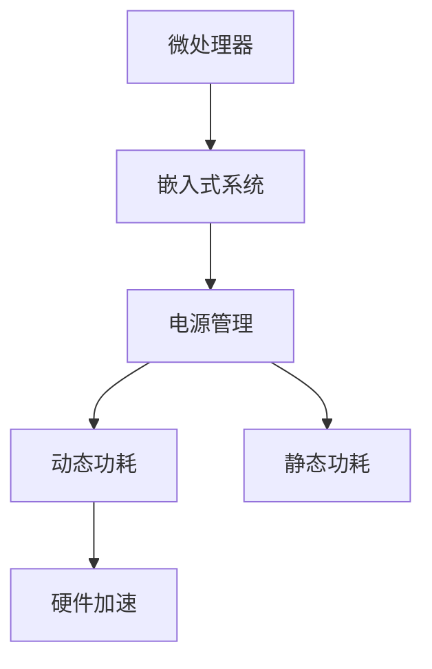

                 

# 低功耗设计：延长电池寿命

> 关键词：低功耗设计, 电池寿命, 微处理器, 嵌入式系统, 电源管理, 硬件加速

## 1. 背景介绍

### 1.1 问题由来

在现代社会，便携式设备如智能手机、笔记本电脑、可穿戴设备等已经成为人们日常生活中不可或缺的一部分。然而，这些设备往往面临着电池续航不足的困扰。无论是频繁的充电还是不间断的使用，都会对用户造成不便。因此，延长电池寿命，提升设备的持久使用能力，成为电子产品的关键需求之一。

### 1.2 问题核心关键点

延长电池寿命的核心在于优化设备硬件和软件的设计，最大限度地减少能量消耗。具体来说，需要从以下几个方面入手：

- **微处理器优化**：选择低功耗的微处理器或通过设计优化减少微处理器的功耗。
- **嵌入式系统设计**：优化系统架构和资源分配，避免不必要的资源浪费。
- **电源管理**：使用高效的电源管理技术，如动态电压频率调整(DVFS)、休眠模式等。
- **硬件加速**：利用硬件加速技术，减少软件计算的负担，提高整体系统的能效比。

## 2. 核心概念与联系

### 2.1 核心概念概述

为更好地理解低功耗设计的方法，本节将介绍几个密切相关的核心概念：

- **微处理器**：电子设备的核心计算单元，负责执行算术和逻辑操作，其功耗直接影响设备的能耗。
- **嵌入式系统**：将硬件和软件整合在一起的复杂电子系统，广泛应用于便携式设备中。
- **电源管理**：通过动态调整电压、频率等参数，降低系统功耗的技术。
- **硬件加速**：利用专用硬件，如GPU、FPGA等，加速计算任务，减少软件能耗。
- **动态功耗**：设备在运行过程中的动态能耗，主要受微处理器和动态内存等组件的功耗影响。
- **静态功耗**：设备在待机或关闭状态下的能耗，主要由漏电电流等组成。

这些核心概念之间的逻辑关系可以通过以下Mermaid流程图来展示：



这个流程图展示了一系列概念的相互关系：

1. 微处理器是嵌入式系统的核心组件。
2. 电源管理技术能够降低微处理器的动态功耗。
3. 动态功耗和静态功耗是设备整体能耗的主要组成部分。
4. 硬件加速技术可以在特定任务上提升计算效率，减少动态功耗。

## 3. 核心算法原理 & 具体操作步骤

### 3.1 算法原理概述

低功耗设计是一门系统工程，涉及硬件、软件和算法多方面的优化。其核心目标是最大化设备的电池寿命，同时保证系统的性能和可靠性。

优化低功耗设计的方法包括：
- **系统级优化**：通过优化系统架构和资源分配，减少不必要的能耗。
- **硬件级优化**：利用低功耗微处理器和硬件加速技术，降低计算能耗。
- **软件级优化**：通过算法优化、代码优化和动态调优等手段，减少软件能耗。

### 3.2 算法步骤详解

低功耗设计通常包括以下几个关键步骤：

**Step 1: 性能与功耗建模**
- 分析设备的性能需求，确定需要达到的性能指标。
- 对设备进行功耗分析，评估各个组件的功耗贡献。
- 建立性能与功耗之间的数学模型，以便后续优化。

**Step 2: 硬件选择与设计**
- 选择低功耗微处理器和相关组件，如低功耗显示屏、传感器等。
- 设计低功耗硬件架构，如多核异构、动态功耗管理等。
- 进行仿真测试，验证硬件设计的可行性。

**Step 3: 软件优化与调试**
- 根据性能与功耗模型，优化算法和代码。
- 应用动态电压频率调整(DVFS)、休眠模式等技术。
- 使用硬件加速技术，如GPU、FPGA等，减少软件能耗。
- 进行实际测试，评估软件优化效果。

**Step 4: 系统集成与验证**
- 将优化后的硬件和软件集成到实际系统中。
- 进行系统级别的性能和功耗测试，评估整体性能。
- 根据测试结果进行进一步优化，直至满足设计目标。

### 3.3 算法优缺点

低功耗设计具有以下优点：
1. 延长电池寿命，提升用户体验。
2. 降低设备对外部电源的依赖，提高设备的独立性和便携性。
3. 优化资源分配，提高系统整体效率。

同时，该方法也存在一些局限性：
1. 设计复杂度较高，需要综合考虑硬件和软件因素。
2. 优化效果依赖于设备和应用场景的具体情况。
3. 设计成本可能较高，需要额外的研发投入。
4. 优化过程中可能需要牺牲部分性能，以换取更长的电池寿命。

### 3.4 算法应用领域

低功耗设计在多个领域都有着广泛的应用，例如：

- **便携式设备**：如智能手机、平板电脑、可穿戴设备等。通过优化这些设备的设计，可以延长电池寿命，提升用户体验。
- **智能家居**：如智能照明、智能家电等。这些设备往往需要长时间待机，低功耗设计能够有效延长设备的续航能力。
- **工业控制**：如传感器节点、远程监控设备等。这些设备往往部署在条件恶劣的环境中，低功耗设计能够提升设备的可靠性和独立性。
- **汽车电子**：如车载导航、仪表盘等。这些设备需要高可靠性和高持久性，低功耗设计能够延长电池寿命，减少维护成本。

## 4. 数学模型和公式 & 详细讲解 & 举例说明

### 4.1 数学模型构建

低功耗设计涉及到多个变量和参数，因此需要建立数学模型来描述性能和功耗之间的关系。以下是一个简单的性能-功耗模型：

$$
P = P_{\text{static}} + P_{\text{dynamic}} + P_{\text{idle}} + P_{\text{leakage}}
$$

其中：
- $P$ 表示总功耗。
- $P_{\text{static}}$ 表示静态功耗，主要由漏电电流等组成。
- $P_{\text{dynamic}}$ 表示动态功耗，主要由微处理器和动态内存等组件的功耗组成。
- $P_{\text{idle}}$ 表示空闲功耗，主要由休眠模式等技术降低。
- $P_{\text{leakage}}$ 表示泄漏功耗，主要由漏电电流等组成。

### 4.2 公式推导过程

通过上述模型，我们可以进一步推导出一些关键参数的优化公式。例如，对于动态功耗 $P_{\text{dynamic}}$，可以将其表示为：

$$
P_{\text{dynamic}} = V \times I \times f \times t
$$

其中：
- $V$ 表示电压。
- $I$ 表示电流。
- $f$ 表示频率。
- $t$ 表示时间。

通过动态电压频率调整(DVFS)技术，可以将电压和频率动态调整，从而降低动态功耗。例如，在一定范围内降低电压和频率，功耗将会显著降低。但当降低到极限值时，性能也会随之下降。

### 4.3 案例分析与讲解

以智能手机为例，以下是一些实际应用中的低功耗优化方法：

**微处理器选择**：选择低功耗的微处理器，如ARM Cortex-A系列、RISC-V系列等。这些微处理器具有较高的能效比，可以在保证性能的前提下，显著降低功耗。

**电源管理技术**：应用动态电压频率调整(DVFS)、休眠模式等技术。例如，在非显示界面时，将处理器核心和动态内存等组件进入休眠模式，从而大幅度降低功耗。

**硬件加速技术**：利用GPU、FPGA等硬件加速设备，处理图形渲染、计算密集型任务等，减少软件计算负担，提升整体能效比。

**算法优化**：优化算法和代码，减少不必要的计算。例如，对于图像处理任务，可以采用卷积神经网络(CNN)代替传统的图像处理算法，提升计算效率，降低能耗。

## 5. 项目实践：代码实例和详细解释说明

### 5.1 开发环境搭建

在进行低功耗设计实践前，我们需要准备好开发环境。以下是使用Python进行Linux开发的环境配置流程：

1. 安装Linux系统：选择稳定的发行版，如Ubuntu、Fedora等，并完成安装和配置。
2. 安装Python：选择适合的Python版本，如Python 3.7、3.8等，并确保安装最新补丁。
3. 安装必要的开发工具：如Git、Make、IDE等。
4. 安装交叉编译工具链：根据目标平台选择适合的交叉编译工具链，如arm-linux-gnueabihf-gcc等。
5. 配置开发环境：设置编译器的优化选项，如优化级别、内存分配策略等。

### 5.2 源代码详细实现

以下是一个简单的低功耗设计的示例代码，用于优化微处理器的动态功耗：

```python
import sys
import subprocess

# 设置动态电压频率调整(DVFS)参数
def set_dvfs(voltage, frequency):
    command = f"sudo echo '{voltage}V {frequency}KHz' | sudo tee /sys/devices/system/cpu/cpu*/cpufreq/scaling_driver"
    subprocess.run(command, shell=True)

# 获取当前电压和频率
def get_dvfs():
    command = "cat /sys/devices/system/cpu/cpu*/cpufreq/scaling_driver"
    result = subprocess.check_output(command, shell=True).decode('utf-8')
    voltage = float(result.split()[1])
    frequency = float(result.split()[2])
    return voltage, frequency

# 设置休眠模式
def set_sleep_mode(mode):
    command = f"sudo echo '{mode}' | sudo tee /sys/power/max_cpusleep"
    subprocess.run(command, shell=True)

# 获取当前休眠模式
def get_sleep_mode():
    command = "cat /sys/power/max_cpusleep"
    result = subprocess.check_output(command, shell=True).decode('utf-8')
    return float(result)

# 主函数
if __name__ == '__main__':
    voltage = 1.2
    frequency = 800000
    mode = 50

    set_dvfs(voltage, frequency)
    set_sleep_mode(mode)

    while True:
        voltage, frequency = get_dvfs()
        print(f"Voltage: {voltage}V, Frequency: {frequency}KHz")

        # 根据实际应用场景，定期调整电压和频率
        # 例如，当CPU负载较低时，降低电压和频率
        # 当CPU负载较高时，提高电压和频率
        if voltage > 1.0:
            set_dvfs(voltage - 0.1, frequency)
        else:
            set_dvfs(voltage + 0.1, frequency)

        # 根据实际应用场景，定期调整休眠模式
        # 例如，当系统不活跃时，进入休眠模式
        # 当系统活跃时，退出休眠模式
        if mode > 20:
            set_sleep_mode(mode - 10)
        else:
            set_sleep_mode(mode + 10)

        time.sleep(10)
```

### 5.3 代码解读与分析

让我们再详细解读一下关键代码的实现细节：

**set_dvfs函数**：
- 设置动态电压频率调整(DVFS)参数，通过修改CPU的频率和电压，降低动态功耗。
- 使用sudo命令执行系统级别的修改，确保参数生效。

**get_dvfs函数**：
- 获取当前CPU的频率和电压，返回一个元组。
- 使用cat命令读取系统级别的参数，通过正则表达式解析出频率和电压。

**set_sleep_mode函数**：
- 设置休眠模式，通过修改系统级别的参数，降低空闲功耗。
- 同样使用sudo命令执行系统级别的修改。

**get_sleep_mode函数**：
- 获取当前系统的休眠模式，返回一个浮点数。
- 使用cat命令读取系统级别的参数。

**主函数**：
- 设置初始的电压、频率和休眠模式。
- 进入一个无限循环，定期检查并调整电压、频率和休眠模式。
- 根据CPU负载和系统状态，动态调整电压和频率，降低动态功耗。
- 根据系统状态，动态调整休眠模式，降低空闲功耗。

## 6. 实际应用场景

### 6.1 智能家居

在智能家居领域，延长电池寿命尤为重要。智能照明、智能家电等设备往往需要长时间待机，低功耗设计能够有效延长设备的续航能力，提升用户体验。

例如，智能照明系统可以采用动态电压频率调整(DVFS)技术，根据室内光线强度动态调整亮度和功耗。智能空调可以通过智能算法优化运行模式，减少不必要的能耗。这些优化措施不仅延长了设备的电池寿命，还提高了系统的稳定性和可靠性。

### 6.2 汽车电子

在汽车电子领域，延长电池寿命能够显著提升车辆的续航能力和独立性。例如，车载导航系统可以通过低功耗设计，延长电池寿命，减少频繁充电的麻烦。仪表盘等电子设备也可以通过低功耗设计，延长电池寿命，减少车辆的维护成本。

### 6.3 可穿戴设备

可穿戴设备如智能手表、智能眼镜等，往往需要长时间佩戴和使用。通过低功耗设计，这些设备可以延长电池寿命，减少充电次数，提升用户体验。例如，智能手表可以通过动态电压频率调整(DVFS)技术，根据实际使用情况动态调整功耗，延长电池续航。

## 7. 工具和资源推荐

### 7.1 学习资源推荐

为了帮助开发者系统掌握低功耗设计的方法，这里推荐一些优质的学习资源：

1. 《嵌入式系统设计》系列书籍：深入浅出地介绍了嵌入式系统的设计原理和低功耗优化方法。
2. 《低功耗设计》在线课程：由知名电子工程师和工程师提供，涵盖低功耗设计的各个方面，包括硬件、软件和算法。
3. 《低功耗系统设计》论文库：提供大量低功耗设计的论文和案例，供学习和参考。
4. GitHub上的低功耗设计项目：可以学习和参考其他开发者的实际应用案例，获取更多的实践经验。
5. 《嵌入式系统设计与开发》杂志：提供最新的低功耗设计技术和案例，帮助开发者掌握最新的设计趋势。

通过对这些资源的学习实践，相信你一定能够快速掌握低功耗设计的精髓，并用于解决实际的问题。

### 7.2 开发工具推荐

高效的开发离不开优秀的工具支持。以下是几款用于低功耗设计开发的常用工具：

1. KEIL MDK：一款专业的嵌入式系统开发工具，支持多种微处理器，具备丰富的低功耗设计工具。
2. Simulink：一款强大的系统仿真工具，支持多领域建模和仿真，能够辅助设计和验证低功耗系统。
3. Modelsim：一款综合仿真工具，支持硬件加速和低功耗设计，适用于复杂系统设计和验证。
4. Quartus Prime：一款高性能FPGA设计工具，具备丰富的低功耗设计选项，适用于嵌入式系统设计和验证。
5. Vivado：一款高性能FPGA设计工具，支持低功耗设计，适用于高性能嵌入式系统设计和验证。

合理利用这些工具，可以显著提升低功耗设计任务的开发效率，加快创新迭代的步伐。

### 7.3 相关论文推荐

低功耗设计的研究源于学界的持续探索。以下是几篇奠基性的相关论文，推荐阅读：

1. "Low Power Design Techniques" by M. M. Khayari and S. G. Anwar：详细介绍了低功耗设计的基本原理和关键技术。
2. "Energy-Efficient Design of Microprocessors" by K. E. Pister：探讨了低功耗微处理器设计的基本方法和应用实例。
3. "Low-Power CMOS Design for Portable Devices" by D. B. Smith and J. S. Allen：介绍了低功耗CMOS设计和应用的基本原理和关键技术。
4. "Power-Aware Design for Embedded Systems" by A. C. Baghetti and L. C. Eck：详细介绍了嵌入式系统低功耗设计的原理和应用实例。
5. "Low-Power System Design: Theories, Techniques and Applications" by G. Shankar：全面介绍了低功耗系统设计的理论和实践。

这些论文代表了大规模语言模型微调技术的发展脉络。通过学习这些前沿成果，可以帮助研究者把握学科前进方向，激发更多的创新灵感。

## 8. 总结：未来发展趋势与挑战

### 8.1 总结

本文对低功耗设计的方法进行了全面系统的介绍。首先阐述了低功耗设计的背景和意义，明确了低功耗设计在延长设备电池寿命方面的独特价值。其次，从原理到实践，详细讲解了低功耗设计的数学模型和关键步骤，给出了低功耗设计任务开发的完整代码实例。同时，本文还广泛探讨了低功耗设计方法在智能家居、汽车电子、可穿戴设备等多个领域的应用前景，展示了低功耗设计范式的广阔前景。

通过本文的系统梳理，可以看到，低功耗设计在现代电子设备中具有重要的地位，可以帮助设备在保持高性能的同时，延长电池寿命，提升用户体验。未来，伴随技术的不断发展，低功耗设计必将在更多领域得到应用，为人类生活带来更加便捷和高效的服务。

### 8.2 未来发展趋势

展望未来，低功耗设计将呈现以下几个发展趋势：

1. 微处理器技术不断进步：随着微处理器技术的不断发展，未来将出现更多低功耗、高性能的微处理器，进一步降低设备能耗。
2. 软件优化技术不断提升：通过优化算法和代码，可以大幅度降低软件能耗，提高整体系统的能效比。
3. 硬件加速技术不断扩展：硬件加速技术的应用范围将不断扩展，涵盖更多的计算密集型任务，进一步减少软件能耗。
4. 多模态设计成为常态：未来将更多地融合视觉、声音、触觉等多模态数据，提升系统的综合感知能力，降低功耗。
5. 人工智能与低功耗设计结合：人工智能技术的发展将进一步推动低功耗设计的优化，如利用深度学习进行动态电压频率调整等。

这些趋势凸显了低功耗设计技术的广阔前景。这些方向的探索发展，必将进一步提升设备性能和续航能力，为人类生活带来更加便捷和高效的服务。

### 8.3 面临的挑战

尽管低功耗设计技术已经取得了不小的进展，但在迈向更加智能化、普适化应用的过程中，它仍面临着诸多挑战：

1. 设计和应用复杂度较高：低功耗设计需要综合考虑硬件、软件和算法多方面的因素，设计复杂度较高。
2. 优化效果依赖于设备和应用场景：低功耗设计的优化效果很大程度上依赖于设备和应用场景的具体情况，可能难以泛化到所有设备。
3. 设计成本可能较高：低功耗设计往往需要额外的研发投入，设计成本较高。
4. 优化过程中可能需要牺牲部分性能：低功耗设计需要在性能和功耗之间进行权衡，优化过程中可能牺牲部分性能。

### 8.4 研究展望

面对低功耗设计所面临的挑战，未来的研究需要在以下几个方面寻求新的突破：

1. 探索新的低功耗设计方法：如能量汇聚、能量回收等，进一步降低设备能耗。
2. 研究新的微处理器技术：如新型CMOS工艺、新型微处理器结构等，提升微处理器的能效比。
3. 开发新的低功耗算法：如基于深度学习的低功耗算法，进一步优化算法效率。
4. 拓展低功耗设计的应用场景：如在工业控制、医疗设备等领域，进一步拓展低功耗设计的应用范围。
5. 结合其他技术进行协同优化：如结合物联网、云计算等技术，进一步提升系统的整体能效比。

这些研究方向的探索，必将引领低功耗设计技术迈向更高的台阶，为构建高效、可靠、持久的电子系统铺平道路。总之，低功耗设计需要开发者不断创新、积极探索，才能实现设备的持久使用，提升用户体验。

## 9. 附录：常见问题与解答

**Q1：如何判断设备是否达到了最优的低功耗状态？**

A: 低功耗设计的优化是一个复杂的过程，需要综合考虑设备的性能、功耗、应用场景等多个因素。一般来说，可以通过以下方法来判断设备是否达到了最优的低功耗状态：
- 性能测试：对设备进行性能测试，确保其在低功耗状态下的性能满足应用需求。
- 功耗测试：对设备进行功耗测试，确保其在低功耗状态下的功耗满足设计目标。
- 用户反馈：收集用户的使用反馈，了解设备在低功耗状态下的用户体验。
- 系统监控：使用系统监控工具，实时监测设备的能耗和性能状态。

**Q2：如何设计一个低功耗的嵌入式系统？**

A: 设计一个低功耗的嵌入式系统需要综合考虑以下几个方面：
- 选择合适的微处理器：选择低功耗、高性能的微处理器，如ARM Cortex-A系列、RISC-V系列等。
- 优化系统架构：设计高效的硬件架构，如多核异构、动态功耗管理等。
- 优化算法和代码：应用高效算法和代码优化技术，减少不必要的计算和能耗。
- 使用硬件加速技术：利用GPU、FPGA等硬件加速设备，处理计算密集型任务。
- 应用电源管理技术：使用动态电压频率调整(DVFS)、休眠模式等技术，降低系统功耗。

**Q3：低功耗设计是否适用于所有电子设备？**

A: 低功耗设计适用于大多数电子设备，但需要注意的是，低功耗设计的优化效果很大程度上依赖于设备和应用场景的具体情况。对于某些设备，如高性能计算设备，可能需要牺牲部分能耗以换取更好的性能。此外，低功耗设计也需要综合考虑设备的性能需求和使用场景，不能一概而论。

**Q4：低功耗设计是否会影响设备的性能？**

A: 低功耗设计和高性能设计往往是相互矛盾的。在进行低功耗设计时，可能需要牺牲部分性能以换取更长的电池寿命。但这并不意味着低功耗设计会严重影响设备的性能。通过综合考虑性能和功耗，可以设计出性能和能效比均较高的设备。例如，在嵌入式系统设计中，可以通过优化算法和代码，减少不必要的计算和能耗，从而在低功耗状态下保持较高的性能。

总之，低功耗设计是一个系统工程，需要综合考虑多个因素。通过不断探索和实践，可以设计出性能和能效比均较高的电子设备，满足不同应用场景的需求。

