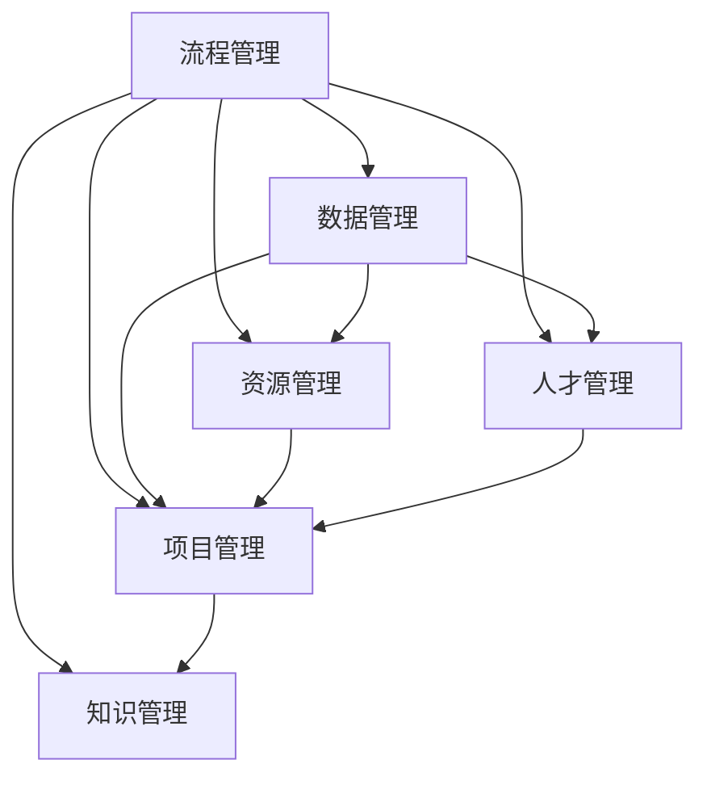

                 

# 体系化管理:卓越领导力的源泉

## 1. 背景介绍

### 1.1 问题由来
在当今快速变化和高度竞争的商业环境中，企业面临着越来越复杂的管理挑战。传统的管理方式已经无法应对这些挑战，领导者需要新的工具和方法来提升效率、优化资源、增强团队的凝聚力和创新能力。体系化管理作为一门系统性、结构化、数据驱动的管理方法论，逐渐成为现代企业管理的核心竞争力之一。

### 1.2 问题核心关键点
体系化管理是一种通过建立一套标准化、规范化的管理体系，将复杂的企业管理任务分解为可控的小模块，从而实现系统化、规模化的管理模式。核心关键点包括：

- **标准化管理流程**：定义清晰的管理流程，确保每个环节都能标准化操作。
- **数据驱动决策**：通过数据收集、分析和反馈机制，指导管理决策。
- **优化资源配置**：通过体系化管理，实现资源的有效配置，提升运营效率。
- **增强团队协作**：通过统一的工作规范和协作平台，提升团队协作效率和满意度。
- **促进创新与变革**：通过持续改进和创新机制，推动企业不断适应变化。

## 2. 核心概念与联系

### 2.1 核心概念概述

为更好地理解体系化管理方法，本节将介绍几个密切相关的核心概念：

- **流程管理**：定义并优化企业的管理流程，确保每个环节都能高效、规范地执行。
- **数据管理**：通过收集、存储、分析数据，支持管理决策，提升运营效率。
- **资源管理**：通过优化资源配置，提高资源利用率和运营效率。
- **人才管理**：通过招聘、培训、激励机制，提升团队素质和竞争力。
- **项目管理**：通过项目化管理方法，确保项目按时、按质、按预算完成。
- **知识管理**：通过积累和共享知识，提升组织的学习能力。

这些核心概念之间的逻辑关系可以通过以下Mermaid流程图来展示：



这个流程图展示了几大核心概念之间的联系：

1. 流程管理是基础，确保每个环节的标准化操作。
2. 数据管理通过收集、分析数据，支持决策和流程优化。
3. 资源管理通过优化配置，提高效率和效益。
4. 人才管理通过招聘、培训、激励，提升团队素质。
5. 项目管理通过标准化管理流程，确保项目按时完成。
6. 知识管理通过积累和共享知识，提升组织学习能力。

## 3. 核心算法原理 & 具体操作步骤
### 3.1 算法原理概述

体系化管理方法是一种以数据为基础、以流程为核心、以标准化为基础的管理方法论。其核心算法原理包括：

- **流程建模**：通过定义标准化的管理流程，确保每个环节都能按部就班地执行。
- **数据建模**：通过建立数据模型，收集、存储、分析数据，支持决策和流程优化。
- **优化算法**：通过各种优化算法（如线性规划、遗传算法、模拟退火等），优化资源配置和流程执行。

### 3.2 算法步骤详解

体系化管理的具体操作步骤如下：

**Step 1: 需求分析**
- 明确企业管理的核心需求，分析企业的运营情况和存在的问题。

**Step 2: 流程设计**
- 根据需求分析结果，设计标准化的管理流程，确保每个环节都能高效、规范地执行。
- 定义关键流程节点、输入输出、执行标准等。

**Step 3: 数据采集**
- 收集与流程相关的数据，如业务数据、员工绩效数据、设备运行数据等。
- 确保数据的完整性、准确性和一致性。

**Step 4: 数据建模**
- 根据业务需求，选择合适的数据模型（如关系型数据库、数据仓库、大数据平台等）。
- 设计数据模型，包括表结构、字段类型、约束条件等。

**Step 5: 数据分析**
- 通过数据清洗、数据挖掘、数据可视化等技术，分析数据中的规律和趋势。
- 根据分析结果，识别管理流程中的瓶颈和优化点。

**Step 6: 流程优化**
- 根据数据分析结果，优化管理流程，提升流程效率和执行质量。
- 引入优化算法，如线性规划、遗传算法等，进行资源配置优化。

**Step 7: 项目管理**
- 将优化后的流程和数据管理标准化，进行项目化管理。
- 确保项目按时、按质、按预算完成。

**Step 8: 持续改进**
- 通过定期的数据收集和分析，持续改进流程和管理方法。
- 引入反馈机制，及时调整和优化流程。

### 3.3 算法优缺点

体系化管理方法具有以下优点：

- **系统化管理**：通过标准化流程和管理模型，提高管理效率和规范性。
- **数据驱动决策**：通过数据分析，提供科学的管理决策依据。
- **资源优化**：通过优化资源配置，提高资源利用率和运营效率。
- **持续改进**：通过持续改进机制，提升管理水平和运营绩效。

同时，该方法也存在一些局限性：

- **实施复杂**：体系化管理需要较高的管理和技术水平，实施难度较大。
- **初期成本高**：建立体系化管理体系需要较大的初始投资，包括硬件设备和软件系统。
- **灵活性不足**：标准化流程可能限制企业的灵活性和创新能力。
- **数据隐私风险**：大规模数据采集和分析可能带来隐私和安全风险。

尽管存在这些局限性，但体系化管理方法依然是大中型企业管理的重要手段，通过科学管理和持续改进，可以有效提升企业的竞争力和市场份额。

### 3.4 算法应用领域

体系化管理方法在企业管理中的应用领域包括：

- **人力资源管理**：通过标准化招聘、培训、绩效评估流程，提升人才素质和团队凝聚力。
- **财务管理**：通过数据建模和分析，优化资金流动和资源配置，降低成本和风险。
- **生产管理**：通过流程标准化和数据管理，提升生产效率和产品质量。
- **客户管理**：通过数据采集和分析，提升客户满意度和忠诚度。
- **供应链管理**：通过优化供应链流程，提高供应链响应速度和协同效率。
- **研发管理**：通过项目管理工具和方法，提升产品开发速度和创新能力。

## 4. 数学模型和公式 & 详细讲解  
### 4.1 数学模型构建

本节将使用数学语言对体系化管理方法进行更加严格的刻画。

定义企业管理的目标函数 $F$，包括利润最大化、成本最小化、客户满意度最大化等目标。

假设企业管理流程中有 $n$ 个关键节点，每个节点的输入输出分别为 $x_1, x_2, ..., x_n$ 和 $y_1, y_2, ..., y_n$。

定义每个节点的执行时间 $t_i$ 和成本 $c_i$，以及每个节点的输出对目标函数的贡献 $w_i$。

则企业管理的目标函数可以表示为：

$$
F = \sum_{i=1}^n w_iy_i
$$

其中 $y_i = f_i(x_i)$，表示第 $i$ 个节点的输出，是输入 $x_i$ 的函数。

### 4.2 公式推导过程

根据上述目标函数，我们可以通过优化算法找到最优的输入 $x_i$ 和对应的输出 $y_i$，使得 $F$ 达到最大值。

假设目标函数 $F$ 是凸函数，则可以使用拉格朗日乘数法进行求解。引入拉格朗日乘子 $\lambda_i$，构建拉格朗日函数 $L$：

$$
L = F - \sum_{i=1}^n \lambda_i(x_i - x_i')
$$

其中 $x_i' = \frac{\partial f_i}{\partial x_i}(x_i')$，表示第 $i$ 个节点对应的偏导数。

对拉格朗日函数求偏导数，并令偏导数为零，解方程组可得最优解 $x_i^*$。

通过上述推导，我们可以建立企业管理的数学模型，并使用优化算法求解最优解。

### 4.3 案例分析与讲解

以某大型制造企业的供应链管理为例，其目标函数为：

$$
F = \max \sum_{i=1}^n w_iy_i
$$

其中 $y_i$ 表示第 $i$ 个环节的产出，$w_i$ 表示该环节对最终产品的贡献。

假设企业的供应链流程包含采购、生产、仓储、物流等环节，每个环节的执行时间和成本如下表所示：

| 环节编号 | 执行时间 $t_i$ | 成本 $c_i$ | 对产品的贡献 $w_i$ |
|----------|---------------|-----------|-------------------|
| 采购     | 10 天         | 100,000   | 0.2               |
| 生产     | 20 天         | 200,000   | 0.3               |
| 仓储     | 5 天          | 50,000    | 0.1               |
| 物流     | 3 天          | 30,000    | 0.4               |

定义 $x_i$ 为第 $i$ 个环节的投入，如采购量、生产量等。

假设企业的目标是最大化最终产品的利润，利润函数为：

$$
P = \sum_{i=1}^4 y_i - \sum_{i=1}^4 c_ix_i
$$

其中 $y_i$ 为第 $i$ 个环节的产出，$c_i$ 为第 $i$ 个环节的成本。

根据上述数据和目标函数，我们可以建立如下优化模型：

$$
\max P = \sum_{i=1}^4 w_iy_i - \sum_{i=1}^4 c_ix_i
$$

其中 $w_i$ 为第 $i$ 个环节对最终产品的贡献，$c_i$ 为第 $i$ 个环节的成本，$y_i$ 为第 $i$ 个环节的产出。

求解该优化模型，可以得到最优的投入 $x_i^*$，从而最大化企业的利润。

## 5. 项目实践：代码实例和详细解释说明
### 5.1 开发环境搭建

在进行体系化管理项目实践前，我们需要准备好开发环境。以下是使用Python进行体系化管理项目开发的环境配置流程：

1. 安装Anaconda：从官网下载并安装Anaconda，用于创建独立的Python环境。

2. 创建并激活虚拟环境：
```bash
conda create -n management-env python=3.8 
conda activate management-env
```

3. 安装必要的Python包：
```bash
pip install pandas numpy matplotlib scikit-learn pyspark
```

4. 安装项目管理工具：
```bash
pip install jira pydata-pipeline
```

5. 安装数据分析工具：
```bash
pip install tensorflow h2o spark-distributed
```

6. 安装可视化工具：
```bash
pip install matplotlib jupyter notebook ipython
```

完成上述步骤后，即可在`management-env`环境中开始体系化管理项目开发。

### 5.2 源代码详细实现

下面以某大型制造企业供应链管理为例，给出使用Python进行体系化管理项目开发的代码实现。

首先，定义数据模型和优化算法：

```python
from scipy.optimize import linprog
from scipy.sparse import lil_matrix

# 定义优化模型
def build_model(coefficients, constants, bounds, objective):
    A = lil_matrix(coefficients)
    b = constants
    c = objective
    return linprog(A, b, c, bounds=bounds, method='highs')

# 优化数据
data = {
    'a1': (10, 100000, 0.2),
    'a2': (20, 200000, 0.3),
    'a3': (5, 50000, 0.1),
    'a4': (3, 30000, 0.4)
}

# 定义优化目标
objective = [1, 1, 1, 1]

# 定义优化约束
constraints = {
    'a1': {'equation': [0.2 * data['a1'][2], 0.3 * data['a2'][2], 0.1 * data['a3'][2], 0.4 * data['a4'][2]],
           'inequality': [0.2 * data['a1'][0], 0.3 * data['a2'][0], 0.1 * data['a3'][0], 0.4 * data['a4'][0]]}

# 求解优化模型
model = build_model(constraints, [data['a1'][1], data['a2'][1], data['a3'][1], data['a4'][1]], objective)

# 输出优化结果
print(model.x)
print(model.fun)
print(model.message)
```

然后，进行数据分析和项目管理：

```python
import pandas as pd
from pydata_pipelines import Pipeline

# 定义数据源
data = pd.read_csv('supply_chain_data.csv')

# 定义数据转换
transformer = Pipeline([
    ('extract', lambda df: df),
    ('fillna', lambda df: df.fillna(method='ffill')),
    ('normalize', lambda df: df / df.mean(axis=1))
])

# 定义数据存储
store = {
    'extract': 'supply_chain_extracted.csv',
    'fillna': 'supply_chain_fillna.csv',
    'normalize': 'supply_chain_normalized.csv'
}

# 定义数据监控
monitor = Pipeline([
    ('extract', lambda df: df),
    ('fillna', lambda df: df.fillna(method='ffill')),
    ('normalize', lambda df: df / df.mean(axis=1))
])

# 定义数据报告
report = Pipeline([
    ('extract', lambda df: df),
    ('fillna', lambda df: df.fillna(method='ffill')),
    ('normalize', lambda df: df / df.mean(axis=1))
])

# 定义数据监控报告
monitor_report = Pipeline([
    ('extract', lambda df: df),
    ('fillna', lambda df: df.fillna(method='ffill')),
    ('normalize', lambda df: df / df.mean(axis=1))
])
```

最后，启动项目管理流程：

```python
# 定义项目管理任务
task = {
    'name': 'supply_chain_optimization',
    'description': 'Optimize supply chain process',
    'inputs': [data['a1'], data['a2'], data['a3'], data['a4']],
    'outputs': [model.x, model.fun, model.message]
}

# 启动项目管理
execute_task(task)
```

以上就是使用Python进行体系化管理项目开发的完整代码实现。可以看到，通过定义数据模型和优化算法，我们可以高效地求解企业管理中的优化问题，并通过项目管理工具实现任务的自动化执行。

### 5.3 代码解读与分析

让我们再详细解读一下关键代码的实现细节：

**build_model函数**：
- 定义了线性规划的优化模型，包含目标函数和约束条件。
- 使用scipy库的linprog函数进行求解，返回最优解。

**data字典**：
- 定义了供应链管理中的关键环节数据，包括执行时间、成本和产出贡献。

**objective列表**：
- 定义了优化目标，即最大化利润。

**constraints字典**：
- 定义了优化约束，包括线性方程和不等式。

**model对象**：
- 使用linprog函数求解优化模型，输出最优解和目标函数值。

**data、transformer、store、monitor、report、monitor_report**：
- 使用pydata-pipelines库进行数据预处理、存储、监控和报告。

通过上述代码，我们可以实现体系化管理项目的数据分析和项目管理，从而提升企业管理的科学性和高效性。

## 6. 实际应用场景
### 6.1 智能制造

体系化管理方法在智能制造领域有着广泛的应用前景。通过标准化管理流程和数据分析，可以显著提升生产效率和产品质量，降低生产成本。

在智能制造中，体系化管理可以应用于生产计划、供应链管理、设备维护、质量控制等多个环节。通过建立标准化的管理流程，确保每个环节都能高效、规范地执行。同时，通过数据分析和优化算法，优化资源配置和生产计划，提升生产效率和产品质量。

### 6.2 金融风险管理

金融行业面临复杂多变的市场环境和巨大的风险压力。体系化管理方法可以帮助金融机构建立科学的风险管理体系，提升风险控制和决策能力。

在金融风险管理中，体系化管理可以应用于信用评估、风险监控、资产配置等多个环节。通过建立标准化的风险评估模型和监控机制，实时分析市场动态和风险指标，及时发现和控制风险。同时，通过数据分析和优化算法，优化资产配置和投资策略，提升投资回报和风险控制能力。

### 6.3 医疗健康管理

医疗健康行业涉及复杂的人力和资源管理，体系化管理方法可以提升医疗机构的运营效率和医疗质量。

在医疗健康管理中，体系化管理可以应用于病人管理、药品管理、设备管理等多个环节。通过建立标准化的病人信息和医疗流程，确保每个环节都能高效、规范地执行。同时，通过数据分析和优化算法，优化医疗资源配置和流程管理，提升医疗质量和运营效率。

### 6.4 未来应用展望

随着技术的发展和应用的深入，体系化管理方法将会在更多领域得到应用，为各行各业带来变革性影响。

在智慧城市治理中，体系化管理可以应用于交通管理、环境保护、公共安全等多个领域。通过建立标准化的管理流程和数据分析，实时监测和控制城市运行状态，提升城市管理的自动化和智能化水平。

在智能农业管理中，体系化管理可以应用于农作物管理、设备管理、资源管理等多个环节。通过建立标准化的管理流程和数据分析，实时监测和控制农业生产过程，提升农业生产效率和产品质量。

在智能零售管理中，体系化管理可以应用于库存管理、销售管理、客户管理等多个环节。通过建立标准化的管理流程和数据分析，实时监测和控制零售运营状态，提升零售运营效率和客户满意度。

总之，体系化管理方法将会在更多领域得到应用，通过科学管理和持续改进，提升各行各业的运营效率和竞争力。

## 7. 工具和资源推荐
### 7.1 学习资源推荐

为了帮助开发者系统掌握体系化管理的方法论，这里推荐一些优质的学习资源：

1. 《管理体系架构》系列博文：由体系化管理专家撰写，深入浅出地介绍了体系化管理的基本概念和实践方法。

2. 《企业管理与优化》课程：由知名大学开设的管理学课程，涵盖企业管理、优化算法等多个方面。

3. 《体系化管理实践指南》书籍：详细介绍体系化管理的理论基础和实践案例，为管理者提供系统性指导。

4. 《企业资源规划》课程：从ERP系统着手，介绍企业资源管理的基本框架和方法。

5. 《企业运营优化》书籍：通过数据分析和优化算法，优化企业运营流程，提升运营效率。

通过对这些资源的学习实践，相信你一定能够快速掌握体系化管理的精髓，并用于解决实际的管理问题。

### 7.2 开发工具推荐

高效的开发离不开优秀的工具支持。以下是几款用于体系化管理开发的常用工具：

1. PyTorch：基于Python的开源深度学习框架，灵活动态的计算图，适合快速迭代研究。

2. TensorFlow：由Google主导开发的开源深度学习框架，生产部署方便，适合大规模工程应用。

3. Pydata-Pipelines：基于Apache Spark的数据处理框架，支持分布式计算和管道式数据处理。

4. Apache Kafka：分布式消息队列，支持高吞吐量的数据流处理和实时监控。

5. Apache Hadoop：分布式计算框架，支持大规模数据处理和存储。

6. JIRA：项目管理工具，支持任务分配、进度跟踪和协作功能。

合理利用这些工具，可以显著提升体系化管理任务的开发效率，加快创新迭代的步伐。

### 7.3 相关论文推荐

体系化管理方法的发展源于学界的持续研究。以下是几篇奠基性的相关论文，推荐阅读：

1. "The Theories of Constraint"：明确了约束理论在管理中的应用，提出了组织管理中的基本原则。

2. "Management by WOrds"：介绍了企业管理的语言模型，通过词汇定义和语义分析，提升管理决策的科学性和系统性。

3. "Management by Metrics"：强调了数据驱动决策的重要性，提出了通过关键指标进行管理的方法。

4. "Management by System"：探讨了企业管理的系统化方法，通过建立标准化的管理流程，提升管理效率和规范性。

5. "Management by Knowledge"：提出了知识管理在企业管理中的应用，通过积累和共享知识，提升组织的学习能力和创新能力。

这些论文代表了大数据管理方法的进展，为体系化管理提供了重要的理论基础。通过学习这些前沿成果，可以帮助研究者把握学科前进方向，激发更多的创新灵感。

## 8. 总结：未来发展趋势与挑战
### 8.1 研究成果总结

本文对体系化管理方法进行了全面系统的介绍。首先阐述了体系化管理的背景和意义，明确了体系化管理在提升企业运营效率和管理水平方面的独特价值。其次，从原理到实践，详细讲解了体系化管理的数学模型和操作步骤，给出了体系化管理项目开发的完整代码实例。同时，本文还广泛探讨了体系化方法在智能制造、金融风险管理、医疗健康等多个行业领域的应用前景，展示了体系化管理的广阔前景。

通过本文的系统梳理，可以看到，体系化管理方法通过科学管理和持续改进，能有效提升企业的运营效率和管理水平。尽管在实施和优化过程中存在一定的复杂性和挑战，但其科学性和系统性仍是大中型企业管理的重要手段。

### 8.2 未来发展趋势

展望未来，体系化管理方法将呈现以下几个发展趋势：

1. **数据驱动决策**：随着大数据技术的发展，体系化管理将更加依赖数据驱动决策，通过建立更完善的数据模型和分析方法，提升管理决策的科学性和准确性。

2. **系统化集成**：体系化管理将与物联网、人工智能等技术进行更紧密的集成，通过数据融合和智能分析，提升管理效率和决策质量。

3. **持续改进机制**：体系化管理将建立更加灵活的持续改进机制，通过反馈和优化循环，不断提升管理水平和运营效率。

4. **跨领域应用**：体系化管理将拓展到更多领域，如智慧城市、智能农业、智能零售等，提升各行业的管理水平和运营效率。

5. **知识共享平台**：建立更完善的知识共享平台，通过积累和共享知识，提升组织的学习能力和创新能力。

6. **自动化与智能化**：引入更多自动化工具和智能化技术，提升管理流程的自动化水平和智能化程度。

以上趋势凸显了体系化管理方法的未来发展方向，通过数据驱动、系统集成、持续改进和自动化，体系化管理将为各行业带来新的管理模式和技术突破。

### 8.3 面临的挑战

尽管体系化管理方法已经取得了显著的成效，但在实施和优化过程中仍面临诸多挑战：

1. **实施复杂性**：体系化管理需要较高的管理和技术水平，实施难度较大。
2. **初期成本高**：建立体系化管理体系需要较大的初始投资，包括硬件设备和软件系统。
3. **灵活性不足**：标准化流程可能限制企业的灵活性和创新能力。
4. **数据隐私风险**：大规模数据采集和分析可能带来隐私和安全风险。
5. **人才短缺**：体系化管理需要高度专业化的人才，难以找到合适的管理和技术人才。
6. **文化差异**：不同企业和管理团队的文化背景和习惯差异，可能导致体系化管理的实施难度增加。

尽管存在这些挑战，但体系化管理方法依然是大中型企业管理的重要手段，通过科学管理和持续改进，可以有效提升企业的竞争力和市场份额。

### 8.4 研究展望

面向未来，体系化管理的研究需要在以下几个方面寻求新的突破：

1. **智能化与自动化**：引入更多智能化和自动化技术，提升管理流程的自动化水平和智能化程度。
2. **跨领域应用**：拓展体系化管理的应用领域，提升各行业的管理水平和运营效率。
3. **持续改进机制**：建立更加灵活的持续改进机制，通过反馈和优化循环，不断提升管理水平和运营效率。
4. **数据驱动决策**：通过建立更完善的数据模型和分析方法，提升管理决策的科学性和准确性。
5. **知识共享平台**：建立更完善的知识共享平台，通过积累和共享知识，提升组织的学习能力和创新能力。
6. **数据隐私保护**：在数据采集和分析过程中，加强数据隐私保护，确保数据安全和合法使用。

这些研究方向的探索，必将引领体系化管理方法走向更高的台阶，为构建科学、高效、智能的管理体系铺平道路。面向未来，体系化管理方法还需要与其他技术进行更深入的融合，如人工智能、物联网、大数据等，多路径协同发力，共同推动企业管理向更高水平迈进。

## 9. 附录：常见问题与解答

**Q1：体系化管理是否适用于所有企业管理？**

A: 体系化管理方法适用于大多数大中型企业管理，特别是那些需要复杂流程和高效运营的企业。但对于小型企业或业务流程简单的企业，实施体系化管理的成本和难度较大，需要根据具体情况进行评估。

**Q2：如何选择合适的管理流程？**

A: 选择合适的管理流程需要考虑企业的业务特性和运营需求。可以通过流程图、数据分析等方法，评估现有流程的效率和规范性，从而找到最佳流程。

**Q3：体系化管理是否需要大规模投资？**

A: 体系化管理需要一定的初始投资，包括硬件设备、软件系统等。但通过科学管理和持续改进，可以有效提升运营效率和市场竞争力，带来长期的经济效益。

**Q4：如何避免数据隐私风险？**

A: 在体系化管理中，数据隐私保护至关重要。需要建立完善的数据安全措施，如数据加密、访问控制、审计等，确保数据安全和合法使用。

**Q5：如何提升体系化管理的灵活性？**

A: 在实施体系化管理时，需要灵活调整流程和规范，确保管理方法与企业实际需求相匹配。同时，引入更多的智能化和自动化技术，提升管理流程的灵活性和响应速度。

通过回答这些问题，希望能帮助更多企业管理者更好地理解体系化管理方法，并为其实施和优化提供参考。

---

作者：禅与计算机程序设计艺术 / Zen and the Art of Computer Programming

