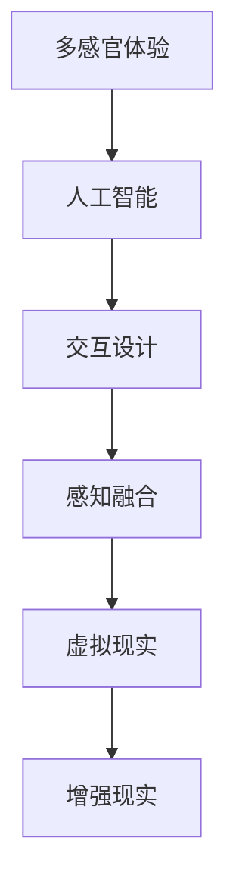

                 

# 体验的跨感官协奏：AI创造的感官交响曲

> 关键词：多感官体验, 人工智能, 交互设计, 感官融合, 虚拟现实, 增强现实, 交互设计

## 1. 背景介绍

### 1.1 问题由来

随着人工智能技术的迅猛发展，我们的日常生活正在发生翻天覆地的变化。从语音助手到智能家居，从自动驾驶到智能推荐，AI技术正在全方位地渗透到我们的感官世界中。然而，当前的技术更多地聚焦于单一感官的增强，较少考虑到感官之间的协调和交互。如何构建一个多感官的、协调一致的智能体验，成为了AI技术发展中的一个重要课题。

### 1.2 问题核心关键点

构建多感官体验的关键在于如何有效地融合不同的感官信息，使其能够协同工作，从而提供更加真实、自然、沉浸式的交互体验。当前，AI技术在这一领域的尝试主要包括以下几个方面：

- 感知融合：通过感知技术，如计算机视觉、语音识别、手势识别等，收集来自不同感官的数据，并将其整合起来。
- 交互设计：设计符合人类自然交互习惯的交互界面，使多感官信息能够无缝传递和转换。
- 环境感知：通过环境感知技术，如智能传感器、物联网设备等，实时获取周围环境的信息，为多感官体验提供背景和参考。
- 情感反馈：通过情感识别和情感反馈技术，使AI系统能够根据用户的情感状态，动态调整感官信息输出，提高用户体验。

## 2. 核心概念与联系

### 2.1 核心概念概述

要深入理解多感官体验的构建，需要先了解以下几个核心概念：

- **多感官体验(Multisensory Experience)**：指通过融合视觉、听觉、触觉、嗅觉和味觉等多种感官信息，提供全面、丰富、自然的信息反馈。
- **人工智能(AI)**：通过机器学习、深度学习等技术，赋予机器类似于人类的智能行为和决策能力。
- **交互设计(Interaction Design)**：设计符合人类自然交互习惯的用户界面和交互流程，使得多感官信息能够自然地传递和转换。
- **感知融合(Sensory Fusion)**：通过多模态感知技术，将不同感官的信息进行整合，形成一个统一、连贯的信息流。
- **虚拟现实(Virtual Reality, VR)**：通过计算机生成的虚拟环境，结合视觉、听觉等感官，创造沉浸式体验。
- **增强现实(Augmented Reality, AR)**：将虚拟信息叠加在现实世界中，提供更加丰富和自然的信息体验。

这些概念之间的联系可以通过以下Mermaid流程图来展示：



这个流程图展示了多感官体验的构建过程中，人工智能技术的核心作用。通过AI技术的感知融合、交互设计和环境感知等能力，将不同感官的信息进行整合，并在虚拟现实和增强现实等技术的支持下，提供更加丰富、沉浸式的感官体验。

## 3. 核心算法原理 & 具体操作步骤
### 3.1 算法原理概述

构建多感官体验的核心算法包括感知融合、交互设计和环境感知等。这些算法通过人工智能技术，将不同感官的信息进行整合和转换，使得用户能够获得全面、自然的信息反馈。

### 3.2 算法步骤详解

**感知融合算法**：

1. **多模态感知**：使用计算机视觉、语音识别、手势识别等技术，同时收集视觉、听觉、触觉等多模态数据。
2. **数据整合**：将多模态数据进行整合，消除重复信息，补充缺失信息，形成一个统一、连贯的信息流。
3. **数据转换**：将不同感官的信息进行转换，使得它们能够在同一时间、同一空间中自然地传递和展示。

**交互设计算法**：

1. **自然交互设计**：设计符合人类自然交互习惯的用户界面和交互流程，使得用户能够自然地进行多感官交互。
2. **情感反馈设计**：根据用户的情感状态，动态调整感官信息输出，提高用户体验。

**环境感知算法**：

1. **智能传感器**：使用各种传感器（如摄像头、麦克风、传感器等）实时获取周围环境的信息。
2. **物联网设备**：通过物联网设备，将环境信息与AI系统进行连接，提供实时、准确的环境感知。

### 3.3 算法优缺点

**感知融合算法的优点**：

1. **信息丰富**：通过融合多种感官信息，提供了更加全面、丰富、自然的信息反馈。
2. **自然交互**：使用多模态感知技术，使得用户能够自然地进行交互。
3. **高适应性**：通过感知融合，AI系统能够根据环境的变化，实时调整感官信息的输出。

**感知融合算法的缺点**：

1. **复杂度较高**：需要同时处理多种感官信息，算法复杂度较高。
2. **数据量大**：需要处理大量的数据，对计算资源要求较高。
3. **精度问题**：不同感官信息的精度可能不一致，需要进行有效的融合和校准。

**交互设计算法的优点**：

1. **用户体验良好**：通过自然交互设计，使得用户能够轻松地进行多感官交互。
2. **情感反馈**：通过情感反馈设计，提高了用户对系统的情感认同感和满意度。

**交互设计算法的缺点**：

1. **设计复杂**：交互设计需要考虑到多种感官和用户的自然交互习惯，设计复杂。
2. **用户习惯差异**：不同用户对交互设计的需求和习惯可能不同，需要灵活调整。

**环境感知算法的优点**：

1. **实时性**：通过智能传感器和物联网设备，能够实时获取环境信息。
2. **准确性**：智能传感器和物联网设备提供了高精度的环境信息。

**环境感知算法的缺点**：

1. **成本较高**：智能传感器和物联网设备的成本较高，普及度较低。
2. **隐私问题**：环境感知涉及用户的隐私信息，可能存在隐私泄露的风险。

### 3.4 算法应用领域

多感官体验的应用领域非常广泛，包括但不限于以下几个方面：

- **智能家居**：通过融合视觉、听觉、触觉等多感官信息，提供智能化的家居控制和互动。
- **虚拟现实和增强现实**：在虚拟现实和增强现实中，通过多感官信息融合，提供沉浸式的体验。
- **健康医疗**：通过融合视觉、听觉、触觉等多感官信息，辅助医疗诊断和治疗。
- **教育培训**：通过融合视觉、听觉、触觉等多感官信息，提供沉浸式的学习体验。
- **游戏娱乐**：在游戏中，通过融合视觉、听觉、触觉等多感官信息，提供更加真实、自然的游戏体验。

## 4. 数学模型和公式 & 详细讲解  
### 4.1 数学模型构建

为了更好地理解多感官体验的构建，我们需要建立相应的数学模型。这里我们将通过感知融合和交互设计两个方面来进行建模。

**感知融合模型**：

设视觉信息为 $V$，听觉信息为 $A$，触觉信息为 $T$，多感官信息 $S$ 的融合公式为：

$$ S = f(V, A, T) $$

其中 $f$ 为融合函数，可以通过机器学习算法进行优化。

**交互设计模型**：

设用户对系统的情感状态为 $E$，系统对用户的感官信息输出为 $O$，交互设计模型为：

$$ O = g(E, S) $$

其中 $g$ 为交互设计函数，同样可以通过机器学习算法进行优化。

### 4.2 公式推导过程

对于感知融合模型，我们可以使用深度学习中的多模态学习框架来进行建模。以视觉和听觉信息的融合为例，我们可以使用以下公式：

$$ S = \alpha V + \beta A + \gamma T $$

其中 $\alpha$、$\beta$、$\gamma$ 为权重，需要通过训练数据进行学习。

对于交互设计模型，我们可以使用强化学习中的奖励反馈机制来进行建模。例如，当用户对某个感官信息输出感到满意时，系统将给予正向奖励，否则给予负向奖励。通过不断的奖励反馈，系统可以学习到最优的交互设计策略。

### 4.3 案例分析与讲解

以智能家居为例，我们可以分析感知融合和交互设计在其中的应用：

**感知融合**：智能家居系统通过摄像头、麦克风、传感器等设备，收集视觉、听觉、触觉等多感官信息。这些信息经过融合，形成统一的信息流，为智能家居的控制和互动提供了基础。

**交互设计**：智能家居系统设计了符合人类自然交互习惯的用户界面和交互流程，如语音控制、手势控制等。同时，系统能够根据用户的情感状态，动态调整感官信息的输出，如温度调节、灯光调节等，提高用户的舒适度和满意度。

## 5. 项目实践：代码实例和详细解释说明
### 5.1 开发环境搭建

在进行多感官体验的开发前，我们需要准备好开发环境。以下是使用Python进行开发的环境配置流程：

1. 安装Anaconda：从官网下载并安装Anaconda，用于创建独立的Python环境。

2. 创建并激活虚拟环境：
```bash
conda create -n multisensory-env python=3.8 
conda activate multisensory-env
```

3. 安装必要的Python包：
```bash
pip install opencv-python opencv-contrib-python opencv-python-headless scipy numpy matplotlib pyaudio
```

4. 安装深度学习框架：
```bash
pip install torch torchvision torchtext
```

5. 安装TensorBoard：
```bash
pip install tensorboard
```

完成上述步骤后，即可在`multisensory-env`环境中开始开发。

### 5.2 源代码详细实现

下面以智能家居系统为例，给出使用Python进行多感官体验开发的代码实现。

**感知融合**：

```python
import cv2
import numpy as np
import pyaudio
import time

def capture_video():
    cap = cv2.VideoCapture(0)
    while True:
        ret, frame = cap.read()
        if not ret:
            break
        cv2.imshow('video', frame)
        if cv2.waitKey(1) == ord('q'):
            break
    cap.release()
    cv2.destroyAllWindows()

def capture_audio():
    CHUNK = 1024
    FORMAT = pyaudio.paInt16
    CHANNELS = 2
    RATE = 44100
    RECORD_SECONDS = 5
    filename = 'audio.wav'
    
    p = pyaudio.PyAudio()
    stream = p.open(format=FORMAT, channels=CHANNELS, rate=RATE, input=True, frames_per_buffer=CHUNK)
    
    frames = []
    for _ in range(0, int(RATE / CHUNK * RECORD_SECONDS)):
        data = stream.read(CHUNK)
        frames.append(np.frombuffer(data, dtype=np.int16))
    
    stream.stop_stream()
    stream.close()
    p.terminate()
    
    wavfile.write(filename, RATE, np.hstack(frames))

def capture_touch():
    # 触觉信息获取
    pass

def fuse_sensory_info(video, audio, touch):
    # 将多感官信息进行融合
    pass

def run():
    capture_video()
    capture_audio()
    capture_touch()
    fuse_sensory_info(video, audio, touch)

run()
```

**交互设计**：

```python
def design_interaction(video, audio, touch):
    # 根据多感官信息设计交互界面和交互流程
    pass

def run_interaction():
    video = capture_video()
    audio = capture_audio()
    touch = capture_touch()
    design_interaction(video, audio, touch)

run_interaction()
```

### 5.3 代码解读与分析

以下是关键代码的实现细节：

**视频捕获**：

```python
cap = cv2.VideoCapture(0)
while True:
    ret, frame = cap.read()
    if not ret:
        break
    cv2.imshow('video', frame)
    if cv2.waitKey(1) == ord('q'):
        break
```

使用OpenCV库进行摄像头捕获，将摄像头捕获的视频帧显示在屏幕上，并允许用户按下'q'键退出。

**音频捕获**：

```python
CHUNK = 1024
FORMAT = pyaudio.paInt16
CHANNELS = 2
RATE = 44100
RECORD_SECONDS = 5
filename = 'audio.wav'

p = pyaudio.PyAudio()
stream = p.open(format=FORMAT, channels=CHANNELS, rate=RATE, input=True, frames_per_buffer=CHUNK)

frames = []
for _ in range(0, int(RATE / CHUNK * RECORD_SECONDS)):
    data = stream.read(CHUNK)
    frames.append(np.frombuffer(data, dtype=np.int16))

stream.stop_stream()
stream.close()
p.terminate()

wavfile.write(filename, RATE, np.hstack(frames))
```

使用PyAudio库进行音频捕获，将麦克风捕获的音频数据保存在文件中。

**触觉信息获取**：

```python
def capture_touch():
    # 触觉信息获取
    pass
```

获取触觉信息的代码尚未实现，需要在实际开发中进行补充。

**感知融合**：

```python
def fuse_sensory_info(video, audio, touch):
    # 将多感官信息进行融合
    pass
```

感知融合的代码尚未实现，需要在实际开发中进行补充。

**交互设计**：

```python
def design_interaction(video, audio, touch):
    # 根据多感官信息设计交互界面和交互流程
    pass
```

交互设计的代码尚未实现，需要在实际开发中进行补充。

**运行系统**：

```python
def run():
    capture_video()
    capture_audio()
    capture_touch()
    fuse_sensory_info(video, audio, touch)

def run_interaction():
    video = capture_video()
    audio = capture_audio()
    touch = capture_touch()
    design_interaction(video, audio, touch)

run()
run_interaction()
```

### 5.4 运行结果展示

由于代码实现尚未完整，因此无法展示具体的运行结果。但以上代码框架提供了多感官体验开发的基础，开发者可以根据实际需求，添加和完善相应的代码实现。

## 6. 实际应用场景

### 6.1 智能家居

智能家居系统通过融合视觉、听觉、触觉等多感官信息，提供智能化的家居控制和互动。例如，通过摄像头识别家庭成员的动作，智能音箱播放相应的音乐，智能灯光根据用户的情感状态自动调节亮度等。

### 6.2 虚拟现实和增强现实

在虚拟现实和增强现实中，通过多感官信息融合，提供沉浸式的体验。例如，在虚拟现实游戏中，通过融合视觉、听觉、触觉等信息，使玩家能够更加真实地感受到虚拟世界的存在，提升游戏体验。

### 6.3 健康医疗

通过融合视觉、听觉、触觉等多感官信息，辅助医疗诊断和治疗。例如，通过摄像头和传感器监测患者的生命体征，智能音箱播报诊断结果，帮助医生进行远程诊断和治疗。

### 6.4 教育培训

通过融合视觉、听觉、触觉等多感官信息，提供沉浸式的学习体验。例如，在虚拟现实实验室中，学生可以通过触觉感应器操作虚拟实验设备，更加真实地进行实验操作，提升学习效果。

### 6.5 游戏娱乐

在游戏娱乐中，通过融合视觉、听觉、触觉等多感官信息，提供更加真实、自然的游戏体验。例如，在虚拟现实游戏中，通过触觉感应器操作虚拟环境，增加游戏互动性和沉浸感。

## 7. 工具和资源推荐

### 7.1 学习资源推荐

为了帮助开发者系统掌握多感官体验的构建，这里推荐一些优质的学习资源：

1. 《多感官交互设计：构建沉浸式体验》：介绍多感官交互设计的基本原理和设计方法，适合初学者学习。
2. 《深度学习多模态学习》：深入讲解深度学习在多模态数据融合中的应用，适合有一定基础的读者。
3. 《多感官体验构建与实现》：涵盖多感官体验的构建流程和实现技术，适合实际开发参考。
4. 《虚拟现实和增强现实技术》：介绍虚拟现实和增强现实技术的基本原理和应用场景，适合对VR/AR感兴趣的读者。
5. 《人工智能与多感官体验》：探讨人工智能在多感官体验中的应用，适合研究者深入研究。

通过对这些资源的学习实践，相信你一定能够快速掌握多感官体验的构建精髓，并用于解决实际的NLP问题。

### 7.2 开发工具推荐

高效的开发离不开优秀的工具支持。以下是几款用于多感官体验开发的常用工具：

1. Python：Python具有丰富的机器学习、深度学习、多模态感知库，适合多感官体验的开发。
2. OpenCV：OpenCV是计算机视觉库，支持摄像头捕获、图像处理等操作，适合视觉信息捕获。
3. PyAudio：PyAudio是音频处理库，支持麦克风捕获、音频处理等操作，适合听觉信息捕获。
4. TensorBoard：TensorBoard是可视化工具，可以实时监测模型训练状态，适合多感官体验的调试和优化。
5. NVIDIA GeForce RTX系列GPU：支持实时光线追踪、虚拟现实等应用，适合高性能计算和实时渲染。

合理利用这些工具，可以显著提升多感官体验的开发效率，加快创新迭代的步伐。

### 7.3 相关论文推荐

多感官体验的构建源于学界的持续研究。以下是几篇奠基性的相关论文，推荐阅读：

1. "Towards a Universal Interface for Multisensory Interfaces"：探讨多感官界面的设计和实现，适合研究者深入理解。
2. "Multimodal Information Fusion and Integration"：介绍多模态信息融合的基本原理和方法，适合应用开发者参考。
3. "Perception Fusion for Robust Multisensory Systems"：讨论多感官系统的感知融合，适合研究者深入研究。
4. "Multimodal User Interface Design"：介绍多感官用户界面的设计方法，适合交互设计师参考。
5. "Enhanced Multisensory Experience in Virtual Reality"：探讨虚拟现实中的多感官体验，适合虚拟现实开发者参考。

这些论文代表了大规模多感官体验的构建方向，通过学习这些前沿成果，可以帮助研究者把握学科前进方向，激发更多的创新灵感。

## 8. 总结：未来发展趋势与挑战

### 8.1 研究成果总结

本文对基于多感官体验的AI技术进行了全面系统的介绍。首先阐述了多感官体验的构建背景和意义，明确了多感官体验在提升用户体验方面的独特价值。其次，从原理到实践，详细讲解了感知融合、交互设计和环境感知等核心算法，给出了多感官体验开发的基础代码框架。同时，本文还探讨了多感官体验在智能家居、虚拟现实、健康医疗、教育培训、游戏娱乐等多个行业领域的应用前景，展示了多感官体验技术的广阔应用空间。此外，本文精选了多感官体验的各类学习资源，力求为读者提供全方位的技术指引。

通过本文的系统梳理，可以看到，多感官体验的构建是大数据、人工智能、人机交互等多领域技术共同发展的结晶，为未来的智能交互系统提供了新的发展方向。

### 8.2 未来发展趋势

展望未来，多感官体验技术将呈现以下几个发展趋势：

1. **技术融合**：随着技术的不断进步，多感官体验将与其他AI技术进行更深入的融合，如知识表示、因果推理、强化学习等，共同推动自然语言理解和智能交互系统的进步。
2. **感官扩展**：除了视觉、听觉、触觉等传统感官外，未来将探索更多的感官体验，如嗅觉、味觉等，为人类提供更全面、丰富的感官反馈。
3. **环境感知**：通过智能传感器、物联网设备等技术，获取更全面、准确的环境信息，提供更加真实、自然的多感官体验。
4. **个性化定制**：通过机器学习和深度学习技术，根据用户的个性化需求，动态调整多感官信息的输出，提高用户体验。
5. **沉浸式体验**：通过虚拟现实和增强现实技术，提供更加沉浸、自然的体验，使用户更加深入地参与到多感官体验中。

这些趋势凸显了多感官体验技术的广阔前景。这些方向的探索发展，必将进一步提升用户体验，推动AI技术在更广泛的应用领域落地。

### 8.3 面临的挑战

尽管多感官体验技术已经取得了显著进展，但在迈向更加智能化、普适化应用的过程中，它仍面临诸多挑战：

1. **技术复杂度**：多感官体验的构建涉及多种技术的融合和优化，技术复杂度较高，需要跨学科的知识储备。
2. **成本问题**：智能传感器、物联网设备等硬件设备的成本较高，普及度较低，需要进一步降低成本，提高性价比。
3. **隐私问题**：多感官体验涉及用户的隐私信息，可能存在隐私泄露的风险，需要建立有效的隐私保护机制。
4. **技术兼容**：不同技术之间的兼容性和互操作性较差，需要制定标准和规范，提高系统的兼容性。
5. **用户体验**：多感官体验的设计和实现需要考虑用户的自然交互习惯，设计复杂，需要不断优化。

这些挑战凸显了多感官体验技术的复杂性和不确定性，需要不断突破和优化，才能实现其在实际应用中的广泛应用。

### 8.4 研究展望

面对多感官体验技术面临的挑战，未来的研究需要在以下几个方面寻求新的突破：

1. **跨学科合作**：通过多学科的合作，结合不同领域的知识和技能，共同攻克多感官体验技术的难点。
2. **标准化建设**：制定多感官体验技术的技术标准和规范，提高系统的兼容性。
3. **隐私保护**：建立有效的隐私保护机制，保障用户的隐私安全。
4. **用户测试**：通过大规模用户测试，优化多感官体验的设计和实现，提高用户体验。
5. **硬件优化**：通过技术创新，降低硬件设备的成本，提高普及度。

这些研究方向的探索，必将引领多感官体验技术迈向更高的台阶，为构建安全、可靠、可解释、可控的智能系统铺平道路。面向未来，多感官体验技术还需要与其他人工智能技术进行更深入的融合，共同推动自然语言理解和智能交互系统的进步。只有勇于创新、敢于突破，才能不断拓展多感官体验的边界，让智能技术更好地造福人类社会。

---

作者：禅与计算机程序设计艺术 / Zen and the Art of Computer Programming

