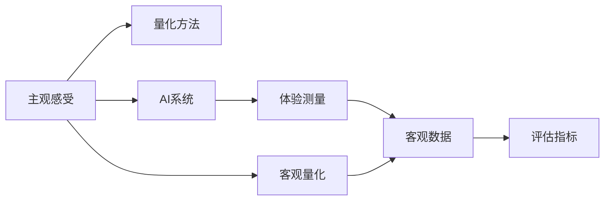

                 

# 体验量化：AI测量主观感受

## 1. 背景介绍

### 1.1 问题由来
近年来，人工智能(AI)技术在各个领域取得了显著的进展，尤其是在计算机视觉、自然语言处理等领域，AI已经能够达到甚至超越人类水平。然而，在许多情况下，AI技术的实际效果并不是以客观指标来衡量的，而是通过人类的主观感受来判断。例如，自动驾驶车辆的安全性、推荐系统的个性化程度等。

为了更准确地评估AI系统的表现，研究人员提出了一系列的量化方法。这些方法通过客观的测量手段来量化人类对AI系统的感受，从而对AI系统的性能进行全面评估。这些方法在AI领域越来越受到重视，成为AI应用落地的重要工具。

### 1.2 问题核心关键点
本文聚焦于如何通过量化方法，全面、客观地评估AI系统的表现。通过量化方法，可以更准确地评估AI系统的性能，提升AI系统的用户接受度和应用效果。

核心关键点包括：
- 主观感受的客观量化方法
- 量化方法在AI系统中的应用
- 量化方法的优势与局限
- 量化方法的最新进展

## 2. 核心概念与联系

### 2.1 核心概念概述

为了更好地理解AI系统的量化方法，本节将介绍几个关键概念：

- 主观感受(Subjective Experience)：指人类对某个产品、系统、服务等的心理感受和评价，通常包括情感、满意度、体验等维度。
- 客观量化(Objective Quantification)：指通过客观的测量手段，将主观感受转化为可以量化的数据，便于评估和比较。
- 量化方法(Quantification Method)：指通过特定的方法和工具，对主观感受进行客观量化的过程。
- AI系统(AI System)：指使用AI技术开发的软件或系统，如推荐系统、聊天机器人等。
- 体验测量(Measurement of Experience)：指通过各种手段，对用户在使用AI系统时的感受进行评估和测量。
- 主观感受与客观测量的联系：通过量化方法，将主观感受转化为客观数据，从而对AI系统的表现进行全面评估。

这些概念之间的联系可以通过以下Mermaid流程图来展示：



这个流程图展示了从主观感受到客观量化再到评估指标的全过程，以及量化方法在其中的重要作用。

## 3. 核心算法原理 & 具体操作步骤
### 3.1 算法原理概述

量化方法的核心原理是将主观感受转化为客观数据，从而进行全面的评估。常见的量化方法包括：

- 问卷调查(Survey)：通过设计问卷，收集用户对AI系统的评价和反馈。
- 数据分析(Analytics)：通过分析用户行为数据，获取用户的体验感受。
- 心理测量(Psychometrics)：通过心理学测量工具，评估用户的情感和满意度。
- 生理测量(Physiological Measurement)：通过测量用户的生理指标，如心率、脑电波等，评估用户的心理状态。

这些方法都有各自的优点和局限，需要根据具体场景选择合适的方法。

### 3.2 算法步骤详解

基于量化方法的量化过程一般包括以下几个步骤：

**Step 1: 设计量化指标**

- 确定需要评估的体验维度，如情感、满意度、操作便捷性等。
- 设计问卷、调查表等工具，收集用户的主观感受。

**Step 2: 收集量化数据**

- 通过问卷调查、数据分析等手段，收集用户的量化数据。
- 使用生理测量设备，收集用户的生理数据。

**Step 3: 数据清洗与预处理**

- 对收集到的数据进行清洗和预处理，去除异常值和噪音。
- 对生理数据进行滤波、归一化等处理。

**Step 4: 数据分析与建模**

- 使用统计分析、机器学习等方法，对数据进行分析建模。
- 计算每个量化指标的得分，生成综合评估报告。

**Step 5: 报告与改进**

- 根据分析结果，生成综合评估报告。
- 根据报告反馈，改进AI系统。

以上是量化方法的量化过程一般流程。在实际应用中，还需要针对具体场景进行优化设计，如改进问卷设计、选择合适的分析工具等，以进一步提升量化效果。

### 3.3 算法优缺点

量化方法在AI系统的应用中，具有以下优点：
1. 客观全面：通过客观的数据分析，避免了主观偏见，对AI系统的表现进行全面评估。
2. 易于操作：量化方法通常使用问卷调查、数据分析等手段，操作简便，易于实施。
3. 数据可复用：通过客观数据，可以多次复用评估结果，跟踪AI系统的效果变化。
4. 辅助改进：根据量化结果，及时发现AI系统的缺陷，进行改进优化。

同时，量化方法也存在一些局限性：
1. 数据质量：数据收集和处理的质量直接影响量化结果的准确性。
2. 复杂性：一些复杂的量化方法，如心理测量、生理测量等，需要专业设备和技术支持。
3. 用户体验：用户可能对问卷调查等方法产生抵触情绪，影响数据收集效果。
4. 局部效应：量化结果可能受到局部现象的影响，难以全面反映整体体验。

尽管存在这些局限性，但就目前而言，量化方法是评估AI系统性能的重要手段。未来相关研究的重点在于如何进一步提高数据质量，降低量化方法的复杂性，同时兼顾用户体验和全局评估。

### 3.4 算法应用领域

量化方法在AI系统的应用非常广泛，具体包括：

- 推荐系统：通过用户评分、行为数据分析，量化推荐系统的效果，提升推荐准确性。
- 聊天机器人：通过用户对话评价，量化聊天机器人的用户体验，提升回答质量。
- 自动驾驶：通过驾驶员生理测量、心理测量，量化自动驾驶车辆的安全性、舒适性，评估系统性能。
- 医疗健康：通过患者反馈、生理数据，量化医疗系统的效用，提升诊断和治疗效果。
- 金融服务：通过用户满意度、操作便捷性等指标，量化金融产品的服务效果，优化用户体验。

此外，量化方法还在教育、零售、旅游等多个领域得到了广泛应用，为AI系统的发展提供了重要支持。

## 4. 数学模型和公式 & 详细讲解 & 举例说明
### 4.1 数学模型构建

量化方法的核心是构建合适的数学模型，将主观感受转化为客观数据。常见的量化模型包括：

- 回归模型(Regression Model)：通过回归分析，计算量化指标的得分。
- 分类模型(Classification Model)：通过分类分析，评估用户的情感和满意度。
- 聚类模型(Clustering Model)：通过聚类分析，对用户进行分组，评估不同群体的体验差异。

以下以回归模型为例，介绍量化模型的构建方法。

### 4.2 公式推导过程

假设我们有一个回归模型，用于量化用户对AI系统的满意度。模型的输入变量包括用户的性别、年龄、使用频率等，输出变量是用户满意度得分。

假设模型为线性回归模型，其形式为：

$$y = \beta_0 + \beta_1 x_1 + \beta_2 x_2 + \cdots + \beta_n x_n + \epsilon$$

其中 $y$ 为用户满意度得分，$x_1, x_2, \cdots, x_n$ 为输入变量，$\beta_0, \beta_1, \beta_2, \cdots, \beta_n$ 为模型参数，$\epsilon$ 为随机误差。

根据线性回归模型的最小二乘法估计，模型的参数可以通过以下公式求解：

$$\hat{\beta} = (X^TX)^{-1}X^Ty$$

其中 $X$ 为输入变量的矩阵，$y$ 为输出变量的向量，$\hat{\beta}$ 为参数的估计值。

在实际应用中，我们可以将用户的问卷调查数据作为输入变量，使用上述公式计算用户满意度的回归系数，从而量化AI系统的表现。

### 4.3 案例分析与讲解

以下以推荐系统为例，展示量化方法的应用。

假设我们有一个推荐系统，用于为用户推荐商品。通过收集用户评分数据，可以使用回归模型量化推荐系统的准确性。具体步骤如下：

1. 收集用户评分数据，包括用户对推荐商品的评分。
2. 将用户的基本信息、浏览历史、购买记录等作为输入变量，构建线性回归模型。
3. 使用回归模型计算每个商品的推荐得分。
4. 根据推荐得分，推荐用户可能感兴趣的商品。

### 5. 项目实践：代码实例和详细解释说明
### 5.1 开发环境搭建

在进行量化方法的实践前，我们需要准备好开发环境。以下是使用Python进行TensorFlow开发的环境配置流程：

1. 安装Anaconda：从官网下载并安装Anaconda，用于创建独立的Python环境。

2. 创建并激活虚拟环境：
```bash
conda create -n tf-env python=3.8 
conda activate tf-env
```

3. 安装TensorFlow：根据CUDA版本，从官网获取对应的安装命令。例如：
```bash
conda install tensorflow tensorflow-cpu -c conda-forge
```

4. 安装Pandas、NumPy等数据处理工具：
```bash
pip install pandas numpy
```

5. 安装Scikit-learn：用于数据建模和分析。
```bash
pip install scikit-learn
```

完成上述步骤后，即可在`tf-env`环境中开始量化方法的实践。

### 5.2 源代码详细实现

下面以回归模型为例，展示使用TensorFlow进行量化方法实现的基本代码。

```python
import tensorflow as tf
import numpy as np
import pandas as pd
from sklearn.model_selection import train_test_split

# 加载数据
data = pd.read_csv('user_feedback.csv')

# 将数据转换为NumPy数组
x = np.array(data[['age', 'gender', 'use_frequency']])
y = np.array(data['satisfaction_score'])

# 将数据分为训练集和测试集
x_train, x_test, y_train, y_test = train_test_split(x, y, test_size=0.2)

# 构建回归模型
model = tf.keras.Sequential([
    tf.keras.layers.Dense(64, activation='relu', input_shape=[x.shape[1]]),
    tf.keras.layers.Dense(1)
])

# 编译模型
model.compile(optimizer='adam', loss='mean_squared_error', metrics=['mae'])

# 训练模型
model.fit(x_train, y_train, epochs=50, batch_size=32, validation_data=(x_test, y_test))

# 预测测试集
y_pred = model.predict(x_test)

# 输出评估指标
mse = tf.keras.metrics.mean_squared_error(y_test, y_pred)
mae = tf.keras.metrics.mean_absolute_error(y_test, y_pred)

print(f'Mean Squared Error: {mse.numpy():.4f}')
print(f'Mean Absolute Error: {mae.numpy():.4f}')
```

以上代码展示了使用TensorFlow进行回归模型训练和评估的基本流程。在实际应用中，还需要根据具体需求对模型进行调整和优化，如选择合适的网络结构、调整超参数等。

### 5.3 代码解读与分析

让我们再详细解读一下关键代码的实现细节：

- 数据加载：使用Pandas加载用户反馈数据，将其转换为NumPy数组。
- 数据划分：将数据划分为训练集和测试集，以便进行模型评估。
- 模型构建：使用TensorFlow构建一个简单的线性回归模型，包含两个全连接层。
- 模型编译：使用Adam优化器和均方误差损失函数编译模型。
- 模型训练：使用训练集数据训练模型，并在测试集上评估模型性能。
- 预测结果：使用训练好的模型对测试集进行预测，并计算评估指标。

可以看到，使用TensorFlow进行量化方法开发相对简单，开发者可以将更多精力放在数据处理、模型设计等高层逻辑上，而不必过多关注底层实现细节。

## 6. 实际应用场景
### 6.1 智能客服系统

量化方法在智能客服系统的应用中，可以全面评估客户对服务的满意度，发现系统缺陷并加以改进。具体步骤如下：

1. 收集客户反馈数据，包括客户的满意度评分、评价内容等。
2. 将客户的基本信息、历史客服记录等作为输入变量，构建回归模型或分类模型。
3. 使用模型计算每个客服人员的满意度得分，并根据得分进行排名。
4. 根据排名结果，发现表现优异的客服人员，并分析其服务优点。
5. 根据排名结果，发现表现较差的客服人员，并分析其服务缺陷。

通过量化方法，客服系统能够实时监控和改进，提升客户满意度，提升服务质量。

### 6.2 自动驾驶

量化方法在自动驾驶系统的应用中，可以全面评估驾驶员和乘客对自动驾驶车辆的感受，发现系统缺陷并加以改进。具体步骤如下：

1. 收集驾驶员和乘客的反馈数据，包括满意度评分、驾驶体验等。
2. 将驾驶员的基本信息、车辆信息等作为输入变量，构建回归模型或分类模型。
3. 使用模型计算自动驾驶车辆的安全性、舒适性得分，并根据得分进行排名。
4. 根据排名结果，发现表现优异的车辆，并分析其驾驶性能。
5. 根据排名结果，发现表现较差的车辆，并分析其驾驶缺陷。

通过量化方法，自动驾驶系统能够实时监控和改进，提升驾驶安全和舒适性，增强用户信任度。

### 6.3 个性化推荐系统

量化方法在个性化推荐系统的应用中，可以全面评估推荐系统的准确性和用户满意度，发现系统缺陷并加以改进。具体步骤如下：

1. 收集用户对推荐商品的评分数据，包括用户的基本信息、浏览历史、购买记录等。
2. 将用户评分数据作为输出变量，构建回归模型或分类模型。
3. 使用模型计算每个商品的推荐得分，并根据得分进行排名。
4. 根据排名结果，发现表现优异的商品，并分析其推荐效果。
5. 根据排名结果，发现表现较差的商品，并分析其推荐缺陷。

通过量化方法，推荐系统能够实时监控和改进，提升推荐准确性和用户满意度，增强用户粘性。

### 6.4 未来应用展望

随着量化方法的不断发展和完善，其在AI系统的应用前景将更加广阔。

在智慧医疗领域，量化方法可以全面评估医疗系统的效用，发现系统缺陷并加以改进，提升医疗服务质量。

在智能教育领域，量化方法可以全面评估教学系统的效果，发现系统缺陷并加以改进，提升教学质量。

在智慧城市治理中，量化方法可以全面评估城市治理系统的效用，发现系统缺陷并加以改进，提升城市管理水平。

此外，在企业生产、社会治理、文娱传媒等众多领域，量化方法的应用也将不断涌现，为AI系统的发展提供重要支持。

## 7. 工具和资源推荐
### 7.1 学习资源推荐

为了帮助开发者系统掌握量化方法的理论基础和实践技巧，这里推荐一些优质的学习资源：

1. 《机器学习实战》系列博文：由大模型技术专家撰写，深入浅出地介绍了机器学习的基本概念和常用方法。

2. 《深度学习》课程：斯坦福大学开设的深度学习课程，涵盖了深度学习的基础理论和常用算法。

3. 《统计学习方法》书籍：李航所著，全面介绍了统计学习的基本理论和常用方法，是学习量化方法的重要参考资料。

4. Weights & Biases：模型训练的实验跟踪工具，可以记录和可视化模型训练过程中的各项指标，方便对比和调优。

5. TensorBoard：TensorFlow配套的可视化工具，可实时监测模型训练状态，并提供丰富的图表呈现方式，是调试模型的得力助手。

通过对这些资源的学习实践，相信你一定能够快速掌握量化方法的技术要点，并用于解决实际的AI系统问题。

### 7.2 开发工具推荐

高效的开发离不开优秀的工具支持。以下是几款用于量化方法开发的常用工具：

1. Python：Python是目前最常用的AI开发语言，具有丰富的数据处理和机器学习库，如Pandas、NumPy、Scikit-learn等。

2. TensorFlow：由Google主导开发的开源深度学习框架，支持多种模型训练和推理。

3. PyTorch：由Facebook开发的开源深度学习框架，具有灵活的动态计算图，适合快速迭代研究。

4. R语言：R语言是统计分析的强项，具有丰富的统计分析和数据可视化库，如ggplot2、dplyr等。

5. Weights & Biases：模型训练的实验跟踪工具，可以记录和可视化模型训练过程中的各项指标，方便对比和调优。

6. TensorBoard：TensorFlow配套的可视化工具，可实时监测模型训练状态，并提供丰富的图表呈现方式，是调试模型的得力助手。

合理利用这些工具，可以显著提升量化方法的开发效率，加快创新迭代的步伐。

### 7.3 相关论文推荐

量化方法在AI系统的应用非常广泛，以下是几篇奠基性的相关论文，推荐阅读：

1. A Survey of User Experience Measurement for Information Systems：一篇综述论文，全面介绍了用户体验测量的方法和工具。

2. A Framework for Scalable User Experience Measurement and Evaluation：提出了一个通用的用户体验测量框架，适用于大规模系统评估。

3. Using Psychological Theories to Improve Evaluating User Experience with Quantitative Measures：提出了使用心理学理论来改进用户体验测量的量化方法。

4. Developing an AI System to Recommend E-Learning Courses Based on Experience Measurement：提出了一种基于量化方法的AI推荐系统，用于推荐电子学习课程。

5. A Systematic Review of Experience Measurement Methods in Health Information Systems：一篇综述论文，全面介绍了医疗领域用户体验测量的方法和工具。

这些论文代表了大模型量化方法的发展脉络。通过学习这些前沿成果，可以帮助研究者把握学科前进方向，激发更多的创新灵感。

## 8. 总结：未来发展趋势与挑战
### 8.1 研究成果总结

本文对量化方法在AI系统中的应用进行了全面系统的介绍。首先阐述了量化方法在AI系统的评估中的重要性，明确了量化方法在提升AI系统性能中的关键作用。其次，从原理到实践，详细讲解了量化方法的数学模型和操作步骤，给出了量化方法开发的基本代码实现。同时，本文还广泛探讨了量化方法在智能客服、自动驾驶、个性化推荐等多个领域的应用前景，展示了量化方法的巨大潜力。此外，本文精选了量化方法的各类学习资源，力求为读者提供全方位的技术指引。

通过本文的系统梳理，可以看到，量化方法正在成为AI系统性能评估的重要手段，极大地拓展了AI系统的应用边界，推动了AI技术的落地应用。

### 8.2 未来发展趋势

展望未来，量化方法在AI系统的应用将呈现以下几个发展趋势：

1. 多维度评估：未来的量化方法将不仅仅是基于评分和反馈，而是综合考虑用户的情感、满意度、操作便捷性等多维度数据。

2. 动态评估：未来的量化方法将不再是静态的，而是能够实时监测和评估AI系统的表现，快速发现和改进问题。

3. 自动化评估：未来的量化方法将更多地使用自动化工具和算法，减少人工干预，提高评估效率和精度。

4. 多模态评估：未来的量化方法将结合多种数据类型，如生理数据、图像数据等，全面评估AI系统的表现。

5. 开源评估工具：未来的量化方法将更多地使用开源工具和平台，降低评估门槛，推动量化方法的普及应用。

以上趋势凸显了量化方法在AI系统评估中的重要地位，这些方向的探索发展，必将进一步提升AI系统的性能和应用范围，为AI技术的发展提供新的动力。

### 8.3 面临的挑战

尽管量化方法在AI系统的应用中取得了显著进展，但在迈向更加智能化、普适化应用的过程中，它仍面临着诸多挑战：

1. 数据收集难度：高质量的用户反馈和行为数据是量化方法的基础，但数据收集和处理的质量直接影响量化结果的准确性。

2. 模型复杂性：一些复杂的量化方法，如心理测量、生理测量等，需要专业设备和技术支持，模型设计也相对复杂。

3. 用户参与度：用户可能对问卷调查等方法产生抵触情绪，影响数据收集效果，降低量化方法的可靠性。

4. 数据隐私：用户反馈和行为数据涉及隐私问题，如何在保证数据隐私和安全的前提下，进行有效的量化评估，成为一大难题。

尽管存在这些挑战，但通过不断的技术创新和优化，量化方法仍有很大的发展潜力。相信随着学界和产业界的共同努力，这些挑战终将一一被克服，量化方法必将在AI系统的评估中发挥更大的作用。

### 8.4 研究展望

面向未来，量化方法在AI系统的应用需要进一步深入探索：

1. 探索新的量化指标和方法，结合心理学、生理学等理论，全面评估AI系统的表现。

2. 开发更加自动化、智能化的量化工具，减少人工干预，提高评估效率和精度。

3. 结合多模态数据，进行全面、立体的量化评估，提升量化方法的有效性。

4. 加强用户隐私保护，确保数据安全和隐私，推动量化方法的普及应用。

5. 加强与实际业务场景的结合，将量化方法应用于更多垂直领域，推动AI技术的应用落地。

这些研究方向将进一步推动量化方法的发展，提升AI系统的性能和应用范围，为构建更加智能、普适、安全的AI系统提供重要支持。总之，量化方法将继续发挥重要作用，推动AI技术的进一步发展。

## 9. 附录：常见问题与解答
### 9.1 常见问题与解答

**Q1：量化方法是否适用于所有AI系统？**

A: 量化方法可以适用于大多数AI系统，特别是那些需要评估用户满意度、操作便捷性等指标的系统。但对于一些无法量化或量化效果不佳的系统，如一些复杂的决策系统、预测系统等，量化方法可能并不适用。

**Q2：如何选择合适的量化指标？**

A: 选择合适的量化指标需要根据具体任务和需求进行确定。通常需要考虑用户关心的方面，如情感、满意度、操作便捷性等。可以通过问卷调查、数据分析等手段，收集用户反馈，进而确定合适的量化指标。

**Q3：量化方法是否会泄露用户隐私？**

A: 量化方法可能会涉及用户的隐私数据，如行为数据、生理数据等。为保护用户隐私，需要在数据收集、处理和存储过程中采取严格的隐私保护措施，如数据匿名化、加密等。同时，需要遵守相关法律法规，确保数据使用的合法性和合规性。

**Q4：如何提高量化方法的精度和可靠性？**

A: 提高量化方法的精度和可靠性需要从多个方面进行改进：
1. 数据质量：确保数据的准确性和完整性，减少噪音和异常值。
2. 模型设计：选择合适的量化模型和算法，优化模型参数，提高模型的准确性。
3. 用户参与：提高用户的参与度和反馈质量，增加数据的多样性和代表性。
4. 隐私保护：采取隐私保护措施，确保数据安全和隐私。

通过这些措施，可以显著提高量化方法的精度和可靠性，从而更好地评估AI系统的表现。

**Q5：量化方法是否适用于实时监控？**

A: 量化方法可以用于实时监控，但需要根据具体需求进行优化。实时监控需要保证数据的实时性和准确性，可能需要使用流式数据处理工具，如Apache Kafka、Apache Flink等，进行数据的实时采集和处理。

以上回答了量化方法在应用中的常见问题，希望能对读者有所帮助。

