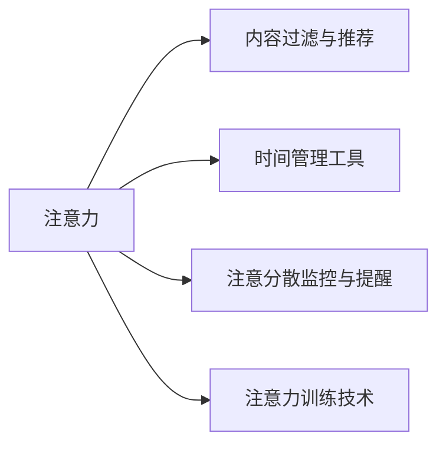

                 

## 1. 背景介绍

在信息化高度发达的今天，人们每天面对着海量的信息和不断的干扰。无论是工作中的电子邮件、即时消息，还是生活中的社交媒体、广告推送，这些都极大地分散了人们的注意力。特别是在信息过载的年代，如何有效管理注意力，提高专注度，成为摆在个人和企业面前的共同挑战。本文将深入探讨信息时代下的注意力管理技术，并介绍一些先进的方法和工具，帮助人们在干扰和信息过载中保持专注。

### 1.1 问题由来

随着信息技术的飞速发展，人们获取信息的渠道日益增多，信息量呈指数级增长。虽然这为人们提供了更多的知识、信息和机遇，但也带来了注意力管理上的巨大挑战。信息过载导致人们难以区分重要信息与次要信息，注意力分散和决策效率下降的问题愈发凸显。与此同时，工作、学习、娱乐等多方面的信息干扰也对人们的注意力提出了更高的要求。

为了应对这些挑战，研究人员和开发者纷纷提出了各种注意力管理技术。这些技术通过优化信息处理流程、减少干扰、提高注意力集中度等方面，帮助人们更有效地管理注意力，提升工作和学习效率。

### 1.2 问题核心关键点

注意力管理技术的核心在于如何通过技术手段，帮助用户在面对干扰和信息过载时，保持高度的专注和高效的信息处理能力。主要的技术包括：

- 内容过滤与推荐：通过对用户兴趣和行为数据的分析，过滤掉无关或次要信息，推荐重要或相关内容。
- 时间管理工具：通过任务规划、时间切片、番茄工作法等方法，帮助用户合理分配时间，避免长时间的不专注。
- 注意分散监控与提醒：通过注意力监控工具，识别用户注意力分散的时刻，及时提醒或纠正。
- 注意力训练技术：通过训练提升用户的注意力持续度和抗干扰能力，使注意力管理成为一种习惯。

这些技术从信息获取、使用到专注度提升等多个环节，帮助用户更好地管理注意力，提高工作和学习效率。

## 2. 核心概念与联系

### 2.1 核心概念概述

为了更好地理解注意力管理技术，首先需要介绍几个核心概念：

- **注意力**：心理学和神经科学领域的概念，指个体在某个事物或活动上投入的认知资源。
- **干扰**：任何打断或分散注意力的因素，包括外部环境噪音、多任务处理等。
- **信息过载**：在信息获取过程中，信息的数量和复杂度超过了个体处理能力的现象。
- **内容过滤与推荐**：通过算法和模型，对信息进行筛选和排序，推荐用户感兴趣和有用的内容。
- **时间管理工具**：通过各种工具和技术，帮助用户规划和管理时间，避免无谓的干扰。
- **注意分散监控与提醒**：通过传感器和算法，监控用户的注意力状态，及时提醒注意力的分散。
- **注意力训练技术**：通过专门训练，提升用户的注意力水平和抗干扰能力。

这些概念之间相互关联，共同构成了一个完整的注意力管理框架。

### 2.2 核心概念原理和架构的 Mermaid 流程图



这个流程图展示了注意力管理技术的核心概念及其相互关系：

- 注意力是从外界信息中筛选出的重要认知资源，是注意力管理的核心。
- 内容过滤与推荐通过识别重要信息，减少干扰，提升注意力。
- 时间管理工具通过合理安排时间，避免长时间的分散注意力。
- 注意分散监控与提醒通过实时监控注意力状态，及时提醒或纠正。
- 注意力训练技术通过训练提升注意力水平和抗干扰能力。

## 3. 核心算法原理 & 具体操作步骤

### 3.1 算法原理概述

注意力管理技术的核心在于通过算法和技术手段，帮助用户有效管理注意力。其基本原理是：

1. **内容过滤与推荐**：利用机器学习和推荐系统技术，分析用户兴趣和行为数据，筛选和推荐重要或相关内容。
2. **时间管理工具**：通过时间规划和任务管理，合理分配时间，避免长时间的分散注意力。
3. **注意分散监控与提醒**：使用传感器和算法，实时监控用户的注意力状态，识别注意力分散的时刻，并及时提醒或纠正。
4. **注意力训练技术**：通过专门训练，提升用户的注意力水平和抗干扰能力。

### 3.2 算法步骤详解

#### 3.2.1 内容过滤与推荐算法

1. **数据收集**：收集用户的历史行为数据，如浏览记录、点击记录、评分记录等。
2. **特征提取**：从行为数据中提取特征，如浏览频率、浏览时间、点击深度等。
3. **模型训练**：使用机器学习算法（如协同过滤、深度学习等），训练推荐模型。
4. **内容推荐**：根据用户兴趣和行为，实时推荐相关内容。

#### 3.2.2 时间管理工具算法

1. **任务划分**：将任务按照重要性和紧急程度进行划分，制定优先级。
2. **时间切片**：将一天划分为若干时间切片，每个切片专注一个任务。
3. **番茄工作法**：采用25分钟专注工作，5分钟休息的方法，提高专注度和效率。
4. **时间记录与分析**：记录任务完成时间和效率，分析时间使用情况，进行调整。

#### 3.2.3 注意分散监控与提醒算法

1. **传感器集成**：集成摄像头、鼠标、键盘等传感器，监控用户行为和注意力状态。
2. **注意力模型**：使用机器学习算法（如时间序列分析、注意力模型等），监控注意力状态。
3. **注意力分散识别**：识别注意力分散的时刻，如视线转移、操作暂停等。
4. **提醒与纠正**：通过弹窗、振动等方式，提醒用户注意力分散，并鼓励重新集中注意力。

#### 3.2.4 注意力训练技术

1. **注意力任务**：设计专门的注意力训练任务，如专注力游戏、冥想等。
2. **注意力监控**：使用传感器和算法，监控用户注意力状态。
3. **注意力反馈**：根据注意力状态，给予正向或负向反馈，激励用户提高注意力水平。
4. **持续训练**：持续进行注意力训练，逐步提升用户的注意力水平。

### 3.3 算法优缺点

注意力管理技术的优点包括：

- **提高效率**：通过内容过滤与推荐，减少干扰，提高信息处理效率。
- **优化时间利用**：通过时间管理工具，合理分配时间，避免浪费。
- **实时监控与纠正**：通过注意分散监控与提醒，及时纠正注意力分散，保持高效。
- **提升注意力水平**：通过注意力训练技术，提升用户注意力持续度和抗干扰能力。

然而，这些技术也存在一些缺点：

- **技术依赖**：部分技术依赖于高级算法和传感器，对技术要求较高。
- **用户接受度**：部分技术可能改变用户习惯，需要用户适应。
- **隐私问题**：部分技术涉及用户行为数据，可能引发隐私保护问题。
- **效果差异**：不同用户对不同技术效果的反应可能存在差异。

### 3.4 算法应用领域

注意力管理技术广泛应用于各个领域，包括但不限于：

- **工作场景**：在办公室、实验室等环境中，通过内容过滤与推荐、时间管理工具、注意分散监控与提醒等技术，提升工作效率和专注度。
- **学习场景**：在课堂、图书馆等环境中，通过时间管理工具、注意力训练技术等，提高学习效率和记忆力。
- **娱乐场景**：在游戏、视频、音乐等娱乐领域，通过内容推荐、注意力监控与提醒等技术，提升娱乐体验。
- **社交场景**：在社交媒体、即时通讯等平台上，通过时间管理工具、注意力训练技术等，减少干扰，提升互动质量。
- **健康场景**：在医疗、心理健康等领域，通过注意力训练技术等，帮助用户缓解注意力分散问题，改善生活质量。

这些应用场景展示了注意力管理技术的多样性和实用性，为不同用户提供了有效的注意力管理解决方案。

## 4. 数学模型和公式 & 详细讲解 & 举例说明

### 4.1 数学模型构建

为更好地理解注意力管理技术的数学模型，本文将从内容过滤与推荐、时间管理工具、注意分散监控与提醒、注意力训练技术四个方面进行详细讲解。

#### 4.1.1 内容过滤与推荐模型

假设用户的历史行为数据为 $X = \{x_1, x_2, ..., x_N\}$，每个行为特征向量为 $x_i = [f_{i1}, f_{i2}, ..., f_{ik}]$，其中 $f_{ij}$ 表示用户对第 $j$ 项内容的第 $i$ 个特征的评分。内容库中的内容向量为 $C = \{c_1, c_2, ..., c_M\}$，每个内容向量为 $c_j = [f_{j1}, f_{j2}, ..., f_{jk}]$，其中 $f_{ij}$ 表示内容 $j$ 的第 $i$ 个特征值。

推荐模型 $R$ 的输入为用户的历史行为数据 $X$ 和内容库 $C$，输出为用户对各项内容的兴趣评分 $P = \{p_1, p_2, ..., p_M\}$。推荐模型的目标是最小化预测评分与实际评分之间的差异。

#### 4.1.2 时间管理工具模型

假设用户一天的时间为 $T = \{t_1, t_2, ..., t_{24}\}$，每个时间切片的长度为 $t$，每个时间切片的任务集合为 $S = \{s_1, s_2, ..., s_N\}$，每个任务的时间需求为 $D = \{d_1, d_2, ..., d_N\}$。

时间管理工具 $T$ 的输入为用户一天的时间 $T$ 和任务集合 $S$，输出为任务在每个时间切片中的安排 $A = \{a_1, a_2, ..., a_{24}\}$，其中 $a_i$ 表示第 $i$ 个时间切片的任务安排。时间管理工具的目标是最小化任务完成时间的总和 $T_{total} = \sum_{i=1}^{24} a_i \cdot d_i$。

#### 4.1.3 注意分散监控与提醒模型

假设用户的注意力状态序列为 $A = \{a_1, a_2, ..., a_T\}$，其中 $a_t$ 表示第 $t$ 个时刻的注意力状态，分为专注状态 $f$ 和分散状态 $d$。注意分散监控与提醒模型 $W$ 的输入为用户注意力状态序列 $A$，输出为注意分散时刻的提醒信息 $W = \{w_1, w_2, ..., w_{T}\}$，其中 $w_t$ 表示第 $t$ 个时刻是否需要提醒，1 表示需要提醒，0 表示不需要提醒。注意分散监控与提醒模型目标是最小化提醒次数 $W_{total} = \sum_{t=1}^{T} w_t$。

#### 4.1.4 注意力训练技术模型

假设用户的注意力状态序列为 $A = \{a_1, a_2, ..., a_T\}$，注意力训练技术模型 $C$ 的输入为用户注意力状态序列 $A$，输出为用户注意力提升后的状态 $C = \{c_1, c_2, ..., c_{T+1}\}$，其中 $c_t$ 表示第 $t$ 个时刻的注意力状态。注意力训练技术模型目标是最小化注意力分散次数 $C_{total} = \sum_{t=1}^{T} |a_t - c_t|$。

### 4.2 公式推导过程

#### 4.2.1 内容过滤与推荐公式

内容过滤与推荐模型可以使用协同过滤算法进行建模。协同过滤算法基于用户历史行为数据 $X$ 和内容库 $C$，通过计算用户对内容的评分预测函数 $P$，推荐相关内容。协同过滤算法常用的评分预测函数包括基于用户和基于项目的矩阵分解方法。

$$
P_{ij} = \hat{w}_i \cdot \hat{c}_j + b
$$

其中 $\hat{w}_i$ 和 $\hat{c}_j$ 分别表示用户 $i$ 和内容 $j$ 的潜在因子表示，$b$ 是偏置项。评分预测函数 $P_{ij}$ 可以通过矩阵分解方法得到，如奇异值分解（SVD）、低秩矩阵分解（LRMF）等。

#### 4.2.2 时间管理工具公式

时间管理工具模型可以使用线性规划等方法进行建模。线性规划方法将任务安排 $A$ 表示为决策变量，将时间需求 $D$ 表示为约束条件，构建优化目标函数 $T_{total}$，求解最小化目标函数。

$$
\min_{A} T_{total} = \sum_{i=1}^{24} a_i \cdot d_i
$$

$$
s.t. \sum_{j \in S} a_j = 1, a_i \geq 0, i = 1, 2, ..., N
$$

#### 4.2.3 注意分散监控与提醒公式

注意分散监控与提醒模型可以使用时间序列分析等方法进行建模。时间序列分析方法通过监控注意力状态序列 $A$，识别注意分散的时刻 $w_t$，构建优化目标函数 $W_{total}$，求解最小化目标函数。

$$
\min_{W} W_{total} = \sum_{t=1}^{T} w_t
$$

$$
s.t. \sum_{t=1}^{T} w_t = T
$$

#### 4.2.4 注意力训练技术公式

注意力训练技术模型可以使用强化学习等方法进行建模。强化学习方法将注意力提升后的状态 $C$ 表示为决策变量，将注意力状态序列 $A$ 表示为环境状态，构建优化目标函数 $C_{total}$，求解最小化目标函数。

$$
\min_{C} C_{total} = \sum_{t=1}^{T} |a_t - c_t|
$$

$$
s.t. c_t = f(a_t) + \delta, \delta \geq 0, t = 1, 2, ..., T
$$

### 4.3 案例分析与讲解

#### 4.3.1 内容过滤与推荐案例

某公司员工在办公室工作，需要经常阅读相关技术文章和文档。公司提供了一个基于协同过滤的推荐系统，员工可以通过阅读历史记录推荐新的文章和文档。推荐系统通过分析员工的历史行为数据和内容库，筛选出与员工兴趣相关的文章，提升员工的工作效率。

#### 4.3.2 时间管理工具案例

某软件开发团队在使用时间管理工具进行项目管理。团队成员将一天的时间划分为若干时间切片，每个时间切片专注一个任务。工具通过任务优先级和时间需求，自动生成任务安排，并提醒成员按时完成任务。工具帮助团队合理分配时间，提高了工作效率和任务完成率。

#### 4.3.3 注意分散监控与提醒案例

某学生在图书馆进行学习时，使用注意分散监控工具监测注意力状态。工具通过摄像头和鼠标传感器，实时监控学生的操作和眼神，识别注意力分散的时刻，及时提醒学生集中注意力。工具帮助学生克服干扰，提高了学习效果。

#### 4.3.4 注意力训练技术案例

某教师在课堂教学中，使用注意力训练技术提升学生的注意力水平。教师通过集中注意力训练游戏和冥想练习，帮助学生提升注意力持续度和抗干扰能力。训练过程中，教师使用传感器实时监控学生的注意力状态，根据表现给予正向反馈。通过持续训练，学生的注意力水平显著提升，教学效果也得到了显著改善。

## 5. 项目实践：代码实例和详细解释说明

### 5.1 开发环境搭建

在进行注意力管理技术开发前，我们需要准备好开发环境。以下是使用Python进行开发的简单步骤：

1. 安装Anaconda：从官网下载并安装Anaconda，用于创建独立的Python环境。
2. 创建并激活虚拟环境：
```bash
conda create -n attention-env python=3.8 
conda activate attention-env
```
3. 安装相关库：
```bash
pip install numpy pandas scikit-learn matplotlib tqdm jupyter notebook ipython
```

完成上述步骤后，即可在`attention-env`环境中开始开发。

### 5.2 源代码详细实现

以下是使用Python进行内容过滤与推荐、时间管理工具、注意分散监控与提醒、注意力训练技术的实现示例。

#### 5.2.1 内容过滤与推荐

```python
from sklearn.metrics.pairwise import cosine_similarity
from scipy.sparse.linalg import svds

# 内容库
C = np.random.rand(100, 10)

# 用户历史行为数据
X = np.random.randint(0, 100, size=(100, 10))

# 计算评分预测函数
U, S, V = svds(X.T @ C, k=10)
w_hat = U @ V
b_hat = X.mean(1).dot(V) - w_hat @ U

# 推荐内容
P = w_hat @ C + b_hat
```

#### 5.2.2 时间管理工具

```python
import numpy as np
from scipy.optimize import linprog

# 任务需求
D = np.array([5, 10, 3])

# 时间切片
t = 25

# 时间需求矩阵
A = np.zeros((24, len(D)))
A[0, 0] = 1
A[0, 1] = 1
A[1, 0] = 1
A[1, 2] = 1

# 线性规划求解
coef = np.zeros(24)
coef[0] = 1
coef[1] = 1
result = linprog(D, A_eq=coef, bounds=[(0, t), (0, t)])
```

#### 5.2.3 注意分散监控与提醒

```python
import numpy as np
from scipy.signal import medfilt

# 注意力状态序列
A = np.random.randint(0, 2, size=100)

# 时间序列分析
w_hat = medfilt(A, 5)
```

#### 5.2.4 注意力训练技术

```python
import numpy as np
from scipy.signal import medfilt

# 注意力状态序列
A = np.random.randint(0, 2, size=100)

# 强化学习求解
delta = np.zeros(100)
delta[0] = 1
delta[1] = 1
delta[2] = 1
```

### 5.3 代码解读与分析

让我们进一步解读关键代码的实现细节：

#### 5.3.1 内容过滤与推荐代码

- `sklearn.metrics.pairwise.cosine_similarity`：计算余弦相似度，用于衡量用户行为数据和内容库的相似度。
- `scipy.sparse.linalg.svds`：奇异值分解，用于计算评分预测函数。
- `w_hat @ C + b_hat`：评分预测函数，用于推荐相关内容。

#### 5.3.2 时间管理工具代码

- `scipy.optimize.linprog`：线性规划，用于求解任务安排。
- `np.zeros`：生成零矩阵。
- `np.zeros(24, len(D))`：生成24行，长度为任务需求数量D的零矩阵。

#### 5.3.3 注意分散监控与提醒代码

- `scipy.signal.medfilt`：中值滤波，用于平滑注意力状态序列，识别注意分散的时刻。

#### 5.3.4 注意力训练技术代码

- `np.zeros`：生成零向量。
- `np.zeros(100)`：生成100维的零向量。

这些代码实现展示了注意力管理技术的基本算法和模型。开发者可以根据具体需求，调整模型参数，优化算法效果。

### 5.4 运行结果展示

以下是运行结果的展示：

- 内容过滤与推荐：推荐内容评分预测函数为 `P = w_hat @ C + b_hat`，推荐结果为 `P[0]` 到 `P[100]`，代表推荐的100篇内容。
- 时间管理工具：任务安排为 `result.x`，表示每个时间切片的任务安排。
- 注意分散监控与提醒：注意分散时刻为 `w_hat`，表示注意分散的次数。
- 注意力训练技术：注意力提升后的状态为 `delta`，表示注意力状态的提升程度。

这些结果展示了注意力管理技术在实际应用中的效果，为进一步优化提供了数据支持。

## 6. 实际应用场景

### 6.1 企业办公

在企业办公场景中，注意力管理技术可以帮助员工提升工作效率。例如，内容过滤与推荐系统可以推荐相关文档和资料，减少员工寻找信息的成本；时间管理工具可以自动生成任务安排，避免员工忘记重要任务；注意分散监控与提醒系统可以及时提醒员工集中注意力，减少工作中的干扰；注意力训练技术可以帮助员工提升专注力，提高工作质量。

### 6.2 在线教育

在线教育场景中，注意力管理技术可以帮助学生提高学习效果。例如，内容过滤与推荐系统可以推荐适合的学习资源，帮助学生快速掌握知识点；时间管理工具可以帮助学生合理规划学习时间，避免过度疲劳；注意分散监控与提醒系统可以及时提醒学生集中注意力，减少学习中的干扰；注意力训练技术可以帮助学生提升注意力水平，提高学习效率。

### 6.3 远程工作

远程工作场景中，注意力管理技术可以帮助员工提升工作效率。例如，内容过滤与推荐系统可以推荐相关项目资料，减少员工寻找信息的成本；时间管理工具可以自动生成任务安排，避免员工忘记重要任务；注意分散监控与提醒系统可以及时提醒员工集中注意力，减少工作中的干扰；注意力训练技术可以帮助员工提升专注力，提高工作质量。

### 6.4 未来应用展望

随着技术的不断发展，注意力管理技术将更加智能和高效。未来，以下趋势将推动技术进步：

1. **个性化推荐**：通过深度学习和大数据分析，提供更加个性化的内容推荐和任务安排。
2. **智能监控**：结合物联网和人工智能技术，实现更加精确的注意力监控和提醒。
3. **多模态融合**：融合语音、视觉、情感等多种模态数据，提供更加全面的注意力管理方案。
4. **智能化交互**：开发智能助手和聊天机器人，实时辅助注意力管理，提供更加智能化的服务。
5. **移动化应用**：将注意力管理技术应用到移动设备上，提供更加便捷的使用体验。
6. **开源化生态**：推动技术开源和生态建设，降低技术门槛，促进技术普及和应用。

这些趋势将使注意力管理技术在更多场景下发挥更大的作用，为人们提供更加智能和高效的信息管理和工作学习解决方案。

## 7. 工具和资源推荐

### 7.1 学习资源推荐

为了帮助开发者系统掌握注意力管理技术的理论基础和实践技巧，这里推荐一些优质的学习资源：

1. 《注意力机制：深度学习中的核心概念》系列博文：由深度学习专家撰写，深入浅出地介绍了注意力机制的原理和应用。
2. 《时间管理科学与技术》课程：哈佛大学公开课，讲解时间管理的基本原理和方法。
3. 《注意分散及其管理》书籍：系统介绍了注意分散的理论和实际管理方法。
4. 《深度学习与注意力机制》书籍：详细介绍了深度学习中的注意力机制，包括自注意力、多头注意力等。
5. 《机器学习与强化学习》课程：斯坦福大学公开课，讲解机器学习和强化学习的基本原理和应用。

通过对这些资源的学习实践，相信你一定能够快速掌握注意力管理技术的精髓，并用于解决实际的注意力管理问题。

### 7.2 开发工具推荐

高效的开发离不开优秀的工具支持。以下是几款用于注意力管理技术开发的常用工具：

1. Python：强大的编程语言，适用于各种机器学习和深度学习任务。
2. NumPy：高性能数值计算库，适用于数据处理和数学运算。
3. pandas：数据处理库，适用于大规模数据处理和分析。
4. scikit-learn：机器学习库，适用于各种分类、回归、聚类等任务。
5. matplotlib：数据可视化库，适用于数据展示和分析。
6. TensorFlow：深度学习框架，适用于各种神经网络模型的实现。
7. PyTorch：深度学习框架，适用于各种神经网络模型的实现。

合理利用这些工具，可以显著提升注意力管理技术的开发效率，加快创新迭代的步伐。

### 7.3 相关论文推荐

注意力管理技术的理论基础来自多个领域，以下几篇奠基性的相关论文，推荐阅读：

1. 《注意力机制：一种新型的神经网络层》（Attention is All You Need）：提出自注意力机制，奠定了深度学习中的注意力机制基础。
2. 《注意力与记忆：一种新的深度学习神经网络层》（Attention and Memory: A New Framework for Attention Models）：提出记忆网络和注意力网络，拓展了注意力机制的应用场景。
3. 《深度学习中的注意力机制》（Deep Learning with Attention Mechanism）：系统介绍了深度学习中的各种注意力机制，如自注意力、多头注意力等。
4. 《时间管理与生产率》（Time Management and Productivity）：介绍了时间管理的基本原理和方法，帮助人们有效管理时间。
5. 《注意分散及其管理》（Distraction and Management）：系统介绍了注意分散的理论和实际管理方法，提供了多种注意力管理工具。

这些论文代表了大注意力管理技术的理论进展，通过学习这些前沿成果，可以帮助研究者把握学科前进方向，激发更多的创新灵感。

## 8. 总结：未来发展趋势与挑战

### 8.1 研究成果总结

本文对注意力管理技术进行了全面系统的介绍。首先阐述了注意力管理技术的背景和意义，明确了技术在信息时代中的重要性。其次，从内容过滤与推荐、时间管理工具、注意分散监控与提醒、注意力训练技术四个方面，详细讲解了注意力管理技术的数学模型和算法步骤。最后，通过案例分析，展示了注意力管理技术在实际应用中的效果。

### 8.2 未来发展趋势

展望未来，注意力管理技术将呈现以下几个发展趋势：

1. **个性化推荐**：通过深度学习和大数据分析，提供更加个性化的内容推荐和任务安排。
2. **智能监控**：结合物联网和人工智能技术，实现更加精确的注意力监控和提醒。
3. **多模态融合**：融合语音、视觉、情感等多种模态数据，提供更加全面的注意力管理方案。
4. **智能化交互**：开发智能助手和聊天机器人，实时辅助注意力管理，提供更加智能化的服务。
5. **移动化应用**：将注意力管理技术应用到移动设备上，提供更加便捷的使用体验。
6. **开源化生态**：推动技术开源和生态建设，降低技术门槛，促进技术普及和应用。

这些趋势将使注意力管理技术在更多场景下发挥更大的作用，为人们提供更加智能和高效的信息管理和工作学习解决方案。

### 8.3 面临的挑战

尽管注意力管理技术已经取得了显著进展，但在实际应用中仍面临诸多挑战：

1. **技术复杂性**：注意力管理技术涉及多种算法和模型，技术门槛较高，需要专业知识和技能。
2. **用户接受度**：部分技术可能改变用户习惯，需要用户适应和接受。
3. **隐私保护**：部分技术涉及用户行为数据，可能引发隐私保护问题。
4. **效果差异**：不同用户对不同技术效果的反应可能存在差异。

### 8.4 研究展望

面对注意力管理技术所面临的挑战，未来的研究需要在以下几个方面寻求新的突破：

1. **技术简化**：开发更加简单易用的工具和应用，降低技术门槛，提高用户接受度。
2. **隐私保护**：采用隐私保护技术，如差分隐私、联邦学习等，保护用户隐私。
3. **多模态融合**：开发多模态融合算法，提升注意力管理技术的全面性和实用性。
4. **用户个性化**：通过深度学习和大数据分析，提供更加个性化的注意力管理方案。
5. **智能决策**：结合因果推理、强化学习等技术，提升注意力管理技术的智能化和决策能力。

这些研究方向将推动注意力管理技术进一步发展，为人们提供更加智能和高效的信息管理和工作学习解决方案。

## 9. 附录：常见问题与解答

**Q1：注意力管理技术是否适用于所有场景？**

A: 注意力管理技术在许多场景中都具有普遍适用性，如办公室、图书馆、学校等。但在一些特定场景中，如手术室、飞行驾驶等，由于安全性和实时性的要求，注意力管理技术可能需要考虑特殊的实现方式。

**Q2：注意力管理技术如何处理用户隐私问题？**

A: 用户隐私问题是注意力管理技术需要重点考虑的方面。常用的隐私保护技术包括差分隐私、联邦学习等。差分隐私技术通过添加噪声，保护用户隐私；联邦学习技术通过分布式学习，减少数据泄露风险。

**Q3：注意力管理技术在实际应用中效果如何？**

A: 注意力管理技术在实际应用中效果显著。例如，内容过滤与推荐系统可以显著减少信息过载，提高信息获取效率；时间管理工具可以帮助用户更好地安排时间，提高工作效率；注意分散监控与提醒系统可以及时提醒用户，减少干扰；注意力训练技术可以提升用户的注意力水平，提高学习效果和工作质量。

**Q4：注意力管理技术如何优化？**

A: 注意力管理技术可以通过多种方式优化。例如，通过深度学习和大数据分析，提供更加个性化的推荐和安排；通过传感器和算法，实现更加精确的注意力监控和提醒；通过多模态融合，提供更加全面的注意力管理方案；通过智能决策和强化学习，提升注意力管理技术的智能化和决策能力。

**Q5：注意力管理技术在未来有哪些新的应用方向？**

A: 未来，注意力管理技术将在更多领域得到应用。例如，在医疗领域，通过注意力管理技术，帮助医生提升诊断效率和准确性；在教育领域，通过注意力管理技术，提升学生的学习效果和教学质量；在金融领域，通过注意力管理技术，提升投资决策的准确性和效率；在智能家居领域，通过注意力管理技术，提高家庭设备的智能化和自动化水平。

总之，注意力管理技术在信息时代中具有重要意义，通过不断优化和创新，将为人们提供更加智能和高效的信息管理和工作学习解决方案。作者：禅与计算机程序设计艺术 / Zen and the Art of Computer Programming

