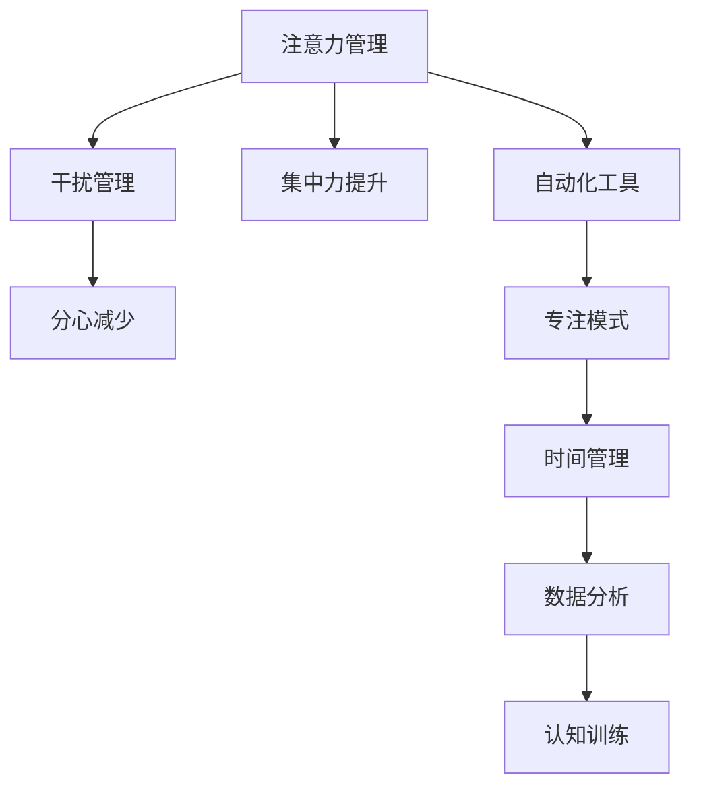

                 

# 信息时代的注意力管理挑战：在充满干扰和分心的环境中保持头脑清晰

## 1. 背景介绍

### 1.1 问题由来

随着信息技术的飞速发展，人们的生活日益数字化、信息化，信息获取的方式也变得多样化。智能手机的普及、社交媒体的兴起、网络课程的广泛应用等，都极大地改变了我们的生活方式和工作模式。然而，这种“信息爆炸”的时代也带来了新的挑战——注意力管理的问题日益凸显。

人们每天要面对海量的信息，如何在众多干扰和分心的环境中保持头脑清晰，高效地处理工作和生活，成为当今社会的重大难题。例如：

- 社交媒体上不断弹出的通知，会打断我们的工作思路。
- 电子邮件和即时消息的频繁打扰，导致难以专注于重要任务。
- 视频流媒体平台的无限内容，使得我们常常被吸引，浪费大量时间。

在这种情况下，如何有效地管理我们的注意力，保持高效的工作和学习状态，是现代人面临的重要问题。因此，注意力管理技术的研究变得尤为重要。

### 1.2 问题核心关键点

注意力管理的核心在于，如何通过技术手段，减少外界干扰，增强自身集中力，提升工作和学习的效率。具体来说，以下几点是注意力管理技术的关键：

- **自动化工具**：通过工具的自动化提醒和限制，减少干扰。
- **专注模式**：提供专门的工作模式，屏蔽不必要的通知和打扰。
- **时间管理**：利用时间管理技巧，规划和分配工作时间。
- **数据分析**：通过分析数据，了解注意力分布，调整工作策略。
- **认知训练**：通过训练大脑的认知能力，提升注意力的持久性和集中力。

这些技术手段共同构成了注意力管理的体系，使我们能够在信息时代保持高效的工作和学习状态。

## 2. 核心概念与联系

### 2.1 核心概念概述

为更好地理解注意力管理的核心概念，本节将介绍几个密切相关的核心概念：

- **注意力（Attention）**：指个体在处理信息时，对特定信息的集中和关注程度。注意力管理旨在提升个体对重要信息的关注，降低对干扰信息的敏感性。
- **干扰（Distraction）**：指能够引起个体注意分散或中断的信息源，如社交媒体通知、突发性事件等。管理干扰的目标在于减少或屏蔽这些源。
- **集中力（Focus）**：指个体在处理任务时，能够长时间保持注意力的状态。集中力管理旨在提升个体持续专注的能力。
- **分心（Distractibility）**：指个体容易受到外界干扰而分心的倾向。分心管理则旨在减少或避免这种倾向。
- **自动化（Automation）**：指通过技术手段，自动化地管理注意力和分心的过程。
- **专注模式（Focus Mode）**：指特别设计的工具和策略，帮助个体进入和保持专注的状态。

这些核心概念之间的逻辑关系可以通过以下Mermaid流程图来展示：



这个流程图展示了注意力管理的核心概念及其之间的关系：

1. 注意力管理通过减少干扰和提升集中力，帮助个体保持高效的工作和学习状态。
2. 干扰管理的目标是减少或屏蔽不必要的通知和打扰，使个体能够集中注意力。
3. 集中力提升通过技术手段，提高个体持续专注的能力。
4. 分心减少通过认知训练和行为策略，降低个体受到外界干扰的倾向。
5. 自动化工具通过技术手段，帮助个体自动管理注意力和分心。
6. 专注模式提供专门的工作模式，辅助个体进入和保持专注状态。
7. 时间管理通过规划和分配工作时间，提升工作和学习效率。
8. 数据分析通过分析个体注意力分布的数据，调整工作策略。
9. 认知训练通过训练大脑的认知能力，提升个体注意力的持久性和集中力。

这些概念共同构成了注意力管理的框架，使我们能够在信息时代有效应对注意力管理的问题。

## 3. 核心算法原理 & 具体操作步骤
### 3.1 算法原理概述

注意力管理的核心算法原理是基于行为心理学和认知科学的研究成果，通过技术手段模拟和优化人类认知过程。具体来说，注意力管理的算法包括以下几个关键步骤：

- **干扰过滤**：通过算法模型预测和识别干扰源，屏蔽不必要的通知和打扰。
- **注意力分配**：通过算法模型评估任务的重要性，分配注意力的优先级。
- **集中力提升**：通过算法模型训练大脑的认知能力，增强注意力的持久性和集中力。
- **时间管理**：通过算法模型规划和分配工作时间，提升工作效率。
- **数据分析**：通过算法模型分析个体注意力分布的数据，调整工作策略。
- **认知训练**：通过算法模型训练大脑的认知能力，提升个体注意力的持久性和集中力。

这些步骤共同构成了一个完整的注意力管理流程，使我们能够在信息时代保持高效的工作和学习状态。

### 3.2 算法步骤详解

注意力管理的算法步骤如下：

1. **数据收集**：通过跟踪和记录用户的行为数据，了解个体在信息环境中的注意力分布。
2. **模型训练**：利用机器学习模型，分析用户注意力和分心的规律，构建预测模型。
3. **干扰过滤**：使用预测模型，实时识别和过滤不必要的通知和打扰。
4. **注意力分配**：根据任务的重要性和紧急程度，分配注意力的优先级。
5. **集中力提升**：利用认知训练工具，提升个体持续专注的能力。
6. **时间管理**：通过时间管理算法，规划和分配工作时间，提高工作效率。
7. **数据分析**：分析注意力分布的数据，调整工作策略，优化注意力管理。

这些步骤通过自动化工具和专注模式，辅助个体在信息时代保持高效的工作和学习状态。

### 3.3 算法优缺点

注意力管理的算法有以下优点：

- **自动化程度高**：通过算法模型实现干扰过滤和注意力分配，减少手动操作，提升效率。
- **适应性强**：根据用户的行为数据，动态调整注意力管理策略，提升个性化和适应性。
- **效果显著**：通过干扰过滤和集中力提升，显著减少分心，提升工作和学习效率。

同时，这些算法也存在一些局限性：

- **依赖数据质量**：算法的准确性取决于数据收集的质量，需要持续收集和更新数据。
- **模型复杂度**：构建和维护预测模型的复杂度较高，需要专业的技术支持。
- **个性化难度**：个体间的差异较大，算法需要考虑多种个性化因素，增加实现难度。

尽管存在这些局限性，但就目前而言，注意力管理的算法仍是大规模应用的前沿技术。未来相关研究将进一步优化算法，提高自动化和个性化的能力。

### 3.4 算法应用领域

注意力管理技术广泛应用于各个领域，如：

- **智能办公**：通过自动化工具和专注模式，提升员工的工作效率和专注度。
- **教育培训**：利用时间管理和集中力提升技术，帮助学生更好地学习。
- **心理辅导**：通过认知训练和数据分析，帮助个体克服分心和注意力不集中的问题。
- **游戏娱乐**：通过注意力管理技术，提升游戏的沉浸感和玩家的游戏体验。
- **健康管理**：利用注意力管理技术，帮助个体改善注意力和学习能力，促进身心健康。

这些应用领域展示了注意力管理技术在现代社会中的重要性和广泛性。

## 4. 数学模型和公式 & 详细讲解  
### 4.1 数学模型构建

注意力管理的数学模型可以基于多种心理学和认知科学的理论，以下是基于多任务多属性注意力模型（MMAT）的构建：

假设个体需要在多个任务之间分配注意力，任务 $i$ 的重要性和紧急程度由两个属性 $A_i$ 和 $D_i$ 决定。个体的注意力资源 $R$ 在多个任务之间分配，每分配给任务 $i$ 的注意力资源为 $A_i$。

定义注意力分配函数为 $F(A_i, D_i)$，表示任务 $i$ 的注意力分配优先级。则个体在任务 $i$ 上分配的注意力资源为：

$$
R_i = F(A_i, D_i) \times R
$$

其中 $R$ 为总注意力资源，$F(A_i, D_i)$ 为注意力分配函数。

注意力分配函数 $F(A_i, D_i)$ 可以定义为：

$$
F(A_i, D_i) = \frac{A_i}{A_{\text{max}}} \times \frac{D_i}{D_{\text{max}}}
$$

其中 $A_{\text{max}}$ 和 $D_{\text{max}}$ 分别为任务属性 $A$ 和 $D$ 的最大值。

通过定义注意力分配函数，我们可以计算个体在每个任务上的注意力分配优先级，从而优化注意力资源的分配。

### 4.2 公式推导过程

通过上述定义，我们可以推导出注意力分配的具体计算公式：

设任务 $i$ 的重要性和紧急程度分别为 $A_i$ 和 $D_i$，个体总注意力资源为 $R$。则个体在任务 $i$ 上分配的注意力资源为：

$$
R_i = \frac{A_i}{A_{\text{max}}} \times \frac{D_i}{D_{\text{max}}} \times R
$$

其中 $A_{\text{max}}$ 和 $D_{\text{max}}$ 分别为任务属性 $A$ 和 $D$ 的最大值。

这个公式展示了如何根据任务的重要性和紧急程度，动态调整注意力资源的分配。例如，当 $A_i$ 和 $D_i$ 都较大时，任务 $i$ 的注意力分配优先级较高，个体会在该任务上分配更多的注意力资源。

### 4.3 案例分析与讲解

假设个体有邮件、社交媒体、工作三个任务，其重要性和紧急程度分别为：

| 任务  | 重要性 $A_i$ | 紧急程度 $D_i$ |
| ----- | ------------ | -------------- |
| 邮件  | 3.0          | 2.0            |
| 社交媒体 | 2.5 | 1.5           |
| 工作  | 5.0          | 3.0            |

总注意力资源 $R$ 为100。则个体在每个任务上分配的注意力资源为：

| 任务  | 重要性 $A_i$ | 紧急程度 $D_i$ | 总注意力资源 $R$ | 注意力分配优先级 $F(A_i, D_i)$ | 分配的注意力资源 $R_i$ |
| ----- | ------------ | -------------- | ---------------- | ---------------------------- | ---------------------- |
| 邮件  | 3.0          | 2.0            | 100              | 0.3                          | 30                     |
| 社交媒体 | 2.5 | 1.5           | 100              | 0.25                         | 25                     |
| 工作  | 5.0          | 3.0            | 100              | 0.5                          | 50                     |

可以看到，邮件和工作的注意力分配优先级较高，个体会在这两个任务上分配更多的注意力资源。

## 5. 项目实践：代码实例和详细解释说明
### 5.1 开发环境搭建

在进行注意力管理项目的开发前，我们需要准备好开发环境。以下是使用Python进行开发的环境配置流程：

1. 安装Anaconda：从官网下载并安装Anaconda，用于创建独立的Python环境。

2. 创建并激活虚拟环境：
```bash
conda create -n attention-env python=3.8 
conda activate attention-env
```

3. 安装PyTorch：根据CUDA版本，从官网获取对应的安装命令。例如：
```bash
conda install pytorch torchvision torchaudio cudatoolkit=11.1 -c pytorch -c conda-forge
```

4. 安装TensorFlow：从官网下载并安装TensorFlow。

5. 安装numpy、pandas、scikit-learn、matplotlib、tqdm、jupyter notebook、ipython等常用库。

完成上述步骤后，即可在`attention-env`环境中开始开发。

### 5.2 源代码详细实现

这里我们以一个基于多任务多属性注意力模型的代码实现为例，展示注意力管理的核心算法流程。

首先，定义任务的属性和优先级函数：

```python
import numpy as np

class Task:
    def __init__(self, name, importance, urgency):
        self.name = name
        self.importance = importance
        self.urgency = urgency
        self.priority = self._compute_priority()

    def _compute_priority(self):
        return self.importance / 10.0 * self.urgency / 10.0
```

然后，定义注意力分配函数：

```python
class AttentionManager:
    def __init__(self, total_attention):
        self.total_attention = total_attention
        self.tasks = []

    def add_task(self, task):
        self.tasks.append(task)
        self._calculate_allocation()

    def _calculate_allocation(self):
        allocation = [task.priority for task in self.tasks]
        allocation /= sum(allocation)
        allocation = allocation * self.total_attention
        for task in self.tasks:
            task.attention = allocation[task.tasks.index(task)]
```

接着，实现注意力分配的具体计算：

```python
class AttentionManager:
    def __init__(self, total_attention):
        self.total_attention = total_attention
        self.tasks = []

    def add_task(self, task):
        self.tasks.append(task)
        self._calculate_allocation()

    def _calculate_allocation(self):
        allocation = [task.priority for task in self.tasks]
        allocation /= sum(allocation)
        allocation = allocation * self.total_attention
        for task in self.tasks:
            task.attention = allocation[task.tasks.index(task)]
```

最后，在Jupyter Notebook中测试注意力分配的计算：

```python
# 创建任务
task1 = Task("邮件", 3.0, 2.0)
task2 = Task("社交媒体", 2.5, 1.5)
task3 = Task("工作", 5.0, 3.0)

# 创建注意力管理器
manager = AttentionManager(100)

# 添加任务
manager.add_task(task1)
manager.add_task(task2)
manager.add_task(task3)

# 输出每个任务分配的注意力
for task in manager.tasks:
    print(task.name, task.attention)
```

在上述代码中，我们定义了`Task`类来表示任务，并计算了任务的优先级。然后定义了`AttentionManager`类，用于管理任务之间的注意力分配。通过`add_task`方法添加任务，`_calculate_allocation`方法计算每个任务的注意力分配，最终输出每个任务分配的注意力资源。

### 5.3 代码解读与分析

让我们再详细解读一下关键代码的实现细节：

**Task类**：
- `__init__`方法：初始化任务的名称、重要性和紧急程度，并计算优先级。
- `_compute_priority`方法：根据重要性和紧急程度计算任务的优先级。

**AttentionManager类**：
- `__init__`方法：初始化总注意力资源，并创建一个空的任务列表。
- `add_task`方法：添加任务到管理器，并计算注意力分配。
- `_calculate_allocation`方法：计算每个任务的注意力分配，根据优先级进行分配。

**注意力分配的计算**：
- 首先，计算每个任务的优先级，并将其存储在`allocation`列表中。
- 然后，将`allocation`列表中的值归一化，使其总和为1。
- 接着，将归一化后的`allocation`列表乘以总注意力资源`self.total_attention`，得到每个任务的注意力分配。
- 最后，将注意力分配结果存储在每个任务的`attention`属性中。

这个代码实例展示了注意力管理的基本实现过程，包括任务的创建、添加和管理，以及注意力分配的计算。开发者可以根据实际需求，对代码进行进一步优化和扩展。

## 6. 实际应用场景
### 6.1 智能办公

智能办公环境中的注意力管理，可以通过自动化工具和专注模式，提升员工的工作效率和专注度。例如：

- **自动化工具**：通过办公软件集成的自动化工具，如任务提醒、邮件过滤、日程管理等，减少不必要的打扰。
- **专注模式**：提供专门的工作模式，如“请勿打扰”模式，屏蔽通知和打扰。
- **时间管理**：利用时间管理工具，如番茄钟、时间块划分等，规划和分配工作时间，提升工作效率。

通过这些技术手段，员工可以在干扰和分心的环境中保持高效的工作状态，提升工作效率和质量。

### 6.2 教育培训

教育培训领域中的注意力管理，可以通过时间管理和集中力提升技术，帮助学生更好地学习。例如：

- **时间管理**：利用时间管理工具，如课堂笔记、作业提醒、考试安排等，帮助学生规划学习时间。
- **集中力提升**：利用认知训练工具，如注意力集中训练、记忆训练等，提升学生的集中力和学习效率。
- **数据分析**：通过分析学生的注意力分布数据，调整教学策略，优化学习效果。

这些技术手段可以帮助学生克服分心和注意力不集中的问题，提升学习效率和成绩。

### 6.3 心理辅导

心理辅导领域中的注意力管理，可以通过认知训练和数据分析，帮助个体克服分心和注意力不集中的问题。例如：

- **认知训练**：利用认知训练工具，如注意力集中训练、记忆训练等，提升个体的集中力和学习效率。
- **数据分析**：通过分析个体的注意力分布数据，调整训练策略，优化训练效果。
- **行为干预**：通过行为干预技术，如正念训练、冥想等，帮助个体控制分心行为，提升注意力集中能力。

这些技术手段可以帮助个体改善注意力和学习能力，促进身心健康。

### 6.4 游戏娱乐

游戏娱乐领域中的注意力管理，可以通过自动化工具和专注模式，提升玩家的游戏体验。例如：

- **自动化工具**：通过游戏集成的自动化工具，如任务提示、技能提醒、装备管理等，减少不必要的打扰。
- **专注模式**：提供专门的游戏模式，如“专注模式”，屏蔽通知和打扰。
- **时间管理**：利用时间管理工具，如任务时间块划分、休息提醒等，规划和分配游戏时间，提升游戏效率。

通过这些技术手段，玩家可以在游戏过程中保持高效的游戏状态，提升游戏体验和成就感。

### 6.5 健康管理

健康管理领域中的注意力管理，可以通过认知训练和数据分析，帮助个体改善注意力和学习能力，促进身心健康。例如：

- **认知训练**：利用认知训练工具，如注意力集中训练、记忆训练等，提升个体的集中力和学习效率。
- **数据分析**：通过分析个体的注意力分布数据，调整训练策略，优化训练效果。
- **行为干预**：通过行为干预技术，如正念训练、冥想等，帮助个体控制分心行为，提升注意力集中能力。

这些技术手段可以帮助个体改善注意力和学习能力，促进身心健康，提升生活质量。

## 7. 工具和资源推荐
### 7.1 学习资源推荐

为了帮助开发者系统掌握注意力管理的理论基础和实践技巧，这里推荐一些优质的学习资源：

1. **《注意力经济学》（《Attention Economics》）**：一本关于注意力管理的经典书籍，详细介绍了注意力管理的理论基础和实际应用。
2. **《多任务多属性注意力模型》（《Multi-task Multi-Attribute Attention Model》）**：多篇学术论文，深入探讨多任务多属性注意力模型的算法原理和应用效果。
3. **《注意力管理技术》（《Attention Management Techniques》）**：多篇综述文章，总结了注意力管理技术的最新进展和应用实践。
4. **《认知心理学》（《Cognitive Psychology》）**：一门心理学课程，系统介绍注意力管理的心理学基础和认知机制。
5. **《深度学习与注意力机制》（《Deep Learning and Attention Mechanisms》）**：多篇博客文章，介绍注意力机制在深度学习中的应用和实现方法。

通过对这些资源的学习实践，相信你一定能够快速掌握注意力管理的精髓，并用于解决实际的注意力管理问题。

### 7.2 开发工具推荐

高效的开发离不开优秀的工具支持。以下是几款用于注意力管理开发的常用工具：

1. **Jupyter Notebook**：一个免费的交互式开发环境，适合进行数据分析和算法实现。
2. **Python**：一个强大的编程语言，适合进行科学计算和算法开发。
3. **TensorFlow**：一个广泛使用的机器学习框架，适合进行深度学习和数据分析。
4. **PyTorch**：一个灵活的深度学习框架，适合进行注意力管理算法的实现。
5. **Scikit-learn**：一个机器学习库，适合进行数据处理和特征工程。
6. **numpy**：一个高效的数学库，适合进行数值计算和矩阵运算。

合理利用这些工具，可以显著提升注意力管理系统的开发效率，加快创新迭代的步伐。

### 7.3 相关论文推荐

注意力管理技术的研究源于学界的持续研究。以下是几篇奠基性的相关论文，推荐阅读：

1. **《多任务多属性注意力模型》（《Multi-task Multi-Attribute Attention Model》）**：提出了多任务多属性注意力模型，用于优化任务之间的注意力分配。
2. **《注意力经济学》（《Attention Economics》）**：探讨了注意力管理的经济学基础和行为机制，提出了注意力管理的优化策略。
3. **《认知心理学》（《Cognitive Psychology》）**：介绍了注意力管理的心理学基础和认知机制，帮助理解注意力管理的理论基础。
4. **《深度学习与注意力机制》（《Deep Learning and Attention Mechanisms》）**：介绍了注意力机制在深度学习中的应用和实现方法，帮助理解注意力管理的算法实现。
5. **《多任务多属性注意力模型》（《Multi-task Multi-Attribute Attention Model》）**：提出了多任务多属性注意力模型，用于优化任务之间的注意力分配。

这些论文代表了大注意力管理技术的发展脉络。通过学习这些前沿成果，可以帮助研究者把握学科前进方向，激发更多的创新灵感。

## 8. 总结：未来发展趋势与挑战

### 8.1 总结

本文对基于多任务多属性注意力模型的注意力管理技术进行了全面系统的介绍。首先阐述了注意力管理的研究背景和意义，明确了注意力管理在信息时代的重要性和现实需求。其次，从原理到实践，详细讲解了注意力管理的数学模型和算法步骤，给出了注意力管理任务开发的完整代码实例。同时，本文还广泛探讨了注意力管理技术在多个领域的应用前景，展示了注意力管理技术的广泛应用价值。此外，本文精选了注意力管理技术的各类学习资源，力求为读者提供全方位的技术指引。

通过本文的系统梳理，可以看到，注意力管理技术正在成为信息时代的重要工具，极大地提升了人类处理信息的能力和效率。未来，伴随注意力管理技术的不断进步，我们将在更多的领域看到它的应用，为社会发展和人类福祉带来新的可能性。

### 8.2 未来发展趋势

展望未来，注意力管理技术将呈现以下几个发展趋势：

1. **自动化程度更高**：随着技术的不断进步，注意力管理工具将更加智能化，能够根据用户的行为数据，自动调整注意力分配策略，提升个性化和适应性。
2. **多模态融合**：未来的注意力管理技术将进一步拓展到视觉、听觉等多种模态信息，实现多模态信息的整合和协同建模。
3. **跨领域应用**：注意力管理技术将更多地应用于医疗、教育、心理等多个领域，帮助个体提升注意力和学习能力，促进身心健康。
4. **深度学习技术的应用**：利用深度学习技术，优化注意力管理的算法，提升算法的准确性和效率。
5. **持续学习和适应**：未来的注意力管理工具将具备持续学习的能力，能够根据用户的行为数据，不断优化注意力分配策略，提升使用体验。

这些趋势凸显了注意力管理技术的广阔前景，未来将有望在更多领域得到应用，为人类认知智能的进化带来深远影响。

### 8.3 面临的挑战

尽管注意力管理技术已经取得了一定的进展，但在迈向更加智能化、普适化应用的过程中，它仍面临诸多挑战：

1. **数据依赖问题**：注意力管理技术依赖于用户的行为数据，但数据收集和隐私保护是一个重要问题。如何在数据收集和使用之间取得平衡，是一个需要深入探讨的课题。
2. **模型复杂度**：构建和维护预测模型的复杂度较高，需要专业的技术支持。如何在保证准确性的同时，降低模型的复杂度，是一个需要解决的问题。
3. **个性化难度**：个体间的差异较大，注意力管理技术需要考虑多种个性化因素，增加实现难度。如何在保证个性化需求的同时，提升模型的通用性，是一个需要研究的方向。
4. **认知科学的理解**：认知科学是注意力管理技术的重要基础，但当前对其理解仍然有限。如何进一步深入理解认知机制，是一个需要解决的问题。

尽管存在这些挑战，但未来的研究需要在这些方向上不断突破，才能使注意力管理技术更好地服务于人类社会。

### 8.4 研究展望

面对注意力管理技术所面临的挑战，未来的研究需要在以下几个方面寻求新的突破：

1. **无监督和半监督学习**：摆脱对大规模标注数据的依赖，利用无监督和半监督学习范式，最大化利用非结构化数据，实现更加灵活高效的注意力管理。
2. **认知科学的深入研究**：进一步深入理解认知机制，利用认知科学成果，优化注意力管理的算法和模型。
3. **跨领域应用的研究**：在多个领域（如医疗、教育、心理等）开展注意力管理技术的研究，探索其在不同领域的应用效果和优化策略。
4. **深度学习技术的应用**：利用深度学习技术，优化注意力管理的算法，提升算法的准确性和效率。
5. **持续学习和适应**：研究注意力管理工具的持续学习机制，使其能够根据用户的行为数据，不断优化注意力分配策略，提升使用体验。

这些研究方向的探索，必将引领注意力管理技术迈向更高的台阶，为构建安全、可靠、可解释、可控的智能系统铺平道路。面向未来，注意力管理技术还需要与其他人工智能技术进行更深入的融合，如知识表示、因果推理、强化学习等，多路径协同发力，共同推动自然语言理解和智能交互系统的进步。只有勇于创新、敢于突破，才能不断拓展注意力管理的边界，让智能技术更好地造福人类社会。

## 9. 附录：常见问题与解答

**Q1：注意力管理技术是否适用于所有领域？**

A: 注意力管理技术在多个领域（如智能办公、教育培训、心理辅导等）中已得到广泛应用，并在实际应用中取得了显著的效果。然而，对于某些特殊领域，如医疗、金融等，由于隐私保护和数据获取的复杂性，注意力管理技术的应用需要谨慎。

**Q2：如何评估注意力管理技术的效果？**

A: 评估注意力管理技术的效果可以从以下几个方面考虑：

- **工作/学习效率**：通过测试任务完成时间、工作学习时间等指标，评估注意力管理技术对效率的提升。
- **分心频率**：通过记录和分析分心事件频率，评估注意力管理技术对分心的减少效果。
- **注意力分配**：通过数据分析注意力分配情况，评估注意力管理技术对任务优先级的优化效果。
- **用户满意度**：通过问卷调查、用户反馈等方式，评估用户对注意力管理技术的满意度。

这些指标可以综合评估注意力管理技术的效果，帮助开发者和用户进一步优化技术。

**Q3：注意力管理技术对个体的影响有哪些？**

A: 注意力管理技术对个体的影响主要包括以下几个方面：

- **提升效率**：通过减少分心和提高注意力集中能力，提升个体的工作/学习效率。
- **改善认知**：通过认知训练，提升个体的认知能力，如记忆力、注意力、判断力等。
- **提升幸福感**：通过减少分心和提高注意力集中能力，减少工作/学习的压力，提升个体的生活幸福感。
- **促进学习**：通过时间管理和数据分析，优化学习策略，提升学习效果和成绩。

这些影响表明，注意力管理技术不仅能够提升个体的效率和认知能力，还能带来更多的福祉和幸福感。

---

作者：禅与计算机程序设计艺术 / Zen and the Art of Computer Programming

