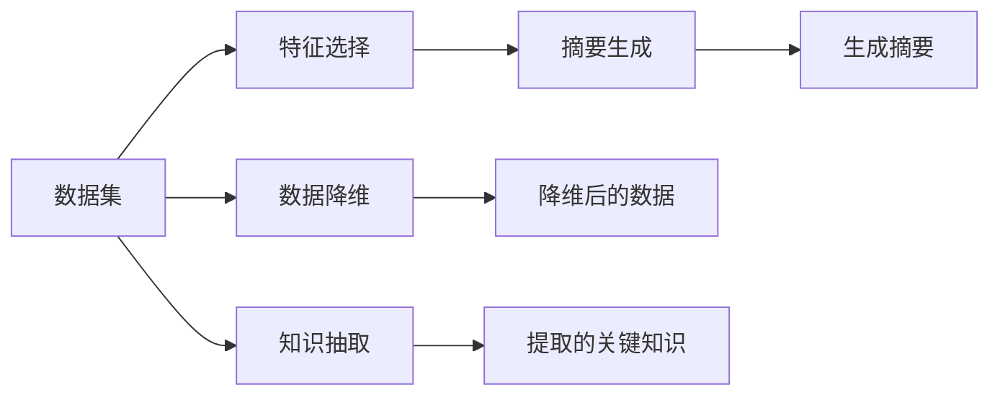

                 

# 信息简化的好处与挑战：简化复杂性的艺术与实践

## 1. 背景介绍

在当今信息爆炸的时代，数据的产生和处理速度已远超人类的理解能力。如何有效管理和利用海量数据，从中提取有价值的信息，成为各行各业面临的共同挑战。信息技术与数据科学的交叉，催生了信息简化的重要需求，尤其是在大数据、人工智能等领域，对信息简化的艺术和实践提出更高要求。本文将围绕信息简化的核心概念，探讨其优势与挑战，分享技术实现与行业应用，为解决复杂性问题提供新思路。

## 2. 核心概念与联系

### 2.1 核心概念概述

信息简化（Information Simplification）是指通过分析和处理复杂的信息，提取其关键要素，去除冗余或无关部分，以提高信息的可理解性和可操作性。信息简化在自然语言处理（NLP）、数据挖掘、图像处理、传感器数据等领域都有广泛应用。

**数据降维（Dimensionality Reduction）**：通过减少数据的维度，降低数据复杂度，便于后续分析和处理。

**特征选择（Feature Selection）**：从原始数据中选择最相关的特征，减少噪音和冗余，提高模型训练效率。

**知识抽取（Knowledge Extraction）**：从文本、图片等数据中抽取有用的知识，提取关键实体和关系。

**摘要生成（Text Summarization）**：将长文本压缩成简短摘要，便于快速浏览和理解。

### 2.2 核心概念原理和架构的 Mermaid 流程图



## 3. 核心算法原理 & 具体操作步骤

### 3.1 算法原理概述

信息简化的核心算法原理主要是通过分析原始数据的结构、统计特性和语义信息，来识别和提取关键要素，减少冗余信息，提高数据可用性。这主要包括特征选择、降维、聚类、分类等技术手段。

以特征选择为例，常用的方法包括卡方检验、互信息、L1正则化等。通过这些方法，可以在保证模型性能的前提下，减少特征数量，提高模型训练和推理速度。

### 3.2 算法步骤详解

1. **数据预处理**：清洗和格式化原始数据，去除噪声和异常值。
2. **特征选择**：使用统计学方法或机器学习算法，筛选出与目标变量相关性较高的特征。
3. **模型训练**：在处理后的数据上训练简化模型，确保简化后的模型与原始模型性能相当。
4. **后处理**：对简化后的数据进行可视化、展示或进一步处理，确保信息提取的准确性和实用性。

### 3.3 算法优缺点

**优点**：
- **减少计算复杂度**：通过特征选择和降维，降低计算资源需求，提高模型训练效率。
- **提高可解释性**：简化的模型结构更容易理解和解释，便于领域专家理解和应用。
- **增强数据可用性**：通过去除无关信息，提高数据的质量和可靠性。

**缺点**：
- **可能丢失重要信息**：过于简化的过程中，可能忽略一些关键特征，影响模型性能。
- **复杂度增加**：选择和优化特征的过程复杂度较高，需要专业知识。
- **过度简化问题**：简化过度可能导致信息损失，影响决策的全面性和准确性。

### 3.4 算法应用领域

信息简化技术在多个领域都有广泛应用，如：

- **金融分析**：通过降维和特征选择，优化股票市场的预测模型，提高投资决策的准确性。
- **医疗诊断**：从海量医疗数据中提取关键特征，辅助诊断和治疗方案制定。
- **自然语言处理**：通过摘要生成和关键词提取，提高文本信息的理解和利用效率。
- **图像识别**：利用降维技术，从高维图像数据中提取关键特征，提高图像分类和识别精度。
- **传感器数据处理**：通过特征选择和降维，优化传感器数据的处理和分析，提高实时响应速度。

## 4. 数学模型和公式 & 详细讲解 & 举例说明

### 4.1 数学模型构建

以特征选择为例，假设原始数据集为 $X \in \mathbb{R}^{n \times m}$，其中 $n$ 为样本数，$m$ 为特征数。目标是从中选择 $k$ 个最相关的特征，构成简化后的特征集 $X_s \in \mathbb{R}^{n \times k}$。

**卡方检验（Chi-square test）**：
$$
\chi^2 = \sum_{i=1}^m \frac{(x_i - \bar{x})^2}{\bar{x}}
$$
其中 $x_i$ 为特征 $i$ 的平均值，$\bar{x}$ 为所有特征的平均值。通过卡方检验，可以计算每个特征与目标变量之间的相关性。

**互信息（Mutual Information）**：
$$
I(X;Y) = -\sum_{x,y} P(x,y) \log P(x,y) / P(x)P(y)
$$
其中 $P(x,y)$ 为联合概率，$P(x)$ 和 $P(y)$ 分别为 $X$ 和 $Y$ 的边缘概率。互信息衡量特征和目标变量之间的信息相关性。

### 4.2 公式推导过程

以互信息公式为例，推导步骤如下：

1. **定义联合概率和边缘概率**：
   $$
   P(x,y) = \frac{N(x,y)}{N}, \quad P(x) = \frac{N(x)}{N}, \quad P(y) = \frac{N(y)}{N}
   $$
   其中 $N(x,y)$ 为 $(x,y)$ 的联合出现次数，$N(x)$ 和 $N(y)$ 分别为 $x$ 和 $y$ 的边缘出现次数，$N$ 为总样本数。

2. **计算互信息**：
   $$
   I(X;Y) = \sum_{x,y} P(x,y) \log \frac{P(x,y)}{P(x)P(y)}
   $$
   将上式展开，得到：
   $$
   I(X;Y) = \sum_{x,y} \frac{N(x,y)}{N} \log \frac{N(x,y)}{N(x)N(y)}
   $$
   移项并化简，得到：
   $$
   I(X;Y) = -\sum_{x,y} P(x,y) \log P(x,y) / P(x)P(y)
   $$

### 4.3 案例分析与讲解

以文本摘要为例，假设原始文本为 $T$，长度为 $L$。目标生成长度为 $k$ 的摘要 $S$。

**基于TF-IDF（Term Frequency-Inverse Document Frequency）的摘要方法**：
1. **计算词频和逆文档频率**：
   $$
   TF(t) = \frac{n_t}{N}, \quad IDF(t) = \log \frac{N}{n_t}
   $$
   其中 $n_t$ 为词 $t$ 在文本中的出现次数，$N$ 为文本总数。
2. **计算词重要性**：
   $$
   I(t) = TF(t) \times IDF(t)
   $$
3. **选择重要词汇**：
   $$
   \text{Rank}(t) = I(t) \times \text{Length}(t) \times \text{Lf}(t)
   $$
   其中 $\text{Length}(t)$ 为词汇长度，$\text{Lf}(t)$ 为词性标注信息。
4. **生成摘要**：
   根据重要性排名，选择 $k$ 个词汇，组成摘要 $S$。

## 5. 项目实践：代码实例和详细解释说明

### 5.1 开发环境搭建

为了实现信息简化功能，可以使用Python和相关开源库。首先，需要安装Python和所需的库：

1. **安装Python**：
   ```bash
   sudo apt-get install python3 python3-pip
   ```
2. **安装Scikit-Learn**：
   ```bash
   pip install scikit-learn
   ```
3. **安装NLTK**：
   ```bash
   pip install nltk
   ```
4. **安装Spacy**：
   ```bash
   pip install spacy
   ```

### 5.2 源代码详细实现

以下是一个简单的Python代码示例，用于文本摘要生成：

```python
import nltk
from nltk.tokenize import sent_tokenize, word_tokenize
from nltk.corpus import stopwords
from nltk.stem import WordNetLemmatizer
from sklearn.feature_extraction.text import TfidfVectorizer
from sklearn.metrics.pairwise import cosine_similarity

nltk.download('punkt')
nltk.download('stopwords')
nltk.download('wordnet')

# 定义停用词和词形还原器
stop_words = set(stopwords.words('english'))
lemmatizer = WordNetLemmatizer()

def preprocess(text):
    # 分句和分词
    sentences = sent_tokenize(text)
    words = [word_tokenize(s) for s in sentences]
    # 去除停用词和词性标注
    words = [[lemmatizer.lemmatize(w) for w in s if w not in stop_words] for s in words]
    # 连接分词结果
    words = [' '.join(s) for s in words]
    return words

# 计算词频和逆文档频率
def tfidf(texts):
    vectorizer = TfidfVectorizer(tokenizer=preprocess, stop_words=stop_words)
    X = vectorizer.fit_transform(texts)
    return X.toarray(), vectorizer

# 计算词重要性
def word_importance(X, vectorizer):
    X = vectorizer.transform(preprocess(text))
    scores = cosine_similarity(X.toarray(), X.toarray())
    return scores

# 生成摘要
def generate_summary(text, k):
    X, vectorizer = tfidf([text])
    scores = word_importance(X, vectorizer)
    rank = scores[0].argsort()[::-1]  # 降序排序
    summary = []
    for i in range(k):
        word = vectorizer.get_feature_names()[rank[i]]
        summary.append(word)
    return ' '.join(summary)

# 示例使用
text = "Natural Language Processing (NLP) is a subfield of computer science, artificial intelligence, and computational linguistics concerned with the interactions between computers and human language, in particular how to program computers to process and analyze large amounts of natural language data. NLP enables computers to derive meaning from human or natural language input. It allows machines to understand, interpret, and manipulate human language in ways useful to man-in-the-loop."
summary = generate_summary(text, 5)
print(summary)
```

### 5.3 代码解读与分析

1. **预处理函数 `preprocess`**：
   - 分句和分词
   - 去除停用词和词性标注
   - 连接分词结果

2. **特征提取函数 `tfidf`**：
   - 计算词频和逆文档频率
   - 生成TF-IDF矩阵

3. **词重要性计算函数 `word_importance`**：
   - 计算文本间相似度

4. **摘要生成函数 `generate_summary`**：
   - 按词重要性排序，选取前k个词组成摘要

## 6. 实际应用场景

### 6.1 智能客服系统

在智能客服系统中，信息简化的作用体现在快速理解和响应客户查询。通过文本摘要技术，将客户输入的查询文本转化为简短摘要，辅助客服系统生成回复，提高响应速度和准确性。例如，银行客服可以通过摘要快速定位客户问题，生成自动化回复，减少人工干预。

### 6.2 金融分析

在金融领域，信息简化有助于投资者快速获取市场信息。通过摘要生成技术，将大量新闻和报告精炼为关键信息摘要，辅助投资者做出更明智的投资决策。例如，金融分析师可以使用摘要提取关键数据和分析结果，提高报告撰写效率。

### 6.3 医疗诊断

在医疗诊断中，信息简化可以辅助医生快速了解病历信息。通过知识抽取和摘要技术，从病历文本中提取关键信息，生成诊断报告摘要，帮助医生迅速定位问题，提高诊断效率。例如，医院可以开发基于信息简化的病历摘要系统，辅助医生阅读和分析病历。

### 6.4 未来应用展望

未来，信息简化的应用将更加广泛和深入。以下是几个潜在的方向：

1. **多模态信息处理**：结合文本、图像、视频等多种数据类型，进行信息简化和分析。例如，智能安防系统可以从视频中提取关键帧和事件摘要，提高监控效率。
2. **自动化摘要生成**：使用深度学习模型，如Seq2Seq、Transformer等，自动生成摘要。例如，新闻自动摘要系统可以快速生成新闻报道的精炼版本。
3. **实时数据处理**：在物联网和实时系统中，信息简化技术可以优化数据采集和处理，减少延迟和资源消耗。例如，智能交通系统可以从传感器数据中提取关键信息，生成实时路况摘要。
4. **知识图谱构建**：通过信息简化技术，从海量数据中提取关键实体和关系，构建知识图谱。例如，搜索引擎可以自动提取网页中的关键信息，生成知识图谱，提高搜索精度和效率。
5. **自然语言生成**：结合生成式模型，如GAN、VAE等，生成高质量的摘要和报告。例如，新闻自动生成系统可以生成新闻报道的精炼版本，提高发布效率。

## 7. 工具和资源推荐

### 7.1 学习资源推荐

1. **《Introduction to Information Retrieval》**：Christopher Manning等著，系统介绍了信息检索和信息简化的基本原理和算法。
2. **《Data Science for Business》**：Peter W. Frawley等著，讲解了数据简化在商业领域的应用。
3. **《Python Data Science Handbook》**：Jake VanderPlas著，介绍了Python在数据处理和分析中的应用，包括信息简化技术。
4. **Coursera和edX**：提供关于数据科学、机器学习和信息简化的在线课程，涵盖多个领域的实际应用。
5. **Kaggle**：数据科学竞赛平台，提供丰富的数据集和竞赛题目，练习信息简化的技术。

### 7.2 开发工具推荐

1. **PyTorch**：用于深度学习模型训练和推理的Python框架，适合信息简化的应用开发。
2. **TensorFlow**：由Google开发的深度学习框架，支持多种模型和算法，适合复杂数据处理任务。
3. **NLTK和SpaCy**：用于自然语言处理的Python库，提供丰富的分词、词性标注和文本处理功能。
4. **Scikit-Learn**：用于机器学习和数据挖掘的Python库，提供特征选择和降维算法。
5. **Gensim**：用于文本处理和语义分析的Python库，支持TF-IDF和主题建模等技术。

### 7.3 相关论文推荐

1. **"Information-Theoretic Feature Selection"**：Mark A. Hall等著，介绍了基于信息理论的特征选择方法。
2. **"Dimensionality Reduction by Principal Components Analysis"**：John W. Eaton等著，讲解了主成分分析在降维中的应用。
3. **"Sequence to Sequence Learning with Neural Networks"**：Ilya Sutskever等著，介绍了Seq2Seq模型在文本摘要中的应用。
4. **"Automatic Text Summarization Using a Latent Variable Approach"**：Rajan S. Bhatia等著，讲解了基于变分自编码器（VAE）的文本摘要方法。

## 8. 总结：未来发展趋势与挑战

### 8.1 研究成果总结

信息简化技术已经在多个领域取得显著成效，提升了数据处理和分析的效率和质量。未来，随着数据量和复杂度的进一步增加，信息简化技术将面临更大的挑战和更多的应用前景。

### 8.2 未来发展趋势

1. **自动化和智能化**：结合深度学习和生成模型，实现自动摘要和信息抽取，提高信息处理的效率和准确性。
2. **多模态融合**：结合文本、图像、视频等数据，进行跨模态的信息简化和分析，提升综合理解能力。
3. **实时处理**：优化实时数据处理流程，提高信息简化的响应速度和实时性。
4. **跨领域应用**：在更多垂直领域推广信息简化技术，如智能医疗、智慧城市等。

### 8.3 面临的挑战

1. **计算资源消耗**：处理大规模数据和复杂模型需要大量的计算资源，如何优化算法和架构，降低计算成本，是重要的研究方向。
2. **数据质量和分布**：信息简化的效果依赖于数据的质量和分布，如何处理噪声和异常值，减少数据偏差，是亟待解决的问题。
3. **模型解释性**：复杂模型往往难以解释其内部工作机制，如何提高模型的可解释性，增强用户信任，是信息简化技术需要考虑的关键问题。
4. **跨领域适用性**：信息简化技术在不同领域的应用效果各异，如何设计通用的简化框架，适用于更多场景，是未来的研究重点。

### 8.4 研究展望

1. **通用简化框架**：研究通用的信息简化模型和算法，适应多种数据类型和任务。
2. **混合方法**：结合传统方法和新兴技术，如深度学习、增强学习等，优化信息简化的效果。
3. **跨领域应用**：将信息简化技术推广到更多领域，如医疗、金融、教育等，提升业务效率和决策水平。

## 9. 附录：常见问题与解答

**Q1: 信息简化技术是否可以应用于所有数据类型？**

A: 信息简化技术主要适用于文本、图像和视频等非结构化数据类型。对于结构化数据，特征选择和降维技术同样适用，但方法略有不同。

**Q2: 如何评估信息简化的效果？**

A: 信息简化的效果可以通过多指标评估，包括准确率、召回率、F1值、摘要长度、相关度等。具体评估方法应根据任务需求选择。

**Q3: 信息简化过程中如何处理噪声和异常值？**

A: 可以通过数据清洗、预处理和后处理等技术手段，去除噪声和异常值，提高信息简化的质量。

**Q4: 信息简化过程中如何保护数据隐私？**

A: 在处理敏感数据时，应采用数据脱敏、加密等措施，确保数据隐私和安全。

**Q5: 信息简化技术在实际应用中需要注意哪些问题？**

A: 信息简化技术在实际应用中需要注意数据质量、模型解释性、跨领域适应性等问题，具体问题应根据实际应用场景进行综合考虑。

---

作者：禅与计算机程序设计艺术 / Zen and the Art of Computer Programming

