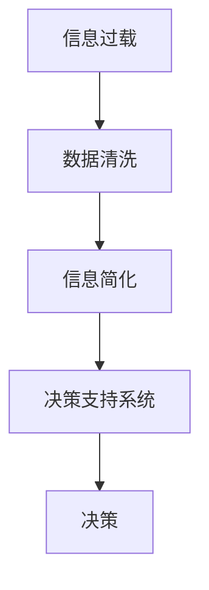

                 

# 信息简化的好处：如何在复杂中做出更好的决策

在当今信息爆炸的时代，我们每天都在被海量数据和信息包围。无论是工作还是生活，决策过程都越来越依赖于数据分析和计算。然而，随着数据规模的增长，决策的复杂性也随之增加，这对我们的决策能力提出了新的挑战。本文将探讨信息简化的好处，并介绍如何在复杂环境中做出更好的决策。

## 1. 背景介绍

### 1.1 问题由来

在现代社会，决策过程变得越来越复杂。无论是企业的战略规划、市场营销、还是个人的投资、日常选择，决策的依据都是基于大量数据和信息。然而，数据的增加不仅意味着机会的增多，也带来了巨大的决策难度。决策者需要从海量数据中提取有用信息，进行数据清洗、处理、分析，然后才能得出结论。

### 1.2 问题核心关键点

1. **信息过载**：海量数据带来了信息过载的问题，使得决策者难以在短时间内处理完所有信息。
2. **复杂性增加**：随着数据规模的增长，决策模型和算法的复杂度也在增加，导致决策过程变得更加困难。
3. **误导性信息**：在数据中，存在大量的误导性信息，增加了决策的难度。
4. **实时性要求**：现代决策往往需要实时进行，如何在保证速度的同时做出准确决策是一大挑战。

### 1.3 问题研究意义

研究信息简化的好处，可以帮助决策者在复杂环境中快速做出决策。通过对海量数据的处理和分析，提升决策的准确性和效率，减少决策过程中的不确定性和误导性。

## 2. 核心概念与联系

### 2.1 核心概念概述

为了更好地理解信息简化的概念，我们需要先介绍几个核心概念：

1. **信息过载（Information Overload）**：指在信息系统中，信息量过大，超过了用户或系统的处理能力。
2. **数据清洗（Data Cleaning）**：指从原始数据中去除噪声、缺失值、异常值等无用信息，提取有用信息的过程。
3. **信息简化（Information Simplification）**：指通过减少数据的维度和复杂性，将复杂的信息转换为更易于理解的形式，以便于分析和决策。
4. **决策支持系统（Decision Support System, DSS）**：指利用计算机技术和数据分析方法，辅助决策者进行决策的系统。

这些概念之间的联系可以通过以下Mermaid流程图来展示：



这个流程图展示了信息过载、数据清洗、信息简化和决策支持系统之间的联系：

1. 信息过载需要通过数据清洗来减少信息量，使其符合系统的处理能力。
2. 数据清洗后的信息需要通过信息简化来进一步简化，以便于系统进行分析和处理。
3. 简化的信息通过决策支持系统进行处理，辅助决策者做出决策。

## 3. 核心算法原理 & 具体操作步骤

### 3.1 算法原理概述

信息简化的核心思想是通过算法和技术手段，将复杂的信息转化为易于理解和处理的形式。信息简化的过程包括数据清洗、特征提取、降维等步骤。这些步骤通过机器学习和数据科学的方法，将复杂的信息转换为结构化的、易于处理的形式。

### 3.2 算法步骤详解

信息简化的过程可以大致分为以下几个步骤：

**Step 1: 数据收集与预处理**

- 收集相关的数据，并进行初步的数据清洗和预处理。

**Step 2: 特征选择与提取**

- 选择和提取对决策有帮助的特征，去除无关或冗余特征。

**Step 3: 信息压缩与降维**

- 使用降维算法（如主成分分析、线性判别分析等）将高维数据压缩到低维空间。

**Step 4: 决策模型构建**

- 使用机器学习算法构建决策模型，如线性回归、逻辑回归、支持向量机等。

**Step 5: 信息可视化**

- 通过可视化工具将决策过程和结果可视化，便于决策者理解和使用。

### 3.3 算法优缺点

信息简化的优点包括：

1. **提高决策效率**：简化的信息更容易处理，可以大大提高决策效率。
2. **降低决策成本**：通过简化的信息，减少了处理和分析的数据量，降低了决策成本。
3. **提高决策准确性**：简化的信息更容易处理，减少了噪声和冗余，提高了决策的准确性。

信息简化的缺点包括：

1. **信息丢失**：在简化的过程中，可能丢失部分有用信息。
2. **复杂性增加**：简化的过程本身也增加了算法的复杂性。

### 3.4 算法应用领域

信息简化技术在多个领域都有广泛应用，包括但不限于：

1. **金融领域**：在金融决策中，信息简化可以帮助投资者快速做出投资决策。
2. **市场营销**：在市场营销中，信息简化可以帮助企业快速分析市场趋势和消费者行为。
3. **医疗领域**：在医疗决策中，信息简化可以帮助医生快速诊断和治疗疾病。
4. **科学研究**：在科学研究中，信息简化可以帮助科学家快速分析实验数据，发现规律。

## 4. 数学模型和公式 & 详细讲解

### 4.1 数学模型构建

信息简化的过程可以通过数学模型来表示。假设原始数据集为 $\mathcal{D} = \{(x_i, y_i)\}_{i=1}^N$，其中 $x_i$ 为输入特征，$y_i$ 为输出标签。信息简化的目标是将输入特征 $x_i$ 压缩到低维空间 $z_i = \phi(x_i)$，其中 $\phi$ 为压缩函数。

### 4.2 公式推导过程

以主成分分析（Principal Component Analysis, PCA）为例，推导信息简化的数学模型。PCA通过将高维数据投影到低维空间，将数据的方差最大化，以达到信息简化的目的。

PCA的目标是找到一个投影矩阵 $W$，使得：

$$
\min_{W} \sum_{i=1}^N ||W^T x_i - z_i||^2 \text{ subject to } ||z_i||^2 = 1
$$

其中 $W$ 为投影矩阵，$z_i$ 为投影后的特征向量。通过求解上述优化问题，可以得到投影矩阵 $W$，进而将高维数据投影到低维空间。

### 4.3 案例分析与讲解

以一个简单的股票投资决策为例，展示信息简化的应用。

假设有一组股票的历史数据，包括开盘价、收盘价、成交量等。决策者需要从这些数据中提取有用的信息，构建投资决策模型。

**Step 1: 数据收集与预处理**

- 收集股票的历史数据，并进行初步的数据清洗和预处理，去除缺失值和异常值。

**Step 2: 特征选择与提取**

- 选择和提取对投资决策有帮助的特征，如开盘价、收盘价、成交量、涨跌幅等。

**Step 3: 信息压缩与降维**

- 使用PCA算法将高维数据压缩到低维空间，提取最重要的信息。

**Step 4: 决策模型构建**

- 使用线性回归或支持向量机构建投资决策模型，预测股票的未来走势。

**Step 5: 信息可视化**

- 将决策结果可视化，展示在图表中，便于决策者理解和使用。

通过信息简化的过程，决策者可以快速从海量数据中提取有用信息，构建投资决策模型，提高决策的效率和准确性。

## 5. 项目实践：代码实例和详细解释说明

### 5.1 开发环境搭建

在进行信息简化实践前，我们需要准备好开发环境。以下是使用Python进行Scikit-learn开发的环境配置流程：

1. 安装Anaconda：从官网下载并安装Anaconda，用于创建独立的Python环境。

2. 创建并激活虚拟环境：
```bash
conda create -n scikit-learn-env python=3.8 
conda activate scikit-learn-env
```

3. 安装Scikit-learn：
```bash
pip install scikit-learn numpy pandas matplotlib seaborn
```

4. 安装TensorFlow和Pandas等工具包：
```bash
pip install tensorflow pandas
```

完成上述步骤后，即可在`scikit-learn-env`环境中开始信息简化的实践。

### 5.2 源代码详细实现

以下是一个简单的信息简化项目，用于股票投资决策的Scikit-learn代码实现：

```python
import pandas as pd
from sklearn.decomposition import PCA
from sklearn.linear_model import LinearRegression

# 加载股票数据
data = pd.read_csv('stock_data.csv')

# 数据预处理
data = data.dropna()

# 特征选择
features = ['open', 'high', 'low', 'volume', 'change']
X = data[features].values

# 数据降维
pca = PCA(n_components=2)
X_pca = pca.fit_transform(X)

# 模型构建
y = data['price'].values
X_train, X_test, y_train, y_test = train_test_split(X_pca, y, test_size=0.2)
reg = LinearRegression()
reg.fit(X_train, y_train)

# 模型评估
score = reg.score(X_test, y_test)
print(f"模型评估得分: {score:.3f}")
```

### 5.3 代码解读与分析

让我们再详细解读一下关键代码的实现细节：

**数据加载与预处理**

- 使用Pandas加载股票数据，并去除缺失值和异常值。

**特征选择**

- 选择开盘价、收盘价、成交量等特征，用于构建投资决策模型。

**数据降维**

- 使用PCA算法将高维数据压缩到2维空间，提取最重要的信息。

**模型构建**

- 使用线性回归模型构建投资决策模型，预测股票的未来走势。

**模型评估**

- 在测试集上评估模型性能，输出模型评估得分。

可以看到，通过使用Scikit-learn，信息简化的实践变得简洁高效。开发者可以将更多精力放在数据处理、模型改进等高层逻辑上，而不必过多关注底层的实现细节。

当然，工业级的系统实现还需考虑更多因素，如模型的保存和部署、超参数的自动搜索、更灵活的任务适配层等。但核心的信息简化范式基本与此类似。

## 6. 实际应用场景

### 6.1 金融领域

在金融领域，信息简化技术可以帮助投资者快速做出投资决策。例如，通过信息简化，可以提取关键的市场特征，构建投资组合，进行风险评估和预测。

**应用场景示例**：

- 构建股票投资组合：通过信息简化，提取重要的股票特征，构建投资组合，并进行风险评估和预测。
- 预测市场趋势：通过信息简化，提取重要的市场特征，构建预测模型，预测市场趋势和收益率。

### 6.2 市场营销

在市场营销中，信息简化可以帮助企业快速分析市场趋势和消费者行为。

**应用场景示例**：

- 市场细分：通过信息简化，提取重要的市场特征，进行市场细分，确定目标客户群体。
- 消费者行为预测：通过信息简化，提取重要的消费者行为特征，预测消费者的购买行为和偏好。

### 6.3 医疗领域

在医疗领域，信息简化可以帮助医生快速诊断和治疗疾病。

**应用场景示例**：

- 患者诊断：通过信息简化，提取重要的患者特征，进行疾病诊断和治疗方案推荐。
- 治疗效果评估：通过信息简化，提取重要的治疗特征，评估治疗效果和副作用。

### 6.4 科学研究

在科学研究中，信息简化可以帮助科学家快速分析实验数据，发现规律。

**应用场景示例**：

- 数据挖掘：通过信息简化，提取重要的实验数据特征，进行数据挖掘和模式发现。
- 实验预测：通过信息简化，提取重要的实验参数特征，进行实验预测和设计。

## 7. 工具和资源推荐

### 7.1 学习资源推荐

为了帮助开发者系统掌握信息简化的理论基础和实践技巧，这里推荐一些优质的学习资源：

1. **《机器学习》**：由周志华教授所著的机器学习教材，涵盖了数据预处理、特征选择、降维等重要内容。

2. **《Python数据科学手册》**：由Jake VanderPlas所著的数据科学入门教材，介绍了Python在数据处理和分析中的应用。

3. **Coursera的《数据科学与机器学习》课程**：由斯坦福大学和IBM联合开设的在线课程，涵盖数据预处理、特征工程、降维等重要内容。

4. **Kaggle平台**：世界著名的数据科学竞赛平台，提供丰富的数据集和竞赛任务，用于实践和验证信息简化的效果。

通过对这些资源的学习实践，相信你一定能够快速掌握信息简化的精髓，并用于解决实际的决策问题。

### 7.2 开发工具推荐

高效的开发离不开优秀的工具支持。以下是几款用于信息简化开发的常用工具：

1. **Python**：Python是目前最流行的数据科学编程语言，提供了丰富的数据处理和分析库，如Pandas、NumPy、Scikit-learn等。

2. **R语言**：R语言是数据科学领域的重要工具，提供了丰富的统计分析和可视化工具，如ggplot2、dplyr等。

3. **TensorFlow**：由Google主导开发的开源深度学习框架，生产部署方便，适合大规模工程应用。

4. **Jupyter Notebook**：用于编写和分享代码的轻量级Web应用，支持多种编程语言和数据格式。

5. **Matplotlib**：用于绘制图表和可视化数据的Python库，支持多种图形类型。

6. **Seaborn**：基于Matplotlib的高级数据可视化库，提供了更美观和更高效的绘图方式。

合理利用这些工具，可以显著提升信息简化的开发效率，加快创新迭代的步伐。

### 7.3 相关论文推荐

信息简化的发展源于学界的持续研究。以下是几篇奠基性的相关论文，推荐阅读：

1. **主成分分析（PCA）**：由Hotelling在1933年提出的降维算法，广泛应用于数据压缩和特征提取。

2. **独立成分分析（ICA）**：由Hyvarinen在1999年提出的降维算法，适用于非高斯数据的特征提取。

3. **LLE（局部线性嵌入）**：由Roweis在2000年提出的降维算法，适用于非线性数据的特征提取。

4. **t-SNE（t分布随机邻域嵌入）**：由van der Maaten在2008年提出的降维算法，适用于高维数据的可视化。

5. **Autoencoder（自编码器）**：由Hinton在1986年提出的神经网络模型，适用于无监督数据的特征提取。

这些论文代表了大数据简化技术的发展脉络。通过学习这些前沿成果，可以帮助研究者把握学科前进方向，激发更多的创新灵感。

## 8. 总结：未来发展趋势与挑战

### 8.1 总结

本文对信息简化的概念和应用进行了全面系统的介绍。首先阐述了信息过载和复杂性增加的问题，明确了信息简化的重要性。其次，从原理到实践，详细讲解了信息简化的数学原理和关键步骤，给出了信息简化的完整代码实例。同时，本文还探讨了信息简化的实际应用场景，展示了信息简化的广泛应用前景。最后，本文精选了信息简化的各类学习资源，力求为读者提供全方位的技术指引。

通过本文的系统梳理，可以看到，信息简化技术在信息爆炸时代具有重要价值，能够帮助决策者在复杂环境中快速做出决策，提升决策的效率和准确性。未来，伴随信息技术的不断发展，信息简化的技术将进一步优化和升级，为决策者提供更强大、更高效的支持。

### 8.2 未来发展趋势

展望未来，信息简化的发展趋势将包括以下几个方面：

1. **自动化信息简化**：随着机器学习和自动化技术的发展，信息简化的过程将更加自动化，减少人工干预，提高效率。

2. **多模态信息融合**：未来的信息简化将不仅仅局限于文本数据，还将融合图像、视频、语音等多种模态数据，实现多模态信息的协同建模。

3. **实时性提升**：未来的信息简化将更加注重实时性，支持实时数据处理和分析，满足决策者的实时需求。

4. **分布式计算**：随着数据规模的增长，信息简化的过程将更加依赖于分布式计算，支持大规模数据的处理和分析。

5. **智能决策支持**：未来的信息简化将结合人工智能技术，提供更智能的决策支持，如基于规则的决策系统、基于数据挖掘的推荐系统等。

这些趋势凸显了信息简化的广阔前景，将为决策者在复杂环境中提供更强大的支持，推动决策科学的发展。

### 8.3 面临的挑战

尽管信息简化技术已经取得了瞩目成就，但在迈向更加智能化、普适化应用的过程中，它仍面临着诸多挑战：

1. **数据隐私和安全**：信息简化过程中涉及大量的数据处理和分析，数据隐私和安全问题亟需解决。

2. **模型可解释性**：信息简化模型通常是一个黑箱，难以解释其内部工作机制和决策逻辑。

3. **鲁棒性和泛化性**：信息简化模型面对复杂和多变的现实场景，鲁棒性和泛化性需要进一步提升。

4. **计算资源消耗**：信息简化过程通常涉及高维数据的降维和特征选择，计算资源消耗较大。

5. **数据质量问题**：信息简化依赖于高质量的数据，低质量的数据可能导致模型性能下降。

这些挑战需要进一步研究和解决，才能推动信息简化技术的进一步发展。

### 8.4 研究展望

未来的研究需要在以下几个方面寻求新的突破：

1. **数据预处理技术**：探索更加高效和智能的数据预处理技术，减少数据清洗和预处理的时间和成本。

2. **特征选择方法**：研究更有效的特征选择方法，提高特征选择和提取的效率和效果。

3. **降维算法优化**：优化现有的降维算法，提高降维过程的效率和效果。

4. **智能决策支持系统**：结合人工智能技术，提供更智能的决策支持，如基于规则的决策系统、基于数据挖掘的推荐系统等。

5. **实时性提升**：探索更加高效的实时处理和分析技术，支持实时数据处理和分析。

6. **分布式计算**：探索更加高效的分布式计算技术，支持大规模数据的处理和分析。

这些研究方向的探索，必将推动信息简化技术的进一步发展，为决策者提供更强大、更高效的支持。只有勇于创新、敢于突破，才能不断拓展信息简化的边界，让信息技术更好地造福人类社会。

## 9. 附录：常见问题与解答

**Q1: 信息简化会丢失部分有用信息吗？**

A: 是的，信息简化可能会丢失部分有用信息。但在实际应用中，信息简化的过程通常通过多维度评估和选择，选择最重要的特征进行降维，尽可能保留有用信息。

**Q2: 信息简化的过程需要人工干预吗？**

A: 在初期，信息简化的过程可能需要人工干预，如特征选择、数据清洗等。但随着自动化技术的发展，信息简化的过程将更加自动化，减少人工干预。

**Q3: 信息简化的过程会消耗大量计算资源吗？**

A: 是的，信息简化的过程通常涉及高维数据的降维和特征选择，计算资源消耗较大。因此，需要优化计算资源消耗，提高信息简化的效率。

**Q4: 信息简化能否应用于实时决策？**

A: 是的，信息简化可以应用于实时决策，通过实时数据处理和分析，支持实时决策。

**Q5: 信息简化的技术有哪些？**

A: 信息简化的技术包括数据清洗、特征选择、降维等。其中，常用的降维算法包括PCA、LLE、ICA等。

通过本文的系统梳理，可以看到，信息简化技术在信息爆炸时代具有重要价值，能够帮助决策者在复杂环境中快速做出决策，提升决策的效率和准确性。未来，伴随信息技术的不断发展，信息简化的技术将进一步优化和升级，为决策者提供更强大、更高效的支持。只有勇于创新、敢于突破，才能不断拓展信息简化的边界，让信息技术更好地造福人类社会。

---

作者：禅与计算机程序设计艺术 / Zen and the Art of Computer Programming

