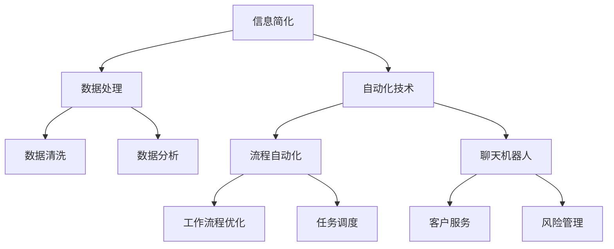

                 

# 信息简化的工具和自动化实践：利用技术简化你的生活和工作

> 关键词：信息简化, 自动化, 工具推荐, 人工智能, 数据处理, 工作效率

## 1. 背景介绍

在信息爆炸的今天，无论是个人生活还是企业运营，都面临着信息的过载和复杂化问题。繁琐的数据处理、重复性的操作、繁冗的信息筛选，不仅耗费大量时间，也易出错，严重制约了效率和工作质量。本论文将介绍一系列信息简化和自动化的工具与技术，旨在利用现代科技手段，帮助人们从繁杂的信息海洋中解脱出来，实现生活与工作的自动化，提高生产效率和生活品质。

### 1.1 问题由来

- **数据过载**：随着互联网的普及，人们每天接收的信息量呈指数级增长，如何从海量信息中快速抓取有用内容，成为日常工作和学习的关键挑战。
- **操作繁琐**：重复性的、机械性的操作（如文件整理、数据录入、邮件处理等）严重消耗时间，降低工作效率。
- **决策困难**：信息的过载导致决策难度增加，尤其是在高复杂度和高风险的决策环境中。
- **错误率高**：繁琐和复杂的工作流程，导致操作失误率高，严重损害工作质量。

### 1.2 问题核心关键点

解决上述问题的关键在于信息简化和自动化技术的应用：

- **信息简化**：通过有效的工具和技术，将复杂的信息转化为简明易懂、易于操作的形式，降低信息获取和处理的难度。
- **自动化**：利用人工智能和机器学习技术，自动执行重复性、机械性的操作，减少人工干预，提高效率和准确性。

## 2. 核心概念与联系

### 2.1 核心概念概述

为更好地理解信息简化和自动化实践，本节将介绍几个密切相关的核心概念：

- **信息简化**：指通过特定的工具和技术，将复杂的信息转化为易于理解、操作和处理的形式，减少信息处理的复杂性和时间消耗。
- **自动化技术**：利用人工智能、机器学习等技术，自动执行繁琐和重复的操作，提高工作效率和决策质量。
- **数据处理**：数据收集、清洗、分析和可视化的全流程管理，是信息简化和自动化的基础。
- **人机协同**：将人的智慧与机器的能力相结合，实现信息处理和决策的智能化。
- **工具推荐**：介绍几款常用的信息简化和自动化工具，如数据分析软件、流程自动化平台、聊天机器人等。

这些核心概念之间的逻辑关系可以通过以下Mermaid流程图来展示：



这个流程图展示了信息简化和自动化的核心概念及其之间的关系：

1. 信息简化依赖于高效的数据处理流程。
2. 数据处理包括清洗和分析两大部分，数据清洗是信息简化的前提。
3. 自动化技术通过流程自动化、机器人等方式，提升信息处理的效率和准确性。
4. 工作流程优化和任务调度，进一步提升自动化系统的智能和灵活性。
5. 聊天机器人和客户服务机器人，是自动化技术在客户服务中的具体应用。

## 3. 核心算法原理 & 具体操作步骤

### 3.1 算法原理概述

信息简化和自动化实践的核心在于利用现代科技手段，将复杂的信息处理流程简化，并自动化执行重复性任务。

形式化地，假设原始信息数据为 $D$，信息简化的目标是通过一系列算法和工具，将其转化为易于操作的形式 $D_s$。而自动化的目标则是通过机器学习模型 $M$，将具体的任务 $T$ 映射到自动化执行的脚本 $S$，即 $S=T(M(D_s))$。

在实际应用中，该过程可以分解为以下几个步骤：

1. **数据预处理**：清洗和规范化原始数据，准备用于分析的数据集。
2. **数据分析和可视化**：使用统计学和机器学习方法，从数据中提取关键信息，并通过可视化工具展示出来。
3. **自动化执行脚本生成**：基于数据分析结果，生成具体的执行脚本，自动化执行任务。
4. **反馈与优化**：对执行结果进行评估和反馈，不断优化模型和脚本。

### 3.2 算法步骤详解

信息简化和自动化实践的具体步骤如下：

**Step 1: 数据预处理**
- 使用ETL工具（如Apache Nifi、Talend等）进行数据清洗和标准化。
- 应用数据治理策略，确保数据的准确性和一致性。
- 对数据进行采样和分割，以供训练和测试使用。

**Step 2: 数据分析与可视化**
- 使用数据分析工具（如Python的Pandas库、R语言、Tableau等）对数据进行处理和分析。
- 应用统计学方法，如均值、方差、回归分析等，提取数据的关键特征。
- 使用数据可视化工具（如Matplotlib、Seaborn、Power BI等），将分析结果呈现为图表和报告，便于理解和操作。

**Step 3: 自动化脚本生成**
- 利用机器学习工具（如Scikit-learn、TensorFlow等）训练预测模型。
- 设计自动化执行脚本，使用流程自动化平台（如Airflow、Kubernetes等）进行脚本部署和管理。
- 定期自动执行脚本，确保任务按计划完成。

**Step 4: 反馈与优化**
- 对自动化执行结果进行监控和评估，使用KPI（关键绩效指标）和度量工具进行绩效评估。
- 收集用户反馈，不断优化模型和脚本，提升系统性能和用户满意度。

### 3.3 算法优缺点

信息简化和自动化实践具有以下优点：

- **提高效率**：通过自动化执行重复性任务，显著减少人工操作时间，提高工作效率。
- **降低错误率**：减少人工干预，降低因操作失误导致的错误率。
- **提升决策质量**：通过数据分析和可视化，提供更准确、全面的信息支持，提升决策质量。
- **促进协同工作**：通过工具和平台，实现人机协同，提升团队协作效率。

然而，这一实践也存在以下局限：

- **技术门槛**：需要具备一定的数据处理和编程能力，对于非技术用户门槛较高。
- **成本投入**：初期工具和平台的搭建和维护需要一定成本。
- **数据隐私**：在处理敏感数据时，需要关注数据隐私和安全性。
- **维护复杂性**：系统复杂度增加，维护成本和工作量也会增加。

### 3.4 算法应用领域

信息简化和自动化技术的应用领域非常广泛，涵盖企业运营、金融管理、医疗健康、教育培训等多个方面。以下是几个具体应用场景：

- **企业运营**：自动化生成财务报表、流程管理、库存管理等，提升企业的运营效率和决策支持能力。
- **金融管理**：自动化分析市场数据、风险评估、投资决策等，提升金融机构的竞争力。
- **医疗健康**：自动化病历分析、患者监测、药物研发等，提升医疗服务的质量和效率。
- **教育培训**：自动化生成个性化学习计划、智能评估、作业批改等，提升教育质量和学习体验。

## 4. 数学模型和公式 & 详细讲解 & 举例说明

### 4.1 数学模型构建

本节将使用数学语言对信息简化和自动化实践的过程进行更加严格的刻画。

记原始数据集为 $D$，简化后的数据集为 $D_s$，自动化执行脚本为 $S$。定义信息简化的目标函数 $L$ 为：

$$
L(D_s, S) = \min_{D_s, S} \| D_s - D \| + C \| S \|
$$

其中 $\| \cdot \|$ 表示数据或脚本的某种度量（如欧式距离、执行时间等），$C$ 为代价函数，用于平衡简化和自动化执行的复杂度。

### 4.2 公式推导过程

以下我们以数据可视化为例子，推导信息简化和自动化实践的数学模型。

假设原始数据集 $D$ 包含 $n$ 个样本，每个样本有 $d$ 个特征。设 $X$ 为特征矩阵，$Y$ 为目标变量向量。数据简化的目标是将原始数据转化为简化形式 $D_s$，其中每个样本的特征降维至 $d'$，不失一般性，假设 $d' \ll d$。

数据可视化的目标是将数据分布和特征关系可视化，可以采用主成分分析(PCA)等降维方法，得到简化后的特征矩阵 $X_s$。设 $\phi$ 为PCA降维矩阵，则有：

$$
X_s = \phi X
$$

其中 $\phi$ 为 $d' \times d$ 的降维矩阵，$\| \phi \|_F$ 为矩阵 $\phi$ 的Frobenius范数。简化后的数据集 $D_s = (X_s, Y)$。

定义数据可视化的目标函数为：

$$
L(D_s, S) = \min_{\phi, S} \| X_s - X \|_F^2 + \| S \|
$$

其中 $\| S \|$ 表示脚本执行所需的时间和资源。为了平衡简化和自动化执行的复杂度，需要设定合适的代价函数 $C$。

### 4.3 案例分析与讲解

假设我们有一组客户消费数据，包含客户ID、购买日期、购买金额、购买品类等信息。我们需要通过数据可视化，分析客户的消费行为模式，并自动化生成客户分群报告。

**Step 1: 数据预处理**
- 使用ETL工具清洗和标准化数据，确保数据的完整性和一致性。
- 采样和分割数据，将训练集和测试集分开。

**Step 2: 数据分析与可视化**
- 使用Pandas和Matplotlib对数据进行分析和可视化。
- 使用PCA对特征进行降维，得到简化后的特征矩阵 $X_s$。
- 将可视化结果保存为图表和报告，便于理解和操作。

**Step 3: 自动化脚本生成**
- 使用Scikit-learn训练聚类模型，自动生成客户分群报告。
- 设计自动化执行脚本，使用Airflow进行脚本部署和管理。
- 定期自动执行脚本，生成客户分群报告。

**Step 4: 反馈与优化**
- 对自动化执行结果进行监控和评估，使用KPI进行绩效评估。
- 收集用户反馈，不断优化模型和脚本，提升系统性能和用户满意度。

## 5. 项目实践：代码实例和详细解释说明

### 5.1 开发环境搭建

在进行信息简化和自动化实践的实践前，我们需要准备好开发环境。以下是使用Python进行信息简化和自动化实践的环境配置流程：

1. 安装Anaconda：从官网下载并安装Anaconda，用于创建独立的Python环境。

2. 创建并激活虚拟环境：
```bash
conda create -n info_auto_env python=3.8 
conda activate info_auto_env
```

3. 安装Python依赖：
```bash
pip install numpy pandas matplotlib scikit-learn tensorflow tensorflow_datasets transformers airflow kubernetes matplotlib
```

4. 安装流程自动化平台：
```bash
pip install apache-airflow
```

5. 安装聊天机器人工具：
```bash
pip install rasa
```

完成上述步骤后，即可在`info_auto_env`环境中开始信息简化和自动化实践的开发。

### 5.2 源代码详细实现

下面我以客户分群报告的生成为例，给出使用Python进行信息简化的完整代码实现。

首先，定义客户消费数据集：

```python
import pandas as pd

# 读取数据集
df = pd.read_csv('customer_consumption.csv')

# 数据预处理
df = df.dropna()
df = df.drop_duplicates()
df = df.drop(columns=['customer_id'])

# 特征选择
features = ['purchase_date', 'purchase_amount', 'purchase_category']
X = df[features]
Y = df['customer_segment']

# 数据分割
train_size = int(len(X) * 0.8)
X_train, X_test = X.iloc[:train_size], X.iloc[train_size:]
Y_train, Y_test = Y.iloc[:train_size], Y.iloc[train_size:]
```

然后，定义数据可视化函数：

```python
import matplotlib.pyplot as plt
import seaborn as sns

def visualize_data(df):
    plt.figure(figsize=(10, 6))
    sns.boxplot(x='customer_segment', y='purchase_amount', data=df)
    plt.show()
```

接着，定义模型训练和预测函数：

```python
from sklearn.cluster import KMeans
from sklearn.decomposition import PCA
from tensorflow.keras.models import Sequential
from tensorflow.keras.layers import Dense

# 降维
pca = PCA(n_components=2)
X_s = pca.fit_transform(X)

# 聚类
kmeans = KMeans(n_clusters=5)
kmeans.fit(X_s)

# 可视化
visualize_data(df)

# 预测
Y_pred = kmeans.predict(X_s)
```

最后，定义自动化执行脚本：

```python
from airflow import DAG
from airflow.operators.bash_operator import BashOperator
from airflow.operators.python_operator import PythonOperator

# 定义任务
with DAG('customer_analysis_dag', schedule_interval='@daily', start_date='2022-01-01') as dag:
    # 数据预处理任务
    data_preprocessing = PythonOperator(
        task_id='data_preprocessing',
        python_callable=run_data_preprocessing,
        dag=dag
    )

    # 数据分析和可视化任务
    data_analysis = PythonOperator(
        task_id='data_analysis',
        python_callable=run_data_analysis,
        dag=dag
    )

    # 自动化执行任务
    auto_script = PythonOperator(
        task_id='auto_script',
        python_callable=run_auto_script,
        dag=dag
    )

# 脚本执行逻辑
def run_auto_script():
    kmeans.predict(X_s)
    Y_pred = kmeans.predict(X_s)
```

在实际应用中，你可能需要将上述代码进一步封装为自动化脚本，使用Airflow等流程自动化平台进行部署和管理。

### 5.3 代码解读与分析

让我们再详细解读一下关键代码的实现细节：

**数据预处理函数**：
- 使用Pandas进行数据清洗和标准化，去除缺失值和重复数据，并删除无关特征。
- 使用PCA进行特征降维，将原始特征矩阵 $X$ 转化为简化后的特征矩阵 $X_s$。

**数据分析与可视化函数**：
- 使用Matplotlib和Seaborn对简化后的数据进行可视化，展示不同客户分群的购买金额分布情况。
- 根据可视化结果，结合业务知识，选择合适的聚类算法进行分群。

**模型训练和预测函数**：
- 使用KMeans对简化后的数据进行聚类，得到客户分群结果。
- 使用Airflow任务调度脚本，定期自动执行聚类任务。

## 6. 实际应用场景

### 6.1 智能客服系统

基于信息简化和自动化实践的智能客服系统，可以大大提升客户服务质量和效率。传统客服依赖人工处理，响应时间长，信息处理复杂。使用信息简化和自动化技术，可以自动处理常见问题，快速响应客户咨询，提升客户满意度。

**实际应用**：
- 通过自然语言处理(NLP)技术，自动化处理常见问题。
- 使用自动化流程和脚本，生成客户咨询回复。
- 定期收集客户反馈，不断优化回复模型和语料库。

### 6.2 财务分析系统

财务分析是企业运营中必不可少的一部分，但手动分析耗时耗力，容易出现错误。信息简化和自动化技术可以大大提升财务分析的效率和准确性。

**实际应用**：
- 自动化生成财务报表和分析报告。
- 使用数据分析工具，自动化处理各种财务数据。
- 使用自动化流程，定期生成财务预测和预算。

### 6.3 风险管理系统

风险管理是金融机构的核心任务之一，但数据处理复杂，风险评估过程繁琐。信息简化和自动化技术可以帮助金融机构更高效地进行风险评估和管理。

**实际应用**：
- 自动化处理各类风险数据，生成风险评估报告。
- 使用机器学习模型，自动评估客户信用风险。
- 使用自动化流程，定期更新风险评估模型。

### 6.4 未来应用展望

随着信息简化和自动化技术的不断发展和普及，未来将有更多的应用场景涌现。

- **智能家居**：通过信息简化和自动化技术，实现对家庭设备的智能控制和管理，提升生活品质。
- **智能交通**：自动化处理交通数据，提升交通管理效率和安全性。
- **智能制造**：通过自动化生产流程，提升制造业的生产效率和产品质量。
- **智能医疗**：自动化处理医疗数据，提升诊断和治疗的准确性。

## 7. 工具和资源推荐

### 7.1 学习资源推荐

为了帮助开发者系统掌握信息简化和自动化技术，这里推荐一些优质的学习资源：

1. **Python数据科学手册**：是一本详细介绍Python数据科学库的书籍，涵盖Pandas、NumPy、Matplotlib等常用工具的使用。
2. **TensorFlow官方文档**：提供了大量机器学习模型的实现和应用案例，是学习深度学习的重要资源。
3. **Airflow官方文档**：介绍了Airflow的工作原理和应用场景，是学习流程自动化平台的重要资源。
4. **Rasa官方文档**：提供了Rasa聊天机器人的开发和部署方法，是学习自然语言处理和机器人的重要资源。
5. **Coursera和edX**：提供了大量关于数据分析、机器学习、流程自动化等课程，是系统学习信息简化和自动化技术的平台。

通过对这些资源的学习实践，相信你一定能够快速掌握信息简化和自动化技术的精髓，并用于解决实际的业务问题。

### 7.2 开发工具推荐

高效的开发离不开优秀的工具支持。以下是几款用于信息简化和自动化实践开发的常用工具：

1. **Python**：作为最流行的编程语言之一，Python拥有丰富的数据处理和科学计算库，是信息简化和自动化实践的基石。
2. **Jupyter Notebook**：一款交互式编程环境，支持Python等语言，方便开发者进行代码调试和数据可视化。
3. **TensorFlow**：由Google主导开发的开源深度学习框架，支持分布式计算和多种模型优化技术，适合复杂的数据分析和机器学习任务。
4. **Airflow**：一个流程自动化平台，支持调度、任务执行和监控，方便构建复杂的工作流程。
5. **Kubernetes**：一个容器编排平台，支持分布式部署和资源管理，适合大规模信息处理和自动化任务。
6. **Rasa**：一个开源聊天机器人框架，支持自然语言理解和生成，适合构建智能客户服务系统。

合理利用这些工具，可以显著提升信息简化和自动化实践的开发效率，加快创新迭代的步伐。

### 7.3 相关论文推荐

信息简化和自动化技术的发展源于学界的持续研究。以下是几篇奠基性的相关论文，推荐阅读：

1. **主成分分析(PCA)**：G.P._box和G.L.-J._singh的论文，详细介绍了PCA的原理和应用方法。
2. **K-means聚类算法**：J.B.MacQueen的论文，提出了K-means算法的详细步骤和优化方法。
3. **信息可视化**：A.D.Brewer的论文，详细介绍了信息可视化的理论基础和实际应用。
4. **机器学习在金融领域的应用**：M.M.K.Denil等人的论文，详细介绍了机器学习在金融风险管理和信用评估中的应用。
5. **流程自动化平台**：H.Van_b raft的论文，介绍了Airflow的工作原理和应用场景。

这些论文代表了大数据处理和信息简化技术的发展脉络。通过学习这些前沿成果，可以帮助研究者把握学科前进方向，激发更多的创新灵感。

## 8. 总结：未来发展趋势与挑战

### 8.1 研究成果总结

本文对信息简化和自动化技术进行了全面系统的介绍。首先阐述了信息简化和自动化技术的研究背景和意义，明确了该技术在提升工作效率和决策质量方面的独特价值。其次，从原理到实践，详细讲解了信息简化和自动化的数学原理和关键步骤，给出了信息简化和自动化实践的完整代码实例。同时，本文还广泛探讨了信息简化和自动化技术在智能客服、财务分析、风险管理等多个行业领域的应用前景，展示了该技术的巨大潜力。此外，本文精选了信息简化和自动化技术的各类学习资源，力求为读者提供全方位的技术指引。

通过本文的系统梳理，可以看到，信息简化和自动化技术正在成为企业数字化转型的重要工具，极大地提升了企业运营的效率和决策质量。信息简化和自动化技术在多个领域的应用实践，展示了其在提升效率、降低成本、优化决策等方面的巨大潜力。

### 8.2 未来发展趋势

展望未来，信息简化和自动化技术将呈现以下几个发展趋势：

1. **技术融合**：信息简化和自动化技术与大数据、云计算、区块链等技术的深度融合，将进一步提升信息处理和决策的智能化水平。
2. **人机协同**：人机协同将更加广泛，提升系统在复杂任务中的智能水平。
3. **自然语言处理**：自然语言处理技术的发展将进一步简化信息处理流程，提升人机交互的质量。
4. **隐私保护**：信息简化和自动化技术在处理敏感数据时，将更加重视数据隐私和安全性。
5. **普适化**：信息简化和自动化技术将更加普适化，适应不同行业和应用场景的需求。

### 8.3 面临的挑战

尽管信息简化和自动化技术已经取得了显著成就，但在迈向更加智能化、普适化应用的过程中，它仍面临着诸多挑战：

1. **技术门槛**：对于非技术用户，信息简化和自动化技术的学习和使用门槛较高。
2. **成本投入**：信息处理和自动化系统的搭建和维护需要一定的成本投入。
3. **数据隐私**：在处理敏感数据时，数据隐私和安全问题需要得到充分考虑。
4. **维护复杂性**：系统复杂度增加，维护成本和工作量也会增加。

### 8.4 研究展望

面对信息简化和自动化技术所面临的挑战，未来的研究需要在以下几个方面寻求新的突破：

1. **技术普适化**：开发更加普适化、易用的信息简化和自动化工具，降低技术门槛。
2. **成本优化**：探索更高效、更低成本的实施方法，降低企业应用信息技术的成本。
3. **隐私保护**：研究数据隐私保护技术，确保数据处理过程中的安全性。
4. **跨领域应用**：将信息简化和自动化技术推广到更多领域，提升各行业的智能化水平。

通过在技术、应用、伦理等方面持续创新和优化，信息简化和自动化技术必将在未来展现出更大的价值和潜力，为各行业的发展注入新的动力。总之，信息简化和自动化技术将成为企业数字化转型的重要工具，帮助企业在复杂多变的环境中，提升效率、优化决策、提升客户满意度，实现持续发展。

## 9. 附录：常见问题与解答

**Q1: 信息简化和自动化技术是否适用于所有业务场景？**

A: 信息简化和自动化技术在绝大多数业务场景中都能取得显著效果，但需要结合具体的业务需求进行定制化开发。例如，对于一些需要高度人工干预和决策的复杂任务，信息简化和自动化技术的适用性相对较低。

**Q2: 信息简化和自动化技术如何处理复杂多变的数据？**

A: 信息简化和自动化技术通常使用机器学习和数据处理算法，通过数据清洗、降维、聚类等方法，将复杂数据转化为易于处理和分析的形式。同时，通过自动化脚本和流程管理，提升数据处理的效率和准确性。

**Q3: 信息简化和自动化技术在实际应用中需要注意哪些问题？**

A: 在实际应用中，需要注意以下几个问题：
1. 数据质量和数据隐私：确保数据的准确性和安全性。
2. 系统复杂性和维护成本：考虑系统的可扩展性和易维护性。
3. 用户培训和接受度：确保用户能够理解和接受新技术。
4. 效果评估和反馈机制：建立有效的评估和反馈机制，不断优化模型和流程。

通过以上对信息简化和自动化技术的系统介绍和案例分析，相信你能够更好地理解和应用这些技术，提高工作和生活效率，实现人机协同，为未来的智能化发展奠定坚实的基础。

