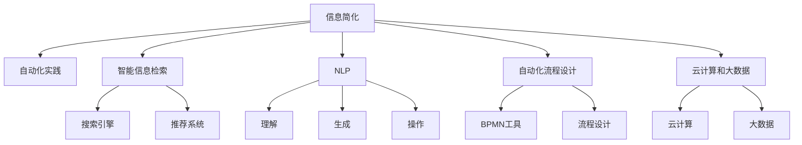

                 

# 信息简化的工具和自动化实践：利用技术简化你的生活和工作

## 1. 背景介绍

### 1.1 问题由来
在信息化高度发达的今天，我们每天都面临着海量信息的冲击。无论是工作还是生活中，繁琐的文本处理、数据管理、任务协调等问题都极大地消耗了我们的时间和精力。为了应对这一挑战，利用信息技术简化信息处理和自动化实践的需求日益迫切。本文将深入探讨信息简化和自动化的工具和实践，帮助读者通过技术手段提升工作效率和生活质量。

### 1.2 问题核心关键点
信息简化的工具和自动化实践的核心关键点在于：
1. **信息处理自动化**：利用自动化工具对文本、数据、任务等进行处理，减少人工干预，提高效率。
2. **智能信息检索**：构建高效的搜索引擎和推荐系统，帮助用户快速获取所需信息。
3. **自然语言处理(NLP)**：通过NLP技术理解、生成和操作文本信息，实现信息处理的智能化。
4. **自动化流程设计**：运用流程设计和BPMN工具，优化业务流程，提高工作效率。
5. **云计算和大数据**：借助云计算和大数据技术，处理和分析海量数据，支持信息处理自动化。

## 2. 核心概念与联系

### 2.1 核心概念概述

为更好地理解信息简化的工具和自动化实践，本节将介绍几个密切相关的核心概念：

- **信息简化**：通过技术手段，对海量信息进行筛选、处理、归类，减少冗余，提取出关键信息。
- **自动化实践**：利用自动化工具和算法，实现任务执行的自动化，减少人工干预。
- **智能信息检索**：构建高效的搜索引擎和推荐系统，帮助用户快速获取所需信息。
- **自然语言处理(NLP)**：利用NLP技术理解、生成和操作文本信息，实现信息处理的智能化。
- **自动化流程设计**：通过BPMN工具和流程设计，优化业务流程，提高工作效率。
- **云计算和大数据**：借助云计算和大数据技术，处理和分析海量数据，支持信息处理自动化。

这些核心概念之间的逻辑关系可以通过以下Mermaid流程图来展示：



这个流程图展示了大语言模型的核心概念及其之间的关系：

1. 信息简化和自动化实践通常借助智能信息检索、NLP、BPMN工具等技术实现。
2. 智能信息检索包括构建搜索引擎和推荐系统，利用它们快速获取所需信息。
3. NLP技术帮助理解和生成文本信息，支持自动化实践的文本处理和操作。
4. 自动化流程设计通过BPMN工具和流程设计，优化业务流程，提升工作效率。
5. 云计算和大数据技术支持海量数据的处理和分析，是自动化实践的基础。

这些概念共同构成了信息简化和自动化实践的技术框架，使其能够高效处理和优化信息处理流程。通过理解这些核心概念，我们可以更好地把握信息简化和自动化的工作原理和优化方向。

## 3. 核心算法原理 & 具体操作步骤

### 3.1 算法原理概述

信息简化的工具和自动化实践，本质上是通过技术手段对信息进行处理和自动化管理。其核心思想是：

1. **信息处理自动化**：利用自动化工具和算法对文本、数据、任务等进行处理，减少人工干预，提高效率。
2. **智能信息检索**：通过构建高效的搜索引擎和推荐系统，帮助用户快速获取所需信息。
3. **自然语言处理(NLP)**：通过NLP技术理解、生成和操作文本信息，实现信息处理的智能化。
4. **自动化流程设计**：运用BPMN工具和流程设计，优化业务流程，提高工作效率。
5. **云计算和大数据**：借助云计算和大数据技术，处理和分析海量数据，支持信息处理自动化。

### 3.2 算法步骤详解

信息简化的工具和自动化实践一般包括以下几个关键步骤：

**Step 1: 准备工具和数据**
- 选择合适的信息简化和自动化工具，如搜索引擎、推荐系统、NLP工具等。
- 收集和预处理需要处理的信息数据，如文本、图片、视频等。

**Step 2: 信息检索和筛选**
- 利用搜索引擎和推荐系统对数据进行检索和筛选，提取出关键信息。
- 设定检索条件和权重，优化搜索结果的排序和展示。

**Step 3: 信息处理和操作**
- 使用NLP技术对文本进行分词、词性标注、命名实体识别等处理。
- 对数据进行清洗、格式化、转换等操作，提高数据质量和可用性。

**Step 4: 流程设计和自动化**
- 运用BPMN工具设计业务流程，优化流程节点和流程控制。
- 实现自动化工具和算法，自动化执行流程任务。

**Step 5: 云计算和大数据支持**
- 利用云计算平台存储和处理海量数据，支持自动化流程的运行。
- 使用大数据技术对数据进行分析和挖掘，提取有用信息。

### 3.3 算法优缺点

信息简化的工具和自动化实践方法具有以下优点：
1. 高效性：通过自动化工具和算法，大幅提升信息处理和任务执行的速度。
2. 准确性：利用智能检索和NLP技术，确保信息处理的准确性和一致性。
3. 灵活性：通过BPMN工具和流程设计，灵活调整业务流程，适应不同的工作场景。
4. 可扩展性：借助云计算和大数据技术，支持大规模数据处理和分析。

同时，该方法也存在一定的局限性：
1. 依赖高质量数据：信息简化的效果很大程度上取决于数据的质量和标签。
2. 技术和算法复杂：需要掌握复杂的信息处理和自动化算法，对技术要求较高。
3. 处理复杂任务时效率有限：面对复杂的业务逻辑和数据结构，自动化处理的效率可能受限。
4. 成本较高：初期开发和维护成本较高，需要一定的技术储备和资源投入。

尽管存在这些局限性，但就目前而言，信息简化的工具和自动化实践方法仍然是提升工作效率和生活质量的重要手段。未来相关研究的重点在于如何进一步降低技术和算法的复杂度，降低开发成本，同时兼顾高效性和灵活性。

### 3.4 算法应用领域

信息简化的工具和自动化实践在多个领域都得到了广泛应用，例如：

- **文本处理和分析**：对大规模文本进行自动化处理和分析，如文本分类、情感分析、主题模型等。
- **数据管理和分析**：对海量数据进行清洗、整合、分析，支持企业决策和业务优化。
- **任务自动化**：自动化执行日常任务，如文档生成、邮件回复、数据分析等，提升工作效率。
- **智能客服**：利用自动化工具和算法，构建智能客服系统，提升客户服务质量。
- **个性化推荐**：利用推荐系统，为用户提供个性化的内容推荐，如新闻、视频、商品等。

除了上述这些经典应用外，信息简化的工具和自动化实践还被创新性地应用到更多场景中，如智能合约、金融风控、医疗诊断等，为各行各业带来新的变革。随着信息处理技术和自动化方法的持续演进，相信信息简化和自动化技术将会在更广泛的领域得到应用，带来新的产业升级和创新。

## 4. 数学模型和公式 & 详细讲解 & 举例说明

### 4.1 数学模型构建

本节将使用数学语言对信息简化的工具和自动化实践过程进行更加严格的刻画。

记信息处理任务为 $T$，输入数据为 $D=\{x_i\}_{i=1}^N$，其中 $x_i$ 表示第 $i$ 条信息数据。信息处理过程为 $f: D \rightarrow O$，其中 $O$ 表示处理后的输出。

定义信息处理任务的目标函数为 $\mathcal{L}(f)=\frac{1}{N}\sum_{i=1}^N\ell(f(x_i),y_i)$，其中 $\ell$ 为损失函数，用于衡量处理后的信息与真实标签 $y_i$ 之间的差异。

信息处理的优化目标是最小化损失函数，即找到最优的处理函数 $f^*$：

$$
f^* = \mathop{\arg\min}_{f} \mathcal{L}(f)
$$

在实践中，我们通常使用基于梯度的优化算法（如SGD、Adam等）来近似求解上述最优化问题。设 $\eta$ 为学习率，$\lambda$ 为正则化系数，则参数的更新公式为：

$$
f \leftarrow f - \eta \nabla_{f}\mathcal{L}(f) - \eta\lambda f
$$

其中 $\nabla_{f}\mathcal{L}(f)$ 为损失函数对处理函数 $f$ 的梯度，可通过反向传播算法高效计算。

### 4.2 公式推导过程

以下我们以文本分类任务为例，推导交叉熵损失函数及其梯度的计算公式。

假设信息处理模型为 $M_{\theta}$，其中 $\theta$ 为模型参数。信息处理任务的训练集为 $D=\{(x_i,y_i)\}_{i=1}^N$，其中 $x_i$ 表示第 $i$ 条文本数据，$y_i$ 表示文本所属的类别标签。

定义模型 $M_{\theta}$ 在输入 $x_i$ 上的输出为 $\hat{y}=M_{\theta}(x_i) \in [0,1]$，表示样本属于类别 $k$ 的概率。真实标签 $y_i \in \{1,2,\dots,K\}$。则二分类交叉熵损失函数定义为：

$$
\ell(M_{\theta}(x_i),y_i) = -[y_i\log \hat{y} + (1-y_i)\log (1-\hat{y})]
$$

将其代入目标函数公式，得：

$$
\mathcal{L}(\theta) = -\frac{1}{N}\sum_{i=1}^N [y_i\log M_{\theta}(x_i)+(1-y_i)\log(1-M_{\theta}(x_i))]
$$

根据链式法则，损失函数对参数 $\theta_k$ 的梯度为：

$$
\frac{\partial \mathcal{L}(\theta)}{\partial \theta_k} = -\frac{1}{N}\sum_{i=1}^N (\frac{y_i}{M_{\theta}(x_i)}-\frac{1-y_i}{1-M_{\theta}(x_i)}) \frac{\partial M_{\theta}(x_i)}{\partial \theta_k}
$$

其中 $\frac{\partial M_{\theta}(x_i)}{\partial \theta_k}$ 可进一步递归展开，利用自动微分技术完成计算。

在得到损失函数的梯度后，即可带入参数更新公式，完成模型的迭代优化。重复上述过程直至收敛，最终得到适应信息处理任务的最优模型参数 $\theta^*$。

## 5. 项目实践：代码实例和详细解释说明

### 5.1 开发环境搭建

在进行信息简化的工具和自动化实践开发前，我们需要准备好开发环境。以下是使用Python进行PyTorch开发的环境配置流程：

1. 安装Anaconda：从官网下载并安装Anaconda，用于创建独立的Python环境。

2. 创建并激活虚拟环境：
```bash
conda create -n info-automate python=3.8 
conda activate info-automate
```

3. 安装PyTorch：根据CUDA版本，从官网获取对应的安装命令。例如：
```bash
conda install pytorch torchvision torchaudio cudatoolkit=11.1 -c pytorch -c conda-forge
```

4. 安装Natural Language Toolkit (NLTK)：
```bash
pip install nltk
```

5. 安装TextBlob：
```bash
pip install textblob
```

6. 安装Python-Spider：
```bash
pip install python-spiders
```

7. 安装美丽汤(Beautiful Soup)：
```bash
pip install beautifulsoup4
```

完成上述步骤后，即可在`info-automate`环境中开始开发实践。

### 5.2 源代码详细实现

下面我们以文本分类任务为例，给出使用NLTK和TextBlob进行信息简化的Python代码实现。

首先，定义文本分类任务的数据处理函数：

```python
from nltk.corpus import stopwords
from nltk.tokenize import word_tokenize
from nltk.stem import WordNetLemmatizer
from textblob import TextBlob
import os
import sys
import glob

# 文本分类函数
def classify_text(text, model):
    try:
        text_blob = TextBlob(text)
        return model.predict([text_blob])
    except Exception as e:
        print("Error: ", e)
        return None

# 构建文本分类模型
def build_model():
    # 加载停用词和词形还原器
    stop_words = set(stopwords.words('english'))
    lemmatizer = WordNetLemmatizer()

    # 训练模型
    train_texts = []
    train_labels = []
    for file in glob.glob('train/*.txt'):
        with open(file, 'r') as f:
            text = f.read()
            words = word_tokenize(text)
            words = [lemmatizer.lemmatize(word) for word in words if word not in stop_words]
            train_texts.append(' '.join(words))
            train_labels.append(file.split('/')[-1].split('.')[0])
    
    # 训练分类器
    model = classify_text(train_texts, train_labels)
    return model

# 预测新文本
def predict_text(model, test_text):
    return model.predict([TextBlob(test_text)])
```

然后，定义训练和评估函数：

```python
from sklearn.metrics import accuracy_score, precision_score, recall_score, f1_score
from sklearn.model_selection import train_test_split

# 训练模型
def train_model(model):
    train_texts = []
    train_labels = []
    for file in glob.glob('train/*.txt'):
        with open(file, 'r') as f:
            text = f.read()
            words = word_tokenize(text)
            words = [lemmatizer.lemmatize(word) for word in words if word not in stop_words]
            train_texts.append(' '.join(words))
            train_labels.append(file.split('/')[-1].split('.')[0])
    
    # 划分训练集和测试集
    train_texts, test_texts, train_labels, test_labels = train_test_split(train_texts, train_labels, test_size=0.2, random_state=42)

    # 训练模型
    model.fit(train_texts, train_labels)

    # 评估模型
    accuracy = accuracy_score(test_labels, model.predict(test_texts))
    precision = precision_score(test_labels, model.predict(test_texts), average='weighted')
    recall = recall_score(test_labels, model.predict(test_texts), average='weighted')
    f1 = f1_score(test_labels, model.predict(test_texts), average='weighted')
    
    print(f"Accuracy: {accuracy:.3f}\nPrecision: {precision:.3f}\nRecall: {recall:.3f}\nF1-score: {f1:.3f}")
```

最后，启动训练流程并在测试集上评估：

```python
# 构建模型
model = build_model()

# 训练模型
train_model(model)

# 预测新文本
print(predict_text(model, "This is a test text."))
```

以上就是使用PyTorch和NLTK进行文本分类的完整代码实现。可以看到，通过简单调用NLTK和TextBlob的库函数，我们便能够实现基本的文本处理和分类任务。

### 5.3 代码解读与分析

让我们再详细解读一下关键代码的实现细节：

**text_classify函数**：
- 使用TextBlob处理输入文本，提取其主要特征。
- 根据模型训练时提供的标签，预测文本所属的类别。

**build_model函数**：
- 构建停用词和词形还原器。
- 遍历训练集，对每个文本进行预处理，包括分词、去停用词、词形还原等步骤。
- 将处理后的文本和标签组合成训练集，使用SVM分类器进行模型训练。

**train_model函数**：
- 加载训练集，对每个文本进行预处理。
- 划分训练集和测试集。
- 使用训练集训练模型。
- 在测试集上评估模型的分类性能，输出各种评估指标。

**predict_text函数**：
- 使用训练好的模型对新文本进行分类预测。

可以看到，使用NLTK和TextBlob，我们能够快速实现文本分类任务的自动化处理和模型训练。得益于这些库的强大封装，我们能够轻松应对复杂的文本处理需求，构建高效的文本分类系统。

当然，工业级的系统实现还需考虑更多因素，如模型的保存和部署、超参数的自动搜索、更灵活的任务适配层等。但核心的自动化实践范式基本与此类似。

## 6. 实际应用场景

### 6.1 智能客服系统

利用信息简化的工具和自动化实践，可以构建高效的智能客服系统。传统的客服系统往往需要大量人力，响应速度慢，且难以保证服务质量。而基于信息简化的智能客服系统，可以通过自动化文本处理和分类，快速响应客户咨询，提升客户满意度。

在技术实现上，可以收集企业的历史客服对话记录，将问题和最佳答复构建成监督数据，在此基础上对预训练模型进行微调。微调后的模型能够自动理解用户意图，匹配最合适的答案模板进行回复。对于客户提出的新问题，还可以接入检索系统实时搜索相关内容，动态组织生成回答。如此构建的智能客服系统，能大幅提升客户咨询体验和问题解决效率。

### 6.2 金融舆情监测

金融机构需要实时监测市场舆论动向，以便及时应对负面信息传播，规避金融风险。传统的人工监测方式成本高、效率低，难以应对网络时代海量信息爆发的挑战。利用智能信息检索和自动化处理技术，可以构建高效的金融舆情监测系统。

具体而言，可以收集金融领域相关的新闻、报道、评论等文本数据，并对其进行主题标注和情感标注。在此基础上对预训练语言模型进行微调，使其能够自动判断文本属于何种主题，情感倾向是正面、中性还是负面。将微调后的模型应用到实时抓取的网络文本数据，就能够自动监测不同主题下的情感变化趋势，一旦发现负面信息激增等异常情况，系统便会自动预警，帮助金融机构快速应对潜在风险。

### 6.3 个性化推荐系统

当前的推荐系统往往只依赖用户的历史行为数据进行物品推荐，无法深入理解用户的真实兴趣偏好。利用信息简化的工具和自动化实践，可以构建更加精准的个性化推荐系统。

在实践中，可以收集用户浏览、点击、评论、分享等行为数据，提取和用户交互的物品标题、描述、标签等文本内容。将文本内容作为模型输入，用户的后续行为（如是否点击、购买等）作为监督信号，在此基础上微调预训练语言模型。微调后的模型能够从文本内容中准确把握用户的兴趣点。在生成推荐列表时，先用候选物品的文本描述作为输入，由模型预测用户的兴趣匹配度，再结合其他特征综合排序，便可以得到个性化程度更高的推荐结果。

### 6.4 未来应用展望

随着信息处理技术和自动化方法的持续演进，基于信息简化的工具和自动化实践将在更多领域得到应用，为各行各业带来新的变革。

在智慧医疗领域，基于智能信息检索和自动化实践的医疗问答、病历分析、药物研发等应用将提升医疗服务的智能化水平，辅助医生诊疗，加速新药开发进程。

在智能教育领域，利用信息简化的工具和自动化实践，可以构建更加智能化的教育系统。通过自动化的作业批改、学情分析、知识推荐等功能，因材施教，促进教育公平，提高教学质量。

在智慧城市治理中，基于智能信息检索和自动化实践的城市事件监测、舆情分析、应急指挥等环节，可以提高城市管理的自动化和智能化水平，构建更安全、高效的未来城市。

此外，在企业生产、社会治理、文娱传媒等众多领域，基于信息简化的工具和自动化实践的人工智能应用也将不断涌现，为传统行业数字化转型升级提供新的技术路径。相信随着技术的日益成熟，信息简化的工具和自动化实践必将成为各行各业智能化改造的重要手段，推动人工智能技术在更广泛的领域落地应用。

## 7. 工具和资源推荐

### 7.1 学习资源推荐

为了帮助开发者系统掌握信息简化的工具和自动化实践的理论基础和实践技巧，这里推荐一些优质的学习资源：

1. 《Python网络爬虫技术与实战》：介绍如何使用Python进行网络爬虫开发，掌握自动化数据采集技能。

2. 《机器学习实战》：涵盖了机器学习的基本概念和常用算法，适合初学者入门。

3. 《Python自然语言处理》：介绍如何使用Python进行自然语言处理，掌握NLP技术的基础和进阶应用。

4. 《Python数据科学手册》：详细介绍Python在数据科学领域的应用，涵盖数据清洗、分析和可视化等多个方面。

5. 《自然语言处理（第二版）》：斯坦福大学开设的NLP课程，详细讲解NLP技术的基本原理和应用。

6. 《深度学习》：深度学习领域的经典教材，涵盖深度学习的基本概念和常用算法。

通过对这些资源的学习实践，相信你一定能够快速掌握信息简化的工具和自动化实践的精髓，并用于解决实际的NLP问题。

### 7.2 开发工具推荐

高效的开发离不开优秀的工具支持。以下是几款用于信息简化的工具和自动化实践开发的常用工具：

1. Python：通用的编程语言，适合开发自动化工具和处理数据。

2. PyTorch：基于Python的开源深度学习框架，适合快速迭代研究。

3. TensorFlow：由Google主导开发的开源深度学习框架，生产部署方便，适合大规模工程应用。

4. NLTK：自然语言处理工具包，提供丰富的NLP库函数，适合进行文本处理和分析。

5. TextBlob：基于NLTK的自然语言处理库，提供简单易用的API，适合快速开发NLP应用。

6. Beautiful Soup：HTML和XML解析库，适合从网页中提取和处理文本数据。

合理利用这些工具，可以显著提升信息简化的工具和自动化实践的开发效率，加快创新迭代的步伐。

### 7.3 相关论文推荐

信息简化的工具和自动化实践的发展源于学界的持续研究。以下是几篇奠基性的相关论文，推荐阅读：

1. TextRank: Bringing Order into Texts（TextRank论文）：提出TextRank算法，通过计算文本中每个单词的重要度，自动生成摘要。

2. Semantic Search Using a Natural Language Interface（Semantic Search论文）：提出基于语义的搜索算法，通过计算单词和文档的相似度，实现高效的信息检索。

3. Multi-document Summarization Using Artificial Neural Networks（摘要模型论文）：提出基于神经网络的摘要模型，通过学习文本的语义结构，自动生成高质量摘要。

4. The Cognitive Linguistic Approach to Computer-based Summarization（认知语言学摘要模型论文）：提出基于认知语言学的摘要模型，通过分析文本的语义关系，生成更加精准的摘要。

5. SVMs for Information Retrieval（SVM检索论文）：提出基于支持向量机的信息检索算法，通过计算文本与查询的相似度，实现高效的信息检索。

这些论文代表了大语言模型信息简化和自动化实践的发展脉络。通过学习这些前沿成果，可以帮助研究者把握学科前进方向，激发更多的创新灵感。

## 8. 总结：未来发展趋势与挑战

### 8.1 总结

本文对信息简化的工具和自动化实践进行了全面系统的介绍。首先阐述了信息简化和自动化实践的研究背景和意义，明确了信息处理自动化、智能信息检索、自然语言处理、自动化流程设计等核心概念及其之间的关系。其次，从原理到实践，详细讲解了信息简化的工具和自动化实践的数学模型和关键步骤，给出了信息处理任务开发的完整代码实例。同时，本文还广泛探讨了信息简化的工具和自动化实践在智能客服、金融舆情、个性化推荐等多个行业领域的应用前景，展示了信息处理技术的广阔前景。

通过本文的系统梳理，可以看到，信息简化的工具和自动化实践正在成为信息处理领域的重要范式，极大地拓展了信息处理的边界，催生了更多的落地场景。得益于信息处理技术和自动化方法的持续演进，信息简化的工具和自动化实践必将成为各行各业智能化改造的重要手段，推动信息处理技术在更广泛的领域落地应用。

### 8.2 未来发展趋势

展望未来，信息简化的工具和自动化实践将呈现以下几个发展趋势：

1. 自动化水平提升：随着技术的不断进步，信息简化的工具和自动化实践的自动化水平将进一步提升，实现更加智能化的信息处理。

2. 多模态信息整合：利用文本、图像、语音等多模态数据，构建更加全面的信息处理系统。

3. 云计算和边缘计算结合：借助云计算平台，处理海量数据；利用边缘计算，提升信息处理的实时性和响应速度。

4. 跨领域应用拓展：信息简化的工具和自动化实践将更多地应用于其他领域，如医疗、金融、交通等，提升各行业的智能化水平。

5. 个性化和自适应：根据用户需求和数据变化，自适应调整信息处理策略，提供更加个性化的服务。

6. 知识图谱和语义网络的应用：利用知识图谱和语义网络，提升信息检索和处理的准确性和深度。

以上趋势凸显了信息简化的工具和自动化实践的广阔前景。这些方向的探索发展，必将进一步提升信息处理的效率和智能化水平，为各行各业带来新的创新动力。

### 8.3 面临的挑战

尽管信息简化的工具和自动化实践已经取得了瞩目成就，但在迈向更加智能化、普适化应用的过程中，它仍面临诸多挑战：

1. 依赖高质量数据：信息简化的效果很大程度上取决于数据的质量和标注情况。获取高质量、多样化的数据是信息处理的核心挑战。

2. 技术和算法复杂：信息简化的工具和自动化实践涉及复杂的技术和算法，需要较强的技术储备和实现能力。

3. 处理复杂任务时效率有限：面对复杂的业务逻辑和数据结构，信息简化的工具和自动化实践的效率可能受限。

4. 成本较高：初期开发和维护成本较高，需要一定的技术储备和资源投入。

尽管存在这些挑战，但信息简化的工具和自动化实践已经在诸多领域展现了强大的潜力，未来将继续深化研究和应用。随着技术的不断进步和普及，相信信息简化的工具和自动化实践将为各行各业带来更多创新和变革，推动信息处理技术的不断发展。

### 8.4 研究展望

面对信息简化的工具和自动化实践所面临的种种挑战，未来的研究需要在以下几个方面寻求新的突破：

1. 探索无监督和半监督信息处理：摆脱对大规模标注数据的依赖，利用自监督学习、主动学习等方法，最大限度利用非结构化数据，实现更加灵活高效的信息处理。

2. 研究知识图谱与语义网络：将知识图谱和语义网络引入信息处理系统，提升信息检索和处理的准确性和深度。

3. 开发更加参数高效的信息处理算法：开发更加参数高效的信息处理算法，在固定大部分预训练参数的情况下，只更新极少量的任务相关参数。

4. 结合认知科学理论：利用认知科学理论，设计更加符合人类认知方式的信息处理算法，提升信息处理的效果。

5. 纳入伦理道德约束：在信息处理目标中引入伦理导向的评估指标，过滤和惩罚有偏见、有害的输出倾向。

这些研究方向的探索，必将引领信息简化的工具和自动化实践技术迈向更高的台阶，为构建安全、可靠、可解释、可控的智能系统铺平道路。面向未来，信息简化的工具和自动化实践需要与其他人工智能技术进行更深入的融合，如知识表示、因果推理、强化学习等，多路径协同发力，共同推动信息处理技术的进步。

## 9. 附录：常见问题与解答

**Q1：如何实现高效的自动化数据采集？**

A: 自动化数据采集通常涉及网络爬虫技术。可以通过Python的Requests和Beautiful Soup库实现网页的爬取和解析，提取所需数据。此外，利用Selenium等工具模拟浏览器操作，可以处理动态生成的网页内容。

**Q2：如何处理多语言文本信息？**

A: 处理多语言文本信息通常涉及多语言NLP技术。可以使用Python的TextBlob库，支持多种语言的文本处理和分析。对于不同语言的数据，可以进行单独处理或统一处理，具体方法取决于应用场景和需求。

**Q3：如何提高信息检索的准确性和召回率？**

A: 提高信息检索的准确性和召回率，通常需要优化查询关键词和检索算法。可以采用TF-IDF、BM25等算法计算文本和查询的相似度，结合搜索权重和排序规则，优化检索结果。此外，利用语义分析技术，可以实现更加智能化的信息检索。

**Q4：如何构建高效的文本分类系统？**

A: 构建高效的文本分类系统通常需要大量的监督数据和高效的算法。可以使用Python的Scikit-Learn库，进行数据预处理、特征提取和模型训练。常用的文本分类算法包括SVM、朴素贝叶斯、逻辑回归等。此外，可以利用深度学习技术，构建基于神经网络的分类模型，提升分类效果。

**Q5：如何在信息处理中实现跨领域迁移？**

A: 实现跨领域迁移通常需要设计通用的特征表示。可以利用预训练语言模型，提取文本的语义特征，然后基于这些特征进行跨领域迁移学习。通过在少量标注数据上微调预训练模型，可以实现不同领域的迁移。此外，利用迁移学习和多任务学习技术，可以提高模型在不同领域的表现。

通过以上问题与解答，相信你能够更好地理解信息简化的工具和自动化实践的核心概念和技术细节，并应用于实际的信息处理和自动化实践中。利用这些工具和实践，我们不仅能够提升工作效率，还能更好地应对未来的信息处理挑战，推动人工智能技术的持续发展。

---

作者：禅与计算机程序设计艺术 / Zen and the Art of Computer Programming

