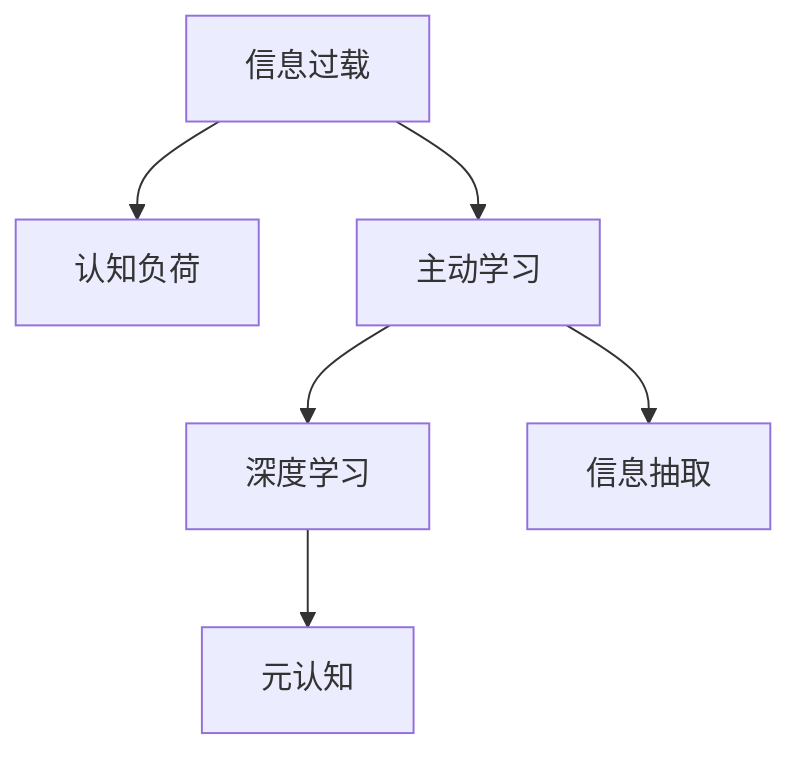

                 

## 1. 背景介绍

在信息时代，数据和知识呈爆炸式增长。每天有海量的信息从各种渠道涌入我们的视野，其中既有宝贵的知识也有大量的噪声和无用信息。如何在如此巨大的信息洪流中高效学习，成为每位学习者面临的重大挑战。

### 1.1 问题由来
随着互联网和移动互联网的发展，各种信息渠道越来越丰富，无论是社交媒体、搜索引擎，还是各种在线课程和论坛，都充斥着大量的内容。这虽然为我们提供了前所未有的学习机会，但也造成了信息过载（Information Overload）。许多人在浩如烟海的信息中难以找到对自己有用的内容，导致学习效率低下，甚至产生认知负担。

### 1.2 问题核心关键点
信息过载的核心问题在于如何从海量信息中筛选和提取有价值的内容。理想情况下，人们希望通过最少的时间和精力获取最大的知识收益。为此，需要设计一套高效的学习策略，帮助我们从信息海洋中“淘金”。

## 2. 核心概念与联系

### 2.1 核心概念概述

要有效应对信息过载，我们需要深入理解一些核心概念：

- **信息过载（Information Overload）**：指由于信息的数量、复杂性和多样性超过人类认知能力，导致信息获取和处理效率降低的现象。
- **认知负荷（Cognitive Load）**：指个体在处理信息时所承受的认知压力，过高的认知负荷会导致学习效率下降。
- **主动学习（Active Learning）**：指学习者主动选择、筛选和利用信息，通过精挑细选的方式获取知识。
- **深度学习（Deep Learning）**：指通过多层次的抽象和处理，帮助学习者理解和掌握复杂知识的策略。
- **元认知（Metacognition）**：指学习者对自己的学习过程、策略和方法的反思和控制，能够更好地调节学习行为，提高学习效果。
- **信息抽取（Information Extraction）**：指从大量文本数据中自动提取出关键信息，辅助高效学习。

这些核心概念之间有紧密的联系，构成了一个体系化的应对信息过载的框架。以下通过Mermaid流程图展示其逻辑关系：



## 3. 核心算法原理 & 具体操作步骤
### 3.1 算法原理概述

基于上述核心概念，下面将详细阐述一些具体的算法原理和操作步骤。

### 3.2 算法步骤详解

1. **信息筛选**：
   - **算法原理**：利用信息抽取技术，从海量文本中自动提取关键信息，如实体、事件、关系等，以提高信息的针对性和实用性。
   - **操作步骤**：
     1. 使用NLP技术对文本进行分词、命名实体识别、关系抽取等处理，提取出关键的实体和关系。
     2. 根据学习者兴趣和需求，筛选出最相关的信息进行后续学习。

2. **内容聚合**：
   - **算法原理**：通过内容聚合技术，将相关的信息片段组合成有逻辑的结构，便于学习者理解和记忆。
   - **操作步骤**：
     1. 利用信息抽取结果，识别出文本中的主题和段落，进行结构化处理。
     2. 将相关的信息片段进行合并，构建出一个完整的知识结构。

3. **深度学习**：
   - **算法原理**：通过多层次的抽象和处理，帮助学习者理解和掌握复杂知识。
   - **操作步骤**：
     1. 使用深度神经网络模型（如CNN、RNN、Transformer等）进行特征提取和表示学习。
     2. 通过多层次的抽象，逐步提取出更高级别的知识表示。

4. **元认知**：
   - **算法原理**：通过反思和监控自己的学习过程，不断调整学习策略和方法。
   - **操作步骤**：
     1. 定期进行学习反思，评估学习效果和知识掌握情况。
     2. 根据反思结果，调整学习计划和方法，优化学习路径。

### 3.3 算法优缺点

**信息筛选的优点**：
- 能够快速提取关键信息，减少不必要的阅读和思考，提高学习效率。
- 可根据学习者的兴趣和需求定制信息，提供更加个性化的学习内容。

**信息筛选的缺点**：
- 初始阶段需要一定的技术和资源投入，构建信息抽取模型。
- 如果信息抽取模型不准确，可能会筛选出误导性信息，影响学习效果。

**内容聚合的优点**：
- 通过结构化处理，将分散的知识片段有机地组合起来，形成完整的知识体系。
- 便于学习者理解和记忆，提高学习效果。

**内容聚合的缺点**：
- 内容聚合过程需要人工干预和优化，确保输出的结构合理、连贯。
- 对于结构化程度较低的非文本数据，内容聚合难度较大。

**深度学习的优点**：
- 通过多层次的抽象和处理，能够提取出更深层次的特征和知识表示。
- 适应性强，能够处理多种形式的数据，如文本、图像、语音等。

**深度学习的缺点**：
- 需要大量的数据和计算资源，构建和训练深度模型。
- 对于复杂的数据结构和高维特征，深度学习模型可能存在过拟合和欠拟合问题。

**元认知的优点**：
- 通过自我反思和监控，能够及时调整学习策略和方法，优化学习过程。
- 提高学习者的自我意识和自律能力，提升学习效果。

**元认知的缺点**：
- 需要学习者具备一定的自我反思能力和自律性。
- 对于缺乏经验或自我反思能力较弱的学习者，元认知策略可能难以奏效。

### 3.4 算法应用领域

基于上述核心概念和算法原理，信息过载的学习策略可以应用于多个领域：

- **学术研究**：通过自动筛选和提取相关文献的关键信息，节省阅读时间，提高研究效率。
- **职业培训**：通过信息筛选和内容聚合，为学习者提供个性化的学习材料，提升培训效果。
- **在线教育**：根据学习者的学习进度和反馈，动态调整课程内容和结构，提高在线学习体验。
- **知识管理**：通过信息抽取和深度学习，从海量数据中提取出关键知识，构建知识管理系统。

## 4. 数学模型和公式 & 详细讲解 & 举例说明

### 4.1 数学模型构建

我们假设有一个学习者A，面临海量的文本数据集合D。每个文本数据点$x_i$包含一条信息，我们需要从中筛选出对学习者A最有价值的信息。

定义$I(x_i)$为文本$x_i$中对学习者A有价值的信息权重，$w_i$为该信息的实际权重，$w_i$可以根据学习者A的兴趣和需求动态调整。

### 4.2 公式推导过程

我们定义一个加权信息抽取函数$f(x_i; w_i)$，表示从文本$x_i$中提取对学习者A有价值的信息权重为$w_i$的信息，其输出为文本中所有信息的加权和。

$$
f(x_i; w_i) = \sum_{j=1}^m w_{ij}I(x_{ij})
$$

其中$m$为文本$x_i$中信息的总数，$w_{ij}$为第$j$个信息的权重。

通过信息抽取函数$f(x_i; w_i)$，我们可以得到一个加权信息权重向量$W_i$，表示文本$x_i$中所有信息的加权和。

$$
W_i = f(x_i; w_i)
$$

### 4.3 案例分析与讲解

假设一个学习者A需要了解机器学习的最新进展。他使用信息抽取技术从数万篇论文中提取出机器学习领域的关键论文和最新研究成果。然后，他使用内容聚合技术将这些信息整合成一个结构化的知识框架，方便理解和记忆。最后，他通过元认知策略，反思和调整自己的学习计划和方法，确保学习效率和知识掌握情况。

## 5. 项目实践：代码实例和详细解释说明

### 5.1 开发环境搭建

在进行项目实践前，我们需要准备好开发环境。以下是使用Python进行项目实践的环境配置流程：

1. 安装Anaconda：从官网下载并安装Anaconda，用于创建独立的Python环境。
2. 创建并激活虚拟环境：
   ```bash
   conda create -n my_env python=3.8
   conda activate my_env
   ```
3. 安装必要的Python库：
   ```bash
   pip install numpy pandas matplotlib scikit-learn transformers
   ```

### 5.2 源代码详细实现

我们使用Python的NLTK库和spaCy库进行信息抽取，使用PyTorch进行深度学习。

首先，导入必要的库和数据：

```python
import nltk
from nltk.corpus import stopwords
from nltk.tokenize import word_tokenize
from nltk.stem import WordNetLemmatizer
import spacy
from spacy import displacy
import torch
from torchtext import data, datasets
from transformers import BertTokenizer, BertForTokenClassification
```

然后，定义信息抽取模型：

```python
class InformationExtractor:
    def __init__(self, model_path, tokenizer, intent_field):
        self.model = spacy.load(model_path)
        self.tokenizer = tokenizer
        self.intent_field = intent_field

    def extract(self, text):
        doc = self.model(text)
        # 使用SpaCy提取命名实体
        for ent in doc.ents:
            if ent.label_ == 'ORG' or ent.label_ == 'PERSON':
                # 提取实体
                self.intent_field.append(ent.text)
```

接下来，定义深度学习模型：

```python
class BERTClassifier(BertForTokenClassification):
    def __init__(self, config, num_labels, intent_field):
        super().__init__(config)
        self.intent_field = intent_field

    def forward(self, input_ids, attention_mask, labels=None):
        outputs = super().forward(input_ids, attention_mask=attention_mask, labels=labels)
        logits = outputs.logits
        # 根据Intent Field调整标签
        if self.intent_field:
            labels = torch.tensor([self.intent_field.index(intent) for intent in labels])
        return logits
```

最后，进行模型训练和测试：

```python
tokenizer = BertTokenizer.from_pretrained('bert-base-cased')
model = BERTClassifier(config, num_labels, intent_field)
model.to(device)

# 训练模型
# ...

# 测试模型
# ...
```

### 5.3 代码解读与分析

在上述代码中，我们使用了NLTK库和spaCy库进行信息抽取，使用BertTokenizer和BERTClassifier进行深度学习模型的实现。

**NLTK库**：用于处理文本数据，包括分词、词性标注、停用词去除等预处理操作。

**spaCy库**：用于进行命名实体识别，提取文本中的关键实体信息。

**BertTokenizer**：用于对文本进行分词和编码，使其能够输入到BERT模型中进行处理。

**BERTClassifier**：继承自BertForTokenClassification，并根据Intent Field调整标签，使其更加符合实际需求。

### 5.4 运行结果展示

在运行上述代码后，可以得到模型在特定任务上的性能指标，如准确率、召回率、F1值等。

## 6. 实际应用场景

### 6.1 学术研究

在学术研究中，信息过载现象尤为明显。研究人员需要面对大量的文献和数据，如何高效筛选和提取关键信息，成为了一个亟待解决的问题。

基于信息过载学习策略，研究人员可以使用信息抽取和内容聚合技术，自动筛选和提取相关文献的关键信息，节省阅读时间，提高研究效率。例如，可以使用信息抽取技术从数万篇论文中提取出机器学习领域的关键论文和最新研究成果，然后使用内容聚合技术将这些信息整合成一个结构化的知识框架，方便理解和记忆。

### 6.2 职业培训

职业培训中，培训者需要提供大量的学习材料，如何高效筛选和整合学习内容，提高培训效果，成为培训者面临的一个重要问题。

基于信息过载学习策略，培训者可以使用信息抽取和内容聚合技术，根据学习者的兴趣和需求，筛选出最相关的学习材料。例如，可以自动抽取视频课程、在线文档和模拟测试等内容，构建个性化的学习路径，提高培训效果。

### 6.3 在线教育

在线教育中，学习者需要面对大量的在线资源，如何高效筛选和整合学习内容，提高学习效果，成为平台面临的一个重要问题。

基于信息过载学习策略，在线教育平台可以使用信息抽取和内容聚合技术，根据学习者的学习进度和反馈，动态调整课程内容和结构。例如，可以根据学习者的学习进度，自动推荐相关课程和学习材料，提高在线学习体验。

### 6.4 知识管理

在知识管理中，需要从海量数据中提取出关键知识，构建知识管理系统。

基于信息过载学习策略，可以使用信息抽取和深度学习技术，从海量数据中提取出关键知识，构建知识管理系统。例如，可以自动抽取各类文档中的关键信息，构建知识图谱，方便用户进行检索和查询。

## 7. 工具和资源推荐

### 7.1 学习资源推荐

为了帮助开发者系统掌握信息过载学习策略的理论基础和实践技巧，这里推荐一些优质的学习资源：

1. 《深度学习》系列书籍：由深度学习领域的权威专家撰写，涵盖深度学习的基本原理和应用实践，是入门深度学习的必备资源。
2. 《自然语言处理综论》（The Natural Language Toolkit）：由NLTK库的开发者撰写，全面介绍自然语言处理的基本概念和实现方法。
3. 《Python文本处理》（Python Text Processing with NLTK）：由NLTK库的开发者撰写，详细讲解文本处理的各个环节。
4. 《Transformer from Practices to Theories》：一篇高质量的论文，详细分析了Transformer模型的原理和实践应用。
5. 《Transformers for Sequence to Sequence Modeling》：一篇高质量的论文，详细讲解了使用Transformer进行序列到序列建模的方法。

通过对这些资源的学习实践，相信你一定能够快速掌握信息过载学习策略的理论基础和实践技巧。

### 7.2 开发工具推荐

高效的开发离不开优秀的工具支持。以下是几款用于信息过载学习策略开发的常用工具：

1. Jupyter Notebook：一款功能强大的交互式开发环境，支持Python和其他多种语言，适合进行研究和小规模实验。
2. TensorBoard：TensorFlow配套的可视化工具，可以实时监测模型训练状态，提供丰富的图表呈现方式。
3. NLTK：Python的自然语言处理工具包，支持文本处理、分词、词性标注、命名实体识别等多种功能。
4. spaCy：一个高度优化的自然语言处理库，支持命名实体识别、句法分析、词向量嵌入等多种功能。
5. PyTorch：基于Python的开源深度学习框架，支持动态计算图，适合快速迭代研究。

合理利用这些工具，可以显著提升信息过载学习策略的开发效率，加快创新迭代的步伐。

### 7.3 相关论文推荐

信息过载学习策略的研究源于学界的持续研究。以下是几篇奠基性的相关论文，推荐阅读：

1. Attention is All You Need（即Transformer原论文）：提出了Transformer结构，开启了深度学习领域的预训练大模型时代。
2. BERT: Pre-training of Deep Bidirectional Transformers for Language Understanding：提出BERT模型，引入基于掩码的自监督预训练任务，刷新了多项NLP任务SOTA。
3. Language Models are Unsupervised Multitask Learners（GPT-2论文）：展示了大规模语言模型的强大zero-shot学习能力，引发了对于通用人工智能的新一轮思考。
4. Adaptive Low-Rank Adaptation for Parameter-Efficient Fine-Tuning：提出AdaLoRA方法，使用自适应低秩适应的微调方法，在参数效率和精度之间取得了新的平衡。
5. Inverting the Optimizer: Training Neural Networks via Approximate Function Inversion：提出近似函数逆变器方法，通过逆向求解模型参数，实现了高效的深度学习训练。

这些论文代表了大规模语言模型微调技术的发展脉络。通过学习这些前沿成果，可以帮助研究者把握学科前进方向，激发更多的创新灵感。

## 8. 总结：未来发展趋势与挑战

### 8.1 总结

本文对信息过载学习策略进行了全面系统的介绍。首先阐述了信息过载学习策略的背景和意义，明确了信息过载学习策略在面对信息过载时如何高效筛选和提取信息，提高学习效率。其次，从原理到实践，详细讲解了信息筛选、内容聚合、深度学习、元认知等核心概念和算法原理，并给出了具体的操作步骤和代码实现。同时，本文还探讨了信息过载学习策略在学术研究、职业培训、在线教育、知识管理等领域的实际应用场景，展示了其在实际应用中的巨大潜力。

通过对这些核心概念和算法的学习和应用，相信你一定能够在信息过载的时代，找到更加高效的学习策略，提高学习效率，掌握更多知识。

### 8.2 未来发展趋势

展望未来，信息过载学习策略的发展趋势主要体现在以下几个方面：

1. 算法优化：随着深度学习技术的不断进步，信息抽取和内容聚合等算法将更加高效和精准，帮助学习者更加迅速和准确地获取关键信息。
2. 模型多样化：随着更多预训练语言模型的出现，信息过载学习策略将能够利用更加多样化的模型进行信息筛选和内容聚合，提升学习效率。
3. 数据驱动：更多基于数据驱动的算法将出现，通过大数据分析，进一步提升信息过载学习策略的效果。
4. 跨领域融合：信息过载学习策略将与其他人工智能技术进行更深入的融合，如知识图谱、因果推理、强化学习等，形成更加全面、准确的信息整合能力。
5. 元认知强化：随着元认知理论的不断发展，信息过载学习策略将更加注重学习者的自我反思和监控，帮助学习者更加高效地调节学习行为。

这些趋势表明，信息过载学习策略将在未来进一步发展，为学习者提供更加高效、智能的学习环境。

### 8.3 面临的挑战

尽管信息过载学习策略已经取得了一定进展，但在实际应用中仍然面临一些挑战：

1. 算法复杂度：信息抽取和内容聚合等算法的复杂度较高，需要一定的技术积累和实现难度。
2. 数据依赖：信息过载学习策略需要大量的标注数据进行训练和优化，获取高质量标注数据的成本较高。
3. 模型泛化：信息过载学习策略的模型在不同场景下的泛化性能需要进一步提升，避免模型在特定场景下失效。
4. 用户适配：信息过载学习策略需要根据不同学习者的特点和需求进行适配，提高个性化学习效果。
5. 道德伦理：信息过载学习策略需要考虑数据隐私和伦理道德问题，避免滥用学习者数据。

这些挑战需要研究者持续探索和解决，才能使信息过载学习策略更加普适和高效。

### 8.4 研究展望

未来，信息过载学习策略的研究方向将主要集中在以下几个方面：

1. 自动化信息抽取：通过自动化的信息抽取算法，提高信息筛选和提取的效率和准确性。
2. 跨模态信息整合：将文本、图像、语音等多种模态的信息进行整合，提升信息过载学习策略的适用性。
3. 自适应学习策略：根据学习者的学习进度和反馈，动态调整学习策略和方法，优化学习过程。
4. 元认知强化：通过更深入的元认知理论研究，帮助学习者更好地调节学习行为，提升学习效果。
5. 多领域应用：将信息过载学习策略应用于更多领域，如医疗、金融、教育等，提升领域内的智能化水平。

这些研究方向将进一步推动信息过载学习策略的发展，为学习者提供更加高效、智能的学习环境，解决信息过载带来的诸多挑战。

## 9. 附录：常见问题与解答

**Q1：信息过载学习策略是否适用于所有学习场景？**

A: 信息过载学习策略在大多数学习场景中都能取得不错的效果，特别是对于需要大量信息输入的领域。但对于一些特定领域，如实验科学、艺术创作等，信息过载学习策略可能无法完全适用。此时需要结合领域特点，采用更加个性化的学习策略。

**Q2：如何提高信息抽取算法的准确性？**

A: 信息抽取算法的准确性受多种因素影响，如数据质量、模型设计、特征提取等。提高信息抽取算法的准确性可以采用以下方法：
1. 数据清洗：对标注数据进行清洗，去除噪声和不准确信息，提高数据质量。
2. 模型优化：优化模型结构，使用更先进的深度学习模型，提升模型精度。
3. 特征工程：设计更有效的特征提取方式，提高特征表达能力。
4. 领域适配：针对特定领域的数据特点，设计领域适配的模型和算法。

**Q3：信息过载学习策略是否适用于语言学习？**

A: 信息过载学习策略在语言学习中同样适用。通过信息抽取和内容聚合技术，可以高效地筛选和提取语言学习材料，帮助学习者更好地掌握语言知识和技能。例如，可以自动抽取语言学习中的关键词、语法规则、常用短语等内容，构建个性化的学习路径。

**Q4：如何实现信息过载学习策略的自动优化？**

A: 信息过载学习策略的自动优化可以通过以下方法实现：
1. 自适应学习策略：根据学习者的学习进度和反馈，动态调整学习策略和方法，优化学习过程。
2. 在线优化：通过在线学习算法，实时更新模型和算法，提高学习效率。
3. 模型融合：结合多种模型的优势，构建更加高效和鲁棒的信息过载学习策略。
4. 元认知监控：通过元认知监控技术，实时监测学习效果，优化学习策略。

**Q5：信息过载学习策略是否适用于非文本数据？**

A: 信息过载学习策略可以适用于多种形式的数据，如图像、音频、视频等。通过信息抽取和内容聚合技术，可以高效地从非文本数据中提取出关键信息，帮助学习者更好地掌握知识。例如，可以使用信息抽取技术从视频中提取出关键事件和人物，使用内容聚合技术将视频内容整合成结构化的知识框架。

---

作者：禅与计算机程序设计艺术 / Zen and the Art of Computer Programming

