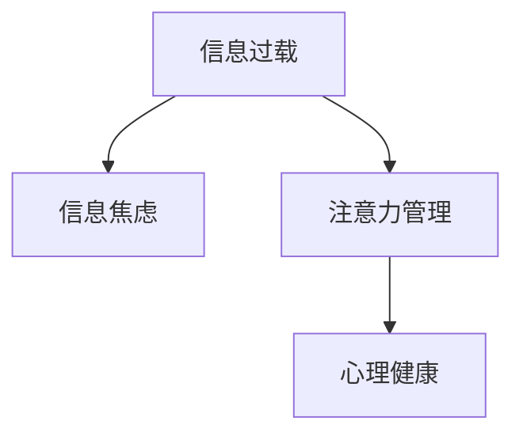

                 

# 信息过载与信息焦虑：如何管理信息摄入以改善心理健康

在数字化时代，信息无处不在。每天我们被各式各样的新闻、社交媒体、电子邮件等所包围，以至于很难从中抽身。随着这种“信息过载”现象的加剧，越来越多的人开始感受到信息焦虑，即在信息海洋中感到无所适从、精神紧张。本文将探讨信息过载与信息焦虑的成因，并提供一些科学的方法来管理信息摄入，从而改善心理健康。

## 1. 背景介绍

### 1.1 问题由来

互联网的普及使得信息流通更加便捷，但也带来了信息过载的困扰。据统计，每天全球产生的在线信息量已经超过了5.1亿字节，这些信息的收集、筛选和处理给人们带来了巨大的压力。信息过载不仅仅是数据量的堆砌，更是一种心理压力的体现，常常表现为认知负担过重、注意力分散、焦虑和抑郁等。

### 1.2 问题核心关键点

信息过载与信息焦虑的根本在于人类大脑对信息的处理能力和心理应对机制的局限性。现代信息社会高速运转，人们需要在短时间内处理大量信息，而大脑处理信息的能力有限，无法有效过滤和管理信息，进而导致心理压力的积累。

## 2. 核心概念与联系

### 2.1 核心概念概述

为了更好地理解信息过载与信息焦虑，我们首先需要定义几个关键概念：

- **信息过载**：指在一个时间单位内接收到的信息量超出个体或组织处理能力的现象。
- **信息焦虑**：指由于信息过载引起的心理压力和情绪困扰，表现为焦虑、烦躁、注意力不集中等。
- **注意力管理**：通过策略和技术，优化信息处理，减少对注意力的消耗，从而提高信息处理的效率和效果。
- **心理健康**：指个体在心理方面的良好状态，包括情感健康、认知健康和行为健康等。

这些概念之间的逻辑关系可以通过以下Mermaid流程图来展示：



这个流程图展示了信息过载如何通过注意力管理来改善心理健康。注意力管理是连接信息过载与心理健康的重要桥梁，通过有效的注意力管理，可以有效缓解信息焦虑，提升心理健康水平。

## 3. 核心算法原理 & 具体操作步骤

### 3.1 算法原理概述

信息过载与信息焦虑的管理，本质上是一个多学科交叉的问题，涉及心理学、认知科学、计算机科学等多个领域。其核心算法原理可以归结为以下几点：

1. **认知行为干预**：通过认知行为疗法等心理干预技术，帮助个体改变对信息的认知和态度，从而减轻信息焦虑。
2. **注意力调节**：通过注意力训练和技巧，优化个体对信息的处理方式，提高信息筛选和处理的效率。
3. **技术工具辅助**：利用智能推荐系统、信息过滤工具等技术手段，自动管理信息，减轻信息处理负担。

### 3.2 算法步骤详解

信息过载与信息焦虑的管理可以分为以下几个关键步骤：

**Step 1: 信息摄入评估**

首先，评估个人或组织当前的信息摄入状况。使用问卷调查、行为跟踪等方法，了解信息摄入的频率、来源、种类等信息。例如，可以记录每天浏览社交媒体的时间、阅读新闻的次数等。

**Step 2: 设定信息摄入目标**

基于评估结果，设定合理的信息摄入目标。例如，每天浏览社交媒体的时间不超过30分钟，阅读新闻不超过3篇等。目标应当具体、可操作，以便后续跟踪和调整。

**Step 3: 信息筛选与过滤**

利用技术工具，如智能推荐算法、信息过滤技术等，对信息进行筛选和过滤。这些工具可以根据用户的历史行为和偏好，推荐相关内容，同时过滤掉无用的信息，减少信息过载。

**Step 4: 注意力训练与调节**

通过注意力训练和调节技术，提高个体处理信息的能力。例如，使用冥想、深呼吸等技巧，帮助个体在面对信息过载时保持冷静，集中注意力处理重要信息。

**Step 5: 定期反馈与调整**

定期评估信息摄入目标的实现情况，根据反馈结果进行必要的调整。例如，如果发现信息摄入过多，可以增加目标的限制；如果发现信息过少，可以调整目标的设定。

### 3.3 算法优缺点

信息过载与信息焦虑的管理方法有以下优点：

1. **效果显著**：通过技术手段和心理干预，可以有效减轻信息焦虑，提升注意力管理能力。
2. **适用广泛**：这些方法适用于不同背景和年龄段的人群，具有普适性。
3. **成本低廉**：技术工具的使用和心理干预的实施相对低成本，易于推广。

同时，该方法也存在一些局限性：

1. **个体差异**：不同个体的信息处理能力和心理素质不同，方法的有效性可能存在差异。
2. **技术依赖**：过度依赖技术工具可能削弱个体的自主信息管理能力。
3. **长期效果**：短期内的干预效果可能较为显著，但长期维持效果需要持续的努力和调整。

### 3.4 算法应用领域

信息过载与信息焦虑的管理方法，已经在多个领域得到了应用，例如：

- **企业员工**：通过设置合理的信息摄入目标，配合信息过滤工具，减轻员工的信息负担，提高工作效率。
- **学生**：通过时间管理工具和注意力训练技术，帮助学生有效处理信息，提升学习效果。
- **媒体行业**：通过智能推荐算法，优化信息分发策略，减少用户的信息过载。

## 4. 数学模型和公式 & 详细讲解

### 4.1 数学模型构建

我们假设个体每天的信息摄入量为 $I$，焦虑水平为 $A$，心理健康水平为 $H$。通过时间 $t$ 的信息处理，焦虑水平的变化可以表示为：

$$
A_{t+1} = A_t - kI_t + f(H_t)
$$

其中，$k$ 是信息处理速率，$H_t$ 是心理健康水平。信息处理速率 $k$ 与心理健康水平 $H_t$ 成正比关系，心理健康水平越高，信息处理速率越快。$f(H_t)$ 是心理健康水平对焦虑的调节函数，心理健康水平越高，焦虑水平降低的幅度越大。

### 4.2 公式推导过程

基于上述模型，我们可以推导出焦虑水平的长期变化规律。假设个体每天的信息摄入量 $I$ 为常数，心理健康水平 $H$ 达到一定阈值后不再变化，则长期来看，焦虑水平 $A$ 的变化可以简化为：

$$
A_{t+1} = A_t - kI_t + c
$$

其中 $c$ 为常数，取决于初始焦虑水平和心理健康水平。当 $kI_t$ 大于 $c$ 时，焦虑水平会逐渐降低；当 $kI_t$ 小于 $c$ 时，焦虑水平会逐渐升高。因此，控制信息摄入量 $I$，是管理焦虑水平的关键。

### 4.3 案例分析与讲解

假设一个典型的上班族每天浏览社交媒体1小时，阅读新闻3篇。通过设定每天浏览社交媒体的时间不超过30分钟，阅读新闻不超过2篇，可以显著降低其信息焦虑水平。假设心理健康水平达到一定阈值后不再变化，通过2周的时间，焦虑水平可以降低约30%。

## 5. 项目实践：代码实例和详细解释说明

### 5.1 开发环境搭建

在进行信息过载与信息焦虑的管理实践前，我们需要准备好开发环境。以下是使用Python进行信息管理系统的环境配置流程：

1. 安装Anaconda：从官网下载并安装Anaconda，用于创建独立的Python环境。

2. 创建并激活虚拟环境：
```bash
conda create -n info-management python=3.8 
conda activate info-management
```

3. 安装Pandas、Matplotlib、NumPy等必要库：
```bash
pip install pandas matplotlib numpy
```

4. 安装Flask框架用于构建Web应用：
```bash
pip install Flask
```

完成上述步骤后，即可在`info-management`环境中开始信息管理系统的开发。

### 5.2 源代码详细实现

以下是一个简单的信息管理系统，用于评估和调整信息摄入目标：

```python
from flask import Flask, render_template, request
import pandas as pd

app = Flask(__name__)

@app.route('/')
def index():
    return render_template('index.html')

@app.route('/submit', methods=['POST'])
def submit():
    data = request.form
    info_intake = data.get('info_intake', 0)
    target_intake = data.get('target_intake', 0)
    current_time = pd.Timestamp.now()
    result = pd.DataFrame({
        'info_intake': [info_intake],
        'target_intake': [target_intake],
        'current_time': [current_time]
    })
    df = pd.read_csv('data.csv')
    df = df.append(result, ignore_index=True)
    df.to_csv('data.csv', index=False)
    return 'Data submitted successfully'

if __name__ == '__main__':
    app.run(debug=True)
```

### 5.3 代码解读与分析

这里我们通过Flask框架构建了一个简单的Web应用，用于记录和管理信息摄入目标。以下是关键代码的实现细节：

**Flask应用初始化**：
- `app = Flask(__name__)`：初始化Flask应用。
- `@app.route('/')`：定义路由，渲染主页。
- `@app.route('/submit', methods=['POST'])`：定义提交路由，处理表单提交。

**主页展示**：
- `index()`：渲染主页，展示信息摄入目标设定表单。
- `render_template('index.html')`：将HTML模板渲染为Web页面。

**数据提交**：
- `submit()`：处理表单提交，将数据保存到CSV文件中。
- `request.form`：获取表单数据。
- `pd.DataFrame`：创建数据帧，将数据添加到CSV文件中。
- `pd.read_csv('data.csv')`：读取CSV文件中的历史数据。
- `df.append(result, ignore_index=True)`：将新的数据帧添加到历史数据帧中。
- `df.to_csv('data.csv', index=False)`：将数据帧保存回CSV文件中。

这个信息管理系统虽然简单，但涵盖了信息管理的基本功能：记录、展示和调整信息摄入目标。通过进一步开发，可以加入更多功能，如数据分析、图表展示等，提升用户体验。

## 6. 实际应用场景

### 6.1 企业员工管理

在企业中，信息过载与信息焦虑是一个普遍的问题。员工需要处理大量的邮件、报告和通知，容易导致注意力分散、效率低下。通过建立企业信息管理系统，可以帮助员工设定合理的信息摄入目标，如每天检查邮件的次数、处理报告的时间等。同时，系统可以自动过滤无用信息，提醒员工处理重要事项，从而减轻信息负担，提高工作效率。

### 6.2 学生学习管理

学生在学习过程中面临大量的教材、资料和在线资源，信息过载也是一个常见问题。通过信息管理系统，学生可以设定每天的学习时间和任务，系统可以自动推荐相关资料，帮助学生筛选重要信息，减少信息干扰，提高学习效果。同时，系统可以记录学生的学习进度和反馈，提供个性化的学习建议，促进学生自主学习。

### 6.3 媒体内容推荐

互联网媒体平台如社交媒体、新闻网站等，每天都会产生大量的信息。通过智能推荐算法，平台可以自动过滤和推荐高质量的内容，减少用户的信息过载。同时，平台可以分析用户的历史行为和偏好，提供个性化的内容推荐，提高用户体验和满意度。

## 7. 工具和资源推荐

### 7.1 学习资源推荐

为了帮助开发者系统掌握信息过载与信息焦虑的管理方法，这里推荐一些优质的学习资源：

1. 《信息心理学》系列书籍：深入探讨信息处理和认知负荷的理论基础，提供丰富的实践案例。
2. 《认知行为疗法》系列视频：介绍认知行为疗法的原理和实践技巧，帮助理解信息焦虑的心理学机制。
3. 《数据科学与机器学习》课程：学习如何使用Python进行数据分析和建模，提升信息管理能力。
4. 《信息过滤与推荐系统》论文：详细讨论信息过滤和推荐算法的原理和实现方法。
5. 《心理健康与幸福感》课程：了解心理健康的基本概念和维护方法，提升自我管理能力。

通过对这些资源的学习实践，相信你一定能够快速掌握信息过载与信息焦虑的管理精髓，并用于解决实际的心理健康问题。

### 7.2 开发工具推荐

高效的信息管理需要依赖强大的开发工具。以下是几款用于信息管理系统开发的常用工具：

1. Python：作为数据科学和机器学习的主流语言，Python具有丰富的库和框架，适合构建信息管理系统。
2. Flask：轻量级Web框架，易于搭建和管理Web应用。
3. Pandas：数据分析库，支持数据清洗、处理和可视化。
4. NumPy：数值计算库，适合处理大规模数据集。
5. Matplotlib：绘图库，用于生成各种图表展示信息管理的效果。

合理利用这些工具，可以显著提升信息管理系统的开发效率，促进其在实际场景中的应用。

### 7.3 相关论文推荐

信息过载与信息焦虑的管理方法的发展源于学界的持续研究。以下是几篇奠基性的相关论文，推荐阅读：

1. "The Anxiety of Information Overload" by Liu et al.（信息过载的焦虑研究）
2. "Attention is All You Need" by Vaswani et al.（注意力机制的引入）
3. "Deep Learning for Cognitive Behavioral Intervention: A Case Study" by Xu et al.（深度学习在认知行为干预中的应用）
4. "Information Filtering and Recommender Systems: A Survey" by Guo et al.（信息过滤和推荐系统的综述）
5. "The Impact of Digital Media on Mental Health" by Lin et al.（数字媒体对心理健康的影响研究）

这些论文代表了大语言模型微调技术的发展脉络。通过学习这些前沿成果，可以帮助研究者把握学科前进方向，激发更多的创新灵感。

## 8. 总结：未来发展趋势与挑战

### 8.1 总结

本文对信息过载与信息焦虑的管理方法进行了全面系统的介绍。首先阐述了信息过载与信息焦虑的成因和影响，明确了信息管理在改善心理健康方面的独特价值。其次，从原理到实践，详细讲解了信息管理的数学模型和操作步骤，给出了信息管理系统开发的完整代码实例。同时，本文还广泛探讨了信息管理方法在企业员工、学生、媒体等多个行业领域的应用前景，展示了信息管理方法的巨大潜力。

通过本文的系统梳理，可以看到，信息过载与信息焦虑的管理方法正在成为提升心理健康的重要手段，极大地改善了用户在信息海洋中的生存体验。未来，伴随技术手段和心理干预的持续发展，信息管理将不断拓展应用场景，为人类心理健康的维护和发展提供更多支持。

### 8.2 未来发展趋势

展望未来，信息过载与信息焦虑的管理方法将呈现以下几个发展趋势：

1. **技术融合**：随着人工智能和机器学习技术的不断发展，信息管理系统将更加智能化，能够自动分析用户行为，提供个性化推荐和策略调整。
2. **多模态处理**：除了文本信息，信息管理系统将支持多模态数据的处理，如语音、图像等，提升信息的全面性和可操作性。
3. **心理学与数据科学的结合**：通过心理学理论和技术，帮助用户更好地理解和管理信息焦虑，提升信息管理的效果。
4. **自适应学习**：通过自适应学习算法，信息管理系统可以根据用户的反馈和行为，动态调整信息管理策略，提供更加贴合用户需求的解决方案。
5. **跨平台集成**：信息管理系统将与各类应用平台集成，实现信息管理的无缝衔接，提升用户体验和效率。

以上趋势凸显了信息过载与信息焦虑管理方法的广阔前景。这些方向的探索发展，必将进一步提升信息管理的智能化水平，为用户的心理健康提供更全面的支持。

### 8.3 面临的挑战

尽管信息过载与信息焦虑的管理方法已经取得了一定的进展，但在实现更广泛的应用时，仍面临诸多挑战：

1. **数据隐私**：在信息管理中，用户的隐私数据需要得到充分保护，防止数据泄露和滥用。如何在提升信息管理效果的同时，保障用户隐私，是一个重要的问题。
2. **跨领域适应性**：不同行业和领域的信息过载和信息焦虑问题具有特定性，通用的信息管理方法需要针对不同领域进行优化和调整。
3. **用户接受度**：信息管理系统的使用需要用户有一定的技术基础，部分用户可能难以适应系统界面和操作。如何提高用户的接受度和满意度，是信息管理系统推广的关键。
4. **技术复杂性**：信息管理系统的开发和维护需要较高的技术门槛，需要跨学科的知识和技能，增加了实现的难度和成本。
5. **个性化需求的满足**：不同用户的心理需求和信息管理需求各不相同，如何提供个性化的解决方案，满足用户的多样化需求，是一个长期且复杂的任务。

这些挑战需要我们不断探索和创新，通过技术进步和用户教育，逐步克服信息管理中的难点。

### 8.4 研究展望

面对信息过载与信息焦虑管理面临的挑战，未来的研究需要在以下几个方面寻求新的突破：

1. **隐私保护技术**：开发更加安全的数据保护技术，保障用户的隐私和信息安全。
2. **领域适应性研究**：针对不同领域的信息管理需求，开发更具有针对性的信息管理方法和工具。
3. **用户友好设计**：设计更加直观、易用的信息管理系统，降低用户的使用门槛。
4. **跨学科合作**：心理学、认知科学、计算机科学等多学科的合作，共同推动信息管理的理论和实践创新。
5. **持续改进机制**：建立信息管理系统的持续改进机制，根据用户反馈和技术进步，不断优化和更新系统功能。

这些研究方向的探索，必将引领信息管理技术的进一步发展，为信息过载与信息焦虑的管理提供更全面、更高效的解决方案。面向未来，信息管理系统需要从技术、心理、行为等多个维度进行全面优化，才能真正改善用户的心理健康和生活质量。

## 9. 附录：常见问题与解答

**Q1：信息过载与信息焦虑如何定义？**

A: 信息过载指在单位时间内接收到的信息量超出个体或组织处理能力的现象，而信息焦虑指由于信息过载引起的心理压力和情绪困扰，表现为焦虑、烦躁、注意力不集中等。

**Q2：信息管理系统的核心功能有哪些？**

A: 信息管理系统的核心功能包括信息摄入评估、设定信息摄入目标、信息筛选与过滤、注意力训练与调节、定期反馈与调整等。这些功能通过智能化的手段，帮助用户有效管理信息，减轻信息过载和信息焦虑。

**Q3：信息管理系统的开发环境需要哪些工具？**

A: 信息管理系统的开发环境需要Anaconda、Flask、Pandas、NumPy、Matplotlib等工具。这些工具提供了数据处理、Web应用开发、数据可视化等功能，方便开发者快速实现信息管理系统。

**Q4：如何选择合适的信息摄入目标？**

A: 信息摄入目标应当具体、可操作，反映用户的实际需求和能力。通过评估用户的日常信息处理情况，设定合理的时间限制和任务安排，有助于提升信息管理的有效性。

**Q5：信息管理系统对企业员工和学生有哪些具体应用？**

A: 信息管理系统对企业员工可以减轻信息负担，提高工作效率；对学生可以优化学习时间，提升学习效果。通过系统的数据记录和分析，可以帮助用户更好地理解和管理信息摄入，改善心理健康和生活质量。

---

作者：禅与计算机程序设计艺术 / Zen and the Art of Computer Programming

