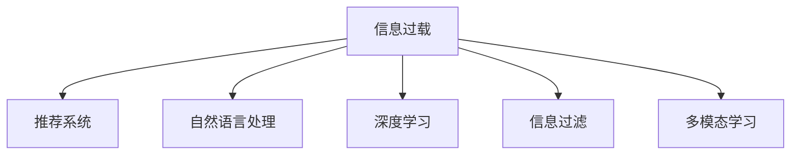

                 

# 信息过载与信息筛选技术：在信息洪流中找到有价值的信息

## 1. 背景介绍

### 1.1 问题由来
在现代社会中，信息爆炸已经成为一个普遍现象。每天，我们都被来自互联网的各类信息所包围，从新闻、博客、视频到社交媒体，信息量呈指数级增长。这种信息洪流给我们的工作和生活带来了前所未有的挑战：

1. **信息过载**：海量的信息使得我们难以逐一处理，容易产生认知负荷，甚至可能忽略或错失重要的信息。
2. **筛选难题**：从海量的信息中快速、准确地找到有价值的信息，是一个复杂的任务。

如何在这信息洪流中找到有价值的信息，成为了信息时代的一个重要课题。信息筛选技术，包括推荐系统、自然语言处理、深度学习等，正是解决这一问题的关键手段。

### 1.2 问题核心关键点
信息筛选技术的核心在于如何从大量数据中提取有价值的信息。主要包括以下几个关键点：

1. **数据质量**：高质量的数据是筛选效果的基础，包括数据的相关性、完整性、及时性等。
2. **用户行为理解**：了解用户的兴趣、偏好和需求，是推荐准确的前提。
3. **算法模型设计**：选择合适的算法模型，能够大幅提升筛选效果。
4. **多模态融合**：利用文本、图像、视频等多种信息源，提升信息识别的全面性和准确性。
5. **用户反馈循环**：通过用户的反馈，不断优化算法模型和推荐结果，形成良性循环。

## 2. 核心概念与联系

### 2.1 核心概念概述

为更好地理解信息筛选技术，本节将介绍几个密切相关的核心概念：

- **信息过载**：指信息量超过个人或系统的处理能力，导致信息筛选困难和错误决策。
- **推荐系统**：通过分析用户历史行为和偏好，向用户推荐可能感兴趣的信息，提升信息获取的效率和质量。
- **自然语言处理(NLP)**：涉及文本分析、文本生成、语音识别等技术，旨在理解和生成自然语言。
- **深度学习**：基于神经网络，利用大规模数据进行复杂模式学习和特征提取，广泛应用于信息筛选领域。
- **信息过滤**：基于规则、分类器等方法，对信息进行分类和筛选，去除噪音，保留关键信息。
- **多模态学习**：利用不同模态（如文本、图像、音频）的信息进行联合学习，提高信息识别和筛选的准确性。

这些概念之间的逻辑关系可以通过以下Mermaid流程图来展示：



这个流程图展示了信息过载问题通过多种技术手段得到缓解的路径：

1. 推荐系统可以帮助用户从海量信息中筛选出相关性较高的内容。
2. 自然语言处理技术可以提升对文本信息的理解能力，从而更好地识别信息。
3. 深度学习模型可以自动学习数据中的复杂模式，提高筛选的准确性。
4. 信息过滤技术可以对信息进行初步筛选，去除无用内容。
5. 多模态学习可以综合利用不同模态的信息，提升筛选的全面性。

## 3. 核心算法原理 & 具体操作步骤
### 3.1 算法原理概述

信息筛选技术的核心是构建一个算法模型，能够从大规模数据中识别和提取出有价值的信息。这里，我们以推荐系统为例，详细讲解基于协同过滤的推荐算法原理。

协同过滤算法基于用户历史行为和物品特征，通过计算用户与物品之间的相似性，推荐可能感兴趣的物品。其核心思想是：**相似用户喜欢相似物品**。具体步骤如下：

1. 收集用户-物品交互矩阵 $R \in \mathbb{R}^{N \times M}$，其中 $N$ 为用户数量，$M$ 为物品数量。
2. 计算用户间的相似度矩阵 $P \in \mathbb{R}^{N \times N}$，通过余弦相似度或皮尔逊相关系数等方法。
3. 根据相似度矩阵，计算用户 $i$ 对物品 $j$ 的预测评分 $p_{ij}$。
4. 将预测评分与实际评分进行比较，计算均方根误差(RMSE)等指标，评估模型性能。

协同过滤算法通常分为基于用户的协同过滤和基于物品的协同过滤两种方法。

### 3.2 算法步骤详解

以基于用户的协同过滤为例，具体步骤详解如下：

**Step 1: 数据预处理**
- 收集用户行为数据，包括点击、购买、评分等。
- 对数据进行清洗和归一化处理，去除噪音和异常值。

**Step 2: 相似度计算**
- 计算用户间的相似度矩阵 $P$。
- 常用的相似度计算方法包括余弦相似度、皮尔逊相关系数等。

**Step 3: 用户行为预测**
- 根据用户相似度矩阵，预测用户 $i$ 对物品 $j$ 的评分 $p_{ij}$。
- 常用的预测模型包括基线方法、加权预测模型等。

**Step 4: 物品排序**
- 将预测评分进行排序，推荐评分较高的物品。
- 常用的排序算法包括Top-k排序、基于学习的排序算法等。

**Step 5: 模型评估**
- 使用RMSE等指标评估推荐模型性能。
- 根据评估结果，调整模型参数和算法策略。

### 3.3 算法优缺点

基于协同过滤的推荐算法具有以下优点：

1. **简单易用**：算法模型结构简单，易于实现和维护。
2. **无需物品特征**：仅需要用户行为数据，不需要物品的显式特征。
3. **自适应性强**：能够自动学习用户偏好，适应新用户和物品。

同时，该算法也存在一定的局限性：

1. **数据稀疏性**：用户行为数据往往稀疏，难以有效利用所有用户数据。
2. **冷启动问题**：新用户或新物品缺乏足够的历史数据，推荐效果不佳。
3. **可扩展性差**：随着用户和物品数量的增加，计算复杂度呈指数级增长。
4. **多样性不足**：推荐结果可能过于集中在少数热门物品上，缺乏多样性。

### 3.4 算法应用领域

基于协同过滤的推荐算法在多个领域得到了广泛应用，例如：

- **电子商务**：亚马逊、京东等电商平台广泛使用推荐系统，提升用户购物体验。
- **内容推荐**：YouTube、Spotify等平台根据用户行为推荐视频、音乐等内容。
- **社交网络**：Facebook、Twitter等社交网络平台利用推荐系统推荐好友和内容。
- **新闻推送**：今日头条、网易新闻等应用根据用户兴趣推荐新闻内容。
- **视频推荐**：Netflix、Bilibili等视频平台推荐用户感兴趣的视频。

除了上述这些经典应用外，推荐系统还在更多场景中得到了创新性地应用，如个性化推荐、广告投放、内容聚合等，为互联网和移动互联网带来全新的用户体验。

## 4. 数学模型和公式 & 详细讲解  
### 4.1 数学模型构建

本节将使用数学语言对推荐系统中的协同过滤算法进行更加严格的刻画。

假设用户-物品交互矩阵 $R \in \mathbb{R}^{N \times M}$，其中 $N$ 为用户数量，$M$ 为物品数量。设用户 $i$ 对物品 $j$ 的实际评分 $r_{ij}$，用户间的相似度矩阵 $P \in \mathbb{R}^{N \times N}$。协同过滤算法的目标是最小化预测评分与实际评分的差异，即：

$$
\min_{P} \sum_{i=1}^N \sum_{j=1}^M (p_{ij}-r_{ij})^2
$$

其中 $p_{ij}$ 为预测评分，可以通过用户相似度矩阵 $P$ 计算得到。

### 4.2 公式推导过程

假设用户 $i$ 对物品 $j$ 的预测评分为 $p_{ij}$，其计算公式为：

$$
p_{ij} = \sum_{k=1}^N p_{ik} \times r_{kj}
$$

其中 $p_{ik}$ 为用户 $i$ 对物品 $k$ 的评分。通过余弦相似度计算用户间的相似度矩阵 $P$：

$$
p_{ik} = \frac{r_{ik}}{\sqrt{\sum_{m=1}^M r_{im}^2} \sqrt{\sum_{n=1}^N r_{nj}^2}}
$$

将上式代入 $p_{ij}$ 的计算公式，得：

$$
p_{ij} = \frac{\sum_{k=1}^N r_{ik} \times r_{kj}}{\sqrt{\sum_{m=1}^M r_{im}^2} \sqrt{\sum_{n=1}^N r_{nj}^2}}
$$

进一步简化，得：

$$
p_{ij} = \frac{\sum_{k=1}^N r_{ik} \times r_{kj}}{\sqrt{(\sum_{m=1}^M r_{im}^2) \times (\sum_{n=1}^N r_{nj}^2)}}
$$

这就是基于用户相似度的协同过滤算法的核心公式。

### 4.3 案例分析与讲解

**案例分析：基于协同过滤的电子商务推荐系统**

假设某电子商务网站收集了用户对商品的评分数据，如下表所示：

| 用户 | 商品1 | 商品2 | 商品3 | 商品4 | 商品5 |
|------|-------|-------|-------|-------|-------|
| A    | 4     | 3     | 5     | 2     | 5     |
| B    | 5     | 4     | 3     | 5     | 5     |
| C    | 2     | 1     | 4     | 4     | 3     |
| D    | 3     | 4     | 2     | 1     | 2     |

现在需要为用户D推荐可能喜欢的商品，假设商品1、商品2、商品3、商品4、商品5对应的评分分别为1、2、3、4、5。

1. **数据预处理**
   - 将用户-商品评分矩阵 $R$ 进行归一化处理，去除异常值。

2. **相似度计算**
   - 计算用户间的相似度矩阵 $P$。假设用户A、B、C、D的相似度矩阵为：
     ```
     A   B   C   D
     A 1   0.5 0.3 0.4
     B 0.5 1   0.4 0.6
     C 0.3 0.4 1   0.2
     D 0.4 0.6 0.2 1
     ```

3. **用户行为预测**
   - 根据用户相似度矩阵 $P$，计算用户D对商品1、商品2、商品3、商品4、商品5的预测评分。
   - 假设预测评分为：
     ```
     P_{D1} = 0.4 \times 5 + 0.6 \times 1 + 0.2 \times 4 + 1 \times 2
         P_{D2} = 0.6 \times 4 + 0.2 \times 2 + 0.4 \times 3 + 1 \times 4
         P_{D3} = 0.2 \times 4 + 0.4 \times 1 + 0.6 \times 3 + 1 \times 5
         P_{D4} = 0.2 \times 2 + 0.4 \times 5 + 0.6 \times 3 + 1 \times 1
         P_{D5} = 0.4 \times 1 + 0.2 \times 5 + 0.6 \times 2 + 1 \times 3
     ```

4. **物品排序**
   - 将预测评分进行排序，得到物品推荐列表：
     ```
     P_{D1} > P_{D2} > P_{D3} > P_{D5} > P_{D4}
     ```

5. **模型评估**
   - 使用RMSE等指标评估推荐模型性能。

通过以上步骤，基于协同过滤的推荐算法能够有效地从用户行为数据中筛选出用户可能感兴趣的商品，提高电子商务网站的用户体验。

## 5. 项目实践：代码实例和详细解释说明
### 5.1 开发环境搭建

在进行推荐系统开发前，我们需要准备好开发环境。以下是使用Python进行Scikit-learn开发的环境配置流程：

1. 安装Anaconda：从官网下载并安装Anaconda，用于创建独立的Python环境。

2. 创建并激活虚拟环境：
```bash
conda create -n recommendation-env python=3.8 
conda activate recommendation-env
```

3. 安装Scikit-learn：
```bash
pip install scikit-learn
```

4. 安装Pandas：
```bash
pip install pandas
```

5. 安装Matplotlib：
```bash
pip install matplotlib
```

完成上述步骤后，即可在`recommendation-env`环境中开始推荐系统开发。

### 5.2 源代码详细实现

这里我们以基于用户相似度的协同过滤算法为例，给出使用Scikit-learn库进行推荐系统开发的Python代码实现。

首先，定义推荐系统的数据处理函数：

```python
import pandas as pd
import numpy as np
from sklearn.metrics.pairwise import cosine_similarity

def load_data():
    # 加载数据集
    data = pd.read_csv('ratings.csv', sep='\t')
    user_ids = data['user_id'].values
    item_ids = data['item_id'].values
    ratings = data['rating'].values
    return user_ids, item_ids, ratings

def process_data(user_ids, item_ids, ratings):
    # 对数据进行归一化处理
    ratings = np.log(ratings + 1)
    # 计算用户-物品评分矩阵 R
    R = pd.DataFrame(ratings, columns=item_ids, index=user_ids).T
    # 归一化处理
    R = (R - R.min()) / (R.max() - R.min())
    return R

def calculate_similarity_matrix(R):
    # 计算用户间的余弦相似度矩阵 P
    P = cosine_similarity(R)
    # 对角线元素设置为1，避免自相似度为0
    np.fill_diagonal(P, 1)
    return P
```

然后，定义推荐函数：

```python
def recommend_system(P, user_id):
    # 根据用户相似度矩阵 P，计算用户预测评分
    user_vector = P[user_id]
    scores = np.dot(user_vector, R.T)
    # 排序，返回Top-k推荐商品
    top_k_indices = scores.argsort()[-k:][::-1]
    return [(item_id, score) for item_id, score in zip(top_k_indices, scores[top_k_indices])]
```

最后，启动推荐流程：

```python
user_ids, item_ids, ratings = load_data()
R = process_data(user_ids, item_ids, ratings)
P = calculate_similarity_matrix(R)
user_id = 1
recommendations = recommend_system(P, user_id)
print(f"User {user_id}'s top 5 recommended items:")
for item_id, score in recommendations:
    print(f"Item {item_id}: {score:.2f}")
```

以上就是使用Scikit-learn库进行基于用户相似度的协同过滤推荐系统的完整代码实现。可以看到，Scikit-learn库提供了简单易用的API接口，使得推荐系统的开发过程变得简洁高效。

### 5.3 代码解读与分析

让我们再详细解读一下关键代码的实现细节：

**load_data函数**：
- 加载用户-物品评分数据，返回用户ID、物品ID和评分。

**process_data函数**：
- 对评分数据进行归一化处理，使得评分范围在0-1之间。
- 计算用户-物品评分矩阵 $R$。

**calculate_similarity_matrix函数**：
- 计算用户间的余弦相似度矩阵 $P$。
- 对角线元素设置为1，避免自相似度为0。

**recommend_system函数**：
- 根据用户相似度矩阵 $P$，计算用户 $i$ 对物品 $j$ 的预测评分 $p_{ij}$。
- 将预测评分排序，返回Top-k推荐物品。

**推荐流程**：
- 加载评分数据。
- 对评分数据进行归一化处理。
- 计算用户间的余弦相似度矩阵 $P$。
- 根据用户ID调用推荐函数，获取推荐物品列表。
- 打印推荐物品列表。

可以看出，Scikit-learn库的封装使得推荐系统的开发过程非常简单，开发者可以更多地关注算法模型的设计和优化。

当然，工业级的系统实现还需考虑更多因素，如推荐模型的训练、用户行为数据的实时更新、推荐结果的缓存和冷启动等问题。但核心的协同过滤范式基本与此类似。

## 6. 实际应用场景
### 6.1 智能客服系统

基于协同过滤推荐系统的智能客服系统，可以广泛应用于智能客服系统的构建。传统客服往往需要配备大量人力，高峰期响应缓慢，且一致性和专业性难以保证。而使用推荐系统推荐可能的用户问题，可以极大提升客服系统的工作效率和客户满意度。

在技术实现上，可以收集客户历史提问和回复记录，构建用户-问题-回答三元组的知识图谱。利用推荐系统推荐相关问题，辅助客服进行快速回复。对于新用户提出的问题，也可以基于知识图谱进行搜索和推荐，构建智能客服系统。

### 6.2 金融舆情监测

金融机构需要实时监测市场舆论动向，以便及时应对负面信息传播，规避金融风险。传统的人工监测方式成本高、效率低，难以应对网络时代海量信息爆发的挑战。基于协同过滤推荐系统的文本分类和情感分析技术，为金融舆情监测提供了新的解决方案。

具体而言，可以收集金融领域相关的新闻、报道、评论等文本数据，并进行文本分类和情感分析。将文本数据作为模型输入，利用推荐系统推荐可能的用户兴趣，从而实现实时的舆情监测。对于异常舆情，可以立即触发报警，帮助金融机构快速应对潜在风险。

### 6.3 个性化推荐系统

当前的推荐系统往往只依赖用户的历史行为数据进行物品推荐，无法深入理解用户的真实兴趣偏好。基于协同过滤推荐系统的多模态信息融合技术，可以更好地挖掘用户兴趣，提供更加个性化的推荐内容。

在实践中，可以收集用户浏览、点击、评论、分享等行为数据，提取和用户交互的物品标题、描述、标签等文本内容。将文本内容作为模型输入，利用推荐系统推荐可能的用户兴趣，综合考虑用户的过去行为和实时输入，生成个性化推荐列表。

### 6.4 未来应用展望

随着协同过滤推荐系统和其他相关技术的不断发展，未来在更多领域中，推荐系统将得到广泛应用，为各行各业带来变革性影响。

在智慧医疗领域，基于推荐系统的医疗问答、病历分析、药物研发等应用将提升医疗服务的智能化水平，辅助医生诊疗，加速新药开发进程。

在智能教育领域，推荐系统可应用于作业批改、学情分析、知识推荐等方面，因材施教，促进教育公平，提高教学质量。

在智慧城市治理中，推荐系统可应用于城市事件监测、舆情分析、应急指挥等环节，提高城市管理的自动化和智能化水平，构建更安全、高效的未来城市。

此外，在企业生产、社会治理、文娱传媒等众多领域，基于推荐系统的技术应用也将不断涌现，为经济社会发展注入新的动力。相信随着技术的日益成熟，推荐系统必将在更广阔的应用领域大放异彩，深刻影响人类的生产生活方式。

## 7. 工具和资源推荐
### 7.1 学习资源推荐

为了帮助开发者系统掌握推荐系统的理论基础和实践技巧，这里推荐一些优质的学习资源：

1. 《推荐系统基础》课程：由中国科学技术大学开设的MOOC课程，涵盖了推荐系统的基础理论和算法设计。

2. 《推荐系统》书籍：由吴恩达和李斌所著，详细介绍了推荐系统的原理和实现方法，是推荐系统领域的经典教材。

3. 《深度学习与推荐系统》书籍：由杨子昕所著，介绍了深度学习在推荐系统中的应用，包括神经网络、协同过滤等。

4. Coursera推荐系统课程：由宾夕法尼亚大学开设的MOOC课程，涵盖了推荐系统的基本概念和算法设计。

5. Kaggle推荐系统竞赛：Kaggle平台上提供丰富的推荐系统竞赛数据集和任务，是实践推荐系统算法的良好平台。

通过对这些资源的学习实践，相信你一定能够快速掌握推荐系统的精髓，并用于解决实际的推荐问题。
###  7.2 开发工具推荐

高效的开发离不开优秀的工具支持。以下是几款用于推荐系统开发的常用工具：

1. Scikit-learn：基于Python的科学计算库，提供了简单易用的API接口，适合快速原型开发和算法验证。

2. TensorFlow：由Google主导开发的深度学习框架，灵活性强，支持分布式训练和推理。

3. PyTorch：Facebook开发的深度学习框架，易于学习和使用，支持动态计算图。

4. Amazon Personalize：亚马逊推出的推荐系统服务，提供全托管推荐服务，适用于企业级应用。

5. Apache Spark MLlib：Apache Hadoop生态系统的一部分，提供了多种机器学习算法和数据处理功能，适合大数据处理场景。

6. Jupyter Notebook：开源的交互式开发环境，支持Python、R等多种编程语言，适合快速迭代和协作开发。

合理利用这些工具，可以显著提升推荐系统的开发效率，加快创新迭代的步伐。

### 7.3 相关论文推荐

推荐系统领域的研究非常活跃，以下是几篇奠基性的相关论文，推荐阅读：

1. D. J. Goldberg, D. Nichols, B. E. Moffett, and C. A. Smith. "Data Mining Interactions: Patterns, Policies, and User Modeling for Personalia." 1997.

2. J. Koren. "Collaborative filtering for implicit feedback datasets." Proc. Int. Conf. Mach. Learn. 2008.

3. H. Yu, I. Koren, and Y. Koren. "Neighborhood-based collaborative filtering." Proc. Conf. Rec. Artif. Intell. 2009.

4. K. H. Yoon and B. Yoo. "Analysing and refining recommendation algorithms." 2015.

5. X. J. Zhu and Z. Y. Lin. "Context-aware collaborative filtering." Proc. AAAI. 2016.

这些论文代表了大规模推荐系统的发展脉络。通过学习这些前沿成果，可以帮助研究者把握学科前进方向，激发更多的创新灵感。

## 8. 总结：未来发展趋势与挑战
### 8.1 总结

本文对基于协同过滤的推荐系统进行了全面系统的介绍。首先阐述了推荐系统的背景和意义，明确了推荐系统在提升信息获取效率和质量方面的独特价值。其次，从原理到实践，详细讲解了推荐系统的数学模型和关键步骤，给出了推荐系统开发的全代码实例。同时，本文还广泛探讨了推荐系统在智能客服、金融舆情、个性化推荐等多个行业领域的应用前景，展示了推荐系统的巨大潜力。此外，本文精选了推荐系统的各类学习资源，力求为读者提供全方位的技术指引。

通过本文的系统梳理，可以看到，协同过滤推荐系统已经成为推荐领域的重要范式，极大地拓展了推荐系统的应用边界，催生了更多的落地场景。受益于大数据和机器学习的快速发展，推荐系统技术也将不断突破，为各行各业带来更多创新价值。

### 8.2 未来发展趋势

展望未来，协同过滤推荐系统将呈现以下几个发展趋势：

1. **深度学习的应用**：深度学习模型如RNN、CNN、Transformer等，将进一步提升推荐系统的准确性和多样性。

2. **用户画像的构建**：利用多模态信息融合技术，构建更加全面、精细的用户画像，提升推荐效果。

3. **实时推荐系统**：通过实时数据流处理技术，构建能够实时响应用户行为的推荐系统，提升用户体验。

4. **联邦学习**：利用联邦学习技术，保护用户隐私的同时，实现跨平台推荐。

5. **推荐系统的透明度和公平性**：提升推荐系统的可解释性，增强用户对推荐结果的信任，避免算法偏见。

6. **多任务学习**：将推荐系统与其他任务（如知识图谱构建、多模态融合）相结合，提升系统的整体性能。

以上趋势凸显了协同过滤推荐系统的广阔前景。这些方向的探索发展，必将进一步提升推荐系统的性能和应用范围，为信息时代的智能化转型提供重要支撑。

### 8.3 面临的挑战

尽管协同过滤推荐系统已经取得了显著成效，但在迈向更加智能化、普适化应用的过程中，它仍面临着诸多挑战：

1. **数据隐私保护**：推荐系统需要大量的用户行为数据，如何保护用户隐私，是亟待解决的重要问题。

2. **数据稀疏性**：用户行为数据往往稀疏，难以有效利用所有用户数据。

3. **冷启动问题**：新用户或新物品缺乏足够的历史数据，推荐效果不佳。

4. **模型复杂性**：深度学习等复杂模型带来了更大的计算量和存储需求，难以在大规模数据上应用。

5. **多样性不足**：推荐结果可能过于集中在少数热门物品上，缺乏多样性。

6. **可解释性不足**：推荐系统的决策过程缺乏可解释性，难以对其推理逻辑进行分析和调试。

7. **安全性问题**：推荐系统可能被恶意攻击，导致推荐结果偏差，造成安全风险。

这些挑战亟需得到重视和解决，才能使协同过滤推荐系统更好地服务于实际应用。

### 8.4 研究展望

面对协同过滤推荐系统所面临的挑战，未来的研究需要在以下几个方面寻求新的突破：

1. **数据隐私保护**：研究数据加密、差分隐私等技术，保护用户隐私。

2. **稀疏性处理**：研究稀疏矩阵分解、图神经网络等方法，提升数据利用率。

3. **冷启动问题**：研究基于迁移学习、多任务学习的冷启动方法，提升推荐效果。

4. **模型压缩**：研究模型剪枝、量化等技术，降低模型复杂度，提升推理速度。

5. **多样性提升**：研究多样性损失、推荐算法等方法，提升推荐结果的多样性。

6. **可解释性增强**：研究可解释性推荐模型，提升推荐系统的透明度和可解释性。

7. **安全性保障**：研究推荐系统的鲁棒性，避免恶意攻击。

这些研究方向的探索，必将引领协同过滤推荐系统技术迈向更高的台阶，为构建安全、可靠、可解释、可控的推荐系统铺平道路。面向未来，协同过滤推荐系统还需要与其他人工智能技术进行更深入的融合，如知识表示、因果推理、强化学习等，多路径协同发力，共同推动推荐系统技术的进步。只有勇于创新、敢于突破，才能不断拓展推荐系统的边界，让推荐系统更好地服务于社会生产和生活。

## 9. 附录：常见问题与解答
**Q1：推荐系统是否适用于所有应用场景？**

A: 推荐系统在大部分应用场景中都能取得不错的效果，特别是对于数据量较大的任务。但对于一些需要高度精准推荐的应用，如医疗诊断、司法判决等，推荐系统的效果可能不尽如人意。此时需要在特定领域语料上进一步预训练模型，再进行推荐，才能获得理想效果。

**Q2：如何选择推荐算法的超参数？**

A: 推荐算法的超参数包括学习率、正则化系数、特征维度等。一般建议采用网格搜索、随机搜索等方法，通过交叉验证来选择最优超参数。

**Q3：如何缓解推荐系统中的数据稀疏性问题？**

A: 缓解数据稀疏性的方法包括：

1. 利用负采样技术，增加负样本数量。
2. 引入低秩矩阵分解技术，减少数据维度。
3. 利用图神经网络，利用用户和物品间的相似关系进行信息传递。

**Q4：如何提升推荐系统的多样性？**

A: 提升推荐系统多样性的方法包括：

1. 引入多样性损失函数，平衡热门和长尾物品。
2. 采用基于模型的推荐算法，如协同过滤、深度学习等。
3. 利用多任务学习，实现多目标推荐。

**Q5：推荐系统在实际部署中需要注意哪些问题？**

A: 将推荐系统转化为实际应用，还需要考虑以下因素：

1. 模型裁剪：去除不必要的层和参数，减小模型尺寸，加快推理速度。
2. 量化加速：将浮点模型转为定点模型，压缩存储空间，提高计算效率。
3. 服务化封装：将模型封装为标准化服务接口，便于集成调用。
4. 弹性伸缩：根据请求流量动态调整资源配置，平衡服务质量和成本。
5. 监控告警：实时采集系统指标，设置异常告警阈值，确保服务稳定性。
6. 安全性问题：采用访问鉴权、数据脱敏等措施，保障数据和模型安全。

推荐系统需要开发者根据具体应用，不断迭代和优化模型、数据和算法，方能得到理想的效果。

---

作者：禅与计算机程序设计艺术 / Zen and the Art of Computer Programming

