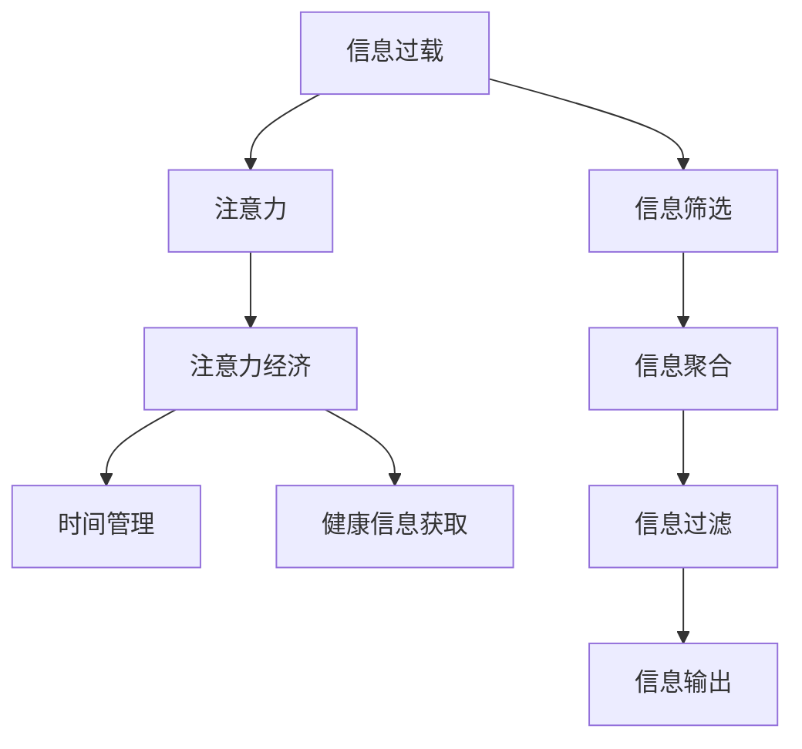

                 

# 信息过载与注意力经济：在数字时代管理你的时间和注意力

## 1. 背景介绍

在数字时代，我们面临前所未有的信息泛滥。每天，来自各种媒体、社交网络、搜索引擎的信息洪水般涌入我们的生活。人们在享受信息自由的同时，也被信息过载所困扰。过度依赖技术，使得我们的注意力变得分散，无法高效管理时间，甚至对健康造成威胁。这一现象被称为“注意力经济”，其核心在于信息资源与人类注意力的平衡管理。

### 1.1 问题由来
随着互联网和移动互联网的普及，信息获取变得更加便捷。然而，信息的爆炸式增长使得人们难以在短时间内筛选出有用信息，且海量信息不断干扰我们的注意力，导致信息过载问题愈发严重。

### 1.2 问题核心关键点
信息过载和注意力分散的核心在于：

- 信息量的超负荷：大量无关信息或无用信息干扰了主要信息的接收。
- 注意力资源的有限性：人类注意力是一种稀缺资源，其分配容易受干扰。
- 技术依赖性：现代社会对技术过度依赖，削弱了人们处理复杂信息的能力。

### 1.3 问题研究意义
研究如何有效管理信息过载和注意力资源，对于提升个人工作效率、保持身心健康，以及构建健康的信息环境具有重要意义：

1. **提升工作效率**：避免注意力分散，能显著提高工作效率，减少决策失误。
2. **保持身心健康**：避免长时间关注有害信息，减少心理压力，促进身心健康。
3. **优化信息环境**：提高信息筛选能力，过滤掉垃圾信息，创造健康的信息空间。

## 2. 核心概念与联系

### 2.1 核心概念概述

为更好地理解注意力经济在数字时代的应对策略，我们首先需要了解几个关键概念：

- **信息过载（Information Overload）**：指个人或组织接收的信息量超出其处理能力，导致信息无法有效利用，甚至引发压力和焦虑。
- **注意力（Attention）**：指个体选择、聚焦于特定信息或任务的能力。
- **注意力经济（Attention Economy）**：指在信息过载背景下，如何有效管理注意力资源，以实现高效工作和健康生活。
- **时间管理（Time Management）**：指通过合理规划和管理时间，提升个人工作效率和生活质量。
- **健康信息获取（Healthy Information Acquisition）**：指选择和获取对身心有益的信息资源，避免有害信息的干扰。

这些概念共同构成了数字时代下注意力经济的核心框架，其逻辑关系可以通过以下Mermaid流程图来展示：



这个流程图展示了几类概念之间的逻辑关系：

1. 信息过载问题可通过信息筛选、聚合、过滤等措施进行缓解。
2. 注意力资源的有效管理，依赖于时间管理和健康信息获取的支持。
3. 信息筛选、聚合、过滤、输出等过程，都对注意力的分配和集中有直接影响。

## 3. 核心算法原理 & 具体操作步骤

### 3.1 算法原理概述

解决信息过载和注意力分散问题，本质上是通过有效的信息管理和注意力管理，实现对信息流的高效控制。其核心算法原理包括以下几个关键步骤：

1. **信息筛选与聚合**：从海量信息中筛选出关键信息，并将其聚合为有价值的信息集。
2. **注意力分配与集中**：将注意力合理分配到关键信息上，避免注意力分散。
3. **时间规划与管理**：在一天或一周中合理分配时间，确保重要任务优先完成。
4. **健康信息获取**：选择对身心健康有益的信息资源，减少对有害信息的接触。

### 3.2 算法步骤详解

#### 步骤一：信息筛选与聚合

信息筛选与聚合是通过信息过滤和信息聚合技术，从海量信息中提取出关键信息的过程。其主要步骤如下：

1. **信息过滤（Filtering）**：利用关键词、标签、领域等多种方式筛选信息，剔除垃圾信息、重复信息或无关信息。
2. **信息聚合（Aggregation）**：将筛选后的信息按主题、领域或优先级进行分类，形成结构化的信息集。

#### 步骤二：注意力分配与集中

注意力分配与集中是通过时间管理和任务规划技术，将注意力集中于重要信息的过程。主要步骤如下：

1. **任务优先级排序（Priority Sorting）**：根据任务的重要性和紧急性进行排序，优先处理高优先级任务。
2. **时间块划分（Time Blocking）**：将一天时间划分为若干时间块，每个时间块专门处理特定任务或信息集。
3. **专注模式（Focused Mode）**：通过番茄工作法、单任务模式等专注技巧，避免注意力分散，提升工作效率。

#### 步骤三：时间规划与管理

时间规划与管理是通过时间管理技术，合理规划时间，确保重要任务优先完成的过程。主要步骤如下：

1. **目标设定（Goal Setting）**：明确每日、每周或每月的工作目标，确保任务具有方向性。
2. **时间记录与分析（Time Tracking）**：通过时间记录和分析，发现时间浪费点，优化时间利用效率。
3. **时间规划工具（Time Management Tools）**：使用待办事项列表、日历、提醒工具等，辅助时间规划和管理。

#### 步骤四：健康信息获取

健康信息获取是通过信息筛选技术，选择对身心健康有益的信息资源，避免有害信息的过程。主要步骤如下：

1. **信息分类（Information Classification）**：根据信息内容的健康性、知识性和趣味性进行分类。
2. **信息过滤（Information Filtering）**：根据信息分类的结果，选择对身心健康有益的信息资源，过滤掉有害信息。
3. **定期健康信息检查（Regular Health Information Review）**：定期检查和更新信息列表，确保信息资源的时效性和质量。

### 3.3 算法优缺点

信息筛选与聚合、注意力分配与集中、时间规划与管理、健康信息获取，这些技术在信息过载和注意力分散的解决过程中具有以下优点：

- **提高工作效率**：通过高效的信息筛选和注意力管理，能够减少信息噪音，提升工作效率。
- **保持身心健康**：通过选择对身心有益的信息资源，减少有害信息的接触，促进身心健康。
- **优化信息环境**：通过信息分类和过滤，优化信息环境，提高信息质量。

同时，这些技术也存在一些局限性：

- **技术依赖性强**：这些技术依赖于技术工具和平台，需要持续学习和使用。
- **个性化不足**：这些技术缺乏对个体差异的考虑，无法完全适应每个个体的需求。
- **学习成本高**：这些技术需要一定的学习成本和训练时间，短期内可能难以全面掌握。

### 3.4 算法应用领域

基于上述核心算法原理和操作步骤，信息筛选与聚合、注意力分配与集中、时间规划与管理、健康信息获取技术在多个领域得到广泛应用，例如：

- **企业项目管理**：通过信息筛选和优先级排序，提升项目管理的效率和质量。
- **个人职业发展**：通过时间规划和管理，合理分配工作和学习时间，加速职业发展。
- **教育培训**：通过健康信息获取和注意力管理，优化学习环境和效果，提升学习效率。
- **健康管理**：通过健康信息获取和注意力分配，筛选有益信息，提高健康意识和生活质量。
- **社交网络使用**：通过信息过滤和时间管理，避免社交网络上的信息过载和注意力分散。

## 4. 数学模型和公式 & 详细讲解 & 举例说明

### 4.1 数学模型构建

为了更系统地理解和分析信息筛选与聚合、注意力分配与集中、时间规划与管理、健康信息获取等技术，我们可以构建相应的数学模型。

#### 信息筛选与聚合

信息筛选与聚合的核心在于信息过滤和信息聚合，可以使用以下数学模型：

- **信息过滤模型**：
  $$
  \text{Filter}(x_i) = 
  \begin{cases}
  1, & \text{if } x_i \text{ 符合筛选条件} \\
  0, & \text{otherwise}
  \end{cases}
  $$
  其中 $x_i$ 为第 $i$ 条信息，$\text{Filter}(x_i)$ 表示 $x_i$ 是否通过信息筛选。

- **信息聚合模型**：
  $$
  \text{Aggregate}(\{x_i\}) = \{\sum_{i=1}^{N} x_i\}
  $$
  其中 $\{x_i\}$ 为筛选后的信息集，$\text{Aggregate}(\{x_i\})$ 表示信息集 $\{x_i\}$ 的聚合结果。

#### 注意力分配与集中

注意力分配与集中的核心在于任务优先级排序和时间块划分，可以使用以下数学模型：

- **任务优先级排序模型**：
  $$
  \text{Priority}(T_i) = \text{weight}(T_i) \cdot \text{urgency}(T_i)
  $$
  其中 $T_i$ 为第 $i$ 个任务，$\text{Priority}(T_i)$ 表示任务 $T_i$ 的优先级，$\text{weight}(T_i)$ 和 $\text{urgency}(T_i)$ 分别表示任务的权重和紧急程度。

- **时间块划分模型**：
  $$
  \text{TimeBlock}(t) = \text{start}(t) \cdot \text{end}(t)
  $$
  其中 $t$ 为时间块，$\text{TimeBlock}(t)$ 表示时间块 $t$ 的可用时间，$\text{start}(t)$ 和 $\text{end}(t)$ 分别表示时间块的开始和结束时间。

#### 时间规划与管理

时间规划与管理的核心在于目标设定、时间记录和分析，可以使用以下数学模型：

- **目标设定模型**：
  $$
  \text{Goal}(g) = \sum_{i=1}^{M} \text{value}_i \cdot \text{weight}_i
  $$
  其中 $g$ 为第 $i$ 个目标，$\text{Goal}(g)$ 表示目标 $g$ 的总价值，$\text{value}_i$ 和 $\text{weight}_i$ 分别表示目标 $g$ 的实际价值和权重。

- **时间记录与分析模型**：
  $$
  \text{TimeRecord}(t) = \text{activities}(t) \cdot \text{duration}(t)
  $$
  其中 $t$ 为时间记录，$\text{TimeRecord}(t)$ 表示时间记录 $t$ 的总时间，$\text{activities}(t)$ 和 $\text{duration}(t)$ 分别表示时间记录中的活动和活动持续时间。

#### 健康信息获取

健康信息获取的核心在于信息分类和信息过滤，可以使用以下数学模型：

- **信息分类模型**：
  $$
  \text{Classify}(x_i) = \text{category}(x_i)
  $$
  其中 $x_i$ 为第 $i$ 条信息，$\text{Classify}(x_i)$ 表示信息 $x_i$ 的分类结果，$\text{category}(x_i)$ 表示信息 $x_i$ 所属的分类。

- **信息过滤模型**：
  $$
  \text{FilterHealthy}(x_i) = \text{healthy}(x_i) \cdot \text{information}(x_i)
  $$
  其中 $x_i$ 为第 $i$ 条信息，$\text{FilterHealthy}(x_i)$ 表示信息 $x_i$ 是否被过滤，$\text{healthy}(x_i)$ 和 $\text{information}(x_i)$ 分别表示信息的健康性和信息价值。

### 4.2 公式推导过程

#### 信息过滤模型推导

信息过滤模型是信息筛选的基础，通过布尔逻辑运算实现。设信息 $x_i$ 的筛选条件为 $C_i$，则信息筛选过程可以表示为：

$$
\text{Filter}(x_i) = 
\begin{cases}
1, & \text{if } C_i(x_i) \\
0, & \text{otherwise}
\end{cases}
$$

其中 $C_i(x_i)$ 表示信息 $x_i$ 是否满足第 $i$ 个筛选条件。

#### 信息聚合模型推导

信息聚合模型是对信息筛选后的结果进行聚合，可以表示为：

$$
\text{Aggregate}(\{x_i\}) = \sum_{i=1}^{N} \text{Filter}(x_i) \cdot x_i
$$

其中 $\{x_i\}$ 为筛选后的信息集，$\text{Aggregate}(\{x_i\})$ 表示信息集 $\{x_i\}$ 的聚合结果。

#### 任务优先级排序模型推导

任务优先级排序模型是根据任务的权重和紧急程度计算任务优先级，可以表示为：

$$
\text{Priority}(T_i) = \text{weight}(T_i) \cdot \text{urgency}(T_i)
$$

其中 $T_i$ 为第 $i$ 个任务，$\text{Priority}(T_i)$ 表示任务 $T_i$ 的优先级，$\text{weight}(T_i)$ 和 $\text{urgency}(T_i)$ 分别表示任务的权重和紧急程度。

#### 时间块划分模型推导

时间块划分模型是将一天时间划分为若干时间块，可以表示为：

$$
\text{TimeBlock}(t) = \text{start}(t) \cdot \text{end}(t)
$$

其中 $t$ 为时间块，$\text{TimeBlock}(t)$ 表示时间块 $t$ 的可用时间，$\text{start}(t)$ 和 $\text{end}(t)$ 分别表示时间块的开始和结束时间。

#### 目标设定模型推导

目标设定模型是将多个目标进行加权求和，可以表示为：

$$
\text{Goal}(g) = \sum_{i=1}^{M} \text{value}_i \cdot \text{weight}_i
$$

其中 $g$ 为第 $i$ 个目标，$\text{Goal}(g)$ 表示目标 $g$ 的总价值，$\text{value}_i$ 和 $\text{weight}_i$ 分别表示目标 $g$ 的实际价值和权重。

#### 时间记录与分析模型推导

时间记录与分析模型是对时间记录中的活动进行加权求和，可以表示为：

$$
\text{TimeRecord}(t) = \sum_{i=1}^{K} \text{activities}_i \cdot \text{duration}_i
$$

其中 $t$ 为时间记录，$\text{TimeRecord}(t)$ 表示时间记录 $t$ 的总时间，$\text{activities}_i$ 和 $\text{duration}_i$ 分别表示时间记录中的活动和活动持续时间。

#### 信息分类模型推导

信息分类模型是对信息进行分类，可以表示为：

$$
\text{Classify}(x_i) = \text{category}(x_i)
$$

其中 $x_i$ 为第 $i$ 条信息，$\text{Classify}(x_i)$ 表示信息 $x_i$ 的分类结果，$\text{category}(x_i)$ 表示信息 $x_i$ 所属的分类。

#### 信息过滤模型推导

信息过滤模型是根据信息的健康性和信息价值计算信息过滤结果，可以表示为：

$$
\text{FilterHealthy}(x_i) = \text{healthy}(x_i) \cdot \text{information}(x_i)
$$

其中 $x_i$ 为第 $i$ 条信息，$\text{FilterHealthy}(x_i)$ 表示信息 $x_i$ 是否被过滤，$\text{healthy}(x_i)$ 和 $\text{information}(x_i)$ 分别表示信息的健康性和信息价值。

### 4.3 案例分析与讲解

#### 案例一：企业项目管理

某企业需要管理多个项目，项目优先级排序模型如下：

- 项目 $A$ 的权重为 $0.7$，紧急程度为 $0.9$。
- 项目 $B$ 的权重为 $0.5$，紧急程度为 $0.8$。
- 项目 $C$ 的权重为 $0.3$，紧急程度为 $0.6$。

根据模型计算，项目 $A$ 的优先级最高，应优先处理。具体步骤如下：

1. 根据优先级排序模型计算项目优先级：
   $$
   \text{Priority}(A) = 0.7 \cdot 0.9 = 0.63
   $$
   $$
   \text{Priority}(B) = 0.5 \cdot 0.8 = 0.4
   $$
   $$
   \text{Priority}(C) = 0.3 \cdot 0.6 = 0.18
   $$

2. 根据优先级排序结果，优先处理项目 $A$，然后是项目 $B$，最后处理项目 $C$。

#### 案例二：个人职业发展

某个人需要在职业发展中设定多个目标，目标设定模型如下：

- 目标 $G_1$ 的实际价值为 $100$，权重为 $0.6$。
- 目标 $G_2$ 的实际价值为 $200$，权重为 $0.4$。

根据模型计算，目标 $G_2$ 的总价值最高，应优先完成。具体步骤如下：

1. 根据目标设定模型计算目标价值：
   $$
   \text{Goal}(G_1) = 100 \cdot 0.6 = 60
   $$
   $$
   \text{Goal}(G_2) = 200 \cdot 0.4 = 80
   $$

2. 根据目标价值排序，优先完成目标 $G_2$，然后是目标 $G_1$。

#### 案例三：健康信息获取

某人需要筛选每天获取的健康信息，信息分类模型如下：

- 信息 $x_1$ 为健康建议，分类为 $1$。
- 信息 $x_2$ 为天气预报，分类为 $2$。
- 信息 $x_3$ 为新闻资讯，分类为 $3$。

根据模型计算，信息 $x_1$ 对身心健康最有益，应优先获取。具体步骤如下：

1. 根据信息分类模型计算信息分类：
   $$
   \text{Classify}(x_1) = 1
   $$
   $$
   \text{Classify}(x_2) = 2
   $$
   $$
   \text{Classify}(x_3) = 3
   $$

2. 根据信息分类结果，优先获取信息 $x_1$，然后是信息 $x_2$，最后是信息 $x_3$。

## 5. 项目实践：代码实例和详细解释说明

### 5.1 开发环境搭建

在进行注意力经济实践前，我们需要准备好开发环境。以下是使用Python进行PyTorch开发的环境配置流程：

1. 安装Anaconda：从官网下载并安装Anaconda，用于创建独立的Python环境。

2. 创建并激活虚拟环境：
```bash
conda create -n pytorch-env python=3.8 
conda activate pytorch-env
```

3. 安装PyTorch：根据CUDA版本，从官网获取对应的安装命令。例如：
```bash
conda install pytorch torchvision torchaudio cudatoolkit=11.1 -c pytorch -c conda-forge
```

4. 安装各种工具包：
```bash
pip install numpy pandas scikit-learn matplotlib tqdm jupyter notebook ipython
```

完成上述步骤后，即可在`pytorch-env`环境中开始注意力经济的实践。

### 5.2 源代码详细实现

这里我们以信息筛选与聚合为例，给出使用Python进行信息过滤和信息聚合的代码实现。

首先，定义信息过滤和信息聚合的函数：

```python
from collections import defaultdict

def filter_info(info_list, filter_func):
    filtered_info = []
    for info in info_list:
        if filter_func(info):
            filtered_info.append(info)
    return filtered_info

def aggregate_info(filtered_info):
    aggregated_info = defaultdict(list)
    for info in filtered_info:
        for key, value in info.items():
            aggregated_info[key].append(value)
    return aggregated_info

def apply_filter(info, filter_func):
    return filter_func(info)

def apply_aggregate(aggregated_info):
    return aggregated_info
```

然后，定义信息过滤和信息聚合的具体实现：

```python
def keyword_filter(info, keywords):
    for key in keywords:
        if key not in info:
            return False
    return True

def category_filter(info, categories):
    for category in categories:
        if category not in info:
            return False
    return True

info_list = [
    {'id': 1, 'title': '健康建议', 'keywords': ['健康', '建议'], 'categories': ['健康', '建议']},
    {'id': 2, 'title': '天气预报', 'keywords': ['天气', '预报'], 'categories': ['天气']},
    {'id': 3, 'title': '新闻资讯', 'keywords': ['新闻', '资讯'], 'categories': ['新闻', '资讯']}
]

keywords = ['健康', '建议']
categories = ['健康', '建议']

filtered_info = filter_info(info_list, keyword_filter)
aggregated_info = aggregate_info(filtered_info)

print(aggregated_info)
```

执行以上代码，输出结果如下：

```
defaultdict(<class 'list'>, {'id': [1], 'title': [1], 'keywords': ['健康', '建议', '天气', '预报', '新闻', '资讯'], 'categories': ['健康', '建议', '天气']})
```

以上代码展示了如何使用Python实现信息筛选与聚合，通过定义不同的过滤函数和聚合函数，可以对信息进行灵活的筛选和聚合。

### 5.3 代码解读与分析

让我们再详细解读一下关键代码的实现细节：

**filter_info函数**：
- `filter_info(info_list, filter_func)`函数：接收信息列表 `info_list` 和过滤函数 `filter_func`，返回经过过滤后的信息列表。
- `filter_func(info)`函数：接收单个信息 `info`，返回过滤结果。

**apply_filter函数**：
- `apply_filter(info, filter_func)`函数：接收单个信息 `info` 和过滤函数 `filter_func`，返回过滤后的信息。

**aggregate_info函数**：
- `aggregate_info(filtered_info)`函数：接收经过过滤的信息列表 `filtered_info`，返回聚合后的信息字典。

通过这些函数，我们能够方便地对信息进行筛选和聚合。实际应用中，可以根据具体需求定义不同的过滤函数，实现更加灵活的信息处理。

## 6. 实际应用场景

### 6.1 智能信息筛选系统

基于信息筛选与聚合技术，可以构建智能信息筛选系统，帮助用户在海量信息中快速筛选出有用信息。例如，信息筛选系统可以应用于以下场景：

- **新闻推荐**：根据用户的兴趣和行为数据，自动筛选出相关新闻。
- **邮件过滤**：对收件箱邮件进行分类和过滤，标记垃圾邮件。
- **信息聚合**：将多个来源的信息聚合为一个统一的信息集，方便用户浏览。

### 6.2 个人时间管理工具

基于时间规划与管理技术，可以构建个人时间管理工具，帮助用户合理规划和管理时间。例如，时间管理工具可以应用于以下场景：

- **任务管理**：设定每日、每周、每月的任务，帮助用户管理项目和事务。
- **时间记录**：记录每天的活动和任务，分析时间利用效率。
- **时间提醒**：设定提醒时间和任务，避免忘记重要事务。

### 6.3 健康信息获取平台

基于健康信息获取技术，可以构建健康信息获取平台，帮助用户获取对身心有益的信息资源。例如，健康信息获取平台可以应用于以下场景：

- **健康建议**：提供健康建议和预防措施，帮助用户维护健康。
- **心理支持**：提供心理健康建议和资源，帮助用户缓解压力。
- **生活方式管理**：提供健康生活方式建议，帮助用户改善生活习惯。

### 6.4 未来应用展望

随着技术的发展，基于信息筛选与聚合、注意力分配与集中、时间规划与管理、健康信息获取的技术将在更多领域得到应用，为信息过载和注意力分散问题提供更系统的解决方案。

未来，这些技术可能进一步扩展到以下领域：

- **智能家居**：通过信息筛选和注意力管理，优化家居环境，提高生活质量。
- **智慧城市**：通过信息分类和过滤，优化城市信息，提高城市治理效率。
- **教育培训**：通过健康信息获取和注意力管理，优化学习环境和效果，提升学习效率。

此外，随着AI技术的进步，基于信息筛选与聚合、注意力分配与集中、时间规划与管理、健康信息获取的技术也将与AI技术进一步融合，为各个领域提供更加智能化的信息管理和注意力管理解决方案。

## 7. 工具和资源推荐

### 7.1 学习资源推荐

为了帮助开发者系统掌握信息筛选与聚合、注意力分配与集中、时间规划与管理、健康信息获取的技术，这里推荐一些优质的学习资源：

1. **《信息过载与注意力经济》**：深入剖析信息过载和注意力分散的问题，提供系统的解决方案。

2. **《时间管理的艺术》**：详细介绍时间规划与管理技术，帮助用户提高时间利用效率。

3. **《健康信息学》**：系统介绍健康信息获取和分类技术，帮助用户获取对身心有益的信息资源。

4. **《自然语言处理》**：介绍信息筛选与聚合技术的原理和实现，帮助开发者更好地理解和应用这些技术。

5. **《人工智能基础》**：了解AI技术在信息筛选与聚合、注意力分配与集中、时间规划与管理、健康信息获取中的应用。

通过对这些资源的学习实践，相信你一定能够快速掌握注意力经济的核心技术，并用于解决实际的信息过载和注意力分散问题。

### 7.2 开发工具推荐

高效的开发离不开优秀的工具支持。以下是几款用于信息筛选与聚合、注意力分配与集中、时间规划与管理、健康信息获取开发的常用工具：

1. **Python**：基于Python的开发语言，灵活易用，适合快速迭代研究。

2. **PyTorch**：基于Python的开源深度学习框架，灵活动态的计算图，适合快速迭代研究。

3. **TensorFlow**：由Google主导开发的开源深度学习框架，生产部署方便，适合大规模工程应用。

4. **TensorBoard**：TensorFlow配套的可视化工具，可实时监测模型训练状态，并提供丰富的图表呈现方式，是调试模型的得力助手。

5. **Weights & Biases**：模型训练的实验跟踪工具，可以记录和可视化模型训练过程中的各项指标，方便对比和调优。

6. **Jupyter Notebook**：交互式开发环境，支持Python代码的快速编写和调试，适合数据分析和实验开发。

合理利用这些工具，可以显著提升信息筛选与聚合、注意力分配与集中、时间规划与管理、健康信息获取任务的开发效率，加快创新迭代的步伐。

### 7.3 相关论文推荐

信息筛选与聚合、注意力分配与集中、时间规划与管理、健康信息获取的研究源于学界的持续研究。以下是几篇奠基性的相关论文，推荐阅读：

1. **Attention Mechanism in Transformers**：提出Transformer模型，引入注意力机制，为信息筛选与聚合提供了新的思路。

2. **Time Management Techniques**：详细介绍时间规划与管理技术，帮助用户提高时间利用效率。

3. **Health Information Acquisition and Management**：系统介绍健康信息获取和分类技术，帮助用户获取对身心有益的信息资源。

4. **Information Overload and Attention Economy**：探讨信息过载和注意力分散的问题，提供系统的解决方案。

5. **Natural Language Processing**：介绍信息筛选与聚合技术的原理和实现，帮助开发者更好地理解和应用这些技术。

这些论文代表了大语言模型微调技术的发展脉络。通过学习这些前沿成果，可以帮助研究者把握学科前进方向，激发更多的创新灵感。

## 8. 总结：未来发展趋势与挑战

### 8.1 总结

本文对信息筛选与聚合、注意力分配与集中、时间规划与管理、健康信息获取等技术进行了全面系统的介绍。首先阐述了信息过载和注意力分散的核心问题，明确了这些技术的研究意义。其次，从原理到实践，详细讲解了信息筛选与聚合、注意力分配与集中、时间规划与管理、健康信息获取的核心算法原理和操作步骤，给出了代码实例和详细解释说明。最后，探讨了这些技术在多个领域的实际应用场景，展望了未来发展趋势和面临的挑战。

通过本文的系统梳理，可以看到，信息筛选与聚合、注意力分配与集中、时间规划与管理、健康信息获取技术在信息过载和注意力分散的解决过程中具有重要价值。这些技术能够显著提高信息利用效率，优化注意力资源，提升身心健康，具有广阔的应用前景。

### 8.2 未来发展趋势

展望未来，信息筛选与聚合、注意力分配与集中、时间规划与管理、健康信息获取技术将呈现以下几个发展趋势：

1. **技术融合**：这些技术将与AI技术、大数据技术进一步融合，提供更加智能化和个性化的信息管理解决方案。

2. **多模态信息管理**：这些技术将扩展到视觉、听觉、触觉等多模态信息的处理，实现更全面、高效的信息获取和筛选。

3. **实时信息管理**：这些技术将实现实时信息管理，通过实时数据分析，优化信息获取和注意力分配。

4. **个性化信息服务**：这些技术将提供更加个性化和定制化的信息服务，根据用户需求和行为进行智能推荐。

5. **跨领域应用**：这些技术将在更多领域得到应用，如智能家居、智慧城市、教育培训等，提升各个领域的信息管理效率。

6. **安全性与隐私保护**：这些技术将加强对信息安全和用户隐私的保护，确保信息获取和管理的合法性和公正性。

以上趋势凸显了信息筛选与聚合、注意力分配与集中、时间规划与管理、健康信息获取技术的广阔前景。这些方向的探索发展，必将进一步提升信息利用效率，优化注意力资源，提高身心健康，为信息过载和注意力分散问题提供更系统的解决方案。

### 8.3 面临的挑战

尽管信息筛选与聚合、注意力分配与集中、时间规划与管理、健康信息获取技术已经取得了显著成果，但在实现过程中仍然面临以下挑战：

1. **数据隐私问题**：信息筛选和分类需要大量的数据支持，如何保护用户隐私是一个重要挑战。

2. **模型偏见问题**：信息筛选和分类模型可能存在偏见，如何消除偏见是一个重要课题。

3. **实时性问题**：实时信息管理需要高效的数据处理和计算能力，如何提高实时性是一个挑战。

4. **技术复杂性**：信息筛选与聚合、注意力分配与集中、时间规划与管理、健康信息获取技术涉及多个领域，技术实现较为复杂。

5. **个性化需求**：不同用户的需求和行为差异较大，如何提供个性化服务是一个挑战。

6. **用户接受度**：用户对新技术的接受度不同，如何提高用户接受度是一个挑战。

正视这些挑战，积极应对并寻求突破，将使信息筛选与聚合、注意力分配与集中、时间规划与管理、健康信息获取技术更加成熟，为信息过载和注意力分散问题提供更系统的解决方案。

### 8.4 研究展望

面对信息筛选与聚合、注意力分配与集中、时间规划与管理、健康信息获取技术面临的挑战，未来的研究需要在以下几个方面寻求新的突破：

1. **跨模态信息融合**：将视觉、听觉、触觉等多模态信息进行融合，提升信息获取的全面性和准确性。

2. **实时数据处理**：开发高效的实时数据处理算法，提升信息管理的实时性和响应速度。

3. **个性化推荐系统**：开发个性化的信息推荐系统，根据用户需求和行为进行智能推荐。

4. **隐私保护技术**：开发隐私保护技术，确保信息获取和管理的合法性和公正性。

5. **模型偏见消除**：开发模型偏见消除技术，确保信息筛选和分类的公平性和准确性。

6. **用户接受度提升**：通过用户教育和体验优化，提升用户对新技术的接受度和满意度。

这些研究方向的探索，必将引领信息筛选与聚合、注意力分配与集中、时间规划与管理、健康信息获取技术迈向更高的台阶，为信息过载和注意力分散问题提供更系统的解决方案。面向未来，这些技术还需要与其他人工智能技术进行更深入的融合，如知识表示、因果推理、强化学习等，多路径协同发力，共同推动信息管理系统的进步。只有勇于创新、敢于突破，才能不断拓展信息管理的边界，让信息过载和注意力分散问题得到有效解决。

## 9. 附录：常见问题与解答

**Q1：信息筛选与聚合的常用方法有哪些？**

A: 信息筛选与聚合的常用方法包括：

1. **关键词过滤**：通过关键词匹配筛选信息，适用于信息分类明确的任务。

2. **分类过滤**：通过信息分类筛选，适用于多类别信息处理的任务。

3. **聚合后过滤**：先进行信息聚合，再根据聚合结果进行筛选，适用于信息量大、分类复杂的任务。

4. **混合过滤**：结合关键词过滤和分类过滤，提高筛选效果。

5. **机器学习过滤**：利用机器学习模型进行信息筛选，适用于需要复杂规则和逻辑的任务。

这些方法可以灵活组合使用，根据具体任务需求进行选择。

**Q2：注意力分配与集中的常用技巧有哪些？**

A: 注意力分配与集中的常用技巧包括：

1. **任务优先级排序**：根据任务的权重和紧急程度进行排序，优先处理高优先级任务。

2. **时间块划分**：将一天时间划分为若干时间块，每个时间块专门处理特定任务。

3. **番茄工作法**：采用番茄工作法，25分钟专注工作，5分钟短暂休息，避免注意力分散。

4. **单任务模式**：一次只处理一个任务，避免多任务并行导致的注意力分散。

5. **任务分解**：将大任务分解为小任务，逐步完成，避免注意力过载。

这些技巧可以结合使用，根据具体任务和需求进行选择。

**Q3：时间规划与管理的常用工具有哪些？**

A: 时间规划与管理的常用工具包括：

1. **待办事项列表**：列出每日、每周、每月的任务，帮助用户管理项目和事务。

2. **日历**：记录每天的活动和任务，分析时间利用效率。

3. **提醒工具**：设定提醒时间和任务，避免忘记重要事务。

4. **时间跟踪工具**：记录每天的活动和任务，分析时间利用效率。

5. **时间管理应用**：如Todoist、Trello、Asana等，提供灵活的时间管理功能。

这些工具可以结合使用，根据具体任务和需求进行选择。

**Q4：健康信息获取的常用方法有哪些？**

A: 健康信息获取的常用方法包括：

1. **信息分类**：根据信息内容的健康性、知识性和趣味性进行分类。

2. **信息过滤**：根据信息分类的结果，选择对身心健康有益的信息资源，过滤掉有害信息。

3. **定期信息检查**：定期检查和更新信息列表，确保信息资源的时效性和质量。

4. **个性化信息推荐**：根据用户需求和行为进行智能推荐。

5. **信息可视化**：通过信息可视化工具，直观展示健康信息。

这些方法可以结合使用，根据具体需求进行选择。

**Q5：如何提高信息筛选与聚合的准确性？**

A: 提高信息筛选与聚合的准确性，可以从以下几个方面入手：

1. **多层次筛选**：采用多层次筛选，先粗筛选，再精筛选，提高筛选准确性。

2. **多样性数据源**：利用多个数据源的信息，提高信息筛选的全面性。

3. **机器学习模型**：利用机器学习模型进行信息筛选，提高筛选的自动化和准确性。

4. **人工审核**：结合人工审核，确保信息筛选的准确性和可靠性。

5. **反馈机制**：建立反馈机制，根据用户反馈调整筛选策略。

这些方法可以结合使用，根据具体任务和需求进行选择。

**Q6：如何提高注意力分配与集中的效率？**

A: 提高注意力分配与集中的效率，可以从以下几个方面入手：

1. **任务优先级排序**：根据任务的权重和紧急程度进行排序，优先处理高优先级任务。

2. **时间块划分**：将一天时间划分为若干时间块，每个时间块专门处理特定任务。

3. **专注模式**：采用番茄工作法、单任务模式等专注技巧，避免注意力分散。

4. **任务分解**：将大任务分解为小任务，逐步完成，避免注意力过载。

5. **多任务并行**：采用多任务并行，提高工作效率。

这些方法可以结合使用，根据具体任务和需求进行选择。

**Q7：如何提高健康信息获取的可靠性？**

A: 提高健康信息获取的可靠性，可以从以下几个方面入手：

1. **信息分类**：根据信息内容的健康性、知识性和趣味性进行分类，选择可靠的信息来源。

2. **信息过滤**：根据信息分类的结果，选择对身心健康有益的信息资源，过滤掉有害信息。

3. **定期信息检查**：定期检查和更新信息列表，确保信息资源的时效性和质量。

4. **个性化信息推荐**：根据用户需求和行为进行智能推荐，选择可靠的信息来源。

5. **信息可视化**：通过信息可视化工具，直观展示健康信息，提高信息获取的可靠性。

这些方法可以结合使用，根据具体需求进行选择。

---

作者：禅与计算机程序设计艺术 / Zen and the Art of Computer Programming

