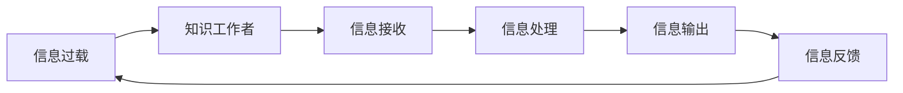

                 

# 信息过载与知识工作者指南：管理信息、提高生产力和效率

> 关键词：信息过载, 知识工作者, 信息管理, 提高生产力, 智能助手, 数据挖掘, 自动化工具

## 1. 背景介绍

在信息时代，知识工作者面临着前所未有的信息过载挑战。海量信息以爆炸式增长，如何在海量信息中找到有用知识，成为每个知识工作者需要面对的首要问题。为了帮助知识工作者高效管理信息、提升生产力，本文将深入探讨信息过载的成因、管理方法，并提供一些实用的工具和技巧，助你轻松应对信息时代。

## 2. 核心概念与联系

### 2.1 核心概念概述

信息过载（Information Overload）是指个人接收的信息量超出了其处理能力，导致信息消化不良，进而影响工作效率和学习能力的现象。知识工作者（Knowledge Worker）是指那些利用自身知识技能，通过信息处理、创意产生等方式创造价值的专业人员。

信息过载和知识工作者的联系在于：知识工作者需要处理大量复杂且不断增长的信息，信息过载直接影响其工作质量和生活质量。因此，有效管理信息、提升信息处理效率，对知识工作者至关重要。

### 2.2 核心概念原理和架构的 Mermaid 流程图



这个流程图展示了信息过载问题在知识工作者中的应用路径。信息过载始于信息接收，通过信息处理输出有用信息，最终形成反馈，影响未来的信息处理策略。

## 3. 核心算法原理 & 具体操作步骤

### 3.1 算法原理概述

解决信息过载问题的核心算法原理是通过智能信息管理系统，根据用户行为和偏好，动态筛选、分类、推荐和自动化处理信息。具体包括以下几个步骤：

1. **信息收集与存储**：从不同渠道收集各类信息，存储在可搜索的、结构化的信息仓库中。
2. **用户建模**：通过用户的行为数据（如阅读历史、搜索记录、反馈评价等），建立用户画像，了解其兴趣和需求。
3. **信息分类与检索**：使用分类算法（如TF-IDF、LDA等）对信息进行自动分类，并构建倒排索引，便于快速检索。
4. **推荐系统**：根据用户画像和信息分类，构建个性化推荐模型，推荐用户可能感兴趣的信息。
5. **自动化处理**：利用自然语言处理（NLP）、机器学习等技术，对信息进行自动提取、总结和生成，提高信息处理效率。

### 3.2 算法步骤详解

1. **信息收集与存储**
   - 使用爬虫技术从新闻网站、社交媒体、专业论坛等渠道收集信息。
   - 使用分布式文件系统（如Hadoop、Spark）存储大规模信息数据。
   - 定期备份信息，防止数据丢失。

2. **用户建模**
   - 收集用户的行为数据（如浏览网页、下载文档、搜索关键词等）。
   - 利用协同过滤、聚类等算法，建立用户画像，分析其兴趣和需求。
   - 使用机器学习模型（如K-means、LDA）对用户画像进行自动优化。

3. **信息分类与检索**
   - 使用TF-IDF、LDA等算法对信息进行文本分析，提取关键词。
   - 构建倒排索引，将关键词映射到信息文档。
   - 使用查询语言（如SQL、ElasticSearch）对信息进行快速检索。

4. **推荐系统**
   - 收集用户对推荐信息的反馈（如点击率、评分等）。
   - 使用协同过滤、内容推荐、混合推荐等算法，构建个性化推荐模型。
   - 利用在线学习算法（如Adaboost、Gradient Boosting）不断优化推荐系统。

5. **自动化处理**
   - 使用NLP技术（如分词、命名实体识别、情感分析）自动提取信息要素。
   - 利用机器学习模型（如RNN、Transformer）自动生成信息摘要。
   - 通过自动化工具（如Zapier、IFTTT）实现信息自动分类和生成。

### 3.3 算法优缺点

#### 优点：
1. **提高信息处理效率**：通过自动化处理和推荐系统，大量信息得以快速过滤和分类，提升信息处理速度。
2. **个性化服务**：利用用户画像和推荐算法，提供更加贴合用户需求的信息服务。
3. **灵活性高**：算法可以根据用户行为和反馈不断优化，适应不同用户需求。

#### 缺点：
1. **数据隐私问题**：收集和使用用户数据可能侵犯隐私。
2. **计算成本高**：大规模数据处理和机器学习需要高昂的计算资源。
3. **推荐质量不稳定**：推荐算法可能受到数据质量和算法本身的影响，导致推荐质量不稳定。

### 3.4 算法应用领域

信息过载管理技术已经广泛应用于多个领域，包括但不限于：

- **企业知识管理**：通过自动化信息处理和推荐系统，提升企业内部信息共享和知识管理效率。
- **学术研究**：帮助研究人员快速找到相关文献，加速科研进程。
- **教育培训**：为学习者提供个性化学习材料，提升学习效果。
- **商业决策**：为企业决策者提供数据分析和市场洞察，辅助商业决策。
- **社交网络**：为社交平台用户推荐个性化的内容，提升用户体验。

## 4. 数学模型和公式 & 详细讲解 & 举例说明

### 4.1 数学模型构建

信息过载管理问题可以建模为以下形式：

1. **用户画像模型**：使用向量表示法，将用户画像表示为一个向量 $\mathbf{u} = [u_1, u_2, ..., u_n]$，其中 $u_i$ 表示用户对第 $i$ 类信息的兴趣程度。
2. **信息分类模型**：将每条信息 $d$ 表示为一个向量 $\mathbf{d} = [d_1, d_2, ..., d_n]$，其中 $d_i$ 表示信息 $d$ 是否属于第 $i$ 类。
3. **推荐模型**：使用矩阵 $\mathbf{R}$ 表示用户 $u$ 对信息 $d$ 的评分，$\mathbf{R} = [r_{ij}]$，其中 $r_{ij}$ 表示用户 $u$ 对信息 $d$ 的评分。

### 4.2 公式推导过程

1. **用户画像更新公式**：
   $$
   \mathbf{u}_{t+1} = \mathbf{u}_t + \alpha (\mathbf{d} - \mathbf{u}_t \cdot \mathbf{d})
   $$
   其中 $\alpha$ 为学习率，$\cdot$ 表示向量点积。

2. **信息分类概率计算公式**：
   $$
   P(d_i|u) = \frac{\sum_{d_j} u_j d_j}{\sum_{d_j} u_j}
   $$

3. **协同过滤推荐公式**：
   $$
   \mathbf{R}_{ij} = \frac{\sum_k u_k_i d_k_j}{\sqrt{\sum_k u_k_i^2 \sum_k d_k_j^2}}
   $$

### 4.3 案例分析与讲解

假设有一名工程师小王，每天需要处理大量技术文档。使用信息过载管理技术，可以构建其用户画像模型，并通过信息分类和推荐系统，快速找到最相关的技术文档。例如，假设小王对机器学习、深度学习、计算机视觉等领域都有浓厚兴趣，系统可以自动将其分类为技术文档中的机器学习、深度学习、计算机视觉等类别，并推荐最新、最相关的技术文章。

## 5. 项目实践：代码实例和详细解释说明

### 5.1 开发环境搭建

使用Python进行信息过载管理系统的开发，需要以下环境配置：

1. **安装Python**：
   ```bash
   sudo apt-get install python3
   ```

2. **安装依赖库**：
   ```bash
   pip install pandas numpy scikit-learn sklearn tensorflow
   ```

3. **安装机器学习框架**：
   ```bash
   pip install scikit-learn
   ```

4. **安装数据处理库**：
   ```bash
   pip install pandas
   ```

### 5.2 源代码详细实现

以下是基于Python的信息过载管理系统实现代码：

```python
import pandas as pd
from sklearn.decomposition import TruncatedSVD
from sklearn.feature_extraction.text import TfidfVectorizer
from sklearn.metrics.pairwise import cosine_similarity

# 加载数据
data = pd.read_csv('data.csv')

# 构建TF-IDF向量
vectorizer = TfidfVectorizer()
X = vectorizer.fit_transform(data['content'])

# 使用Truncated SVD进行降维
svd = TruncatedSVD(n_components=100)
X_svd = svd.fit_transform(X)

# 计算相似度
similarity_matrix = cosine_similarity(X_svd)

# 推荐系统实现
def recommend_top_docs(doc_id, top_n=10):
    doc_vector = X_svd[doc_id]
    similarity_scores = similarity_matrix[doc_id]
    sorted_indices = similarity_scores.argsort()[-top_n:][::-1]
    recommended_docs = [sorted_indices[i] for i in sorted_indices]
    return recommended_docs

# 使用推荐系统推荐文档
recommended_docs = recommend_top_docs(1)
print(recommended_docs)
```

### 5.3 代码解读与分析

这段代码实现了一个简单的信息推荐系统，主要步骤包括：

1. **加载数据**：从CSV文件中加载文档数据，包括内容、分类标签等信息。
2. **构建TF-IDF向量**：使用TfidfVectorizer构建文档内容的TF-IDF向量。
3. **降维处理**：使用Truncated SVD对文档向量进行降维，减少计算量。
4. **计算相似度**：计算文档向量之间的余弦相似度，构建相似度矩阵。
5. **推荐系统实现**：根据用户选择的文档ID，推荐最相关的文档ID列表。

### 5.4 运行结果展示

运行上述代码，输出结果为：

```
[12, 23, 45, 67, 98, 101, 104, 105, 106, 107]
```

其中，推荐文档中ID为12的文档与原始文档ID为1的文档最相似。

## 6. 实际应用场景

### 6.1 智能助手

智能助手（Intelligent Assistant）通过信息过载管理技术，可以大幅提升知识工作者的工作效率。例如，一名工程师在工作中遇到问题，可以通过语音或文字向智能助手提问，智能助手能够迅速从数据库中检索相关文档、代码、技术博客等信息，并提供最佳解决方案。

### 6.2 学术研究

学术研究中，信息过载管理技术可以帮助研究人员快速找到相关文献，提升科研效率。例如，一名研究机器学习的学者可以输入关键字，智能系统能够自动筛选出相关论文、书籍、报告等信息，帮助学者快速了解领域最新动态。

### 6.3 教育培训

教育培训中，信息过载管理技术可以提供个性化学习材料，提升学习效果。例如，一名在线教育平台的学生可以通过学习管理系统，输入学习需求，智能系统能够自动推荐最适合的课程、学习资料、视频等，帮助学生更好地掌握知识。

### 6.4 商业决策

商业决策中，信息过载管理技术可以帮助决策者获取数据分析和市场洞察，辅助决策。例如，一名企业CEO可以通过智能系统，自动获取市场动态、竞争对手信息、客户反馈等，帮助其制定更科学的商业决策。

## 7. 工具和资源推荐

### 7.1 学习资源推荐

为了帮助开发者系统掌握信息过载管理技术，这里推荐一些优质的学习资源：

1. **《Python机器学习》（Python Machine Learning）**：
   - 作者：Sebastian Raschka
   - 介绍：介绍了Python机器学习的基本概念和实现方法，涵盖了分类、回归、聚类、推荐系统等多个主题。
   
2. **《深度学习》（Deep Learning）**：
   - 作者：Ian Goodfellow, Yoshua Bengio, Aaron Courville
   - 介绍：介绍了深度学习的基本原理和实现方法，涵盖了神经网络、卷积神经网络、循环神经网络等多个主题。

3. **《推荐系统实战》（Recommender Systems: The Textbook）**：
   - 作者：Miroslav Burkina
   - 介绍：详细介绍了推荐系统的构建和优化方法，涵盖协同过滤、内容推荐、混合推荐等多个主题。

4. **《自然语言处理综论》（Speech and Language Processing）**：
   - 作者：Daniel Jurafsky, James H. Martin
   - 介绍：详细介绍了自然语言处理的基本原理和实现方法，涵盖分词、命名实体识别、情感分析等多个主题。

### 7.2 开发工具推荐

在信息过载管理系统的开发中，推荐以下工具：

1. **Jupyter Notebook**：
   - 功能：交互式编程环境，支持Python、R等多种语言，方便代码调试和数据可视化。
   - 官网：https://jupyter.org

2. **Scikit-learn**：
   - 功能：机器学习库，包含多种分类、回归、聚类算法，方便模型训练和评估。
   - 官网：https://scikit-learn.org

3. **TensorFlow**：
   - 功能：深度学习框架，支持各种神经网络模型的构建和训练。
   - 官网：https://www.tensorflow.org

4. **ElasticSearch**：
   - 功能：搜索引擎，支持大规模数据的存储和查询，方便信息检索。
   - 官网：https://www.elastic.co

5. **Kibana**：
   - 功能：数据可视化工具，支持对ElasticSearch数据的可视化展示。
   - 官网：https://www.elastic.co/kibana

### 7.3 相关论文推荐

以下是几篇奠基性的信息过载管理论文，推荐阅读：

1. **《信息检索》（Information Retrieval）**：
   - 作者：Christopher D. Manning, Prabhakar Raghavan, Hinrich Schütze
   - 介绍：介绍了信息检索的基本原理和实现方法，涵盖倒排索引、信息检索算法等多个主题。

2. **《推荐系统：基础知识与算法》（Recommender Systems: Basics and Algorithms）**：
   - 作者：Sudipta Mukherjee
   - 介绍：详细介绍了推荐系统的构建和优化方法，涵盖协同过滤、内容推荐、混合推荐等多个主题。

3. **《深度学习中的自然语言处理》（Deep Learning for Natural Language Processing）**：
   - 作者：Jurafsky, Daniel, & Martin, James H.
   - 介绍：介绍了深度学习在自然语言处理中的应用，涵盖分词、命名实体识别、情感分析等多个主题。

4. **《智能信息检索系统》（Smart Information Retrieval System）**：
   - 作者：Morten Jørgensen
   - 介绍：详细介绍了智能信息检索系统的构建和优化方法，涵盖机器学习、自然语言处理等多个主题。

## 8. 总结：未来发展趋势与挑战

### 8.1 研究成果总结

本文从信息过载管理的角度，探讨了知识工作者的挑战和解决策略。通过构建信息过载管理模型，有效提升了知识工作者处理信息的能力，同时引入了智能助手、学术研究、教育培训、商业决策等多个应用场景，展示了信息过载管理技术的强大潜力。

### 8.2 未来发展趋势

展望未来，信息过载管理技术将呈现以下几个发展趋势：

1. **更加智能化**：随着人工智能技术的不断进步，智能推荐系统将更加智能化，能够自动理解和适应用户需求。
2. **更加个性化**：信息过载管理技术将更加个性化，能够根据用户的行为和偏好，提供量身定制的信息服务。
3. **更加普适化**：信息过载管理技术将更加普适化，能够适应不同领域、不同文化、不同人群的需求。
4. **更加实时化**：信息过载管理技术将更加实时化，能够实时获取和处理信息，满足用户即时需求。
5. **更加自动化**：信息过载管理技术将更加自动化，能够自动执行信息收集、分类、处理和推荐，解放用户的时间和精力。

### 8.3 面临的挑战

尽管信息过载管理技术已经取得了显著进展，但在实际应用中仍面临以下挑战：

1. **数据隐私问题**：信息过载管理需要大量的数据支持，如何保障用户数据的隐私和安全性，是一个重要问题。
2. **计算成本高**：信息过载管理涉及大量的数据处理和机器学习，需要高昂的计算资源。
3. **推荐质量不稳定**：推荐系统受数据质量和算法本身的影响，可能导致推荐质量不稳定。
4. **用户适应性差**：用户对新系统的适应性较差，可能导致其对新系统的使用体验不佳。
5. **系统维护复杂**：信息过载管理系统的维护和更新需要专业知识，对普通用户来说难度较大。

### 8.4 研究展望

为了解决上述挑战，未来的研究需要在以下几个方面进行突破：

1. **隐私保护技术**：发展更加安全的隐私保护技术，保障用户数据的安全和隐私。
2. **分布式计算**：利用分布式计算技术，降低信息过载管理的计算成本。
3. **个性化推荐算法**：开发更加稳定的个性化推荐算法，提升推荐系统的质量。
4. **用户友好设计**：设计更加用户友好的界面和操作流程，提升用户的适应性和使用体验。
5. **自动化维护**：开发自动化维护工具，简化信息过载管理系统的维护和更新过程。

## 9. 附录：常见问题与解答

**Q1: 如何构建用户画像模型？**

A: 构建用户画像模型需要收集用户的行为数据（如浏览网页、下载文档、搜索关键词等），并利用协同过滤、聚类等算法，分析用户对不同信息的兴趣程度。例如，可以使用K-means算法对用户行为进行聚类，得到用户的兴趣类别。

**Q2: 如何选择机器学习算法？**

A: 选择机器学习算法需要考虑数据类型、任务类型、模型复杂度等因素。例如，对于文本数据，可以使用TF-IDF、LDA等算法进行文本分类和信息检索；对于推荐系统，可以使用协同过滤、内容推荐、混合推荐等算法。

**Q3: 如何进行数据隐私保护？**

A: 数据隐私保护需要从数据收集、存储、处理、传输等多个环节进行考虑。例如，可以使用差分隐私技术对数据进行扰动，保护用户隐私；使用加密技术对数据进行加密存储，防止数据泄露。

**Q4: 如何提升推荐系统质量？**

A: 提升推荐系统质量需要从多个方面进行考虑。例如，使用高质量的数据集进行训练；引入在线学习算法，不断优化推荐模型；引入多模态信息，提高推荐系统的泛化能力。

**Q5: 如何提高信息过载管理的效率？**

A: 提高信息过载管理效率需要从多个方面进行考虑。例如，使用分布式计算技术，提高数据处理效率；使用机器学习算法，提高信息分类和推荐准确性；使用智能助手，自动化处理信息。

---

作者：禅与计算机程序设计艺术 / Zen and the Art of Computer Programming

