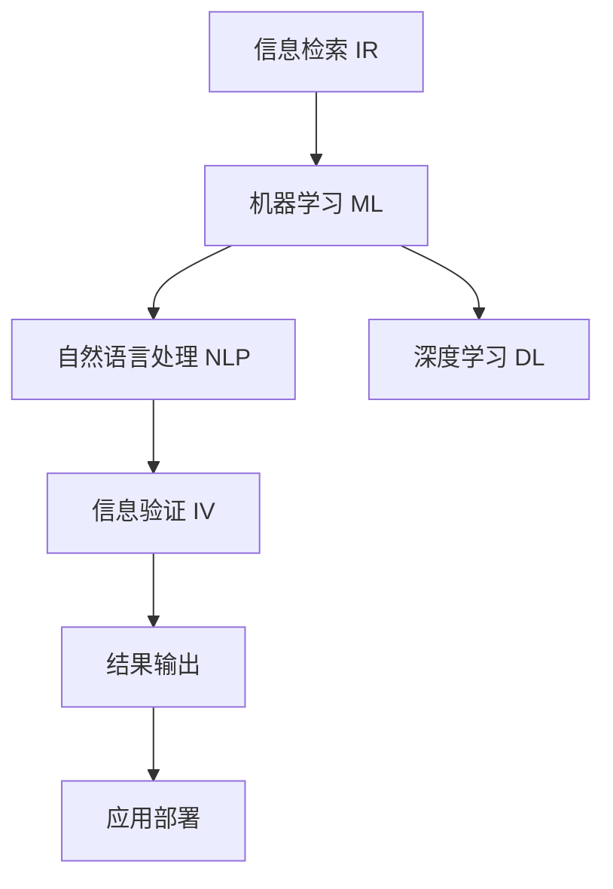

                 

# 信息验证和信息搜索技术指南：在信息海洋中找到可靠、相关的信息

## 1. 背景介绍

### 1.1 问题由来
在当今信息爆炸的时代，如何从海量的互联网信息中找到可靠、相关的资料，成为了我们面对的一项重要挑战。从搜索引擎的搜索结果中筛选出有用信息，需要耗费大量的时间和精力。同时，信息真伪难辨、内容质量参差不齐，也使得信息的验证工作变得尤为关键。

现代信息技术的发展，尤其是自然语言处理和机器学习的进步，为我们提供了新的工具和方法来解决这些信息检索和验证的难题。通过智能化的信息搜索与验证技术，我们可以显著提高信息检索的效率和准确性，提升信息质量。

### 1.2 问题核心关键点
信息检索和验证的核心问题主要包括：
- 如何在信息海洋中高效地找到相关度高的信息？
- 如何验证找到的信息的准确性和可靠性？
- 如何在大量搜索结果中自动筛选出高质量内容？
- 如何识别和排除低质量、错误、伪造的信息？

这些问题既是人工智能研究的重要方向，也是信息科学和技术发展的关键需求。

## 2. 核心概念与联系

### 2.1 核心概念概述

信息检索和验证技术主要包括以下几个核心概念：

- **信息检索 (Information Retrieval, IR)**：通过计算机算法，根据用户输入的查询词，从大量文本资料中提取出与查询匹配度高的相关信息。
- **信息验证 (Information Verification)**：对检索出的信息进行真实性、准确性、可信度的判定，确保信息的可靠性。
- **机器学习 (Machine Learning, ML)**：利用数据训练模型，使其能够自动地从数据中学习特征，并用于信息检索和验证的各个环节。
- **自然语言处理 (Natural Language Processing, NLP)**：使计算机能够理解、处理和生成自然语言，以支持信息检索和验证任务。
- **深度学习 (Deep Learning, DL)**：利用多层神经网络模型，从数据中提取高级语义特征，提升信息检索和验证的精度。

这些概念之间的逻辑关系可以通过以下Mermaid流程图来展示：



## 3. 核心算法原理 & 具体操作步骤
### 3.1 算法原理概述

信息检索和验证技术的核心算法原理基于以下三个主要步骤：

1. **文本表示与匹配**：将查询和文本数据转换为计算机能够理解的向量表示，计算查询与文本的匹配度，从而提取出相关度高的信息。
2. **模型训练与调优**：通过机器学习模型，对文本表示和匹配算法进行训练和优化，提升检索和验证的准确率。
3. **信息过滤与验证**：对检索结果进行过滤和验证，排除低质量、错误的信息，确保结果的可靠性。

这些步骤共同构成了信息检索和验证的核心算法框架，其具体的实现方式和算法模型在不同场景下有所不同。

### 3.2 算法步骤详解

以下是对信息检索和验证算法的一般步骤详解：

**Step 1: 准备数据集**
- 收集标注数据集，如问答对、新闻文章、技术文档等。
- 进行数据清洗和预处理，去除噪声和无关信息。

**Step 2: 设计查询处理流程**
- 设计查询处理模块，解析用户输入的查询词，进行分词、词性标注、实体识别等预处理。
- 选择合适的向量表示方法，如TF-IDF、Word2Vec、BERT等。

**Step 3: 训练文本表示模型**
- 使用机器学习算法对文本表示模型进行训练，优化文本与查询的匹配度。
- 调整模型的超参数，如学习率、迭代次数等。

**Step 4: 验证检索结果**
- 对检索出的结果进行可信度评估，如使用文本分类、实体识别等方法。
- 排除低可信度信息，保留高质量内容。

**Step 5: 输出与反馈**
- 根据用户需求，输出相关信息。
- 收集用户反馈，用于持续优化模型和算法。

### 3.3 算法优缺点

信息检索和验证算法具有以下优点：
1. 高效性：能够快速处理大量文本数据，实现实时检索和验证。
2. 准确性：通过机器学习和深度学习模型，显著提升检索和验证的准确率。
3. 可扩展性：适应不同领域和应用场景，具备良好的灵活性。
4. 自适应性：能够根据用户反馈和实际需求进行调整和优化。

同时，这些算法也存在一些局限性：
1. 数据依赖性强：需要大量高质量标注数据进行模型训练，获取标注数据成本较高。
2. 模型复杂度高：深度学习模型的计算复杂度较高，对硬件资源要求较高。
3. 结果依赖性：最终结果质量高度依赖于模型的训练效果和数据质量。
4. 安全性问题：未经审核的机器学习模型可能产生误判，对敏感信息处理不当。

尽管存在这些局限性，但信息检索和验证技术在处理海量信息时显示出其不可替代的优势。通过不断优化和改进算法，可以进一步提高信息检索和验证的性能和效率。

### 3.4 算法应用领域

信息检索和验证技术在多个领域都具有广泛的应用前景：

- **学术研究**：用于文献检索、学术数据库、知识图谱等。
- **互联网搜索**：如搜索引擎的个性化推荐、搜索结果排序等。
- **医疗健康**：用于医学文献检索、临床指南、患者咨询等。
- **电子商务**：用于商品推荐、广告定向、用户画像等。
- **新闻媒体**：用于新闻文本的实时分析、舆情监测、信息审核等。

这些应用场景展示了信息检索和验证技术的广泛应用价值。

## 4. 数学模型和公式 & 详细讲解
### 4.1 数学模型构建

信息检索和验证的核心数学模型主要包括以下几个方面：

- **文本向量表示模型**：将查询和文本转换为向量表示，便于计算匹配度。
- **文本分类模型**：用于评估检索结果的可靠性和准确性。
- **深度学习模型**：用于提取和融合高级语义特征，提升检索和验证效果。

以下是对这些模型的详细讲解。

**查询-文本匹配模型**
假设查询 $q$ 和文本 $d$ 分别表示为词向量 $q = \langle q_1, q_2, \ldots, q_n \rangle$ 和 $d = \langle d_1, d_2, \ldots, d_n \rangle$，文本匹配模型可以表示为：

$$
sim(q, d) = \cos \theta(q, d) = \frac{\langle q, d \rangle}{\|q\|\|d\|}
$$

其中，$\langle q, d \rangle$ 表示查询和文本的内积，$\|q\|$ 和 $\|d\|$ 表示查询和文本的向量范数。

**文本分类模型**
假设文本 $d$ 表示为词向量 $d = \langle d_1, d_2, \ldots, d_n \rangle$，使用逻辑回归模型进行分类，其损失函数可以表示为：

$$
\mathcal{L}(w) = -\frac{1}{N} \sum_{i=1}^N [y_i \log p(d_i|w) + (1-y_i) \log (1-p(d_i|w))]
$$

其中，$w$ 为模型参数，$N$ 为样本数，$y_i$ 为标签，$p(d_i|w)$ 为模型对样本 $d_i$ 属于正类的概率。

**深度学习模型**
假设使用BERT模型进行文本表示，其输入表示为 $x$，输出表示为 $h = [CLS] \lVert \text{BERT}(x)$，输出层为 $o = \text{Softmax}(h)$，其训练损失函数可以表示为：

$$
\mathcal{L}(w) = -\frac{1}{N} \sum_{i=1}^N \log p(y_i|o)
$$

其中，$w$ 为BERT模型参数，$N$ 为样本数，$y_i$ 为标签，$p(y_i|o)$ 为模型对标签 $y_i$ 的概率。

### 4.2 公式推导过程

- **文本向量表示模型推导**：
  - 查询-文本匹配模型：利用向量内积计算查询和文本的匹配度。
  - 文本分类模型：利用逻辑回归模型计算文本属于正类的概率。
  - 深度学习模型：利用BERT模型的表示能力，提取高级语义特征。

- **查询处理流程推导**：
  - 分词和词性标注：将查询和文本分解为词汇单元，并进行词性标注。
  - 实体识别：利用命名实体识别模型，提取文本中的实体信息。
  - 向量表示：利用词向量模型将查询和文本转换为向量表示。

### 4.3 案例分析与讲解

以下以医疗领域的信息检索和验证为例，展示信息检索和验证技术的实际应用：

**案例背景**：医院需要快速检索临床研究论文、诊疗指南等资料，以辅助医生诊断和治疗。

**案例处理流程**：
1. 数据准备：收集临床研究论文、诊疗指南等医疗文献，进行清洗和预处理。
2. 查询处理：用户输入查询词，如“肺癌治疗指南”，系统进行分词、词性标注和实体识别，得到查询向量。
3. 检索结果：利用文本匹配模型，从数据库中检索出相关度高的文本，如“肺癌治疗指南”相关的研究论文。
4. 信息验证：对检索结果进行可信度评估，如利用文本分类模型判断文本是否来自权威期刊，利用实体识别模型检测文本中是否有误导性信息。
5. 结果输出：输出可信度高的文本，提供给医生参考。

## 5. 项目实践：代码实例和详细解释说明
### 5.1 开发环境搭建

在进行信息检索和验证项目开发前，我们需要准备好开发环境。以下是使用Python进行项目开发的典型环境配置流程：

1. 安装Anaconda：从官网下载并安装Anaconda，用于创建独立的Python环境。
2. 创建并激活虚拟环境：
```bash
conda create -n info-env python=3.8 
conda activate info-env
```
3. 安装必要的库：
```bash
pip install scikit-learn spacy transformers pytorch nltk
```
4. 下载预训练模型：
```bash
python -m spacy download en_core_web_lg
```

### 5.2 源代码详细实现

以下是一个简化的Python代码示例，展示如何利用BERT模型进行信息检索和验证：

```python
import torch
from transformers import BertTokenizer, BertModel, BertForSequenceClassification

# 初始化模型和分词器
tokenizer = BertTokenizer.from_pretrained('bert-base-uncased')
model = BertModel.from_pretrained('bert-base-uncased')
classifier = BertForSequenceClassification.from_pretrained('bert-base-uncased', num_labels=2)

# 定义查询处理函数
def preprocess_query(query):
    query_tokens = tokenizer.tokenize(query, return_tensors='pt')
    query_vector = model(query_tokens)[0]
    return query_vector

# 定义检索函数
def retrieve_documents(query_vector, docs):
    doc_vectors = [preprocess_doc(doc) for doc in docs]
    cosine_similarities = torch.cosine_similarity(query_vector, doc_vectors)
    doc_ids = torch.argsort(cosine_similarities, descending=True)[0]
    return [docs[i] for i in doc_ids]

# 定义信息验证函数
def verify_documents(docs):
    for doc in docs:
        doc_tokens = tokenizer.tokenize(doc, return_tensors='pt')
        doc_vector = model(doc_tokens)[0]
        classification = classifier(doc_vector)
        if classification > 0.5:
            return True
    return False

# 查询与检索
query = "医疗知识库"
documents = ['医生指南', '患者手册', '药物副作用', '临床研究']
query_vector = preprocess_query(query)
retrieved_docs = retrieve_documents(query_vector, documents)

# 验证与输出
if verify_documents(retrieved_docs):
    print(f"找到相关文档: {', '.join(retrieved_docs)}")
else:
    print("未找到相关文档")
```

### 5.3 代码解读与分析

**查询处理函数**：
- `preprocess_query(query)`：将查询词分词、转换为向量表示，用于计算文本匹配度。

**检索函数**：
- `retrieve_documents(query_vector, docs)`：对文档向量进行匹配度计算，返回匹配度最高的文档。

**信息验证函数**：
- `verify_documents(docs)`：对文档进行分类判断，排除低可信度文档，保留高质量内容。

**查询与检索流程**：
- 输入查询词，调用查询处理函数进行预处理，得到查询向量。
- 调用检索函数，根据查询向量和文档向量计算匹配度，返回相关度高的文档。
- 调用信息验证函数，对检索结果进行可信度评估，排除低质量文档，输出最终结果。

## 6. 实际应用场景
### 6.1 医疗健康

信息检索和验证技术在医疗健康领域具有广泛的应用前景。医生需要快速检索相关文献、指南和专家意见，以便做出更准确的诊断和治疗决策。通过信息检索和验证技术，可以快速找到权威、可靠的医学资料，提高医疗质量。

### 6.2 电子商务

在电子商务领域，信息检索和验证技术用于商品推荐、广告定向、用户画像等。根据用户查询词，自动检索相关商品和信息，提升用户体验和交易转化率。同时，对商品信息和广告进行真实性、可信度验证，避免误导消费者。

### 6.3 新闻媒体

新闻媒体行业需要处理大量信息，快速响应公众需求。通过信息检索和验证技术，能够快速从海量新闻中找到相关内容，提升新闻的时效性和准确性。同时，对新闻进行可信度评估，避免假新闻和虚假信息的传播。

### 6.4 未来应用展望

随着信息检索和验证技术的不断发展，未来的应用场景将会更加广泛，涵盖更多领域和场景。

在智慧城市治理中，信息检索和验证技术用于城市事件监测、舆情分析、应急指挥等环节，提高城市管理的自动化和智能化水平。在智慧教育领域，用于智能推荐、学情分析、知识推荐等，提升教育质量和学习效果。

此外，随着多模态信息处理技术的成熟，信息检索和验证技术还将拓展到图像、视频、语音等多个领域，实现视觉、语音等多模态信息的协同检索和验证。

## 7. 工具和资源推荐
### 7.1 学习资源推荐

为了帮助开发者系统掌握信息检索和验证的理论基础和实践技巧，这里推荐一些优质的学习资源：

1. 《自然语言处理综述》（LingPipe Book）：系统介绍NLP的基本概念和算法，适合入门和进阶阅读。
2. 《深度学习与自然语言处理》（Deep Learning with Python）：使用深度学习模型进行NLP任务开发，适合实践和应用。
3. 《信息检索导论》（Introduction to Information Retrieval）：详细介绍IR的基本概念、算法和应用，适合深入学习。
4. 《自然语言处理》（Natural Language Processing）：麻省理工学院开设的NLP在线课程，涵盖多个NLP核心任务，适合系统学习。
5. 《数据科学与数据工程》（Data Science and Data Engineering）：斯坦福大学开设的OMSA课程，涵盖数据处理和工程实践，适合动手实践。

### 7.2 开发工具推荐

信息检索和验证技术的开发离不开高效的工具支持。以下是几款常用的开发工具：

1. Jupyter Notebook：用于编写和分享Python代码，支持代码运行和可视化输出。
2. PyTorch：基于Python的深度学习框架，灵活便捷，支持GPU加速。
3. TensorFlow：谷歌开源的深度学习框架，支持分布式计算和模型优化。
4. NLTK：Python自然语言处理库，提供丰富的语言处理工具和算法。
5. SpaCy：Python自然语言处理库，提供高性能的分词和词性标注功能。

### 7.3 相关论文推荐

信息检索和验证技术的发展得益于学界持续的研究和创新。以下是几篇奠基性的相关论文，推荐阅读：

1. R. Baeza-Yates和B. Ribeiro-Neto的《信息检索导论》（Introduction to Information Retrieval），是IR领域的经典教材。
2. R. Collobert等人的《自然语言处理综述》（Natural Language Processing），系统介绍NLP的基本概念和算法。
3. K. McKeown的《自然语言处理综述》（Natural Language Processing），涵盖NLP的多个核心任务和算法。
4. M. Pereira和G. Widmer的《信息检索导论》（Introduction to Information Retrieval），详细介绍IR的基本概念和算法。
5. Y. Bengio等人的《深度学习综述》（Deep Learning），涵盖深度学习的基本概念和算法，对信息检索和验证有重要参考价值。

## 8. 总结：未来发展趋势与挑战
### 8.1 研究成果总结

信息检索和验证技术已经在多个领域取得了显著成果，展示了其在处理海量信息时的巨大潜力和应用价值。通过高效的信息检索和验证，能够在短时间内找到可靠、相关的信息，提升信息处理效率和准确性。

### 8.2 未来发展趋势

展望未来，信息检索和验证技术将呈现以下几个发展趋势：

1. 多模态信息检索：拓展到图像、视频、语音等多模态数据，实现多模态信息的协同检索和验证。
2. 实时检索与验证：利用自然语言处理和深度学习技术，实现实时信息检索和验证，提升信息处理的效率和准确性。
3. 智能推荐与个性化：结合用户行为和兴趣数据，实现智能推荐和个性化服务，提升用户体验。
4. 跨语言与跨领域：支持多语言和跨领域的信息检索和验证，提升国际化和多领域的竞争力。
5. 安全与隐私：加强信息检索和验证的安全性和隐私保护，防止误导和滥用。

### 8.3 面临的挑战

尽管信息检索和验证技术已经取得了诸多进展，但仍然面临一些挑战：

1. 数据依赖性强：高质量标注数据的获取成本较高，且数据分布可能不均衡，影响模型的性能。
2. 模型复杂度高：深度学习模型的计算复杂度较高，硬件资源要求较高，难以在资源受限的环境中运行。
3. 结果依赖性：最终结果的质量高度依赖于模型的训练效果和数据质量，存在一定的不确定性。
4. 安全性问题：未经审核的模型可能产生误判，对敏感信息处理不当，带来安全风险。
5. 隐私保护：如何保护用户隐私和数据安全，防止信息滥用，是未来需要重点关注的问题。

### 8.4 研究展望

为了解决这些挑战，未来的研究需要在以下几个方面寻求新的突破：

1. 无监督和半监督学习：探索在无标注数据上训练模型，减少对标注数据的依赖，提升模型的泛化能力。
2. 跨领域迁移学习：研究如何将模型在不同领域间迁移应用，提升模型的适应性和泛化能力。
3. 数据增强技术：通过数据增强技术，扩充数据集，提升模型在低资源环境下的性能。
4. 深度学习优化：开发更高效的深度学习模型和算法，降低计算复杂度，提升模型性能。
5. 安全与隐私保护：研究如何加强模型安全性，保护用户隐私和数据安全，防止信息滥用。

## 9. 附录：常见问题与解答

**Q1：如何提高信息检索和验证的效率？**

A: 提高信息检索和验证效率的常用方法包括：
1. 预处理：对查询和文档进行预处理，去除噪声和无关信息，提升匹配度。
2. 多级索引：建立多级索引结构，提高检索效率。
3. 缓存机制：利用缓存机制，提高检索速度。
4. 分布式计算：利用分布式计算技术，提升信息检索和验证的效率。

**Q2：如何保证信息检索和验证的准确性？**

A: 保证信息检索和验证准确性的常用方法包括：
1. 数据质量：使用高质量标注数据进行模型训练，提升模型的准确性。
2. 模型选择：选择合适的算法和模型，优化匹配度和分类效果。
3. 多模型集成：通过多个模型的集成，提升信息检索和验证的准确性。
4. 人工审核：结合人工审核，验证模型的准确性。

**Q3：信息检索和验证技术有哪些应用场景？**

A: 信息检索和验证技术的应用场景包括：
1. 医疗健康：用于医学文献检索、诊疗指南、患者咨询等。
2. 电子商务：用于商品推荐、广告定向、用户画像等。
3. 新闻媒体：用于新闻文本的实时分析、舆情监测、信息审核等。
4. 智慧城市：用于城市事件监测、应急指挥、智能交通等。
5. 智慧教育：用于智能推荐、学情分析、知识推荐等。

**Q4：信息检索和验证技术的未来发展方向是什么？**

A: 信息检索和验证技术的未来发展方向包括：
1. 多模态信息检索：拓展到图像、视频、语音等多模态数据，实现多模态信息的协同检索和验证。
2. 实时检索与验证：利用自然语言处理和深度学习技术，实现实时信息检索和验证，提升信息处理的效率和准确性。
3. 智能推荐与个性化：结合用户行为和兴趣数据，实现智能推荐和个性化服务，提升用户体验。
4. 跨语言与跨领域：支持多语言和跨领域的信息检索和验证，提升国际化和多领域的竞争力。
5. 安全与隐私保护：加强信息检索和验证的安全性和隐私保护，防止误导和滥用。

---

作者：禅与计算机程序设计艺术 / Zen and the Art of Computer Programming

