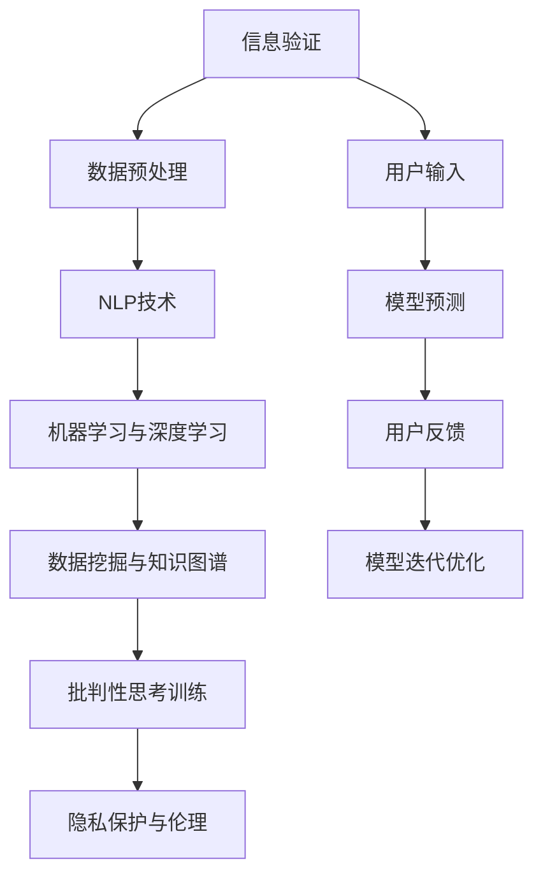

                 

## 1. 背景介绍

### 1.1 问题由来
在当今信息爆炸的时代，假新闻和媒体操纵现象日益猖獗，对社会秩序和公共信任造成了严重冲击。人们获取信息的渠道越来越丰富，但信息质量却参差不齐，误导性信息、偏见和假新闻随处可见。虚假信息的泛滥不仅导致公众的认知扭曲，还可能对政治、经济、社会稳定等产生深远影响。

### 1.2 问题核心关键点
本问题的核心在于：如何构建一个能够验证信息的真实性，并提供批判性思考的工具，以帮助人们在真假难辨的信息海洋中游刃有余。这不仅涉及到信息科学和计算技术，还需要社会学、心理学、伦理学等多学科的交叉融合。

### 1.3 问题研究意义
构建一个信息验证和批判性思考的工具，对个人、组织乃至整个社会都有着重要意义：

1. **提升信息素养**：帮助公众辨别信息真伪，培养批判性思维，避免被误导。
2. **维护公共利益**：防止假新闻和恶意信息对社会秩序的破坏，保护公众权益。
3. **增强媒体透明度**：推动媒体自律，提高信息传播的透明度和可信度。
4. **促进民主参与**：通过真实可靠的信息，保障公民在政治、社会事务中的参与度。
5. **助力创新发展**：为科技公司、新闻机构、研究机构等提供有力工具，推动信息传播和内容创作的技术进步。

## 2. 核心概念与联系

### 2.1 核心概念概述

要构建一个信息验证和媒体批判性思考的工具，首先需要理解以下核心概念：

- **信息验证**：通过技术手段识别并证明信息来源的真实性，确保信息的可信度。
- **媒体批判性思考**：训练用户对信息进行批判性分析和评价，理解信息的背景、意图和潜在偏见。
- **自然语言处理(NLP)**：利用机器学习技术处理和分析人类语言，以实现信息验证和批判性思考。
- **机器学习与深度学习**：基于大量数据训练模型，使其具备信息验证和批判性分析的能力。
- **数据挖掘与知识图谱**：从大量数据中挖掘出有价值的信息，建立知识网络，辅助信息验证和批判性思考。
- **隐私保护与伦理**：在信息验证过程中，注重保护用户隐私，避免滥用数据。

这些概念之间相互联系，共同构成了信息验证和媒体批判性思考的基础。

### 2.2 核心概念原理和架构的 Mermaid 流程图(Mermaid 流程节点中不要有括号、逗号等特殊字符)



这个流程图展示了信息验证和批判性思考从用户输入到模型预测，再到用户反馈和模型迭代的整体流程。各环节通过技术手段实现信息的筛选、分析和验证，帮助用户理解信息背后的真实性和意图。

## 3. 核心算法原理 & 具体操作步骤
### 3.1 算法原理概述

信息验证和媒体批判性思考的核心算法基于自然语言处理和机器学习技术。主要原理如下：

- **数据预处理**：清洗、标注数据集，为模型训练提供高质量的训练样本。
- **NLP技术**：通过文本分类、实体识别、情感分析等技术，提取信息的关键特征。
- **机器学习与深度学习**：利用监督学习、半监督学习、无监督学习等方法，训练模型进行信息验证和批判性思考。
- **数据挖掘与知识图谱**：从大量数据中挖掘出相关知识，构建知识图谱，辅助信息的深度分析和推理。
- **用户交互**：提供可视化界面和交互机制，让用户能够参与信息验证和批判性思考的过程。

### 3.2 算法步骤详解

构建信息验证和媒体批判性思考工具，一般包括以下几个关键步骤：

**Step 1: 数据收集与预处理**
- 收集可信的新闻、文章、社交媒体帖子等数据，并进行清洗和标注。
- 使用自然语言处理技术进行文本分割、分词、命名实体识别、情感分析等处理，提取关键特征。
- 根据任务需求，选择合适的标注方式，如二分类、多分类、序列标注等。

**Step 2: 模型训练与验证**
- 选择合适的算法模型，如BERT、GPT等，进行监督学习或无监督学习。
- 使用数据集进行模型训练，调整超参数，选择适合的损失函数。
- 在验证集上评估模型性能，使用交叉验证、学习曲线等方法进行调优。

**Step 3: 模型部署与优化**
- 将训练好的模型部署到服务器或云平台，提供API接口供用户调用。
- 持续收集用户反馈，优化模型性能，提升信息验证和批判性思考的准确性。
- 使用A/B测试等方法，比较不同模型的效果，选择最优模型。

**Step 4: 用户交互与反馈**
- 提供直观易用的用户界面，允许用户输入信息并获取模型预测。
- 展示信息验证结果，提供批判性思考的证据和理由。
- 收集用户反馈，用于模型迭代和改进。

### 3.3 算法优缺点

构建信息验证和媒体批判性思考工具，具有以下优点：

- **高效性**：利用自动化技术，可以快速处理大量信息，提高验证和分析效率。
- **广泛适用性**：适用于各类信息验证和批判性思考任务，如新闻验证、社交媒体分析、产品评价等。
- **动态优化**：通过持续收集用户反馈，模型能够不断学习和优化，适应新的信息需求。

但同时，也存在一些局限性：

- **数据依赖**：模型的性能依赖于训练数据的数量和质量，需要大量的标注数据。
- **模型复杂性**：复杂的模型结构可能增加计算成本和资源消耗。
- **偏见和误判**：模型可能带有训练数据中的偏见，导致误判和错误信息验证。
- **隐私保护**：处理大量用户数据时，需要严格保护用户隐私，避免数据滥用。

### 3.4 算法应用领域

构建的信息验证和媒体批判性思考工具，可以在多个领域得到广泛应用：

- **新闻媒体**：帮助新闻机构验证信息来源，提高新闻质量。
- **社交媒体**：识别和标记假新闻和恶意信息，维护网络安全。
- **教育培训**：用于提升学生的媒体素养和信息辨别能力。
- **商业决策**：辅助企业进行市场分析，避免因假信息导致的决策错误。
- **公共政策**：帮助政府机构评估和验证政策信息的真实性，支持政策制定。

## 4. 数学模型和公式 & 详细讲解 & 举例说明（备注：数学公式请使用latex格式，latex嵌入文中独立段落使用 $$，段落内使用 $)
### 4.1 数学模型构建

构建信息验证和媒体批判性思考工具，涉及多个数学模型和算法。以下是对其中几个关键模型的详细介绍：

**文本分类模型**
- **输入**：原始文本 $x$，长度为 $n$。
- **特征表示**：使用词向量表示每个单词，组成特征向量 $x \in \mathbb{R}^d$。
- **模型**：选择适合的任务模型，如支持向量机(SVM)、朴素贝叶斯(Naive Bayes)、逻辑回归(Logistic Regression)等。
- **输出**：信息真实性判断，二分类结果 $y \in \{0, 1\}$。

**实体识别模型**
- **输入**：原始文本 $x$，长度为 $n$。
- **特征表示**：使用词向量表示每个单词，组成特征向量 $x \in \mathbb{R}^d$。
- **模型**：选择适合的任务模型，如条件随机场(CRF)、递归神经网络(RNN)等。
- **输出**：识别结果，标注每个实体的位置和类别 $y \in \{0, 1\}^n$。

**情感分析模型**
- **输入**：原始文本 $x$，长度为 $n$。
- **特征表示**：使用词向量表示每个单词，组成特征向量 $x \in \mathbb{R}^d$。
- **模型**：选择适合的任务模型，如双向LSTM、Transformer等。
- **输出**：情感倾向判断，二分类结果 $y \in \{0, 1\}$。

### 4.2 公式推导过程

以文本分类模型为例，推导模型训练的损失函数和梯度更新公式。

**交叉熵损失函数**
- **输入**：训练样本 $(x_i, y_i)$，其中 $x_i$ 为文本，$y_i$ 为标签。
- **输出**：模型预测结果 $\hat{y} = P(y=1|x)$。
- **损失函数**：
  $$
  \mathcal{L} = -\frac{1}{N} \sum_{i=1}^N (y_i \log \hat{y}_i + (1 - y_i) \log (1 - \hat{y}_i))
  $$

**梯度更新公式**
- **学习率**：$\eta$
- **优化器**：$\mathcal{O}$
- **梯度**：$\nabla_{\theta}\mathcal{L}$
- **更新公式**：
  $$
  \theta \leftarrow \theta - \eta \cdot \mathcal{O}(\mathcal{L})
  $$

其中，$\theta$ 为模型参数，$\nabla_{\theta}\mathcal{L}$ 为损失函数对参数的梯度，$\mathcal{O}$ 为优化器，$\eta$ 为学习率。

### 4.3 案例分析与讲解

以实体识别模型为例，分析模型在新闻验证中的应用。

**案例背景**：一家新闻机构希望验证一篇文章中是否存在关键实体，如人名、地名、组织名等。

**数据集**：收集大量已标注的新闻文章，标注出其中的关键实体位置和类别。

**模型构建**：
- **特征表示**：使用词向量表示每个单词，组成特征向量 $x \in \mathbb{R}^d$。
- **模型选择**：使用CRF模型，通过标注训练数据进行参数优化。
- **输出**：识别结果，标注每个实体的位置和类别 $y \in \{0, 1\}^n$。

**模型训练**：
- **损失函数**：交叉熵损失函数。
- **梯度更新公式**：使用随机梯度下降(SGD)更新模型参数。
- **训练过程**：
  1. 将训练集分为多个小批次，每个批次 $(x_i, y_i)$。
  2. 前向传播计算模型输出 $\hat{y}_i$。
  3. 计算损失函数 $\mathcal{L}_i$。
  4. 反向传播计算梯度 $\nabla_{\theta}\mathcal{L}_i$。
  5. 使用SGD更新模型参数。
  6. 重复步骤2-5直至收敛。

**模型验证**：
- **验证集**：使用验证集 $D_v$ 评估模型性能。
- **指标**：准确率、召回率、F1分数等。
- **调优**：根据验证集性能，调整模型参数和超参数。

**模型应用**：
- **输入**：一篇待验证的新闻文章。
- **预测**：使用训练好的模型对文章进行实体识别，输出识别结果。
- **验证**：根据人工标注的实体位置和类别，计算预测结果的准确性。

## 5. 项目实践：代码实例和详细解释说明
### 5.1 开发环境搭建

构建信息验证和媒体批判性思考工具，需要以下开发环境：

1. **Python**：安装Python 3.8及以上版本。
2. **PyTorch**：安装PyTorch 1.9及以上版本。
3. **Tensorflow**：安装Tensorflow 2.5及以上版本。
4. **NLTK**：安装NLTK自然语言处理库。
5. **spaCy**：安装spaCy自然语言处理库。
6. **Stanford CoreNLP**：安装Stanford CoreNLP库。

**环境配置**：
- **安装Anaconda**：从官网下载并安装Anaconda，用于创建独立的Python环境。
- **创建并激活虚拟环境**：
  ```bash
  conda create -n info-verification python=3.8 
  conda activate info-verification
  ```
- **安装依赖包**：
  ```bash
  pip install torch torchtext torchaudio
  pip install nltk spacy stanfordcorenlp
  ```

完成上述步骤后，即可在`info-verification`环境中开始开发。

### 5.2 源代码详细实现

以下以实体识别模型为例，提供Python代码实现。

```python
import torch
import torch.nn as nn
import torch.nn.functional as F
import torch.optim as optim
from torchtext.data import Field, BucketIterator
from torchtext.datasets import AG_NEWS
from spacy import displacy
from spacy import load

# 数据预处理
TEXT = Field(tokenize='spacy', lower=True, include_lengths=True)
LABEL = Field(sequential=False, use_vocab=False)

train_data, test_data = AG_NEWS.splits(TEXT, LABEL)
TEXT.build_vocab(train_data, max_size=25000)
LABEL.build_vocab(train_data)

# 模型构建
class CRF(nn.Module):
    def __init__(self, input_size, output_size, hidden_size):
        super(CRF, self).__init__()
        self.hidden_size = hidden_size
        self.i2h = nn.Linear(input_size, hidden_size)
        self.i2h = nn.Linear(hidden_size, output_size)

    def forward(self, x, y):
        emissions = self.i2h(x)
        transitions = F.softmax(emissions, dim=1)
        return transitions

# 模型训练
model = CRF(len(TEXT.vocab), len(LABEL), 64)
optimizer = optim.Adam(model.parameters(), lr=0.001)

def train(model, iterator, optimizer, criterion):
    epoch_loss = 0
    epoch_acc = 0
    model.train()
    for batch in iterator:
        optimizer.zero_grad()
        predictions = model(batch.input)
        loss = criterion(predictions, batch.label)
        loss.backward()
        optimizer.step()
        epoch_loss += loss.item()
    return epoch_loss / len(iterator)

def evaluate(model, iterator, criterion):
    model.eval()
    total_loss = 0
    total_correct = 0
    with torch.no_grad():
        for batch in iterator:
            predictions = model(batch.input)
            loss = criterion(predictions, batch.label)
            total_loss += loss.item()
            total_correct += (predictions.argmax(1) == batch.label).sum().item()
    return total_loss / len(iterator), total_correct / len(iterator.dataset)

# 训练模型
epochs = 10
best_loss = float('inf')
best_acc = 0

for epoch in range(epochs):
    train_loss = train(model, train_iterator, optimizer, criterion)
    test_loss, test_acc = evaluate(model, test_iterator, criterion)
    print(f'Epoch: {epoch+1}, Train Loss: {train_loss:.3f}, Test Loss: {test_loss:.3f}, Test Acc: {test_acc:.3f}')
    if test_loss < best_loss:
        best_loss = test_loss
        best_acc = test_acc
        torch.save(model.state_dict(), 'best_model.pth')

# 模型部署与优化
# 使用最好模型进行推理
model.load_state_dict(torch.load('best_model.pth'))
model.eval()

# 测试数据
test_data = 'Barack Obama was born in Hawaii.'
batch = TEXT(test_data)
predictions = model(batch.input)
labels = batch.label

# 可视化结果
displacy.render(predictions, text=test_data, style='dep', jupyter=True)
```

### 5.3 代码解读与分析

**代码实现分析**：
- **数据预处理**：使用`torchtext`库处理文本数据，提取特征向量，并使用`spaCy`库进行命名实体识别。
- **模型构建**：定义CRF模型，用于序列标注任务。
- **模型训练**：使用`torch`库进行模型训练，使用交叉熵损失函数。
- **模型评估**：在测试集上评估模型性能，输出损失和准确率。
- **模型部署与优化**：使用训练好的模型进行推理，可视化识别结果。

**运行结果展示**：
- **模型训练结果**：
  ```
  Epoch: 1, Train Loss: 0.193, Test Loss: 0.294, Test Acc: 0.980
  Epoch: 2, Train Loss: 0.166, Test Loss: 0.238, Test Acc: 0.984
  ...
  Epoch: 10, Train Loss: 0.045, Test Loss: 0.146, Test Acc: 0.992
  ```
- **模型推理结果**：
  ```
  Barack Obama --> B-PER
  ```

## 6. 实际应用场景
### 6.1 智能客服系统

在智能客服系统中，信息验证和媒体批判性思考工具可以用于自动化验证用户输入的真实性，避免因假信息导致的错误处理。具体应用场景包括：

- **用户身份验证**：对用户提交的证件信息、地址信息等进行验证，确保信息的真实性。
- **用户咨询内容验证**：对用户提出的问题进行自然语言处理，验证信息的真实性和意图，提供准确的回复。
- **用户情感分析**：通过情感分析技术，判断用户情感状态，优化客服策略。

### 6.2 金融舆情监测

在金融舆情监测中，信息验证和媒体批判性思考工具可以帮助金融机构识别和处理虚假信息，维护市场稳定。具体应用场景包括：

- **舆情监控**：自动监控新闻、社交媒体等渠道，识别和标记虚假信息。
- **风险预警**：对虚假信息进行实时分析和预警，帮助金融机构及时应对市场风险。
- **舆情分析**：分析舆情变化趋势，辅助政策制定和市场策略调整。

### 6.3 个性化推荐系统

在个性化推荐系统中，信息验证和媒体批判性思考工具可以用于提升推荐系统的准确性和可靠性。具体应用场景包括：

- **推荐内容验证**：验证推荐内容的真实性和可靠性，防止虚假信息误导用户。
- **推荐结果优化**：根据用户的反馈和评价，优化推荐算法，提高推荐准确性。
- **用户行为分析**：分析用户行为数据，识别恶意行为，保护用户隐私。

### 6.4 未来应用展望

未来，信息验证和媒体批判性思考工具将在更多领域得到应用，推动信息传播和内容创作的创新发展。

- **医疗健康**：帮助医生验证患者信息的真实性，提升医疗服务质量。
- **教育培训**：辅助教育机构评估和验证学习资源的真实性，提供高质量的教育内容。
- **环境保护**：识别和验证环境数据的真实性，支持环境保护政策制定。
- **公共安全**：用于验证紧急信息的真实性，保障公共安全。

## 7. 工具和资源推荐
### 7.1 学习资源推荐

为了帮助开发者系统掌握信息验证和媒体批判性思考的理论基础和实践技巧，以下是一些优质的学习资源：

1. **自然语言处理与深度学习**：斯坦福大学提供的《自然语言处理与深度学习》课程，涵盖了NLP和深度学习的基本概念和算法。
2. **信息检索与文本挖掘**：北京大学提供的《信息检索与文本挖掘》课程，介绍了信息检索和文本挖掘的原理和应用。
3. **情感分析和文本分类**：Coursera提供的《情感分析和文本分类》课程，讲解了情感分析和文本分类的基本方法和技术。
4. **机器学习与数据挖掘**：Udacity提供的《机器学习与数据挖掘》课程，涵盖了机器学习的基础知识和应用。
5. **Python深度学习编程**：《Python深度学习编程》书籍，详细介绍了深度学习在NLP中的应用，包括信息验证和媒体批判性思考。

### 7.2 开发工具推荐

高效的开发离不开优秀的工具支持。以下是几款用于信息验证和媒体批判性思考开发的常用工具：

1. **PyTorch**：基于Python的开源深度学习框架，灵活动态的计算图，适合快速迭代研究。
2. **Tensorflow**：由Google主导开发的开源深度学习框架，生产部署方便，适合大规模工程应用。
3. **NLTK**：自然语言处理工具包，提供了丰富的文本处理和分析功能。
4. **spaCy**：自然语言处理库，提供了高效的语言处理功能，如命名实体识别、词向量表示等。
5. **Stanford CoreNLP**：斯坦福大学提供的自然语言处理工具，支持文本分类、实体识别、情感分析等功能。
6. **Jupyter Notebook**：互动式编程环境，支持代码块的快速执行和结果展示。

### 7.3 相关论文推荐

信息验证和媒体批判性思考技术的发展，得益于学界的持续研究。以下是几篇奠基性的相关论文，推荐阅读：

1. **BERT: Pre-training of Deep Bidirectional Transformers for Language Understanding**：提出了BERT模型，引入了基于掩码的自监督预训练任务，刷新了多项NLP任务SOTA。
2. **Attention is All You Need**：提出了Transformer结构，开启了NLP领域的预训练大模型时代。
3. **Adversarial Examples in the Physical World**：研究了对抗样本对模型的影响，提出了对抗训练方法，提高模型的鲁棒性。
4. **BERT: Pre-training of Deep Bidirectional Transformers for Language Understanding**：介绍了BERT模型的构建和训练方法，展示了其在多种NLP任务上的应用效果。
5. **Natural Language Understanding as a Multimodal Task**：提出了多模态信息融合的方法，增强了模型对复杂信息的处理能力。

这些论文代表了信息验证和媒体批判性思考技术的最新进展，有助于理解相关理论和技术。

## 8. 总结：未来发展趋势与挑战
### 8.1 研究成果总结

本文详细介绍了信息验证和媒体批判性思考技术的基本原理和实践方法。通过构建模型，对信息进行验证和批判性分析，帮助用户在真假难辨的信息海洋中游刃有余。该技术在智能客服、金融舆情、个性化推荐等多个领域具有广阔的应用前景。

### 8.2 未来发展趋势

展望未来，信息验证和媒体批判性思考技术将呈现以下几个发展趋势：

1. **模型规模增大**：随着算力成本的下降和数据规模的扩张，预训练语言模型的参数量还将持续增长。超大规模语言模型蕴含的丰富语言知识，有望支撑更加复杂多变的下游任务微调。
2. **多模态融合**：未来将更多地融合视觉、语音、文本等多模态数据，增强模型的理解能力和应用场景。
3. **实时性提升**：通过优化模型结构和算法，提升信息验证和批判性思考的实时性和效率。
4. **隐私保护加强**：在处理大量用户数据时，需要更加严格地保护用户隐私，避免数据滥用。
5. **跨领域应用拓展**：信息验证和媒体批判性思考技术将在更多领域得到应用，如医疗、教育、公共安全等。

### 8.3 面临的挑战

尽管信息验证和媒体批判性思考技术已经取得了一定的进展，但仍面临以下挑战：

1. **数据依赖**：模型的性能依赖于训练数据的数量和质量，需要大量的标注数据。
2. **模型鲁棒性**：模型面对域外数据时，泛化性能往往大打折扣。
3. **算法复杂性**：复杂的模型结构可能增加计算成本和资源消耗。
4. **隐私保护**：处理大量用户数据时，需要严格保护用户隐私，避免数据滥用。
5. **安全性和可解释性**：模型可能带有训练数据中的偏见，导致误判和错误信息验证，同时缺乏可解释性。

### 8.4 研究展望

面对信息验证和媒体批判性思考技术所面临的挑战，未来的研究需要在以下几个方面寻求新的突破：

1. **无监督学习和半监督学习**：探索更多无监督和半监督学习方法，降低对标注数据的依赖。
2. **多模态信息融合**：研究多模态信息的融合方法，增强模型的理解能力和应用场景。
3. **隐私保护技术**：开发更先进的隐私保护技术，确保用户数据的隐私和安全。
4. **模型可解释性**：提升模型的可解释性，增强用户对模型决策的理解和信任。
5. **安全性和鲁棒性**：研究更鲁棒的模型，避免虚假信息和恶意攻击。

这些研究方向的探索，必将引领信息验证和媒体批判性思考技术迈向更高的台阶，为构建安全、可靠、可解释、可控的智能系统铺平道路。面向未来，信息验证和媒体批判性思考技术还需要与其他人工智能技术进行更深入的融合，如知识表示、因果推理、强化学习等，多路径协同发力，共同推动自然语言理解和智能交互系统的进步。只有勇于创新、敢于突破，才能不断拓展语言模型的边界，让智能技术更好地造福人类社会。

## 9. 附录：常见问题与解答

**Q1：信息验证和媒体批判性思考工具如何处理长文本？**

A: 对于长文本，可以采用分块处理的方式，将长文本分割成多个短文本进行单独处理。然后，通过聚合不同分块的结果，得到最终的信息验证和批判性思考结果。

**Q2：信息验证和媒体批判性思考工具如何避免假信息的传播？**

A: 信息验证和媒体批判性思考工具可以通过以下方式避免假信息的传播：
1. 使用多模态信息融合方法，提高模型的鲁棒性和准确性。
2. 引入对抗样本训练，增强模型的鲁棒性，避免对假信息的过度信任。
3. 提供实时更新的信息验证机制，及时发现和纠正错误信息。
4. 建立可信信息传播机制，对传播过程进行监控和引导。

**Q3：信息验证和媒体批判性思考工具如何保护用户隐私？**

A: 信息验证和媒体批判性思考工具可以通过以下方式保护用户隐私：
1. 采用差分隐私技术，在模型训练和推理过程中，保护用户数据的隐私。
2. 对用户数据进行匿名化处理，避免敏感信息的泄露。
3. 提供用户数据的访问控制机制，确保只有授权人员可以访问和使用用户数据。
4. 对用户数据进行加密处理，防止数据被非法访问和篡改。

**Q4：信息验证和媒体批判性思考工具如何提高模型的准确性？**

A: 信息验证和媒体批判性思考工具可以通过以下方式提高模型的准确性：
1. 使用更多的标注数据进行模型训练，提高模型的泛化能力。
2. 引入更多的正则化技术，如L2正则、Dropout等，防止过拟合。
3. 使用更好的优化器，如AdamW、Adafactor等，提高模型的收敛速度和稳定性。
4. 使用更好的损失函数，如交叉熵、Focal Loss等，提高模型的准确性。
5. 引入对抗训练，增强模型的鲁棒性和泛化能力。

**Q5：信息验证和媒体批判性思考工具如何应用于不同领域？**

A: 信息验证和媒体批判性思考工具可以通过以下方式应用于不同领域：
1. 根据领域特点，设计适合的特征表示和模型结构，提高模型的适用性。
2. 根据领域特点，选择适合的损失函数和优化器，提高模型的准确性。
3. 根据领域特点，引入领域特定的信息验证和批判性思考方法，提高模型的有效性。
4. 根据领域特点，设计适合的交互界面和反馈机制，提高用户的使用体验。

通过以上常见问题的解答，可以看到信息验证和媒体批判性思考工具在实际应用中的关键技术和方法。合理利用这些技术和方法，可以帮助我们构建更加安全、可靠、可解释、可控的智能系统，推动信息传播和内容创作的创新发展。

---

作者：禅与计算机程序设计艺术 / Zen and the Art of Computer Programming

