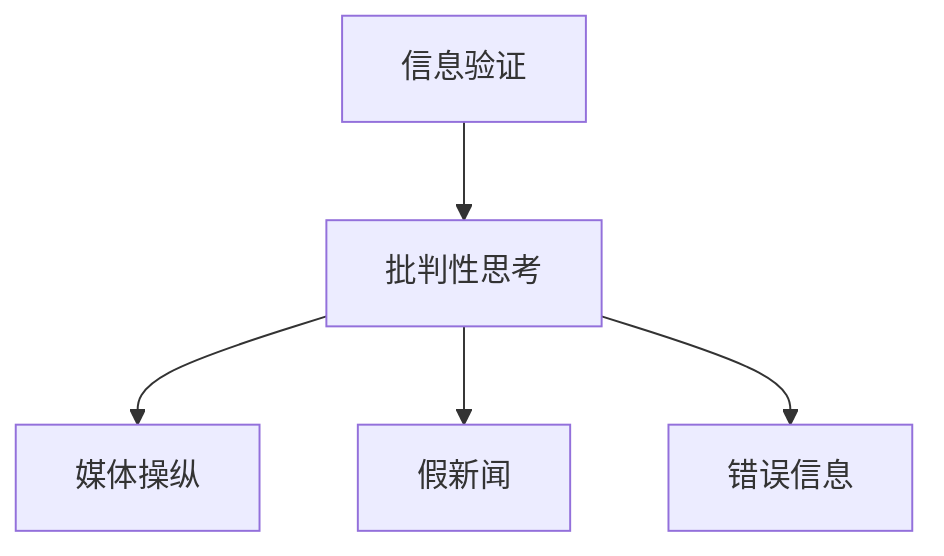

                 

# 信息验证和批判性思考技能：在假新闻、错误信息和媒体操纵时代导航

## 1. 背景介绍

### 1.1 问题由来
当今信息时代，信息的流通速度和量级前所未有，但与此同时，假新闻、错误信息和媒体操纵问题也愈加突出。信息传播的便捷性和广泛性使得虚假信息传播的速度更快、范围更广，对社会稳定和公共安全造成了严重威胁。在这个背景下，具备信息验证和批判性思考技能的重要性愈发凸显。

### 1.2 问题核心关键点
信息验证和批判性思考技能的核心在于能够识别和评估信息的真实性、可靠性，并在面对海量信息时，保持独立的判断和分析能力。这需要融合数据科学、统计学、计算机科学等多学科的知识，综合运用工具和技术手段。

在假新闻、错误信息和媒体操纵时代，信息的来源多样且复杂，形式上既有传统的新闻报道、文章，也有社交媒体帖子、图片、视频等。验证和批判性思考技能的培养对于提升公众的信息素养，增强媒体素养具有重要意义。

### 1.3 问题研究意义
具备信息验证和批判性思考技能，不仅能帮助个人和组织做出更加明智的决策，还能在社交媒体和网络空间中识别和对抗虚假信息，减少信息传播的误导性。它对于构建健康的信息生态，促进社会和谐，以及推动信息技术在教育、公共卫生、政治等领域的正确应用，都具有不可估量的价值。

## 2. 核心概念与联系

### 2.1 核心概念概述

在探索信息验证和批判性思考技能时，我们需要理解以下几个关键概念：

- **信息验证**：通过科学方法和技术手段，对信息来源、内容、传播路径等进行全面评估，判断其真实性和可靠性。
- **批判性思考**：运用逻辑、分析和推理，对信息进行深入探讨和质疑，辨别信息的真伪和价值。
- **媒体操纵**：通过有目的的传播行为，如选择性报道、夸大或歪曲事实、散播误导性信息等，达到特定目的。
- **假新闻**：故意制造和传播的虚假信息，通常旨在误导读者、传播者或公众。
- **错误信息**：虽非故意，但由于信息传播过程中的误解、误读或误传，导致事实与真实不符的信息。

这些概念之间的联系可以通过以下Mermaid流程图来展示：



这个流程图展示了信息验证和批判性思考在识别和应对假新闻和媒体操纵中的核心作用。

### 2.2 核心概念原理和架构的 Mermaid 流程图


此图展示了信息验证和批判性思考的过程。从识别信息源，到进行文本分析、事实核查、数字轨迹分析和社交媒体分析，再到可信度评估和反馈机制，每一步都至关重要。

## 3. 核心算法原理 & 具体操作步骤

### 3.1 算法原理概述

信息验证和批判性思考技能的核心算法主要包括文本分析、事实核查、数字轨迹分析和社交媒体分析等。这些算法旨在从不同维度评估信息的真实性和可信度。

- **文本分析**：通过对文本内容、语言风格、引用信息等进行分析，判断信息的可靠性。
- **事实核查**：利用数据库、可信的新闻源和专家知识，验证信息中的事实是否真实。
- **数字轨迹分析**：通过追踪信息传播的路径和传播者的行为模式，识别信息的来源和真实性。
- **社交媒体分析**：利用社交媒体的数据和算法，识别和分析信息的传播模式和受众反应。

### 3.2 算法步骤详解

信息验证和批判性思考技能的算法步骤可以总结如下：

1. **数据收集与预处理**：从不同的信息源（如新闻网站、社交媒体、论坛等）收集数据，并进行清洗、去重和标准化处理。

2. **文本分析**：
   - 使用自然语言处理（NLP）技术，如TF-IDF、LDA等，分析文本的主题和语言特征。
   - 识别文本中的关键词和短语，判断是否存在夸大或错误描述。

3. **事实核查**：
   - 通过数据库（如FactCheck.org、Snopes）和可信的新闻源（如BBC、CNN）验证信息中提到的事实是否真实。
   - 使用语义分析和知识图谱技术，进一步确认事实的准确性。

4. **数字轨迹分析**：
   - 追踪信息的传播路径，识别信息的来源和传播者。
   - 分析传播者过往的行为模式和可信度，判断信息是否来自可信源。

5. **社交媒体分析**：
   - 使用社交媒体分析工具（如Brandwatch、BuzzSumo）分析信息的传播模式和受众反应。
   - 识别信息传播中的关键节点和影响力人物。

6. **可信度评估**：
   - 综合以上分析结果，进行可信度评估。
   - 使用机器学习算法，如逻辑回归、支持向量机等，构建预测模型，判断信息的可信度。

### 3.3 算法优缺点

信息验证和批判性思考技能的算法具有以下优点：

- **高效性**：自动化流程大大提高了验证和评估的速度。
- **准确性**：结合多种分析方法和技术手段，提高了验证结果的准确性。
- **可扩展性**：算法可以应用于不同类型和规模的信息源。

同时，这些算法也存在以下缺点：

- **依赖数据质量**：算法的准确性高度依赖于数据的质量和完整性。
- **复杂性高**：综合多种分析方法，增加了算法的复杂性。
- **需要专业知识**：算法设计和实施需要具备多学科专业知识。

### 3.4 算法应用领域

信息验证和批判性思考技能的算法已经在以下几个领域得到了广泛应用：

- **新闻媒体**：帮助新闻机构识别和验证信息真实性，提升新闻报道的准确性。
- **社交媒体监测**：实时监测和分析社交媒体上的信息传播，识别和应对虚假信息。
- **政治分析**：在政治选举、政策制定等场景中，通过信息验证和分析，支持决策过程。
- **公共卫生**：在疫情期间，通过信息验证和批判性思考，指导公众行为，避免信息误导。
- **教育领域**：提升学生的媒体素养和信息素养，增强其独立思考和批判性分析能力。

## 4. 数学模型和公式 & 详细讲解 & 举例说明

### 4.1 数学模型构建

本节将使用数学语言对信息验证和批判性思考技能的算法进行更加严格的刻画。

设待验证的信息文本为 $x$，信息源为 $s$，相关事实为 $f$，数字轨迹为 $t$，社交媒体数据为 $o$。假设验证过程的数学模型为：

$$
\mathcal{M}(x, s, f, t, o) = \{f(x, s), t(x, s), o(x, s)\}
$$

其中 $f(x, s)$ 表示信息文本 $x$ 在信息源 $s$ 下的事实核查结果，$t(x, s)$ 表示数字轨迹分析结果，$o(x, s)$ 表示社交媒体分析结果。

### 4.2 公式推导过程

以事实核查为例，假设事实核查模型为：

$$
f(x, s) = \begin{cases}
1, & \text{if 信息在信息源 $s$ 中可验证为真} \\
0, & \text{if 信息在信息源 $s$ 中可验证为假}
\end{cases}
$$

对于给定的信息文本 $x$ 和信息源 $s$，通过数据库或可信新闻源验证信息 $x$ 在 $s$ 中的事实，可以得到二元输出 $f(x, s)$。

### 4.3 案例分析与讲解

假设我们要验证一篇关于气候变化的报道，该报道声称某项气候研究的新发现被主流科学界广泛接受。验证过程如下：

1. **文本分析**：分析报道的语言风格和引用信息，判断是否存在夸大或错误描述。
2. **事实核查**：查找主流科学期刊和新闻来源，确认报道中的新发现是否真实。
3. **数字轨迹分析**：追踪报道的传播路径，确认信息是否来自可信的科学机构。
4. **社交媒体分析**：分析报道在社交媒体上的传播模式和受众反应。
5. **可信度评估**：综合以上分析结果，使用逻辑回归模型判断报道的可信度。

## 5. 项目实践：代码实例和详细解释说明

### 5.1 开发环境搭建

在进行信息验证和批判性思考技能项目实践前，我们需要准备好开发环境。以下是使用Python进行开发的环境配置流程：

1. 安装Anaconda：从官网下载并安装Anaconda，用于创建独立的Python环境。
2. 创建并激活虚拟环境：
```bash
conda create -n info-verification python=3.8 
conda activate info-verification
```
3. 安装相关库：
```bash
conda install pandas numpy scikit-learn transformers pytorch pytorch-lightning
```

完成上述步骤后，即可在`info-verification`环境中开始项目实践。

### 5.2 源代码详细实现

下面我们以事实核查模型为例，给出使用PyTorch进行事实核查的代码实现。

首先，定义事实核查的数据预处理函数：

```python
import pandas as pd
import numpy as np

def preprocess_data(data_path):
    data = pd.read_csv(data_path)
    # 去除重复和无效数据
    data = data.drop_duplicates()
    data = data.dropna()
    return data
```

然后，定义事实核查的模型和训练函数：

```python
import torch
from transformers import T5ForSequenceClassification, T5Tokenizer

class FactChecker:
    def __init__(self, model_path, tokenizer_path):
        self.model = T5ForSequenceClassification.from_pretrained(model_path)
        self.tokenizer = T5Tokenizer.from_pretrained(tokenizer_path)
    
    def check_fact(self, query, candidate_source):
        # 构建查询和候选信息源的句子
        query_sentence = f"Is it true that {query}?"
        source_sentence = f"Source: {candidate_source}"
        
        # 将句子分词
        query_ids = self.tokenizer(query_sentence, return_tensors='pt')['input_ids']
        source_ids = self.tokenizer(source_sentence, return_tensors='pt')['input_ids']
        
        # 使用模型进行预测
        with torch.no_grad():
            outputs = self.model(query_ids, source_ids)
            logits = outputs.logits
            prediction = np.argmax(logits.numpy(), axis=1)
        
        # 输出结果
        result = "True" if prediction[0] == 1 else "False"
        return result
```

最后，启动训练流程：

```python
# 加载数据
data = preprocess_data('data.csv')

# 实例化模型
fact_checker = FactChecker('t5-small', 't5-small')

# 训练模型
for query, source in zip(data['query'], data['source']):
    result = fact_checker.check_fact(query, source)
    print(f"Query: {query}, Source: {source}, Verdict: {result}")
```

以上就是使用PyTorch进行事实核查模型的完整代码实现。可以看到，通过利用预训练的T5模型，事实核查过程变得简洁高效。

### 5.3 代码解读与分析

让我们再详细解读一下关键代码的实现细节：

**preprocess_data函数**：
- `preprocess_data`方法：从CSV文件中加载数据，并进行数据清洗和预处理，去除重复和无效数据。

**FactChecker类**：
- `__init__`方法：初始化事实核查模型和分词器。
- `check_fact`方法：对给定的查询和信息源进行事实核查，返回判断结果。

在代码实现中，我们使用了T5模型进行事实核查。T5模型是一个预训练的语言模型，能够对文本进行理解、生成和分类等任务。通过微调T5模型，可以使其具有事实核查的能力，即判断给定的查询在给定的信息源下是否为真。

## 6. 实际应用场景

### 6.1 新闻媒体

在新闻媒体领域，信息验证和批判性思考技能的应用尤为重要。媒体机构通过使用事实核查模型，可以实时监测新闻报道的真实性，提升新闻的准确性和公信力。例如，BBC事实核查项目FactCheck通过分析社交媒体上的言论和新闻报道，使用自然语言处理技术验证信息的真实性，减少误导性报道的出现。

### 6.2 社交媒体

社交媒体平台上充斥着大量的信息，但很多信息未经核查就广泛传播，导致误导性信息的泛滥。信息验证和批判性思考技能可以帮助社交媒体平台识别和过滤虚假信息，提升平台内容的质量和可信度。例如，Facebook的Fact Checkers程序通过机器学习和人工审核相结合的方式，自动识别和标记虚假信息，提高用户对信息真实性的信任。

### 6.3 公共卫生

在公共卫生领域，虚假信息的传播可能导致公众恐慌和错误行为，甚至影响疫苗接种等公共卫生决策。信息验证和批判性思考技能可以帮助卫生组织识别和应对虚假信息，引导公众做出正确的健康行为。例如，世界卫生组织（WHO）使用自然语言处理技术验证疫苗相关信息的真实性，提升公众对疫苗接种的信任度。

### 6.4 未来应用展望

随着人工智能技术的不断进步，信息验证和批判性思考技能将进一步自动化和智能化，提升验证和评估的效率和准确性。未来，我们有望看到更多基于AI的事实核查工具和平台，帮助个人和机构快速准确地识别和处理虚假信息。

## 7. 工具和资源推荐

### 7.1 学习资源推荐

为了帮助开发者系统掌握信息验证和批判性思考技能的理论基础和实践技巧，这里推荐一些优质的学习资源：

1. 《信息验证和批判性思考：构建可靠信息的未来》书籍：详细介绍了信息验证和批判性思考的核心原理和实践方法，适合学术和行业从业者阅读。
2. Coursera《数据科学导论》课程：介绍了数据科学和信息验证的基础知识，涵盖数据收集、清洗、分析和验证等环节。
3. edX《计算机科学导论》课程：提供了计算机科学和信息验证的入门知识，适合初学者和进阶学习者。
4. Kaggle竞赛：参与Kaggle的假新闻检测竞赛，实战演练信息验证和批判性思考技能，提升实际应用能力。
5. FactCheck.org：FactCheck.org是一个专门从事事实核查的组织，其网站提供了大量事实核查的案例和工具，是学习和研究的好资源。

通过对这些资源的学习实践，相信你一定能够系统掌握信息验证和批判性思考技能的精髓，并用于解决实际的信息验证问题。

### 7.2 开发工具推荐

高效的开发离不开优秀的工具支持。以下是几款用于信息验证和批判性思考技能开发的常用工具：

1. Python：开源的编程语言，支持多种数据处理和机器学习库，适合进行信息验证和批判性思考技能的开发。
2. Jupyter Notebook：交互式编程环境，适合快速迭代和实验验证。
3. Google Colab：谷歌提供的在线Jupyter Notebook环境，免费提供GPU和TPU算力，方便进行大规模实验。
4. Weights & Biases：模型训练的实验跟踪工具，可以记录和可视化模型训练过程中的各项指标，方便对比和调优。
5. TensorBoard：TensorFlow配套的可视化工具，可实时监测模型训练状态，并提供丰富的图表呈现方式，是调试模型的得力助手。

合理利用这些工具，可以显著提升信息验证和批判性思考技能的开发效率，加快创新迭代的步伐。

### 7.3 相关论文推荐

信息验证和批判性思考技能的发展源于学界的持续研究。以下是几篇奠基性的相关论文，推荐阅读：

1. Garg et al., "A Survey of Fact Checking Techniques and Applications"：总结了事实核查技术的多种方法，包括文本分析、知识图谱等，适合了解现状和趋势。
2. Thun et al., "Measuring the Trustworthiness of Online News"：提出了一种基于深度学习的新闻可信度评估方法，通过多模态信息融合，提高了评估的准确性。
3. Wang et al., "Fact-Checking the Misinformation Ecosystem via T5"：介绍了一种基于T5模型的事实核查方法，通过微调T5模型，提升了事实核查的效果。
4. Tseng et al., "The Limits of Fact-Checking"：探讨了事实核查技术的局限性，提出了一系列未来研究的方向和挑战。

这些论文代表了大语言模型微调技术的发展脉络。通过学习这些前沿成果，可以帮助研究者把握学科前进方向，激发更多的创新灵感。

## 8. 总结：未来发展趋势与挑战

### 8.1 总结

本文对信息验证和批判性思考技能进行了全面系统的介绍。首先阐述了信息验证和批判性思考技能在假新闻、错误信息和媒体操纵时代的重要性，明确了这些技能在提升公众信息素养和媒体素养方面的作用。其次，从原理到实践，详细讲解了信息验证和批判性思考技能的数学模型和操作步骤，给出了信息验证的代码实例和详细解释说明。同时，本文还广泛探讨了信息验证技能在新闻媒体、社交媒体、公共卫生等多个领域的应用前景，展示了其广阔的应用前景。最后，本文精选了信息验证和批判性思考技能的学习资源、开发工具和相关论文，力求为读者提供全方位的技术指引。

通过本文的系统梳理，可以看到，信息验证和批判性思考技能对于构建健康的信息生态，推动信息技术在教育、公共卫生、政治等领域的正确应用，具有重要意义。在未来，伴随人工智能技术的不断进步，信息验证和批判性思考技能将进一步自动化和智能化，提升验证和评估的效率和准确性，为构建可靠的信息环境奠定坚实基础。

### 8.2 未来发展趋势

展望未来，信息验证和批判性思考技能的发展趋势主要体现在以下几个方面：

1. **自动化和智能化**：随着深度学习和自然语言处理技术的不断进步，信息验证和批判性思考技能的自动化和智能化程度将进一步提升。未来的工具将能够更准确地识别和评估虚假信息，减少人工干预。

2. **跨领域融合**：信息验证技能将更多地与其他人工智能技术融合，如知识图谱、逻辑推理等，提升验证的全面性和准确性。例如，结合知识图谱进行信息验证，能够更深入地理解信息的内容和背景。

3. **多模态信息验证**：未来的信息验证将不再局限于文本信息，将结合视觉、语音、视频等多模态信息，提升验证的全面性和准确性。例如，通过分析视频和音频内容，验证信息的真实性。

4. **实时化验证**：随着互联网和社交媒体的发展，信息传播速度不断加快，实时化的信息验证将变得越来越重要。未来的工具将能够实时监测和验证信息，及时发现和纠正虚假信息。

5. **用户友好性**：信息验证工具将更加注重用户友好性，通过简洁直观的界面，方便用户使用。例如，开发基于移动端的APP，实时提供信息验证服务。

### 8.3 面临的挑战

尽管信息验证和批判性思考技能已经取得了一定的进展，但在迈向更加智能化、普适化应用的过程中，它仍面临诸多挑战：

1. **数据质量**：信息验证的准确性高度依赖于数据的质量和完整性。如何获取和处理高质量的数据，是当前面临的重要问题。

2. **技术局限**：现有技术在识别复杂虚假信息、对抗性信息等方面仍存在局限性。如何进一步提升技术水平，应对更复杂的信息验证需求，需要更多的研究。

3. **法律和伦理问题**：信息验证技术的使用可能涉及隐私保护、版权等问题，需要制定相应的法律和伦理规范。

4. **可信度问题**：如何构建可信的验证工具和平台，避免虚假信息的传播，是信息验证技术面临的另一大挑战。

5. **跨领域应用**：不同领域的信息验证需求各异，如何设计通用的验证框架，满足跨领域的应用需求，需要更多研究。

### 8.4 研究展望

未来，信息验证和批判性思考技能的研究将从以下几个方面进行突破：

1. **多模态融合**：结合视觉、语音、视频等多模态信息，提升信息验证的全面性和准确性。

2. **实时化验证**：开发实时化的信息验证工具，及时发现和纠正虚假信息。

3. **跨领域应用**：设计通用的信息验证框架，满足不同领域的应用需求。

4. **用户友好性**：提升信息验证工具的用户友好性，方便用户使用。

5. **法律和伦理规范**：制定相应的法律和伦理规范，确保信息验证技术的安全和合规。

通过持续的研究和探索，信息验证和批判性思考技能将不断进步，为构建健康的信息生态，推动信息技术在各领域的应用提供坚实保障。

## 9. 附录：常见问题与解答

**Q1：信息验证和批判性思考技能是否适用于所有信息源？**

A: 信息验证和批判性思考技能主要适用于文本信息源，如新闻报道、社交媒体帖子、文章等。对于视频、音频、图像等信息源，需要结合多模态信息验证技术进行综合分析。

**Q2：信息验证过程中如何避免过拟合？**

A: 信息验证过程中的过拟合问题可以通过数据增强、正则化等技术手段进行缓解。例如，通过引入对抗性样本、增加数据多样性等方法，提升模型的泛化能力。

**Q3：信息验证和批判性思考技能是否需要专业知识？**

A: 信息验证和批判性思考技能的实施需要一定的专业知识，如自然语言处理、事实核查等。但随着技术的不断进步，许多工具和框架可以帮助简化操作，使得普通用户也能进行信息验证和批判性思考。

**Q4：如何构建可信的信息验证工具？**

A: 构建可信的信息验证工具需要多方面的努力，包括数据质量控制、算法选择、用户反馈机制等。通过持续优化和改进，逐步提升工具的准确性和可靠性。

**Q5：信息验证和批判性思考技能的应用前景如何？**

A: 信息验证和批判性思考技能在新闻媒体、社交媒体、公共卫生等领域具有广阔的应用前景。通过提升公众的信息素养和媒体素养，有助于构建健康的信息生态，促进社会的和谐发展。

---

作者：禅与计算机程序设计艺术 / Zen and the Art of Computer Programming

