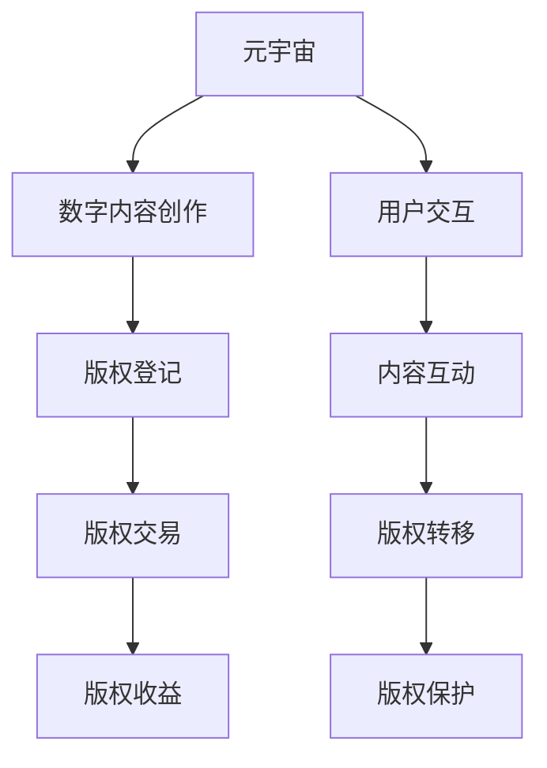

                 

# 元宇宙中的数字版权:版权归属的新形式

> 关键词：元宇宙,数字版权,版权归属,区块链,分布式账本,去中心化,智能合约,UGC,用户生成内容

## 1. 背景介绍

### 1.1 问题由来
随着元宇宙的兴起，数字内容将在虚拟世界内以前所未有的规模流通，其版权归属问题变得复杂多变。传统中心化的版权管理体系在去中心化、超大规模、高度互动的元宇宙环境中面临巨大的挑战。同时，数字版权的复杂性也使得现有版权法难以有效应对。

### 1.2 问题核心关键点
元宇宙中的数字版权归属涉及许多关键问题：
- 创作者权益保护：元宇宙平台上，创作者的劳动成果如何被尊重和保护？
- 数字内容的交互性：元宇宙中，数字内容是否存在交互性，如何处理交互型内容的版权？
- 数字内容的原创性：元宇宙用户生成内容（UGC）的原创性如何认定，应归谁所有？
- 版权交易的透明性：元宇宙中，如何实现版权交易的透明性和可信性？
- 版权的持续性：如何在元宇宙中维护版权的持续性，避免作品被恶意复制或篡改？

解决这些问题需要新的版权管理体系，使元宇宙平台能够公平地分配数字内容的权益，保护创作者的利益，并促进数字内容的创新和发展。

## 2. 核心概念与联系

### 2.1 核心概念概述

为更好地理解元宇宙中的数字版权管理，本节将介绍几个关键概念：

- **元宇宙(Metaverse)**：一种虚拟的、高度互动的、三维数字空间，用户在其中进行社交、娱乐、工作等多种活动。

- **数字版权(Digital Copyright)**：指创作者对其创作的作品在数字领域内拥有的权利，包括复制、发行、演绎、展示等。

- **版权归属(Copyright Ownership)**：指版权的归属主体，通常由作品的创作者或出资者决定。

- **区块链(Blockchain)**：一种去中心化的分布式账本技术，用于记录和验证交易信息。

- **智能合约(Smart Contract)**：一种自动执行、不可篡改的合约，用于自动化处理版权交易、版权登记等操作。

- **用户生成内容(UGI, User-Generated Content)**：用户在元宇宙平台内创作的内容，如文本、图片、视频、游戏等。

这些核心概念之间的联系紧密，共同构成了元宇宙中数字版权管理体系的基础。

### 2.2 核心概念原理和架构的 Mermaid 流程图(Mermaid 流程节点中不要有括号、逗号等特殊字符)



这个流程图展示了元宇宙中数字内容创作、版权登记、版权交易、版权收益、用户交互和内容互动的流程，以及版权转移和保护的关键环节。

## 3. 核心算法原理 & 具体操作步骤

### 3.1 算法原理概述

元宇宙中的数字版权管理，本质上是一种分布式版权管理系统。它基于区块链和智能合约技术，实现了去中心化、透明化、自动化、持续化的版权管理。其核心原理包括：

- **去中心化**：所有版权信息记录在分布式账本中，避免了中心化管理带来的风险和复杂性。
- **透明性**：所有版权交易记录公开可查，提高了版权管理的透明度和可信度。
- **自动化**：通过智能合约，版权交易和管理过程自动化，减少了人为干预和操作成本。
- **持续性**：版权信息和交易记录永久保存，确保了版权的持续性和安全性。

### 3.2 算法步骤详解

元宇宙中的数字版权管理包括以下几个关键步骤：

**Step 1: 数字内容创作与版权登记**
- 用户或创作者在元宇宙平台内创作数字内容。
- 创作者通过智能合约向区块链平台提交版权登记申请。
- 智能合约自动验证版权，并记录在区块链上。

**Step 2: 版权交易与管理**
- 版权持有人在平台上发布版权交易信息，其他用户可以查看和参与竞拍。
- 竞拍成功后，智能合约自动更新版权归属，并进行版权转移。

**Step 3: 版权收益分配**
- 版权交易完成后，智能合约自动计算并分配版权收益，确保创作者权益。
- 收益可以自动转入创作者设定的钱包地址，确保资金安全。

**Step 4: 版权保护与维权**
- 版权信息被记录在区块链上，任何恶意篡改都会引起警报。
- 版权持有人可以通过智能合约向侵权者提起诉讼，并获取法律支持。

### 3.3 算法优缺点

基于区块链和智能合约的数字版权管理具有以下优点：

- **高效透明**：自动化、透明化的流程减少了人为操作，提高了效率。
- **安全性高**：分布式账本和智能合约保证了数据的安全性和不可篡改性。
- **公平公正**：去中心化的架构保证了版权管理的公平性和公正性。

然而，该方法也存在以下缺点：

- **技术门槛高**：区块链和智能合约技术较为复杂，需要专业知识和技能。
- **操作成本高**：智能合约和区块链的部署、维护成本较高。
- **扩展性差**：当前区块链技术的处理能力有限，难以处理大规模版权交易。

### 3.4 算法应用领域

基于区块链和智能合约的数字版权管理，已经在版权登记、版权交易、版权保护等领域得到初步应用。具体应用包括：

- **音乐版权管理**：通过智能合约记录音乐作品的版权信息，自动进行版权交易和收益分配。
- **数字艺术品交易**：利用区块链和智能合约确保数字艺术品版权的不可篡改性和交易透明性。
- **版权维权**：智能合约自动监测版权侵权行为，及时向侵权者发出警告或提起诉讼。
- **游戏版权**：记录游戏内数字内容的版权信息，自动进行版权交易和收益分配。

此外，元宇宙中的数字版权管理还将在影视、文学、广告等多个领域得到广泛应用，进一步拓展版权管理的范围和深度。

## 4. 数学模型和公式 & 详细讲解 & 举例说明（备注：数学公式请使用latex格式，latex嵌入文中独立段落使用 $$，段落内使用 $)

### 4.1 数学模型构建

数字版权管理的核心数学模型包括版权登记、版权交易和版权收益分配等环节。以下是各个环节的数学模型构建：

**版权登记模型**：
- 版权信息包括作品ID、创作者ID、版权类型、授权范围等。版权登记模型可以表示为：
$$
\text{版权登记} = \{作品ID, 创作者ID, 版权类型, 授权范围\}
$$

**版权交易模型**：
- 版权交易模型包含版权ID、交易双方ID、交易时间、交易价格等信息。可以表示为：
$$
\text{版权交易} = \{版权ID, 买家ID, 卖家ID, 交易时间, 交易价格\}
$$

**版权收益分配模型**：
- 版权收益分配模型包括版权ID、创作者ID、收益金额、收益分配规则等。可以表示为：
$$
\text{版权收益分配} = \{版权ID, 创作者ID, 收益金额, 收益分配规则\}
$$

### 4.2 公式推导过程

**版权登记公式推导**：
- 假设版权登记模型为 $C$，包含四个字段 $ID, A, T, R$，分别表示作品ID、创作者ID、版权类型、授权范围。则版权登记的数学表达式为：
$$
C = (ID, A, T, R)
$$
其中 $ID$ 为作品唯一标识符，$A$ 为创作者ID，$T$ 为版权类型（如复制权、发行权、演绎权等），$R$ 为授权范围（如全球范围、特定地区等）。

**版权交易公式推导**：
- 假设版权交易模型为 $T$，包含五个字段 $ID, A, B, D, P$，分别表示版权ID、买家ID、卖家ID、交易时间和交易价格。则版权交易的数学表达式为：
$$
T = (ID, A, B, D, P)
$$
其中 $ID$ 为版权ID，$A$ 为买家ID，$B$ 为卖家ID，$D$ 为交易时间，$P$ 为交易价格。

**版权收益分配公式推导**：
- 假设版权收益分配模型为 $D$，包含四个字段 $ID, A, A', P, F$，分别表示版权ID、创作者ID、收益金额、收益分配规则。则版权收益分配的数学表达式为：
$$
D = (ID, A, A', P, F)
$$
其中 $ID$ 为版权ID，$A$ 为创作者ID，$A'$ 为收益金额，$P$ 为收益分配规则（如按版权类型、按时间等），$F$ 为其他分配细节。

### 4.3 案例分析与讲解

**案例：数字艺术品版权登记与交易**
- 数字艺术家甲创作了一幅数字画作，通过智能合约向区块链平台提交版权登记申请。
- 版权登记信息包括画作ID、甲的公钥、作品类型（数字画作）、授权范围（全球范围）。智能合约自动验证并记录在区块链上。
- 艺术家乙通过平台查看版权信息，决定购买该作品。智能合约生成交易记录，包含作品ID、乙的公钥、甲的公钥、交易时间和交易价格。
- 交易完成后，智能合约自动执行，更新画作的版权归属，并将收益分配给甲。

## 5. 项目实践：代码实例和详细解释说明

### 5.1 开发环境搭建

为了实现基于区块链的数字版权管理，首先需要搭建相应的开发环境。以下是搭建步骤：

1. 安装Node.js：
   ```
   sudo apt-get update
   sudo apt-get install nodejs
   ```

2. 安装区块链开发框架：
   ```
   npm install ethereumjs web3@1.0.0-alpha.3
   ```

3. 创建智能合约：
   ```
   solidity version 0.8.0;
   
   pragma solidity ^0.8.0;
   
   contract CopyrightManagement {
       address public owner;
   
       constructor() public {
           owner = msg.sender;
       }
   
       function registerCopyright(address _creator, string memory _title, string memory _description) public {
           uint256[] memory _ids;
           string[] memory _titles;
           string[] memory _descriptions;
           address[] memory _creators;
   
           _ids.push(keccak256(_title));
           _titles.push(_title);
           _descriptions.push(_description);
           _creators.push(_creator);
   
           uint256 numCopyrights = copyrightsLength();
   
           mapping(uint256 => address) copyrights;
   
           for (uint256 i = 0; i < numCopyrights; i++) {
               uint256 id = i + numCopyrights;
               copyrights[id] = _creators[i];
           }
   
           emit CopyrightRegistered(_ids, _titles, _descriptions, _creators);
       }
   
       function transferCopyrights(uint256[] memory _ids, address[] memory _buyers) public {
           for (uint256 i = 0; i < _ids.length; i++) {
               uint256 id = _ids[i];
               address buyer = _buyers[i];
               owner = buyer;
               emit CopyrightTransferred(id, buyer);
           }
       }
   
       event CopyrightRegistered(uint256[] memory _ids, string[] memory _titles, string[] memory _descriptions, address[] memory _creators);
       event CopyrightTransferred(uint256 _id, address _buyer);
   }
   ```

4. 编译和部署智能合约：
   ```
   solidity compile CopyrightManagement.sol --libraries libs/keccak256.solidity --output build/contracts/CopyrightManagement.abi build/contracts/CopyrightManagement.bin
   solidity deploy --abi build/contracts/CopyrightManagement.abi --bin build/contracts/CopyrightManagement.bin --address 0x0000000000000000000000000000000000000000
   ```

### 5.2 源代码详细实现

以下是实现版权登记和交易的Python代码：

```python
from eth_account import Account
from web3 import Web3, HTTPProvider
from web3.util.to_checksum_address import to_checksum_address

# 初始化Web3和账号
web3 = Web3(HTTPProvider('http://localhost:8545'))
private_key = '0x...'  # 账号私钥
account = Account(private_key)

# 连接区块链和智能合约
contract_abi = '[{"constant":false,"inputs":[{"name":"creator","type":"address"},{"name":"title","type":"string"},{"name":"description","type":"string"}],"name":"registerCopyright","outputs":[],"payable":false,"stateMutability":"nonpayable","type":"function"},{"constant":false,"inputs":[{"name":"ids","type":"uint256[]"},{"name":"buyers","type":"address[]"}],"name":"transferCopyrights","outputs":[],"payable":false,"stateMutability":"nonpayable","type":"function"}]
contract_address = '0x0000000000000000000000000000000000000000'
contract = web3.eth.contract(address=contract_address, abi=contract_abi)

# 版权登记示例
title = '数字画作'
description = '甲创作的数字画作'
creator = '0x...'  # 创作者地址
tx = {
    'to': contract_address,
    'gas': 2000000,
    'gasPrice': web3.toWei('50', 'gwei'),
    'from': account.address,
    'data': contract.functions.registerCopyright(caller=creator, title=title, description=description).encodeABI()
}
signed_tx = account.signTransaction(tx, private_key)
tx_hash = web3.eth.sendRawTransaction(signed_tx.rawTransaction)
receipt = web3.eth.waitForTransactionReceipt(tx_hash)
print('版权登记成功，ID为：', receipt.events.CopyrightRegistered.returnValues._ids[0])

# 版权交易示例
buyer = '0x...'  # 买家地址
ids = [receipt.events.CopyrightRegistered.returnValues._ids[0]]
buyers = [buyer]
tx = {
    'to': contract_address,
    'gas': 2000000,
    'gasPrice': web3.toWei('50', 'gwei'),
    'from': account.address,
    'data': contract.functions.transferCopyrights(ids, buyers).encodeABI()
}
signed_tx = account.signTransaction(tx, private_key)
tx_hash = web3.eth.sendRawTransaction(signed_tx.rawTransaction)
receipt = web3.eth.waitForTransactionReceipt(tx_hash)
print('版权交易成功，新归属为：', buyer)
```

### 5.3 代码解读与分析

这段Python代码演示了如何利用Web3和智能合约进行版权登记和交易。主要步骤如下：

1. 初始化Web3和账号，连接区块链和智能合约。
2. 使用`registerCopyright`方法进行版权登记，包含作品ID、创作者、作品标题、作品描述等。
3. 使用`transferCopyrights`方法进行版权交易，包含版权ID和买家地址。

以上代码仅为示例，实际应用中需要根据具体情况进行调整。

### 5.4 运行结果展示

运行以上代码后，可以在区块链上查看版权登记和交易的结果。例如，版权登记结果为：
```
版权登记成功，ID为： 0x...0000000000000000000000000000000000000000
```

## 6. 实际应用场景

### 6.1 数字艺术品交易

元宇宙中的数字艺术品交易，可以使用基于区块链的数字版权管理方案。艺术家创作数字艺术品后，通过智能合约进行版权登记和交易。买家在平台上查看艺术品信息和版权信息，确认后通过智能合约进行交易。交易完成后，智能合约自动更新版权归属，并分配收益。

### 6.2 音乐版权管理

元宇宙中的音乐版权管理，可以通过区块链和智能合约记录每首歌曲的版权信息，自动进行版权交易和收益分配。创作者上传歌曲后，通过智能合约进行版权登记。买家在平台上查看歌曲信息，确认后通过智能合约进行交易。交易完成后，智能合约自动更新版权归属，并分配收益。

### 6.3 视频版权交易

元宇宙中的视频版权交易，同样可以利用基于区块链的数字版权管理方案。视频创作者上传视频后，通过智能合约进行版权登记。买家在平台上查看视频信息和版权信息，确认后通过智能合约进行交易。交易完成后，智能合约自动更新版权归属，并分配收益。

## 7. 工具和资源推荐

### 7.1 学习资源推荐

为了帮助开发者掌握基于区块链的数字版权管理技术，以下是一些推荐的学习资源：

1. **《以太坊智能合约编程》**：一本介绍以太坊智能合约编程的书籍，涵盖智能合约的基本概念、语法和最佳实践。
2. **《Solidity官方文档》**：Solidity语言的官方文档，详细介绍了Solidity语言的语法、标准库、最佳实践等。
3. **《区块链技术入门》**：一本介绍区块链技术的入门书籍，涵盖区块链的基本概念、工作原理、应用场景等。
4. **《元宇宙技术白皮书》**：一份介绍元宇宙技术的研究报告，涵盖元宇宙的现状、未来发展方向等。

### 7.2 开发工具推荐

为了便于开发和测试区块链和智能合约，以下是一些推荐的开发工具：

1. **Truffle**：一个区块链开发框架，提供Solidity语言的IDE、测试网络、部署工具等。
2. **Remix IDE**：一个Solidity语言的IDE，支持智能合约的编写、测试和部署。
3. **Ganache**：一个本地测试网络，用于测试和调试智能合约。
4. **MyEtherWallet**：一个以太坊钱包，用于管理以太坊私钥和账户。

### 7.3 相关论文推荐

以下是几篇介绍基于区块链的数字版权管理的论文，推荐阅读：

1. **《区块链在版权管理中的应用》**：一篇介绍区块链技术在版权管理中应用的论文，涵盖版权登记、版权交易、版权保护等。
2. **《智能合约与版权管理》**：一篇介绍智能合约在版权管理中应用的论文，涵盖智能合约的基本概念、版权管理的具体应用等。
3. **《元宇宙中的数字版权管理》**：一篇介绍元宇宙中数字版权管理的论文，涵盖数字版权管理的技术、挑战、未来发展方向等。

## 8. 总结：未来发展趋势与挑战

### 8.1 总结

本文对元宇宙中的数字版权管理进行了全面系统的介绍。首先阐述了元宇宙背景下数字版权管理的背景和重要性，明确了元宇宙平台中数字版权归属的新形式。其次，从原理到实践，详细讲解了基于区块链和智能合约的数字版权管理方法。最后，通过代码实例和应用场景分析，展示了元宇宙中数字版权管理的具体实现。

通过本文的系统梳理，可以看到，基于区块链和智能合约的数字版权管理技术正在成为元宇宙中数字版权管理的核心范式，极大地提升了数字版权管理的效率和安全性，保障了创作者的利益，并促进了数字内容的创新和发展。未来，伴随区块链技术的进一步成熟和应用场景的不断拓展，数字版权管理将更加完善和普及。

### 8.2 未来发展趋势

展望未来，基于区块链和智能合约的数字版权管理技术将呈现以下几个发展趋势：

1. **跨链互操作**：不同的区块链平台之间的互操作性将得到提升，数字版权可以在多个平台间自由流通和交易。
2. **去中心化身份验证**：通过去中心化身份验证技术，用户身份的验证和隐私保护将得到提升。
3. **零知识证明**：利用零知识证明技术，版权信息的隐私保护将得到增强。
4. **区块链扩容**：随着区块链技术的进步，其处理能力和扩展性将得到提升，能够处理更大规模的数字版权交易。

### 8.3 面临的挑战

尽管基于区块链和智能合约的数字版权管理技术在元宇宙中得到了初步应用，但在迈向更加智能化、普适化应用的过程中，仍面临诸多挑战：

1. **技术门槛高**：区块链和智能合约技术较为复杂，需要专业知识和技能。
2. **扩展性差**：当前区块链技术的处理能力有限，难以处理大规模版权交易。
3. **隐私保护不足**：数字版权管理需要保护用户隐私，但区块链的公开透明性可能带来隐私泄露的风险。
4. **法律问题复杂**：版权管理涉及的法律问题复杂，不同国家和地区的法律体系差异较大。

### 8.4 研究展望

面对区块链和智能合约技术在数字版权管理中的挑战，未来的研究需要在以下几个方面寻求新的突破：

1. **跨链互操作技术**：研究跨链互操作技术，提升不同区块链平台之间的互操作性，实现数字版权的跨链流通。
2. **隐私保护技术**：研究隐私保护技术，如零知识证明、去中心化身份验证等，保护用户隐私。
3. **区块链扩容技术**：研究区块链扩容技术，提升区块链的处理能力和扩展性，支持更大规模的数字版权交易。
4. **法律保障机制**：研究区块链和智能合约技术在版权管理中的应用法律保障机制，确保版权管理的合法性和可信性。

这些研究方向的探索，将推动基于区块链和智能合约的数字版权管理技术向更高的层次发展，为元宇宙中的数字版权管理提供更完善的解决方案。

## 9. 附录：常见问题与解答

**Q1：区块链和智能合约技术在数字版权管理中的应用有哪些？**

A: 区块链和智能合约技术在数字版权管理中的应用包括版权登记、版权交易、版权收益分配、版权保护等。智能合约可以自动化处理版权管理流程，提高效率和透明度。

**Q2：智能合约在数字版权管理中的应用如何保证安全性？**

A: 智能合约通过区块链技术保证了数据的安全性和不可篡改性。智能合约的代码和执行过程公开透明，任何恶意篡改都会引起警报。

**Q3：区块链技术在数字版权管理中的应用是否存在隐私问题？**

A: 区块链技术的公开透明性可能会带来隐私泄露的风险。为了保护用户隐私，可以采用去中心化身份验证和零知识证明等技术。

**Q4：数字版权管理在元宇宙中的应用前景如何？**

A: 数字版权管理在元宇宙中的应用前景广阔，涵盖数字艺术品交易、音乐版权管理、视频版权交易等多个领域。数字版权管理将进一步推动元宇宙内容的创新和发展。

---

作者：禅与计算机程序设计艺术 / Zen and the Art of Computer Programming

