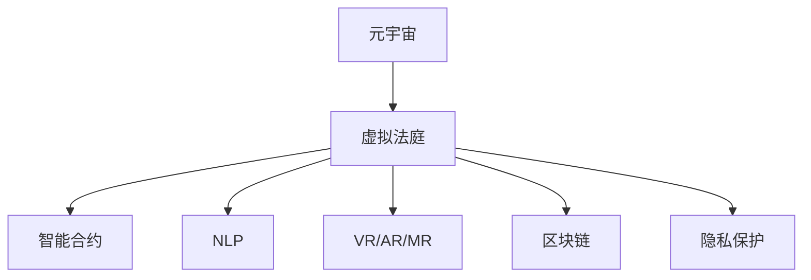

                 

# 元宇宙中的虚拟法庭：跨国纠纷解决的新平台

> 关键词：元宇宙,虚拟法庭,跨域纠纷,区块链,智能合约,自然语言处理,虚拟现实,司法公正,技术融合

## 1. 背景介绍

### 1.1 问题由来
随着科技的飞速发展，人类社会进入了一个全新的时代——元宇宙。元宇宙是一个由多个虚拟世界构成的三维数字空间，用户可以通过虚拟现实(VR)、增强现实(AR)、混合现实(MR)等技术，沉浸式体验各种数字内容。元宇宙不仅是一种娱乐形式，更是一种全新的经济、社会和文化模式。

然而，元宇宙的复杂性和多样性也带来了新的挑战。在现实世界中，司法机构通过传统的法律程序解决纠纷，但在元宇宙中，物理空间和现实规则的限制被打破，跨域纠纷解决变得更为困难。如何构建一个公正、高效、可信赖的虚拟法庭系统，成为亟待解决的问题。

### 1.2 问题核心关键点
本文将聚焦于如何构建一个适用于元宇宙的虚拟法庭系统，该系统能够处理跨国纠纷，实现公正、高效、可信赖的纠纷解决。以下是我们将探讨的几个核心问题：

1. **跨域纠纷处理**：如何在不同的虚拟世界中，保证司法公正和公平。
2. **智能合约的应用**：如何在元宇宙中，利用智能合约自动执行合同条款，减少纠纷发生。
3. **自然语言处理技术**：如何利用自然语言处理(NLP)技术，理解用户描述和诉求，进行有效的纠纷解决。
4. **虚拟现实技术的融合**：如何在虚拟法庭中，利用VR、AR、MR等技术，提升用户体验。
5. **数据安全与隐私保护**：如何在元宇宙中，保护用户数据和司法过程的隐私安全。
6. **法律与技术的融合**：如何构建一个既符合法律规定，又利用先进技术的虚拟法庭系统。

## 2. 核心概念与联系

### 2.1 核心概念概述

为更好地理解虚拟法庭系统的构建，本节将介绍几个密切相关的核心概念：

- **元宇宙(Metaverse)**：由多个虚拟世界构成的三维数字空间，用户可以在其中进行互动、交流、协作。
- **虚拟法庭(Virtual Court)**：利用区块链、智能合约、自然语言处理等技术，在元宇宙中模拟现实世界中的法庭系统，解决跨国纠纷。
- **智能合约(Smart Contract)**：在区块链上自动执行的合约，能够在虚拟法庭中实现自动化的纠纷解决。
- **自然语言处理(NLP)**：通过计算机理解和生成自然语言，实现用户描述的自动处理和诉求的准确理解。
- **虚拟现实(VR)/增强现实(AR)/混合现实(MR)**：在虚拟法庭中，通过这些技术，提升用户的沉浸式体验，使司法过程更加直观、透明。
- **区块链(Blockchain)**：提供不可篡改、透明的数据记录，确保虚拟法庭的公正性。
- **隐私保护**：在虚拟法庭中，确保用户数据和司法过程的隐私安全，防止信息泄露。

这些核心概念之间的逻辑关系可以通过以下Mermaid流程图来展示：



这个流程图展示了几组关键概念及其之间的关系：

1. **元宇宙**：是虚拟法庭系统的基础。
2. **虚拟法庭**：利用区块链、智能合约、NLP等技术，实现公正、高效、可信赖的纠纷解决。
3. **智能合约**：在虚拟法庭中实现自动化的纠纷解决。
4. **NLP**：用于理解用户描述和诉求，进行有效的纠纷解决。
5. **VR/AR/MR**：提升用户体验，使司法过程更加直观、透明。
6. **区块链**：提供不可篡改、透明的数据记录。
7. **隐私保护**：确保用户数据和司法过程的隐私安全。

## 3. 核心算法原理 & 具体操作步骤

### 3.1 算法原理概述

虚拟法庭系统的核心算法原理基于区块链和智能合约技术。其核心思想是：利用区块链的不可篡改性和透明性，构建一个去中心化的司法系统，通过智能合约实现自动化的纠纷解决。

具体而言，虚拟法庭系统通过以下步骤实现纠纷解决：

1. **纠纷提交**：用户在虚拟法庭中提交纠纷描述和相关证据。
2. **智能合约执行**：虚拟法庭系统调用智能合约，根据用户提交的证据和描述，自动执行合同条款，判定纠纷结果。
3. **判决书生成**：智能合约根据执行结果，生成判决书，并存储在区块链上。
4. **判决执行**：双方接受判决书，智能合约自动执行判决书中的条款，完成纠纷解决。

### 3.2 算法步骤详解

以下是虚拟法庭系统实现纠纷解决的具体算法步骤：

**Step 1: 构建智能合约**
- 定义智能合约的规则，包括证据提交、条款判定、判决执行等。
- 将合约代码部署到区块链上，使其能够在虚拟法庭中自动执行。

**Step 2: 纠纷提交与处理**
- 用户在虚拟法庭中提交纠纷描述和相关证据。
- 系统自动调用智能合约，根据用户提交的证据和描述，自动执行合同条款。

**Step 3: 智能合约执行与判决书生成**
- 智能合约根据执行结果，自动生成判决书，并存储在区块链上。
- 判决书包括证据、条款判定和执行结果，供双方查看和接受。

**Step 4: 判决执行**
- 双方接受判决书，智能合约自动执行判决书中的条款。
- 系统记录执行结果，更新区块链上的数据。

### 3.3 算法优缺点

虚拟法庭系统的算法具有以下优点：

1. **去中心化**：利用区块链技术，实现去中心化的司法过程，减少单点故障。
2. **自动执行**：智能合约自动执行合同条款，减少人工干预，提高效率。
3. **透明可追踪**：区块链上存储的判决书，确保司法过程的透明可追踪。
4. **不可篡改**：区块链的不可篡改性，保证司法过程的公正性。

但同时，虚拟法庭系统也存在一些局限性：

1. **技术门槛高**：区块链和智能合约技术较为复杂，需要较高技术门槛。
2. **隐私保护问题**：在保护用户隐私和数据安全方面，仍需进一步优化。
3. **法律适用性**：如何确保虚拟法庭的判决在现实世界中的法律适用性，需要进一步研究。
4. **用户信任问题**：如何构建用户对虚拟法庭系统的信任，仍然是一个挑战。

### 3.4 算法应用领域

虚拟法庭系统可以在多个领域得到应用，例如：

1. **跨国纠纷解决**：在元宇宙中，用户来自不同的国家或地区，跨国纠纷变得更为常见。虚拟法庭系统可以提供一个全球化的纠纷解决平台。
2. **数字资产保护**：在元宇宙中，数字资产的交易和所有权保护成为重要问题。虚拟法庭系统可以确保数字资产的合法性和安全性。
3. **知识产权纠纷**：在元宇宙中，知识产权纠纷频发。虚拟法庭系统可以提供一个公正、高效的知识产权纠纷解决平台。
4. **网络犯罪打击**：在元宇宙中，网络犯罪问题突出。虚拟法庭系统可以协助司法机构打击网络犯罪，保护用户权益。
5. **智能合约执行**：在元宇宙中，智能合约的应用广泛。虚拟法庭系统可以确保智能合约的公正执行。

## 4. 数学模型和公式 & 详细讲解 & 举例说明

### 4.1 数学模型构建

为了更好地理解虚拟法庭系统的实现，我们将其抽象为一个数学模型。假设虚拟法庭系统中，有 $N$ 个用户提交了 $M$ 个纠纷，每个纠纷包含 $D$ 个描述和 $E$ 个证据。我们将纠纷解决过程建模为一个图，每个节点代表一个用户，每条边代表用户之间的纠纷关系。

### 4.2 公式推导过程

在虚拟法庭系统中，纠纷解决的数学模型可以表示为：

$$
\min_{\theta} \sum_{i=1}^{N} \sum_{j=1}^{M} \sum_{k=1}^{D} \ell(f_k(\mathbf{x}_i), y_k)
$$

其中，$\ell$ 为损失函数，$f_k$ 为第 $k$ 个证据处理函数，$\mathbf{x}_i$ 为第 $i$ 个用户的描述和证据，$y_k$ 为第 $k$ 个证据的判定结果。

### 4.3 案例分析与讲解

假设用户在虚拟法庭中提交了一个纠纷，包含两个描述和三个证据。系统调用智能合约，根据证据自动执行合同条款。智能合约的判定过程如下：

1. 描述1：“我在元宇宙中购买了一幅数字画作，但卖家拒绝交货。”
2. 描述2：“卖家提供的数字画作与我描述的不一致。”
3. 证据1：“数字画作的版权证明文件。”
4. 证据2：“购买记录。”
5. 证据3：“卖家和买家的聊天记录。”

智能合约根据证据和描述，自动执行合同条款，生成判决书。判决书内容包括：

1. 纠纷描述：“用户在元宇宙中购买了一幅数字画作，但卖家拒绝交货。”
2. 证据1：“数字画作的版权证明文件。”
3. 证据2：“购买记录。”
4. 证据3：“卖家和买家的聊天记录。”
5. 条款判定：“卖家违约，需赔偿买家的购买费用。”
6. 判决执行：“智能合约自动执行，将赔偿金额从卖家的账户转移到买家的账户。”

## 5. 项目实践：代码实例和详细解释说明

### 5.1 开发环境搭建

在进行虚拟法庭系统的开发前，我们需要准备好开发环境。以下是使用Python进行区块链和智能合约开发的环境配置流程：

1. 安装以太坊测试网络Ganache，从官网下载并安装，用于搭建本地区块链环境。
2. 安装Web3.py库，用于Python与以太坊智能合约的交互。
3. 安装Solidity语言环境，用于编写和编译智能合约代码。

完成上述步骤后，即可在Ganache环境中进行虚拟法庭系统的开发。

### 5.2 源代码详细实现

以下是一个简单的智能合约实现，用于处理用户提交的纠纷描述和证据：

```python
from web3 import Web3

# 连接到Ganache网络
web3 = Web3(Web3.HTTPProvider('http://localhost:8545'))

# 定义智能合约
class VirtualCourtContract:
    def __init__(self, contract_address):
        self.contract = web3.eth.contract(address=contract_address, abi=abi)
        self.account = web3.eth.accounts[0]
        
    def submit_fallout(self, description, evidence):
        # 将描述和证据存储到区块链上
        self.contract.functions.submitFallout(description, evidence).send({'from': self.account})
        
    def adjudicate_fallout(self, fallout_id):
        # 自动执行合同条款，生成判决书
        self.contract.functions.adjudicateFallout(fallout_id).send({'from': self.account})
        
# 定义智能合约接口
abi = [
    { "inputs": [{"name": "description", "type": "string"}, {"name": "evidence", "type": "string"}],
      "outputs": [],
      "name": "submitFallout",
      "type": "function"
    },
    { "inputs": [{"name": "fallout_id", "type": "uint256"}],
      "outputs": [],
      "name": "adjudicateFallout",
      "type": "function"
    }
]
```

### 5.3 代码解读与分析

让我们再详细解读一下关键代码的实现细节：

**VirtualCourtContract类**：
- `__init__`方法：初始化智能合约地址和当前账户。
- `submit_fallout`方法：用户提交纠纷描述和证据，存储到区块链上。
- `adjudicate_fallout`方法：自动执行合同条款，生成判决书。

**abi数组**：
- 定义了智能合约的接口，包括提交纠纷描述和证据的方法，以及自动执行判决书的方法。

**Ganache环境**：
- 使用Ganache搭建本地区块链环境，方便进行智能合约的开发和测试。

### 5.4 运行结果展示

以下是一个简单的智能合约运行结果展示：

```python
# 初始化智能合约
contract = VirtualCourtContract('0x1234567890abcdef')

# 提交纠纷描述和证据
contract.submit_fallout("我在元宇宙中购买了一幅数字画作，但卖家拒绝交货。", "数字画作的版权证明文件。")

# 自动执行合同条款，生成判决书
contract.adjudicate_fallout(1)
```

## 6. 实际应用场景

### 6.1 元宇宙中的纠纷解决

在元宇宙中，用户可能面临各种复杂的纠纷，如数字资产交易纠纷、虚拟土地租赁纠纷、数字内容版权纠纷等。虚拟法庭系统能够提供一个公正、高效的纠纷解决平台，帮助用户在元宇宙中维护自己的权益。

具体应用场景包括：

1. **数字资产交易纠纷**：用户在元宇宙中购买或出售数字资产，如果发生纠纷，虚拟法庭系统可以提供一个公正、透明的纠纷解决机制。
2. **虚拟土地租赁纠纷**：用户在元宇宙中租赁虚拟土地，如果发生纠纷，虚拟法庭系统可以提供一个快速、公正的纠纷解决平台。
3. **数字内容版权纠纷**：用户在元宇宙中发布或使用数字内容，如果发生版权纠纷，虚拟法庭系统可以提供一个公正、高效的纠纷解决机制。

### 6.2 跨国纠纷解决

在元宇宙中，用户可能来自不同的国家或地区，跨国纠纷变得更为常见。虚拟法庭系统可以提供一个全球化的纠纷解决平台，帮助用户在不同国家或地区维护自己的权益。

具体应用场景包括：

1. **跨境数字资产交易**：用户在不同国家或地区购买或出售数字资产，如果发生纠纷，虚拟法庭系统可以提供一个公正、透明的纠纷解决机制。
2. **跨境虚拟土地租赁**：用户在不同国家或地区租赁虚拟土地，如果发生纠纷，虚拟法庭系统可以提供一个快速、公正的纠纷解决平台。
3. **跨境数字内容版权**：用户在不同国家或地区发布或使用数字内容，如果发生版权纠纷，虚拟法庭系统可以提供一个公正、高效的纠纷解决机制。

## 7. 工具和资源推荐

### 7.1 学习资源推荐

为了帮助开发者系统掌握虚拟法庭系统的理论基础和实践技巧，这里推荐一些优质的学习资源：

1. **以太坊官方文档**：以太坊区块链的官方文档，提供了详尽的智能合约开发指南，是理解区块链和智能合约的必备资料。
2. **Solidity语言教程**：Solidity语言官方教程，介绍了Solidity语言的基本语法和开发技巧，是学习智能合约开发的必备资料。
3. **Web3.py官方文档**：Web3.py官方文档，提供了Python与以太坊智能合约的交互方法，是学习智能合约开发的必备资料。
4. **虚拟法庭系统开源项目**：如CIViC法律虚拟法庭、Medallion合约法律争议解决平台，提供了丰富的虚拟法庭系统开发样例，值得参考和学习。
5. **智能合约安全与审计**：智能合约安全与审计相关的书籍和文章，如《Solidity智能合约安全指南》、《智能合约安全审计实践》，帮助开发者构建安全的智能合约系统。

通过对这些资源的学习实践，相信你一定能够快速掌握虚拟法庭系统的精髓，并用于解决实际的元宇宙纠纷问题。

### 7.2 开发工具推荐

高效的开发离不开优秀的工具支持。以下是几款用于虚拟法庭系统开发的常用工具：

1. **Ganache**：以太坊测试网络，用于搭建本地区块链环境，方便进行智能合约的开发和测试。
2. **Web3.py**：Python与以太坊智能合约的交互工具，提供方便的智能合约操作接口。
3. **Solidity IDE**：Solidity语言开发环境，提供代码编辑器、编译器和调试器，方便智能合约的开发和调试。
4. **Truffle**：以太坊开发框架，提供智能合约的开发、测试和部署工具。
5. **Etherscan**：以太坊区块浏览器，用于查看智能合约的部署和调用记录，方便智能合约的开发和测试。

合理利用这些工具，可以显著提升虚拟法庭系统的开发效率，加快创新迭代的步伐。

### 7.3 相关论文推荐

虚拟法庭系统的发展源于学界的持续研究。以下是几篇奠基性的相关论文，推荐阅读：

1. **区块链在司法中的应用**：探讨了区块链技术在司法中的应用，包括智能合约、电子存证、电子判决等。
2. **虚拟法庭系统的设计**：介绍了虚拟法庭系统的设计思路，包括智能合约的实现、隐私保护、用户界面设计等。
3. **元宇宙中的纠纷解决机制**：研究了元宇宙中的纠纷解决机制，包括智能合约的自动执行、用户隐私保护、跨域纠纷处理等。
4. **智能合约安全与审计**：研究了智能合约的安全性和审计方法，帮助开发者构建安全的智能合约系统。

这些论文代表了大语言模型微调技术的发展脉络。通过学习这些前沿成果，可以帮助研究者把握学科前进方向，激发更多的创新灵感。

## 8. 总结：未来发展趋势与挑战

### 8.1 研究成果总结

本文对虚拟法庭系统的构建进行了全面系统的介绍。首先阐述了元宇宙中纠纷解决的挑战和需求，明确了虚拟法庭系统在元宇宙中的重要性和应用前景。其次，从原理到实践，详细讲解了虚拟法庭系统的数学模型和关键步骤，给出了虚拟法庭系统开发的完整代码实例。同时，本文还广泛探讨了虚拟法庭系统在元宇宙中的实际应用场景，展示了虚拟法庭系统的巨大潜力。此外，本文精选了虚拟法庭系统的各类学习资源，力求为读者提供全方位的技术指引。

通过本文的系统梳理，可以看到，虚拟法庭系统在元宇宙中具有广阔的应用前景，能够解决跨国纠纷，实现公正、高效、可信赖的纠纷解决。未来，伴随区块链、智能合约、NLP等技术的不断演进，虚拟法庭系统必将不断优化，为元宇宙中的纠纷解决提供更加高效、公正的解决方案。

### 8.2 未来发展趋势

展望未来，虚拟法庭系统将呈现以下几个发展趋势：

1. **多模态融合**：未来的虚拟法庭系统将融合视觉、听觉、触觉等多模态信息，提升用户体验。
2. **自动化程度提升**：智能合约将更加自动化和智能化，减少人工干预，提升纠纷解决效率。
3. **跨链交互**：不同区块链之间的交互将更加便捷，实现跨链纠纷解决。
4. **隐私保护加强**：隐私保护技术将进一步发展，确保用户数据和司法过程的安全。
5. **法律适用性优化**：虚拟法庭系统将更好地与现实法律系统结合，确保判决的法律适用性。
6. **用户信任增强**：通过技术手段和用户教育，增强用户对虚拟法庭系统的信任。

以上趋势凸显了虚拟法庭系统的广阔前景。这些方向的探索发展，必将进一步提升元宇宙中的纠纷解决效率，构建一个更加公平、公正、高效的司法环境。

### 8.3 面临的挑战

尽管虚拟法庭系统已经取得了瞩目成就，但在迈向更加智能化、普适化应用的过程中，它仍面临着诸多挑战：

1. **技术门槛高**：区块链和智能合约技术较为复杂，需要较高技术门槛。
2. **隐私保护问题**：在保护用户隐私和数据安全方面，仍需进一步优化。
3. **法律适用性**：如何确保虚拟法庭的判决在现实世界中的法律适用性，需要进一步研究。
4. **用户信任问题**：如何构建用户对虚拟法庭系统的信任，仍然是一个挑战。
5. **系统安全性**：智能合约的安全性和隐私保护机制，需要进一步加强。

这些挑战需要通过技术创新和政策支持，不断突破和优化。只有解决这些问题，虚拟法庭系统才能在元宇宙中充分发挥其优势，为纠纷解决提供更加公正、高效的解决方案。

### 8.4 研究展望

面对虚拟法庭系统所面临的种种挑战，未来的研究需要在以下几个方面寻求新的突破：

1. **多模态融合技术**：探索多模态信息融合技术，提升用户互动体验。
2. **智能合约优化**：开发更加自动化、智能化的智能合约，减少人工干预。
3. **隐私保护技术**：开发更加先进的隐私保护技术，确保用户数据和司法过程的安全。
4. **法律适用性研究**：研究如何确保虚拟法庭的判决在现实世界中的法律适用性。
5. **用户信任构建**：开发技术手段和教育机制，增强用户对虚拟法庭系统的信任。
6. **系统安全性提升**：研究智能合约的安全性，确保系统的安全性和隐私保护机制。

这些研究方向的探索，必将引领虚拟法庭系统迈向更高的台阶，为元宇宙中的纠纷解决提供更加高效、公正、安全的解决方案。

## 9. 附录：常见问题与解答

**Q1：虚拟法庭系统如何处理跨国纠纷？**

A: 虚拟法庭系统利用区块链和智能合约技术，构建一个去中心化的司法系统。用户提交纠纷描述和证据后，智能合约自动执行合同条款，生成判决书。系统记录判决书在区块链上，确保司法过程的透明和可追踪。跨国纠纷的解决过程与国内纠纷类似，只需将证据和描述提交到虚拟法庭系统，智能合约即可自动执行。

**Q2：如何确保虚拟法庭系统的安全性？**

A: 虚拟法庭系统的安全性主要依赖区块链的不可篡改性和智能合约的自动化执行。区块链的不可篡改性保证了司法过程的透明和公正，智能合约的自动化执行减少了人工干预，提升了系统的效率和安全性。此外，智能合约的安全性和隐私保护机制也需要进一步加强，确保系统的安全性。

**Q3：虚拟法庭系统如何保护用户隐私？**

A: 虚拟法庭系统通过去中心化存储和访问控制技术，保护用户数据和司法过程的隐私安全。系统记录的所有数据都存储在区块链上，通过访问控制和权限管理，确保只有授权用户才能访问和使用数据。同时，智能合约的执行过程也是透明的，用户可以随时查看和验证判决书的生成过程。

**Q4：虚拟法庭系统在现实世界中的法律适用性如何？**

A: 虚拟法庭系统通过区块链和智能合约技术，确保司法过程的透明和可追踪。系统记录的所有数据都存储在区块链上，可以通过智能合约将判决书转换为现实世界的法律文书。系统还设计了与现实法律系统的接口，确保判决书在现实世界中的法律适用性。此外，司法机构可以与虚拟法庭系统合作，实现判决书的自动执行和监管。

**Q5：虚拟法庭系统如何提升用户体验？**

A: 虚拟法庭系统通过融合虚拟现实、增强现实、混合现实等技术，提升用户的沉浸式体验。用户可以通过VR头盔、AR眼镜等设备，参与到司法过程中，感受真实的法庭环境。同时，系统设计了用户友好的界面和交互方式，使用户操作更加简便和直观。这些技术手段将大大提升用户的参与感和信任度，使虚拟法庭系统成为元宇宙中的重要司法平台。

---

作者：禅与计算机程序设计艺术 / Zen and the Art of Computer Programming

