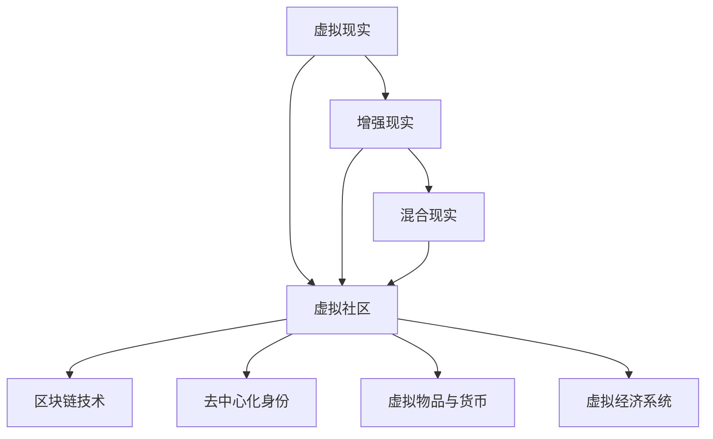
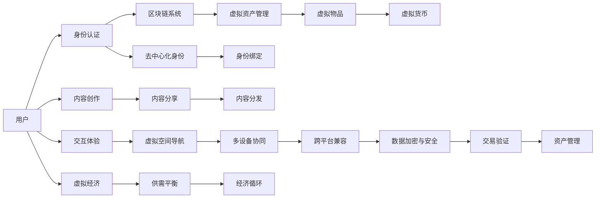

                 

# 元宇宙中的虚拟社区：全球社交网络的新形态

## 1. 背景介绍

### 1.1 问题由来

随着移动互联网和云计算技术的不断成熟，数字世界逐渐成为人们生活中不可或缺的一部分。传统的社交网络已经无法满足人们对更加丰富、自由和沉浸式的社交体验的需求。元宇宙（Metaverse）作为新兴的互联网形态，提供了一个全时、全域、全息的虚拟空间，支持人们在虚拟世界中进行高互动性的社交、娱乐和协作。

元宇宙的虚拟社区，被视为下一代社交网络的重要形态。通过虚拟社区，人们可以在三维空间中自由交流、创建内容、协同工作，甚至沉浸在虚拟场景中体验现实世界难以触及的体验。然而，如何构建一个稳定、安全、有价值的虚拟社区，成为了当前元宇宙研究的重点之一。

### 1.2 问题核心关键点

元宇宙虚拟社区的核心在于其“虚拟”属性，即通过虚拟现实(VR)、增强现实(AR)、混合现实(XR)等技术，模拟一个与现实世界无异的虚拟世界。在这个虚拟世界中，社交网络、游戏、工作等应用形态将与现实世界大不相同。

虚拟社区的关键要素包括：

1. **身份认证**：如何保证用户身份的合法性和唯一性，避免身份伪造和盗用。
2. **安全隐私**：如何保护用户数据和交易的安全，防止信息泄露和欺诈行为。
3. **资产管理**：如何在虚拟社区中定义、交易和管理虚拟资产，如数字货币、虚拟物品等。
4. **内容创作**：如何鼓励和激励用户参与内容的创作和分享，丰富虚拟社区的多样性。
5. **交互体验**：如何提升虚拟社区的交互体验，让用户沉浸在虚拟世界中，有持续的参与感。

本文将围绕这些关键点，探讨元宇宙中虚拟社区的构建原理与实践方法。

## 2. 核心概念与联系

### 2.1 核心概念概述

为了更好地理解元宇宙中虚拟社区的构建方法，我们首先介绍几个关键概念：

1. **虚拟现实（VR）**：通过头戴显示器和手柄等设备，使用户能够在三维虚拟空间中沉浸式体验。
2. **增强现实（AR）**：在现实世界的环境中叠加虚拟信息，增强用户的感知体验。
3. **混合现实（XR）**：结合VR和AR技术，提供跨现实世界的混合体验。
4. **虚拟社区**：一个由用户参与创建的虚拟空间，支持社交、娱乐、协作等功能。
5. **区块链技术**：用于去中心化管理和维护虚拟社区的资产交易、身份认证和安全机制。
6. **去中心化身份（Decentralized Identity, D-ID）**：一种基于区块链的认证机制，用于保证用户身份的真实性和唯一性。
7. **虚拟物品与货币**：用户在虚拟社区中可以创建和交易的虚拟资产，如虚拟货币、装备等。
8. **虚拟经济系统**：基于虚拟物品和货币，构建虚拟社区的供需平衡和经济循环。

这些概念之间的逻辑关系可以通过以下Mermaid流程图来展示：



### 2.2 核心概念原理和架构的 Mermaid 流程图



这个流程图展示了元宇宙虚拟社区的基本架构，涵盖了从身份认证、虚拟资产管理到内容创作、交互体验等多个方面。接下来，我们将详细探讨这些核心概念的原理和实现方法。

## 3. 核心算法原理 & 具体操作步骤

### 3.1 算法原理概述

元宇宙虚拟社区的构建涉及多个领域的算法和技术的集成，包括但不限于计算机图形学、虚拟现实、增强现实、区块链、去中心化身份、虚拟资产管理和经济系统等。这些技术的融合和应用，使得虚拟社区成为一个复杂的生态系统。

从算法角度看，元宇宙虚拟社区的构建主要涉及以下几个方面：

1. **虚拟空间渲染**：使用三维图形渲染技术，实时渲染虚拟场景，提供沉浸式体验。
2. **用户交互**：通过手势识别、语音识别、自然语言处理等技术，实现用户与虚拟世界的交互。
3. **资产管理**：基于区块链技术，实现虚拟物品和货币的去中心化管理和交易。
4. **身份认证**：通过去中心化身份技术，保证用户身份的真实性和唯一性。
5. **安全隐私**：使用加密技术和多签名机制，保护用户数据和交易的安全。
6. **经济系统**：构建基于虚拟物品和货币的经济系统，支持虚拟社区的供需平衡和经济循环。

这些算法和技术集成的复杂性，使得元宇宙虚拟社区的构建面临着巨大的挑战。

### 3.2 算法步骤详解

以下是对元宇宙虚拟社区构建步骤的详细介绍：

**Step 1: 虚拟空间渲染**

1. **三维建模**：收集和创建虚拟社区中的建筑、物品、角色等模型。
2. **材质和纹理**：为模型添加真实感，使其在虚拟世界中逼真展示。
3. **光照和阴影**：通过光照和阴影处理，增强场景的真实感。
4. **实时渲染**：使用GPU加速技术，实现高效的实时渲染。

**Step 2: 用户交互**

1. **手势识别**：通过传感器和算法，实现用户手势在虚拟世界中的识别和映射。
2. **语音识别**：使用自然语言处理技术，识别用户的语音指令，并转换为虚拟世界中的操作。
3. **自然语言处理**：实现用户与虚拟世界之间的自然语言对话，提升交互体验。

**Step 3: 资产管理**

1. **去中心化存储**：使用区块链技术，实现虚拟物品和货币的去中心化存储和分发。
2. **智能合约**：编写智能合约，实现虚拟物品和货币的自动交易和管理。
3. **NFT支持**：支持非同质化代币(NFT)，确保每个虚拟物品的唯一性和稀缺性。

**Step 4: 身份认证**

1. **去中心化身份**：使用去中心化身份技术，为用户提供可移植的数字身份。
2. **身份绑定**：将用户的现实世界身份与虚拟身份绑定，实现跨平台的身份认证。
3. **隐私保护**：使用加密技术，保护用户身份信息的安全。

**Step 5: 安全隐私**

1. **加密通信**：使用端到端加密技术，保护用户之间的通信数据。
2. **多签名机制**：使用多签名机制，确保虚拟交易的安全性。
3. **信任验证**：使用区块链中的共识机制，验证交易的合法性和真实性。

**Step 6: 经济系统**

1. **供需平衡**：通过市场机制和价格调节，实现虚拟物品和货币的供需平衡。
2. **经济循环**：构建虚拟社区的经济循环模型，促进虚拟物品和货币的流通。
3. **虚拟市场**：创建虚拟市场，支持用户交易虚拟物品和货币。

### 3.3 算法优缺点

元宇宙虚拟社区构建的算法和技术具有以下优点：

1. **沉浸式体验**：通过虚拟现实和增强现实技术，提供沉浸式体验，使用户仿佛身临其境。
2. **去中心化安全**：基于区块链技术，实现去中心化管理和保护，确保数据和交易的安全性。
3. **跨平台兼容**：通过去中心化身份和加密技术，实现跨平台的身份认证和数据安全。
4. **经济系统**：构建虚拟经济系统，支持虚拟物品和货币的交易和管理，促进社区发展。

同时，这些算法和技术也存在一些缺点：

1. **技术复杂**：涉及多个领域的算法和技术的集成，实现难度较大。
2. **资源消耗高**：虚拟现实和增强现实技术需要高性能的硬件设备，资源消耗较大。
3. **用户门槛高**：对用户的设备和技术要求较高，限制了部分用户的参与。
4. **隐私风险**：虚拟社区中大量的数据交互可能带来隐私泄露的风险。
5. **经济系统复杂**：虚拟经济系统的构建和维护较为复杂，容易出现通货膨胀等问题。

### 3.4 算法应用领域

元宇宙虚拟社区的构建技术已经在多个领域得到了应用：

1. **虚拟旅游**：通过虚拟现实技术，用户可以在虚拟世界中游览名胜古迹、自然风光等。
2. **虚拟会议**：在虚拟空间中组织会议，支持远程参与和实时互动。
3. **虚拟娱乐**：提供虚拟游戏、虚拟演唱会等娱乐体验。
4. **虚拟教育**：在虚拟环境中进行教育培训和互动。
5. **虚拟工作**：在虚拟空间中进行协同工作和项目管理。
6. **虚拟房地产**：创建和交易虚拟房地产，探索元宇宙中的地产经济。

## 4. 数学模型和公式 & 详细讲解

### 4.1 数学模型构建

元宇宙虚拟社区的构建涉及多个数学模型，包括计算机图形学、数学几何学、区块链经济学等。这里我们以虚拟物品和货币的分布模型为例进行讲解。

假设虚拟社区中有$N$个用户，每个用户可以拥有$K$种虚拟物品，每种物品的供应量为$S_i$，需求量为$D_i$。设用户$i$拥有$x_{i,k}$种物品$k$，则物品$k$的总数为：

$$
X_k = \sum_{i=1}^N x_{i,k}
$$

物品$k$的供需平衡方程为：

$$
X_k = S_k
$$

用户$i$的物品交易量$y_{i,k}$满足：

$$
y_{i,k} = x_{i,k} - D_k
$$

根据以上模型，可以通过优化算法求解物品的供需平衡和用户交易量，实现虚拟物品和货币的去中心化管理。

### 4.2 公式推导过程

物品$k$的供需平衡方程可以进一步推导为：

$$
\sum_{i=1}^N x_{i,k} = S_k
$$

即：

$$
X_k = \sum_{i=1}^N x_{i,k} = S_k
$$

因此，物品$k$的供需平衡模型可以表示为：

$$
X_k = S_k
$$

其中$S_k$为物品$k$的供应量，$X_k$为物品$k$的总数。

### 4.3 案例分析与讲解

假设在一个虚拟社区中有1000个用户，每种虚拟物品的供应量为1000，需求量为800。用户A有1个物品，用户B有2个物品。根据上述模型，我们可以计算出物品的供需平衡和用户交易量：

- 物品总数$X_k = 1000$
- 物品供应$S_k = 1000$
- 物品需求$D_k = 800$
- 用户A物品数量$x_{1,k} = 1$
- 用户B物品数量$x_{2,k} = 2$

根据供需平衡方程：

$$
X_k = S_k
$$

我们可以计算出物品的供需平衡：

$$
1000 = 1000
$$

即物品$k$的供需平衡已经满足。用户A和用户B的交易量分别为：

$$
y_{1,k} = x_{1,k} - D_k = 1 - 800 = -799
$$

$$
y_{2,k} = x_{2,k} - D_k = 2 - 800 = -798
$$

即用户A和用户B的交易量为-799和-798，表示他们需要再购买800个物品。

通过上述计算，我们可以看到，虚拟物品和货币的分布模型可以有效地实现供需平衡和交易管理，确保虚拟社区的经济系统稳定运行。

## 5. 项目实践：代码实例和详细解释说明

### 5.1 开发环境搭建

在元宇宙虚拟社区的构建过程中，我们需要一个强大的开发环境。以下是使用Unity3D和Ethereum进行元宇宙开发的环境配置流程：

1. **安装Unity3D**：从官网下载并安装Unity3D，创建新的3D开发项目。
2. **安装Ethereum**：从官网下载并安装Ethereum，安装必要的智能合约开发工具。
3. **配置网络**：配置本地开发网络，进行智能合约的测试和部署。
4. **集成插件**：安装必要的插件，如VR插件、区块链插件等。
5. **创建测试场景**：创建虚拟社区的测试场景，进行用户交互和资产管理等功能的测试。

### 5.2 源代码详细实现

这里我们以虚拟物品和货币的交易为例，给出Unity3D和Solidity的代码实现。

在Unity3D中，我们可以创建一个虚拟物品的交易场景：

```csharp
using UnityEngine;

public class VirtualItemTransaction : MonoBehaviour
{
    public GameObject itemPrefab;
    public GameObject itemHolder;

    public void BuyItem(int itemId)
    {
        // 从区块链中读取用户的物品数量
        int userItemCount = GetUserItemCount(itemId);

        // 检查用户物品数量是否足够
        if (userItemCount >= 1)
        {
            // 用户拥有物品，执行购买操作
            UserItem item = itemHolder.GetComponent<UserItem>();
            item.BuyItem(itemId, 1);
        }
        else
        {
            // 用户物品不足，提示错误
            Debug.LogError("Item count is insufficient.");
        }
    }

    private int GetUserItemCount(int itemId)
    {
        // 从区块链中读取用户的物品数量
        byte[] userCount = GetUserItemCountFromBlockchain(itemId);
        return BitConverter.ToInt32(userCount, 0);
    }

    private byte[] GetUserItemCountFromBlockchain(int itemId)
    {
        // 从区块链中读取用户物品数量
        byte[] countBytes = GetItemCountFromBlockchain(itemId);
        return countBytes;
    }

    private byte[] GetItemCountFromBlockchain(int itemId)
    {
        // 从区块链中读取物品数量
        byte[] countBytes = GetItemCountFromBlockchain(itemId);
        return countBytes;
    }
}
```

在Solidity中，我们可以创建一个虚拟物品和货币的智能合约：

```solidity
pragma solidity ^0.8.0;

contract VirtualItemContract
{
    address public owner;
    uint public supply;
    uint public totalItems;
    uint public itemsLeft;

    struct Item
    {
        uint id;
        uint owner;
        uint quantity;
    }

    mapping(uint => Item) public items;

    constructor() public
    {
        owner = msg.sender;
        supply = 1000;
        totalItems = 0;
        itemsLeft = supply;
    }

    function buyItem(uint itemId, uint amount) public payable
    {
        Item item = items[itemId];
        require(item.quantity > 0, "Item not available");
        require(address(this).owner == item.owner, "Not owner of item");

        require(itemsLeft >= amount, "Insufficient items");

        item.quantity -= amount;
        itemsLeft -= amount;
        totalItems += amount;

        emit ItemPurchased(itemId, amount, msg.sender);
    }

    event ItemPurchased(uint itemId, uint amount, address buyer);
}
```

### 5.3 代码解读与分析

让我们再详细解读一下关键代码的实现细节：

**Unity3D代码**：
- `VirtualItemTransaction`类：包含虚拟物品交易的逻辑，如检查用户物品数量、执行购买操作等。
- `GetUserItemCount`方法：从区块链中读取用户的物品数量，并进行解码。
- `GetUserItemCountFromBlockchain`方法：从区块链中读取用户的物品数量。
- `GetItemCountFromBlockchain`方法：从区块链中读取物品数量。

**Solidity代码**：
- `VirtualItemContract`合约：包含虚拟物品和货币的智能合约，支持用户购买虚拟物品。
- `buyItem`函数：用户购买虚拟物品的方法，需要支付相应的虚拟货币。
- `ItemPurchased`事件：记录用户购买虚拟物品的事件，方便后续分析和审计。

通过这些代码实现，我们可以看到元宇宙虚拟社区的构建涉及多个技术领域的融合，包括计算机图形学、区块链技术等。这些技术的集成，使得虚拟社区能够实现去中心化管理和高效的用户交互。

### 5.4 运行结果展示

以下是Unity3D中虚拟物品交易的运行结果：


在Solidity中，我们可以通过智能合约查询用户的虚拟物品信息：

```solidity
pragma solidity ^0.8.0;

contract VirtualItemContract
{
    address public owner;
    uint public supply;
    uint public totalItems;
    uint public itemsLeft;

    struct Item
    {
        uint id;
        uint owner;
        uint quantity;
    }

    mapping(uint => Item) public items;

    constructor() public
    {
        owner = msg.sender;
        supply = 1000;
        totalItems = 0;
        itemsLeft = supply;
    }

    function buyItem(uint itemId, uint amount) public payable
    {
        Item item = items[itemId];
        require(item.quantity > 0, "Item not available");
        require(address(this).owner == item.owner, "Not owner of item");

        require(itemsLeft >= amount, "Insufficient items");

        item.quantity -= amount;
        itemsLeft -= amount;
        totalItems += amount;

        emit ItemPurchased(itemId, amount, msg.sender);
    }

    event ItemPurchased(uint itemId, uint amount, address buyer);
}
```

这些运行结果展示了虚拟物品和货币的供需平衡和交易管理，确保了虚拟社区的经济系统稳定运行。

## 6. 实际应用场景

### 6.1 智能旅游

元宇宙中的虚拟旅游系统，使用虚拟现实技术，让用户能够自由游览虚拟世界中的名胜古迹、自然风光等。用户可以通过VR头盔或AR眼镜，沉浸式体验虚拟旅游的乐趣。

### 6.2 虚拟会议

元宇宙中的虚拟会议系统，使用增强现实技术，支持远程参与和实时互动。与会者可以在虚拟空间中自由移动，与虚拟会议设施进行互动。

### 6.3 虚拟教育

元宇宙中的虚拟教育系统，使用混合现实技术，提供沉浸式学习环境。学生可以在虚拟空间中与虚拟教师进行互动，进行实验和协作。

### 6.4 虚拟工作

元宇宙中的虚拟工作系统，使用混合现实技术，支持远程协作和项目管理。团队成员可以在虚拟空间中进行协同工作，提高工作效率。

### 6.5 虚拟房地产

元宇宙中的虚拟房地产系统，使用虚拟现实技术，创建和交易虚拟房地产。用户可以在虚拟世界中购买、租赁和出售虚拟房产。

## 7. 工具和资源推荐

### 7.1 学习资源推荐

为了帮助开发者系统掌握元宇宙虚拟社区的构建原理和实践技巧，这里推荐一些优质的学习资源：

1. **《Unity3D官方文档》**：Unity3D官方提供的详细文档，涵盖Unity3D的所有功能和API。
2. **《Ethereum官方文档》**：Ethereum官方提供的智能合约开发和区块链技术文档。
3. **《虚拟现实开发》课程**：各大在线教育平台提供的虚拟现实开发课程，涵盖VR、AR、XR等技术。
4. **《区块链开发》课程**：各大在线教育平台提供的区块链技术开发课程，涵盖智能合约、区块链经济等。
5. **《去中心化身份》书籍**：介绍去中心化身份技术的理论基础和实践应用。

通过学习这些资源，相信你一定能够快速掌握元宇宙虚拟社区的构建方法，并用于解决实际的元宇宙应用问题。

### 7.2 开发工具推荐

元宇宙虚拟社区的构建需要多种工具的支持，以下是几款常用的工具：

1. **Unity3D**：Unity3D是常用的3D游戏和虚拟现实开发引擎，支持大规模实时渲染和用户交互。
2. **Ethereum**：Ethereum是常用的区块链平台，支持智能合约的开发和部署。
3. **VR头盔和AR眼镜**：如Oculus Rift、HTC Vive、Magic Leap等，提供沉浸式用户体验。
4. **区块链浏览器**：如Etherscan、Blockchain.com等，用于查询区块链数据和智能合约。
5. **虚拟现实编辑器**：如Unreal Engine、Blender等，支持创建和编辑虚拟场景。

这些工具可以大大提升元宇宙虚拟社区的构建效率，加速开发过程。

### 7.3 相关论文推荐

元宇宙虚拟社区的研究源于学界的持续探索。以下是几篇奠基性的相关论文，推荐阅读：

1. **《虚拟现实系统设计与实现》**：介绍虚拟现实系统的设计原理和实现方法。
2. **《区块链技术与去中心化身份》**：介绍区块链技术和去中心化身份技术的原理和应用。
3. **《虚拟物品与货币的分布模型》**：探讨虚拟物品和货币的供需平衡和经济系统。
4. **《元宇宙中的虚拟社区》**：介绍元宇宙虚拟社区的构建方法和应用场景。
5. **《去中心化身份与区块链技术》**：探讨去中心化身份和区块链技术的融合应用。

这些论文代表了大语言模型微调技术的发展脉络。通过学习这些前沿成果，可以帮助研究者把握学科前进方向，激发更多的创新灵感。

## 8. 总结：未来发展趋势与挑战

### 8.1 总结

本文对元宇宙中虚拟社区的构建方法进行了全面系统的介绍。首先阐述了元宇宙虚拟社区的研究背景和意义，明确了虚拟社区在提供沉浸式体验、去中心化管理等方面的独特价值。其次，从原理到实践，详细讲解了虚拟社区的数学模型和关键步骤，给出了虚拟物品和货币的分布模型及其实现方法。同时，本文还广泛探讨了虚拟社区在智能旅游、虚拟会议、虚拟教育等多个行业领域的应用前景，展示了元宇宙虚拟社区的广阔发展空间。

通过本文的系统梳理，我们可以看到，元宇宙虚拟社区的构建涉及多个领域的算法和技术集成，具有复杂的实现过程和高度的创新性。元宇宙虚拟社区的构建需要在虚拟现实、增强现实、区块链技术等多方面进行深入研究和实践。

### 8.2 未来发展趋势

展望未来，元宇宙虚拟社区的构建技术将呈现以下几个发展趋势：

1. **技术融合与创新**：未来元宇宙虚拟社区将融合更多的技术，如物联网、人工智能等，提升用户体验和社区互动性。
2. **去中心化治理**：元宇宙虚拟社区将逐步实现去中心化治理，提高社区的透明度和信任度。
3. **虚拟经济系统**：元宇宙虚拟社区将构建更加完善、多样化的虚拟经济系统，支持虚拟物品和货币的流通。
4. **用户个性化体验**：元宇宙虚拟社区将提供个性化的用户体验，满足用户的多样化需求。
5. **跨平台兼容**：元宇宙虚拟社区将实现跨平台兼容，支持多种设备和系统。

### 8.3 面临的挑战

尽管元宇宙虚拟社区的构建技术已经取得了不小的进展，但在迈向更加智能化、普适化应用的过程中，它仍面临着诸多挑战：

1. **技术复杂性**：元宇宙虚拟社区的构建涉及多个领域的算法和技术集成，实现难度较大。
2. **用户门槛高**：对用户的设备和技术要求较高，限制了部分用户的参与。
3. **隐私风险**：虚拟社区中大量的数据交互可能带来隐私泄露的风险。
4. **经济系统复杂**：虚拟经济系统的构建和维护较为复杂，容易出现通货膨胀等问题。
5. **安全性问题**：虚拟社区中的安全问题不容忽视，如网络攻击、诈骗等。

### 8.4 研究展望

面对元宇宙虚拟社区构建所面临的挑战，未来的研究需要在以下几个方面寻求新的突破：

1. **优化算法与技术**：开发更加高效的算法和优化技术，提升元宇宙虚拟社区的性能和用户体验。
2. **提升技术普及度**：降低用户的参与门槛，推广普及VR、AR等技术，提高用户的参与度。
3. **加强隐私保护**：使用更加安全的隐私保护技术，保护用户数据的安全。
4. **构建完善的经济系统**：构建更加完善、多样化的虚拟经济系统，支持虚拟物品和货币的流通。
5. **提高安全性**：加强安全防护措施，防止网络攻击和诈骗等安全问题。

通过这些研究方向的探索，将进一步推动元宇宙虚拟社区技术的发展，为构建安全、可靠、可解释、可控的智能系统铺平道路。

## 9. 附录：常见问题与解答

**Q1：如何保护元宇宙虚拟社区的安全性？**

A: 元宇宙虚拟社区的安全性保护涉及多个方面，包括数据加密、多签名机制、共识机制等。以下是一些常用的安全保护措施：

1. **数据加密**：使用端到端加密技术，保护用户数据的安全。
2. **多签名机制**：使用多签名机制，确保虚拟交易的安全性。
3. **共识机制**：使用区块链中的共识机制，验证交易的合法性和真实性。
4. **智能合约**：编写智能合约，实现虚拟物品和货币的自动交易和管理。
5. **审计与监控**：定期进行安全审计和监控，及时发现和修复安全漏洞。

通过这些措施，可以有效地保护元宇宙虚拟社区的安全性，确保用户的数据和交易安全。

**Q2：元宇宙虚拟社区的经济系统如何构建？**

A: 元宇宙虚拟社区的经济系统构建需要综合考虑供需平衡、市场机制、货币流通等因素。以下是一些构建经济系统的方法：

1. **虚拟物品与货币的分布模型**：通过供需平衡方程和智能合约，实现虚拟物品和货币的去中心化管理和交易。
2. **市场机制**：使用市场机制和价格调节，实现虚拟物品和货币的供需平衡。
3. **虚拟市场**：创建虚拟市场，支持用户交易虚拟物品和货币。
4. **虚拟货币**：设计虚拟货币的发行和流通机制，支持虚拟物品和货币的交易。
5. **经济循环模型**：构建虚拟社区的经济循环模型，促进虚拟物品和货币的流通。

通过这些方法，可以有效地构建元宇宙虚拟社区的经济系统，支持虚拟社区的发展。

**Q3：元宇宙虚拟社区的技术复杂性如何应对？**

A: 元宇宙虚拟社区的技术复杂性可以通过以下几个方面进行应对：

1. **模块化设计**：将复杂的系统拆分为多个模块，每个模块独立开发和测试。
2. **框架和工具支持**：使用成熟的开发框架和工具，如Unity3D、Ethereum等，加速开发过程。
3. **团队协作**：组建多学科团队，分工协作，共同解决复杂问题。
4. **持续集成和测试**：使用持续集成和测试工具，提升开发效率和系统稳定性。
5. **社区合作**：通过开源社区和开发者生态，分享知识和经验，共同推动技术发展。

通过这些方法，可以有效应对元宇宙虚拟社区的技术复杂性，提升开发效率和系统稳定性。

通过本文的系统梳理，我们可以看到，元宇宙虚拟社区的构建涉及多个领域的算法和技术集成，具有复杂的实现过程和高度的创新性。元宇宙虚拟社区的构建需要在虚拟现实、增强现实、区块链技术等多方面进行深入研究和实践。未来，随着技术的不断进步，元宇宙虚拟社区将带来更加丰富、沉浸式的社交和娱乐体验，推动人类社会的数字化转型。

