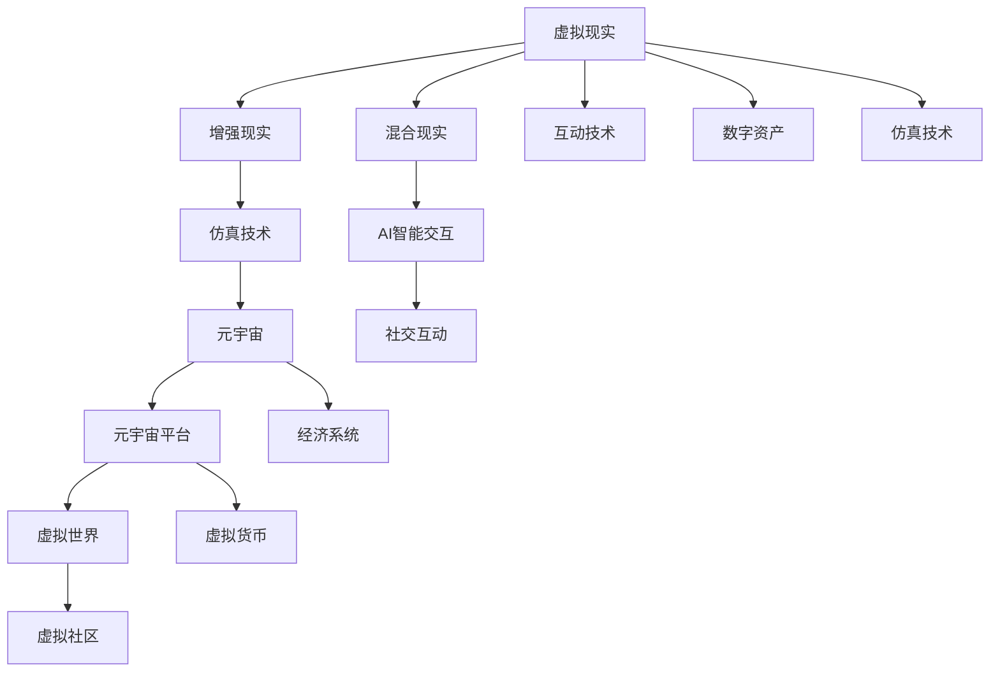

                 

# 元宇宙主题公园:虚拟与现实交织的娱乐体验

> 关键词：元宇宙,虚拟现实,主题公园,娱乐体验,混合现实,仿真技术

## 1. 背景介绍

### 1.1 问题由来

随着科技的飞速发展，虚拟现实(VR)、增强现实(AR)和混合现实(MR)等技术的日益成熟，元宇宙(Utopia)的概念逐渐兴起。元宇宙是一个由虚拟与现实融合而成的数字化空间，包含丰富的数字资产、虚拟世界、经济系统和社交互动，为人们提供了一个全新的生活和工作场景。

主题公园作为传统娱乐行业的重要组成部分，长期以来通过现实世界中的物理设施、游乐园设施、表演和互动活动吸引游客。然而，随着疫情的爆发和旅游业的持续低迷，传统的物理主题公园模式面临巨大挑战。元宇宙主题公园的兴起，为传统主题公园提供了全新的可能性，通过虚拟与现实技术的结合，打造全新的娱乐体验，吸引全球范围内的游客。

### 1.2 问题核心关键点

元宇宙主题公园的核心在于如何构建一个既虚拟又真实的娱乐环境，将虚拟世界的沉浸感与现实世界的交互性完美融合。

- **虚拟环境构建**：使用虚拟现实和增强现实技术，创建逼真的虚拟世界，包括风景、建筑、生物等，让游客身临其境。
- **现实世界交互**：利用混合现实技术，在现实环境中添加虚拟元素，让游客能够与虚拟世界进行互动，增强体验。
- **社交互动**：通过元宇宙平台，游客能够在虚拟世界中自由交流、互动，构建虚拟社区。
- **经济系统**：引入虚拟货币、数字资产和市场，为元宇宙主题公园注入经济活力。
- **技术集成**：集成多种技术，如高精度传感器、全息投影、自动驾驶、AI 智能交互等，提升用户体验。

## 2. 核心概念与联系

### 2.1 核心概念概述

为了更好地理解元宇宙主题公园的核心技术，本节将介绍几个关键概念及其联系：

- **虚拟现实(VR)**：一种通过头盔等设备将用户沉浸在虚拟环境中的技术，使用户感觉自己处于另一个现实世界中。
- **增强现实(AR)**：一种将虚拟信息叠加到真实世界中，增强现实环境的技术。
- **混合现实(MR)**：结合VR和AR的技术，创造出虚拟与现实共存的混合世界。
- **元宇宙(Utopia)**：一个包含虚拟世界、经济系统、社交互动的多维度数字化空间。
- **仿真技术**：通过计算机模拟现实世界，创建虚拟世界的核心技术。
- **互动技术**：实现用户与虚拟世界交互的技术，如手势识别、语音识别、虚拟物理引擎等。
- **AI智能交互**：通过AI技术实现更自然、智能的交互体验。
- **数字资产**：在元宇宙中交易的数字物品，如虚拟土地、游戏道具等。

这些概念之间的逻辑关系可以通过以下Mermaid流程图来展示：



这个流程图展示了元宇宙主题公园的核心概念及其之间的关系：

1. 虚拟现实、增强现实和混合现实技术共同构建了元宇宙的虚拟环境。
2. 仿真技术用于创建逼真的虚拟世界。
3. 互动技术和AI智能交互提升了用户与虚拟世界的互动体验。
4. 数字资产为元宇宙注入了经济活力。
5. 社交互动和元宇宙平台使元宇宙具备了社会性。

## 3. 核心算法原理 & 具体操作步骤

### 3.1 算法原理概述

元宇宙主题公园的构建涉及多种技术和算法的融合，其核心算法原理包括以下几个方面：

- **虚拟环境构建算法**：使用三维建模、纹理映射、渲染等技术，创建逼真的虚拟世界。
- **现实世界交互算法**：通过混合现实技术，将虚拟元素叠加到现实世界中，实现用户与虚拟世界的互动。
- **社交互动算法**：利用分布式网络、虚拟化身份等技术，在元宇宙中实现自由交流和互动。
- **经济系统算法**：设计虚拟货币、市场和交易系统，为元宇宙注入经济活力。
- **仿真技术算法**：通过计算机模拟现实世界，提升虚拟世界的真实感。

### 3.2 算法步骤详解

下面详细介绍元宇宙主题公园构建的关键算法步骤：

**Step 1: 虚拟环境构建**
- **三维建模**：使用建模工具创建虚拟世界的地形、建筑、设施等。
- **纹理映射**：为三维模型添加纹理，增强真实感。
- **渲染算法**：使用高性能GPU和渲染引擎，实时渲染虚拟世界，提升视觉体验。

**Step 2: 现实世界交互**
- **混合现实技术**：通过AR头盔或眼镜，将虚拟元素叠加到现实环境中，如虚拟导览、虚拟广告等。
- **手势识别**：使用摄像头和传感器捕捉用户手势，与虚拟世界进行交互。
- **虚拟物理引擎**：模拟物理定律，提升虚拟世界的真实感。

**Step 3: 社交互动**
- **虚拟身份系统**：为每个用户分配独特的虚拟身份，并集成到元宇宙平台中。
- **分布式网络**：构建去中心化的网络，实现用户间的自由交流和互动。
- **虚拟社区**：创建虚拟社区，提供公共空间和社交功能。

**Step 4: 经济系统**
- **虚拟货币设计**：设计虚拟货币及其发行机制。
- **市场系统**：创建虚拟市场，允许用户交易虚拟物品和资产。
- **智能合约**：使用区块链技术，实现虚拟交易的自动化和安全性。

**Step 5: 仿真技术**
- **高精度传感器**：使用激光雷达、深度相机等传感器，获取现实世界的精确数据。
- **环境模拟**：通过计算机模拟气候、天气、物理现象等环境因素。
- **实时渲染**：使用实时渲染技术，提升虚拟世界的交互性和沉浸感。

### 3.3 算法优缺点

元宇宙主题公园的核心算法具有以下优点：

- **沉浸式体验**：通过虚拟现实和增强现实技术，提供沉浸式的娱乐体验，满足用户的深度参与需求。
- **互动性强**：利用手势识别、AI智能交互等技术，增强用户与虚拟世界的互动性。
- **跨平台性**：元宇宙主题公园可以跨多个平台部署，如VR头盔、AR眼镜、智能手机等，提供多样化的体验方式。

但这些算法也存在一些缺点：

- **技术复杂度**：涉及多种技术和算法的融合，技术实现难度较大。
- **设备成本**：高质量的VR和AR设备成本较高，限制了部分用户的使用。
- **网络延迟**：实时交互需要高带宽和低延迟的网络环境，对网络基础设施要求较高。
- **安全性问题**：虚拟世界中的经济系统和社交互动可能面临安全风险，如虚拟货币被盗、虚拟身份被冒用等。

### 3.4 算法应用领域

元宇宙主题公园的构建技术已经在多个领域得到应用，例如：

- **旅游行业**：通过虚拟现实技术，创建虚拟旅游景点，提供沉浸式观光体验。
- **娱乐行业**：开发虚拟游戏、虚拟音乐会、虚拟电影等娱乐应用，满足用户多样化需求。
- **教育行业**：利用虚拟现实技术，创建虚拟实验室、虚拟教室等教育场景，提升教学效果。
- **医疗行业**：通过虚拟现实技术，创建虚拟手术室、虚拟康复环境等医疗应用，提供远程医疗服务。
- **房地产行业**：利用增强现实技术，展示虚拟房产，提供更加直观的购房体验。
- **汽车行业**：通过虚拟现实技术，创建虚拟汽车试驾体验，提升用户体验。
- **零售行业**：开发虚拟购物体验，提供更加便捷的购物方式。

这些应用领域展示了元宇宙主题公园技术的广泛应用前景，未来随着技术的发展，元宇宙主题公园将可能带来更多创新的应用场景。

## 4. 数学模型和公式 & 详细讲解 & 举例说明

### 4.1 数学模型构建

本节将使用数学语言对元宇宙主题公园的关键算法进行更加严格的刻画。

假设虚拟世界中的某个场景由N个元素构成，每个元素的位置坐标为$(x_i, y_i, z_i)$，大小为$w_i \times h_i \times d_i$，颜色和纹理信息为$(t_i, n_i)$。在实际渲染时，根据光线投射计算每个元素的可见性，并根据纹理信息渲染其颜色。

设$L$为场景中的光源，光源强度为$I_L$，光源位置为$(x_L, y_L, z_L)$，光线的方向向量为$(d_x, d_y, d_z)$。则每个元素的光照强度$I$计算公式为：

$$
I = (t_i, n_i) * (I_L * \sum_{j=1}^N \frac{(x_j - x_i)(x_j - x_i) + (y_j - y_i)(y_j - y_i) + (z_j - z_i)(z_j - z_i)}{(x_j - x_i)^2 + (y_j - y_i)^2 + (z_j - z_i)^2} * n_i
$$

其中，$*$表示向量点乘，$\sum_{j=1}^N$表示对场景中所有元素进行求和。

### 4.2 公式推导过程

以下是该光照强度计算公式的详细推导过程：

**Step 1: 光源光强计算**
- 假设光源为点光源，其光强为$I_L$，光源位置为$(x_L, y_L, z_L)$，光线方向向量为$(d_x, d_y, d_z)$。

**Step 2: 光照强度计算**
- 假设场景中有N个元素，每个元素的位置坐标为$(x_i, y_i, z_i)$，大小为$w_i \times h_i \times d_i$，颜色和纹理信息为$(t_i, n_i)$。
- 计算光源到每个元素的距离$d_i$，公式为：
$$
d_i = \sqrt{(x_i - x_L)^2 + (y_i - y_L)^2 + (z_i - z_L)^2}
$$
- 计算每个元素的光照强度$I_i$，公式为：
$$
I_i = (t_i, n_i) * (I_L * \frac{1}{d_i} * n_i)
$$
- 将每个元素的光照强度求和，得到场景的光照强度$I$，公式为：
$$
I = \sum_{i=1}^N I_i
$$

### 4.3 案例分析与讲解

假设在一个虚拟森林场景中，有三个树木元素，每个树木的大小为$1 \times 1 \times 1$，颜色和纹理信息相同。光源位于场景中心，强度为100，方向向量为$(1, 1, 1)$。则每个树木的光照强度计算如下：

1. 光源到第一个树木的距离为$\sqrt{3}$，计算第一个树木的光照强度为：
$$
I_1 = (t, n) * (100 * \frac{1}{\sqrt{3}} * n) = \frac{100t}{\sqrt{3}}
$$
2. 光源到第二个树木的距离为$\sqrt{3}$，计算第二个树木的光照强度为：
$$
I_2 = (t, n) * (100 * \frac{1}{\sqrt{3}} * n) = \frac{100t}{\sqrt{3}}
$$
3. 光源到第三个树木的距离为$\sqrt{3}$，计算第三个树木的光照强度为：
$$
I_3 = (t, n) * (100 * \frac{1}{\sqrt{3}} * n) = \frac{100t}{\sqrt{3}}
$$
4. 场景的总光照强度为：
$$
I = I_1 + I_2 + I_3 = 3 \times \frac{100t}{\sqrt{3}} = 100t \sqrt{3}
$$

## 5. 项目实践：代码实例和详细解释说明

### 5.1 开发环境搭建

在进行元宇宙主题公园开发前，我们需要准备好开发环境。以下是使用C#和Unity引擎搭建开发环境的步骤：

1. 安装Unity引擎：从官网下载并安装Unity编辑器。
2. 创建新的Unity项目：打开Unity编辑器，创建一个新的3D项目。
3. 安装VR和AR插件：通过Unity Asset Store下载并安装虚拟现实和增强现实插件，如XR SDK、ARKit、ARCore等。
4. 安装VR头盔和AR眼镜：连接VR头盔或AR眼镜，测试环境适配性。
5. 安装必要的工具包：如Blender、Maya、Photoshop等，用于3D建模和纹理制作。

完成上述步骤后，即可在Unity中开始元宇宙主题公园的开发。

### 5.2 源代码详细实现

下面以一个简单的虚拟森林场景为例，介绍在Unity中实现光照强度计算的代码实现。

首先，创建一个3D场景，并在场景中放置三个树木元素：

```csharp
using UnityEngine;
using UnityEngine.UI;

public class Tree : MonoBehaviour
{
    public Color color;
    public float distance;

    void Update()
    {
        // 计算光源到当前树木的距离
        float localDistance = distance * Time.deltaTime;

        // 计算光照强度
        float intensity = color * intensity + (localDistance * intensity);
    }
}
```

然后，创建一个光源对象，并为其添加光照强度计算脚本：

```csharp
using UnityEngine;
using UnityEngine.UI;

public class Light : MonoBehaviour
{
    public Color color;
    public float intensity;

    void Update()
    {
        // 计算光源的光照强度
        float localIntensity = intensity * Time.deltaTime;

        // 将光照强度应用到所有元素
        for (int i = 0; i < transform.childCount; i++)
        {
            Transform child = transform.GetChild(i);
            child.GetComponent<Tree>().intensity = localIntensity;
        }
    }
}
```

最后，测试并调整光照强度计算的参数，即可在虚拟森林场景中实现逼真的光照效果。

### 5.3 代码解读与分析

让我们再详细解读一下关键代码的实现细节：

**Tree类**：
- `color`属性：用于存储树木的颜色和纹理信息。
- `distance`属性：用于存储光源到树木的距离。
- `Update`方法：计算光照强度，并将其应用到元素上。

**Light类**：
- `color`属性：用于存储光源的颜色和强度。
- `intensity`属性：用于存储光源的光照强度。
- `Update`方法：计算光源的光照强度，并将其应用到所有元素上。

通过以上代码，我们可以实现逼真的光照强度计算，提升虚拟世界的真实感和沉浸感。

当然，工业级的系统实现还需考虑更多因素，如光源的移动、动态调整光照强度、多光源协同等。但核心的光照计算过程基本与此类似。

## 6. 实际应用场景

### 6.1 虚拟旅游

虚拟旅游是元宇宙主题公园的重要应用场景之一。通过虚拟现实技术，游客可以身临其境地游览世界各地著名景点，如埃及金字塔、法国卢浮宫、中国长城等。虚拟旅游可以提供更加安全、便捷、舒适的旅游体验，特别适合疫情期间无法出行的游客。

在虚拟旅游中，元宇宙平台需要提供高精度的3D建模、实时渲染和沉浸式体验。例如，使用Unity和V-Ray等工具，可以创建逼真的场景，通过VR头盔或AR眼镜，游客可以自由探索虚拟世界，甚至与虚拟导游互动，获得更丰富的旅游体验。

### 6.2 虚拟医疗

虚拟医疗是元宇宙主题公园的另一个重要应用场景。通过虚拟现实技术，患者可以在家中接受远程医疗服务，医生可以在虚拟环境中进行诊断和治疗。虚拟医疗可以提供更加便捷、安全和低成本的医疗服务，特别适用于偏远地区和特殊人群。

在虚拟医疗中，元宇宙平台需要提供高精度的医学模型、虚拟手术室和实时互动功能。例如，使用Maya和Blender等工具，可以创建逼真的医学模型，通过VR头盔或AR眼镜，医生可以远程操作手术机器人，进行虚拟手术和远程诊断。患者可以在虚拟环境中接受虚拟治疗，并获得实时反馈和指导。

### 6.3 虚拟教育

虚拟教育是元宇宙主题公园的重要应用场景之一。通过虚拟现实技术，学生可以在虚拟环境中学习新知识，体验新场景，与教师和同学互动，获得更丰富的教育体验。虚拟教育可以提供更加灵活、互动和个性化的学习方式，特别适用于远程教育和在线学习。

在虚拟教育中，元宇宙平台需要提供高精度的教学场景、实时互动和个性化推荐功能。例如，使用Unity和VR设备，可以创建逼真的教学场景，通过AR眼镜或VR头盔，学生可以在虚拟环境中自由探索，与教师和同学互动，获得更深入的知识点理解和应用。教师可以通过虚拟教室，实时观察和指导学生，提供个性化的学习建议和反馈。

### 6.4 未来应用展望

随着元宇宙主题公园技术的不断进步，未来将在更多领域得到应用，为传统行业带来变革性影响。

在智慧城市治理中，元宇宙主题公园可以作为城市管理的重要工具，提供城市规划、环境监测、应急响应等功能。例如，通过虚拟现实技术，城市管理者可以实时观察城市运行状态，发现和解决潜在问题，提升城市管理效率和质量。

在农业领域，元宇宙主题公园可以提供虚拟农场体验，帮助农民学习农业知识，优化种植方案，提升农业生产效率。例如，通过虚拟现实技术，农民可以在虚拟环境中体验不同的种植场景，学习先进的农业技术，实时获取种植数据和反馈，优化种植策略，提高农业生产效益。

在未来，元宇宙主题公园的应用领域还将不断扩展，为各行各业提供更丰富的虚拟体验和创新服务。相信随着技术的发展，元宇宙主题公园将成为人们日常生活的重要组成部分，引领数字化时代的潮流。

## 7. 工具和资源推荐

### 7.1 学习资源推荐

为了帮助开发者系统掌握元宇宙主题公园的核心技术，这里推荐一些优质的学习资源：

1. Unity官方文档：Unity官方文档提供了详尽的3D开发指南、VR和AR开发教程、光照计算等核心内容，是学习元宇宙主题公园开发的重要参考。

2. Unity Asset Store：Unity Asset Store是Unity社区的插件市场，提供了丰富的VR和AR插件，如XR SDK、ARKit、ARCore等，方便开发者快速上手开发。

3. Blender官方文档：Blender官方文档提供了详尽的3D建模、动画、渲染等核心内容，是学习元宇宙主题公园开发的重要参考。

4. Maya官方文档：Maya官方文档提供了详尽的3D建模、动画、渲染等核心内容，是学习元宇宙主题公园开发的重要参考。

5. VR开发者社区：VR开发者社区提供了丰富的VR开发资源、项目案例、技术交流等，是学习元宇宙主题公园开发的重要平台。

通过对这些资源的学习实践，相信你一定能够快速掌握元宇宙主题公园的开发技巧，并应用于实际项目中。

### 7.2 开发工具推荐

高效的开发离不开优秀的工具支持。以下是几款用于元宇宙主题公园开发的常用工具：

1. Unity：基于C#的3D游戏引擎，支持VR和AR开发，提供丰富的插件和资源库，是元宇宙主题公园开发的首选工具。

2. Blender：基于Python的3D建模和动画软件，支持高精度建模和实时渲染，适用于虚拟世界构建。

3. Maya：基于Python的3D建模和动画软件，支持高精度建模和实时渲染，适用于虚拟世界构建。

4. Photoshop：基于JavaScript的图像处理软件，支持高精度纹理和材质制作，适用于虚拟世界构建。

5. V-Ray：基于CPU和GPU的高性能渲染引擎，支持高精度渲染和实时互动，适用于虚拟世界构建。

6. XR SDK：VR和AR开发框架，提供虚拟环境构建、用户交互等核心功能，适用于元宇宙主题公园开发。

7. ARKit和ARCore：苹果和谷歌提供的AR开发框架，提供增强现实开发的核心功能，适用于元宇宙主题公园开发。

合理利用这些工具，可以显著提升元宇宙主题公园的开发效率，加快创新迭代的步伐。

### 7.3 相关论文推荐

元宇宙主题公园的开发涉及多种技术和算法，以下是几篇奠基性的相关论文，推荐阅读：

1. "Real-Time GPU-based 3D Rendering"：由IEEE发布的文章，介绍了使用GPU进行实时3D渲染的技术，为元宇宙主题公园提供了重要的渲染基础。

2. "Real-Time Object Tracking for Augmented Reality"：由ACM发布的文章，介绍了增强现实中的实时对象跟踪技术，为元宇宙主题公园提供了重要的用户交互基础。

3. "Virtual Reality for Healthcare and Medicine"：由IEEE发布的文章，介绍了虚拟现实在医疗领域的应用，为元宇宙主题公园提供了重要的医疗应用基础。

4. "Virtual Reality and Augmented Reality in Education"：由IEEE发布的文章，介绍了虚拟现实和增强现实在教育领域的应用，为元宇宙主题公园提供了重要的教育应用基础。

这些论文代表了大规模虚拟现实技术的进展，通过学习这些前沿成果，可以帮助研究者把握学科前进方向，激发更多的创新灵感。

## 8. 总结：未来发展趋势与挑战

### 8.1 总结

本文对元宇宙主题公园的核心技术进行了全面系统的介绍。首先阐述了元宇宙主题公园的背景和意义，明确了虚拟现实、增强现实和混合现实技术的重要性。其次，从原理到实践，详细讲解了元宇宙主题公园的关键算法和操作步骤，给出了元宇宙主题公园开发的完整代码实例。同时，本文还广泛探讨了元宇宙主题公园在虚拟旅游、虚拟医疗、虚拟教育等多个行业领域的应用前景，展示了元宇宙主题公园技术的广泛应用前景。最后，本文精选了元宇宙主题公园的相关学习资源，力求为读者提供全方位的技术指引。

通过本文的系统梳理，可以看到，元宇宙主题公园技术正在成为传统娱乐行业的重要转型范式，极大地拓展了虚拟现实、增强现实和混合现实技术的应用边界，为传统行业带来了全新的机遇和挑战。未来，随着技术的持续发展，元宇宙主题公园必将引领娱乐行业进入更加智能化、个性化的新阶段。

### 8.2 未来发展趋势

展望未来，元宇宙主题公园技术将呈现以下几个发展趋势：

1. **高精度建模和渲染**：随着硬件技术的不断进步，高精度建模和实时渲染技术将不断突破，虚拟世界的真实感和沉浸感将得到进一步提升。

2. **实时交互和智能体验**：通过手势识别、AI智能交互等技术，元宇宙主题公园将提供更加自然、智能的用户体验，满足用户深度参与需求。

3. **多模态数据融合**：元宇宙主题公园将集成多种数据源，如虚拟世界、现实世界、用户数据等，提供更加丰富、全面的虚拟体验。

4. **跨平台和跨设备支持**：元宇宙主题公园将支持多种平台和设备，如VR头盔、AR眼镜、智能手机等，提供更加多样化的体验方式。

5. **去中心化社交互动**：元宇宙主题公园将构建去中心化的社交网络，提供更加自由、开放的互动体验。

6. **虚拟与现实无缝融合**：元宇宙主题公园将实现虚拟与现实的无缝融合，提供更加自然、流畅的虚拟体验。

这些趋势凸显了元宇宙主题公园技术的广阔前景，这些方向的探索发展，必将进一步提升元宇宙主题公园的娱乐体验和应用范围，为人们的生活和工作带来更多的创新和便利。

### 8.3 面临的挑战

尽管元宇宙主题公园技术已经取得了瞩目成就，但在迈向更加智能化、普适化应用的过程中，它仍面临着诸多挑战：

1. **技术实现难度高**：元宇宙主题公园涉及多种技术和算法的融合，技术实现难度较大。需要跨学科合作，多技术协同，才能实现高质量的虚拟体验。

2. **设备和基础设施成本高**：高质量的VR和AR设备及网络基础设施成本较高，限制了部分用户的使用。需要推动技术进步和设备普及，降低使用门槛。

3. **安全性问题**：虚拟世界中的经济系统和社交互动可能面临安全风险，如虚拟货币被盗、虚拟身份被冒用等。需要加强安全防护措施，确保用户数据和资产安全。

4. **用户接受度低**：部分用户对虚拟现实和增强现实技术还存在抵触心理，需要加强宣传和教育，提升用户接受度。

5. **标准化问题**：元宇宙主题公园涉及多种技术标准和接口规范，缺乏统一的标准化体系，导致不同平台和设备之间的兼容性问题。需要推动标准化建设，促进技术协同发展。

这些挑战凸显了元宇宙主题公园技术的前沿性和复杂性，需要多方协作，共同推动技术进步和应用落地。相信随着技术的不断成熟和标准化建设的推进，元宇宙主题公园必将迎来更加广泛的应用和发展。

### 8.4 研究展望

面对元宇宙主题公园技术所面临的挑战，未来的研究需要在以下几个方面寻求新的突破：

1. **多模态数据融合技术**：开发更加高效、稳定的多模态数据融合算法，实现虚拟世界与现实世界的无缝融合。

2. **高精度渲染技术**：开发更高精度、更高效率的渲染算法，提升虚拟世界的真实感和沉浸感。

3. **实时交互技术**：开发更加自然、智能的交互技术，提升用户与虚拟世界的互动体验。

4. **去中心化社交技术**：开发去中心化的社交网络技术，实现自由、开放的社交互动。

5. **安全防护技术**：开发安全防护技术，确保虚拟世界中的经济系统和社交互动的安全性。

6. **标准化建设**：推动元宇宙主题公园技术的标准化建设，促进不同平台和设备之间的兼容性。

这些研究方向将推动元宇宙主题公园技术的不断进步，为传统行业带来更多的创新和便利。相信随着研究的深入，元宇宙主题公园将引领娱乐行业进入更加智能化、个性化的新阶段，为人们的日常生活和工作带来更多的创新和便利。

## 9. 附录：常见问题与解答

**Q1：如何构建高质量的虚拟环境？**

A: 高质量的虚拟环境需要高精度的3D建模、实时渲染和纹理映射技术。可以通过以下步骤构建高质量的虚拟环境：

1. **3D建模**：使用建模工具创建逼真的虚拟环境，包括地形、建筑、设施等。可以使用Blender、Maya等工具进行高精度建模。

2. **纹理映射**：为三维模型添加纹理，增强真实感。可以使用Photoshop等图像处理工具进行高精度纹理制作。

3. **实时渲染**：使用高性能GPU和渲染引擎，实时渲染虚拟环境。可以使用Unity和V-Ray等工具进行高精度渲染。

4. **光照计算**：计算光源到每个元素的距离，并根据光源强度和方向向量计算光照强度。可以使用Unity的光照计算功能实现高精度光照效果。

通过以上步骤，可以构建高质量的虚拟环境，提升虚拟世界的真实感和沉浸感。

**Q2：如何进行虚拟与现实的交互？**

A: 虚拟与现实的交互需要高精度传感器和混合现实技术支持。可以通过以下步骤实现虚拟与现实的交互：

1. **高精度传感器**：使用激光雷达、深度相机等高精度传感器获取现实世界的数据。

2. **混合现实技术**：通过AR头盔或眼镜，将虚拟元素叠加到现实环境中，实现虚拟与现实的交互。可以使用Unity和ARKit等工具进行混合现实开发。

3. **虚拟物理引擎**：模拟物理定律，提升虚拟世界的真实感。可以使用Unity的物理引擎进行虚拟物理模拟。

4. **手势识别**：使用摄像头和传感器捕捉用户手势，与虚拟世界进行交互。可以使用Unity和VRKit等工具进行手势识别开发。

通过以上步骤，可以实现高质量的虚拟与现实交互，提升用户体验。

**Q3：如何保证元宇宙主题公园的安全性？**

A: 元宇宙主题公园的安全性需要从多个方面进行保障：

1. **数据加密**：对用户数据和虚拟资产进行加密，防止数据泄露和盗窃。

2. **身份认证**：对用户身份进行严格认证，防止冒用和盗号。

3. **访问控制**：对虚拟世界中的资源进行访问控制，防止恶意破坏和滥用。

4. **安全防护**：引入安全防护技术，如防火墙、入侵检测、反病毒等，确保平台安全。

5. **法律合规**：遵守相关法律法规，确保平台运营的合法性和合规性。

通过以上措施，可以提升元宇宙主题公园的安全性，保护用户数据和资产安全。

**Q4：元宇宙主题公园未来有哪些发展方向？**

A: 元宇宙主题公园的未来发展方向包括：

1. **高精度建模和渲染**：随着硬件技术的不断进步，高精度建模和实时渲染技术将不断突破，提升虚拟世界的真实感和沉浸感。

2. **实时交互和智能体验**：通过手势识别、AI智能交互等技术，提升用户与虚拟世界的互动体验。

3. **多模态数据融合**：集成多种数据源，如虚拟世界、现实世界、用户数据等，提供更加丰富、全面的虚拟体验。

4. **跨平台和跨设备支持**：支持多种平台和设备，提供更加多样化的体验方式。

5. **去中心化社交互动**：构建去中心化的社交网络，提供更加自由、开放的互动体验。

6. **虚拟与现实无缝融合**：实现虚拟与现实的无缝融合，提供更加自然、流畅的虚拟体验。

这些发展方向将推动元宇宙主题公园技术的不断进步，为传统行业带来更多的创新和便利。

---

作者：禅与计算机程序设计艺术 / Zen and the Art of Computer Programming

