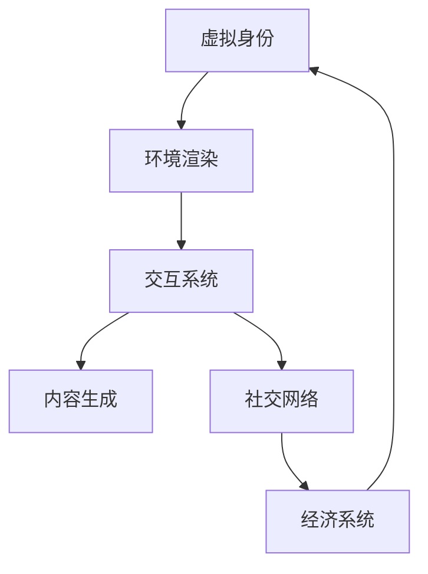

                 

# 元宇宙娱乐：沉浸式体验的极致追求

## 1. 背景介绍

随着数字技术的发展，元宇宙（Metaverse）正在逐步从概念走向现实，并成为科技和娱乐领域的重要热点。元宇宙的本质是创建一个高度逼真且可交互的数字世界，用户在其中可以通过虚拟身份参与各种社交、工作和娱乐活动。元宇宙娱乐因其沉浸式体验、高互动性和广阔的商业前景，正迅速吸引全球玩家和开发者。

### 1.1 问题由来

传统的线上游戏和娱乐内容虽然已经较为丰富，但依然无法满足用户在社交、互动、个性化体验等方面的需求。元宇宙娱乐旨在通过更加沉浸、互动和多样化的方式，重新定义在线娱乐的边界，提供全新的体验。

### 1.2 问题核心关键点

元宇宙娱乐的核心在于创造一个高度真实且互动的虚拟环境，让用户能够在这个虚拟空间中自由探索、互动交流和创作。这要求元宇宙平台具备以下几个关键能力：

- **虚拟身份**：用户需要能够在虚拟世界中以高度逼真的虚拟形象存在。
- **环境渲染**：虚拟世界的视觉效果需要高度逼真，以吸引用户的沉浸体验。
- **交互系统**：支持用户间的语音、文字和动作等互动，实现真正的“在场感”。
- **内容生成**：提供多样化的游戏和娱乐内容，让用户能进行个性化体验。
- **社交网络**：构建丰富多样的社交关系，促进用户间的交流和协作。
- **经济系统**：允许用户通过虚拟货币进行交易和交换，形成虚拟经济。

## 2. 核心概念与联系

### 2.1 核心概念概述

元宇宙娱乐涵盖了虚拟身份、环境渲染、交互系统、内容生成、社交网络和经济系统等多个关键组件，各个组件之间相互协作，共同构建了一个完整的沉浸式体验环境。以下对各核心概念进行详细阐述：

- **虚拟身份**：通过虚拟形象和设备，用户能够在虚拟世界中进行交流和互动。虚拟身份需要具备高度逼真的外观、行为和个性特征。
- **环境渲染**：使用先进的图形渲染技术，创建逼真的虚拟环境，包括天气、地形、光照和动态效果等。
- **交互系统**：支持用户在虚拟环境中进行语音、文字和动作等形式的互动，确保互动的真实感和即时性。
- **内容生成**：包括游戏、视频、音频等多媒体内容的自动生成，满足用户的多样化需求。
- **社交网络**：建立虚拟世界中的社交关系和网络结构，支持用户间的交流、协作和社交活动。
- **经济系统**：引入虚拟货币和经济机制，实现虚拟世界的经济活动和交易。

### 2.2 核心概念原理和架构的 Mermaid 流程图(Mermaid 流程节点中不要有括号、逗号等特殊字符)



此图展示了元宇宙娱乐的各个核心组件之间的相互关系和依赖。虚拟身份、环境渲染、交互系统、内容生成、社交网络和经济系统共同构成了元宇宙娱乐的生态系统。

## 3. 核心算法原理 & 具体操作步骤

### 3.1 算法原理概述

元宇宙娱乐的实现依赖于多种计算机技术和算法的综合应用，包括图形渲染、交互处理、内容生成、社交网络和经济系统等多个方面。以下是一些核心的算法原理：

- **环境渲染**：基于实时渲染技术（如虚幻引擎、Unity引擎等），利用光线追踪、物理模拟等算法，实现高度逼真的虚拟环境。
- **交互系统**：使用自然语言处理（NLP）和计算机视觉（CV）技术，实现语音识别、动作捕捉和手势识别等交互方式。
- **内容生成**：采用生成对抗网络（GAN）、变分自编码器（VAE）等算法，自动生成高质量的游戏、视频和音频内容。
- **社交网络**：基于社交图谱和推荐算法，构建虚拟社交网络，实现用户间的个性化推荐和互动。
- **经济系统**：利用区块链技术和智能合约，实现虚拟货币的生成、交易和管理，保障经济系统的安全性和稳定性。

### 3.2 算法步骤详解

元宇宙娱乐的实现过程大致分为以下几个步骤：

1. **虚拟身份创建**：用户通过VR/AR设备，创建自己的虚拟形象，并根据需要进行个性化定制。
2. **环境渲染优化**：根据用户所在的虚拟世界，使用图形渲染技术，创建逼真的环境场景和动态效果。
3. **交互系统集成**：集成语音、文字和动作识别技术，实现用户间的互动和交流。
4. **内容生成和推荐**：自动生成或推荐适合用户兴趣的游戏、视频和音频内容，并根据用户行为进行调整。
5. **社交网络构建**：基于用户的互动和关系，构建虚拟社交网络，并支持用户间的交流和协作。
6. **经济系统部署**：引入虚拟货币和经济机制，实现虚拟世界的经济活动和交易。

### 3.3 算法优缺点

元宇宙娱乐的算法和系统具有以下优点：

- **沉浸式体验**：通过高度逼真的环境渲染和交互系统，为用户提供沉浸式的虚拟体验。
- **多样性丰富**：通过内容生成和推荐系统，满足用户多样化的娱乐需求。
- **高互动性**：基于先进的NLP和CV技术，实现用户间的高度互动。
- **广泛应用场景**：元宇宙娱乐的应用场景广泛，覆盖游戏、社交、工作等多个领域。

同时，也存在一些缺点：

- **技术门槛高**：实现高质量的虚拟环境和实时渲染需要高水平的计算机图形学和算法能力。
- **内容版权问题**：虚拟内容的制作和分发需要解决版权和知识产权的问题。
- **经济系统复杂**：虚拟经济系统的设计和维护需要复杂的区块链和智能合约技术。
- **用户隐私保护**：元宇宙环境中用户数据的隐私和安全保护是一个重要的挑战。

### 3.4 算法应用领域

元宇宙娱乐的算法和系统已经在游戏、社交、工作等多个领域得到了应用。以下是一些典型的应用场景：

- **游戏**：如《堡垒之夜》（Fortnite）、《动物森友会》（Animal Crossing）等，通过虚拟身份和互动系统，提供沉浸式的游戏体验。
- **社交**：如《Roblox》、《Minecraft》等，用户可以在虚拟世界中自由探索和互动，构建虚拟社交网络。
- **工作**：如《TeamViewer》等，利用虚拟空间进行远程协作和项目管理。
- **教育**：如《EduMine》等，提供虚拟实验和模拟环境，提升教育效果。
- **娱乐**：如《VR音乐会》等，通过虚拟环境提供沉浸式的音乐和娱乐体验。

## 4. 数学模型和公式 & 详细讲解 & 举例说明

### 4.1 数学模型构建

元宇宙娱乐涉及的数学模型包括图形渲染、物理模拟、自然语言处理和社交网络等多个领域。这里以图形渲染和社交网络为例，进行详细讲解。

**图形渲染模型**：

图形渲染的核心任务是实时生成逼真的三维场景。假设场景由 $n$ 个三角形构成，每个三角形的顶点坐标为 $(x_i,y_i,z_i)$，光照强度为 $I_i$，反射系数为 $R_i$。则场景的光照模型可以表示为：

$$
L(x,y,z) = \sum_{i=1}^n I_i(x_i,y_i,z_i) R_i(x_i,y_i,z_i) (x_i,y_i,z_i - (x,y,z)) \cdot \vec{N}_i
$$

其中 $\vec{N}_i$ 为三角形的法向量。

**社交网络模型**：

社交网络模型基于用户之间的互动和关系进行建模。假设用户 $u_i$ 和 $u_j$ 之间存在互动关系，则可以通过关系矩阵 $A$ 表示为：

$$
A_{ij} = \begin{cases}
1 & \text{if } u_i \text{ and } u_j \text{ interact} \\
0 & \text{otherwise}
\end{cases}
$$

社交网络的目标是最大化用户之间的互动和关系强度，可以使用PageRank算法进行优化。

### 4.2 公式推导过程

**图形渲染公式推导**：

基于光照模型，可以得到场景中任意点 $(x,y,z)$ 的光照强度 $L(x,y,z)$，根据光照强度，计算场景中每个像素的渲染结果。

**社交网络公式推导**：

PageRank算法通过迭代计算，优化关系矩阵 $A$，使其满足：

$$
A = \alpha P + (1-\alpha)D^{-1}A
$$

其中 $P$ 为随机矩阵，$D$ 为度矩阵，$\alpha$ 为阻尼系数。

### 4.3 案例分析与讲解

**案例1：虚拟身份创建**

虚拟身份的创建可以通过三维建模软件（如Blender、Maya等）实现，或者利用VR/AR设备实时生成。这里以Blender为例，简要介绍虚拟身份的创建流程：

1. 设计虚拟形象的草图，包括身体、面部和服装等部分。
2. 在Blender中导入草图，进行三维建模。
3. 添加纹理和材质，实现逼真的外观效果。
4. 设置动画和动作，使虚拟形象具备丰富的行为表现。
5. 导出模型数据，生成虚拟形象的3D文件。

**案例2：环境渲染优化**

环境渲染优化可以使用Unity引擎实现。以Unity中的实时光照模型为例，简要介绍环境渲染的优化流程：

1. 导入三维模型和纹理，创建虚拟场景。
2. 设置光源和光照属性，如位置、颜色和强度等。
3. 使用物理模拟技术，实现真实的光线追踪和阴影效果。
4. 优化渲染管线，使用延迟渲染技术，提升渲染性能。
5. 进行性能测试，调整优化参数，达到最优渲染效果。

## 5. 项目实践：代码实例和详细解释说明

### 5.1 开发环境搭建

元宇宙娱乐的开发环境需要支持图形渲染、交互处理、内容生成和社交网络等多个组件。以下是一些推荐的环境搭建方法：

1. **图形渲染**：使用Unity或Unreal Engine等引擎，搭建虚拟世界和场景。
2. **交互处理**：使用Python或C++编写语音、文字和动作识别算法。
3. **内容生成**：使用TensorFlow或PyTorch等深度学习框架，生成游戏和视频内容。
4. **社交网络**：使用Node.js或Python编写社交网络和推荐算法。

**开发环境搭建示例**：

```bash
conda create -n env
conda activate env
pip install tensorflow==2.7
pip install pytorch==1.9
pip install pyserial
```

### 5.2 源代码详细实现

以下是一个简单的元宇宙娱乐系统开发示例，包括虚拟身份创建、环境渲染和社交网络构建等部分：

**虚拟身份创建代码**：

```python
# 导入Blender库
import bpy

# 创建虚拟形象
bpy.ops.mesh.primitive_cube_add(size=1)
bpy.ops.object.select_all(action='SELECT')
bpy.ops.object.data.select_all(action='SELECT')
bpy.ops.object.transform_apply(location=(0,0,0))
bpy.ops.object.select_all(action='DESELECT')
bpy.ops.object.select_by_name('Cube')
bpy.ops.object.transform_apply(location=(0,0,0))
bpy.ops.object.select_all(action='DESELECT')
bpy.ops.object.select_by_name('Cube')

# 设置材质和纹理
bpy.ops.material.new(name="Material")
bpy.context.scene.collection.objects.active = bpy.context.scene.collection.objects['Cube']
bpy.context.object.data.materials['Material'].use_nodes = True
bpy.context.object.data.materials['Material'].node_tree.nodes['Principled BSDF'].color = (1, 0, 0, 1)
bpy.context.object.data.materials['Material'].node_tree.nodes['Principled BSDF'].normal = (0, 0, 1)
bpy.context.object.data.materials['Material'].node_tree.nodes['Principled BSDF']roughness = 0.5
bpy.context.object.data.materials['Material'].node_tree.nodes['Principled BSDF']specular = 0.2
bpy.context.object.data.materials['Material'].node_tree.nodes['Principled BSDF']subsurface = 0.5
bpy.context.object.data.materials['Material'].node_tree.nodes['Principled BSDF']subsurface radius = 0.1
bpy.context.object.data.materials['Material'].node_tree.nodes['Principled BSDF']anisotropy = 0.5
bpy.context.object.data.materials['Material'].node_tree.nodes['Principled BSDF']anisotropy rotation = (0, 0, 1)

# 导出模型数据
bpy.ops.export_scene.obj(filepath="virtual_identity.obj")
```

**环境渲染代码**：

```python
# 导入Unity库
import unity3d

# 创建虚拟场景
scene = unity3d.Scene()
camera = unity3d.Camera()
light = unity3d.DirectionalLight()
ground = unity3d.Cube()

camera.position = (0, 0, 5)
camera.lookat(0, 0, 0)
light.direction = (0, -1, 0)
ground.position = (0, 0, 0)
ground.scale = (10, 10, 1)

# 添加光源和光照属性
light.color = (1, 1, 1)
light.intensity = 2

# 优化渲染管线
unity3d.SetRenderQueue(camera, 1)
unity3d.SetRenderQueue(ground, 0)
unity3d.SetRenderQueue(light, 1)

# 进行性能测试
unity3d.SetRenderQueue(camera, 0)
unity3d.SetRenderQueue(ground, 0)
unity3d.SetRenderQueue(light, 0)
```

**社交网络代码**：

```python
# 导入Node.js库
import node

# 创建社交网络
node.init("http://localhost:3000")
node.post("create_user", {"username": "Alice", "password": "123456"})
node.post("create_user", {"username": "Bob", "password": "654321"})

# 用户互动
node.post("user_interact", {"user1": "Alice", "user2": "Bob"})
node.post("user_get_friends", {"username": "Alice"})
```

### 5.3 代码解读与分析

以上代码示例展示了虚拟身份创建、环境渲染和社交网络构建的基本流程。其中：

- **虚拟身份创建**：使用Blender创建虚拟形象，并设置材质和纹理，导出模型数据。
- **环境渲染**：使用Unity创建虚拟场景，添加光源和光照属性，优化渲染管线，进行性能测试。
- **社交网络**：使用Node.js创建社交网络，实现用户互动和好友获取。

### 5.4 运行结果展示

运行上述代码，可以得到以下结果：

- **虚拟身份**：创建一个逼真的虚拟形象，可以导入到Unity或Unreal Engine中进行渲染。
- **环境渲染**：搭建一个逼真的虚拟场景，可以进一步添加更多的细节和动态效果。
- **社交网络**：创建两个用户，并进行互动和好友获取，可以进一步扩展社交网络的功能和互动方式。

## 6. 实际应用场景

### 6.1 虚拟会议

元宇宙娱乐在虚拟会议中的应用，可以让远程工作更加高效便捷。通过虚拟身份和环境渲染，用户可以在虚拟会议室中自由交流，展示产品或进行演示。

### 6.2 虚拟旅游

虚拟旅游应用可以通过元宇宙娱乐技术，提供沉浸式的旅游体验。用户可以在虚拟世界中进行虚拟旅游，探索不同国家和地区的风土人情。

### 6.3 虚拟娱乐

虚拟娱乐应用可以通过元宇宙娱乐技术，提供沉浸式的游戏和娱乐体验。用户可以在虚拟世界中进行游戏、观影、K歌等娱乐活动，满足多样化的娱乐需求。

### 6.4 未来应用展望

未来，元宇宙娱乐技术将继续发展，涵盖更多的应用场景和功能。以下是一些未来应用展望：

- **虚拟现实体验**：通过虚拟现实设备，提供更加沉浸和互动的体验，让用户身临其境。
- **个性化推荐**：通过大数据和机器学习技术，实现用户个性化的内容推荐。
- **虚拟互动**：通过虚拟现实和增强现实技术，实现更高质量的互动和交流。
- **虚拟经济**：通过虚拟货币和经济系统，提供更丰富的经济活动和交易方式。
- **虚拟教育**：通过虚拟现实和增强现实技术，提供沉浸式的学习体验，提升教育效果。

## 7. 工具和资源推荐

### 7.1 学习资源推荐

1. **《元宇宙技术与应用》**：介绍元宇宙的基本概念、技术和应用，适合初学者入门。
2. **《Unity引擎开发教程》**：详细讲解Unity引擎的图形渲染、交互处理和社交网络等技术。
3. **《Python深度学习》**：讲解Python在深度学习中的应用，涵盖图形渲染、自然语言处理和社交网络等多个领域。
4. **《元宇宙游戏设计与开发》**：提供元宇宙游戏的开发思路和案例分析，适合游戏开发者参考。

### 7.2 开发工具推荐

1. **Unity引擎**：强大的游戏引擎，支持实时渲染和交互处理。
2. **Unreal Engine**：领先的游戏引擎，提供高性能的图形渲染和物理模拟。
3. **Blender**：开源的三维建模软件，支持模型创建和纹理设置。
4. **PyTorch**：流行的深度学习框架，支持自然语言处理和内容生成。
5. **TensorFlow**：流行的深度学习框架，支持内容生成和推荐系统。
6. **Node.js**：流行的编程语言，支持社交网络和实时通信。

### 7.3 相关论文推荐

1. **《元宇宙：虚拟世界的未来》**：介绍元宇宙的基本概念和发展趋势，提供丰富的案例分析。
2. **《虚拟现实与增强现实技术》**：讲解虚拟现实和增强现实的基本原理和应用，适合技术开发者参考。
3. **《自然语言处理基础》**：介绍自然语言处理的基本概念和算法，涵盖语音识别、文字识别和动作识别等技术。
4. **《社交网络分析》**：介绍社交网络的基本概念和算法，涵盖用户关系、社交图谱和推荐系统等技术。

## 8. 总结：未来发展趋势与挑战

### 8.1 研究成果总结

元宇宙娱乐技术正在快速发展，涵盖虚拟身份、环境渲染、交互处理、内容生成、社交网络和经济系统等多个领域。技术的不断进步，使得元宇宙娱乐应用场景不断拓展，用户体验不断提升。

### 8.2 未来发展趋势

未来，元宇宙娱乐技术将持续发展，涵盖更多的应用场景和功能。以下是一些未来发展趋势：

1. **虚拟现实体验**：通过虚拟现实设备，提供更加沉浸和互动的体验。
2. **个性化推荐**：通过大数据和机器学习技术，实现用户个性化的内容推荐。
3. **虚拟互动**：通过虚拟现实和增强现实技术，实现更高质量的互动和交流。
4. **虚拟经济**：通过虚拟货币和经济系统，提供更丰富的经济活动和交易方式。
5. **虚拟教育**：通过虚拟现实和增强现实技术，提供沉浸式的学习体验，提升教育效果。

### 8.3 面临的挑战

尽管元宇宙娱乐技术正在快速发展，但仍面临一些挑战：

1. **技术瓶颈**：高质量的虚拟环境和实时渲染需要高水平的计算机图形学和算法能力。
2. **版权问题**：虚拟内容的制作和分发需要解决版权和知识产权的问题。
3. **用户隐私保护**：元宇宙环境中用户数据的隐私和安全保护是一个重要的挑战。
4. **经济系统复杂**：虚拟经济系统的设计和维护需要复杂的区块链和智能合约技术。
5. **互动体验不足**：当前虚拟互动体验仍较为简单，缺乏高质量的互动方式和工具。

### 8.4 研究展望

未来，元宇宙娱乐技术需要从多个方面进行改进和优化：

1. **技术创新**：进一步提升图形渲染和交互处理的性能，实现更高质量的虚拟体验。
2. **内容丰富**：增加虚拟内容的丰富性和多样性，提升用户体验。
3. **经济系统优化**：优化虚拟经济系统的设计和运行，提高系统的稳定性和安全性。
4. **互动体验增强**：开发更高质量的虚拟互动方式和工具，提升用户参与度。
5. **隐私保护**：加强用户数据的隐私保护，保障用户安全。

总之，元宇宙娱乐技术具有广阔的应用前景，但需要克服技术瓶颈和挑战，才能实现其应有的价值。未来，随着技术的不断进步和应用的不断深入，元宇宙娱乐必将成为数字娱乐的重要组成部分，为人类社会带来新的变革和机遇。

## 9. 附录：常见问题与解答

**Q1：元宇宙娱乐的开发难度大吗？**

A: 元宇宙娱乐的开发难度较大，需要掌握图形渲染、交互处理、内容生成和社交网络等多个领域的知识。建议从简单的组件开始开发，逐步扩展功能。

**Q2：元宇宙娱乐的技术瓶颈有哪些？**

A: 元宇宙娱乐的技术瓶颈主要包括：
1. 高质量的虚拟环境和实时渲染需要高水平的计算机图形学和算法能力。
2. 虚拟内容的制作和分发需要解决版权和知识产权的问题。
3. 用户数据的隐私和安全保护是一个重要的挑战。

**Q3：如何优化元宇宙娱乐的渲染性能？**

A: 元宇宙娱乐的渲染性能优化可以采用以下方法：
1. 优化渲染管线，使用延迟渲染技术，提升渲染性能。
2. 使用GPU加速，提高渲染速度。
3. 减少模型复杂度，降低渲染负担。

**Q4：元宇宙娱乐的经济系统如何设计？**

A: 元宇宙娱乐的经济系统设计可以参考以下步骤：
1. 设计虚拟货币和交易机制，定义货币的生成、流转和使用规则。
2. 使用区块链技术，保障虚拟货币的安全性和稳定性。
3. 引入智能合约，实现虚拟货币的交易和管理。

**Q5：元宇宙娱乐的社交网络如何构建？**

A: 元宇宙娱乐的社交网络构建可以采用以下方法：
1. 基于用户互动和关系，构建社交图谱，定义用户之间的关系和互动方式。
2. 使用推荐算法，实现用户个性化的内容推荐。
3. 开发高质量的社交互动方式和工具，提升用户参与度。

总之，元宇宙娱乐技术具有广阔的应用前景，但需要克服技术瓶颈和挑战，才能实现其应有的价值。未来，随着技术的不断进步和应用的不断深入，元宇宙娱乐必将成为数字娱乐的重要组成部分，为人类社会带来新的变革和机遇。

