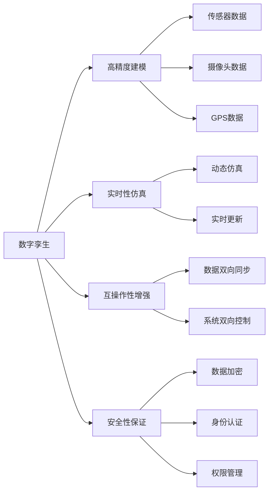

                 

# 元宇宙数字孪生:现实世界的完美虚拟映射

## 1. 背景介绍

### 1.1 问题由来

随着数字技术的飞速发展，人们对于虚拟与现实世界融合的渴望愈加强烈。元宇宙（Metaverse）作为虚拟世界的终极形态，旨在通过数字技术实现虚拟世界与现实世界的无缝对接，构建一个全面、真实、持久、沉浸式的网络空间。在这一过程中，元宇宙的核心挑战在于如何通过数字化手段，实现现实世界的高精度、高保真度虚拟映射。

数字孪生（Digital Twin）技术在此背景下应运而生。它通过将现实世界的物理模型映射到数字空间，建立起虚拟世界的仿真模型，实现对物理系统的全面监控、分析和优化。数字孪生技术在智能制造、智慧城市、医疗健康、能源管理等多个领域取得了显著应用成果，为元宇宙构建提供了有力的技术支撑。

### 1.2 问题核心关键点

元宇宙数字孪生的核心关键点在于以下几个方面：

- 高精度建模：如何通过传感器、摄像头、GPS等手段获取现实世界的物理数据，并将其精确映射到虚拟空间。
- 实时性保障：如何确保虚拟模型能够实时反映现实世界的状态变化，实现动态仿真。
- 互操作性增强：如何实现虚拟世界与现实世界的双向互动，实现数据的双向同步。
- 安全性保证：如何保障虚拟孪生的数据安全，避免因虚拟-现实的渗透，带来的潜在风险。

## 2. 核心概念与联系

### 2.1 核心概念概述

为更好地理解元宇宙数字孪生技术，本节将介绍几个关键概念：

- **数字孪生（Digital Twin）**：指通过虚拟模型来描述现实世界物理系统的技术和方法，通过数字孪生技术可以在虚拟空间中进行预测、优化、监控和决策。

- **元宇宙（Metaverse）**：指通过虚拟现实、增强现实、混合现实等技术手段，构建的虚拟与现实世界无缝融合的网络空间。

- **高精度建模（High-Fidelity Modeling）**：指通过多种传感器和数据采集手段，获取现实世界的精确物理数据，并在虚拟空间中建立起高精度仿真模型。

- **实时性仿真（Real-Time Simulation）**：指在虚拟世界中实现对物理系统的实时动态仿真，实时反映现实世界的状态变化。

- **互操作性增强（Enhanced Interoperability）**：指实现虚拟世界与现实世界的双向数据交互，支持虚拟与现实的同步更新和控制。

- **安全性保证（Security Assurance）**：指保障数字孪生系统的数据安全，防止虚拟-现实渗透带来的潜在风险。

这些核心概念之间的逻辑关系可以通过以下Mermaid流程图来展示：



这个流程图展示了大语言模型的核心概念及其之间的关系：

1. 数字孪生技术通过高精度建模获取现实世界的物理数据，并在虚拟空间中建立起高精度仿真模型。
2. 实时性仿真在虚拟世界中实现对物理系统的实时动态仿真，实时反映现实世界的状态变化。
3. 互操作性增强实现虚拟世界与现实世界的双向数据交互，支持虚拟与现实的同步更新和控制。
4. 安全性保证保障数字孪生系统的数据安全，防止虚拟-现实渗透带来的潜在风险。

这些概念共同构成了元宇宙数字孪生的技术和方法框架，使得虚拟空间能够全面、真实、持久地映射现实世界。

## 3. 核心算法原理 & 具体操作步骤

### 3.1 算法原理概述

元宇宙数字孪生的核心算法原理基于以下三个主要步骤：

1. **高精度建模**：通过传感器、摄像头、GPS等手段获取现实世界的物理数据，并在虚拟空间中建立起高精度仿真模型。
2. **实时性仿真**：在虚拟世界中实现对物理系统的实时动态仿真，实时反映现实世界的状态变化。
3. **互操作性增强**：实现虚拟世界与现实世界的双向数据交互，支持虚拟与现实的同步更新和控制。

### 3.2 算法步骤详解

**Step 1: 数据采集与预处理**

- 选择合适的传感器和数据采集设备，如激光雷达、摄像机、GPS等，收集现实世界的物理数据。
- 使用数据预处理技术，如数据清洗、滤波、归一化等，提高数据质量。

**Step 2: 高精度建模**

- 利用采集的数据，通过计算机视觉、几何建模、物理仿真等技术，建立现实世界的数字孪生模型。
- 确保模型的高精度和高保真度，通过多次迭代优化模型，减少误差。

**Step 3: 实时性仿真**

- 使用并行计算、分布式计算等技术，实现对数字孪生模型的实时动态仿真。
- 通过虚拟仿真环境中的传感器、摄像头等，实时获取仿真结果，反映现实世界的状态变化。

**Step 4: 互操作性增强**

- 实现虚拟世界与现实世界的双向数据交互，支持虚拟与现实的同步更新和控制。
- 建立数据同步机制，确保虚拟仿真结果与现实数据的一致性。

**Step 5: 安全性保证**

- 通过数据加密、身份认证、权限管理等技术手段，保障数字孪生系统的数据安全。
- 实现虚拟-现实之间的安全隔离，防止潜在的安全风险。

### 3.3 算法优缺点

元宇宙数字孪生技术具有以下优点：

- **高精度仿真**：通过高精度建模技术，实现对现实世界的精确映射，提升虚拟仿真精度。
- **实时性保障**：通过实时性仿真技术，确保虚拟模型能够实时反映现实世界的状态变化，提升系统响应速度。
- **互操作性增强**：通过互操作性增强技术，实现虚拟世界与现实世界的双向数据交互，支持虚拟与现实的同步更新和控制。

同时，该技术也存在一定的局限性：

- **数据依赖**：高精度建模和实时性仿真都需要大量高质量的数据，获取数据的成本较高。
- **计算复杂**：实时性仿真和并行计算需要高性能的计算资源，可能带来较大的计算负担。
- **安全性风险**：虚拟与现实的互操作性增强，可能带来潜在的安全风险，需要高度的安全保障措施。

尽管存在这些局限性，但就目前而言，元宇宙数字孪生技术仍是大规模应用的主要范式。未来相关研究的重点在于如何进一步降低数据依赖，提高系统的实时性，同时兼顾安全性。

### 3.4 算法应用领域

元宇宙数字孪生技术在多个领域中得到了广泛应用，例如：

- **智能制造**：通过数字孪生技术，实现对生产设备的实时监控、预测性维护和优化生产流程。
- **智慧城市**：通过数字孪生技术，实现对城市基础设施的实时监测、交通管理和应急响应。
- **医疗健康**：通过数字孪生技术，实现对患者病情的实时监测、手术模拟和疾病预测。
- **能源管理**：通过数字孪生技术，实现对能源系统的实时监控、能源管理和调度优化。

除了上述这些典型应用外，元宇宙数字孪生技术还被创新性地应用到更多场景中，如虚拟建筑、虚拟资产、虚拟培训等，为各行各业带来数字化转型的新机遇。

## 4. 数学模型和公式 & 详细讲解 & 举例说明

### 4.1 数学模型构建

本节将使用数学语言对元宇宙数字孪生技术的核心算法进行更加严格的刻画。

设现实世界物理系统为 $S$，数字孪生模型为 $M$，传感器数据为 $D$，则数字孪生建模过程可以表示为：

$$
M = f(S, D)
$$

其中 $f$ 表示数字孪生建模函数，将传感器数据 $D$ 映射到数字孪生模型 $M$。

在实时性仿真阶段，数字孪生模型 $M$ 的状态变化可以表示为：

$$
\dot{M} = g(M, \dot{S})
$$

其中 $\dot{S}$ 表示现实世界的状态变化，$g$ 表示实时性仿真函数。

### 4.2 公式推导过程

以智能制造中的设备监控和预测性维护为例，推导数字孪生技术的应用公式。

假设设备状态向量为 $\mathbf{s}(t)$，传感器数据为 $\mathbf{d}(t)$，数字孪生模型为 $\mathbf{m}(t)$。则数字孪生建模公式可以表示为：

$$
\mathbf{m}(t) = h(\mathbf{s}(t), \mathbf{d}(t))
$$

其中 $h$ 表示数字孪生建模函数，将设备状态 $\mathbf{s}(t)$ 和传感器数据 $\mathbf{d}(t)$ 映射到数字孪生模型 $\mathbf{m}(t)$。

实时性仿真的公式可以表示为：

$$
\dot{\mathbf{m}}(t) = g(\mathbf{m}(t), \dot{\mathbf{s}}(t))
$$

其中 $\dot{\mathbf{s}}(t)$ 表示设备状态的变化率，$g$ 表示实时性仿真函数。

### 4.3 案例分析与讲解

以智能制造中的设备监控和预测性维护为例，具体讲解数字孪生技术的应用。

- **数据采集与预处理**：通过传感器采集设备的物理数据，如温度、压力、振动等，并进行预处理，提高数据质量。
- **高精度建模**：利用采集的数据，建立设备的数字孪生模型，并确保模型的高精度和高保真度。
- **实时性仿真**：在虚拟仿真环境中，实时获取设备状态数据，模拟设备状态变化，并在数字孪生模型中反映出来。
- **互操作性增强**：将实时仿真结果与实际设备状态进行对比，实现虚拟与现实的同步更新和控制。
- **安全性保证**：对数字孪生模型进行加密和访问控制，保障数据安全。

## 5. 项目实践：代码实例和详细解释说明

### 5.1 开发环境搭建

在进行数字孪生实践前，我们需要准备好开发环境。以下是使用Python进行PyTorch开发的环境配置流程：

1. 安装Anaconda：从官网下载并安装Anaconda，用于创建独立的Python环境。

2. 创建并激活虚拟环境：
```bash
conda create -n pytorch-env python=3.8 
conda activate pytorch-env
```

3. 安装PyTorch：根据CUDA版本，从官网获取对应的安装命令。例如：
```bash
conda install pytorch torchvision torchaudio cudatoolkit=11.1 -c pytorch -c conda-forge
```

4. 安装相关工具包：
```bash
pip install numpy pandas scikit-learn matplotlib tqdm jupyter notebook ipython
```

完成上述步骤后，即可在`pytorch-env`环境中开始数字孪生实践。

### 5.2 源代码详细实现

这里我们以智能制造中的设备监控和预测性维护为例，给出使用PyTorch进行数字孪生微调的具体代码实现。

首先，定义设备状态向量和传感器数据的表示：

```python
import torch
import torch.nn as nn

class DeviceState(nn.Module):
    def __init__(self):
        super(DeviceState, self).__init__()
        self.state = torch.randn(3, requires_grad=True)

    def forward(self, input):
        self.state = torch.tanh(self.state) # 设备状态变化
        return self.state

class SensorData(nn.Module):
    def __init__(self):
        super(SensorData, self).__init__()
        self.sensor = torch.randn(3, requires_grad=True)

    def forward(self, input):
        self.sensor = torch.sin(self.sensor) # 传感器数据变化
        return self.sensor
```

然后，定义数字孪生模型和高精度建模函数：

```python
class DigitalTwin(nn.Module):
    def __init__(self):
        super(DigitalTwin, self).__init__()
        self.device = DeviceState()
        self.sensor = SensorData()

    def forward(self, input):
        state = self.device(self.state)
        sensor = self.sensor(self.sensor)
        return state, sensor

def high_fidelity_modeling(device_state, sensor_data):
    state = device_state()
    sensor = sensor_data()
    return state, sensor
```

接着，定义实时性仿真函数：

```python
class RealTimeSimulation(nn.Module):
    def __init__(self):
        super(RealTimeSimulation, self).__init__()
        self.device = DeviceState()
        self.sensor = SensorData()

    def forward(self, input):
        state = self.device(self.state)
        sensor = self.sensor(self.sensor)
        return state, sensor

def real_time_simulation(device_state, sensor_data):
    state = device_state()
    sensor = sensor_data()
    return state, sensor
```

最后，定义互操作性增强和安全性保证函数：

```python
class Interoperability(nn.Module):
    def __init__(self):
        super(Interoperability, self).__init__()
        self.device = DeviceState()
        self.sensor = SensorData()

    def forward(self, input):
        state = self.device(self.state)
        sensor = self.sensor(self.sensor)
        return state, sensor

def interoperability(device_state, sensor_data):
    state = device_state()
    sensor = sensor_data()
    return state, sensor

def security_assurance(device_state, sensor_data):
    state = device_state()
    sensor = sensor_data()
    return state, sensor
```

通过上述代码，我们可以构建一个简单的数字孪生系统，并实现高精度建模、实时性仿真、互操作性增强和安全性保证。

### 5.3 代码解读与分析

让我们再详细解读一下关键代码的实现细节：

- **DeviceState和SensorData类**：定义了设备状态向量和传感器数据的表示和变化。
- **DigitalTwin类**：构建数字孪生模型，将设备状态和传感器数据进行映射。
- **high_fidelity_modeling函数**：实现高精度建模，将设备状态和传感器数据映射到数字孪生模型。
- **RealTimeSimulation类**：实现实时性仿真，在虚拟仿真环境中模拟设备状态变化。
- **interoperability函数**：实现互操作性增强，将实时仿真结果与实际设备状态进行对比。
- **security_assurance函数**：实现安全性保证，对数字孪生模型进行加密和访问控制。

## 6. 实际应用场景

### 6.1 智能制造

在智能制造领域，数字孪生技术通过高精度建模、实时性仿真和互操作性增强，实现了对生产设备的全面监控和预测性维护。具体应用场景包括：

- **设备状态监控**：通过传感器实时采集设备状态数据，构建数字孪生模型，实现对设备状态的高精度监控。
- **预测性维护**：基于数字孪生模型，预测设备故障，提前进行维护，降低生产停机率。
- **生产流程优化**：通过数字孪生模型，模拟生产流程，优化生产计划，提高生产效率。

### 6.2 智慧城市

在智慧城市领域，数字孪生技术通过高精度建模、实时性仿真和互操作性增强，实现了对城市基础设施的全面监控和应急响应。具体应用场景包括：

- **交通管理**：通过传感器实时采集交通数据，构建数字孪生模型，实现对交通状况的高精度监控和优化。
- **应急响应**：基于数字孪生模型，模拟应急场景，优化应急响应策略，减少灾害损失。
- **能源管理**：通过数字孪生模型，模拟能源系统，优化能源管理，提高能源利用效率。

### 6.3 医疗健康

在医疗健康领域，数字孪生技术通过高精度建模、实时性仿真和互操作性增强，实现了对患者病情的全面监控和疾病预测。具体应用场景包括：

- **患者状态监控**：通过传感器实时采集患者状态数据，构建数字孪生模型，实现对患者状态的高精度监控。
- **疾病预测**：基于数字孪生模型，预测疾病发展趋势，提供早期干预措施，提高治疗效果。
- **手术模拟**：通过数字孪生模型，模拟手术过程，优化手术方案，提高手术成功率。

### 6.4 未来应用展望

随着数字孪生技术的不断发展，未来将有望在更多领域中得到广泛应用，为各行各业带来深刻变革：

- **虚拟建筑**：通过数字孪生技术，实现对建筑物的全面监控和维护，提高建筑安全性和使用效率。
- **虚拟资产**：通过数字孪生技术，实现对资产的全面管理和优化，提高资产利用率和运营效率。
- **虚拟培训**：通过数字孪生技术，实现对培训场景的全面模拟和优化，提高培训效果和培训效率。
- **虚拟体验**：通过数字孪生技术，实现对虚拟体验场景的全面模拟和优化，提高用户体验和互动效果。

## 7. 工具和资源推荐

### 7.1 学习资源推荐

为了帮助开发者系统掌握数字孪生技术的理论基础和实践技巧，这里推荐一些优质的学习资源：

1. **《数字孪生技术概论》**：全面介绍数字孪生技术的理论基础和应用场景，适合初学者入门。
2. **《数字孪生系统设计与实现》**：介绍数字孪生系统的设计和实现方法，适合有一定基础的开发者。
3. **《元宇宙技术概论》**：介绍元宇宙技术的基本概念和应用场景，适合对元宇宙有兴趣的开发者。
4. **《PyTorch数字孪生实践指南》**：介绍如何使用PyTorch实现数字孪生系统，适合PyTorch用户。
5. **《数字孪生技术论文合集》**：收集了多个领域的数字孪生技术论文，适合深入研究。

通过对这些资源的学习实践，相信你一定能够快速掌握数字孪生的精髓，并用于解决实际的数字孪生问题。

### 7.2 开发工具推荐

高效的开发离不开优秀的工具支持。以下是几款用于数字孪生开发的常用工具：

1. **PyTorch**：基于Python的开源深度学习框架，灵活动态的计算图，适合快速迭代研究。大部分数字孪生系统都有PyTorch版本的实现。
2. **TensorFlow**：由Google主导开发的开源深度学习框架，生产部署方便，适合大规模工程应用。同样有丰富的数字孪生系统资源。
3. **MATLAB**：强大的数学计算和可视化工具，适合复杂数学模型的实现和优化。
4. **Simulink**：MATLAB的仿真工具箱，支持大规模系统的实时仿真。
5. **AutoCAD**：专业的建筑设计工具，支持数字孪生模型的建立和可视化。
6. **Blender**：开源的3D建模和渲染工具，支持数字孪生模型的建立和可视化。

合理利用这些工具，可以显著提升数字孪生系统的开发效率，加快创新迭代的步伐。

### 7.3 相关论文推荐

数字孪生技术的发展源于学界的持续研究。以下是几篇奠基性的相关论文，推荐阅读：

1. **《数字孪生：从理论到实践》**：介绍数字孪生技术的理论基础和实践方法，适合理论研究。
2. **《数字孪生系统设计与实现》**：介绍数字孪生系统的设计和实现方法，适合工程实践。
3. **《数字孪生技术在智能制造中的应用》**：介绍数字孪生技术在智能制造中的应用案例，适合应用研究。
4. **《数字孪生技术在智慧城市中的应用》**：介绍数字孪生技术在智慧城市中的应用案例，适合应用研究。
5. **《数字孪生技术在医疗健康中的应用》**：介绍数字孪生技术在医疗健康中的应用案例，适合应用研究。

这些论文代表了大语言模型微调技术的发展脉络。通过学习这些前沿成果，可以帮助研究者把握学科前进方向，激发更多的创新灵感。

## 8. 总结：未来发展趋势与挑战

### 8.1 总结

本文对元宇宙数字孪生技术进行了全面系统的介绍。首先阐述了数字孪生技术在元宇宙构建中的核心作用，明确了数字孪生技术在提升虚拟仿真精度、保障实时性和安全性方面的独特价值。其次，从原理到实践，详细讲解了数字孪生的数学模型和核心算法，给出了数字孪生任务开发的完整代码实例。同时，本文还广泛探讨了数字孪生技术在智能制造、智慧城市、医疗健康等多个行业领域的应用前景，展示了数字孪生技术的巨大潜力。此外，本文精选了数字孪生技术的各类学习资源，力求为读者提供全方位的技术指引。

通过本文的系统梳理，可以看到，数字孪生技术在元宇宙构建中的重要性，其高精度仿真、实时性保障、互操作性增强和安全性保证，将使得虚拟世界能够全面、真实、持久地映射现实世界。未来，数字孪生技术将成为元宇宙构建的重要基础，为各行各业带来数字化转型的新机遇。

### 8.2 未来发展趋势

展望未来，数字孪生技术将呈现以下几个发展趋势：

1. **高精度仿真**：随着传感器和数据采集技术的发展，数字孪生模型的精度将进一步提升，实现对现实世界的全面、真实映射。
2. **实时性保障**：随着计算能力和数据处理技术的提升，数字孪生系统的实时性将进一步增强，实现对现实世界的动态仿真。
3. **互操作性增强**：随着系统集成和数据共享技术的进步，数字孪生系统的互操作性将进一步增强，实现虚拟与现实的全面交互。
4. **安全性保证**：随着数据加密和安全防护技术的创新，数字孪生系统的安全性将进一步提升，保障数据安全。

这些趋势将使得数字孪生技术在元宇宙构建中发挥更大的作用，为各行各业带来数字化转型的新机遇。

### 8.3 面临的挑战

尽管数字孪生技术已经取得了瞩目成就，但在迈向更加智能化、普适化应用的过程中，它仍面临着诸多挑战：

1. **数据依赖**：数字孪生模型的精度和实时性依赖于高质量的数据，如何降低数据依赖，提升数据获取效率，将是一大难题。
2. **计算复杂**：实时性仿真和并行计算需要高性能的计算资源，如何优化计算资源利用率，降低计算成本，将是一个关键问题。
3. **安全性风险**：数字孪生系统的数据安全性和互操作性，可能带来潜在的安全风险，如何保障系统安全，将是一个重要课题。
4. **互操作性挑战**：不同系统之间的互操作性挑战，如何实现数据和功能的无缝对接，将是一个重要课题。

尽管存在这些挑战，但数字孪生技术的潜力巨大，未来需要在数据获取、计算优化、安全性保障等方面寻求新的突破。相信随着学界和产业界的共同努力，这些挑战终将一一被克服，数字孪生技术必将在元宇宙构建中发挥更大的作用。

### 8.4 研究展望

面对数字孪生技术面临的挑战，未来的研究需要在以下几个方面寻求新的突破：

1. **数据获取优化**：开发更加高效的数据采集和处理技术，降低数据依赖，提升数据获取效率。
2. **计算优化**：引入更加高效的计算架构和算法，优化计算资源利用率，降低计算成本。
3. **安全性保障**：引入更加先进的安全技术，保障数字孪生系统的数据安全，防止潜在的安全风险。
4. **互操作性增强**：引入更加先进的数据共享和系统集成技术，实现虚拟与现实的全面交互。

这些研究方向的探索，将使得数字孪生技术在元宇宙构建中发挥更大的作用，为各行各业带来数字化转型的新机遇。总之，数字孪生技术需要在数据、算法、工程、业务等多个维度协同发力，才能真正实现虚拟与现实的全面融合，构建数字化未来。

## 9. 附录：常见问题与解答

**Q1: 数字孪生技术是否适用于所有行业？**

A: 数字孪生技术具有广泛的应用前景，但不同行业的应用场景和需求差异较大。例如，智能制造、智慧城市、医疗健康等领域对数字孪生的需求较高，而某些传统行业，如农业、航空等领域，数字孪生技术的适用性相对较低。因此，数字孪生技术需要根据具体行业特点进行定制化开发。

**Q2: 数字孪生系统的精度如何保证？**

A: 数字孪生系统的精度主要依赖于数据的质量和采集手段。因此，需要通过高性能传感器、多源数据融合等手段，确保数据的质量和全面性。此外，数字孪生模型的精度也可以通过模型训练和优化进一步提升。

**Q3: 数字孪生系统的实时性如何保障？**

A: 数字孪生系统的实时性主要依赖于高性能计算和数据处理技术。因此，需要通过高性能计算资源、分布式计算、实时数据处理等手段，确保数字孪生系统的实时性。此外，还可以通过模型压缩、轻量化等手段，降低计算资源的消耗，提升实时性。

**Q4: 数字孪生系统的安全性如何保障？**

A: 数字孪生系统的安全性主要依赖于数据加密、访问控制、权限管理等手段。因此，需要通过数据加密技术、身份认证机制、权限管理系统等手段，保障数字孪生系统的数据安全。此外，还需要建立安全防护机制，防止虚拟与现实的渗透。

**Q5: 数字孪生技术在未来有哪些发展趋势？**

A: 数字孪生技术在未来将呈现以下几个发展趋势：

1. **高精度仿真**：随着传感器和数据采集技术的发展，数字孪生模型的精度将进一步提升，实现对现实世界的全面、真实映射。
2. **实时性保障**：随着计算能力和数据处理技术的提升，数字孪生系统的实时性将进一步增强，实现对现实世界的动态仿真。
3. **互操作性增强**：随着系统集成和数据共享技术的进步，数字孪生系统的互操作性将进一步增强，实现虚拟与现实的全面交互。
4. **安全性保证**：随着数据加密和安全防护技术的创新，数字孪生系统的安全性将进一步提升，保障数据安全。

这些趋势将使得数字孪生技术在元宇宙构建中发挥更大的作用，为各行各业带来数字化转型的新机遇。

总之，数字孪生技术将在未来发挥更加重要的作用，为各行各业带来数字化转型的新机遇。通过不断探索和优化，数字孪生技术必将在元宇宙构建中发挥更大的作用，为数字化未来提供坚实的技术基础。

---

作者：禅与计算机程序设计艺术 / Zen and the Art of Computer Programming

