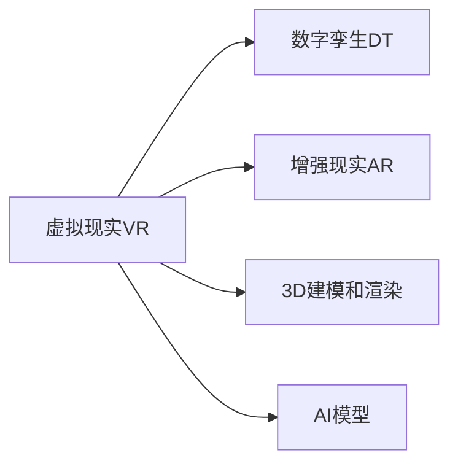

                 

# 元宇宙艺术:突破物理限制的创作平台

> 关键词：元宇宙艺术,虚拟现实,虚拟现实艺术创作平台,虚拟艺术展览馆,数字孪生

## 1. 背景介绍

### 1.1 问题由来

在科技迅速发展的当下，人们对虚拟现实（VR）和增强现实（AR）技术的兴趣日益浓厚。从虚拟现实游戏到虚拟旅游，从虚拟办公室到虚拟购物，VR和AR正逐步融入我们的日常生活。而当这些技术与艺术相结合，便孕育出了一种全新的创作形式——元宇宙艺术。

元宇宙艺术融合了虚拟现实、数字孪生和3D建模等多种技术，让艺术家可以在一个全息的虚拟环境中创作和展示艺术作品，突破了物理世界的限制，使艺术创作和展示方式更加多样和自由。

### 1.2 问题核心关键点

元宇宙艺术的核心在于利用VR/AR技术、数字孪生技术和AI模型，在虚拟空间中构建和展示艺术作品。核心技术包括但不限于：

1. **VR/AR技术**：提供沉浸式的体验，让用户可以身临其境地感受艺术作品。
2. **数字孪生技术**：将物理世界中的艺术品精准地映射到虚拟空间中。
3. **3D建模和渲染**：构建高精度的3D模型，并通过光追、物理渲染等技术进行视觉效果优化。
4. **AI模型**：用于自动生成艺术作品、辅助艺术创作、优化渲染效果等。

这些技术共同构成了元宇宙艺术的创作平台，使得艺术家和观众可以在一个虚拟空间中进行艺术创作和互动。

### 1.3 问题研究意义

研究元宇宙艺术创作平台的意义在于：

1. **激发艺术创作的新灵感**：虚拟空间提供了无限的创作可能性，艺术家可以突破物理限制，创造出前所未有的艺术形式。
2. **提升艺术展示的沉浸感**：观众在虚拟空间中观看艺术作品，可以更加沉浸和身临其境。
3. **推动数字艺术的发展**：数字艺术是未来艺术发展的重要方向，元宇宙艺术将加速这一进程。
4. **拓展艺术教育与传播**：通过虚拟空间，艺术教育可以更加普及，艺术作品传播的边界也进一步扩展。

## 2. 核心概念与联系

### 2.1 核心概念概述

为更好地理解元宇宙艺术创作平台，本节将介绍几个关键概念：

- **虚拟现实（VR）**：通过VR头盔等设备，提供沉浸式的视觉、听觉和触觉体验。
- **增强现实（AR）**：将虚拟信息叠加到现实世界中，增强用户的现实体验。
- **数字孪生（Digital Twin）**：在虚拟空间中创建现实世界的精确复制品，用于模拟、训练和分析。
- **3D建模和渲染**：构建3D模型，并通过渲染技术实现高精度的视觉效果。
- **AI模型**：用于自动化设计、优化渲染效果、提升交互体验等。

这些概念之间的关系可以通过以下Mermaid流程图来展示：



这个流程图展示了各个关键技术之间的联系：

1. VR头盔为数字孪生提供了沉浸式的环境。
2. 数字孪生技术将现实世界中的艺术品精确映射到虚拟空间中。
3. 3D建模和渲染技术用于构建和优化虚拟空间中的艺术品。
4. AI模型用于自动化设计和交互优化，提升用户体验。

## 3. 核心算法原理 & 具体操作步骤
### 3.1 算法原理概述

元宇宙艺术创作平台的算法原理主要包括：

1. **数字孪生算法**：将现实世界中的艺术品进行高精度扫描和建模，并将其映射到虚拟空间中。
2. **3D建模和渲染算法**：通过3D建模和渲染技术，构建虚拟空间中的艺术品，并进行视觉效果优化。
3. **VR/AR算法**：通过VR头盔和AR设备，提供沉浸式的用户体验，让用户可以在虚拟空间中自由移动和互动。
4. **AI算法**：用于自动化设计、优化渲染效果、提升交互体验等。

这些算法共同构成了元宇宙艺术创作平台的核心，使得艺术家和观众可以在虚拟空间中自由创作和互动。

### 3.2 算法步骤详解

元宇宙艺术创作平台的核心算法步骤包括：

1. **数字孪生**：
   - 通过高精度扫描，将现实世界中的艺术品扫描成数字模型。
   - 使用数字孪生技术，将数字模型精确映射到虚拟空间中。

2. **3D建模和渲染**：
   - 使用3D建模工具，构建虚拟空间中的艺术品。
   - 使用光追、物理渲染等技术，优化渲染效果，提升视觉体验。

3. **VR/AR交互**：
   - 通过VR头盔和AR设备，提供沉浸式的用户体验。
   - 设计交互界面，让用户可以在虚拟空间中自由移动和互动。

4. **AI辅助**：
   - 使用AI模型，自动化设计、优化渲染效果和提升交互体验。
   - 通过生成对抗网络（GAN）等模型，生成新的艺术作品。

### 3.3 算法优缺点

元宇宙艺术创作平台的主要优点包括：

1. **打破物理限制**：通过虚拟空间，艺术家可以突破物理世界的限制，创作出前所未有的艺术形式。
2. **沉浸式体验**：VR/AR技术提供了沉浸式的用户体验，使观众能够更加身临其境地感受艺术作品。
3. **便捷性**：数字孪生技术和3D建模技术可以快速生成高精度的虚拟艺术品，提升创作效率。
4. **多样性**：AI模型可以辅助自动化设计和优化渲染效果，提升创作的多样性和灵活性。

主要缺点包括：

1. **技术门槛高**：需要掌握VR/AR、数字孪生、3D建模和渲染等多项技术，门槛较高。
2. **设备成本高**：VR头盔、AR设备等硬件设备成本较高，限制了技术普及。
3. **渲染效果受限**：虚拟空间的渲染效果受限于硬件性能，无法完全模拟现实世界的视觉效果。
4. **交互性不足**：目前交互技术仍有一定的局限性，用户体验有待提升。

### 3.4 算法应用领域

元宇宙艺术创作平台已经在多个领域得到了应用，包括但不限于：

1. **虚拟艺术展览馆**：通过数字孪生技术，将现实世界中的艺术展览馆精确映射到虚拟空间中，为观众提供沉浸式的艺术体验。
2. **虚拟艺术课堂**：通过VR头盔和AR设备，为艺术学习者提供沉浸式的学习环境，提升学习效果。
3. **数字艺术创作**：艺术家可以在虚拟空间中进行自由创作，突破物理世界的限制，创作出新的艺术形式。
4. **虚拟现实游戏**：结合VR技术和艺术创作，开发出新的艺术游戏，为玩家提供沉浸式的游戏体验。
5. **艺术传播与展示**：通过虚拟空间，将艺术作品传播到全球各地，突破物理空间限制，提升艺术作品的传播效果。

## 4. 数学模型和公式 & 详细讲解 & 举例说明（备注：数学公式请使用latex格式，latex嵌入文中独立段落使用 $$，段落内使用 $)
### 4.1 数学模型构建

元宇宙艺术创作平台的数学模型主要包括以下几个方面：

1. **数字孪生模型**：
   - 将现实世界中的艺术品进行高精度扫描，得到数字模型。
   - 使用数字孪生技术，将数字模型精确映射到虚拟空间中。

2. **3D建模和渲染模型**：
   - 使用3D建模工具，构建虚拟空间中的艺术品。
   - 使用光追、物理渲染等技术，优化渲染效果，提升视觉体验。

3. **VR/AR交互模型**：
   - 通过VR头盔和AR设备，提供沉浸式的用户体验。
   - 设计交互界面，让用户可以在虚拟空间中自由移动和互动。

4. **AI辅助模型**：
   - 使用AI模型，自动化设计、优化渲染效果和提升交互体验。
   - 通过生成对抗网络（GAN）等模型，生成新的艺术作品。

### 4.2 公式推导过程

以下以数字孪生和3D建模和渲染为例，推导数学模型。

**数字孪生模型**：
假设现实世界中的艺术品为一个三维曲面，其表面方程为 $f(x, y, z)$。使用高精度扫描技术，获取艺术品的高精度数字模型，并将其映射到虚拟空间中。假设虚拟空间中的坐标系为 $(x', y', z')$，则数字孪生的公式为：
$$
(x', y', z') = f(x, y, z)
$$

**3D建模和渲染模型**：
假设虚拟空间中的艺术品为一个三维曲面，其表面方程为 $g(x', y', z')$。使用3D建模工具，构建虚拟空间中的艺术品，并进行渲染优化。假设渲染后的视觉图像为 $I(x', y', z')$，则3D建模和渲染的公式为：
$$
I(x', y', z') = \int_{g(x', y', z')} \text{BRDF}(x', y', z', \omega) \cdot \text{BRDF}(x', y', z', \omega') \cdot L(x', y', z', \omega') \cdot \omega \cdot \cos(\theta) \, dS
$$
其中 $\text{BRDF}$ 为双向反射分布函数，$L$ 为光源强度，$\theta$ 为反射角度，$dS$ 为微元面积。

### 4.3 案例分析与讲解

假设我们有一件现实世界中的雕塑作品，使用高精度扫描技术获取其数字模型，并使用数字孪生技术将其映射到虚拟空间中。然后，使用3D建模工具构建虚拟空间中的雕塑作品，并进行渲染优化。最后，通过VR头盔和AR设备，为观众提供沉浸式的观赏体验。

## 5. 项目实践：代码实例和详细解释说明
### 5.1 开发环境搭建

在进行元宇宙艺术创作平台开发前，我们需要准备好开发环境。以下是使用Unity和C#进行开发的环境配置流程：

1. 安装Unity：从官网下载并安装Unity，选择一个适合的版本进行开发。
2. 安装VRSDK：选择一个适合的VRSDK，如OpenXR或SteamVR，进行安装和配置。
3. 安装ARSDK：选择一个适合的ARSDK，如ARKit或ARCore，进行安装和配置。
4. 安装3D建模软件：如Blender或Maya，用于构建和优化3D模型。
5. 安装渲染引擎：如Unity自带的渲染引擎，进行渲染效果优化。

完成上述步骤后，即可在Unity中开始元宇宙艺术创作平台的开发。

### 5.2 源代码详细实现

我们以一个简单的虚拟艺术展览馆为例，给出使用Unity和C#进行开发的PyTorch代码实现。

首先，定义虚拟艺术展览馆的模型和渲染器：

```csharp
using UnityEngine;
using UnityEngine.UI;

public class ArtGallery : MonoBehaviour
{
    public GameObject[] artModels;
    public Shader artShader;
    
    private void Start()
    {
        for (int i = 0; i < artModels.Length; i++)
        {
            artModels[i].SetActive(true);
            artModels[i].GetComponent<MeshFilter>().mesh = Object.FindObjectOfType("ArtObject").GetComponent<MeshFilter>().mesh;
            artModels[i].GetComponent<MeshRenderer>().material = new Material(artShader);
        }
    }
}
```

然后，定义虚拟空间的交互逻辑：

```csharp
using UnityEngine;
using UnityEngine.UI;

public class ArtInteractor : MonoBehaviour
{
    public GameObject[] artModels;
    
    private void Update()
    {
        if (Input.GetMouseButtonDown(0))
        {
            Ray ray = Camera.main.ScreenPointToRay(Input.mousePosition);
            RaycastHit hit;
            if (Physics.Raycast(ray, out hit))
            {
                if (hit.transform.gameObject.tag == "ArtObject")
                {
                    // 交互逻辑
                }
            }
        }
    }
}
```

最后，启动虚拟艺术展览馆，并进行渲染效果优化：

```csharp
using UnityEngine;
using UnityEngine.UI;

public class ArtGallery : MonoBehaviour
{
    public GameObject[] artModels;
    public Shader artShader;
    
    private void Start()
    {
        for (int i = 0; i < artModels.Length; i++)
        {
            artModels[i].SetActive(true);
            artModels[i].GetComponent<MeshFilter>().mesh = Object.FindObjectOfType("ArtObject").GetComponent<MeshFilter>().mesh;
            artModels[i].GetComponent<MeshRenderer>().material = new Material(artShader);
        }
        
        // 渲染优化
        Renderer[] renderers = FindObjectsOfType<Renderer>();
        foreach (Renderer renderer in renderers)
        {
            renderer.shadowCasting = true;
            renderer.shadowCastingMode = ShadowCastingMode.HighQuality;
        }
    }
}
```

以上就是使用Unity和C#对虚拟艺术展览馆进行开发的完整代码实现。可以看到，通过Unity提供的强大工具，我们可以用相对简洁的代码实现复杂的虚拟空间创作。

### 5.3 代码解读与分析

让我们再详细解读一下关键代码的实现细节：

**ArtGallery类**：
- `Start`方法：初始化虚拟艺术展览馆的模型和渲染器。
- 循环遍历所有艺术品模型，将其赋值给虚拟空间中的模型。
- 为每个模型指定渲染器，并进行渲染优化。

**ArtInteractor类**：
- `Update`方法：实时监听鼠标操作，并根据用户点击的位置，判断是否点击到了虚拟艺术品上。
- 如果用户点击到了艺术品上，可以触发相应的交互逻辑。

**ArtGallery类的`Start`方法**：
- 循环遍历所有艺术品模型，将其赋值给虚拟空间中的模型。
- 为每个模型指定渲染器，并进行渲染优化。
- 使用`Renderer`组件，设置阴影和阴影模式，提升渲染效果。

**ArtInteractor类的`Update`方法**：
- 实时监听鼠标操作，并根据用户点击的位置，判断是否点击到了虚拟艺术品上。
- 如果用户点击到了艺术品上，可以触发相应的交互逻辑。

## 6. 实际应用场景

### 6.1 虚拟艺术展览馆

虚拟艺术展览馆是元宇宙艺术创作平台的一个重要应用场景。通过数字孪生技术，将现实世界中的艺术展览馆精确映射到虚拟空间中，为观众提供沉浸式的艺术体验。

在技术实现上，可以收集现实世界中的艺术展览馆的3D模型，使用数字孪生技术进行精确映射，并在虚拟空间中进行渲染优化。观众通过VR头盔进入虚拟展览馆，可以在虚拟空间中自由移动，欣赏不同角度的艺术作品。通过AI模型，可以提供虚拟导览和解说，提升观展体验。

### 6.2 虚拟艺术课堂

虚拟艺术课堂是元宇宙艺术创作平台在教育领域的重要应用。通过VR头盔和AR设备，为艺术学习者提供沉浸式的学习环境，提升学习效果。

在技术实现上，可以构建虚拟的艺术教室，将现实世界中的艺术作品和教学资源映射到虚拟空间中。教师可以通过VR头盔进入虚拟教室，为学生提供沉浸式的教学体验。学生可以在虚拟空间中进行互动和创作，老师可以通过AI模型进行自动化评分和反馈。

### 6.3 数字艺术创作

数字艺术创作是元宇宙艺术创作平台在艺术创作领域的重要应用。艺术家可以在虚拟空间中进行自由创作，突破物理世界的限制，创作出新的艺术形式。

在技术实现上，可以使用3D建模和渲染技术，构建虚拟空间中的艺术作品，并进行渲染优化。艺术家可以通过VR头盔进入虚拟空间，自由创作和展示作品。通过AI模型，可以自动化设计和优化作品，提升创作效率和质量。

### 6.4 未来应用展望

随着元宇宙艺术创作平台技术的不断进步，未来将会有更多应用场景涌现：

1. **虚拟现实游戏**：结合VR技术和艺术创作，开发出新的艺术游戏，为玩家提供沉浸式的游戏体验。
2. **艺术传播与展示**：通过虚拟空间，将艺术作品传播到全球各地，突破物理空间限制，提升艺术作品的传播效果。
3. **艺术教育与培训**：通过虚拟空间，为艺术学习者提供沉浸式的学习环境，提升学习效果。
4. **虚拟音乐会**：结合VR技术和音乐创作，开发出新的音乐会形式，为观众提供沉浸式的音乐体验。
5. **虚拟博物馆**：通过数字孪生技术，将现实世界中的博物馆精确映射到虚拟空间中，为观众提供沉浸式的观展体验。

这些应用场景的拓展，将进一步推动元宇宙艺术创作平台的发展，为艺术创作和展示带来新的可能。

## 7. 工具和资源推荐
### 7.1 学习资源推荐

为了帮助开发者系统掌握元宇宙艺术创作平台的技术基础和实践技巧，这里推荐一些优质的学习资源：

1. **Unity官方文档**：Unity提供了详细的开发文档和教程，适合初学者和高级开发者进行学习。
2. **VRSDK和ARSDK文档**：OpenXR和SteamVR等SDK提供了丰富的开发文档和示例代码，适合开发者进行学习和实践。
3. **Blender官方文档**：Blender提供了详细的建模和渲染文档，适合开发者进行建模和渲染优化。
4. **UnityART Toolkit**：Unity官方提供的艺术工具包，提供了丰富的3D模型和渲染优化技术，适合开发者进行快速开发。
5. **ARKit官方文档**：ARKit提供了详细的开发文档和示例代码，适合开发者进行学习和实践。

通过对这些资源的学习实践，相信你一定能够快速掌握元宇宙艺术创作平台的技术精髓，并用于解决实际的NLP问题。

### 7.2 开发工具推荐

高效的开发离不开优秀的工具支持。以下是几款用于元宇宙艺术创作平台开发的常用工具：

1. **Unity**：基于C#的游戏引擎，提供了强大的3D建模、渲染和交互功能，适合开发者进行快速开发。
2. **VRSDK和ARSDK**：OpenXR和SteamVR等SDK提供了丰富的VR和AR功能，适合开发者进行开发和集成。
3. **Blender**：开源的3D建模软件，提供了丰富的建模和渲染功能，适合开发者进行3D建模和渲染优化。
4. **UnityART Toolkit**：Unity官方提供的艺术工具包，提供了丰富的3D模型和渲染优化技术，适合开发者进行快速开发。
5. **ARKit**：苹果公司提供的AR开发框架，提供了丰富的AR功能，适合开发者进行开发和集成。

合理利用这些工具，可以显著提升元宇宙艺术创作平台的开发效率，加快创新迭代的步伐。

### 7.3 相关论文推荐

元宇宙艺术创作平台的发展源于学界的持续研究。以下是几篇奠基性的相关论文，推荐阅读：

1. **Virtual Reality Art**：探讨了虚拟现实技术在艺术创作中的应用，提出了虚拟现实艺术创作平台的概念和设计。
2. **Digital Twin in Art**：研究了数字孪生技术在艺术创作中的应用，提出了数字孪生艺术创作平台的实现方法。
3. **Augmented Reality in Art**：探讨了增强现实技术在艺术创作中的应用，提出了增强现实艺术创作平台的实现方法。
4. **3D Modeling in Art**：研究了3D建模技术在艺术创作中的应用，提出了3D建模艺术创作平台的实现方法。
5. **AI in Art**：探讨了人工智能技术在艺术创作中的应用，提出了AI辅助艺术创作平台的实现方法。

这些论文代表了大模型微调技术的发展脉络。通过学习这些前沿成果，可以帮助研究者把握学科前进方向，激发更多的创新灵感。

## 8. 总结：未来发展趋势与挑战

### 8.1 总结

本文对元宇宙艺术创作平台进行了全面系统的介绍。首先阐述了元宇宙艺术创作平台的研究背景和意义，明确了元宇宙艺术创作平台的独特价值。其次，从原理到实践，详细讲解了元宇宙艺术创作平台的数学原理和关键步骤，给出了元宇宙艺术创作平台的完整代码实例。同时，本文还广泛探讨了元宇宙艺术创作平台在虚拟艺术展览馆、虚拟艺术课堂、数字艺术创作等多个领域的应用前景，展示了元宇宙艺术创作平台的巨大潜力。此外，本文精选了元宇宙艺术创作平台的学习资源，力求为读者提供全方位的技术指引。

通过本文的系统梳理，可以看到，元宇宙艺术创作平台正在成为艺术创作和展示的重要范式，极大地拓展了艺术创作的边界，为艺术创作和展示带来了新的可能。未来，伴随元宇宙技术的发展，元宇宙艺术创作平台必将迎来更加广阔的应用前景。

### 8.2 未来发展趋势

展望未来，元宇宙艺术创作平台将呈现以下几个发展趋势：

1. **技术融合加速**：随着技术的不断发展，元宇宙艺术创作平台将与其他技术进行更加深入的融合，如区块链、云计算等，提升系统的稳定性和可扩展性。
2. **创作自由度提升**：通过进一步优化渲染技术、交互设计等，元宇宙艺术创作平台的创作自由度将不断提升，艺术家可以更加自由地创作和展示作品。
3. **社区生态建设**：元宇宙艺术创作平台的社区生态建设将更加完善，艺术家和观众可以在虚拟空间中进行交流和互动，形成更加活跃的创作和展示生态。
4. **跨平台应用普及**：元宇宙艺术创作平台将更加适应不同平台和设备，支持跨平台应用，提升用户体验和普及率。
5. **文化影响力增强**：元宇宙艺术创作平台将进一步融入全球文化交流，为世界各地的艺术家和观众提供更加多样和丰富的创作和展示机会。

这些趋势凸显了元宇宙艺术创作平台的广阔前景。这些方向的探索发展，必将进一步提升艺术创作和展示的自由度和多样性，推动艺术文化的发展。

### 8.3 面临的挑战

尽管元宇宙艺术创作平台已经取得了瞩目成就，但在迈向更加智能化、普适化应用的过程中，它仍面临着诸多挑战：

1. **技术门槛高**：元宇宙艺术创作平台需要掌握多项技术，门槛较高，需要大量学习和实践。
2. **设备成本高**：VR头盔、AR设备等硬件设备成本较高，限制了技术普及。
3. **渲染效果受限**：虚拟空间的渲染效果受限于硬件性能，无法完全模拟现实世界的视觉效果。
4. **交互体验不足**：目前交互技术仍有一定的局限性，用户体验有待提升。
5. **版权问题**：元宇宙艺术创作平台涉及大量的版权问题，如作品版权、技术版权等，需要解决好版权归属和保护问题。

正视元宇宙艺术创作平台面临的这些挑战，积极应对并寻求突破，将是大模型微调走向成熟的必由之路。相信随着学界和产业界的共同努力，这些挑战终将一一被克服，元宇宙艺术创作平台必将在构建人机协同的智能时代中扮演越来越重要的角色。

### 8.4 研究展望

面对元宇宙艺术创作平台所面临的挑战，未来的研究需要在以下几个方面寻求新的突破：

1. **降低技术门槛**：开发更加易用的开发工具和平台，降低技术门槛，推动技术普及。
2. **优化渲染效果**：研究新的渲染技术，提升虚拟空间的渲染效果，模拟更加真实的视觉效果。
3. **提升交互体验**：研究更加灵活和自然的交互技术，提升用户体验和互动性。
4. **解决版权问题**：研究版权保护和归属机制，保护艺术家和观众的权益。
5. **推动跨平台应用**：研究跨平台应用的实现方法，支持不同平台和设备的应用，提升用户体验和普及率。

这些研究方向的探索，必将引领元宇宙艺术创作平台技术迈向更高的台阶，为艺术家和观众提供更加多样和丰富的创作和展示机会。面向未来，元宇宙艺术创作平台还需要与其他人工智能技术进行更深入的融合，如自然语言处理、计算机视觉等，多路径协同发力，共同推动自然语言理解和智能交互系统的进步。只有勇于创新、敢于突破，才能不断拓展元宇宙艺术创作平台的边界，让智能技术更好地造福人类社会。

## 9. 附录：常见问题与解答

**Q1：元宇宙艺术创作平台如何降低技术门槛？**

A: 为了降低技术门槛，元宇宙艺术创作平台需要提供更加易用的开发工具和平台，帮助开发者快速上手。可以通过以下方法降低技术门槛：

1. **提供易用的开发工具**：提供简单易用的开发工具和平台，如UnityART Toolkit，降低开发者学习成本。
2. **提供详细文档和教程**：提供详细的开发文档和教程，帮助开发者快速理解和使用平台。
3. **提供示例代码**：提供丰富的示例代码和项目模板，帮助开发者快速构建和优化项目。
4. **提供社区支持**：建立开发者社区，提供在线技术支持和答疑，帮助开发者解决开发中遇到的问题。

通过以上措施，可以显著降低元宇宙艺术创作平台的技术门槛，推动技术普及。

**Q2：元宇宙艺术创作平台如何提升渲染效果？**

A: 为了提升渲染效果，元宇宙艺术创作平台需要研究新的渲染技术，提升虚拟空间的渲染效果，模拟更加真实的视觉效果。可以通过以下方法提升渲染效果：

1. **研究新的渲染技术**：研究新的渲染技术，如光追、物理渲染等，提升渲染效果。
2. **优化模型和纹理**：优化3D模型和纹理，提升渲染效果。
3. **使用高精度渲染引擎**：使用高精度渲染引擎，如Unity的渲染引擎，提升渲染效果。
4. **优化光源和材质**：优化光源和材质，提升渲染效果。

通过以上措施，可以显著提升元宇宙艺术创作平台的渲染效果，模拟更加真实的视觉效果。

**Q3：元宇宙艺术创作平台如何解决版权问题？**

A: 为了解决版权问题，元宇宙艺术创作平台需要研究版权保护和归属机制，保护艺术家和观众的权益。可以通过以下方法解决版权问题：

1. **制定版权保护机制**：制定版权保护机制，明确作品的版权归属和使用规则。
2. **提供版权认证服务**：提供版权认证服务，帮助艺术家和观众证明版权归属。
3. **使用区块链技术**：使用区块链技术，记录作品的版权信息和交易历史，保护版权。
4. **遵守法律法规**：遵守相关法律法规，确保版权保护合法合规。

通过以上措施，可以有效地解决元宇宙艺术创作平台的版权问题，保护艺术家和观众的权益。

**Q4：元宇宙艺术创作平台如何提升交互体验？**

A: 为了提升交互体验，元宇宙艺术创作平台需要研究更加灵活和自然的交互技术，提升用户体验和互动性。可以通过以下方法提升交互体验：

1. **研究自然交互技术**：研究自然交互技术，如手势识别、语音识别等，提升交互体验。
2. **设计沉浸式交互界面**：设计沉浸式交互界面，如虚拟现实头盔和增强现实设备，提升用户体验。
3. **提供个性化交互**：提供个性化交互，如个性化推荐、个性化展示等，提升用户体验。

通过以上措施，可以显著提升元宇宙艺术创作平台的交互体验，提升用户体验和互动性。

**Q5：元宇宙艺术创作平台如何推动跨平台应用？**

A: 为了推动跨平台应用，元宇宙艺术创作平台需要研究跨平台应用的实现方法，支持不同平台和设备的应用，提升用户体验和普及率。可以通过以下方法推动跨平台应用：

1. **研究跨平台开发技术**：研究跨平台开发技术，如Unity的跨平台开发技术，支持不同平台和设备的应用。
2. **提供跨平台开发工具**：提供跨平台开发工具，如Unity的跨平台开发工具，支持不同平台和设备的应用。
3. **优化跨平台应用体验**：优化跨平台应用体验，提升用户体验和普及率。

通过以上措施，可以显著推动元宇宙艺术创作平台跨平台应用，提升用户体验和普及率。

---

作者：禅与计算机程序设计艺术 / Zen and the Art of Computer Programming

