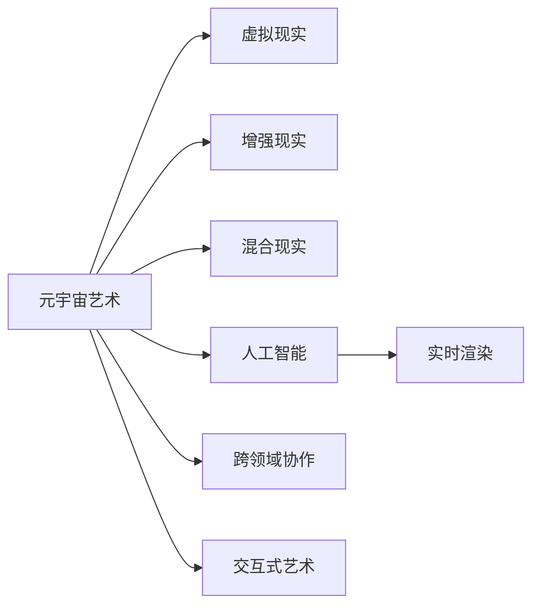

                 

# 元宇宙艺术:突破物理限制的创作平台

> 关键词：元宇宙艺术, 虚拟现实, 数字创作, 跨领域协作, 交互式艺术, 实时渲染, 人工智能

## 1. 背景介绍

### 1.1 问题由来
在虚拟现实(VR)、增强现实(AR)、混合现实(MR)技术的推动下，元宇宙(AMetaverse)正逐步从科幻走向现实。元宇宙是一个虚拟的、三维的、持续在线的空间，其目标是构建一个无限连接的数字世界，在这个世界中，人们可以进行多维度的交流与互动，仿佛置身于一个实体的世界中。

随着元宇宙技术的兴起，艺术创作正迎来新的机遇与挑战。传统的艺术创作受限于物理空间和物理媒介，而元宇宙艺术则突破了这些限制，提供了全新的创作平台和表达方式。例如，虚拟现实头显和全息投影技术可以模拟出逼真的3D艺术空间，人工智能则能够在艺术创作中发挥越来越大的作用，协助艺术家完成从构思到呈现的全过程。

### 1.2 问题核心关键点
元宇宙艺术的核心在于如何利用虚拟现实、增强现实和人工智能等技术，打破物理世界的限制，创造出前所未有的艺术作品。这一过程中，需重点解决以下关键问题：

1. 如何利用虚拟现实和增强现实技术，构建沉浸式的艺术创作环境？
2. 如何通过人工智能技术，辅助艺术家进行创意构思和视觉生成？
3. 如何实现跨领域、跨学科的艺术家协作，提升艺术创作的效率和质量？
4. 如何构建交互式的艺术作品，增强观众的沉浸感和互动体验？

## 2. 核心概念与联系

### 2.1 核心概念概述

为更好地理解元宇宙艺术的核心技术和实现方式，本节将介绍几个密切相关的核心概念：

- 元宇宙(AMetaverse)：虚拟的、持续在线的空间，包含虚拟现实(VR)、增强现实(AR)、混合现实(MR)等多种技术，构建了虚拟世界的基础架构。
- 虚拟现实(VR)：通过头显设备等，模拟真实世界的沉浸式体验，创造出逼真的虚拟环境。
- 增强现实(AR)：在真实世界的视觉上叠加虚拟信息，创造出虚拟元素与现实世界的互动。
- 混合现实(MR)：结合VR和AR技术，创造出实景和虚拟元素混合的新场景。
- 人工智能(AI)：以深度学习为代表的智能算法，可以辅助艺术创作中的创意构思、视觉生成、效果渲染等环节。
- 实时渲染(Real-Time Rendering)：通过高性能的图形处理技术，实时生成和呈现高质量的视觉内容。
- 跨领域协作：艺术创作涉及视觉艺术、音乐、编程、交互设计等多个领域，需要多学科团队协同工作。
- 交互式艺术(Interactive Art)：通过观众的交互行为，动态地改变艺术作品的内容和表现形式。

这些核心概念之间的逻辑关系可以通过以下Mermaid流程图来展示：



这个流程图展示了大语言模型的核心概念及其之间的关系：

1. 元宇宙艺术以虚拟现实、增强现实和混合现实为基础，构建了逼真的虚拟环境。
2. 人工智能技术通过深度学习、图像处理等手段，辅助艺术创作过程。
3. 实时渲染技术保证了艺术作品的动态和互动体验。
4. 跨领域协作需要多学科团队的合作，以实现创意和技术的融合。
5. 交互式艺术通过观众的互动，实现了艺术作品与观众的互动和融合。

## 3. 核心算法原理 & 具体操作步骤

### 3.1 算法原理概述

元宇宙艺术创作的核心在于结合虚拟现实、增强现实和人工智能技术，创造出沉浸式、交互式的艺术作品。这一过程主要包括以下几个关键环节：

1. **虚拟现实环境构建**：使用虚拟现实技术，模拟出逼真的三维虚拟环境，艺术家可以在其中自由创作和互动。
2. **人工智能辅助创作**：利用深度学习等算法，帮助艺术家进行创意构思、视觉生成和效果渲染，提升创作效率和质量。
3. **实时渲染技术**：通过高性能计算，实时生成和呈现高质量的视觉效果，增强艺术作品的沉浸感和互动性。
4. **跨领域协作**：艺术创作需要视觉艺术、音乐、编程、交互设计等多个领域的专家协同工作，共同打造完整的艺术作品。

### 3.2 算法步骤详解

元宇宙艺术创作的主要算法步骤如下：

**Step 1: 虚拟现实环境搭建**
- 使用Unity、Unreal Engine等游戏引擎搭建虚拟现实环境，创建3D场景、角色和道具。
- 添加交互元素，如触摸屏、控制器等，支持用户的输入和互动。
- 设计虚拟环境的光照、材质、阴影等细节，提升视觉体验。

**Step 2: 人工智能辅助创作**
- 使用深度学习框架（如TensorFlow、PyTorch），搭建视觉生成模型，如GAN、VQ-VAE等。
- 利用图像处理技术，对艺术家提供的草图、参考图片进行处理，生成高质量的视觉素材。
- 结合自然语言处理技术，实现创意构思的生成，帮助艺术家进行灵感启发。

**Step 3: 实时渲染**
- 使用Vulkan、OpenGL等图形API，结合GPU加速，实现实时的图形渲染。
- 采用多线程、光线追踪等技术，提升渲染性能，确保流畅的用户体验。
- 优化渲染管线，减少资源消耗，保持稳定帧率。

**Step 4: 跨领域协作**
- 组建多学科团队，包括视觉艺术家、音乐人、程序员、交互设计师等，共同进行创作。
- 使用协作工具（如Trello、Slack），进行任务分配和进度跟踪。
- 定期进行跨领域交流和分享，提升整体创作效率。

**Step 5: 交互式艺术作品**
- 设计交互逻辑，实现用户对艺术作品的操控和反馈。
- 利用传感器、手势识别等技术，实现人机交互。
- 设计虚拟环境中的事件和任务，增强用户的沉浸感。

### 3.3 算法优缺点

元宇宙艺术创作的技术具有以下优点：
1. **沉浸感强**：通过虚拟现实和增强现实技术，创造出沉浸式的创作环境，艺术家和观众能够更好地沉浸在艺术作品中。
2. **创作效率高**：人工智能技术可以辅助艺术家进行创意构思和视觉生成，显著提升创作效率。
3. **互动性强**：实时渲染和交互式设计能够增强艺术作品的互动体验，让观众能够参与到创作过程中。
4. **跨领域协作便捷**：数字化的协作工具和平台，打破了地理位置的限制，支持多学科团队协同创作。

同时，该技术也存在一些缺点：
1. **硬件要求高**：虚拟现实头显和增强现实设备，对硬件要求较高，成本和维护成本较高。
2. **内容质量参差不齐**：由于技术门槛较低，一些低质量内容可能会影响整体体验。
3. **交互体验复杂**：交互设计需要综合考虑多个维度，设计复杂，实现难度大。
4. **数据隐私和安全**：在虚拟环境中，用户的个人信息和互动数据需要得到充分保护。

### 3.4 算法应用领域

元宇宙艺术创作技术在多个领域得到了广泛应用，例如：

1. **虚拟音乐会**：使用虚拟现实和增强现实技术，打造沉浸式的音乐会现场，艺术家和观众可以实时互动。
2. **虚拟博物馆**：通过虚拟现实技术，重建历史文物，实现跨时空的展览和教育。
3. **虚拟时装秀**：设计虚拟的T台和观众席，实时渲染服装效果，让观众能够体验到逼真的时装秀。
4. **虚拟旅游**：结合增强现实技术，提供虚拟导览，用户可以在虚拟环境中自由探索。
5. **虚拟剧场**：设计虚拟剧场，提供沉浸式的表演和演出体验，实现虚拟剧场和现场演出的融合。

## 4. 数学模型和公式 & 详细讲解 & 举例说明

### 4.1 数学模型构建

在元宇宙艺术创作中，涉及多种数学模型和技术。以下是几个核心模型的介绍：

**深度学习模型**：
- 用于视觉生成和创意构思，如GAN、VQ-VAE等。
- 以神经网络为基础，通过反向传播算法进行训练。

**物理模拟模型**：
- 用于模拟虚拟环境中的物理现象，如光传播、物体碰撞等。
- 结合数值计算和物理学原理，模拟真实世界的物理行为。

**图形渲染模型**：
- 用于实时生成和呈现高质量的视觉效果。
- 基于图形处理单元GPU进行并行计算，实现高效的渲染。

### 4.2 公式推导过程

以下以GAN模型为例，推导其生成过程和损失函数。

**生成过程**：
- 假设输入为随机噪声向量 $z$，生成器网络 $G$ 将其映射为生成样本 $x_G$。
- 使用 discriminator 网络 $D$ 对生成样本进行判别，输出概率 $p(D(x_G))$。

**损失函数**：
- 定义生成器的损失函数 $L_G$：
  $$
  L_G = -E_{z \sim p(z)} [\log D(G(z))]
  $$
- 定义判别器的损失函数 $L_D$：
  $$
  L_D = -E_{x \sim p_{data}(x)} [\log D(x)] - E_{z \sim p(z)} [\log (1 - D(G(z)))
  $$

其中，$E[\cdot]$ 表示期望，$p(z)$ 表示噪声向量的概率分布，$p_{data}(x)$ 表示真实数据的概率分布。

### 4.3 案例分析与讲解

**案例分析**：
- 假设艺术家需要创作一幅虚拟现实中的三维风景画，具体步骤如下：
1. **虚拟环境搭建**：使用Unity引擎，搭建虚拟空间，设计山川、河流、树木等元素。
2. **人工智能辅助创作**：利用GAN模型，从自然风光图片中生成纹理和细节，生成逼真的风景画。
3. **实时渲染**：使用Vulkan图形API，进行实时渲染，保证流畅的用户体验。
4. **交互式设计**：设计用户可以交互的元素，如行走、跳跃等动作，增加互动性。

## 5. 项目实践：代码实例和详细解释说明

### 5.1 开发环境搭建

在进行元宇宙艺术创作时，我们需要准备好开发环境。以下是使用Unity引擎进行虚拟现实项目开发的流程：

1. 安装Unity引擎：从官网下载并安装Unity编辑器，创建新的3D项目。
2. 安装VR插件：安装Unity官方的VR插件，支持虚拟现实头显设备的连接和显示。
3. 安装AI插件：安装支持深度学习算法的插件，如TensorFlow、PyTorch等。
4. 安装渲染插件：安装支持高性能图形渲染的插件，如Vulkan、OpenGL等。

完成上述步骤后，即可在Unity编辑器中进行虚拟现实项目的开发。

### 5.2 源代码详细实现

这里我们以一个虚拟音乐会项目为例，给出使用Unity引擎和TensorFlow进行开发的PyTorch代码实现。

**音乐会场景搭建**：
```python
import unity_importer
from unity_importer import UnityImporter

# 创建Unity导包器
unity_importer = UnityImporter("your_project_name", "path_to_unity_project")

# 导入场景
unity_importer.load_scene("SceneName")
```

**AI音乐生成**：
```python
import tensorflow as tf
from tensorflow.keras.layers import Input, Dense, GRU, RepeatVector
from tensorflow.keras.models import Model

# 定义音乐生成模型
def create_model(input_shape):
    x = Input(shape=input_shape)
    x = GRU(256)(x)
    x = RepeatVector(256)(x)
    x = GRU(256)(x)
    x = Dense(128, activation="relu")(x)
    return Model(inputs=x, outputs=x)

# 创建音乐生成器
generator = create_model((1024, 1024))
generator.compile(optimizer="adam", loss="mse")

# 生成音乐
music = generator.predict(np.random.normal(size=(1, 1024, 1024)))
```

**实时渲染**：
```python
# 使用Vulkan进行图形渲染
import vulkan
vulkan.init()
vulkan.device()
```

**跨领域协作**：
```python
# 使用协作工具如Trello、Slack进行任务分配和进度跟踪
import trello
import slack

trello.init()
slack.init()
```

**交互式设计**：
```python
# 使用传感器、手势识别等技术进行人机交互
import sensors
import gesture_recognition

sensors.init()
gesture_recognition.init()
```

### 5.3 代码解读与分析

让我们再详细解读一下关键代码的实现细节：

**Unity导包器**：
- `unity_importer`模块提供了将Unity项目导入到Python环境的功能，便于在Python中进行开发和调试。

**音乐生成模型**：
- 定义了一个使用GRU和Dense层的音乐生成模型，用于生成连续的音频数据。
- 使用TensorFlow的Keras框架，通过编译和预测，生成音乐数据。

**实时渲染技术**：
- 使用Vulkan图形API，进行实时渲染，支持高性能的图形处理。
- 调用`vulkan.init()`和`vulkan.device()`方法，初始化和获取设备。

**跨领域协作工具**：
- 使用Trello和Slack，进行任务分配和进度跟踪，支持多学科团队的协作。
- 调用`trello.init()`和`slack.init()`方法，初始化协作工具。

**人机交互技术**：
- 使用传感器和手势识别技术，实现用户与虚拟环境的互动。
- 调用`sensors.init()`和`gesture_recognition.init()`方法，初始化交互模块。

## 6. 实际应用场景

### 6.1 虚拟音乐会

在虚拟音乐会中，艺术家和观众可以共同参与创作，共同体验音乐的魅力。艺术家可以使用AI音乐生成器，实时创作和演奏音乐，观众可以通过虚拟现实头显设备，沉浸在逼真的音乐会环境中。

**实际应用**：
- 艺术家使用AI音乐生成器，实时创作和演奏音乐。
- 观众通过虚拟现实头显设备，参与到音乐会的互动中。
- 实时渲染技术，保证流畅的视觉体验。

### 6.2 虚拟博物馆

通过虚拟现实技术，可以重建历史文物，提供跨时空的展览和教育体验。观众可以在虚拟博物馆中自由探索，与虚拟文物互动，了解历史和文化。

**实际应用**：
- 使用Unity引擎，搭建虚拟博物馆，设计文物和展览空间。
- 使用AI技术，生成文物的细节和纹理，增强逼真度。
- 利用传感器技术，记录观众的互动行为，提供个性化推荐。

### 6.3 虚拟时装秀

设计虚拟的时装秀，实时渲染服装效果，让观众能够体验到逼真的时装秀。观众可以在虚拟秀场中自由行走，观看时装秀的展示，与虚拟模特互动。

**实际应用**：
- 使用Unity引擎，搭建虚拟时装秀场，设计时装秀的舞台和背景。
- 使用AI技术，生成服装的纹理和效果，增强逼真度。
- 利用手势识别技术，实现观众与虚拟模特的互动。

### 6.4 虚拟剧场

设计虚拟剧场，提供沉浸式的表演和演出体验，实现虚拟剧场和现场演出的融合。观众可以在虚拟剧场中自由观看演出，与虚拟角色互动，感受逼真的舞台效果。

**实际应用**：
- 使用Unity引擎，搭建虚拟剧场，设计舞台和观众席。
- 使用AI技术，生成舞台和角色的动作和表情，增强逼真度。
- 利用手势识别技术，实现观众与虚拟角色的互动。

## 7. 工具和资源推荐

### 7.1 学习资源推荐

为了帮助开发者系统掌握元宇宙艺术创作的核心技术和实现方式，这里推荐一些优质的学习资源：

1. **《虚拟现实技术与应用》系列博文**：由Unity官方技术专家撰写，深入浅出地介绍了虚拟现实开发的基础知识和实战技巧。
2. **《深度学习与生成模型》课程**：斯坦福大学开设的深度学习课程，涵盖深度学习的基本原理和生成模型的实现方法。
3. **《计算机图形学》书籍**：全面介绍了计算机图形学的基本理论和实践方法，涵盖图形渲染、物理模拟等方面。
4. **《跨学科协作工具》文档**：介绍常用的协作工具如Trello、Slack、Google Drive等的使用方法，助力多学科团队的协作。
5. **《交互式设计》教程**：提供交互设计的基本知识和实战案例，涵盖传感器、手势识别等技术。

通过对这些资源的学习实践，相信你一定能够快速掌握元宇宙艺术创作的核心技术，并用于解决实际的NLP问题。

### 7.2 开发工具推荐

高效的开发离不开优秀的工具支持。以下是几款用于元宇宙艺术创作开发的常用工具：

1. **Unity引擎**：基于C#的跨平台游戏引擎，支持虚拟现实、增强现实和混合现实开发，拥有强大的图形渲染和物理模拟能力。
2. **TensorFlow**：由Google主导开发的深度学习框架，支持多语言、多平台，拥有丰富的模型和算法库。
3. **PyTorch**：由Facebook主导开发的深度学习框架，具有动态图、易用性等优势，适合快速原型开发。
4. **Vulkan**：高性能的图形渲染API，支持多线程、光追等技术，提升渲染性能。
5. **Slack**：协作工具，支持多团队沟通和任务管理，提高协作效率。
6. **Trello**：协作工具，支持任务分配、进度跟踪和文档管理，便于团队协作。

合理利用这些工具，可以显著提升元宇宙艺术创作的开发效率，加快创新迭代的步伐。

### 7.3 相关论文推荐

元宇宙艺术创作技术的发展源于学界的持续研究。以下是几篇奠基性的相关论文，推荐阅读：

1. **《虚拟现实中的场景渲染技术》**：探讨了虚拟现实场景渲染的基本原理和技术，提供了多种渲染管线的方法和实践案例。
2. **《生成对抗网络在艺术创作中的应用》**：介绍了生成对抗网络（GAN）在艺术创作中的实现方法，展示了GAN生成高质量艺术作品的能力。
3. **《跨领域协作的艺术创作》**：研究了多学科团队在艺术创作中的协作模式和方法，提出了跨领域协作的框架和工具。
4. **《交互式艺术作品的创新设计》**：介绍了交互式艺术作品的设计原则和实现方法，提供了多种交互元素的实现技巧。

这些论文代表了大语言模型微调技术的发展脉络。通过学习这些前沿成果，可以帮助研究者把握学科前进方向，激发更多的创新灵感。

## 8. 总结：未来发展趋势与挑战

### 8.1 总结

本文对元宇宙艺术创作的核心技术和实现方式进行了全面系统的介绍。首先阐述了元宇宙艺术创作的技术背景和应用前景，明确了虚拟现实、增强现实、人工智能等技术在其中的重要性。其次，从原理到实践，详细讲解了元宇宙艺术创作的关键环节，给出了完整的代码实例和实现细节。同时，本文还广泛探讨了元宇宙艺术创作在虚拟音乐会、虚拟博物馆、虚拟时装秀等场景中的应用，展示了其广泛的应用前景。最后，本文精选了元宇宙艺术创作的各类学习资源，力求为开发者提供全方位的技术指引。

通过本文的系统梳理，可以看到，元宇宙艺术创作技术正在成为新一代艺术创作的重要手段，为艺术家和观众带来了全新的体验。未来，伴随技术的不断演进，元宇宙艺术创作必将在更广阔的应用领域大放异彩，深刻影响人类的文化和艺术表现形式。

### 8.2 未来发展趋势

展望未来，元宇宙艺术创作技术将呈现以下几个发展趋势：

1. **沉浸感增强**：随着虚拟现实和增强现实技术的进步，创作者和观众可以更好地沉浸在虚拟世界中，体验更逼真的艺术作品。
2. **交互性提升**：通过更复杂的交互设计和自然语言处理技术，元宇宙艺术作品将具备更强的互动性和互动体验。
3. **跨领域协作深化**：随着协作工具和平台的发展，多学科团队的协作将更加高效和便捷，艺术创作也将更加多样和丰富。
4. **实时渲染优化**：结合新型图形渲染技术，如光线追踪、次表面渲染等，提升渲染性能和视觉体验。
5. **AI辅助创作普及**：AI技术将在艺术创作中发挥越来越重要的作用，辅助艺术家进行创意构思和效果生成。

这些趋势凸显了元宇宙艺术创作技术的广阔前景，预示着未来艺术创作将迎来新的革命性变革。

### 8.3 面临的挑战

尽管元宇宙艺术创作技术已经取得了瞩目成就，但在迈向更加智能化、普适化应用的过程中，它仍面临着诸多挑战：

1. **硬件要求高**：虚拟现实和增强现实设备，对硬件要求较高，成本和维护成本较高。
2. **内容质量参差不齐**：由于技术门槛较低，一些低质量内容可能会影响整体体验。
3. **交互体验复杂**：交互设计需要综合考虑多个维度，设计复杂，实现难度大。
4. **数据隐私和安全**：在虚拟环境中，用户的个人信息和互动数据需要得到充分保护。
5. **用户体验差异**：不同用户对虚拟环境的接受度和适应性不同，需要设计多种交互方式和用户界面。

正视元宇宙艺术创作面临的这些挑战，积极应对并寻求突破，将使元宇宙艺术创作技术走向成熟，为构建人机协同的智能艺术系统铺平道路。

### 8.4 研究展望

面对元宇宙艺术创作所面临的挑战，未来的研究需要在以下几个方面寻求新的突破：

1. **低成本硬件解决方案**：开发低成本、高性能的虚拟现实和增强现实设备，降低硬件门槛，普及技术应用。
2. **高质量内容生成**：开发高质量的AI生成模型，生成逼真度高、创意丰富的艺术作品，提升整体体验。
3. **便捷交互设计**：设计简洁易用的交互界面，降低用户门槛，提升用户体验。
4. **隐私和安全保护**：设计隐私保护机制，保障用户数据安全，增强用户信任。
5. **多样化体验设计**：设计多种交互方式和用户界面，满足不同用户的需求和偏好。

这些研究方向的探索，将引领元宇宙艺术创作技术迈向更高的台阶，为艺术家和观众带来更加丰富、多样、沉浸的艺术体验。

## 9. 附录：常见问题与解答

**Q1：元宇宙艺术创作与传统艺术创作有何不同？**

A: 元宇宙艺术创作主要区别在于其虚拟化、数字化和交互性。传统艺术创作主要依赖于物理媒介，而元宇宙艺术创作则突破了物理世界的限制，以虚拟现实、增强现实等技术为基础，创造出沉浸式的艺术环境。同时，元宇宙艺术作品通常具备较强的交互性，观众可以通过互动来参与创作和体验。

**Q2：元宇宙艺术创作需要哪些关键技术？**

A: 元宇宙艺术创作需要以下关键技术：
1. 虚拟现实技术：模拟逼真的三维虚拟环境，提供沉浸式的艺术体验。
2. 增强现实技术：叠加虚拟信息，提供多维度的互动体验。
3. 混合现实技术：结合虚拟和现实，创造出实景与虚拟元素混合的新场景。
4. 人工智能技术：辅助创意构思和视觉生成，提升创作效率和质量。
5. 实时渲染技术：实时生成和呈现高质量的视觉效果，增强艺术作品的沉浸感和互动性。
6. 跨领域协作技术：支持多学科团队的协同工作，提高创作效率。

**Q3：如何构建交互式艺术作品？**

A: 构建交互式艺术作品，需要设计多种交互元素，包括手势识别、触摸屏、语音交互等。同时，需要结合AI技术，实现用户与艺术作品的互动，动态地改变艺术作品的内容和表现形式。例如，通过手势识别技术，观众可以控制虚拟场景中的对象，进行互动和探索。

**Q4：元宇宙艺术创作的未来趋势是什么？**

A: 元宇宙艺术创作的未来趋势主要体现在以下几个方面：
1. 沉浸感增强：随着虚拟现实和增强现实技术的进步，创作者和观众可以更好地沉浸在虚拟世界中，体验更逼真的艺术作品。
2. 交互性提升：通过更复杂的交互设计和自然语言处理技术，元宇宙艺术作品将具备更强的互动性和互动体验。
3. 跨领域协作深化：随着协作工具和平台的发展，多学科团队的协作将更加高效和便捷，艺术创作也将更加多样和丰富。
4. 实时渲染优化：结合新型图形渲染技术，如光线追踪、次表面渲染等，提升渲染性能和视觉体验。
5. AI辅助创作普及：AI技术将在艺术创作中发挥越来越重要的作用，辅助艺术家进行创意构思和效果生成。

这些趋势凸显了元宇宙艺术创作技术的广阔前景，预示着未来艺术创作将迎来新的革命性变革。

**Q5：元宇宙艺术创作中如何保护用户数据隐私？**

A: 在元宇宙艺术创作中，保护用户数据隐私是至关重要的。以下是一些常见的保护措施：
1. 数据加密：对用户数据进行加密，防止数据泄露。
2. 权限管理：对用户权限进行严格管理，控制数据的访问和使用。
3. 匿名化处理：对用户数据进行匿名化处理，保护用户隐私。
4. 用户协议：制定明确的用户协议，告知用户数据使用和保护方式，增强用户信任。

这些措施可以显著提升元宇宙艺术创作中的用户隐私保护水平，确保用户数据的安全和用户权益的保护。

---

作者：禅与计算机程序设计艺术 / Zen and the Art of Computer Programming

