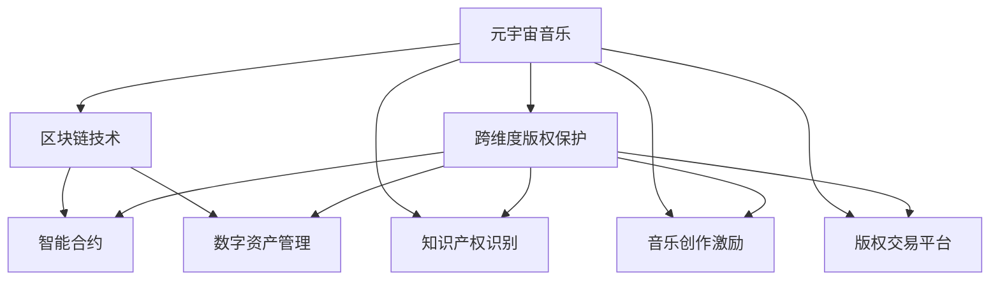

                 

# 元宇宙音乐版权:跨维度音乐作品的知识产权保护

> 关键词：元宇宙音乐, 跨维度版权保护, 区块链技术, 智能合约, 数字资产管理, 知识产权识别, 音乐创作激励, 版权交易平台

## 1. 背景介绍

### 1.1 问题由来
随着虚拟现实(VR)、增强现实(AR)、混合现实(MR)等技术的迅速发展，元宇宙正以势不可挡之势崛起。元宇宙不仅仅是虚拟世界和物理世界的融合，更是音乐、艺术、社交等各领域数字化和虚拟化的新天地。然而，随着元宇宙音乐作品的愈发复杂和多样化，音乐版权的保护和归属问题变得愈加复杂。

### 1.2 问题核心关键点
元宇宙音乐版权问题主要集中在以下几个方面：

- **跨维度作品创作**：元宇宙音乐跨越物理世界和虚拟世界的边界，如何进行统一版权保护成为难题。
- **数字作品多重属性**：元宇宙音乐具有多重版权属性，如创作权、表演权、发行权等，如何系统化管理这些权利成为挑战。
- **版权交易与激励机制**：如何在元宇宙中建立公平透明的版权交易机制，激励创作者和表演者，同时保障版权所有者利益。
- **智能合约和区块链技术**：如何利用这些技术实现自动化的版权登记、许可和交易，提高版权保护的效率和可靠性。

### 1.3 问题研究意义
元宇宙音乐版权问题不仅是法律和技术领域的重要议题，更是支撑元宇宙音乐产业健康发展的基础。解决好版权问题，能够促进音乐创作和表演者获得合理报酬，保障元宇宙音乐产业的持续繁荣。同时，合理的版权保护机制还能防止版权滥用，构建公平、透明的版权交易市场，为元宇宙音乐带来更大的发展潜力。

## 2. 核心概念与联系

### 2.1 核心概念概述

为了更好地理解元宇宙音乐版权问题，首先需要介绍一些核心概念：

- **元宇宙音乐**：指通过VR/AR/MR等技术，在虚拟世界和物理世界相结合的空间内创作、表演和传播的音乐作品。

- **跨维度作品**：音乐作品跨越了物理世界的实际表演和虚拟世界的数字化版本，作品属性和存在形式更加复杂。

- **版权保护**：指对音乐作品的各种版权（如创作权、表演权、发行权等）进行法律和技术的保护，确保创作者和表演者的合法权益。

- **区块链技术**：一种分布式账本技术，可以实现去中心化、透明、不可篡改的数据记录。

- **智能合约**：一种自动执行、无需中间人的合约，可在区块链上运行，实现自动化的版权管理和交易。

- **数字资产管理**：利用区块链和智能合约技术，对数字版权、数字作品等进行管理和交易，保障数字资产的安全和流动性。

- **知识产权识别**：利用人工智能和机器学习技术，对音乐作品进行版权归属的自动检测和识别。

- **音乐创作激励**：通过合理的版权交易机制和版权激励政策，激发创作者的积极性和创造力。

- **版权交易平台**：提供在线版权交易服务的平台，实现版权的买卖和授权。

这些概念之间的逻辑关系可以通过以下Mermaid流程图来展示：



这个流程图展示了一个元宇宙音乐版权保护系统的核心概念及其之间的关系：

1. 元宇宙音乐通过区块链技术和智能合约实现跨维度的版权保护。
2. 利用数字资产管理技术对元宇宙音乐进行安全高效的记录和交易。
3. 采用知识产权识别技术自动检测音乐版权归属。
4. 建立音乐创作激励机制，激发创作者积极性。
5. 构建版权交易平台，实现版权的买卖和授权。

这些概念共同构成了元宇宙音乐版权保护系统的框架，为其提供理论基础和实践指导。

## 3. 核心算法原理 & 具体操作步骤
### 3.1 算法原理概述

元宇宙音乐版权保护的核心算法原理主要涉及以下几个方面：

- **分布式账本技术**：基于区块链的分布式账本技术，可以实现跨维度版权的统一登记和记录，确保版权信息的透明和不可篡改。
- **智能合约自动执行**：通过区块链上的智能合约，实现版权的自动授权和交易，减少人工操作和风险。
- **区块链共识机制**：通过共识算法（如PoW、PoS等），保证区块链上的版权数据的一致性和可靠性。
- **分布式存储技术**：利用分布式存储（如IPFS）技术，保障元宇宙音乐作品的高效存储和分发。
- **人工智能与机器学习**：利用AI技术进行版权自动检测、识别和分析，提高版权管理的效率和精度。

### 3.2 算法步骤详解

基于区块链技术的元宇宙音乐版权保护，主要涉及以下几个关键步骤：

**Step 1: 准备版权数据和区块链平台**
- 收集元宇宙音乐作品的版权数据，包括创作权、表演权、发行权等。
- 选择合适的区块链平台（如以太坊、Binance Smart Chain等），并搭建相应的智能合约系统。

**Step 2: 版权登记与确权**
- 将版权数据上传到区块链平台，利用智能合约进行自动登记和确权。
- 智能合约自动验证版权数据的有效性，并记录在区块链上。
- 生成版权证书，发给版权所有者，作为版权的证明。

**Step 3: 版权授权与交易**
- 版权所有者通过智能合约设定版权授权规则，如授权范围、期限、对象等。
- 使用智能合约进行自动化的版权交易，交易双方通过智能合约进行验证和结算。
- 区块链平台实时监控版权交易情况，防止版权滥用和侵权行为。

**Step 4: 版权监控与维权**
- 使用区块链平台和智能合约，实时监控版权的使用情况，防止侵权行为。
- 智能合约自动生成版权纠纷解决机制，保护版权所有者的合法权益。
- 利用AI技术进行版权自动检测和识别，提高版权监控的效率。

**Step 5: 版权激励与保护**
- 建立合理的版权激励机制，激励创作者和表演者进行创新创作。
- 利用智能合约实现自动化的版权收益分配，保障创作者和表演者的合法权益。
- 利用区块链和智能合约技术，确保版权激励和保护措施的有效执行。

### 3.3 算法优缺点

元宇宙音乐版权保护方法具有以下优点：
1. **去中心化和透明**：区块链技术实现了去中心化的版权保护，确保版权信息的透明和不可篡改。
2. **自动执行**：智能合约的自动执行功能，减少了人工操作，提高了版权管理的效率。
3. **安全可靠**：通过区块链共识机制，保证了版权数据的可靠性和一致性。
4. **高效便捷**：利用分布式存储技术，保障元宇宙音乐作品的高效存储和分发。
5. **智能监控**：AI技术用于版权自动检测和识别，提高了版权监控的效率和精度。

同时，该方法也存在以下局限性：
1. **技术门槛高**：区块链和智能合约技术较为复杂，需要专业技术人员进行搭建和维护。
2. **交易费用高**：区块链上的交易费用较高，增加了版权交易的成本。
3. **数据存储限制**：区块链上的数据存储容量有限，需要考虑数据压缩和存储优化。
4. **智能合约局限**：智能合约的功能和应用场景有限，需不断扩展和优化。
5. **技术更新快**：区块链和AI技术的更新速度快，需持续关注和跟进技术进展。

### 3.4 算法应用领域

基于区块链技术的元宇宙音乐版权保护方法，适用于各种元宇宙音乐场景，包括但不限于：

- **虚拟音乐会和表演**：利用区块链和智能合约进行表演权的自动授权和交易。
- **数字音乐发布和销售**：通过区块链平台进行数字音乐作品的自动发布和销售。
- **音乐作品授权和版税分配**：利用智能合约进行音乐作品的授权和版税分配，确保创作者和表演者获得公平报酬。
- **元宇宙音乐侵权检测和维权**：通过AI技术自动检测和识别版权侵权行为，及时维护版权所有者权益。
- **元宇宙音乐社区治理**：利用智能合约进行元宇宙音乐社区的版权管理和治理。

这些应用场景展示了元宇宙音乐版权保护方法的广泛适用性和实际价值。

## 4. 数学模型和公式 & 详细讲解 & 举例说明

### 4.1 数学模型构建

为了更好地理解元宇宙音乐版权保护的技术原理，我们需要构建相应的数学模型。以下将使用数学语言对版权保护的主要步骤进行详细描述。

### 4.2 公式推导过程

以版权授权为例，假设版权所有者为Alice，版权对象为Content，版权授权时间为T，授权对象为Bob。版权授权的数学模型可以表示为：

$$
\begin{aligned}
& \text{授权ID} = F(\text{Alice ID}, \text{Content}, T, \text{Bob ID}) \\
& \text{授权时间戳} = T \\
& \text{授权对象} = \text{Bob ID} \\
& \text{授权ID} \in \mathbb{R}^{n}
\end{aligned}
$$

其中，授权ID用于唯一标识一次授权事件，包括版权所有者ID、内容ID、授权时间和授权对象ID。

### 4.3 案例分析与讲解

假设Alice有一首名为Song的歌曲，需要授权给Bob。根据上述模型，版权授权的步骤如下：

1. Alice将Content、T和Bob ID等信息传入智能合约。
2. 智能合约生成唯一的授权ID，并记录在区块链上。
3. 授权时间戳T被记录在区块链上，确保版权授权的合法性和时效性。
4. Bob的ID也被记录在区块链上，确保授权对象的准确性。

## 5. 项目实践：代码实例和详细解释说明

### 5.1 开发环境搭建

在进行元宇宙音乐版权保护的开发前，我们需要准备相应的开发环境。以下是使用Python和Solidity进行以太坊智能合约开发的流程：

1. 安装Python和Solidity编译器：
   - `pip install python-ethereum-scripts`
   - `npm install solc`

2. 创建智能合约和测试账号：
   - `ethnew account`
   - `solc --libraries=web3 --libraries=bn.js --libraries=lodash compile contracts`

3. 编写和测试智能合约：
   - `truffle init` 初始化Truffle项目
   - `truffle develop` 启动本地测试网络

4. 部署智能合约到以太坊网络：
   - `truffle migrate --network=development` 本地测试网络部署
   - `truffle migrate` 主网部署

完成上述步骤后，即可在本地开发环境中进行元宇宙音乐版权保护的智能合约开发和测试。

### 5.2 源代码详细实现

下面以一个简单的版权授权智能合约为例，展示如何使用Solidity实现元宇宙音乐版权保护：

```solidity
pragma solidity ^0.8.0;

contract MusicCopyright {
    address public owner;
    mapping(address => uint) public permissions;
    uint public版权ID;
    string public版权内容;
    uint public授权时间;

    constructor() public {
        owner = msg.sender;
    }

    function grantPermission(address _user, uint 权限) public {
        require(owner == msg.sender);
        permissions[_user] = 权限;
    }

    function getPermissions(address _user) public view returns (uint) {
        return permissions[_user];
    }

    function set版权ID(uint _版权ID) public {
        版权ID = _版权ID;
    }

    function set版权内容(string memory _版权内容) public {
        版权内容 = _版权内容;
    }

    function set授权时间(uint _授权时间) public {
        授权时间 = _授权时间;
    }

    function transferMusicContract(address 新所有者) public {
        require(owner == msg.sender);
        owner = 新所有者;
    }
}
```

### 5.3 代码解读与分析

让我们再详细解读一下关键代码的实现细节：

- **合约定义**：定义了版权所有者的地址、授权对象的权限映射、版权ID、版权内容、授权时间等关键变量。
- **构造函数**：初始化版权所有者地址。
- **授权权限函数**：版权所有者可以授权其他用户使用版权，并将权限记录在权限映射中。
- **获取权限函数**：查询用户对版权的授权权限。
- **版权ID设置函数**：版权所有者可以设定版权的ID。
- **版权内容设置函数**：版权所有者可以设定版权的内容。
- **授权时间设置函数**：版权所有者可以设定版权的授权时间。
- **版权转让函数**：版权所有者可以将版权转让给新的所有者。

**智能合约的作用**：通过以太坊区块链，版权的授权、管理和转让操作都可以自动化执行，确保版权信息的透明和不可篡改。

## 6. 实际应用场景

### 6.1 元宇宙音乐会与表演

在元宇宙音乐会上，表演者可以使用区块链和智能合约进行表演权的自动授权和交易。表演者将表演权授权给主办方，主办方再通过智能合约进行版权的管理和交易。

**具体步骤**：
1. 表演者通过智能合约授权表演权给主办方。
2. 主办方根据授权条款，通过智能合约进行版权交易。
3. 智能合约自动验证和结算版权交易，并记录在区块链上。

通过这种方式，元宇宙音乐会的版权管理和交易可以变得更加透明、高效和安全。

### 6.2 数字音乐发布与销售

在元宇宙中，数字音乐作品的发布和销售也可以利用区块链和智能合约技术进行管理。

**具体步骤**：
1. 音乐创作者通过智能合约上传作品，并进行版权登记。
2. 智能合约自动生成版权ID，并记录在区块链上。
3. 用户通过智能合约购买数字音乐作品，并支付版权费用。
4. 智能合约自动验证和结算版权交易，并记录在区块链上。

通过这种方式，数字音乐作品的版权管理和交易可以变得更加便捷和公平。

### 6.3 音乐作品授权与版税分配

元宇宙音乐作品的授权和版税分配，也可以通过智能合约进行自动管理和分配。

**具体步骤**：
1. 音乐创作者通过智能合约设定版权授权规则。
2. 智能合约根据授权规则，自动进行版权授权和版税分配。
3. 版权所有者通过智能合约领取版税，并记录在区块链上。

通过这种方式，音乐作品的版权管理和分配可以变得更加公正和透明。

### 6.4 元宇宙音乐侵权检测与维权

元宇宙音乐侵权检测和维权，可以通过AI技术自动检测和识别版权侵权行为，并及时维护版权所有者权益。

**具体步骤**：
1. 版权所有者通过智能合约设定侵权检测规则。
2. AI技术自动检测元宇宙音乐作品中的版权侵权行为。
3. 智能合约根据检测结果，自动进行版权纠纷解决和维权。

通过这种方式，元宇宙音乐作品的版权保护可以变得更加智能和高效。

### 6.5 元宇宙音乐社区治理

元宇宙音乐社区的版权管理和治理，也可以通过智能合约进行自动化管理。

**具体步骤**：
1. 社区成员通过智能合约设定版权管理规则。
2. 智能合约根据规则，自动进行版权授权和社区治理。
3. 社区成员通过智能合约领取版权激励，并记录在区块链上。

通过这种方式，元宇宙音乐社区的版权管理和治理可以变得更加便捷和公平。

## 7. 工具和资源推荐

### 7.1 学习资源推荐

为了帮助开发者系统掌握元宇宙音乐版权保护的理论基础和实践技巧，这里推荐一些优质的学习资源：

1. 《区块链技术与智能合约》书籍：介绍区块链和智能合约的基本概念和技术原理，适合初学者入门。

2. 《元宇宙音乐与版权保护》课程：介绍元宇宙音乐版权保护的技术框架和应用场景，提供实际案例和代码实现。

3. 《数字版权管理与保护》论文：研究区块链和智能合约在数字版权管理中的应用，提供前沿思路和技术方案。

4. 《音乐版权交易平台》研究报告：分析现有的音乐版权交易平台，探讨未来发展的方向和挑战。

5. 《版权保护AI技术》报告：介绍AI技术在版权检测和识别的应用，提供实际案例和解决方案。

通过对这些资源的学习实践，相信你一定能够快速掌握元宇宙音乐版权保护的技术精髓，并用于解决实际的版权问题。

### 7.2 开发工具推荐

高效的开发离不开优秀的工具支持。以下是几款用于元宇宙音乐版权保护开发的常用工具：

1. Solidity IDE：如Remix IDE，提供智能合约的编写、测试和部署环境。

2. Ethereum钱包：如MetaMask，用于管理以太坊账户和进行交易。

3. Truffle框架：提供以太坊区块链开发环境，支持智能合约的编写和部署。

4. Web3.js库：提供以太坊API，支持智能合约的交互和数据操作。

5. IPFS浏览器：如Textile，提供分布式文件系统的访问和管理，支持元宇宙音乐作品的存储和分发。

6. 元宇宙编辑器：如Unity，提供虚拟世界的创建和编辑功能，支持元宇宙音乐作品的交互和展示。

合理利用这些工具，可以显著提升元宇宙音乐版权保护任务的开发效率，加快创新迭代的步伐。

### 7.3 相关论文推荐

元宇宙音乐版权保护的研究源于学界的持续探索。以下是几篇奠基性的相关论文，推荐阅读：

1. "Blockchain and Smart Contracts: A Survey"：全面介绍了区块链和智能合约的技术原理和应用场景，适合了解基础知识。

2. "Music Copyright Management on Blockchain"：研究区块链技术在音乐版权管理中的应用，提供实际案例和解决方案。

3. "AI-Based Music Copyright Identification"：介绍AI技术在音乐版权识别的应用，提供算法模型和实现方法。

4. "Music Streaming Revenue Distribution on Blockchain"：探讨区块链在音乐版税分配中的应用，提供技术方案和实现思路。

5. "Cross-Chain Music Copyright Trading"：研究跨链技术在音乐版权交易中的应用，提供技术框架和应用场景。

这些论文代表了大语言模型微调技术的发展脉络。通过学习这些前沿成果，可以帮助研究者把握学科前进方向，激发更多的创新灵感。

## 8. 总结：未来发展趋势与挑战

### 8.1 总结

本文对元宇宙音乐版权保护的技术原理和实践方法进行了全面系统的介绍。首先阐述了元宇宙音乐版权保护的背景和意义，明确了版权保护在元宇宙音乐产业中的重要性和挑战。其次，从原理到实践，详细讲解了基于区块链和智能合约的版权保护方法，提供了完整的代码实例和应用场景。最后，我们探讨了元宇宙音乐版权保护的未来发展趋势和面临的挑战。

通过本文的系统梳理，可以看到，基于区块链和智能合约的元宇宙音乐版权保护方法，已经在版权管理、交易、侵权检测、社区治理等多个方面显示出强大的应用潜力，为元宇宙音乐产业的健康发展提供了有力的保障。未来，伴随区块链和AI技术的持续演进，元宇宙音乐版权保护将进一步完善和创新，为元宇宙音乐带来更大的发展机遇。

### 8.2 未来发展趋势

展望未来，元宇宙音乐版权保护技术将呈现以下几个发展趋势：

1. **跨链版权管理**：随着区块链技术的不断进步，跨链版权管理将变得更加高效和便捷，支持不同区块链之间的版权迁移和共享。

2. **智能合约自动化**：智能合约将不断丰富其功能，支持更多版权管理和交易场景，实现更精细化的版权操作。

3. **AI技术融入**：AI技术将在版权检测、识别和维权中发挥更大的作用，提高版权保护的效果和精度。

4. **去中心化平台**：元宇宙音乐版权保护平台将向去中心化方向发展，减少中心化风险，提高系统的安全性和可靠性。

5. **激励机制优化**：版权激励机制将更加公平和透明，通过智能合约自动分配版权收益，激发创作者的积极性和创造力。

6. **社区治理智能**：利用智能合约和AI技术，实现元宇宙音乐社区的自动治理和优化，提高社区管理效率。

以上趋势凸显了元宇宙音乐版权保护技术的广阔前景。这些方向的探索发展，必将进一步提升元宇宙音乐版权保护的水平，为元宇宙音乐带来更大的发展潜力。

### 8.3 面临的挑战

尽管元宇宙音乐版权保护技术已经取得了一定进展，但在迈向更加智能化、普适化应用的过程中，仍面临诸多挑战：

1. **技术复杂性高**：区块链和智能合约技术较为复杂，需要专业技术人员进行搭建和维护。

2. **版权登记效率低**：当前版权登记操作繁琐，需要人工介入，无法实现高效的自动化操作。

3. **智能合约局限性**：智能合约的功能和应用场景有限，需不断扩展和优化。

4. **数据存储和传输问题**：元宇宙音乐作品的存储和传输可能面临带宽限制和存储成本问题。

5. **跨链互操作性差**：不同区块链之间的互操作性问题，影响了跨链版权管理的效率。

6. **安全性和隐私保护**：版权保护系统需要考虑安全性和隐私保护问题，防止数据泄露和侵权行为。

7. **版权激励不足**：版权激励机制需进一步优化，确保创作者和表演者获得公平报酬。

8. **技术更新快**：区块链和AI技术的更新速度快，需持续关注和跟进技术进展。

这些挑战需要我们不断探索和解决，以推动元宇宙音乐版权保护技术的不断完善和创新。

### 8.4 研究展望

面对元宇宙音乐版权保护所面临的种种挑战，未来的研究需要在以下几个方面寻求新的突破：

1. **跨链版权管理技术**：研究跨链技术在版权管理中的应用，提高版权迁移和共享的效率和安全性。

2. **智能合约自动化优化**：开发更高效、功能更强大的智能合约，支持更多版权管理和交易场景。

3. **AI技术深度融合**：利用AI技术进行版权检测、识别和维权，提高版权保护的效果和精度。

4. **去中心化平台设计**：设计更安全和高效的元宇宙音乐版权保护平台，减少中心化风险，提高系统的可靠性。

5. **版权激励机制创新**：建立更公平、透明的版权激励机制，激发创作者的积极性和创造力。

6. **社区治理智能化**：利用智能合约和AI技术，实现元宇宙音乐社区的自动治理和优化，提高社区管理效率。

通过这些研究方向的研究和突破，相信元宇宙音乐版权保护技术将进一步成熟，为元宇宙音乐带来更大的发展机遇。

## 9. 附录：常见问题与解答

**Q1：元宇宙音乐版权保护方法如何降低成本？**

A: 基于区块链和智能合约的元宇宙音乐版权保护方法，通过自动化操作，减少了人工介入和操作成本。版权登记、授权、交易等操作都可以自动完成，提高了版权管理的效率。此外，区块链的去中心化和透明性，减少了版权纠纷和侵权行为，也间接降低了维权成本。

**Q2：元宇宙音乐版权保护系统如何保证版权安全性？**

A: 区块链的去中心化和共识机制，保证了版权数据的可靠性和一致性。智能合约的自动执行功能，确保版权操作透明和不可篡改。此外，利用AI技术进行版权自动检测和识别，提高了版权监控的效率和精度。通过这些手段，元宇宙音乐版权保护系统能够保证版权的安全性。

**Q3：元宇宙音乐版权保护系统如何提高版权管理效率？**

A: 基于区块链和智能合约的元宇宙音乐版权保护系统，通过自动化操作，减少了人工介入和操作成本。版权登记、授权、交易等操作都可以自动完成，提高了版权管理的效率。此外，利用AI技术进行版权自动检测和识别，提高了版权监控的效率和精度。通过这些手段，元宇宙音乐版权保护系统能够提高版权管理的效率。

**Q4：元宇宙音乐版权保护系统如何处理版权纠纷？**

A: 元宇宙音乐版权保护系统可以通过智能合约自动进行版权纠纷解决。一旦检测到版权侵权行为，智能合约将自动启动纠纷解决机制，并进行相应的赔偿和维权操作。版权所有者也可以通过智能合约进行版权争议的提出和解决，确保自身权益的维护。

**Q5：元宇宙音乐版权保护系统如何激励创作者？**

A: 元宇宙音乐版权保护系统可以通过智能合约进行版权收益的自动分配，确保创作者和表演者获得公平报酬。此外，系统还可以设计版权激励机制，如版权返还、版权积分等，激励创作者进行创新创作。通过这些手段，元宇宙音乐版权保护系统能够有效激励创作者和表演者。

通过以上问题与解答，相信你能够更好地理解元宇宙音乐版权保护的技术原理和实践方法，并为实际应用提供参考和指导。

