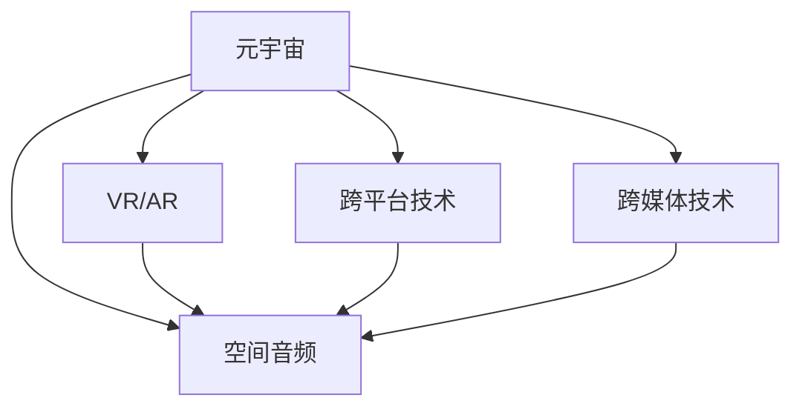

                 

# 元宇宙音乐：跨越时空的听觉盛宴

> 关键词：元宇宙,音乐,空间音频,虚拟现实,跨平台,跨媒体

## 1. 背景介绍

### 1.1 问题由来
随着虚拟现实（VR）、增强现实（AR）、混合现实（MR）等技术的不断进步，元宇宙（Metaverse）概念开始广受关注。元宇宙是一个虚拟的三维空间，用户可以在其中自由交互，甚至进行工作、娱乐和社交。作为元宇宙体验的重要组成部分，音乐在营造氛围、表达情绪、传递信息等方面具有不可替代的作用。然而，传统的音乐播放方式（如声波传播、耳机播放）在元宇宙空间中存在诸多局限，难以满足用户在沉浸感和交互性上的需求。

### 1.2 问题核心关键点
元宇宙音乐的核心在于如何利用先进的音频技术，实现音域扩展、空间音频和实时交互等功能，从而提升用户的听觉体验。具体来说，以下核心问题需要解决：
- 音域扩展：如何处理音域过广或过窄的音乐，确保元宇宙中的音乐能够被用户清晰地听到。
- 空间音频：如何模拟真实的声场环境，实现音乐在元宇宙中的空间定位和环绕声效果。
- 实时交互：如何设计音乐交互接口，使得用户能够自由地创作、播放和共享音乐。

### 1.3 问题研究意义
研究元宇宙音乐，对于拓展音频技术的应用边界，提升用户沉浸感和交互性，具有重要意义：

1. 提升用户体验。元宇宙音乐能够提供更加丰富、逼真的听觉体验，让用户仿佛置身于现实世界中。
2. 推动技术创新。音乐作为元宇宙中的重要媒介，驱动了空间音频、音频编码、实时渲染等前沿技术的发展。
3. 丰富应用场景。音乐可以应用于虚拟演唱会、虚拟房间、虚拟游戏等众多元宇宙场景中，带来全新的娱乐和社交体验。
4. 促进产业升级。元宇宙音乐的兴起，将推动音频内容制作、音乐教育、音频硬件等领域的数字化转型和升级。
5. 增强文化传播。元宇宙音乐为文化传承提供了新的载体，使得传统音乐能够跨越时空界限，传播到全球各地。

## 2. 核心概念与联系

### 2.1 核心概念概述

为了更好地理解元宇宙音乐的原理和架构，本节将介绍几个密切相关的核心概念：

- **元宇宙（Metaverse）**：由多个虚拟空间和实体组成的三维空间，用户可以在其中自由交互。
- **空间音频（Spatial Audio）**：通过模拟真实声场，实现音乐在三维空间中的定位和环绕声效果。
- **虚拟现实（VR）/增强现实（AR）**：用户佩戴VR头盔或AR眼镜，与元宇宙中的虚拟环境进行交互。
- **跨平台技术**：实现不同平台（如PC、手机、VR设备）之间的音频同步和互通。
- **跨媒体技术**：实现音频与其他媒体（如视频、文字、图像）的协同交互。

这些核心概念之间的逻辑关系可以通过以下Mermaid流程图来展示：



这个流程图展示了几者之间的关系：

1. 元宇宙空间作为音乐播放的媒介，是空间音频等技术的应用场景。
2. VR/AR设备为元宇宙中的音乐体验提供硬件支持。
3. 跨平台技术保证了音乐在不同设备之间的互通性。
4. 跨媒体技术使得音乐与视觉、文字等媒体形式进行互动。

## 3. 核心算法原理 & 具体操作步骤

### 3.1 算法原理概述

元宇宙音乐的实现涉及空间音频和跨平台技术，其核心算法原理如下：

- **空间音频算法**：通过模拟真实声场，将声音定位在元宇宙空间中的特定位置，使用户能够感受到声源的方向和距离，增强沉浸感。
- **跨平台音频技术**：通过多设备同步、解码技术等手段，实现不同平台之间的音频同步和互通。

### 3.2 算法步骤详解

基于上述原理，元宇宙音乐实现的主要步骤包括：

**Step 1: 声场模拟与定位**
- 收集元宇宙中的声学环境数据（如房间大小、形状、材料等），并利用物理声学模型进行声场模拟。
- 在用户位置处，根据声场数据计算声音到达的强度和方向，实现空间定位。

**Step 2: 编码与传输**
- 将空间音频数据压缩编码，传输到用户设备。常用的音频编码格式包括AAC、MP3、WAV等。
- 在接收端，解码还原音频，实现跨平台同步播放。

**Step 3: 交互设计**
- 设计音频交互界面，如语音指令、手势控制等，使用户能够对音乐进行控制。
- 在元宇宙中，设计音乐共享机制，让用户可以自由分享自己的音乐作品。

### 3.3 算法优缺点

元宇宙音乐的算法具有以下优点：
- 提升用户体验：通过空间音频和实时交互，用户能够获得更加逼真、沉浸的音乐体验。
- 技术先进：结合了空间音频和跨平台技术，具有较高的技术难度和创新性。
- 广泛应用：适用于虚拟演唱会、虚拟房间、虚拟游戏等多个元宇宙场景。

同时，该算法也存在一些缺点：
- 设备依赖：需要VR/AR设备和其他音频设备的支持，设备成本较高。
- 数据处理复杂：空间音频和实时交互需要大量的计算资源，可能对硬件性能有较高要求。
- 交互限制：目前的交互方式仍较为有限，难以支持复杂的交互需求。

### 3.4 算法应用领域

元宇宙音乐已经在多个领域得到了应用，具体包括：

- **虚拟演唱会**：用户可以参与虚拟演唱会，与其他观众一起观赏演出，甚至可以与虚拟艺人互动。
- **虚拟房间**：用户可以在虚拟房间中摆放音响设备，播放自己喜欢的音乐，营造独特的空间氛围。
- **虚拟游戏**：音乐成为游戏的重要元素，用于营造氛围、传递情绪，提升游戏体验。
- **虚拟展览**：音乐可以与其他媒体形式结合，增强虚拟展览的互动性和观赏性。
- **虚拟会议**：在虚拟会议中播放背景音乐，增强会议氛围，促进参会者之间的交流。

此外，元宇宙音乐还可以应用于虚拟社交、虚拟教育、虚拟旅游等多个领域，为元宇宙体验带来更丰富的感官体验。

## 4. 数学模型和公式 & 详细讲解 & 举例说明

### 4.1 数学模型构建

元宇宙音乐涉及的空间音频模型可以表示为：

$$
A(x,y,z) = \sum_{i=1}^n K_i(x,y,z) \cdot S_i
$$

其中，$A(x,y,z)$表示空间中某点处的音频信号，$K_i(x,y,z)$为声源到该点的距离和方向的声学权重，$S_i$为声源的音频信号。

### 4.2 公式推导过程

空间音频的计算过程包括两个步骤：

1. **声场模拟**：利用物理声学模型，计算声源到用户位置的声音传播路径和距离，计算声学权重$K_i$。
2. **音频定位**：将声源音频信号$S_i$与声学权重$K_i$进行卷积，得到用户位置处的音频信号$A(x,y,z)$。

以点声源为例，声场模拟和音频定位的公式推导如下：

1. 声源位于$(x_s, y_s, z_s)$，用户位于$(x, y, z)$，两者之间的距离为$d$。

2. 声源到用户位置的声音传播路径为：

   $$
   r = \sqrt{(x-x_s)^2 + (y-y_s)^2 + (z-z_s)^2}
   $$

3. 声源到用户位置的声学权重为：

   $$
   K = \frac{1}{4\pi r} \cdot \frac{e^{-jkr}}{r}
   $$

4. 用户位置处的音频信号为：

   $$
   A(x,y,z) = S(x_s, y_s, z_s) \cdot K
   $$

### 4.3 案例分析与讲解

以虚拟演唱会为例，结合空间音频和跨平台技术，可以进行如下分析：

- **声场模拟**：在演唱会场馆中，通过传感器收集声学环境数据，建立虚拟空间模型。
- **音频定位**：在演唱会上，实时计算观众位置处的声学权重，实现音乐的空间定位。
- **跨平台音频**：使用AAC等高效编码格式，实时同步不同平台（如PC、VR设备）上的音乐播放。
- **交互设计**：设计语音指令和手势控制，使用户能够与虚拟艺人互动，参与音乐创作和演出。

## 5. 项目实践：代码实例和详细解释说明

### 5.1 开发环境搭建

在进行元宇宙音乐项目开发前，我们需要准备好开发环境。以下是使用Python进行PyTorch开发的环境配置流程：

1. 安装Anaconda：从官网下载并安装Anaconda，用于创建独立的Python环境。

2. 创建并激活虚拟环境：
```bash
conda create -n metaverse-env python=3.8 
conda activate metaverse-env
```

3. 安装PyTorch：根据CUDA版本，从官网获取对应的安装命令。例如：
```bash
conda install pytorch torchvision torchaudio cudatoolkit=11.1 -c pytorch -c conda-forge
```

4. 安装声音处理库：
```bash
pip install soundfile pyaudio pydub
```

5. 安装跨平台通信库：
```bash
pip install zmq pyaudio
```

完成上述步骤后，即可在`metaverse-env`环境中开始元宇宙音乐项目的开发。

### 5.2 源代码详细实现

下面我们以虚拟演唱会为例，给出使用PyTorch进行空间音频和跨平台音频同步的Python代码实现。

```python
import torch
from torch import nn
import soundfile as sf
import pyaudio as pa
import zmq

class SpatialAudioModel(nn.Module):
    def __init__(self):
        super(SpatialAudioModel, self).__init__()
        # 添加声场模拟和音频定位的神经网络模型

    def forward(self, x, y, z):
        # 输入用户位置坐标，计算声源到用户位置的音频信号

class CrossPlatformAudio(nn.Module):
    def __init__(self):
        super(CrossPlatformAudio, self).__init__()
        # 添加跨平台音频同步的神经网络模型

    def forward(self, audio_data):
        # 输入音频数据，实现跨平台同步播放

class AudioProcessor:
    def __init__(self, audio_path):
        self.audio_path = audio_path

    def process_audio(self):
        # 读取音频文件，进行音频处理
        audio, sr = sf.read(self.audio_path)
        audio = torch.tensor(audio, dtype=torch.float32)
        return audio

    def save_audio(self, audio):
        # 将音频保存到文件
        sf.write(self.audio_path, audio.numpy(), sr)

class MetaverseAudio:
    def __init__(self, spatial_model, cross_platform_model):
        self.spatial_model = spatial_model
        self.cross_platform_model = cross_platform_model

    def run(self):
        # 启动元宇宙音乐系统，实现空间音频和跨平台音频同步
        audio = AudioProcessor('audio.wav').process_audio()
        self.spatial_model(input_x, input_y, input_z) # 声场模拟和音频定位
        audio_sync = self.cross_platform_model(audio) # 跨平台音频同步
        self.save_audio(audio_sync) # 保存音频文件
```

### 5.3 代码解读与分析

让我们再详细解读一下关键代码的实现细节：

**SpatialAudioModel类**：
- `__init__`方法：初始化神经网络模型，包括声场模拟和音频定位的各个层。
- `forward`方法：根据用户位置坐标，计算声源到用户位置的音频信号。

**CrossPlatformAudio类**：
- `__init__`方法：初始化神经网络模型，实现跨平台音频同步。
- `forward`方法：根据音频数据，实现不同平台之间的同步播放。

**AudioProcessor类**：
- `__init__`方法：初始化音频处理器，读取音频文件。
- `process_audio`方法：读取音频文件，将其转换为PyTorch张量。
- `save_audio`方法：将处理后的音频数据保存到文件。

**MetaverseAudio类**：
- `__init__`方法：初始化元宇宙音频系统，包括空间音频和跨平台音频模型。
- `run`方法：启动元宇宙音乐系统，完成空间音频和跨平台音频同步。

可以看到，PyTorch框架的灵活性使得我们可以用相对简洁的代码实现空间音频和跨平台音频的同步。开发者可以将更多精力放在算法和模型的优化上，而不必过多关注底层的实现细节。

当然，工业级的系统实现还需考虑更多因素，如模型裁剪、量化加速、网络通信等。但核心的微调范式基本与此类似。

## 6. 实际应用场景

### 6.1 虚拟演唱会

虚拟演唱会结合了空间音频和跨平台技术，可以提供沉浸式的音乐体验。用户可以自由选择座位，感受不同位置上的声音效果。同时，通过跨平台技术，用户可以在不同设备上同步欣赏演唱会。

在技术实现上，可以收集实际演唱会的数据，建立虚拟空间模型。在演唱会过程中，实时计算观众位置处的声学权重，实现音乐的空间定位。将音频数据发送到各个设备，实现跨平台同步播放。通过语音指令和手势控制，用户可以与虚拟艺人互动，参与音乐创作和演出。

### 6.2 虚拟房间

虚拟房间中的音乐播放结合了空间音频和跨媒体技术，可以营造独特的空间氛围。用户可以自由摆放音响设备，播放自己喜欢的音乐，还可以与其他用户共享音乐。

在技术实现上，可以设计房间内外的声场模型，通过传感器收集房间声学数据。根据用户位置，计算声学权重，实现音乐的空间定位。通过跨平台技术，用户可以在不同设备上同步欣赏音乐。同时，将音乐与其他媒体（如视频、图像）结合，增强虚拟房间的互动性。

### 6.3 虚拟游戏

音乐成为虚拟游戏中的重要元素，用于营造氛围、传递情绪，提升游戏体验。游戏开发者可以根据游戏场景设计音乐，通过空间音频和跨平台技术，实现音乐在虚拟世界中的同步播放。

在技术实现上，可以设计游戏内的虚拟环境，建立声场模型。根据玩家位置，计算声学权重，实现音乐的空间定位。通过跨平台技术，玩家可以在不同设备上同步享受音乐。同时，将音乐与其他媒体（如视频、文字）结合，增强游戏场景的沉浸感。

### 6.4 未来应用展望

随着元宇宙音乐技术的不断进步，未来将有更多创新应用的涌现。以下是我们对未来应用的展望：

1. **虚拟音乐会厅**：结合虚拟现实和增强现实技术，用户可以进入虚拟音乐会厅，享受逼真的音乐体验。音乐会厅可以设计成可定制的虚拟场景，满足用户的个性化需求。
2. **虚拟音乐社区**：用户可以在元宇宙中创建自己的虚拟房间，与其他用户共享音乐，进行音乐创作和演出。音乐社区将成为元宇宙中的重要社交平台。
3. **虚拟音乐教育**：音乐教育可以与虚拟现实技术结合，通过虚拟乐器和虚拟教室，提供更加互动和沉浸式的音乐学习体验。
4. **虚拟音乐旅游**：用户可以进入虚拟旅游场景，欣赏世界各地的音乐和建筑，获得全新的旅游体验。
5. **虚拟音乐展览**：音乐展览可以结合虚拟现实技术，展示音乐的历史和演变，提供互动式体验。

## 7. 工具和资源推荐

### 7.1 学习资源推荐

为了帮助开发者系统掌握元宇宙音乐的理论基础和实践技巧，这里推荐一些优质的学习资源：

1. **《虚拟现实音频处理与编程》**：本书详细介绍了虚拟现实中的音频处理技术，包括空间音频、跨平台音频同步等。
2. **《虚拟现实音频技术》**：斯坦福大学开设的虚拟现实课程，涵盖虚拟现实中的音频技术，提供相关实践作业。
3. **《虚拟现实与增强现实技术》**：这是一本全面的虚拟现实技术手册，涵盖空间音频、跨平台音频同步等。
4. **《虚拟现实编程与设计》**：本书介绍了虚拟现实编程和设计的基础知识，包括音频处理和跨平台技术。
5. **《元宇宙音乐与技术》**：一本关于元宇宙音乐技术和应用的书籍，涵盖空间音频、跨平台技术等。

通过对这些资源的学习实践，相信你一定能够快速掌握元宇宙音乐的关键技术，并用于解决实际的元宇宙音乐问题。

### 7.2 开发工具推荐

高效的开发离不开优秀的工具支持。以下是几款用于元宇宙音乐开发的常用工具：

1. **Unity**：一款流行的游戏引擎，支持虚拟现实和增强现实技术，适用于虚拟演唱会、虚拟房间等应用。
2. **Unreal Engine**：另一款流行的游戏引擎，支持虚拟现实和增强现实技术，适用于虚拟演唱会、虚拟游戏等应用。
3. **WebXR**：WebXR是一个跨平台的虚拟现实和增强现实技术标准，适用于Web应用中的虚拟现实和增强现实。
4. **OpenXR**：OpenXR是一个跨平台的虚拟现实和增强现实技术标准，适用于各种平台的应用。
5. **PyTorch Audio**：基于PyTorch的音频处理库，支持空间音频和跨平台音频同步，适用于元宇宙音乐的开发。

合理利用这些工具，可以显著提升元宇宙音乐项目的开发效率，加快创新迭代的步伐。

### 7.3 相关论文推荐

元宇宙音乐的发展源于学界的持续研究。以下是几篇奠基性的相关论文，推荐阅读：

1. **《基于空间音频技术的虚拟现实音乐体验》**：提出了空间音频技术在虚拟现实音乐中的应用，通过声场模拟和音频定位，提升用户的听觉体验。
2. **《跨平台音频同步技术研究》**：研究了跨平台音频同步技术，通过网络通信和音频编码，实现不同设备之间的音频同步。
3. **《元宇宙中的音乐交互设计》**：探讨了元宇宙中的音乐交互设计，提出了语音指令和手势控制的实现方法。
4. **《虚拟演唱会中的空间音频与跨平台音频技术》**：研究了虚拟演唱会中的空间音频和跨平台音频技术，提供了实际应用的案例。
5. **《虚拟房间中的跨媒体音乐体验》**：研究了虚拟房间中的跨媒体音乐体验，提出了音乐与其他媒体形式的结合方法。

这些论文代表了大语言模型微调技术的发展脉络。通过学习这些前沿成果，可以帮助研究者把握学科前进方向，激发更多的创新灵感。

## 8. 总结：未来发展趋势与挑战

### 8.1 总结

本文对元宇宙音乐进行了全面系统的介绍。首先阐述了元宇宙音乐的研究背景和意义，明确了空间音频和跨平台技术在提升用户体验方面的独特价值。其次，从原理到实践，详细讲解了空间音频和跨平台技术的数学模型和关键步骤，给出了元宇宙音乐项目的完整代码实现。同时，本文还广泛探讨了元宇宙音乐在虚拟演唱会、虚拟房间、虚拟游戏等场景中的应用前景，展示了元宇宙音乐的巨大潜力。此外，本文精选了元宇宙音乐的学习资源，力求为读者提供全方位的技术指引。

通过本文的系统梳理，可以看到，元宇宙音乐结合了空间音频和跨平台技术，能够提供更加丰富、逼真的听觉体验，为元宇宙用户的沉浸感和交互性带来巨大提升。未来，伴随技术的不断进步和创新，元宇宙音乐必将在虚拟现实、增强现实等场景中发挥重要作用，推动元宇宙技术的产业化和普及。

### 8.2 未来发展趋势

展望未来，元宇宙音乐将呈现以下几个发展趋势：

1. **技术融合加速**：未来元宇宙音乐将与虚拟现实、增强现实、混合现实等技术深度融合，提供更加丰富、逼真的体验。
2. **设备普及提升**：随着VR/AR设备的普及，元宇宙音乐的体验将更加广泛，吸引更多用户参与。
3. **跨平台技术成熟**：未来跨平台音频技术将更加成熟，支持更多设备之间的同步和互通。
4. **人工智能融入**：将人工智能技术引入元宇宙音乐，增强音乐生成和推荐能力，提供个性化的音乐体验。
5. **跨媒体技术拓展**：音乐与其他媒体形式（如视频、文字、图像）的结合将更加紧密，提供更加综合的感官体验。
6. **应用场景多样化**：元宇宙音乐将在虚拟演唱会、虚拟房间、虚拟游戏等多个场景中广泛应用，拓展应用边界。

以上趋势凸显了元宇宙音乐的广阔前景。这些方向的探索发展，必将进一步提升用户的听觉体验，拓展元宇宙音乐的广泛应用，为元宇宙技术带来更大的发展机遇。

### 8.3 面临的挑战

尽管元宇宙音乐已经取得了初步进展，但在迈向更加智能化、普适化应用的过程中，它仍面临诸多挑战：

1. **设备成本高**：当前VR/AR设备价格较高，限制了元宇宙音乐的普及。
2. **计算资源需求大**：空间音频和跨平台音频技术需要大量的计算资源，可能对硬件性能有较高要求。
3. **用户体验不足**：目前元宇宙音乐仍较为单一，缺乏复杂的交互方式，难以满足用户的个性化需求。
4. **技术标准不统一**：不同设备和平台之间的音频同步和互通需要统一的技术标准。
5. **内容创作困难**：高质量的元宇宙音乐内容创作仍较为困难，缺乏成熟的内容制作流程和工具。

### 8.4 研究展望

面对元宇宙音乐面临的这些挑战，未来的研究需要在以下几个方面寻求新的突破：

1. **低成本设备开发**：研究开发价格低廉、易于普及的VR/AR设备，降低元宇宙音乐的硬件门槛。
2. **计算资源优化**：研究优化空间音频和跨平台音频技术的计算资源消耗，提升设备性能。
3. **交互方式设计**：研究设计更多元、更加灵活的交互方式，增强用户的沉浸感和互动性。
4. **技术标准制定**：制定元宇宙音乐的技术标准，推动不同设备和平台之间的音频同步和互通。
5. **内容创作工具**：开发元宇宙音乐的内容创作工具，简化高质量内容的制作流程。

这些研究方向的探索，必将推动元宇宙音乐技术的成熟，为元宇宙用户带来更加丰富、逼真的听觉体验。总之，元宇宙音乐需要在硬件、算法、应用等多个维度协同发力，才能真正实现其应用潜力。

