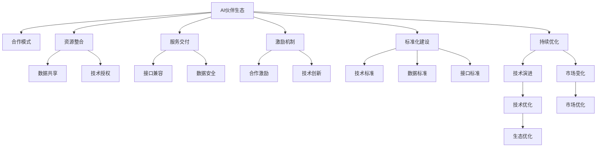

                 

## 1. 背景介绍

### 1.1 问题由来

在全球人工智能（AI）生态建设中，Lepton AI作为一家领先的人工智能公司，正在积极推动AI伙伴生态的构建。这一生态体系旨在通过跨行业、跨领域的合作，实现AI技术的普及和应用，提升全社会的智能化水平。然而，面对不断变化的市场需求和日益复杂的业务场景，如何高效整合各方资源，形成稳定且灵活的AI伙伴关系，成为Lepton AI战略合作中亟需解决的问题。

### 1.2 问题核心关键点

Lepton AI的战略合作涵盖了多个关键点：

- **合作模式**：如何选择、组织和管理合作伙伴，形成高效协同的AI伙伴关系。
- **资源整合**：如何整合各类AI技术、数据和人才资源，最大化利用现有资源。
- **服务交付**：如何构建高效的服务交付机制，确保合作伙伴间的无缝对接。
- **激励机制**：如何设计合理的激励机制，促进合作伙伴间的持续合作与创新。
- **标准化建设**：如何建立统一的标准和规范，确保合作伙伴间的数据和接口兼容。
- **持续优化**：如何对AI伙伴生态进行持续优化，适应市场变化和技术演进。

### 1.3 问题研究意义

Lepton AI的战略合作对于构建AI伙伴生态具有重要意义：

- **提升技术能力**：通过合作，Lepton AI可以快速获取各行业的AI技术优势，提升自身技术实力。
- **拓展市场应用**：合作伙伴的多样化，有助于Lepton AI在更多行业和场景中推广AI技术，拓展市场空间。
- **优化资源配置**：通过资源整合，Lepton AI可以更高效地分配和使用AI资源，提升资源利用效率。
- **增强服务质量**：与多家合作伙伴合作，可以提供更全面、更高质量的服务，满足客户多样化需求。
- **促进技术创新**：多样化的合作模式和丰富的资源池，有助于Lepton AI在AI领域进行更多探索和创新。

## 2. 核心概念与联系

### 2.1 核心概念概述

在Lepton AI的战略合作中，涉及多个核心概念：

- **AI伙伴生态**：由多家AI企业或机构组成，通过合作形成一体化的AI技术和服务体系。
- **合作模式**：合作伙伴间基于不同需求和优势进行多种合作模式，如联合研发、技术授权、数据共享等。
- **资源整合**：将各类AI资源（如技术、数据、人才等）进行有效整合，提升整体效能。
- **服务交付**：构建高效的服务交付机制，确保合作伙伴间的数据和接口兼容。
- **激励机制**：通过合理的激励措施，促进合作伙伴间的持续合作与创新。
- **标准化建设**：建立统一的标准和规范，确保合作伙伴间的技术兼容和数据互操作性。
- **持续优化**：根据市场和技术的变化，持续优化AI伙伴生态，提升整体竞争力。

这些概念之间的联系可以通过以下Mermaid流程图来展示：



这个流程图展示了Lepton AI战略合作中各个概念之间的关系：

1. 通过多种合作模式，合作伙伴形成AI伙伴生态。
2. 资源整合包括数据共享、技术授权等，提升整体效能。
3. 服务交付机制确保接口兼容，保障数据安全。
4. 激励机制促进持续合作与技术创新。
5. 标准化建设通过统一标准，提升技术兼容和数据互操作性。
6. 持续优化基于技术演进和市场变化，不断提升生态竞争力。

## 3. 核心算法原理 & 具体操作步骤

### 3.1 算法原理概述

Lepton AI的战略合作基于以下核心算法原理：

- **多模态数据融合算法**：通过将不同模态的数据（如文本、图像、语音等）进行融合，提升AI模型的泛化能力和应用范围。
- **分布式计算优化算法**：利用分布式计算框架，加速大规模数据和模型的处理和训练。
- **联合学习算法**：通过多个合作伙伴的协同训练，提升模型的综合性能。
- **协同优化算法**：基于合作伙伴间的反馈和评价，对模型和服务进行优化。

这些算法原理构成了Lepton AI战略合作的核心，确保合作伙伴间的协同高效和持续优化。

### 3.2 算法步骤详解

Lepton AI的战略合作步骤如下：

1. **需求分析**：通过问卷调查、访谈等方式，收集合作伙伴的需求和优势，确定合作方向和目标。
2. **合作伙伴选择**：基于需求和优势分析，选择适合的合作伙伴，形成初步的合作网络。
3. **资源整合**：对合作伙伴的技术、数据和人才资源进行整合，建立统一的数据和接口标准。
4. **合作模式设计**：根据合作需求和目标，设计多样化的合作模式，如联合研发、技术授权等。
5. **服务交付机制建立**：构建高效的服务交付机制，确保合作伙伴间的无缝对接和数据安全。
6. **激励机制设计**：通过合理的激励措施，促进合作伙伴间的持续合作与技术创新。
7. **标准化建设**：建立统一的技术标准和数据标准，提升合作伙伴间的互操作性。
8. **持续优化**：基于市场和技术变化，持续优化AI伙伴生态，提升整体竞争力。

### 3.3 算法优缺点

Lepton AI的战略合作算法具有以下优点：

- **资源整合高效**：通过资源整合，最大化利用现有资源，提升整体效能。
- **服务质量保障**：建立高效的服务交付机制，确保数据和接口兼容，提升服务质量。
- **技术创新促进**：多样化的合作模式和丰富的资源池，有助于技术创新和突破。
- **市场拓展能力强**：合作伙伴的多样化，有助于Lepton AI在更多行业和场景中推广AI技术。

然而，该算法也存在一些缺点：

- **复杂度高**：涉及多方合作和资源整合，管理复杂度较高。
- **协同难度大**：不同企业间的需求、文化和数据标准不同，协同难度大。
- **市场变化响应慢**：建立和优化AI伙伴生态需要一定时间，对市场变化的响应速度较慢。

### 3.4 算法应用领域

Lepton AI的战略合作算法在多个领域都有应用：

- **智能制造**：通过与多家智能制造企业合作，提升生产线的智能化水平。
- **智慧医疗**：与多家医疗企业和科研机构合作，开发AI辅助诊断和智能医疗设备。
- **金融科技**：与多家金融机构合作，提供智能风控和智能投顾服务。
- **智能交通**：与多家交通企业和科研机构合作，提升智慧交通系统的智能化水平。
- **智能安防**：与多家安防企业合作，提供智能监控和预警服务。

## 4. 数学模型和公式 & 详细讲解

### 4.1 数学模型构建

Lepton AI的战略合作算法涉及多个数学模型，其中主要包括：

- **多模态数据融合模型**：
  $$
  \text{Fusion}_{data}(x, y, z) = \alpha f(x) + \beta f(y) + \gamma f(z)
  $$
  其中，$x$、$y$、$z$分别表示文本、图像、语音等不同模态的数据，$f$表示数据融合函数，$\alpha$、$\beta$、$\gamma$为权重系数，表示不同模态数据的重要性。

- **分布式计算优化模型**：
  $$
  \text{Optimize}_{distributed}(\mathcal{D}, \mathcal{M}, \eta) = \min_{\theta} \frac{1}{n}\sum_{i=1}^n \ell(\mathcal{M}_i(\theta), x_i)
  $$
  其中，$\mathcal{D}$为数据集，$\mathcal{M}_i$表示分布在不同计算节点上的模型，$\eta$为学习率。

- **联合学习模型**：
  $$
  \text{Learn}_{federated}(\mathcal{D}_i, \mathcal{M}, \eta) = \min_{\theta} \sum_{i=1}^m \frac{1}{n_i}\sum_{j=1}^{n_i}\ell(\mathcal{M}_j(\theta), x_{ij})
  $$
  其中，$\mathcal{D}_i$表示合作伙伴$i$的数据集，$\mathcal{M}_j$表示模型在节点$j$上的复制，$\eta$为学习率。

- **协同优化模型**：
  $$
  \text{Optimize}_{collaborative}(\mathcal{D}, \mathcal{M}, \eta) = \min_{\theta} \sum_{i=1}^m \ell(\mathcal{M}_i(\theta), x_i)
  $$
  其中，$\mathcal{D}$为合作数据集，$\mathcal{M}_i$表示模型在合作伙伴$i$上的复制，$\eta$为学习率。

### 4.2 公式推导过程

以多模态数据融合模型为例，进行公式推导：

- 假设有三个不同模态的数据$x$、$y$、$z$，分别表示文本、图像、语音。
- 数据融合函数$f$表示将不同模态数据进行融合的过程，可以采用简单的加权平均或更深层次的特征融合。
- 权重系数$\alpha$、$\beta$、$\gamma$表示不同模态数据的重要性，需要通过实验或领域专家评估确定。

多模态数据融合模型的目标是最大化融合后的数据质量，最小化不同模态数据之间的冲突和干扰。通过调整权重系数，可以灵活控制不同模态数据的贡献。

### 4.3 案例分析与讲解

假设Lepton AI与智能制造企业合作，进行生产线的智能化升级。具体步骤如下：

1. **需求分析**：通过问卷调查，了解智能制造企业的需求和优势，确定合作的重点领域。
2. **合作伙伴选择**：选择与生产设备、数据分析、软件开发等相关的企业作为合作伙伴。
3. **资源整合**：将各企业的生产数据、设备数据、软件系统等资源进行整合，建立统一的数据标准和接口规范。
4. **合作模式设计**：设计联合研发模式，通过合作研发生产设备和智能监控系统。
5. **服务交付机制建立**：构建高效的服务交付机制，确保生产设备和监控系统能够无缝对接。
6. **激励机制设计**：通过技术创新和市场推广，给予合作企业适当的激励，促进持续合作。
7. **标准化建设**：建立统一的技术标准和数据标准，提升各企业间的互操作性。
8. **持续优化**：基于市场和技术变化，持续优化合作模式和系统性能。

## 5. 项目实践：代码实例和详细解释说明

### 5.1 开发环境搭建

在Lepton AI的战略合作中，开发环境搭建包括多个方面：

- **Python环境**：使用Anaconda创建虚拟环境，安装必要的Python包和依赖库。
- **分布式计算环境**：使用Spark、TensorFlow等分布式计算框架，搭建高性能计算集群。
- **数据管理平台**：使用Hadoop、Hive等大数据技术，构建数据管理和存储平台。
- **API接口管理**：使用Swagger等工具，构建统一的API接口管理平台，方便合作伙伴调用。

### 5.2 源代码详细实现

以下是一个简单的Lepton AI战略合作项目代码实现示例：

```python
from transformers import BertForSequenceClassification, BertTokenizer
from transformers import Trainer, TrainingArguments
import torch
import os
import pandas as pd

class DataLoader:
    def __init__(self, data_dir):
        self.data_dir = data_dir
        self.tokenizer = BertTokenizer.from_pretrained('bert-base-uncased')
    
    def load_data(self):
        df = pd.read_csv(self.data_dir)
        return df

class Model:
    def __init__(self, model_dir):
        self.model_dir = model_dir
        self.model = BertForSequenceClassification.from_pretrained('bert-base-uncased')
    
    def train(self, train_data, train_args):
        train_dataset = DataLoader(train_data)
        train_data = train_dataset.load_data()
        trainer = Trainer(model=self.model, args=train_args)
        trainer.train()
    
    def evaluate(self, eval_data, eval_args):
        eval_dataset = DataLoader(eval_data)
        eval_data = eval_dataset.load_data()
        trainer = Trainer(model=self.model, args=eval_args)
        trainer.evaluate()
    
    def save_model(self):
        os.makedirs(self.model_dir, exist_ok=True)
        torch.save(self.model.state_dict(), os.path.join(self.model_dir, 'model.bin'))
    
    def load_model(self):
        self.model.load_state_dict(torch.load(os.path.join(self.model_dir, 'model.bin')))

if __name__ == '__main__':
    # 设置训练参数和数据路径
    train_data = 'train.csv'
    eval_data = 'eval.csv'
    model_dir = 'model'
    
    # 创建模型实例
    model = Model(model_dir)
    
    # 设置训练参数
    train_args = {
        'epochs': 3,
        'per_device_train_batch_size': 16,
        'per_device_eval_batch_size': 64,
        'learning_rate': 2e-5,
        'gradient_accumulation_steps': 2
    }
    
    # 加载训练数据
    train_dataset = DataLoader(train_data).load_data()
    
    # 构建训练器
    trainer = Trainer(model=model.model, args=train_args)
    
    # 开始训练
    trainer.train(train_dataset)
    
    # 保存模型
    model.save_model()
```

### 5.3 代码解读与分析

上述代码示例展示了Lepton AI战略合作中模型训练和评估的基本流程。具体解读如下：

- **DataLoader类**：用于加载和处理数据，包括文本数据的分词和预处理。
- **Model类**：用于管理模型的训练和评估，包括模型加载、保存、训练和评估等。
- **train方法**：实现模型的训练过程，包括数据加载、模型前向传播、计算损失函数、反向传播、优化器更新等。
- **evaluate方法**：实现模型的评估过程，包括数据加载、模型前向传播、计算损失函数、输出评估指标等。
- **save_model方法**：将训练好的模型保存到指定目录。
- **load_model方法**：从指定目录加载模型。

## 6. 实际应用场景

### 6.1 智能制造

Lepton AI的战略合作在智能制造领域的应用场景包括：

- **智能设备监控**：通过与智能设备企业合作，开发智能监控系统，实时监测设备运行状态和维护需求。
- **智能仓储管理**：通过与仓储企业合作，开发智能仓储管理系统，优化仓储效率和资源利用率。
- **智能生产线管理**：通过与制造企业合作，开发智能生产线管理系统，提升生产线的智能化水平。

### 6.2 智慧医疗

Lepton AI的战略合作在智慧医疗领域的应用场景包括：

- **智能诊断系统**：通过与医疗企业和科研机构合作，开发智能诊断系统，辅助医生进行疾病诊断和治疗方案制定。
- **医疗数据管理**：通过与医院和医疗机构合作，开发医疗数据管理平台，提升医疗数据的安全性和利用率。
- **智能医疗设备**：通过与医疗设备企业合作，开发智能医疗设备，提升医疗设备的智能化水平。

### 6.3 金融科技

Lepton AI的战略合作在金融科技领域的应用场景包括：

- **智能风控系统**：通过与金融机构合作，开发智能风控系统，提升贷款审批和风险评估的效率和准确性。
- **智能投顾系统**：通过与金融机构合作，开发智能投顾系统，提供个性化投资建议和理财规划服务。
- **金融数据分析**：通过与金融机构合作，开发金融数据分析平台，提升金融数据处理的效率和质量。

### 6.4 未来应用展望

随着AI技术的不断发展，Lepton AI的战略合作将在更多领域得到应用，包括但不限于：

- **智能交通**：通过与交通企业和科研机构合作，开发智能交通系统，提升交通管理和出行效率。
- **智能安防**：通过与安防企业合作，开发智能监控和预警系统，提升公共安全水平。
- **智能教育**：通过与教育机构合作，开发智能教育系统，提升教育资源的利用率和教学效果。
- **智能农业**：通过与农业企业合作，开发智能农业系统，提升农业生产和管理效率。
- **智能能源**：通过与能源企业合作，开发智能能源管理系统，提升能源利用效率和安全性。

## 7. 工具和资源推荐

### 7.1 学习资源推荐

为了帮助Lepton AI合作伙伴快速掌握AI技术，推荐以下学习资源：

- **Transformers官方文档**：提供了详细的API文档和使用指南，方便开发者快速上手。
- **TensorFlow官方文档**：提供了丰富的学习资源和样例代码，涵盖从入门到高级的各个方面。
- **PyTorch官方文档**：提供了丰富的学习资源和样例代码，适合深度学习和自然语言处理任务。
- **Google Colab**：提供了免费的GPU/TPU资源，方便开发者进行实验和测试。
- **Kaggle**：提供了丰富的数据集和竞赛平台，适合数据科学家进行学习和实践。
- **Coursera**：提供了多个与AI相关的课程，涵盖从基础到高级的各个方面。

### 7.2 开发工具推荐

Lepton AI的战略合作涉及多个工具和框架，推荐以下开发工具：

- **Anaconda**：用于创建和管理Python虚拟环境，方便开发者进行开发和测试。
- **Jupyter Notebook**：用于编写和运行Python代码，支持多种代码格式和图形化展示。
- **TensorFlow**：用于构建和训练深度学习模型，支持分布式计算和GPU加速。
- **PyTorch**：用于构建和训练深度学习模型，支持动态图和GPU加速。
- **Scikit-learn**：用于数据预处理、特征工程和模型评估，适合机器学习任务。
- **Dask**：用于分布式计算和大数据处理，支持多节点并行计算。

### 7.3 相关论文推荐

Lepton AI的战略合作涉及多个前沿技术，推荐以下相关论文：

- **Transformer论文**：提出了Transformer结构，开启了NLP领域的预训练大模型时代。
- **BERT论文**：提出了BERT模型，引入基于掩码的自监督预训练任务，刷新了多项NLP任务SOTA。
- **GPT-2论文**：展示了大语言模型的强大zero-shot学习能力，引发了对于通用人工智能的新一轮思考。
- **Parameter-Efficient Transfer Learning论文**：提出Adapter等参数高效微调方法，在固定大部分预训练参数的情况下，仍可取得不错的微调效果。
- **AdaLoRA论文**：使用自适应低秩适应的微调方法，在参数效率和精度之间取得了新的平衡。

## 8. 总结：未来发展趋势与挑战

### 8.1 总结

Lepton AI的战略合作在构建AI伙伴生态方面取得了显著进展，但也面临一些挑战。本文对Lepton AI战略合作的核心概念和步骤进行了详细讲解，并给出了实际应用场景和未来展望。

通过本文的系统梳理，可以看到，Lepton AI的战略合作在资源整合、服务交付、激励机制等方面取得了一定成果，但也需要在市场变化响应、协同难度和资源利用效率等方面进行持续优化。

### 8.2 未来发展趋势

Lepton AI的战略合作未来将呈现以下几个发展趋势：

- **多模态融合深化**：将文本、图像、语音等多模态数据进行更深入的融合，提升AI模型的泛化能力和应用范围。
- **分布式计算优化**：利用分布式计算框架，加速大规模数据和模型的处理和训练。
- **联合学习普及**：基于多个合作伙伴的协同训练，提升模型的综合性能。
- **协同优化加速**：通过合作伙伴间的反馈和评价，对模型和服务进行优化。

### 8.3 面临的挑战

Lepton AI的战略合作在构建AI伙伴生态过程中，面临以下挑战：

- **管理复杂度高**：涉及多方合作和资源整合，管理复杂度较高。
- **协同难度大**：不同企业间的需求、文化和数据标准不同，协同难度大。
- **市场变化响应慢**：建立和优化AI伙伴生态需要一定时间，对市场变化的响应速度较慢。

### 8.4 研究展望

为了应对这些挑战，Lepton AI需要在以下几个方面进行持续研究：

- **智能合约**：通过智能合约管理合作伙伴间的合作协议和利益分配，降低管理复杂度。
- **多语言支持**：支持多语言数据和多语言模型的融合，扩大合作范围。
- **隐私保护**：在数据共享和模型训练过程中，加强隐私保护和数据安全。
- **模型解释性**：提升模型的可解释性和可审计性，增强信任和透明度。
- **持续学习**：开发持续学习机制，使模型能够不断吸收新知识，提升性能。

## 9. 附录：常见问题与解答

**Q1：Lepton AI的战略合作中，如何选择合适的合作伙伴？**

A: 在选择合作伙伴时，需要考虑以下因素：

- **行业相关性**：选择与Lepton AI业务领域相关或互补的企业作为合作伙伴。
- **技术优势**：选择具有领先技术优势的企业作为合作伙伴。
- **文化契合**：选择与Lepton AI文化和价值观契合的企业作为合作伙伴。
- **资源互补**：选择能够提供互补资源（如数据、人才、设备等）的企业作为合作伙伴。

**Q2：Lepton AI的战略合作中，如何管理合作伙伴间的数据安全？**

A: 在Lepton AI的战略合作中，管理合作伙伴间的数据安全需要以下措施：

- **数据加密**：在数据传输和存储过程中，使用加密技术保护数据安全。
- **权限控制**：通过访问控制列表（ACL）等技术，限制合作伙伴对数据的访问权限。
- **审计日志**：建立审计日志，记录数据访问和操作日志，便于追踪和审计。
- **隐私保护**：在数据共享和模型训练过程中，遵守相关隐私保护法规，如GDPR等。

**Q3：Lepton AI的战略合作中，如何实现高效的服务交付？**

A: 在Lepton AI的战略合作中，实现高效的服务交付需要以下措施：

- **API接口管理**：建立统一的API接口管理平台，方便合作伙伴调用。
- **分布式计算**：利用分布式计算框架，加速大规模数据和模型的处理和训练。
- **缓存机制**：使用缓存机制，减少重复计算和数据传输，提升服务效率。
- **弹性伸缩**：根据请求流量动态调整资源配置，平衡服务质量和成本。

---

作者：禅与计算机程序设计艺术 / Zen and the Art of Computer Programming

