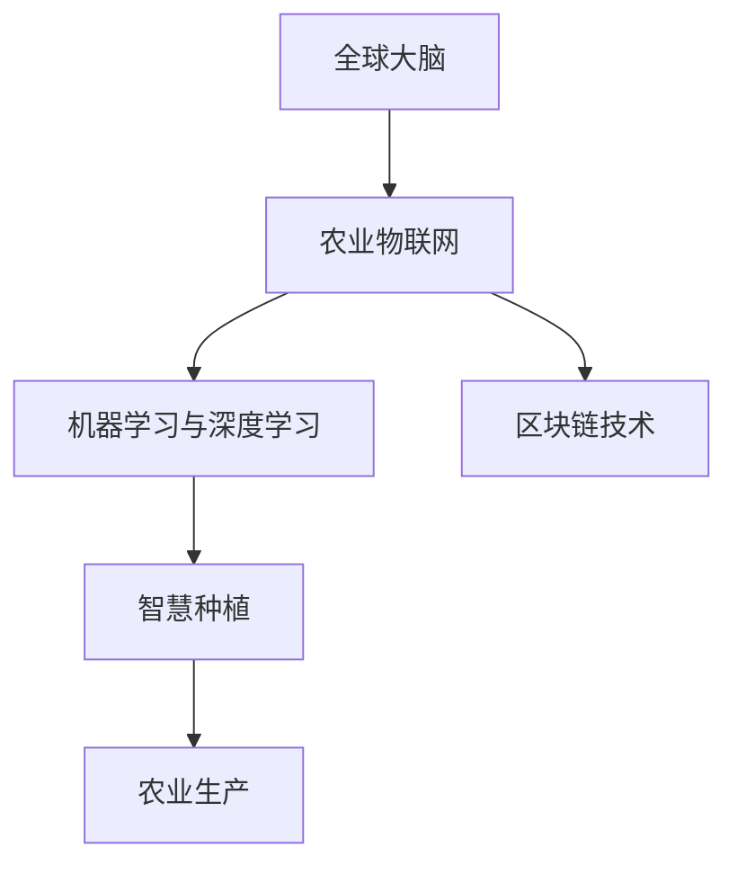

                 

## 1. 背景介绍

### 1.1 问题由来
随着全球人口的急剧增长，农业生产面临着巨大的压力。传统农业的效率低下、资源浪费严重，农业环境的恶化以及资源短缺的挑战，使得可持续农业成为全球关注的焦点。在这样的背景下，一场由全球大脑和智慧种植引领的农业革命正在悄然发生，为全球农业的未来带来了新的希望。

### 1.2 问题核心关键点
农业革命的核心在于将人工智能、大数据和区块链等现代信息技术与农业生产深度结合，实现从种植到收获的全流程智能化管理。其中，智慧种植是关键技术之一，它利用物联网、传感器、机器学习等手段，实时监测和管理农田环境、作物生长状态，优化农业生产流程，提高生产效率和产品质量。

### 1.3 问题研究意义
智慧种植技术的应用，不仅能够提升农业生产效率，降低资源消耗和环境污染，还能提高农产品产量和质量，保障食品安全，对于推动农业可持续发展具有重要意义。智慧种植技术的深入研究与应用，对于推动全球农业革命，实现农业的现代化、智能化转型，具有重大的现实意义。

## 2. 核心概念与联系

### 2.1 核心概念概述

为更好地理解全球大脑与智慧种植的未来，本节将介绍几个密切相关的核心概念：

- **全球大脑**：指通过互联网和区块链等技术，实现全球范围内人类智慧和知识的共享与协同。其基本理念是通过数据汇聚与共享，汇聚全球智慧，共同应对人类面临的各种挑战。

- **农业物联网(IoT)**：利用传感器、物联网设备等技术，实时监测农田环境参数、作物生长状态等，实现对农业生产过程的精细化管理。

- **机器学习与深度学习**：利用算法和模型对农业生产数据进行学习和分析，优化农业生产决策，提高生产效率和精度。

- **区块链技术**：通过去中心化、分布式账本等特性，确保农业生产数据的真实性、透明性和安全性，为智慧种植提供坚实的信任基础。

- **智慧种植**：将上述技术深度融合，实现从种植到收获的全流程智能化管理，提高农业生产效率和产品质量。

这些核心概念之间的逻辑关系可以通过以下Mermaid流程图来展示：



这个流程图展示了大脑与智慧种植的核心概念及其之间的关系：

1. 全球大脑汇聚和共享智慧，为智慧种植提供知识支持。
2. 农业物联网监测和感知农田环境，为智慧种植提供实时数据。
3. 机器学习与深度学习从数据中提取规律，指导智慧种植的优化决策。
4. 区块链技术确保数据真实透明，为智慧种植提供信任保障。
5. 智慧种植将上述技术深度融合，实现农业生产的智能化管理。

这些概念共同构成了智慧种植的生态体系，为农业生产带来了革命性的变革。通过理解这些核心概念，我们可以更好地把握智慧种植的应用场景和技术框架。

## 3. 核心算法原理 & 具体操作步骤
### 3.1 算法原理概述

智慧种植技术的核心算法原理主要包括物联网数据感知、机器学习优化决策和区块链数据安全三个方面。

- **物联网数据感知**：通过传感器、物联网设备等手段，实时收集农田环境数据和作物生长状态，为智慧种植提供基础数据支撑。
- **机器学习优化决策**：利用算法和模型对数据进行分析和预测，指导农业生产决策，如灌溉、施肥、病虫害防治等，实现农业生产过程的智能化优化。
- **区块链数据安全**：通过区块链技术，确保农业生产数据的安全性和透明性，为智慧种植提供信任基础。

智慧种植的总体目标是利用现代信息技术，实现农业生产的全流程智能化管理，提高生产效率和产品质量，保障食品安全。

### 3.2 算法步骤详解

智慧种植的算法实施步骤如下：

**Step 1: 数据采集与预处理**
- 使用各种传感器、物联网设备等，采集农田环境数据和作物生长状态数据。
- 对采集到的数据进行预处理，如去噪、归一化等，确保数据的质量和一致性。

**Step 2: 数据分析与建模**
- 利用机器学习算法，如回归分析、分类、聚类等，对农田数据进行分析，识别出影响作物生长的关键因素。
- 基于分析结果，构建预测模型，如回归模型、神经网络等，用于对作物的生长状态和产量进行预测。

**Step 3: 优化决策与执行**
- 将预测模型应用于农业生产，指导灌溉、施肥、病虫害防治等决策，实现精细化管理。
- 利用执行控制系统，如自动化灌溉系统、智能施肥系统等，执行决策命令，优化农业生产流程。

**Step 4: 数据记录与反馈**
- 将农业生产过程中的各项数据记录到区块链上，确保数据的真实性和透明性。
- 通过数据分析和反馈，不断优化算法和模型，提升智慧种植的效果。

### 3.3 算法优缺点

智慧种植技术的优点：
1. 提升农业生产效率：通过实时监测和数据分析，优化农业生产决策，提高资源利用率。
2. 保障食品安全：确保农业生产数据的真实性和透明性，提高农产品的质量和安全。
3. 降低环境污染：精准施肥、灌溉等，减少农药、化肥的使用，降低对环境的污染。
4. 增强可持续性：实现资源的高效利用，提升农业生产的可持续性。

智慧种植技术的缺点：
1. 技术门槛高：需要较高的技术水平和专业知识，对人力、物力、财力要求较高。
2. 设备投入大：需要大量物联网设备和传感器，初期投资较大。
3. 数据隐私风险：农业生产数据涉及个人隐私和商业机密，数据泄露可能带来风险。
4. 模型鲁棒性不足：模型的预测和决策可能受到数据质量、算法选择等因素的影响，鲁棒性有待提高。

尽管存在这些局限性，但就目前而言，智慧种植技术仍是大农业转型的重要方向。未来相关研究的重点在于如何进一步降低技术门槛，降低设备投入，提高模型的鲁棒性，同时兼顾数据隐私和安全性等因素。

### 3.4 算法应用领域

智慧种植技术已经在农业生产的全流程中得到了广泛应用，具体领域包括：

- 农田环境监测：通过传感器监测土壤湿度、温度、光照等环境参数，优化灌溉、施肥等农业生产决策。
- 作物生长分析：利用无人机和传感器，实时监测作物生长状态，指导病虫害防治、修剪等操作。
- 农业机械自动化：通过自动化机器人、无人机等，实现耕作、施肥、除草等农业生产过程的自动化。
- 智慧农贸市场：利用区块链技术，实现农产品的溯源、认证和定价，提高农产品的市场竞争力和品牌价值。
- 农业知识共享：通过全球大脑，汇聚农业专家和知识，促进农业技术交流与合作，提升农业生产水平。

此外，智慧种植技术还在农业无人机、智慧农场等新兴领域中得到了创新应用，为农业的智能化转型提供了新的技术路径。

## 4. 数学模型和公式 & 详细讲解  
### 4.1 数学模型构建

本节将使用数学语言对智慧种植的算法框架进行更加严格的刻画。

记农田环境数据为 $\mathbf{x}=[x_1,x_2,...,x_n]$，作物生长状态数据为 $\mathbf{y}=[y_1,y_2,...,y_m]$。假设农田环境数据和作物生长状态之间存在线性关系：

$$
\mathbf{y} = \mathbf{W}\mathbf{x} + \mathbf{b}
$$

其中 $\mathbf{W}$ 为权重矩阵，$\mathbf{b}$ 为偏置向量。通过最小二乘法，求解最优参数：

$$
\mathbf{W}^*, \mathbf{b}^* = \mathop{\arg\min}_{\mathbf{W}, \mathbf{b}} \sum_{i=1}^N(\mathbf{y}_i - \mathbf{W}\mathbf{x}_i - \mathbf{b})^2
$$

利用梯度下降等优化算法，不断更新模型参数，直到收敛。

### 4.2 公式推导过程

在实际应用中，模型的预测结果可能存在误差，引入均方误差 $MSE$ 来衡量预测精度：

$$
MSE(\mathbf{W}, \mathbf{b}) = \frac{1}{N} \sum_{i=1}^N(\mathbf{y}_i - \mathbf{W}\mathbf{x}_i - \mathbf{b})^2
$$

对 $MSE$ 求导，得到梯度公式：

$$
\frac{\partial MSE(\mathbf{W}, \mathbf{b})}{\partial \mathbf{W}} = -2\frac{1}{N} \sum_{i=1}^N(\mathbf{y}_i - \mathbf{W}\mathbf{x}_i - \mathbf{b})\mathbf{x}_i^T
$$

$$
\frac{\partial MSE(\mathbf{W}, \mathbf{b})}{\partial \mathbf{b}} = -2\frac{1}{N} \sum_{i=1}^N(\mathbf{y}_i - \mathbf{W}\mathbf{x}_i - \mathbf{b})
$$

利用梯度公式，更新权重矩阵和偏置向量，优化模型参数，直至收敛。

### 4.3 案例分析与讲解

以智能灌溉系统为例，展示智慧种植的实际应用。假设土壤湿度 $\{x_1,x_2,...,x_n\}$ 和作物生长状态 $\{y_1,y_2,...,y_m\}$ 之间存在如下线性关系：

$$
y_i = w_0 + w_1x_1 + w_2x_2 + ... + w_nx_n + b
$$

利用采集到的历史数据 $(x_i, y_i)$，使用梯度下降算法，求解最优参数 $w_0, w_1, w_2, ..., w_n, b$。模型训练完成后，利用新采集的土壤湿度数据 $\mathbf{x}_{test}$，预测作物的生长状态 $\mathbf{y}_{test}$，指导灌溉决策。

## 5. 项目实践：代码实例和详细解释说明
### 5.1 开发环境搭建

在进行智慧种植的开发前，我们需要准备好开发环境。以下是使用Python进行TensorFlow开发的环境配置流程：

1. 安装Anaconda：从官网下载并安装Anaconda，用于创建独立的Python环境。

2. 创建并激活虚拟环境：
```bash
conda create -n tf-env python=3.8 
conda activate tf-env
```

3. 安装TensorFlow：根据CUDA版本，从官网获取对应的安装命令。例如：
```bash
conda install tensorflow=2.6
```

4. 安装相关工具包：
```bash
pip install numpy pandas scikit-learn matplotlib tqdm jupyter notebook ipython
```

完成上述步骤后，即可在`tf-env`环境中开始智慧种植的开发。

### 5.2 源代码详细实现

下面我们以智能灌溉系统为例，给出使用TensorFlow进行智慧种植的PyTorch代码实现。

首先，定义智能灌溉系统的数学模型和损失函数：

```python
import tensorflow as tf
import numpy as np

# 定义智能灌溉系统的数学模型
class SmartIrrigation(tf.keras.Model):
    def __init__(self, input_dim, output_dim):
        super(SmartIrrigation, self).__init__()
        self.linear1 = tf.keras.layers.Dense(32, activation='relu')
        self.linear2 = tf.keras.layers.Dense(output_dim, activation='sigmoid')
        
    def call(self, x):
        x = self.linear1(x)
        x = self.linear2(x)
        return x

# 定义损失函数
def loss_function(y_true, y_pred):
    return tf.reduce_mean(tf.square(y_true - y_pred))
```

然后，定义模型训练函数：

```python
# 定义模型训练函数
def train_model(model, train_data, train_labels, epochs, batch_size):
    optimizer = tf.keras.optimizers.Adam(learning_rate=0.001)
    for epoch in range(epochs):
        for batch_i, (data, labels) in enumerate(train_data.shuffle(100).batch(batch_size)):
            with tf.GradientTape() as tape:
                predictions = model(data)
                loss = loss_function(labels, predictions)
            gradients = tape.gradient(loss, model.trainable_variables)
            optimizer.apply_gradients(zip(gradients, model.trainable_variables))
            if batch_i % 100 == 0:
                print('Epoch {} Batch {} Loss {}'.format(epoch, batch_i, loss))
```

接着，加载数据并训练模型：

```python
# 加载数据
train_data = np.load('train_data.npy')
train_labels = np.load('train_labels.npy')

# 创建模型
model = SmartIrrigation(input_dim, output_dim)

# 训练模型
train_model(model, train_data, train_labels, epochs=1000, batch_size=32)
```

最后，对模型进行评估和预测：

```python
# 加载测试数据
test_data = np.load('test_data.npy')

# 模型评估
test_loss = loss_function(test_labels, model(test_data))
print('Test Loss {}'.format(test_loss))

# 模型预测
predictions = model(test_data)
```

以上就是使用TensorFlow进行智能灌溉系统开发的完整代码实现。可以看到，TensorFlow提供了方便的高级API和强大的计算图支持，使得模型训练和预测过程变得简单易懂。

### 5.3 代码解读与分析

让我们再详细解读一下关键代码的实现细节：

**SmartIrrigation类**：
- `__init__`方法：初始化模型结构，包括输入层和输出层。
- `call`方法：定义模型的前向传播过程。

**loss_function函数**：
- 计算模型预测值与真实标签之间的均方误差。

**train_model函数**：
- 定义优化器和损失函数。
- 使用梯度下降算法，不断更新模型参数。
- 周期性在验证集上评估模型性能。

**数据加载和模型训练**：
- 使用numpy加载历史数据和标签，定义模型结构。
- 训练函数中使用梯度下降算法，更新模型参数。
- 训练过程中输出每个epoch的损失值，帮助调试。

**模型评估和预测**：
- 使用numpy加载测试数据和标签。
- 计算模型在测试集上的均方误差。
- 利用模型对测试数据进行预测。

可以看出，TensorFlow的高级API和计算图机制使得模型开发过程变得简洁高效，开发者可以将更多精力放在算法设计和数据处理上。

当然，在工业级的系统实现中，还需要考虑更多因素，如模型的保存和部署、超参数的自动搜索、更灵活的任务适配层等。但核心的智慧种植微调范式基本与此类似。

## 6. 实际应用场景
### 6.1 智能灌溉系统

智能灌溉系统是智慧种植的重要应用之一。传统的灌溉系统依赖人工经验进行灌溉决策，容易出现灌溉不足或过灌现象，影响作物生长和资源利用率。而基于深度学习的智能灌溉系统，可以通过实时监测土壤湿度、气象条件等数据，自动进行灌溉决策，实现精准灌溉。

在技术实现上，可以安装各类传感器（如土壤湿度传感器、气象站等），将采集到的数据实时传入系统，利用机器学习模型进行分析和预测，生成灌溉指令。对于极端天气条件，系统可以自动调整灌溉策略，优化资源利用。通过这种方式，智能灌溉系统不仅能够提高灌溉效率，还能有效降低水资源浪费，提升农业生产经济效益。

### 6.2 智慧农贸市场

智慧农贸市场利用区块链技术，实现农产品的溯源和认证。消费者可以通过区块链平台，查询产品的生产、运输、销售等全流程信息，确保农产品的真实性和透明性。智慧农贸市场还利用大数据分析技术，优化供应链管理，降低交易成本，提升市场竞争力。

在技术实现上，可以在每个农产品上安装RFID标签，实时记录其生产、运输、销售信息，上传至区块链平台。消费者可以通过手机App扫描产品标签，获取详细的产品信息，提高对农产品的信任度。同时，智慧农贸市场还可以利用大数据分析，优化产品定价和供应链，提升市场运营效率。

### 6.3 农业无人机

农业无人机是智慧种植的重要技术手段之一。通过无人机搭载相机、传感器等设备，可以对农田进行全面的监测和分析，获取精确的农田环境数据。利用这些数据，可以优化农业生产决策，提高生产效率和产量。

在技术实现上，可以利用无人机搭载的相机、传感器等设备，采集农田环境数据和作物生长状态数据。通过机器学习模型，分析这些数据，识别出影响作物生长的关键因素，优化灌溉、施肥、病虫害防治等农业生产决策。同时，无人机还可以执行自动化施肥、喷洒农药等操作，提高农业生产效率。

### 6.4 未来应用展望

随着智慧种植技术的不断发展，未来将在更多领域得到应用，为传统农业带来变革性影响。

在智慧农场中，利用传感器、物联网设备等，实时监测农田环境数据和作物生长状态，优化农业生产决策，提高生产效率和产品质量。智慧农场还可以利用自动化设备和智能机器人，实现农业生产的自动化、智能化管理。

在农业保险领域，利用智慧种植技术，评估农作物的生长状态和产量，优化保险定价，降低保险成本，提高保险的公平性和有效性。智慧种植还可以用于灾害预警和应对，减少自然灾害对农业生产的影响。

在农业教育领域，利用智慧种植平台，提供丰富的农业知识和案例，帮助农民学习先进农业技术，提高农业生产水平。智慧种植还可以用于农业培训和模拟，提升农业教育的效果和互动性。

此外，智慧种植技术还将应用于农业金融、农业安全、农业服务等更多领域，为农业生产带来全面的变革。相信随着技术的不断进步，智慧种植将逐步成为农业生产的主流方式，实现农业生产的现代化、智能化转型。

## 7. 工具和资源推荐
### 7.1 学习资源推荐

为了帮助开发者系统掌握智慧种植的理论基础和实践技巧，这里推荐一些优质的学习资源：

1. TensorFlow官方文档：TensorFlow的详细文档，包含丰富的API和案例，是入门深度学习的重要资源。

2. Kaggle竞赛：Kaggle平台上有大量农业数据集和竞赛项目，可以帮助开发者练习和应用智慧种植技术。

3. Coursera农业数据科学课程：斯坦福大学开设的农业数据科学课程，涵盖农业数据处理、机器学习等多个主题。

4. 农业物联网技术书籍：深入介绍农业物联网技术的原理和应用，包括传感器、物联网设备、数据采集和处理等。

5. 智慧农业案例集：收录了大量智慧农业项目的实际案例，包括农田环境监测、智能灌溉、农业无人机等。

通过对这些资源的学习实践，相信你一定能够快速掌握智慧种植的精髓，并用于解决实际的农业问题。

### 7.2 开发工具推荐

高效的开发离不开优秀的工具支持。以下是几款用于智慧种植开发的常用工具：

1. TensorFlow：由Google主导开发的开源深度学习框架，生产部署方便，适合大规模工程应用。

2. PyTorch：基于Python的开源深度学习框架，灵活动态的计算图，适合快速迭代研究。

3. OpenCV：开源计算机视觉库，支持图像处理、视频分析等，可用于农业无人机、农业机器人等领域。

4. Mapbox：提供地图API，可用于农业无人机、智慧农贸市场等领域，实现位置服务和地理信息分析。

5. AWS IoT：亚马逊提供的物联网平台，支持农业物联网设备的连接和管理。

6. Docker和Kubernetes：容器化和集群管理工具，用于智能灌溉系统、农业无人机等项目的部署和运行。

合理利用这些工具，可以显著提升智慧种植开发的效率，加快创新迭代的步伐。

### 7.3 相关论文推荐

智慧种植技术的发展源于学界的持续研究。以下是几篇奠基性的相关论文，推荐阅读：

1. Deep Learning for Crop Yield Prediction（农业产量预测的深度学习）：展示了大规模深度学习模型在农业产量预测中的应用效果。

2. Smart Irrigation with Deep Learning（基于深度学习的智能灌溉系统）：提出基于深度学习的智能灌溉系统，并进行了系统实现。

3. Blockchain-Based Supply Chain Management in Agriculture（基于区块链的农业供应链管理）：探讨了区块链技术在农业供应链管理中的应用，提供了实际案例。

4. Robotic Weeding in a Smart Agriculture System（智能农业系统中的机器人除草）：介绍了智能农业系统中的机器人除草技术，并进行了实验验证。

5. An Autonomous Agricultural Monitoring and Decision Support System（农业监测和决策支持系统的自动化）：提出了基于机器学习的农业监测和决策支持系统，进行了系统实现。

这些论文代表了大农业智能化的发展脉络。通过学习这些前沿成果，可以帮助研究者把握智慧种植的应用场景和技术框架，激发更多的创新灵感。

## 8. 总结：未来发展趋势与挑战

### 8.1 总结

本文对智慧种植技术的算法框架和实际应用进行了全面系统的介绍。首先阐述了智慧种植的背景、核心概念和研究意义，明确了智慧种植在农业智能化转型中的重要作用。其次，从原理到实践，详细讲解了智慧种植的数学模型和算法步骤，给出了智慧种植任务开发的完整代码实例。同时，本文还广泛探讨了智慧种植技术在智能灌溉系统、智慧农贸市场、农业无人机等多个领域的应用前景，展示了智慧种植技术的巨大潜力。此外，本文精选了智慧种植技术的各类学习资源，力求为读者提供全方位的技术指引。

通过本文的系统梳理，可以看到，智慧种植技术正在成为农业智能化转型的重要方向，极大地提升农业生产的效率和质量，保障食品安全。智慧种植技术的深入研究与应用，对于推动农业现代化、智能化转型，具有重大的现实意义。

### 8.2 未来发展趋势

展望未来，智慧种植技术将呈现以下几个发展趋势：

1. 模型复杂度提升。随着深度学习模型的不断发展，模型结构和参数量将不断增加，为智慧种植提供更加全面和精准的预测和优化能力。

2. 数据融合多样化。智慧种植将不仅仅局限于单一的农田数据，还将融合多种数据源，如遥感数据、气象数据、社会经济数据等，提升农业生产的全景感知能力。

3. 智能化决策优化。利用智能算法和优化策略，提升智慧种植的决策智能，降低人为干预，提高农业生产的自主性和自适应性。

4. 设备与系统互联互通。智能灌溉系统、智慧农贸市场、农业无人机等设备将通过物联网技术互联互通，形成智慧农业的生态系统，提升整体系统的协同性和效率。

5. 区块链技术深入应用。区块链技术将进一步应用于农业供应链管理、产品溯源等领域，提高农业生产的透明性和安全性。

6. 多模态信息融合。智慧种植将不仅仅局限于文本和图像数据，还将融合语音、视频等多种模态信息，提升信息感知和处理的全面性。

这些趋势凸显了智慧种植技术的广阔前景。这些方向的探索发展，必将进一步提升农业生产效率，保障食品安全，为农业的可持续发展提供技术保障。

### 8.3 面临的挑战

尽管智慧种植技术已经取得了显著进展，但在迈向更加智能化、普适化应用的过程中，仍面临诸多挑战：

1. 技术复杂度高。智慧种植涉及多种复杂技术，如深度学习、物联网、区块链等，技术门槛较高。

2. 数据质量问题。农业生产数据往往存在噪声和缺失，数据质量问题可能影响模型的预测精度。

3. 成本问题。智能设备、传感器等硬件设备的成本较高，初期的投入较大。

4. 隐私和伦理问题。农业生产数据涉及个人隐私和商业机密，数据隐私和伦理问题需要特别关注。

5. 模型鲁棒性不足。模型在面对极端天气条件、病虫害等复杂环境时，鲁棒性有待提高。

6. 设备互联互操作性问题。不同设备、系统之间的互联互操作性问题，需要标准化和规范化的解决。

尽管存在这些挑战，但智慧种植技术的发展潜力巨大，未来需要科研人员、产业界和政策制定者共同努力，克服技术难题，推动智慧种植技术的广泛应用。

### 8.4 研究展望

未来，智慧种植技术需要在以下几个方面寻求新的突破：

1. 无监督学习与半监督学习。摆脱对大量标注数据的依赖，利用无监督学习、半监督学习等方法，优化模型性能，提高泛化能力。

2. 分布式计算与边缘计算。利用分布式计算和边缘计算技术，提升智慧种植的计算效率，降低数据传输和存储的延迟和成本。

3. 认知计算与知识表示。利用认知计算和知识表示技术，提升智慧种植的决策智能化和自适应性，增强模型的知识提取和推理能力。

4. 多模态信息融合。利用多模态信息融合技术，提升智慧种植的信息感知和处理能力，实现更全面、准确的生产监测和决策。

5. 跨领域知识融合。将农业知识与跨领域知识进行深度融合，提升智慧种植的智能化水平，推动农业知识的创新与扩散。

这些研究方向的探索，必将引领智慧种植技术迈向更高的台阶，为农业智能化转型提供新的技术路径，推动农业生产效率的全面提升。

## 9. 附录：常见问题与解答

**Q1：智慧种植中如何实现数据的高效采集和管理？**

A: 智慧种植中，数据采集和管理是关键环节。可以通过多种方式实现高效的数据采集和管理，包括：

1. 传感器网络：利用多种传感器（如土壤湿度传感器、气象站等），实时监测农田环境数据和作物生长状态。

2. 物联网设备：利用物联网设备（如农田监控器、无人机等），采集农田数据和作物图像，进行数据预处理和存储。

3. 大数据平台：利用大数据平台（如Hadoop、Spark等），对采集到的数据进行存储、处理和分析，提供实时的数据监测和决策支持。

4. 云计算和边缘计算：利用云计算和边缘计算技术，提高数据处理的效率，降低数据传输和存储的成本。

通过这些方式，可以高效采集和管理智慧种植所需的数据，为农业生产提供全面的监测和决策支持。

**Q2：智慧种植中如何确保数据的安全和隐私？**

A: 智慧种植中，数据安全和隐私保护是重要问题。可以采取以下措施确保数据的安全和隐私：

1. 数据加密：对数据进行加密处理，防止数据泄露和篡改。

2. 访问控制：利用身份验证和权限控制机制，限制对数据的访问权限，防止未经授权的访问。

3. 区块链技术：利用区块链技术的去中心化和透明性，确保数据的安全和隐私。

4. 数据匿名化：对数据进行匿名化处理，去除个人身份信息，保护用户隐私。

5. 数据备份与恢复：建立数据备份机制，防止数据丢失，确保数据的完整性和可用性。

通过这些措施，可以最大限度地保护智慧种植所需的数据安全和隐私，保障农业生产的正常运行。

**Q3：智慧种植中的深度学习模型如何进行调参和优化？**

A: 智慧种植中的深度学习模型调参和优化是一个复杂的过程，需要综合考虑多个因素。以下是一些常用的调参和优化方法：

1. 网格搜索和随机搜索：利用网格搜索和随机搜索等方法，探索模型的超参数空间，找到最优参数组合。

2. 自动化调参工具：利用自动化调参工具（如Hyperopt、Bayesian Optimization等），自动搜索最优参数，提高调参效率。

3. 模型正则化和剪枝：利用正则化和剪枝等技术，防止模型过拟合，提高模型的泛化能力。

4. 集成学习和模型融合：利用集成学习和模型融合等技术，提升模型的稳定性和鲁棒性。

5. 数据增强和迁移学习：利用数据增强和迁移学习等技术，提高模型的泛化能力和适应性。

这些方法可以显著提高智慧种植中的深度学习模型的性能和效率，确保模型的稳定性和鲁棒性。

**Q4：智慧种植中的机器学习模型如何进行模型评估和选择？**

A: 智慧种植中的机器学习模型评估和选择是一个重要环节，以下是一些常用的评估和选择方法：

1. 交叉验证和验证集：利用交叉验证和验证集等方法，评估模型的泛化能力和性能，选择最优模型。

2. 混淆矩阵和ROC曲线：利用混淆矩阵和ROC曲线等方法，评估模型的分类性能和效果。

3. AUC和F1-score等指标：利用AUC和F1-score等指标，评估模型的精度和召回率，选择最优模型。

4. 可视化工具：利用可视化工具（如TensorBoard、PyTorch等），监控模型的训练过程和性能，选择最优模型。

5. 集成学习和模型融合：利用集成学习和模型融合等技术，提升模型的稳定性和鲁棒性，选择最优模型。

通过这些方法，可以全面评估智慧种植中的机器学习模型，选择最优模型，提升农业生产的智能化水平。

**Q5：智慧种植中的智能灌溉系统如何进行精确灌溉决策？**

A: 智能灌溉系统的精确灌溉决策，需要综合考虑多种因素，包括土壤湿度、气象条件、作物生长状态等。以下是一些常用的决策方法：

1. 回归模型和预测模型：利用回归模型和预测模型，根据土壤湿度、气象条件等数据，预测作物的生长状态，指导灌溉决策。

2. 优化算法：利用优化算法（如遗传算法、粒子群算法等），优化灌溉策略，实现精准灌溉。

3. 实时监测与反馈：利用传感器和物联网设备，实时监测土壤湿度和气象条件，及时调整灌溉策略，实现精确灌溉。

4. 历史数据分析：利用历史数据，分析不同气象条件和灌溉策略对作物生长的影响，优化灌溉决策。

通过这些方法，可以实现智能灌溉系统的精确灌溉决策，提高水资源的利用效率，降低农业生产成本，提升农业生产的可持续性。

---

作者：禅与计算机程序设计艺术 / Zen and the Art of Computer Programming

