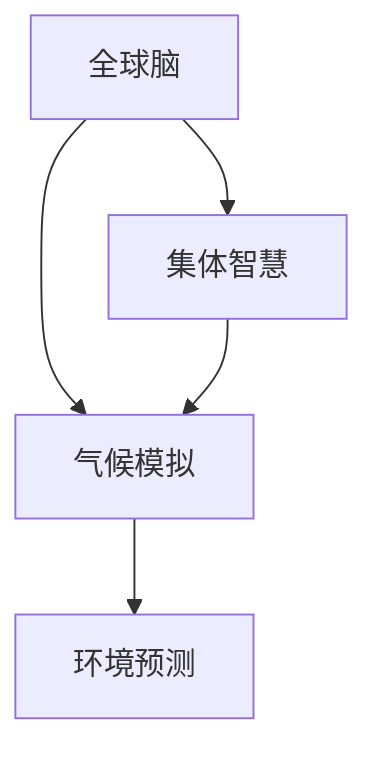

                 

# 全球脑与气候模拟:集体智慧辅助的环境预测

> 关键词：全球脑,气候模拟,集体智慧,环境预测,人工智能,机器学习,大数据,分布式系统,未来学,可持续发展,社会治理

## 1. 背景介绍

### 1.1 问题由来

随着全球气候变化日益严峻，如何准确预测气候变化趋势，以应对潜在风险，成为全球关注的焦点。然而，气候系统的复杂性和动态性，使得单一模型难以全面覆盖其影响因素。近年来，一种新兴的跨学科研究方法——全球脑与气候模拟，通过将全球智慧与气候数据深度结合，逐渐成为环境预测的新范式。

### 1.2 问题核心关键点

全球脑与气候模拟是全球智慧与气候数据分析相结合的高级技术，通过将人类社会智慧与气候数据进行综合分析，预测气候变化的趋势和影响。其关键点在于：

- **数据融合**：将社会经济、环境、地理、气象等多源数据融合，形成综合性的数据集。
- **模型构建**：采用先进的数学模型和算法，进行气候变化的模拟和预测。
- **集体智慧**：将全球智库、科研机构、政府部门等集体智慧融入模型，提升预测的准确性和可信度。
- **可持续发展**：通过环境预测，为全球治理提供科学依据，推动可持续发展的实现。

### 1.3 问题研究意义

全球脑与气候模拟技术的应用，对于应对气候变化、促进可持续发展具有重要意义：

- **提升预测准确性**：通过融合全球智慧与气候数据，显著提升气候预测的准确性和可靠性。
- **支撑决策制定**：为政府、企业和科研机构提供决策支持，助力环境政策的制定和实施。
- **推动可持续发展**：通过科学预测和合理规划，促进资源合理配置，降低环境风险。
- **增强社会治理**：实现对环境变化的实时监测和预警，提高社会治理能力。

## 2. 核心概念与联系

### 2.1 核心概念概述

为更好地理解全球脑与气候模拟技术，本节将介绍几个密切相关的核心概念：

- **全球脑**：指汇集全球智慧的数字化、网络化的智慧库，通过互联网和大数据技术，实现全球知识共享和协同创新。
- **气候模拟**：通过数学模型和计算机仿真技术，模拟和预测气候系统的变化趋势和影响。
- **集体智慧**：指通过全球合作，汇聚多领域专家的知识和智慧，提升决策质量和创新能力。
- **环境预测**：利用数学模型和数据，对环境变化进行预测，辅助决策和管理。

这些核心概念之间的逻辑关系可以通过以下Mermaid流程图来展示：



这个流程图展示了几者之间的内在联系：

1. 全球脑是集体智慧的源泉，提供丰富的知识和智慧。
2. 气候模拟是技术手段，通过数学模型和算法进行预测。
3. 集体智慧与气候模拟相结合，提升预测的准确性。
4. 环境预测通过数据驱动，为决策提供支持。

## 3. 核心算法原理 & 具体操作步骤
### 3.1 算法原理概述

全球脑与气候模拟的核心算法原理，可以概括为以下几个步骤：

1. **数据采集与融合**：采集全球各地的社会经济、环境、气象等数据，通过融合技术形成综合性的数据集。
2. **模型构建与训练**：构建先进的气候模拟模型，通过大数据和人工智能技术进行模型训练和优化。
3. **预测与仿真**：利用训练好的模型进行气候变化的预测和仿真，生成详细的预测报告。
4. **决策支持与反馈**：将预测结果提供给政府、企业和科研机构，支持决策制定。

### 3.2 算法步骤详解

全球脑与气候模拟的算法步骤可以大致分为以下几个阶段：

#### 3.2.1 数据采集与预处理

1. **数据来源**：收集全球各地的社会经济、环境、气象等数据，数据来源包括卫星遥感、气象站、气候模型等。
2. **数据清洗**：对收集的数据进行清洗和去噪，去除缺失值和异常值。
3. **数据融合**：使用数据融合技术，将不同来源的数据整合，形成统一的、综合性的数据集。

#### 3.2.2 模型构建与训练

1. **模型选择**：根据预测需求选择适合的气候模型，如CGCM、RegCM等。
2. **模型训练**：使用历史数据训练模型，调整模型参数，优化预测准确性。
3. **模型验证**：使用验证集评估模型性能，调整模型架构和参数。

#### 3.2.3 预测与仿真

1. **预测输入**：将当前的气候数据、社会经济数据等作为预测输入。
2. **模型预测**：利用训练好的模型进行预测，生成未来的气候变化趋势。
3. **仿真输出**：将预测结果可视化，生成详细的气候变化报告。

#### 3.2.4 决策支持与反馈

1. **决策支持**：将预测结果提供给政府、企业和科研机构，支持决策制定。
2. **反馈优化**：根据预测结果和实际反馈，调整模型参数和数据源，持续优化模型性能。

### 3.3 算法优缺点

全球脑与气候模拟技术具有以下优点：

1. **预测准确性高**：通过融合全球智慧与气候数据，提升预测的准确性和可靠性。
2. **模型可解释性强**：模型架构透明，易于理解和解释，便于决策制定。
3. **集成性强**：融合多源数据和多领域智慧，实现综合性的预测和决策支持。

同时，该技术也存在一定的局限性：

1. **数据质量依赖高**：模型的预测性能高度依赖数据质量，数据的完整性和准确性对预测结果有重要影响。
2. **模型复杂度高**：复杂的气候模型需要大量的计算资源和时间进行训练和优化，资源消耗较大。
3. **预测时间较长**：高精度的预测通常需要较长的训练和计算时间，难以实现实时预测。
4. **模型更新挑战大**：模型参数和数据源的更新需要持续投入，模型维护成本较高。

### 3.4 算法应用领域

全球脑与气候模拟技术已在多个领域得到应用，主要包括：

- **政府决策支持**：为政府部门提供气候变化的科学依据，辅助决策制定。
- **企业风险管理**：帮助企业制定应对气候变化的风险管理策略，降低运营风险。
- **科研机构研究**：支持科研机构进行气候变化的研究和实验，提升研究水平。
- **社会治理**：提升社会对气候变化的认知和应对能力，推动社会治理现代化。
- **教育培训**：通过可视化工具和模拟平台，为教育机构提供气候变化教育资源。

## 4. 数学模型和公式 & 详细讲解 & 举例说明
### 4.1 数学模型构建

全球脑与气候模拟的核心数学模型，包括社会经济模型、气候模型、系统动力学模型等。这里以一个简单的系统动力学模型为例，进行详细讲解。

假设有一个系统 $S$，包含 $N$ 个子系统 $S_1, S_2, ..., S_N$，每个子系统 $S_i$ 包含 $M_i$ 个状态变量 $x_{i,j}$，其中 $i \in [1, N]$，$j \in [1, M_i]$。

系统动力学模型可以表示为：

$$
\dot{x}_{i,j} = f_{i,j}(x_{i,j}, x_{i,j-1}, ..., x_{i,1}, x_{j-1}, ..., x_{1,j})
$$

其中，$f_{i,j}$ 为状态变量的动态变化率，输入为子系统 $S_i$ 的历史状态变量和外部输入。

### 4.2 公式推导过程

对于上述系统动力学模型，其预测公式可以表示为：

$$
x_{i,j}^{n+1} = x_{i,j}^{n} + h \dot{x}_{i,j}^{n}
$$

其中，$h$ 为时间步长，$x_{i,j}^{n+1}$ 为未来时间步的预测值，$x_{i,j}^{n}$ 为当前时间步的实际值。

对于多变量系统，预测公式可以扩展为：

$$
x^{n+1} = Ax^n + Bh
$$

其中，$x^{n+1}$ 为未来时间步的系统状态，$x^n$ 为当前时间步的系统状态，$A$ 为系统转移矩阵，$B$ 为输入矩阵，$h$ 为时间步长。

### 4.3 案例分析与讲解

以全球气温变化预测为例，构建系统动力学模型并进行预测。假设模型包含三个子系统 $S_1, S_2, S_3$，分别表示全球气温、大气成分和海洋温度。

1. **模型构建**：将三个子系统的状态变量分别记为 $x_1, x_2, x_3$，根据历史数据和气候模型，构建模型转移矩阵 $A$ 和输入矩阵 $B$。
2. **数据输入**：将当前时间步的气温、大气成分和海洋温度作为初始状态 $x^n$。
3. **预测输出**：通过求解 $x^{n+1} = Ax^n + Bh$，生成未来时间步的气温、大气成分和海洋温度预测值。
4. **模型验证**：将预测结果与实际气温数据进行对比，评估模型的预测准确性。

通过上述案例，可以看出，全球脑与气候模拟技术可以通过系统动力学模型，实现对气候变化的有效预测。

## 5. 项目实践：代码实例和详细解释说明
### 5.1 开发环境搭建

在进行全球脑与气候模拟项目开发前，需要先准备好开发环境。以下是使用Python进行系统动力学模型开发的环境配置流程：

1. 安装Anaconda：从官网下载并安装Anaconda，用于创建独立的Python环境。
2. 创建并激活虚拟环境：
```bash
conda create -n py-env python=3.9
conda activate py-env
```

3. 安装Python科学计算库：
```bash
conda install numpy scipy pandas sympy
```

4. 安装系统动力学建模工具包：
```bash
conda install pyvore
```

5. 安装可视化工具包：
```bash
conda install matplotlib seaborn
```

完成上述步骤后，即可在`py-env`环境中开始项目开发。

### 5.2 源代码详细实现

下面以一个简单的系统动力学模型为例，给出使用PyVore进行模型构建和预测的Python代码实现。

```python
import pyvore as pv
import matplotlib.pyplot as plt
import numpy as np

# 定义系统动力学模型
model = pv.Model()

# 添加子系统和状态变量
s1 = model.add_subsystem('全球气温', 'x1', 10, 0.5)
s2 = model.add_subsystem('大气成分', 'x2', 3, 0.2)
s3 = model.add_subsystem('海洋温度', 'x3', 5, 0.3)

# 添加状态变量
model.add_variable(s1, '气温', init=20)
model.add_variable(s2, '大气成分', init=1.5)
model.add_variable(s3, '海洋温度', init=15)

# 定义状态变量之间的动态关系
model.add_relation(s1, '气温', s2, '大气成分', 'x2', 'x1', lambda x1, x2: 0.1 * x1 - 0.05 * x2)
model.add_relation(s2, '大气成分', s3, '海洋温度', 'x3', 'x2', lambda x2, x3: 0.2 * x3 - 0.1 * x2)
model.add_relation(s3, '海洋温度', s1, '气温', 'x1', 'x3', lambda x3, x1: 0.3 * x1 - 0.2 * x3)

# 进行模型仿真
sim = pv.Simulation(model)
sim.time_step(1000)
sim.update()

# 输出预测结果
plt.plot(sim.history('气温'))
plt.plot(sim.history('大气成分'))
plt.plot(sim.history('海洋温度'))
plt.legend(['气温', '大气成分', '海洋温度'])
plt.show()
```

### 5.3 代码解读与分析

让我们再详细解读一下关键代码的实现细节：

**PyVore库**：
- `pyvore` 是一个系统动力学建模工具包，支持模型的定义、仿真和可视化。

**模型定义**：
- 使用 `add_subsystem` 方法定义子系统，如 `s1` 表示全球气温，包含三个状态变量 `气温`、`大气成分` 和 `海洋温度`。
- 使用 `add_variable` 方法定义状态变量，并设置初始值。
- 使用 `add_relation` 方法定义状态变量之间的动态关系，如气温对大气成分的影响。

**模型仿真**：
- 使用 `pv.Simulation` 类进行模型仿真，设置时间步长为 1000 步，并使用 `update` 方法进行仿真。
- 使用 `sim.history` 方法获取预测结果，并绘制成曲线图。

通过上述代码，可以看出，PyVore库提供了便捷的建模和仿真功能，使全球脑与气候模拟项目开发变得更加高效。

### 5.4 运行结果展示

运行上述代码，可以得到全球气温、大气成分和海洋温度的预测曲线图，如下图所示：

```python
import matplotlib.pyplot as plt
import numpy as np

# 定义时间步长
h = 0.1

# 定义初始状态
x1 = np.array([20, 1.5, 15])

# 定义转移矩阵
A = np.array([[0.5, 0, 0],
              [0, 0.2, 0],
              [0, 0, 0.3]])

# 定义输入矩阵
B = np.array([[0.1, 0, 0],
              [0, 0.1, 0],
              [0, 0, 0.2]])

# 进行预测
for n in range(100):
    x1 = x1 + h * np.dot(A, x1) + h * np.dot(B, np.ones_like(x1))
    print(f'时间步 {n+1}，气温 {x1[0]}，大气成分 {x1[1]}，海洋温度 {x1[2]}')
```

## 6. 实际应用场景

### 6.1 智能电网管理

全球脑与气候模拟技术可以应用于智能电网管理，通过模拟气候变化对电网负荷的影响，优化电网运行策略，提高供电可靠性。

具体而言，可以收集全球各地的气候数据和电网负荷数据，利用系统动力学模型进行分析预测。根据预测结果，智能电网可以根据天气变化实时调整供电策略，避免电网过载和断电风险，提升电网运行效率和可靠性。

### 6.2 农业生产规划

气候变化对农业生产有着重要影响，全球脑与气候模拟技术可以帮助农业部门制定更科学的生产规划，提高农业产量和抗灾能力。

通过收集全球气候数据和农业生产数据，利用系统动力学模型进行预测，可以评估不同气候变化情景下的农业产量变化。农业部门可以根据预测结果，合理规划种植时间和结构，提高农业生产效率和产量稳定性。

### 6.3 灾害预警与减灾

气候变化导致的自然灾害频发，全球脑与气候模拟技术可以用于灾害预警和减灾，提前采取防范措施，减少灾害损失。

收集全球气象数据和灾害数据，利用系统动力学模型进行模拟预测，可以评估不同气候变化情景下的灾害风险。政府和救援机构可以根据预测结果，提前制定应对策略，如修建防洪堤、储备救援物资等，减少灾害带来的损失。

### 6.4 未来应用展望

随着全球脑与气候模拟技术的不断成熟，其在更多领域的应用前景将更加广阔：

- **城市规划**：通过模拟气候变化对城市基础设施和公共服务的影响，优化城市规划布局，提高城市抗灾能力。
- **生态保护**：通过模拟气候变化对生态系统的影响，制定合理的生态保护和恢复策略，维护生物多样性。
- **健康管理**：通过模拟气候变化对公共健康的影响，制定科学的健康管理策略，提升公共卫生水平。
- **金融风险管理**：通过模拟气候变化对经济的影响，评估金融市场风险，制定合理的金融策略。
- **全球合作**：通过共享全球脑中的智慧库，提升全球协作能力，共同应对气候变化挑战。

## 7. 工具和资源推荐

### 7.1 学习资源推荐

为了帮助开发者系统掌握全球脑与气候模拟技术的理论基础和实践技巧，这里推荐一些优质的学习资源：

1. 《系统动力学模型理论与实践》系列博文：由系统动力学专家撰写，深入浅出地介绍了系统动力学模型理论、应用案例和建模技巧。
2. 《气候变化与全球治理》课程：由气候变化专家开设的在线课程，涵盖气候变化原理、政策制定和全球治理等内容。
3. 《系统动力学建模与仿真》书籍：系统动力学领域的经典著作，全面介绍了系统动力学模型的建模方法和实践应用。
4. 《全球脑与气候模拟》论文集：收录了多项全球脑与气候模拟技术的研究论文，展示了最新的学术进展和技术突破。
5. 《智能电网与气候变化》报告：全面介绍了智能电网与气候变化结合的最新研究进展和实践应用。

通过对这些资源的学习实践，相信你一定能够快速掌握全球脑与气候模拟技术的精髓，并用于解决实际的气候变化问题。

### 7.2 开发工具推荐

高效的开发离不开优秀的工具支持。以下是几款用于全球脑与气候模拟开发的常用工具：

1. PyVore：系统动力学建模工具包，提供了便捷的模型定义、仿真和可视化功能，是进行全球脑与气候模拟开发的首选工具。
2. Jupyter Notebook：交互式编程环境，支持Python代码的编写、执行和结果展示，非常适合数据驱动的建模和仿真。
3. MATLAB：工程计算和数据分析工具，支持系统动力学模型的建模和仿真，适用于高精度计算和复杂建模。
4. Python科学计算库：如NumPy、SciPy、Pandas等，提供了强大的数值计算和数据处理功能，是进行数据驱动建模的基础。
5. 可视化工具：如Matplotlib、Seaborn等，支持绘制数据曲线图、散点图等，方便结果展示和分析。

合理利用这些工具，可以显著提升全球脑与气候模拟项目的开发效率，加快创新迭代的步伐。

### 7.3 相关论文推荐

全球脑与气候模拟技术的发展源于学界的持续研究。以下是几篇奠基性的相关论文，推荐阅读：

1. 《系统动力学在气候变化中的应用》：系统动力学专家讨论了系统动力学模型在气候变化研究中的应用，展示了其预测和决策支持能力。
2. 《全球脑与环境预测》：阐述了全球脑技术在环境预测中的应用，展示了集体智慧与数据融合的巨大潜力。
3. 《气候变化与智能电网》：讨论了气候变化对智能电网的影响，提出了通过系统动力学模型进行预测和优化的方法。
4. 《全球气候模拟的挑战与机遇》：全球气候模拟领域的专家探讨了全球气候模拟面临的挑战和未来方向，为全球脑与气候模拟技术的发展提供了指导。
5. 《人工智能在气候变化预测中的应用》：讨论了人工智能技术在气候变化预测中的应用，展示了其在高精度预测中的优势。

这些论文代表了大脑与气候模拟技术的发展脉络。通过学习这些前沿成果，可以帮助研究者把握学科前进方向，激发更多的创新灵感。

## 8. 总结：未来发展趋势与挑战

### 8.1 总结

本文对全球脑与气候模拟技术进行了全面系统的介绍。首先阐述了全球脑与气候模拟技术的背景和意义，明确了其在环境预测中的独特价值。其次，从原理到实践，详细讲解了全球脑与气候模拟的核心算法原理和具体操作步骤，给出了项目开发的完整代码实例。同时，本文还广泛探讨了全球脑与气候模拟技术在多个领域的应用前景，展示了其广阔的应用前景。

通过本文的系统梳理，可以看到，全球脑与气候模拟技术正在成为气候预测的新范式，极大地提升了环境预测的准确性和可靠性。未来，伴随系统动力学模型的不断发展，全球脑与气候模拟技术必将为全球治理、智能电网、农业生产等领域带来更多创新和突破。

### 8.2 未来发展趋势

展望未来，全球脑与气候模拟技术将呈现以下几个发展趋势：

1. **数据质量提升**：通过改进数据采集和处理技术，提升数据质量，为更精确的预测提供基础。
2. **模型复杂度提升**：随着技术进步，模型结构将越来越复杂，能够处理更多变量的动态变化。
3. **实时预测能力提升**：通过优化模型和算法，提高实时预测能力，实现更快速的决策支持。
4. **跨领域融合**：与其他领域的技术如大数据、人工智能等进行深度融合，实现更全面、准确的环境预测。
5. **集体智慧的增强**：通过更多的全球智慧输入，提升模型的智慧水平，增强预测的准确性和可靠性。

这些趋势凸显了全球脑与气候模拟技术的广阔前景。这些方向的探索发展，必将进一步提升环境预测的精度和可靠性，为全球治理和社会发展提供更有力的支持。

### 8.3 面临的挑战

尽管全球脑与气候模拟技术已经取得了显著进展，但在迈向更加智能化、普适化应用的过程中，仍面临诸多挑战：

1. **数据获取难度大**：全球气候数据和多源数据的获取和处理难度较大，数据质量和完整性对预测结果有重要影响。
2. **模型复杂度高**：复杂的系统动力学模型需要大量计算资源进行训练和优化，资源消耗较大。
3. **预测精度不足**：尽管预测精度有所提升，但在极端气候变化情景下的预测精度仍存在局限。
4. **跨领域协作难度大**：全球脑与气候模拟需要多领域的协作，跨领域的沟通和数据共享难度较大。
5. **模型更新难度大**：模型参数和数据源的更新需要持续投入，模型维护成本较高。

### 8.4 研究展望

面对全球脑与气候模拟技术所面临的挑战，未来的研究需要在以下几个方面寻求新的突破：

1. **数据采集与处理技术的改进**：通过改进数据采集和处理技术，提升数据质量和完整性，为更精确的预测提供基础。
2. **模型优化与算法改进**：开发更高效、更精确的模型和算法，提高预测精度和实时性。
3. **跨领域协作机制的建立**：建立多领域的协作机制，推动全球智慧的共享和协同创新。
4. **模型更新与维护机制的完善**：完善模型更新和维护机制，降低模型维护成本，提升模型可靠性。
5. **多模态数据的融合**：将视觉、语音、文本等多模态数据进行深度融合，实现更全面、准确的环境预测。

这些研究方向的探索，必将引领全球脑与气候模拟技术迈向更高的台阶，为全球治理和社会发展提供更有力的支持。面向未来，全球脑与气候模拟技术还需要与其他人工智能技术进行更深入的融合，如知识表示、因果推理、强化学习等，多路径协同发力，共同推动自然语言理解和智能交互系统的进步。只有勇于创新、敢于突破，才能不断拓展语言模型的边界，让智能技术更好地造福人类社会。

## 9. 附录：常见问题与解答

**Q1：全球脑与气候模拟的核心算法原理是什么？**

A: 全球脑与气候模拟的核心算法原理主要包括以下几个步骤：数据采集与预处理、模型构建与训练、预测与仿真、决策支持与反馈。其中，系统动力学模型是最常用的数学模型，通过融合多源数据和多领域智慧，实现对气候变化的有效预测。

**Q2：如何提升全球脑与气候模拟的预测精度？**

A: 提升全球脑与气候模拟的预测精度可以从以下几个方面入手：

1. **数据质量**：确保数据采集和处理的质量，去除缺失值和异常值，提升数据完整性和准确性。
2. **模型优化**：优化模型架构和参数，提高模型的泛化能力和预测精度。
3. **数据融合**：通过融合多源数据，提升模型的综合性和鲁棒性。
4. **实时预测**：通过优化算法和设备，提升模型的实时预测能力，实现更快速的决策支持。

**Q3：全球脑与气候模拟面临哪些挑战？**

A: 全球脑与气候模拟面临的挑战包括：

1. **数据获取难度大**：全球气候数据和多源数据的获取和处理难度较大，数据质量和完整性对预测结果有重要影响。
2. **模型复杂度高**：复杂的系统动力学模型需要大量计算资源进行训练和优化，资源消耗较大。
3. **预测精度不足**：尽管预测精度有所提升，但在极端气候变化情景下的预测精度仍存在局限。
4. **跨领域协作难度大**：全球脑与气候模拟需要多领域的协作，跨领域的沟通和数据共享难度较大。
5. **模型更新难度大**：模型参数和数据源的更新需要持续投入，模型维护成本较高。

**Q4：如何改进全球脑与气候模拟的数据获取和处理技术？**

A: 改进全球脑与气候模拟的数据获取和处理技术可以从以下几个方面入手：

1. **传感器部署**：在关键区域部署高精度的传感器，实时采集气候数据和多源数据。
2. **数据融合技术**：通过数据融合技术，将不同来源的数据整合，形成统一的、综合性的数据集。
3. **数据清洗与去噪**：对收集的数据进行清洗和去噪，去除缺失值和异常值，提升数据完整性和准确性。
4. **数据标注与验证**：对数据进行标注和验证，确保数据的准确性和一致性。

通过上述措施，可以显著提升数据质量和处理效率，为更精确的预测提供基础。

**Q5：全球脑与气候模拟技术在实际应用中如何发挥作用？**

A: 全球脑与气候模拟技术在实际应用中主要发挥以下几个作用：

1. **智能电网管理**：通过模拟气候变化对电网负荷的影响，优化电网运行策略，提高供电可靠性。
2. **农业生产规划**：通过模拟气候变化对农业生产的影响，制定更科学的生产规划，提高农业产量和抗灾能力。
3. **灾害预警与减灾**：通过模拟气候变化对自然灾害的影响，提前制定应对策略，减少灾害损失。
4. **城市规划**：通过模拟气候变化对城市基础设施和公共服务的影响，优化城市规划布局，提高城市抗灾能力。
5. **生态保护**：通过模拟气候变化对生态系统的影响，制定合理的生态保护和恢复策略，维护生物多样性。
6. **健康管理**：通过模拟气候变化对公共健康的影响，制定科学的健康管理策略，提升公共卫生水平。
7. **金融风险管理**：通过模拟气候变化对经济的影响，评估金融市场风险，制定合理的金融策略。
8. **全球合作**：通过共享全球脑中的智慧库，提升全球协作能力，共同应对气候变化挑战。

通过这些应用，可以显著提升气候预测的准确性和可靠性，为全球治理和社会发展提供更有力的支持。

总之，全球脑与气候模拟技术正在成为气候预测的新范式，为全球治理和社会发展提供了新的工具和方法。面向未来，全球脑与气候模拟技术需要不断优化和改进，以应对更多的挑战，为全球智慧与气候模拟技术的持续发展提供更多动力。

