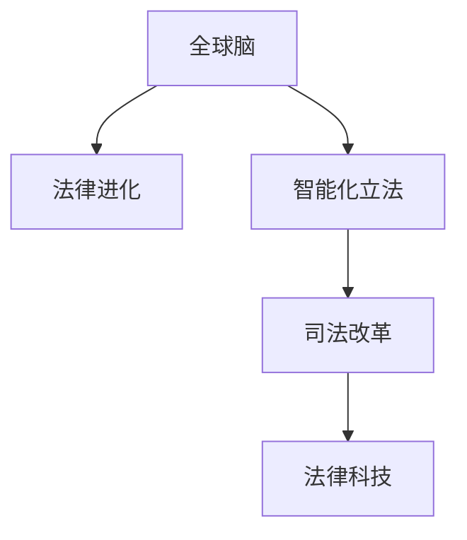

                 

# 全球脑与法律进化:智能化立法与司法改革

> 关键词：全球脑,法律进化,智能化立法,司法改革,人工智能,大数据,区块链,智能合约,法律科技,智慧司法,法治

## 1. 背景介绍

### 1.1 问题由来

随着人工智能和大数据技术的迅猛发展，全球法律体系正经历一场前所未有的变革。这一变革不仅关乎法律技术的创新，更涉及对全球治理、司法公正、人权保护等深远问题的重新思考。智能化立法和司法改革成为当前法治进程中的重要议题。

### 1.2 问题核心关键点

智能化立法和司法改革的核心在于利用人工智能和大数据技术，提升法律的预测性和预防性，推动法律体系的现代化和智能化。具体而言，可以通过以下几个关键点来理解这一过程：

- **数据驱动**：通过大数据技术，收集和分析海量法律数据，挖掘潜在规律，指导立法和司法实践。
- **智能辅助**：利用人工智能算法，辅助法官、律师等法律工作者进行案件处理、法律咨询等工作，提升效率和准确性。
- **智能立法**：通过智能模型和算法，辅助立法机关制定更具前瞻性和科学性的法律规范。
- **区块链保障**：利用区块链技术，确保法律数据和交易的透明、可追溯和不可篡改，增强司法的公信力和权威性。

## 2. 核心概念与联系

### 2.1 核心概念概述

为更好地理解智能化立法和司法改革，本节将介绍几个密切相关的核心概念：

- **全球脑**：将人工智能和大数据技术比喻为“全球脑”，强调其强大的计算和分析能力，能在全球范围内高效处理法律数据。
- **法律进化**：指法律体系随着技术进步和社会发展不断演进的过程，智能化立法和司法改革正是这一过程的重要推动因素。
- **智能化立法**：指利用人工智能技术辅助立法，通过数据分析和模拟预测，制定更加科学合理的法律规范。
- **司法改革**：涵盖审判体系、诉讼程序、判决执行等多个方面的改革，旨在提升司法效率、公正性和透明度。
- **法律科技**：指运用人工智能、区块链等现代科技手段，优化法律服务，提高法律工作的效率和质量。

这些核心概念之间的逻辑关系可以通过以下Mermaid流程图来展示：



这个流程图展示了几大核心概念及其之间的关系：

1. 全球脑通过强大的计算和分析能力，支持法律进化。
2. 智能化立法和司法改革分别从立法和司法两方面推动法律进化。
3. 法律科技为智能化立法和司法改革提供技术和手段支持。

## 3. 核心算法原理 & 具体操作步骤

### 3.1 算法原理概述

智能化立法和司法改革，本质上是通过人工智能和大数据技术，辅助法律工作者进行决策和优化法律体系的过程。这一过程可以分为以下几个关键步骤：

1. **数据收集与处理**：通过网络爬虫、API接口等方式，收集与法律相关的海量数据，包括但不限于法律法规、司法判决、法律咨询等。
2. **数据清洗与标注**：对收集到的数据进行清洗和标注，确保数据的准确性和一致性。
3. **模型训练与优化**：利用机器学习算法（如深度学习、决策树、贝叶斯网络等），训练出适用于法律领域的预测模型。
4. **模型应用与评估**：将训练好的模型应用于具体法律问题中，评估其预测效果和实际应用价值。

### 3.2 算法步骤详解

以智能化立法为例，具体算法步骤如下：

1. **需求分析**：明确立法目标和需求，确定需要解决的具体法律问题。
2. **数据收集**：收集与目标问题相关的法律法规、司法案例、专家意见等数据。
3. **数据预处理**：对数据进行清洗、去重、归一化等预处理，确保数据质量。
4. **模型选择与训练**：根据问题特性选择合适的机器学习模型，利用预处理后的数据进行训练。
5. **模型评估与优化**：通过交叉验证、性能指标（如准确率、召回率、F1-score等）评估模型性能，不断调整模型参数以优化效果。
6. **应用与反馈**：将训练好的模型应用于具体的立法项目中，收集反馈数据，进一步改进模型。

### 3.3 算法优缺点

智能化立法和司法改革的算法具有以下优点：

- **效率提升**：通过自动化、数据驱动的方式，显著提高立法和司法的效率。
- **科学决策**：利用数据分析和模型预测，提供更加科学的决策支持。
- **普适性强**：算法可以应用于多种法律领域，具有较强的通用性和可扩展性。

但同时，算法也存在一些缺点：

- **数据依赖**：算法效果依赖于数据的质量和数量，数据偏差可能导致模型偏见。
- **复杂度高**：模型的训练和优化过程复杂，需要专业的技术支持和大量计算资源。
- **解释性不足**：黑盒模型的决策过程难以解释，可能影响司法公正和公众信任。
- **伦理挑战**：算法可能放大数据中的偏见，导致法律决策的不公，需要进行伦理审查和监督。

### 3.4 算法应用领域

智能化立法和司法改革的算法，已经在多个领域得到应用，包括但不限于：

- **合同审查**：利用自然语言处理技术，自动审查合同文本，检查条款漏洞，提升合同管理的效率和质量。
- **法律咨询**：通过问答系统，自动解答法律咨询，辅助律师提供快速、准确的法律建议。
- **案件预测**：利用机器学习算法，预测案件判决结果，帮助法官做出更加公正的判决。
- **法律风险评估**：通过数据分析，评估法律风险和合规风险，指导企业法律风险管理。
- **智能合约**：利用区块链和智能合约技术，自动化执行法律合同条款，提高合约执行的效率和可追溯性。

## 4. 数学模型和公式 & 详细讲解  
### 4.1 数学模型构建

智能化立法和司法改革的数学模型构建，主要基于数据驱动和模型预测两个方面。具体数学模型如下：

**数据驱动模型**：

1. **数据收集模型**：
$$
D = \{(x_i, y_i)\}_{i=1}^N, \quad x_i \in \mathcal{X}, y_i \in \mathcal{Y}
$$

2. **数据清洗模型**：
$$
\hat{D} = \{x_i | x_i \in D, \text{且} \text{满足数据质量要求}\}
$$

3. **数据标注模型**：
$$
L = \{(x_i, l_i)\}_{i=1}^N, \quad l_i \in \{0,1\}
$$

**模型预测模型**：

1. **特征提取模型**：
$$
F: \mathcal{X} \rightarrow \mathcal{F}
$$

2. **模型训练模型**：
$$
\theta = \mathop{\arg\min}_{\theta} \frac{1}{N} \sum_{i=1}^N \ell(f(x_i, \theta), y_i)
$$

3. **模型应用模型**：
$$
y' = f(x, \theta)
$$

其中，$\ell$ 为损失函数，$\theta$ 为模型参数，$f$ 为预测模型，$x$ 为输入特征，$y$ 为输出标签。

### 4.2 公式推导过程

以合同审查为例，假设合同文本数据 $D$ 经过清洗和标注后，得到特征提取模型 $F$ 和标注数据 $L$。利用模型训练算法（如随机森林、SVM、深度学习等），训练预测模型 $f$，其目标函数为：

$$
\theta = \mathop{\arg\min}_{\theta} \frac{1}{N} \sum_{i=1}^N \ell(f(x_i, \theta), y_i)
$$

其中，$\ell$ 为交叉熵损失函数。通过训练得到的模型 $f$，可以对新合同文本进行预测，判断是否存在法律风险。

### 4.3 案例分析与讲解

以智能合约为例，假设合同条款数据 $D$ 经过清洗和标注后，得到特征提取模型 $F$ 和标注数据 $L$。利用区块链和智能合约技术，训练预测模型 $f$，其目标函数为：

$$
\theta = \mathop{\arg\min}_{\theta} \frac{1}{N} \sum_{i=1}^N \ell(f(x_i, \theta), y_i)
$$

其中，$\ell$ 为损失函数。通过训练得到的模型 $f$，可以自动执行合同条款，确保合约执行的透明和不可篡改。

## 5. 项目实践：代码实例和详细解释说明

### 5.1 开发环境搭建

在进行智能化立法和司法改革项目实践前，我们需要准备好开发环境。以下是使用Python进行TensorFlow和PyTorch开发的环境配置流程：

1. 安装Anaconda：从官网下载并安装Anaconda，用于创建独立的Python环境。

2. 创建并激活虚拟环境：
```bash
conda create -n legal-env python=3.8 
conda activate legal-env
```

3. 安装TensorFlow和PyTorch：
```bash
pip install tensorflow
pip install torch
```

4. 安装相关库：
```bash
pip install pandas numpy scikit-learn matplotlib
```

完成上述步骤后，即可在`legal-env`环境中开始项目实践。

### 5.2 源代码详细实现

以下是一个简单的合同审查项目代码实现：

```python
import tensorflow as tf
from tensorflow.keras.preprocessing.text import Tokenizer
from tensorflow.keras.preprocessing.sequence import pad_sequences
from tensorflow.keras.models import Sequential
from tensorflow.keras.layers import Embedding, Dense, Dropout

# 数据准备
# 假设已经有一个包含合同文本和标注的列表D，每个元素(x_i, y_i)
# x_i为合同文本，y_i为是否存在风险的标签（0或1）

# 特征提取
tokenizer = Tokenizer(num_words=10000)
tokenizer.fit_on_texts(D)

sequences = tokenizer.texts_to_sequences(D)
padded_sequences = pad_sequences(sequences, maxlen=200)

# 模型构建
model = Sequential([
    Embedding(10000, 128, input_length=200),
    Dense(128, activation='relu'),
    Dropout(0.2),
    Dense(1, activation='sigmoid')
])

# 模型训练
model.compile(optimizer='adam', loss='binary_crossentropy', metrics=['accuracy'])
model.fit(padded_sequences, y, epochs=10, batch_size=32)

# 模型应用
new_text = ["本合同的条款符合法律规定"]
new_sequences = tokenizer.texts_to_sequences([new_text])
new_padded_sequences = pad_sequences(new_sequences, maxlen=200)

# 预测
prediction = model.predict(new_padded_sequences)
if prediction > 0.5:
    print("合同存在法律风险")
else:
    print("合同合法有效")
```

以上代码实现了基于合同文本的自动审查功能，通过特征提取、模型训练和预测，判断新合同文本是否存在法律风险。

### 5.3 代码解读与分析

让我们再详细解读一下关键代码的实现细节：

**数据准备**：
- 假设已经有包含合同文本和标注的数据列表 $D$，通过Tokenizer将文本转换为序列，并使用pad_sequences进行定长处理，确保输入数据的格式一致。

**模型构建**：
- 利用TensorFlow构建简单的序列模型，包括Embedding层、Dense层和Dropout层，通过Adam优化器训练模型，损失函数为二元交叉熵，输出层为sigmoid激活函数，用于二分类任务。

**模型应用**：
- 对新文本进行特征提取和定长处理，使用训练好的模型进行预测，根据预测结果输出判断意见。

### 5.4 运行结果展示

运行上述代码后，可以通过观察模型在训练集和验证集上的准确率和损失函数值，评估模型的性能。在实际应用中，可以根据具体场景调整模型参数，进一步优化模型效果。

## 6. 实际应用场景

### 6.1 智能合同审查

智能合同审查技术可以广泛应用于企业合同管理、金融交易等领域。传统合同审查需要大量人力和时间，容易出错且效率低下。而利用智能化立法和司法改革技术，可以实现自动化合同审查，大大提高合同管理效率，降低风险。

### 6.2 法律咨询机器人

法律咨询机器人利用自然语言处理技术，通过问答系统自动解答用户的法律咨询。在法律咨询频率高、咨询内容相似的场景下，如企业法务部门，机器人可以快速、准确地提供法律建议，减轻法务人员的负担，提高咨询响应速度。

### 6.3 智能合约执行

智能合约技术可以与区块链结合，实现合同自动执行、智能合约纠纷自动裁决等功能。通过代码化和自动化的方式，确保合约执行的透明、公正和不可篡改，增强合同执行的信任度和法律约束力。

### 6.4 法律风险评估

利用智能化立法和司法改革技术，可以构建法律风险评估模型，通过分析法律法规、司法案例、市场数据等多种信息，评估法律风险和合规风险，指导企业法律风险管理，提升法律合规性。

### 6.5 智慧司法系统

智慧司法系统通过数据驱动和智能辅助，提升司法工作的效率和公正性。利用智能化立法和司法改革技术，可以实现案件预测、电子卷宗管理、智能调解等功能，推动司法改革向更加智能化、高效化的方向发展。

### 6.6 法律科技创业

随着智能化立法和司法改革技术的不断发展，越来越多的法律科技创业项目涌现出来，如智能合同审查、法律咨询机器人、法律风险评估等。这些技术创新不仅解决了传统法律工作中的痛点问题，还催生了新的商业模式和应用场景。

## 7. 工具和资源推荐

### 7.1 学习资源推荐

为了帮助开发者系统掌握智能化立法和司法改革的理论基础和实践技巧，这里推荐一些优质的学习资源：

1. **《深度学习与人工智能基础》**：由斯坦福大学李飞飞教授主讲的深度学习课程，系统介绍了深度学习的基本概念和算法，适合初学者入门。

2. **《Python深度学习》**：由Francois Chollet（Keras创始人）所著，详细介绍了使用TensorFlow和Keras构建深度学习模型的过程，适合实战应用。

3. **《机器学习实战》**：由Peter Harrington所著，提供了大量实用案例和代码示例，适合动手实践。

4. **《人工智能导论》**：由周志华教授所著，全面介绍了人工智能的发展历程、原理和应用，适合深入学习。

5. **《智能合约理论与实践》**：由Allen B. Dawson所著，系统介绍了智能合约的基本原理、开发技术和应用场景，适合技术从业人员参考。

通过对这些资源的学习实践，相信你一定能够快速掌握智能化立法和司法改革的精髓，并用于解决实际的法律问题。

### 7.2 开发工具推荐

高效的开发离不开优秀的工具支持。以下是几款用于智能化立法和司法改革开发的常用工具：

1. **TensorFlow**：由Google主导开发的开源深度学习框架，生产部署方便，适合大规模工程应用。

2. **PyTorch**：基于Python的开源深度学习框架，灵活动态的计算图，适合快速迭代研究。

3. **Jupyter Notebook**：交互式的开发环境，支持代码运行、数据可视化、文档编写等功能，适合进行项目管理和技术交流。

4. **Git**：版本控制系统，支持团队协作和代码管理，适合项目管理与代码版本控制。

5. **Docker**：容器化技术，支持在不同环境中运行相同的环境，适合部署和测试。

合理利用这些工具，可以显著提升智能化立法和司法改革任务的开发效率，加快创新迭代的步伐。

### 7.3 相关论文推荐

智能化立法和司法改革的发展源于学界的持续研究。以下是几篇奠基性的相关论文，推荐阅读：

1. **《A Survey of Machine Learning Techniques for Legal Analytics》**：一篇综述论文，系统总结了机器学习在法律领域的应用，包括合同审查、法律咨询、智能合约等。

2. **《The Application of Natural Language Processing in Legal Practice》**：介绍了自然语言处理技术在法律文本分析中的应用，如合同审查、法律咨询机器人等。

3. **《Blockchain and Smart Contracts in Legal Practice》**：探讨了区块链和智能合约在法律领域的应用，如智能合约执行、电子合同等。

4. **《Legal Risk Management and Artificial Intelligence》**：研究了人工智能在法律风险评估中的应用，提出了基于数据驱动的风险管理模型。

5. **《Towards an AI-driven Legal System》**：探讨了人工智能在司法系统中的应用，如智能调解、案件预测等。

这些论文代表了大数据和人工智能在法律领域的应用前沿，通过学习这些前沿成果，可以帮助研究者把握学科前进方向，激发更多的创新灵感。

## 8. 总结：未来发展趋势与挑战

### 8.1 总结

本文对智能化立法和司法改革的算法原理和操作步骤进行了全面系统的介绍。首先阐述了智能化立法和司法改革的研究背景和意义，明确了利用人工智能和大数据技术，提升法律体系的现代化和智能化进程的重要价值。其次，从原理到实践，详细讲解了智能化立法和司法改革的数学模型和关键步骤，给出了项目实践的完整代码实例。同时，本文还广泛探讨了智能化立法和司法改革技术在多个行业领域的应用前景，展示了技术在推动法律进化中的巨大潜力。此外，本文精选了智能化立法和司法改革的各类学习资源，力求为读者提供全方位的技术指引。

通过本文的系统梳理，可以看到，智能化立法和司法改革技术正在成为法律领域的重要工具，极大地提升了法律工作的效率和质量。未来，伴随技术的发展和应用，法律体系将更加智能化、高效化和公正化，为构建法治社会提供坚实的技术支撑。

### 8.2 未来发展趋势

展望未来，智能化立法和司法改革技术将呈现以下几个发展趋势：

1. **技术融合加速**：随着AI、大数据、区块链等技术的不断进步，智能化立法和司法改革技术将进一步融合，推动法律工作的智能化进程。

2. **法律风险评估**：利用智能化技术，构建法律风险评估模型，及时发现法律风险，提供有效的风险管理建议。

3. **智能调解与仲裁**：通过自然语言处理和智能算法，实现智能调解和仲裁，提升司法效率和公正性。

4. **智慧司法系统**：构建智慧司法系统，实现案件预测、电子卷宗管理、智能调解等功能，推动司法改革向智能化方向发展。

5. **法律数据治理**：建立法律数据标准和治理体系，确保法律数据的质量和安全，提升法律数据的价值。

6. **跨域法律应用**：构建跨域法律应用平台，实现法律服务的跨地域、跨部门协同，推动法律服务普惠化。

以上趋势凸显了智能化立法和司法改革技术的广阔前景。这些方向的探索发展，必将进一步提升法律工作的效率和质量，为构建更加智能化、公正化的法治社会奠定坚实基础。

### 8.3 面临的挑战

尽管智能化立法和司法改革技术已经取得了显著进展，但在迈向更加智能化、普适化应用的过程中，仍面临诸多挑战：

1. **数据隐私和安全**：法律数据涉及个人隐私和企业机密，如何在数据利用与保护之间找到平衡，成为一大挑战。

2. **技术复杂度**：智能化立法和司法改革技术涉及多学科知识，如法律、计算机科学、人工智能等，技术复杂度高，需要跨学科合作。

3. **法律合规性**：智能化技术在法律领域的应用需要符合法律和伦理规范，避免技术滥用带来的风险。

4. **数据质量和标注**：法律数据质量和标注的准确性直接影响智能化技术的效果，数据治理和标注工作仍需加强。

5. **算法偏见**：智能化技术可能放大数据中的偏见，导致法律决策的不公，需要进行算法偏见审查和纠正。

6. **技术落地困难**：智能化技术在实际应用中面临技术复杂度高、落地成本高的问题，需要克服技术落地障碍。

以上挑战需要各方共同努力，才能推动智能化立法和司法改革技术的健康发展。只有在数据、技术、法律和伦理等多方面协同发力，才能真正实现法律工作的智能化和现代化。

### 8.4 研究展望

面对智能化立法和司法改革技术面临的诸多挑战，未来的研究需要在以下几个方面寻求新的突破：

1. **多学科交叉融合**：推动法律、计算机科学、人工智能等学科的深度融合，形成跨学科的知识体系和方法论。

2. **数据隐私保护**：建立数据隐私保护机制，确保法律数据的合法合规使用，提升数据安全性和信任度。

3. **算法透明性和可解释性**：研究算法透明性和可解释性方法，增强智能化技术在法律决策中的可信任性和可解释性。

4. **智能法律服务**：构建智能法律服务系统，实现法律咨询、合同审查、智能调解等功能，提升法律服务的智能化水平。

5. **法律科技创业**：鼓励和支持法律科技创业项目的发展，推动法律科技在各行各业的应用。

6. **智慧司法系统**：构建智慧司法系统，实现案件预测、电子卷宗管理、智能调解等功能，提升司法工作的效率和公正性。

这些研究方向的探索，必将引领智能化立法和司法改革技术迈向更高的台阶，为构建智能化的法治社会提供坚实的技术支撑。

## 9. 附录：常见问题与解答

**Q1：智能化立法和司法改革技术是否适用于所有法律领域？**

A: 智能化立法和司法改革技术可以在大多数法律领域得到应用，特别是那些数据量较大、法律问题较为结构化的领域。但对于一些需要高度主观判断和伦理审查的法律领域，如刑事辩护、伦理审查等，可能需要结合人工干预，综合运用智能化技术和人工智慧。

**Q2：智能化立法和司法改革技术是否会影响司法公正？**

A: 智能化立法和司法改革技术可以在一定程度上提高司法效率和公正性，减少人为干预和主观偏差。但需要严格控制技术的算法偏见，确保法律决策的公正性和透明性。同时，引入人机协同机制，增强司法公正性和可信任度。

**Q3：智能化立法和司法改革技术是否会影响法律工作者的就业？**

A: 智能化技术的应用可以提高法律工作的效率和质量，但并不意味着替代法律工作者。相反，智能化技术可以辅助法律工作者进行更高效的工作，提升其专业水平和工作体验。同时，法律工作者需要不断学习新技能，适应技术发展。

**Q4：智能化立法和司法改革技术在数据治理方面存在哪些问题？**

A: 数据治理是智能化立法和司法改革技术的关键环节，存在以下问题：
1. 数据质量问题：法律数据质量和标注的准确性直接影响技术效果，数据治理工作需加强。
2. 数据隐私问题：法律数据涉及个人隐私和企业机密，需要建立数据隐私保护机制，确保数据安全。
3. 数据标准化问题：不同法律领域的数据格式和标准各异，需要建立统一的数据标准和治理体系。

这些问题需要通过数据治理和数据管理的进一步优化，才能更好地支持智能化技术的发展。

**Q5：智能化立法和司法改革技术在法律实施方面存在哪些挑战？**

A: 智能化立法和司法改革技术在法律实施方面存在以下挑战：
1. 技术复杂度：技术涉及多学科知识，需跨学科合作，提高技术复杂度。
2. 技术落地困难：技术落地成本高，需克服技术落地障碍。
3. 法律合规性：技术需符合法律和伦理规范，避免技术滥用带来的风险。
4. 算法偏见问题：技术可能放大数据中的偏见，需进行算法偏见审查和纠正。
5. 数据安全问题：法律数据涉及隐私和安全，需建立数据保护机制，确保数据安全。

这些问题需要通过技术改进、政策支持等多方面努力，才能推动技术的健康发展。

---

作者：禅与计算机程序设计艺术 / Zen and the Art of Computer Programming

