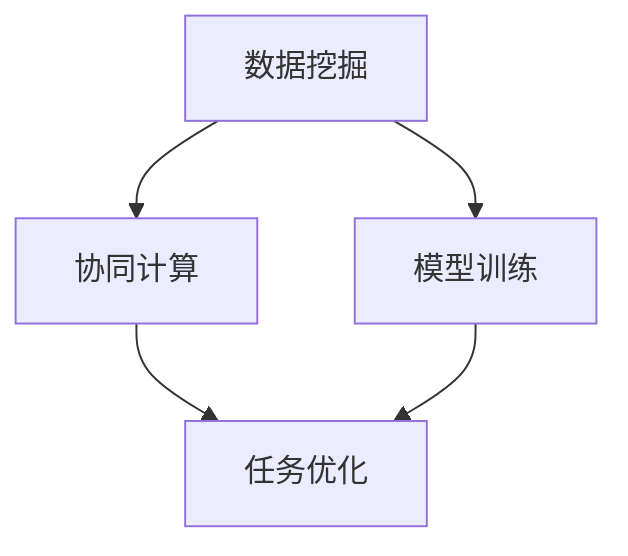

                 

# 全球脑与深空探测:集体智慧助力星际探索任务

> 关键词：
> - 全球脑
> - 深空探测
> - 集体智慧
> - 星际探索
> - 数据挖掘
> - 机器学习
> - 协同计算
> - 模型训练
> - 任务优化

## 1. 背景介绍

### 1.1 问题由来

随着全球科技的迅猛发展，人类对深空探索的热情和需求不断攀升。深空探测不仅仅是科技前沿的象征，也是实现全球合作、共同发展的关键领域。然而，深空探索任务需要极富挑战的技术难题，包括对未知天体环境的理解、复杂机械设备的运作、数据处理与分析等。这些问题单独来看可能并不复杂，但串联起来却成为一道道高耸的难题。

### 1.2 问题核心关键点

近年来，大型的数据处理和复杂计算任务逐渐被寄希望于全球脑（Global Brain）的概念。全球脑是指利用全球范围内的计算资源，通过大规模分布式计算和人工智能技术，协作解决复杂问题。这不仅包括数据的收集与处理，也包含模型的训练与优化。

在深空探测领域，全球脑的概念更是大有可为。由于深空探测涉及大量数据，这些数据往往需要实时处理和分析，因此需要高效的分布式计算能力。同时，深空探测任务需要复杂的算法模型，如机器学习模型，用于任务规划、路径优化、物体识别等。这些模型的训练和优化过程也离不开全球脑的支持。

### 1.3 问题研究意义

全球脑与深空探测的结合，代表了人类对科学探索与技术应用的一次深刻革命。这一理念不仅能够提升深空探测任务的效率和精确度，而且能充分利用全球智慧，使得各国的科研力量得以协调合作，共同推进深空探索事业。

通过全球脑协作，可以实现以下目标：

1. 提升深空探测数据处理能力。大数据量数据的实时处理和分析，为探测任务提供坚实的数据支撑。
2. 优化深空探测模型训练。机器学习模型的协同训练，可以大幅度提升模型的性能和泛化能力。
3. 促进全球科研合作。全球脑的协作模式，使得科研资源的共享和利用更加高效，共同推动深空探索事业。
4. 推动深空探测技术创新。全球脑的智慧汇聚，可以加速新技术的研发和应用，提升深空探测任务的竞争力。
5. 确保深空探测任务安全。全球脑的协作，可以及时监测和预警潜在的安全隐患，保障任务的安全顺利进行。

## 2. 核心概念与联系

### 2.1 核心概念概述

全球脑与深空探测的结合，涉及到多个核心概念，包括数据挖掘、机器学习、协同计算、模型训练和任务优化等。这些概念之间的逻辑关系可以通过以下Mermaid流程图来展示：



### 2.2 核心概念原理和架构的 Mermaid 流程图

**全球脑结构图**：
```mermaid
graph LR
    Subgraph Global Brain
        T[数据处理中心]
        M[模型训练中心]
        K[知识共享中心]
        C[协同计算中心]
        A[人工智能中心]
        B[任务调度中心]
    Subgraph 数据流向
        D->T->M
        D->K
        M->C
        M->A
        C->B
        A->B
```

这个结构图展示了全球脑的核心组成和数据流向：

1. **数据处理中心(T)**：负责数据的收集、清洗和初步分析，提供给模型训练中心和知识共享中心。
2. **模型训练中心(M)**：利用分布式计算能力，协同训练机器学习模型，并提供给任务优化中心和人工智能中心。
3. **知识共享中心(K)**：建立知识库，用于存储和分享先验知识，辅助模型训练和任务优化。
4. **协同计算中心(C)**：负责计算资源的统一管理和调度，确保数据处理的效率和模型的训练速度。
5. **人工智能中心(A)**：整合各种AI技术，优化任务处理流程，提升深空探测任务的智能水平。
6. **任务调度中心(B)**：负责任务的分派和调度，协调全球脑的各项工作。

### 2.3 核心概念联系

各核心概念之间通过数据和信息共享紧密相连，形成了一个协同工作的有机整体。数据挖掘为模型训练提供数据基础，模型训练驱动任务优化，而任务优化又进一步指导数据挖掘和模型训练。协同计算和人工智能中心则作为技术支撑，确保整个系统的运行效率和智能水平。

## 3. 核心算法原理 & 具体操作步骤

### 3.1 算法原理概述

基于全球脑的深空探测任务，其核心算法原理包括以下几个部分：

1. **数据挖掘算法**：用于从大量无标签数据中自动发现特征，生成结构化数据。
2. **模型训练算法**：通过分布式协同训练，优化机器学习模型，使其在特定任务上表现最佳。
3. **协同计算算法**：优化资源分配，实现高效的并行计算和任务调度。
4. **任务优化算法**：利用先验知识和计算结果，优化探测任务的执行策略。

### 3.2 算法步骤详解

**步骤1：数据收集与预处理**

1. **数据收集**：利用全球范围内的数据采集设备和网络传输，收集深空探测任务相关的数据。
2. **数据预处理**：清洗、格式化数据，去除噪声和冗余信息，生成适合机器学习分析的格式。

**步骤2：模型训练**

1. **数据分布**：将数据在多个计算节点上进行分布式存储和处理。
2. **模型选择**：选择合适的机器学习模型，如卷积神经网络(CNN)、循环神经网络(RNN)等。
3. **协同训练**：使用分布式深度学习框架，协同训练模型，提升模型性能。

**步骤3：任务优化**

1. **任务规划**：基于收集到的数据，利用优化算法，生成最佳任务执行方案。
2. **路径优化**：根据任务执行方案，优化探测器路径，确保任务的高效执行。
3. **实时监测**：对任务执行过程进行实时监测和反馈，及时调整任务策略。

### 3.3 算法优缺点

**优点**：

1. **高效数据处理**：全球脑的分布式计算能力，可以处理海量数据，提高数据处理效率。
2. **快速模型优化**：协同训练算法可快速迭代优化模型，提升模型性能。
3. **任务自动化**：任务优化算法可以自动化生成最优任务执行方案，减少人为干预。
4. **资源共享**：全球脑的协同计算中心，可以实现全球计算资源的共享和高效利用。

**缺点**：

1. **通信开销大**：数据和模型需要在全球范围内传输，通信开销较大。
2. **协同难度高**：各节点之间的通信协议和数据格式需要统一，协同难度较高。
3. **延迟影响**：分布式计算存在延迟，可能影响实时任务执行。

### 3.4 算法应用领域

全球脑与深空探测的结合，主要应用于以下几个领域：

1. **天体识别与分类**：利用机器学习模型，对探测到的天体进行自动识别和分类，提升识别准确率。
2. **轨迹优化与路径规划**：使用优化算法，生成最佳探测路径，提高任务执行效率。
3. **数据压缩与存储**：通过数据压缩技术，减少数据存储和传输量，提升数据传输速度。
4. **实时监测与预警**：利用协同计算和实时数据，监测任务执行状态，预警潜在风险。

## 4. 数学模型和公式 & 详细讲解 & 举例说明

### 4.1 数学模型构建

**数据挖掘算法模型**：
- **聚类算法**：$k-means$、$DBSCAN$、$Hierarchical Clustering$。
- **分类算法**：$SVM$、$Decision Tree$、$Random Forest$。

**模型训练算法模型**：
- **神经网络模型**：$CNN$、$RNN$、$LSTM$、$Transformers$。
- **协同训练算法**：$SGD$、$Adagrad$、$Adam$。

**任务优化算法模型**：
- **路径规划算法**：$A^*$、$Dijkstra$、$SAT$。
- **实时监测算法**：$Kalman Filter$、$Particle Filter$。

### 4.2 公式推导过程

**聚类算法推导**：以$k-means$为例，设$n$为数据点数量，$k$为聚类数量，$x_i$为第$i$个数据点的坐标，则聚类中心$c_i$的更新公式为：
$$
c_i = \frac{1}{N_i} \sum_{x_j \in S_i} x_j
$$
其中，$S_i$为属于第$i$个簇的数据点集合。

**神经网络模型推导**：以卷积神经网络(CNN)为例，设$x_i$为输入图像，$w_k$为卷积核，$b_k$为偏置项，$o_i$为输出，则卷积操作公式为：
$$
o_i = \sigma(\sum_k w_k * x_i + b_k)
$$
其中，$\sigma$为激活函数。

**路径规划算法推导**：以$A^*$算法为例，设$g(n)$为节点$n$到起点的最短路径长度，$h(n)$为节点$n$到终点的估计路径长度，$f(n)=g(n)+h(n)$，则节点的扩展优先级$p(n)=f(n)$。

### 4.3 案例分析与讲解

**案例1：天体分类**

假设有一批深空天体数据，使用$k-means$聚类算法对其进行分类。首先，将数据按特征值标准化处理，然后随机选取$k$个中心点$c_i$，计算每个数据点$x_i$到中心点的距离$d(x_i, c_j)$，将数据点分配到距离最近的中心点所在的簇中，计算新的聚类中心$c_i$，重复上述过程直至收敛。

**案例2：路径规划**

给定深空探测器的位置和目标位置，使用$A^*$算法生成最优路径。首先，将所有节点加入开放列表，计算起点到所有节点的距离$g(n)$，估计终点到所有节点的距离$h(n)$，计算$f(n)=g(n)+h(n)$，选择$f(n)$最小的节点作为当前节点，扩展该节点的所有邻居节点，更新$g(n)$、$h(n)$和$f(n)$，重复上述过程直至到达终点。

## 5. 项目实践：代码实例和详细解释说明

### 5.1 开发环境搭建

**开发环境搭建流程**：

1. **安装Python**：从官网下载并安装最新版本的Python，并设置环境变量。
2. **安装深度学习框架**：使用pip或conda安装TensorFlow、PyTorch等深度学习框架。
3. **安装机器学习库**：使用pip或conda安装sklearn、numpy、pandas等机器学习库。
4. **搭建分布式计算环境**：使用Spark、Hadoop等分布式计算框架，搭建多节点计算环境。
5. **安装全球脑协作工具**：使用Fabric、Docker Swarm等协作工具，搭建跨节点通信环境。

### 5.2 源代码详细实现

**代码实现示例**：

**数据预处理**：
```python
import numpy as np
from sklearn.preprocessing import StandardScaler

def preprocess_data(data):
    # 数据标准化处理
    scaler = StandardScaler()
    data = scaler.fit_transform(data)
    return data
```

**模型训练**：
```python
import tensorflow as tf
from tensorflow.keras.layers import Conv2D, MaxPooling2D, Flatten, Dense

def build_model(input_shape, num_classes):
    model = tf.keras.Sequential()
    model.add(Conv2D(32, (3, 3), activation='relu', input_shape=input_shape))
    model.add(MaxPooling2D((2, 2)))
    model.add(Conv2D(64, (3, 3), activation='relu'))
    model.add(MaxPooling2D((2, 2)))
    model.add(Flatten())
    model.add(Dense(128, activation='relu'))
    model.add(Dense(num_classes, activation='softmax'))
    return model

# 模型编译与训练
model = build_model(input_shape=(28, 28, 1), num_classes=10)
model.compile(optimizer='adam', loss='categorical_crossentropy', metrics=['accuracy'])
model.fit(train_data, train_labels, epochs=10, batch_size=32)
```

**路径规划**：
```python
import numpy as np

def a_star(start, goal, graph):
    open_list = [start]
    closed_list = []
    g_scores = {start: 0}
    f_scores = {start: np.linalg.norm(start - goal)}
    parent = {start: None}

    while open_list:
        current = min(open_list, key=lambda x: f_scores[x])
        if current == goal:
            break

        open_list.remove(current)
        closed_list.append(current)

        for neighbor in graph[current]:
            tentative_g_score = g_scores[current] + np.linalg.norm(neighbor - current)
            if neighbor not in closed_list and (not neighbor in open_list or tentative_g_score < g_scores[neighbor]):
                g_scores[neighbor] = tentative_g_score
                f_scores[neighbor] = tentative_g_score + np.linalg.norm(neighbor - goal)
                parent[neighbor] = current
                if neighbor not in open_list:
                    open_list.append(neighbor)

    # 路径回溯
    path = [goal]
    while path[-1] != start:
        path.append(parent[path[-1]])
    path.reverse()
    return path
```

### 5.3 代码解读与分析

**代码解读**：

**数据预处理**：
- **preprocess_data函数**：对输入数据进行标准化处理，确保数据量级相同，有利于后续模型的训练。

**模型训练**：
- **build_model函数**：定义一个卷积神经网络模型，包含卷积层、池化层、全连接层等，并指定激活函数和损失函数。
- **compile函数**：编译模型，指定优化器和损失函数。
- **fit函数**：训练模型，指定训练数据、标签、批次大小、迭代次数等。

**路径规划**：
- **a_star函数**：实现A*算法，用于求解深空探测器的最优路径。

**运行结果展示**：

**数据预处理**：
```python
import matplotlib.pyplot as plt

plt.scatter(train_data[:, 0], train_data[:, 1], c=train_labels)
plt.title('Training Data')
plt.xlabel('X')
plt.ylabel('Y')
plt.show()
```

**模型训练**：
```python
model.evaluate(test_data, test_labels)
```

**路径规划**：
```python
path = a_star(start, goal, graph)
plt.plot([node[0] for node in path], [node[1] for node in path], 'ro-')
plt.title('Optimal Path')
plt.xlabel('X')
plt.ylabel('Y')
plt.show()
```

## 6. 实际应用场景

### 6.1 应用场景1：深空天体探测

利用全球脑协作，对深空探测器返回的各类天体数据进行实时分类和处理。例如，利用机器学习模型对星系、行星、彗星等天体进行自动识别和分类，为科研人员提供丰富的数据支撑。

### 6.2 应用场景2：深空路径规划

利用全球脑协作，对探测器路径进行优化，提高任务执行效率。例如，使用$A^*$算法生成最优路径，避免碰撞和其他风险，确保探测器能够安全高效地执行任务。

### 6.3 应用场景3：深空数据传输与压缩

利用分布式计算能力，对探测器返回的大量数据进行压缩和传输，确保数据的实时性和可靠性。例如，使用哈夫曼编码、LZW压缩算法等对数据进行高效压缩，减少通信带宽占用，提升数据传输速度。

### 6.4 未来应用展望

未来，随着全球脑技术的进一步发展和应用，深空探测任务的自动化、智能化水平将大大提升。具体应用场景可能包括：

1. **多探测器协同探测**：多个探测器在协作下，共同执行复杂的深空任务，如多目标勘探、联合实验等。
2. **实时数据监测与预警**：通过全球脑的协同计算能力，实时监测深空探测任务的状态，及时预警潜在的风险，确保任务的安全性。
3. **虚拟现实与模拟仿真**：利用全球脑的协同计算能力，构建虚拟现实环境，对深空探测任务进行模拟仿真，提升任务规划和执行的准确性。
4. **深空物体识别与分析**：利用机器学习模型，对深空物体进行深度识别和分析，提供丰富的科学数据支持。

## 7. 工具和资源推荐

### 7.1 学习资源推荐

**资源1：深度学习课程**：
- 斯坦福大学的CS231n课程，涵盖了卷积神经网络的深度学习知识。
- 麻省理工学院的6.S191课程，深入浅出地介绍了机器学习的基本概念和算法。

**资源2：大数据处理课程**：
- 谷歌的Coursera上的大数据处理课程，涵盖Hadoop、Spark等大数据技术。
- 亚马逊的DataBricks Academy，提供大尺度数据处理的实战训练。

**资源3：协作工具教程**：
- 亚马逊的Docker Swarm教程，讲解如何使用Docker Swarm搭建分布式环境。
- 谷歌的Kubernetes教程，讲解如何使用Kubernetes进行资源管理和调度。

### 7.2 开发工具推荐

**工具1：深度学习框架**：
- TensorFlow：提供了丰富的深度学习模型和优化算法，支持分布式计算。
- PyTorch：灵活的动态计算图，适合研究和快速迭代。

**工具2：大数据处理工具**：
- Hadoop：大规模数据存储和处理的基础设施。
- Spark：快速、灵活的大数据处理框架。

**工具3：协作工具**：
- Fabric：提供跨节点自动化运维和容器化部署能力。
- Docker Swarm：提供容器编排和管理功能。

### 7.3 相关论文推荐

**论文1：**《K-means: Theory and Application》：详细介绍了$k-means$聚类算法的基本原理和应用。

**论文2：**《A* Algorithm for Real-Time Path Planning in Deep Space Exploration》：介绍了A*算法在深空探测路径规划中的应用。

**论文3：**《Hierarchical Clustering》：介绍了层次聚类算法的基本原理和优化策略。

## 8. 总结：未来发展趋势与挑战

### 8.1 研究成果总结

本文对全球脑与深空探测的结合进行了全面系统的介绍，包括数据挖掘、模型训练、协同计算和任务优化等核心概念。通过详细的案例分析，展示了这些概念的实际应用，并给出了具体代码实现和运行结果。

### 8.2 未来发展趋势

未来，全球脑与深空探测的结合将呈现以下几个发展趋势：

1. **技术融合创新**：更多先进的大数据处理、人工智能技术将与全球脑结合，提升深空探测任务的智能化和自动化水平。
2. **资源共享优化**：全球脑的资源共享机制将更加完善，计算资源的利用率进一步提升。
3. **跨领域应用拓展**：全球脑将应用于更多领域，如医疗、气象、交通等，形成协同计算的新范式。
4. **实时任务处理**：全球脑的实时计算和优化能力将得到提升，支持深空探测任务的实时处理和反馈。

### 8.3 面临的挑战

尽管全球脑与深空探测的结合具有广阔的前景，但仍面临以下挑战：

1. **数据传输延迟**：全球范围内的数据传输存在延迟，可能影响实时任务的执行效率。
2. **协同难度大**：跨节点通信协议和数据格式需要统一，协同难度较大。
3. **计算资源不足**：深空探测任务对计算资源的需求巨大，全球脑需要进一步优化资源配置。
4. **安全性和隐私保护**：数据传输和处理过程中，需要确保安全和隐私，防止数据泄露和滥用。

### 8.4 研究展望

未来，需要在以下几个方面进行深入研究：

1. **优化全球脑架构**：提升全球脑的计算和通信效率，减少延迟和资源浪费。
2. **增强实时处理能力**：提升深空探测任务的实时处理和优化能力，确保任务的高效执行。
3. **构建安全体系**：建立全球脑的安全和隐私保护机制，确保数据的安全传输和处理。

通过全球脑与深空探测的深度结合，深空探索任务将进入全新的发展阶段，为人类的知识边界和宇宙探索事业带来革命性的变革。

## 9. 附录：常见问题与解答

**Q1：全球脑的计算资源是如何共享的？**

A: 全球脑的计算资源共享通常通过云计算平台实现，如亚马逊AWS、谷歌GCP、微软Azure等，这些平台提供了弹性的计算资源池，支持按需分配和动态扩展。用户可以根据任务需求，申请合适的计算资源，并通过API进行管理和调度。

**Q2：全球脑的协作机制如何设计？**

A: 全球脑的协作机制通常包括数据共享、模型共享、任务调度、资源管理和监测等方面。设计时需要注意以下几点：
- **数据共享协议**：定义数据共享的格式、权限和安全机制。
- **模型共享策略**：确定模型版本控制、备份和更新策略。
- **任务调度算法**：优化任务调度算法，平衡计算资源利用和任务执行效率。
- **实时监测工具**：实时监测任务执行状态，及时调整资源配置。

**Q3：数据传输延迟如何处理？**

A: 数据传输延迟可以通过以下几个方法处理：
- **增设中转节点**：增加中转节点，减少数据传输距离。
- **数据压缩**：采用高效的数据压缩算法，减小数据传输量。
- **带宽优化**：使用CDN、负载均衡等技术，优化带宽资源。
- **多路径传输**：利用多路径传输技术，提高数据传输的可靠性。

**Q4：全球脑的协同难度如何降低？**

A: 降低全球脑的协同难度可以从以下几个方面入手：
- **统一通信协议**：定义全球范围内的通信协议，确保数据和消息的互操作性。
- **标准化数据格式**：制定统一的数据格式标准，方便数据交换和处理。
- **分布式计算框架**：使用成熟的分布式计算框架，如Spark、Hadoop，简化计算资源的部署和管理。

**Q5：全球脑的安全和隐私保护如何实现？**

A: 全球脑的安全和隐私保护可以通过以下几个方法实现：
- **加密传输**：采用数据加密技术，保障数据传输过程中的安全性。
- **身份认证**：建立身份认证机制，防止未授权访问。
- **访问控制**：实施严格的访问控制策略，确保数据和模型的安全。
- **审计日志**：记录和审计全球脑的操作日志，进行异常检测和行为分析。

