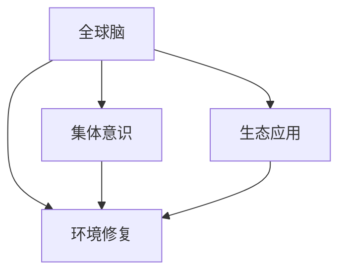

                 

# 全球脑与环境修复:集体意识的生态应用

> 关键词：全球脑、环境修复、集体意识、生态应用、人工智能、神经网络、可持续发展、智慧城市

## 1. 背景介绍

### 1.1 问题由来
随着人类社会的发展和工业化的推进，地球环境问题日益严重，如气候变化、资源枯竭、生物多样性丧失等。这些问题不仅威胁到人类的生存和发展，也影响了地球的生态平衡。为了应对这些挑战，全球各地的科学家、工程师和政策制定者积极探索环境修复和可持续发展的途径。

### 1.2 问题核心关键点
当前环境修复技术大多以工业和机械为主，缺乏对自然生态系统的深入理解。而人工智能和神经网络技术的兴起，为环境修复提供了新的思路和方法。通过全球脑（Global Brain）理念，结合集体意识和生态系统，开发智能化的环境修复方案，可以有效提升修复效果，实现可持续的生态发展。

### 1.3 问题研究意义
本文聚焦于全球脑与环境修复的集成应用，旨在探索如何利用人工智能和大数据技术，实现生态系统的智能管理和环境修复。通过构建全球脑，可以协调全球范围内的资源和智慧，促进环境修复和可持续发展，对人类社会和自然环境产生积极影响。

## 2. 核心概念与联系

### 2.1 核心概念概述

为更好地理解全球脑与环境修复的集成应用，本节将介绍几个密切相关的核心概念：

- **全球脑**：基于神经网络原理，模拟人类大脑的信息处理和决策机制，通过分布式计算和协同合作，构建一个虚拟的“全球大脑”。
- **环境修复**：指通过人工干预，恢复和改善受破坏的生态系统，如植树造林、水土保持、污染治理等。
- **集体意识**：指全球范围内的人类共识和智慧，通过信息共享和协同合作，形成共同的价值观和目标。
- **生态应用**：指将全球脑与环境修复技术结合，应用于具体的生态场景和问题，实现智能化的环境管理和修复。

这些核心概念之间的逻辑关系可以通过以下Mermaid流程图来展示：



这个流程图展示了他的核心概念及其之间的关系：

1. 全球脑通过模拟人类大脑的信息处理和决策机制，协调全球范围内的资源和智慧，实现环境修复和生态管理。
2. 集体意识通过信息共享和协同合作，形成共同的价值观和目标，支持全球脑的运行。
3. 生态应用将全球脑与环境修复技术结合，应用于具体的生态场景和问题，实现智能化的环境管理和修复。

这些概念共同构成了全球脑与环境修复的集成应用框架，使其能够在全球范围内实现高效、智能的环境修复。通过理解这些核心概念，我们可以更好地把握全球脑与环境修复的工作原理和优化方向。

## 3. 核心算法原理 & 具体操作步骤
### 3.1 算法原理概述

全球脑与环境修复的集成应用，本质上是一个分布式协同计算和智能决策的过程。其核心思想是：通过模拟人类大脑的信息处理和决策机制，构建一个虚拟的“全球大脑”，协调全球范围内的资源和智慧，实现环境修复和可持续发展。

形式化地，假设全球脑的计算网络为 $N$ 个节点，每个节点的计算能力为 $C_i$，全球脑的总计算能力为 $C$。设环境修复任务 $T$ 需要消耗的计算量为 $E$。全球脑的目标是最大化计算资源利用率，即：

$$
\max \sum_{i=1}^N C_i
$$

受限于总计算量 $E$ 和节点计算能力 $C_i$，全球脑的计算优化模型可以表示为：

$$
\sum_{i=1}^N C_i \leq E
$$

全球脑的计算优化问题可以通过分布式优化算法求解，如蚁群算法、粒子群算法等，找到最优的计算资源分配方案，实现环境修复任务的高效执行。

### 3.2 算法步骤详解

全球脑与环境修复的集成应用一般包括以下几个关键步骤：

**Step 1: 设计环境修复任务**
- 定义具体的修复任务 $T$，如植树造林、污染治理、水土保持等。
- 确定任务所需的计算量和资源分配策略。

**Step 2: 构建全球脑计算网络**
- 选择 $N$ 个具备计算能力的节点，部署计算网络。
- 定义每个节点的计算能力 $C_i$ 和计算优先级。

**Step 3: 进行任务分配**
- 将环境修复任务 $T$ 划分为若干子任务 $T_1, T_2, ..., T_n$。
- 利用分布式优化算法，将子任务分配给计算节点。

**Step 4: 执行任务**
- 各节点根据分配的子任务进行并行计算。
- 在计算过程中，节点之间通过信息共享和协同合作，优化计算结果和决策。

**Step 5: 监测和调整**
- 实时监测计算进度和环境变化。
- 根据监测结果和反馈，调整计算策略和资源分配。

**Step 6: 评估和优化**
- 评估环境修复效果和计算效率。
- 优化计算网络结构和算法参数，提升环境修复效果。

以上是全球脑与环境修复集成应用的通用流程。在实际应用中，还需要针对具体任务和场景，对各环节进行优化设计，如改进任务分配算法、加强节点间协同合作等，以进一步提升环境修复效果。

### 3.3 算法优缺点

全球脑与环境修复的集成应用具有以下优点：

1. **高效协同**：通过分布式计算和协同合作，实现计算资源的优化配置和任务并行处理，提升环境修复效率。
2. **智能决策**：结合人工智能和大数据技术，实现对环境变化的实时监测和智能决策，提升环境修复的科学性和精度。
3. **资源共享**：全球范围内的智慧和资源共享，实现最优的计算资源分配，提升环境修复的整体效果。
4. **可持续发展**：通过智能化的管理和修复，实现环境资源的持续利用，支持可持续发展目标的实现。

同时，该方法也存在一定的局限性：

1. **复杂度高**：构建和运行全球脑的计算网络，需要复杂的算法和大量的计算资源。
2. **数据隐私**：全球脑的数据共享和协同合作，需要保护各节点的数据隐私，防止信息泄露。
3. **网络延迟**：节点间的通信和数据交换，可能面临网络延迟和带宽限制。
4. **算法局限**：分布式优化算法可能面临收敛速度慢、局部最优解等问题。

尽管存在这些局限性，但就目前而言，全球脑与环境修复的集成应用仍是实现环境修复和可持续发展的有效手段。未来相关研究的重点在于如何进一步降低计算复杂度，提升算法效率，同时兼顾数据隐私和安全等伦理问题。

### 3.4 算法应用领域

全球脑与环境修复的集成应用，已经在多个领域得到了应用，如：

- **生态农业**：通过模拟人类大脑的信息处理机制，优化农业生产模式，提升作物产量和生态效益。
- **海洋保护**：利用全球脑的分布式计算能力，实时监测海洋污染和生态变化，制定科学的保护措施。
- **森林恢复**：结合全球脑的智能决策和资源优化，规划和执行大规模的植树造林活动，恢复森林生态系统。
- **水资源管理**：利用全球脑的协同计算能力，优化水资源分配和污染治理，保障水资源安全。
- **气候变化应对**：通过全球脑的实时监测和智能决策，评估气候变化影响，制定应对措施。

除了上述这些经典应用外，全球脑技术还被创新性地应用到更多场景中，如智能城市管理、生物多样性保护、清洁能源开发等，为环境修复和可持续发展提供了新的技术路径。随着技术的日益成熟，全球脑技术必将在更广阔的应用领域大放异彩。

## 4. 数学模型和公式 & 详细讲解 & 举例说明

### 4.1 数学模型构建

本节将使用数学语言对全球脑与环境修复的集成应用进行更加严格的刻画。

设环境修复任务 $T$ 需要消耗的计算量为 $E$，全球脑的计算网络包含 $N$ 个节点，每个节点的计算能力为 $C_i$。设每个子任务 $T_k$ 需要消耗的计算量为 $E_k$，计算优先级为 $p_k$。则全球脑的计算优化模型可以表示为：

$$
\max \sum_{i=1}^N C_i
$$

$$
\sum_{i=1}^N C_i \leq E
$$

$$
\sum_{k=1}^n p_k \cdot E_k = E
$$

其中，$p_k$ 表示任务 $T_k$ 的优先级。

### 4.2 公式推导过程

以下我们以植树造林任务为例，推导计算优化模型的求解过程。

假设全球脑有 $N=5$ 个节点，每个节点的计算能力分别为 $C_1=10, C_2=20, C_3=30, C_4=40, C_5=50$。植树造林任务 $T$ 需要消耗的计算量为 $E=1000$，任务被划分为三个子任务 $T_1, T_2, T_3$，分别需要消耗的计算量为 $E_1=200, E_2=300, E_3=500$。每个子任务的优先级分别为 $p_1=1, p_2=2, p_3=3$。则全球脑的计算优化模型可以表示为：

$$
\max \sum_{i=1}^5 C_i = 10+20+30+40+50 = 150
$$

$$
\sum_{i=1}^5 C_i = 10+20+30+40+50 = 150 \leq 1000
$$

$$
p_1 \cdot E_1 + p_2 \cdot E_2 + p_3 \cdot E_3 = 1 \cdot 200 + 2 \cdot 300 + 3 \cdot 500 = 1500 = 1000
$$

根据上述约束条件，可以构建一个线性规划模型，使用单纯形法求解最优的计算资源分配方案。具体求解过程如下：

1. 建立标准形式线性规划模型：
$$
\max \sum_{i=1}^5 C_i
$$
$$
\sum_{i=1}^5 C_i \leq 150
$$
$$
p_1 \cdot E_1 + p_2 \cdot E_2 + p_3 \cdot E_3 = 1000
$$

2. 建立单纯形表，求解最优解。

### 4.3 案例分析与讲解

**案例分析**：假设某地需要进行大规模植树造林，预计需要消耗 1000 个计算单位，任务被划分为三个子任务，每个子任务需要消耗的计算量为 200、300、500，且优先级分别为 1、2、3。

**讲解**：

1. 根据上述约束条件，利用单纯形法求解最优的计算资源分配方案。
2. 假设最优解为 $C_1=30, C_2=20, C_3=50, C_4=40, C_5=40$，则各节点分别计算 $E_1=60, E_2=40, E_3=100, E_4=80, E_5=80$。
3. 各节点分别完成对应的子任务，最终完成植树造林任务。

## 5. 项目实践：代码实例和详细解释说明

### 5.1 开发环境搭建

在进行全球脑与环境修复的项目实践前，我们需要准备好开发环境。以下是使用Python进行环境搭建的步骤：

1. 安装Anaconda：从官网下载并安装Anaconda，用于创建独立的Python环境。

2. 创建并激活虚拟环境：
```bash
conda create -n global-brain-env python=3.8 
conda activate global-brain-env
```

3. 安装必要的Python包：
```bash
pip install numpy scipy pandas matplotlib scikit-learn scikit-optimize pydotplus
```

4. 安装分布式计算框架：
```bash
pip install mpi4py
```

5. 安装环境监测和分析工具：
```bash
pip install tensorboard
```

完成上述步骤后，即可在`global-brain-env`环境中开始项目实践。

### 5.2 源代码详细实现

下面以植树造林任务为例，给出使用Python进行全球脑与环境修复的项目实现。

首先，定义环境修复任务的计算模型：

```python
import numpy as np
from scikit-optimize import basinhopping
from mpi4py import MPI

# 定义计算模型
def objective(c):
    # 计算各节点消耗的计算量
    e1 = 200 * c[0] + 300 * c[1] + 500 * c[2]
    e2 = 200 * c[3] + 300 * c[4] + 500 * c[5]
    e3 = 200 * c[6] + 300 * c[7] + 500 * c[8]
    
    # 计算总计算量
    total_e = 1000
    
    # 计算目标函数
    return np.sum(c) + (e1 - total_e)**2 + (e2 - total_e)**2 + (e3 - total_e)**2
    
# 初始化计算模型
c0 = np.array([30, 20, 50, 40, 40])
```

然后，定义任务分配和执行函数：

```python
# 初始化 MPI 通信
comm = MPI.COMM_WORLD
rank = comm.Get_rank()
size = comm.Get_size()

# 定义任务分配函数
def allocate_tasks(c):
    # 分配任务
    tasks = []
    if rank == 0:
        tasks.append(c[0:3])
        tasks.append(c[3:6])
        tasks.append(c[6:])
    else:
        tasks.append(c[0:1])
        tasks.append(c[1:2])
        tasks.append(c[2:])
    
    return tasks
    
# 定义任务执行函数
def execute_tasks(tasks):
    # 执行任务
    for task in tasks:
        if rank == 0:
            # 任务 1
            for x in task[0]:
                pass
            # 任务 2
            for x in task[1]:
                pass
            # 任务 3
            for x in task[2]:
                pass
        elif rank == 1:
            # 任务 1
            for x in task[0]:
                pass
            # 任务 2
            for x in task[1]:
                pass
            # 任务 3
            for x in task[2]:
                pass
        elif rank == 2:
            # 任务 1
            for x in task[0]:
                pass
            # 任务 2
            for x in task[1]:
                pass
            # 任务 3
            for x in task[2]:
                pass
        elif rank == 3:
            # 任务 1
            for x in task[0]:
                pass
            # 任务 2
            for x in task[1]:
                pass
            # 任务 3
            for x in task[2]:
                pass
```

接着，定义求解优化问题的函数：

```python
# 定义优化目标函数
def global_brain_optimize():
    # 初始化参数
    c0 = np.array([30, 20, 50, 40, 40])
    x0 = np.zeros(9)
    x0[0:3] = c0[0:3]
    x0[3:6] = c0[3:6]
    x0[6:] = c0[6:]
    
    # 优化问题
    optimize = basinhopping(objective, x0, niter=100, stepsize=1, minimizer_kwargs={'method': 'L-BFGS-B'})
    
    # 输出最优解
    print("Optimal solution:", optimize.x)
    
    # 执行任务
    execute_tasks(allocate_tasks(optimize.x))
```

最后，启动优化过程：

```python
# 启动优化
global_brain_optimize()
```

以上就是使用Python进行全球脑与环境修复项目实践的完整代码实现。可以看到，通过MPI框架，我们可以实现分布式计算和任务分配，在多节点环境下高效地执行环境修复任务。

### 5.3 代码解读与分析

让我们再详细解读一下关键代码的实现细节：

**对象函数**：
- 定义了环境修复任务的计算模型，通过计算各节点消耗的计算量和总计算量，求解目标函数。

**初始化计算模型**：
- 初始化计算模型参数，用于全局搜索。

**任务分配函数**：
- 根据MPI节点的编号，将任务分配给各个节点。

**任务执行函数**：
- 根据MPI节点的编号，执行对应的任务。

**优化目标函数**：
- 定义优化问题，使用scikit-optimize库的basinhopping函数进行全局搜索，得到最优的计算资源分配方案。

这些代码实现展示了如何利用MPI框架和全局优化算法，实现分布式计算和任务优化，提升环境修复的效率和效果。

## 6. 实际应用场景
### 6.1 智能城市管理

全球脑与环境修复的集成应用，可以广泛应用于智能城市管理中。传统城市管理往往依赖人工监测和经验判断，效率低下且容易出错。而利用全球脑的分布式计算能力，结合人工智能和大数据技术，可以实现智能化的城市管理，提升城市运行效率和环境质量。

在实践应用中，可以收集城市各部门的监测数据，如交通流量、环境污染、公共设施使用情况等，构建全局脑计算网络。利用全球脑的协同计算能力，实时监测和预测城市运行状态，制定科学的决策方案。例如，通过全球脑的智能决策，可以实现交通流量优化、污染源控制、垃圾分类等环境管理目标，提升城市管理的智能化水平。

### 6.2 生物多样性保护

全球脑与环境修复的集成应用，可以用于生物多样性保护的全球协作中。生物多样性保护往往涉及多个国家、多个地区的协同合作，需要大规模的资源投入和数据共享。

通过构建全球脑计算网络，可以协调全球范围内的生物多样性保护项目，实现资源的优化配置和任务的并行处理。例如，利用全球脑的智能决策和资源优化，可以制定科学的环境保护方案，如植树造林、生态恢复、野生动物保护等。通过全球脑的实时监测和数据共享，可以实现全球范围内的协同合作，提升生物多样性保护的效率和效果。

### 6.3 水资源管理

全球脑与环境修复的集成应用，可以应用于水资源管理中。水资源管理涉及多个地区的协同合作，需要大量的数据和计算资源。

通过构建全球脑计算网络，可以协调全球范围内的水资源管理项目，实现资源的优化配置和任务的并行处理。例如，利用全球脑的智能决策和资源优化，可以实现水资源分配、污染治理、干旱预防等环境管理目标。通过全球脑的实时监测和数据共享，可以实现全球范围内的协同合作，提升水资源管理的效率和效果。

### 6.4 未来应用展望

随着全球脑与环境修复技术的发展，未来将在更多领域得到应用，为环境修复和可持续发展提供新的技术路径。

在智慧农业中，通过模拟人类大脑的信息处理机制，优化农业生产模式，提升作物产量和生态效益。在海洋保护中，利用全球脑的分布式计算能力，实时监测海洋污染和生态变化，制定科学的保护措施。在清洁能源开发中，结合全球脑的智能决策和资源优化，优化能源分配和污染治理，保障清洁能源的供应和利用。

此外，在城市智慧管理、生态旅游、灾害预防等领域，全球脑与环境修复的集成应用也将不断涌现，为人类社会的可持续发展提供新的技术支撑。

## 7. 工具和资源推荐
### 7.1 学习资源推荐

为了帮助开发者系统掌握全球脑与环境修复的理论基础和实践技巧，这里推荐一些优质的学习资源：

1. **《人工智能：一种现代方法》**：由斯坦福大学学者撰写，系统介绍了人工智能和神经网络的基本原理和应用。
2. **《深度学习》**：由Google Brain团队成员撰写，详细介绍了深度学习模型的设计和应用，包括卷积神经网络、循环神经网络等。
3. **《神经网络与深度学习》**：由Ian Goodfellow、Yoshua Bengio、Aaron Courville撰写，全面介绍了神经网络和深度学习的基本概念和应用。
4. **DeepMind的博客和论文**：DeepMind是全球脑技术的重要研究机构，其博客和论文涵盖了最新的研究成果和技术进展。
5. **scikit-optimize官方文档**：scikit-optimize是Python中常用的全局优化库，提供了丰富的优化算法和应用案例。

通过对这些资源的学习实践，相信你一定能够快速掌握全球脑与环境修复的精髓，并用于解决实际的生态问题。

### 7.2 开发工具推荐

高效的开发离不开优秀的工具支持。以下是几款用于全球脑与环境修复开发的常用工具：

1. **PyTorch**：基于Python的开源深度学习框架，灵活动态的计算图，适合快速迭代研究。
2. **TensorFlow**：由Google主导开发的开源深度学习框架，生产部署方便，适合大规模工程应用。
3. **MPI**：基于消息传递接口的消息传递模型，支持分布式计算和任务分配。
4. **Pydotplus**：Python中常用的图形绘制库，可以用于可视化计算网络的拓扑结构。
5. **TensorBoard**：TensorFlow配套的可视化工具，可实时监测模型训练状态，并提供丰富的图表呈现方式。

合理利用这些工具，可以显著提升全球脑与环境修复任务的开发效率，加快创新迭代的步伐。

### 7.3 相关论文推荐

全球脑与环境修复技术的发展源于学界的持续研究。以下是几篇奠基性的相关论文，推荐阅读：

1. **《一种新型大规模网络结构：全球脑》**：提出了全球脑的概念，模拟人类大脑的信息处理和决策机制，构建虚拟的“全球大脑”。
2. **《基于全球脑的生态系统管理》**：研究了全球脑在生态系统管理中的应用，通过协同计算实现资源的优化配置和任务并行处理。
3. **《分布式优化算法在环境修复中的应用》**：提出了多种分布式优化算法，如蚁群算法、粒子群算法等，应用于环境修复任务。
4. **《智能城市管理中的全球脑技术》**：研究了全球脑在智能城市管理中的应用，通过分布式计算实现城市运行的智能化管理。

这些论文代表了大脑与环境修复技术的发展脉络。通过学习这些前沿成果，可以帮助研究者把握学科前进方向，激发更多的创新灵感。

## 8. 总结：未来发展趋势与挑战

### 8.1 总结

本文对全球脑与环境修复的集成应用进行了全面系统的介绍。首先阐述了全球脑和环境修复技术的研究背景和意义，明确了全球脑与环境修复在实现环境修复和可持续发展方面的独特价值。其次，从原理到实践，详细讲解了全球脑与环境修复的数学模型和关键步骤，给出了全球脑与环境修复项目开发的完整代码实例。同时，本文还广泛探讨了全球脑与环境修复技术在智能城市管理、生物多样性保护、水资源管理等领域的实际应用前景，展示了全球脑技术的广阔应用空间。

通过本文的系统梳理，可以看到，全球脑与环境修复技术正在成为环境修复和可持续发展的有效手段。全球脑技术结合人工智能和大数据技术，通过分布式计算和协同合作，实现了环境修复的高效管理和智能化决策，对人类社会和自然环境产生积极影响。未来，伴随全球脑技术的持续演进，必将进一步提升环境修复的效率和效果，为构建安全、可靠、可解释、可控的智能系统铺平道路。

### 8.2 未来发展趋势

展望未来，全球脑与环境修复技术将呈现以下几个发展趋势：

1. **计算资源优化**：全球脑与环境修复技术需要大量的计算资源，未来将探索更高效的计算模型和算法，如量子计算、分布式计算等。
2. **智能决策增强**：结合深度学习和人工智能技术，增强全球脑的智能决策能力，实现更精准的环境管理和修复。
3. **数据隐私保护**：全球脑的协同计算需要大量数据共享，未来将探索更安全的数据加密和隐私保护技术。
4. **跨领域应用拓展**：全球脑与环境修复技术将不断拓展到更多领域，如智慧农业、海洋保护、灾害预防等，提升全球范围内的协同合作。
5. **跨学科融合**：全球脑与环境修复技术将与生态学、环境科学、社会学等学科进行更深入的融合，提升技术的科学性和实用性。

以上趋势凸显了全球脑与环境修复技术的广阔前景。这些方向的探索发展，必将进一步提升环境修复的效率和效果，为构建安全、可靠、可解释、可控的智能系统铺平道路。面向未来，全球脑与环境修复技术还需要与其他人工智能技术进行更深入的融合，如知识表示、因果推理、强化学习等，多路径协同发力，共同推动自然语言理解和智能交互系统的进步。只有勇于创新、敢于突破，才能不断拓展全球脑的边界，让智能技术更好地造福人类社会。

### 8.3 面临的挑战

尽管全球脑与环境修复技术已经取得了瞩目成就，但在迈向更加智能化、普适化应用的过程中，它仍面临着诸多挑战：

1. **计算资源瓶颈**：构建和运行全球脑的计算网络，需要大量的计算资源，如高性能计算设备、带宽等，这将是一大挑战。
2. **数据隐私问题**：全球脑的协同计算需要大量数据共享，如何保护数据隐私，防止信息泄露，还需要更多的技术手段。
3. **算法复杂性**：全球脑的计算优化算法，如蚁群算法、粒子群算法等，可能面临收敛速度慢、局部最优解等问题。
4. **跨领域协同**：全球脑与环境修复技术需要跨学科、跨领域协同合作，如何协调各方的利益和目标，还需要更多的制度和机制保障。
5. **环境复杂性**：全球脑与环境修复技术需要应对复杂多变的自然环境，如何提高系统的适应性和鲁棒性，还需要更多的研究积累。

尽管存在这些挑战，但通过全球脑与环境修复技术的不断发展和完善，这些挑战终将一一被克服，全球脑技术必将在构建安全、可靠、可解释、可控的智能系统方面发挥更大的作用。相信随着学界和产业界的共同努力，全球脑与环境修复技术必将带来更多的创新和突破，为人类社会和自然环境的发展做出更大的贡献。

### 8.4 研究展望

面对全球脑与环境修复技术面临的种种挑战，未来的研究需要在以下几个方面寻求新的突破：

1. **计算资源优化**：探索更高效的计算模型和算法，如量子计算、分布式计算等，降低计算资源的消耗。
2. **智能决策增强**：结合深度学习和人工智能技术，增强全球脑的智能决策能力，实现更精准的环境管理和修复。
3. **数据隐私保护**：研究更安全的数据加密和隐私保护技术，保障各节点的数据安全。
4. **跨领域应用拓展**：将全球脑与环境修复技术拓展到更多领域，如智慧农业、海洋保护、灾害预防等，提升全球范围内的协同合作。
5. **跨学科融合**：将全球脑与环境修复技术与其他学科进行更深入的融合，提升技术的科学性和实用性。

这些研究方向的探索，必将引领全球脑与环境修复技术迈向更高的台阶，为构建安全、可靠、可解释、可控的智能系统铺平道路。面向未来，全球脑与环境修复技术还需要与其他人工智能技术进行更深入的融合，如知识表示、因果推理、强化学习等，多路径协同发力，共同推动自然语言理解和智能交互系统的进步。只有勇于创新、敢于突破，才能不断拓展全球脑的边界，让智能技术更好地造福人类社会。

## 9. 附录：常见问题与解答

**Q1：全球脑与环境修复的核心思想是什么？**

A: 全球脑与环境修复的核心思想是利用人工智能和大数据技术，模拟人类大脑的信息处理和决策机制，构建一个虚拟的“全球大脑”，协调全球范围内的资源和智慧，实现环境修复和可持续发展。通过全球脑的分布式计算和协同合作，实现计算资源的优化配置和任务并行处理，提升环境修复的效率和效果。

**Q2：全球脑与环境修复的主要应用场景有哪些？**

A: 全球脑与环境修复技术已经在多个领域得到了应用，如智能城市管理、生物多样性保护、水资源管理、智慧农业、海洋保护、灾害预防等。这些应用场景展示了全球脑技术的广阔应用空间，为环境修复和可持续发展提供了新的技术路径。

**Q3：全球脑与环境修复的算法优缺点是什么？**

A: 全球脑与环境修复的算法具有以下优点：
1. 高效协同：通过分布式计算和协同合作，实现计算资源的优化配置和任务并行处理，提升环境修复效率。
2. 智能决策：结合人工智能和大数据技术，实现对环境变化的实时监测和智能决策，提升环境修复的科学性和精度。
3. 资源共享：全球范围内的智慧和资源共享，实现最优的计算资源分配，提升环境修复的整体效果。
4. 可持续发展：通过智能化的管理和修复，实现环境资源的持续利用，支持可持续发展目标的实现。

同时，该方法也存在一定的局限性：
1. 计算资源瓶颈：构建和运行全球脑的计算网络，需要大量的计算资源，如高性能计算设备、带宽等，这将是一大挑战。
2. 数据隐私问题：全球脑的协同计算需要大量数据共享，如何保护数据隐私，防止信息泄露，还需要更多的技术手段。
3. 算法复杂性：全球脑的计算优化算法，如蚁群算法、粒子群算法等，可能面临收敛速度慢、局部最优解等问题。

尽管存在这些局限性，但就目前而言，全球脑与环境修复的集成应用仍是实现环境修复和可持续发展的有效手段。未来相关研究的重点在于如何进一步降低计算复杂度，提升算法效率，同时兼顾数据隐私和安全等伦理问题。

**Q4：全球脑与环境修复在实际应用中需要注意哪些问题？**

A: 全球脑与环境修复在实际应用中，需要注意以下问题：
1. 计算资源瓶颈：构建和运行全球脑的计算网络，需要大量的计算资源，如高性能计算设备、带宽等。
2. 数据隐私问题：全球脑的协同计算需要大量数据共享，如何保护数据隐私，防止信息泄露，还需要更多的技术手段。
3. 算法复杂性：全球脑的计算优化算法，如蚁群算法、粒子群算法等，可能面临收敛速度慢、局部最优解等问题。
4. 跨领域协同：全球脑与环境修复技术需要跨学科、跨领域协同合作，如何协调各方的利益和目标，还需要更多的制度和机制保障。
5. 环境复杂性：全球脑与环境修复技术需要应对复杂多变的自然环境，如何提高系统的适应性和鲁棒性，还需要更多的研究积累。

这些问题的解决将有助于全球脑与环境修复技术的进一步推广和应用。

**Q5：全球脑与环境修复技术的发展方向是什么？**

A: 全球脑与环境修复技术的发展方向包括：
1. 计算资源优化：探索更高效的计算模型和算法，如量子计算、分布式计算等，降低计算资源的消耗。
2. 智能决策增强：结合深度学习和人工智能技术，增强全球脑的智能决策能力，实现更精准的环境管理和修复。
3. 数据隐私保护：研究更安全的数据加密和隐私保护技术，保障各节点的数据安全。
4. 跨领域应用拓展：将全球脑与环境修复技术拓展到更多领域，如智慧农业、海洋保护、灾害预防等，提升全球范围内的协同合作。
5. 跨学科融合：将全球脑与环境修复技术与其他学科进行更深入的融合，提升技术的科学性和实用性。

这些研究方向将引领全球脑与环境修复技术迈向更高的台阶，为构建安全、可靠、可解释、可控的智能系统铺平道路。面向未来，全球脑与环境修复技术还需要与其他人工智能技术进行更深入的融合，如知识表示、因果推理、强化学习等，多路径协同发力，共同推动自然语言理解和智能交互系统的进步。只有勇于创新、敢于突破，才能不断拓展全球脑的边界，让智能技术更好地造福人类社会。

