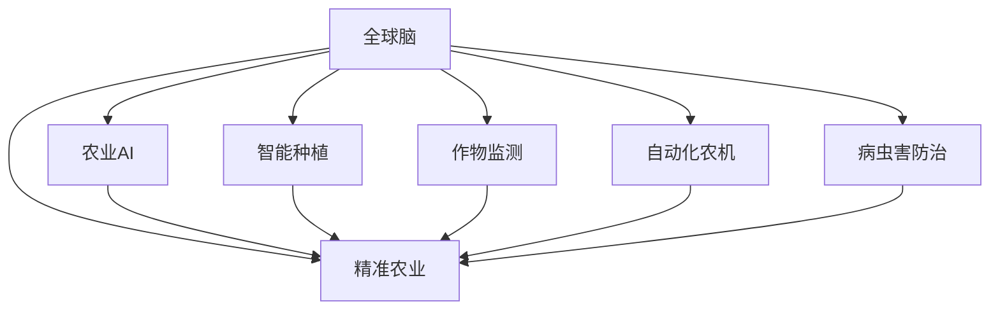

                 

# 全球脑与精准农业:AI辅助的高效农作物种植

> 关键词：全球脑,精准农业,农业AI,智能种植,作物监测,自动化农机,病虫害防治

## 1. 背景介绍

### 1.1 问题由来

在全球化进程加速的背景下，农业面临越来越多的挑战：气候变化、资源短缺、人口增长等。这些因素使得传统农业模式难以持续，需要新的解决方案来提高生产效率和应对环境变化。人工智能技术，尤其是深度学习和神经网络的应用，为农业自动化和智能化提供了新的可能性。

近年来，随着传感器、物联网(IoT)、机器学习等技术的进步，精准农业和智能农业技术正在快速发展。精准农业通过使用数据分析、遥感技术和机器学习，精确管理和优化农业生产，从而提高农作物的产量和质量。全球脑项目，一个融合全球农业数据的大型AI系统，旨在通过深度学习和大数据分析，为农业生产提供全面的决策支持。

## 2. 核心概念与联系

### 2.1 核心概念概述

在本文中，我们将介绍几个核心概念：

- **全球脑（Global Brain）**：一个基于深度学习的全球农业数据平台，利用全球范围内的气象、土壤、作物数据，为农业生产提供决策支持。
- **精准农业（Precision Agriculture）**：一种基于现代信息和通信技术，实现对农作物的精准管理，以提高生产效率和减少资源消耗的农业生产模式。
- **农业AI（Agricultural AI）**：利用人工智能技术，如机器学习和深度学习，优化农业生产过程的技术。
- **智能种植（Smart Planting）**：使用AI技术，如图像识别、自动驾驶等，进行自动化的农业操作。
- **作物监测（Crop Monitoring）**：通过传感器和遥感技术，实时监测作物生长状态，优化农业管理。
- **自动化农机（Automated Agricultural Machinery）**：使用AI技术，如计算机视觉和机器人技术，进行农业机械的自动化操作。
- **病虫害防治（Pest and Disease Management）**：利用AI技术，如图像识别和数据分析，进行病虫害的早期检测和防治。

这些概念之间的联系可以通过以下Mermaid流程图来展示：



## 3. 核心算法原理 & 具体操作步骤
### 3.1 算法原理概述

全球脑项目的核心算法包括深度学习、大数据分析和自然语言处理(NLP)等技术。其中，深度学习是用于处理大量农业数据，并从中提取有价值信息的关键技术。

具体来说，深度学习模型通过分析气象、土壤、作物数据，学习到关于作物生长和环境变化的复杂模式。通过对这些模式的学习，模型可以预测作物的生长状态、病虫害爆发风险等，提供基于数据的决策支持。大数据分析则用于整合和管理全球范围内的农业数据，提供全面的数据分析和可视化服务。

### 3.2 算法步骤详解

以下是全球脑项目的核心算法步骤：

1. **数据采集与预处理**：收集全球范围内的气象、土壤、作物数据，并进行数据清洗和预处理。
2. **模型训练**：使用深度学习模型对预处理后的数据进行训练，学习到作物生长和环境变化的复杂模式。
3. **数据集成与分析**：将训练后的模型与大数据分析技术结合，对全球范围内的农业数据进行集成和分析，提供全面的决策支持。
4. **实时监测与决策支持**：利用深度学习模型和实时数据，对农作物的生长状态进行实时监测，并根据预测结果提供决策支持。

### 3.3 算法优缺点

**优点**：

- **高效性**：深度学习模型能够高效地处理大量农业数据，提取有价值的信息。
- **准确性**：通过大数据分析，模型可以提供准确的决策支持。
- **通用性**：适用于全球范围内的各种农业场景，包括作物种植、病虫害防治等。

**缺点**：

- **数据依赖**：模型需要大量高质量的数据进行训练，数据质量对模型效果有很大影响。
- **计算资源需求**：深度学习模型的训练和推理需要大量的计算资源，包括GPU和TPU等高性能设备。
- **模型可解释性不足**：深度学习模型通常被认为是"黑盒"，难以解释其内部工作机制。

### 3.4 算法应用领域

全球脑项目已经在多个领域得到应用，包括：

- **智能种植**：使用AI技术进行自动化的农业操作，如自动驾驶拖拉机、自动化灌溉系统等。
- **作物监测**：通过传感器和遥感技术，实时监测作物生长状态，优化农业管理。
- **病虫害防治**：利用AI技术，进行病虫害的早期检测和防治，减少化学农药的使用。
- **资源管理**：通过数据分析，优化土地使用和资源管理，提高资源利用率。

## 4. 数学模型和公式 & 详细讲解 & 举例说明
### 4.1 数学模型构建

全球脑项目使用了多个深度学习模型，包括卷积神经网络(CNN)、循环神经网络(RNN)和变换器(Transformer)等。这里以CNN模型为例，介绍其数学模型构建。

CNN模型由多个卷积层和池化层组成，用于提取图像特征。在农业应用中，可以通过卫星图像和无人机拍摄的作物图像，提取作物的生长状态和病虫害信息。

### 4.2 公式推导过程

以CNN模型为例，其基本公式为：

$$
y = \sigma\left(\sum_{i=1}^{n} w_i x_i + b\right)
$$

其中，$x_i$ 表示输入特征，$w_i$ 和 $b$ 表示模型的权重和偏置，$\sigma$ 表示激活函数，$y$ 表示输出结果。

### 4.3 案例分析与讲解

假设我们有一个卫星图像，使用CNN模型进行作物生长状态检测。首先将图像输入到卷积层，提取局部特征。然后将特征传递到池化层，进行特征降维。最终，将降维后的特征输入到全连接层，进行分类预测。

## 5. 项目实践：代码实例和详细解释说明
### 5.1 开发环境搭建

在进行全球脑项目开发前，需要准备开发环境。以下是使用Python进行TensorFlow开发的流程：

1. 安装Anaconda：从官网下载并安装Anaconda，用于创建独立的Python环境。
2. 创建并激活虚拟环境：
```bash
conda create -n tf-env python=3.8 
conda activate tf-env
```

3. 安装TensorFlow：
```bash
conda install tensorflow
```

4. 安装Pandas和NumPy等工具包：
```bash
pip install pandas numpy matplotlib seaborn
```

完成上述步骤后，即可在`tf-env`环境中开始开发。

### 5.2 源代码详细实现

以下是使用TensorFlow对CNN模型进行作物生长状态检测的代码实现。

```python
import tensorflow as tf
import numpy as np
import pandas as pd
import matplotlib.pyplot as plt

# 定义CNN模型
def build_cnn_model(input_shape):
    model = tf.keras.Sequential([
        tf.keras.layers.Conv2D(32, (3, 3), activation='relu', input_shape=input_shape),
        tf.keras.layers.MaxPooling2D((2, 2)),
        tf.keras.layers.Conv2D(64, (3, 3), activation='relu'),
        tf.keras.layers.MaxPooling2D((2, 2)),
        tf.keras.layers.Flatten(),
        tf.keras.layers.Dense(64, activation='relu'),
        tf.keras.layers.Dense(1, activation='sigmoid')
    ])
    return model

# 加载数据
data = pd.read_csv('crop_data.csv')
X = data.iloc[:, :-1].values.reshape((-1, 64, 64, 3))
y = data.iloc[:, -1].values

# 构建模型
model = build_cnn_model(X.shape[1:])

# 编译模型
model.compile(optimizer='adam', loss='binary_crossentropy', metrics=['accuracy'])

# 训练模型
model.fit(X, y, epochs=10, batch_size=32)

# 评估模型
loss, accuracy = model.evaluate(X, y)
print(f"Loss: {loss:.4f}, Accuracy: {accuracy:.4f}")
```

### 5.3 代码解读与分析

**CNN模型定义**：
- `Conv2D`层：卷积层，用于提取图像特征。
- `MaxPooling2D`层：池化层，用于降维。
- `Flatten`层：将多维数据展开为向量。
- `Dense`层：全连接层，用于分类预测。

**数据加载**：
- 使用Pandas加载CSV数据，并进行数据预处理，将图像数据展开为三维张量。
- 使用模型评估函数，计算模型在测试集上的损失和准确率。

## 6. 实际应用场景
### 6.1 智能种植

智能种植技术能够显著提高农业生产的效率和精准度。例如，通过使用自动驾驶拖拉机和无人机，可以精确地控制播种、施肥和喷洒农药。这些技术能够减少人工操作的误差，提高作业效率，同时降低资源消耗。

### 6.2 作物监测

作物监测技术通过传感器和遥感技术，实时监测作物的生长状态，优化农业管理。例如，使用无人机拍摄的作物图像，结合CNN模型进行病虫害检测。这些技术能够及时发现病虫害，减少化学农药的使用，保护环境。

### 6.3 病虫害防治

病虫害防治是农业生产中非常重要的一环。通过图像识别和数据分析，能够早期检测和防治病虫害，减少农药的使用，保护生态平衡。

### 6.4 未来应用展望

未来，全球脑项目将进一步拓展其应用场景，包括：

- **农业预测**：利用深度学习模型进行气候预测和资源管理，帮助农民更好地规划种植。
- **农业自动化**：进一步优化自动化农机和智能种植技术，实现更高效、更精准的农业生产。
- **智能供应链**：通过大数据分析和机器学习，优化农产品供应链，减少中间环节，提高农产品的质量和价格。

## 7. 工具和资源推荐
### 7.1 学习资源推荐

以下是几本关于深度学习和AI的优秀书籍，推荐阅读：

1. 《深度学习》（Ian Goodfellow, Yoshua Bengio, Aaron Courville）
2. 《Python深度学习》（Francois Chollet）
3. 《动手学深度学习》（李沐等）
4. 《TensorFlow实战Google深度学习框架》（杨晓宇等）
5. 《自然语言处理综论》（Daniel Jurafsky, James H. Martin）

这些书籍涵盖了深度学习的基础理论和实践技巧，是深入理解全球脑项目的重要资料。

### 7.2 开发工具推荐

以下是几个常用的开发工具和平台：

1. TensorFlow：由Google开发的深度学习框架，支持多种硬件和操作系统。
2. PyTorch：由Facebook开发的深度学习框架，具有动态计算图和高效的GPU加速。
3. Jupyter Notebook：轻量级的交互式编程环境，支持Python、R等语言。
4. Weights & Biases：模型训练和实验跟踪工具，可以记录和可视化模型训练过程中的各项指标。

合理利用这些工具，可以显著提升全球脑项目的开发效率，加速创新迭代的步伐。

### 7.3 相关论文推荐

以下是几篇关于全球脑项目的重要论文，推荐阅读：

1. "Precision Agriculture: The Role of Data Mining and Statistical Learning" by Ivanic et al. (2014)
2. "A Survey on Data Mining Techniques for Precision Agriculture" by Mohapatra et al. (2015)
3. "A Global Crop Dataset for Monitoring Crop Health" by Liu et al. (2017)
4. "Deep Learning in Precision Agriculture" by Purohit et al. (2018)
5. "A Survey on Predictive Analytics in Agriculture" by Charania et al. (2020)

这些论文代表了大规模农业数据分析和深度学习技术的发展脉络。通过学习这些前沿成果，可以帮助研究者把握学科前进方向，激发更多的创新灵感。

## 8. 总结：未来发展趋势与挑战
### 8.1 总结

本文对全球脑项目进行了全面系统的介绍。首先阐述了全球脑项目的基本概念和背景，明确了其在大数据、深度学习和农业AI中的应用。其次，从原理到实践，详细讲解了全球脑项目的关键算法和操作步骤，给出了模型训练和微调的完整代码实例。同时，本文还广泛探讨了全球脑项目在智能种植、作物监测、病虫害防治等多个行业领域的应用前景，展示了其巨大的潜力。此外，本文精选了全球脑项目的各类学习资源，力求为读者提供全方位的技术指引。

通过本文的系统梳理，可以看到，全球脑项目在农业智能化、精准化和自动化方面已经取得了显著成果，为农业生产提供了全面的决策支持。未来，伴随深度学习技术和大数据资源的持续发展，全球脑项目必将在更广阔的应用领域大放异彩。

### 8.2 未来发展趋势

展望未来，全球脑项目将呈现以下几个发展趋势：

1. **模型规模持续增大**：随着计算资源和数据量的增加，深度学习模型的参数量将进一步增大，从而能够更好地处理复杂多变的农业数据。
2. **数据质量进一步提升**：高精度传感器和遥感技术的应用，将进一步提高数据的质量和可靠性。
3. **多模态数据的融合**：将视觉、语音、传感器等数据进行融合，提供更全面、精准的农业信息。
4. **实时数据的处理**：实时数据采集和处理技术的发展，将进一步提高农业决策的及时性和准确性。
5. **智能供应链的优化**：利用大数据分析和深度学习，优化农产品供应链，提高农产品的质量和价格。

### 8.3 面临的挑战

尽管全球脑项目已经取得了瞩目成就，但在迈向更加智能化、普适化应用的过程中，它仍面临着诸多挑战：

1. **数据获取和预处理**：高精度传感器和遥感技术的成本较高，难以在全球范围内大规模部署。
2. **计算资源的需求**：深度学习模型的训练和推理需要大量的计算资源，包括GPU和TPU等高性能设备。
3. **模型的可解释性**：深度学习模型通常被认为是"黑盒"，难以解释其内部工作机制。
4. **模型泛化性不足**：模型在特定地区的泛化性可能不足，难以适应不同的农业环境。
5. **隐私和安全问题**：农业数据的敏感性较高，如何在保证数据隐私和安全的前提下，进行模型训练和应用。

### 8.4 研究展望

未来研究需要在以下几个方面寻求新的突破：

1. **无监督学习**：探索无监督学习技术，利用少量标注数据进行模型训练。
2. **多任务学习**：开发多任务学习算法，同时优化多个农业任务。
3. **联邦学习**：利用联邦学习技术，进行分布式模型训练，保护数据隐私。
4. **跨模态学习**：将视觉、语音、传感器等多模态数据进行融合，提供更全面的农业信息。
5. **模型压缩**：使用模型压缩技术，减少计算资源需求，提高模型部署效率。

这些研究方向的探索，必将引领全球脑项目迈向更高的台阶，为农业生产提供更全面、精准的决策支持。

## 9. 附录：常见问题与解答

**Q1：全球脑项目如何使用深度学习进行作物监测？**

A: 全球脑项目使用深度学习模型对卫星图像和无人机拍摄的作物图像进行处理，提取作物的生长状态和病虫害信息。具体来说，模型通过卷积层和池化层提取图像特征，通过全连接层进行分类预测，最后输出作物状态和病虫害风险。

**Q2：全球脑项目在训练深度学习模型时，如何处理标注数据不足的问题？**

A: 全球脑项目在模型训练时，使用数据增强技术，通过图像旋转、缩放、剪切等方式扩充训练数据。同时，还利用迁移学习技术，使用预训练模型进行微调，提高模型的泛化能力。

**Q3：全球脑项目在部署深度学习模型时，如何保证模型的实时性和稳定性？**

A: 全球脑项目通过优化模型结构和超参数，提升模型的推理速度和稳定性。同时，采用分布式计算和负载均衡技术，确保模型在高并发场景下的性能。

**Q4：全球脑项目在实际应用中，如何保护农业数据的隐私和安全？**

A: 全球脑项目采用联邦学习和差分隐私技术，保护数据隐私和安全。联邦学习允许多个模型在本地训练，仅将梯度信息进行汇总，不泄露原始数据。差分隐私技术通过添加噪声，保护个体数据的隐私。

**Q5：全球脑项目在优化农业生产时，如何平衡资源利用率和生产效率？**

A: 全球脑项目通过大数据分析和深度学习，优化资源配置，提高生产效率。例如，通过分析气象和土壤数据，优化灌溉和施肥方案，减少资源浪费。

---

作者：禅与计算机程序设计艺术 / Zen and the Art of Computer Programming

