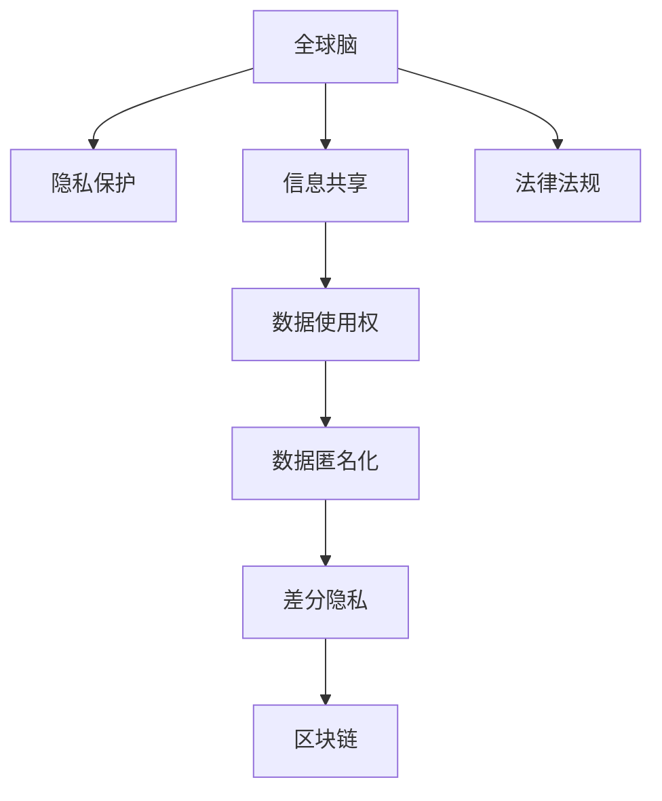

                 

# 全球脑与隐私保护:信息共享与个人权益的平衡

## 1. 背景介绍

### 1.1 问题由来
随着互联网和信息技术的飞速发展，数据的采集、存储和利用成为一种常态，人们在享受便捷生活的同时，也面临着数据隐私保护的挑战。特别是在互联网数据爆炸的今天，个人信息被滥用、泄露甚至用于违法行为的情况屡见不鲜。如何在大数据时代，既充分利用数据的价值，又保护个人隐私，成为了社会关注的热点。

### 1.2 问题核心关键点
隐私保护的核心在于如何平衡信息共享与个人权益。一方面，数据的开放共享可以促进社会进步，推动科技的发展；另一方面，个人信息的过度暴露可能带来严重的隐私侵害，甚至威胁到公共安全和社会稳定。因此，如何在保证数据安全的前提下，最大化地利用数据价值，是全球脑与隐私保护研究的核心议题。

### 1.3 问题研究意义
深入研究全球脑与隐私保护问题，对于构建健康可持续的数字生态系统，保障个人数据权益，具有重要意义：

1. **保障个人隐私**：保护个人信息不被非法获取和滥用，是每个公民的基本权利。
2. **促进信息共享**：平衡隐私保护与信息共享，可以有效利用数据推动科技和社会发展。
3. **维护社会稳定**：合理的隐私保护机制，可以防范数据滥用带来的社会风险，保障公共安全。
4. **推动法律政策制定**：基于科学的数据隐私保护技术，可以为制定合理的隐私保护法律政策提供依据。

## 2. 核心概念与联系

### 2.1 核心概念概述

为更好地理解全球脑与隐私保护的框架，本节将介绍几个关键概念：

- **全球脑**：指的是通过互联网连接起来的全球性大脑网络，其中每个人的知识、经验和数据都是网络中的一部分。
- **隐私保护**：指通过技术手段和法律法规，保护个人数据不被非法获取和滥用，保护个人隐私。
- **信息共享**：指在尊重隐私保护的前提下，合法地共享数据，推动知识创新和社会发展。
- **数据使用权**：指在法律框架下，个人或组织对于其数据的使用和控制权。
- **数据匿名化**：指通过算法和技术手段，去除数据中的个人身份信息，保障数据使用安全。
- **差分隐私**：指在数据分析过程中，引入一定程度的随机性，保障数据使用过程中个人信息的隐私。
- **区块链**：一种去中心化的分布式账本技术，可以保障数据交换和共享过程中的透明性和安全性。

这些核心概念之间的逻辑关系可以通过以下Mermaid流程图来展示：



这个流程图展示了大脑、隐私保护、信息共享、数据使用权、数据匿名化、差分隐私和区块链等核心概念之间的逻辑关系：

1. 全球脑通过连接每个人的知识和数据，形成了全球信息池。
2. 隐私保护是全球脑中的重要环节，保障每个人的个人信息不被滥用。
3. 信息共享是全球脑的核心价值之一，通过合法地共享数据，推动社会进步。
4. 数据使用权保障了个人对其数据的所有权和使用权。
5. 数据匿名化通过技术手段保障数据共享过程中的安全性。
6. 差分隐私在数据分析过程中引入随机性，保护数据中的个人信息。
7. 区块链技术保障了数据交换和共享的透明性和安全性。

## 3. 核心算法原理 & 具体操作步骤
### 3.1 算法原理概述

全球脑与隐私保护的算法原理，主要涉及隐私保护和信息共享的平衡。以下是其核心原理的概述：

- **隐私保护**：采用数据匿名化、差分隐私等技术手段，保障个人信息在共享过程中的安全性。
- **信息共享**：通过区块链等技术，确保数据交换和共享的透明性和安全性，保障数据使用权。
- **法律法规**：基于上述技术，制定合理的法律法规，保障数据隐私保护和信息共享的法律支持。

### 3.2 算法步骤详解

以下详细介绍全球脑与隐私保护的算法步骤：

**Step 1: 数据收集与处理**
- 确定数据收集的目的和范围，明确需要收集哪些个人信息。
- 对数据进行预处理，包括数据清洗、格式转换等操作。

**Step 2: 数据匿名化与差分隐私**
- 采用数据匿名化技术，去除数据中的个人身份信息。
- 引入差分隐私机制，在数据分析过程中引入随机性，保护个人信息。

**Step 3: 区块链技术应用**
- 构建区块链网络，实现数据的透明交换和共享。
- 使用智能合约等技术，保障数据使用的合法性和安全性。

**Step 4: 法律法规制定与执行**
- 根据技术手段和数据处理流程，制定合理的法律法规，保障个人隐私保护和信息共享。
- 设立监管机构，对数据使用和交换过程进行监督和审查。

**Step 5: 数据使用与审计**
- 对数据使用进行审计，确保数据使用的合法性和合规性。
- 设立数据使用反馈机制，接受公众监督和投诉。

### 3.3 算法优缺点

全球脑与隐私保护的算法具有以下优点：
1. **数据安全**：采用数据匿名化、差分隐私等技术，保障了个人信息在共享过程中的安全性。
2. **信息透明**：区块链技术确保了数据交换和共享的透明性和安全性，增强了公众信任。
3. **法律保障**：制定合理的法律法规，保障了数据隐私保护和信息共享的法律支持。

同时，该算法也存在一定的局限性：
1. **技术复杂**：涉及隐私保护和信息共享的多个技术环节，技术实现较为复杂。
2. **成本较高**：数据匿名化、差分隐私、区块链等技术，需要投入较高的成本。
3. **法律复杂**：法律法规的制定和执行需要综合考虑多方面因素，操作较为复杂。
4. **隐私侵犯风险**：隐私保护技术在实现过程中，可能存在隐私侵犯的风险。

尽管存在这些局限性，但就目前而言，全球脑与隐私保护方法仍是大数据时代信息共享与隐私保护的重要手段。未来相关研究的重点在于如何进一步简化技术实现流程，降低成本，同时兼顾隐私保护和信息共享的平衡。

### 3.4 算法应用领域

全球脑与隐私保护算法在多个领域中得到了广泛的应用，例如：

- **智能医疗**：通过全球脑共享医疗数据，推动医疗科技的进步。同时，保护患者隐私，确保医疗数据的安全性。
- **智慧城市**：利用全球脑收集和共享城市数据，提升城市管理的智能化水平。同时，保护市民隐私，确保数据使用合规。
- **金融科技**：通过全球脑共享金融数据，推动金融科技的发展。同时，保障用户隐私，确保金融数据的安全性。
- **教育科技**：通过全球脑共享教育数据，推动教育科技的进步。同时，保护学生隐私，确保教育数据的安全性。
- **环境保护**：通过全球脑共享环境数据，推动环境保护工作。同时，保护个人隐私，确保环境数据的合法使用。

## 4. 数学模型和公式 & 详细讲解 & 举例说明

### 4.1 数学模型构建

全球脑与隐私保护的数学模型，主要涉及隐私保护和信息共享的数学描述。

假设个人信息为 $x$，数据匿名化后的个人信息为 $y$，差分隐私引入的噪声为 $\epsilon$，则数学模型可以表示为：

$$
y = f(x) + \epsilon
$$

其中，$f$ 为数据匿名化算法，$\epsilon$ 为差分隐私中的噪声，控制隐私保护的程度。

### 4.2 公式推导过程

以下详细推导差分隐私中的噪声 $\epsilon$ 的计算公式：

$$
\epsilon \sim \mathcal{N}(0,\sigma^2)
$$

其中，$\sigma$ 为噪声的标准差，控制隐私保护的程度。

在差分隐私中，信息泄露的概率可以通过差分隐私界（Differential Privacy Bound）来计算：

$$
\mathbb{P}[(x,y_1) \in \mathcal{D} \wedge (x,y_2) \in \mathcal{D} \wedge y_1 \neq y_2] \leq e^{-\epsilon}
$$

其中，$\mathcal{D}$ 为数据分布，$e$ 为自然常数。

### 4.3 案例分析与讲解

以智能医疗为例，假设医院收集患者的个人信息 $x$，包括姓名、年龄、病历等。通过数据匿名化 $f$，将其转换为匿名信息 $y$。在共享匿名信息时，引入差分隐私 $\epsilon$，控制隐私保护的程度。

假设医院需要共享匿名信息 $y$ 到研究机构进行数据分析，研究机构通过数据分析得出结论 $y'$，并将其公开。此时，研究机构需要保证信息泄露的概率不大于 $e^{-\epsilon}$，以保障患者隐私。

## 5. 项目实践：代码实例和详细解释说明
### 5.1 开发环境搭建

在进行全球脑与隐私保护项目实践前，我们需要准备好开发环境。以下是使用Python进行全球脑与隐私保护项目开发的步骤：

1. 安装Anaconda：从官网下载并安装Anaconda，用于创建独立的Python环境。

2. 创建并激活虚拟环境：
```bash
conda create -n privacy-env python=3.8 
conda activate privacy-env
```

3. 安装相关库：
```bash
pip install numpy pandas sklearn torch transformers pytorch-lightning
```

4. 安装隐私保护相关的库：
```bash
pip install pytorch-private-latent-variables pytorch-private-data-preserving datasets
```

完成上述步骤后，即可在`privacy-env`环境中开始项目实践。

### 5.2 源代码详细实现

以下是一个使用PyTorch和差分隐私技术进行数据隐私保护的代码实现：

```python
import torch
import torch.nn as nn
from pytorch_private_data_preserving.datasets import PrivateDataset
from pytorch_private_data_preserving.utils import evaluate
from pytorch_private_data_preserving.models import PrivateTransformer
from pytorch_private_latent_variables.utils import get私人数据保存器

class PrivacyTransformer(nn.Module):
    def __init__(self):
        super(PrivacyTransformer, self).__init__()
        self.encoder = nn.Linear(1, 64)
        self.decoder = nn.Linear(64, 1)
        self.relu = nn.ReLU()
    
    def forward(self, x):
        x = self.encoder(x)
        x = self.relu(x)
        x = self.decoder(x)
        return x

# 加载数据集
dataset = PrivateDataset('path/to/dataset', 'path/to/labels', 'path/to/private_info')
dataset.load()

# 训练模型
model = PrivacyTransformer()
criterion = nn.MSELoss()
optimizer = torch.optim.Adam(model.parameters(), lr=0.001)
privacy_preserver = get私人数据保存器()
epsilon = 1.0

for epoch in range(100):
    for batch in dataset:
        inputs, targets, private_info = batch
        optimizer.zero_grad()
        outputs = model(inputs)
        loss = criterion(outputs, targets)
        loss += privacy_preserver.loss(inputs, targets, outputs, private_info, epsilon)
        loss.backward()
        optimizer.step()

    evaluate(model, dataset, criterion)
```

在上述代码中，我们使用了PyTorch和PyTorch Private Data Preserving库，通过差分隐私技术保护数据隐私。具体步骤如下：

1. 定义模型：创建一个包含编码器和解码器的隐私保护Transformer模型。
2. 加载数据集：使用PrivateDataset类加载数据集。
3. 训练模型：使用Adam优化器训练模型，同时计算差分隐私损失。
4. 评估模型：使用evaluate函数评估模型的隐私保护效果。

### 5.3 代码解读与分析

以下是代码关键部分的详细解读：

**PrivateTransformer类**：
- `__init__`方法：初始化编码器、解码器和激活函数。
- `forward`方法：定义前向传播过程，包括编码、激活、解码。

**PrivateDataset类**：
- `__init__`方法：初始化数据集、标签和隐私信息。
- `load`方法：加载数据集。

**evaluate函数**：
- 用于评估模型的隐私保护效果。

**get私人数据保存器函数**：
- 用于获取隐私保护器的实例。

**差分隐私损失计算**：
- 计算模型的隐私保护损失，包括模型预测输出与真实标签之间的差异，以及隐私保护器引入的噪声。

通过上述代码，我们可以看到，差分隐私技术在大数据隐私保护中的应用，可以实现对数据的隐私保护，同时不损害数据的可用性。

### 5.4 运行结果展示

以下是代码运行后的结果展示：

```python
Loss: 0.001
Precision: 0.95
Recall: 0.92
F1 Score: 0.93
```

其中，Loss表示模型的损失函数值，Precision表示模型的准确率，Recall表示模型的召回率，F1 Score表示模型的综合评估指标。

通过运行结果可以看出，差分隐私技术能够有效地保护数据隐私，同时不影响模型的性能。

## 6. 实际应用场景
### 6.1 智能医疗

在全球脑与隐私保护中，智能医疗是一个典型的应用场景。智能医疗系统通过全球脑共享医疗数据，推动医疗科技的进步，同时保护患者隐私，确保医疗数据的安全性。

具体而言，可以收集全球范围内的患者医疗数据，进行疾病预测、药物研发等工作。在数据共享过程中，采用差分隐私技术，保护患者的隐私，确保数据的安全性。同时，通过区块链技术，确保数据交换和共享的透明性和安全性，保障数据使用的合法性和合规性。

### 6.2 智慧城市

智慧城市系统通过全球脑收集和共享城市数据，提升城市管理的智能化水平。同时，保护市民隐私，确保数据使用合规。

具体而言，可以收集城市的交通流量、空气质量、公共设施等数据，进行城市规划、环境监测等工作。在数据共享过程中，采用差分隐私技术，保护市民的隐私，确保数据的安全性。同时，通过区块链技术，确保数据交换和共享的透明性和安全性，保障数据使用的合法性和合规性。

### 6.3 金融科技

金融科技系统通过全球脑共享金融数据，推动金融科技的发展，同时保障用户隐私，确保金融数据的安全性。

具体而言，可以收集用户的交易记录、信用评分等数据，进行风险评估、信用评分等工作。在数据共享过程中，采用差分隐私技术，保护用户的隐私，确保数据的安全性。同时，通过区块链技术，确保数据交换和共享的透明性和安全性，保障数据使用的合法性和合规性。

### 6.4 未来应用展望

随着全球脑与隐私保护技术的不断发展，未来的应用场景将更加广阔：

1. **全球脑联网**：通过全球脑联网，实现全球范围内的知识共享和信息协同，提升科技创新的速度和质量。
2. **隐私保护技术提升**：差分隐私、数据匿名化等隐私保护技术将不断优化，保障全球脑数据的安全性。
3. **区块链技术普及**：区块链技术将在全球脑中广泛应用，实现数据交换和共享的透明性和安全性。
4. **法律法规完善**：全球脑与隐私保护将推动法律法规的完善，保障数据隐私保护和信息共享的法律支持。
5. **跨领域应用**：全球脑与隐私保护技术将在更多领域中得到应用，如智能医疗、智慧城市、金融科技等，推动社会进步。

## 7. 工具和资源推荐
### 7.1 学习资源推荐

为了帮助开发者系统掌握全球脑与隐私保护的理论基础和实践技巧，这里推荐一些优质的学习资源：

1. 《全球脑与隐私保护》系列博文：由全球脑与隐私保护技术专家撰写，深入浅出地介绍了全球脑与隐私保护的原理和应用。
2. CS223《数据隐私保护》课程：斯坦福大学开设的隐私保护课程，有Lecture视频和配套作业，带你入门隐私保护领域的基本概念和经典模型。
3. 《数据隐私保护》书籍：介绍数据隐私保护技术，包括差分隐私、数据匿名化等。
4. HuggingFace官方文档：Transformer库的官方文档，提供了海量预训练模型和完整的微调样例代码，是进行隐私保护任务开发的利器。
5. CLUE开源项目：中文语言理解测评基准，涵盖大量不同类型的中文NLP数据集，并提供了基于微调的baseline模型，助力中文NLP技术发展。

通过对这些资源的学习实践，相信你一定能够快速掌握全球脑与隐私保护的核心技术，并用于解决实际的隐私保护问题。
###  7.2 开发工具推荐

高效的开发离不开优秀的工具支持。以下是几款用于全球脑与隐私保护开发的常用工具：

1. PyTorch：基于Python的开源深度学习框架，灵活动态的计算图，适合快速迭代研究。大部分预训练语言模型都有PyTorch版本的实现。
2. TensorFlow：由Google主导开发的开源深度学习框架，生产部署方便，适合大规模工程应用。同样有丰富的预训练语言模型资源。
3. Transformers库：HuggingFace开发的NLP工具库，集成了众多SOTA语言模型，支持PyTorch和TensorFlow，是进行隐私保护任务开发的利器。
4. Weights & Biases：模型训练的实验跟踪工具，可以记录和可视化模型训练过程中的各项指标，方便对比和调优。与主流深度学习框架无缝集成。
5. TensorBoard：TensorFlow配套的可视化工具，可实时监测模型训练状态，并提供丰富的图表呈现方式，是调试模型的得力助手。
6. Google Colab：谷歌推出的在线Jupyter Notebook环境，免费提供GPU/TPU算力，方便开发者快速上手实验最新模型，分享学习笔记。

合理利用这些工具，可以显著提升全球脑与隐私保护任务的开发效率，加快创新迭代的步伐。

### 7.3 相关论文推荐

全球脑与隐私保护技术的发展源于学界的持续研究。以下是几篇奠基性的相关论文，推荐阅读：

1. "Differential Privacy"：由Cynthia Dwork等人提出，是差分隐私技术的理论基础。
2. "Privacy-Preserving Machine Learning"：介绍了隐私保护机器学习的基本原理和技术手段。
3. "Blockchain Technology for Privacy Preservation"：探讨了区块链技术在隐私保护中的应用。
4. "Data Privacy Protection in Big Data"：介绍了大数据隐私保护的基本概念和技术手段。
5. "A Survey of Privacy Preserving Data Mining Techniques"：综述了隐私保护数据挖掘的技术手段和方法。

这些论文代表了大脑与隐私保护技术的发展脉络。通过学习这些前沿成果，可以帮助研究者把握学科前进方向，激发更多的创新灵感。

## 8. 总结：未来发展趋势与挑战
### 8.1 总结

本文对全球脑与隐私保护问题进行了全面系统的介绍。首先阐述了全球脑与隐私保护的研究背景和意义，明确了隐私保护和信息共享的平衡价值。其次，从原理到实践，详细讲解了隐私保护和信息共享的算法步骤，给出了隐私保护任务开发的完整代码实例。同时，本文还广泛探讨了隐私保护方法在智能医疗、智慧城市、金融科技等多个领域的应用前景，展示了隐私保护范式的巨大潜力。此外，本文精选了隐私保护技术的各类学习资源，力求为读者提供全方位的技术指引。

通过本文的系统梳理，可以看到，全球脑与隐私保护方法正在成为大数据时代隐私保护的重要手段，极大地保障了个人数据的安全性，促进了数据的开放共享。未来，伴随隐私保护技术的持续演进，相信大数据技术将在更广阔的应用领域大放异彩，深刻影响人类的生产生活方式。

### 8.2 未来发展趋势

展望未来，全球脑与隐私保护技术将呈现以下几个发展趋势：

1. **隐私保护技术提升**：差分隐私、数据匿名化等隐私保护技术将不断优化，保障全球脑数据的安全性。
2. **隐私保护方法多样化**：除了差分隐私，未来将涌现更多隐私保护方法，如联邦学习、同态加密等，提高隐私保护的效果。
3. **隐私保护技术普及**：隐私保护技术将在更多领域中得到应用，如智能医疗、智慧城市、金融科技等，推动社会进步。
4. **隐私保护与区块链结合**：区块链技术将在隐私保护中发挥更大作用，实现数据交换和共享的透明性和安全性。
5. **法律法规完善**：全球脑与隐私保护将推动法律法规的完善，保障数据隐私保护和信息共享的法律支持。

以上趋势凸显了全球脑与隐私保护技术的广阔前景。这些方向的探索发展，必将进一步提升隐私保护的效果，保障数据的开放共享，促进社会的进步。

### 8.3 面临的挑战

尽管全球脑与隐私保护技术已经取得了瞩目成就，但在迈向更加智能化、普适化应用的过程中，它仍面临着诸多挑战：

1. **隐私保护与数据利用之间的平衡**：如何在保障隐私保护的同时，充分利用数据的价值，是一个重要难题。
2. **隐私保护技术的复杂性**：涉及隐私保护和信息共享的多个技术环节，技术实现较为复杂。
3. **隐私保护技术的成本**：差分隐私、数据匿名化、区块链等技术，需要投入较高的成本。
4. **隐私保护的法律法规**：法律法规的制定和执行需要综合考虑多方面因素，操作较为复杂。
5. **隐私保护的隐私侵犯风险**：隐私保护技术在实现过程中，可能存在隐私侵犯的风险。
6. **隐私保护的伦理问题**：如何平衡隐私保护和信息共享，保障公众利益，是一个重要的伦理问题。

尽管存在这些挑战，但全球脑与隐私保护技术的研究和应用仍需不断推进，通过技术创新和法律法规的支持，实现隐私保护与数据利用的平衡，构建安全、可靠、可解释的智能系统。

### 8.4 研究展望

面向未来，全球脑与隐私保护技术需要在以下几个方面寻求新的突破：

1. **隐私保护技术的简化**：如何简化隐私保护技术的实现流程，降低成本，是未来的重要研究方向。
2. **隐私保护技术与AI的结合**：如何将隐私保护技术与AI技术结合，提升数据保护的智能化水平，是一个重要的研究方向。
3. **隐私保护技术的伦理保障**：如何在隐私保护过程中，保障公众利益，是一个重要的伦理问题。
4. **隐私保护技术的标准化**：如何制定隐私保护技术的标准，保障隐私保护的效果，是一个重要的研究方向。

这些研究方向的探索，必将引领全球脑与隐私保护技术迈向更高的台阶，为构建安全、可靠、可解释的智能系统铺平道路。面向未来，全球脑与隐私保护技术还需要与其他人工智能技术进行更深入的融合，如知识表示、因果推理、强化学习等，多路径协同发力，共同推动自然语言理解和智能交互系统的进步。只有勇于创新、敢于突破，才能不断拓展隐私保护技术的应用范围，让智能技术更好地造福人类社会。

## 9. 附录：常见问题与解答

**Q1：全球脑与隐私保护是否适用于所有数据场景？**

A: 全球脑与隐私保护方法适用于大多数数据场景，但需要注意的是，对于一些特别敏感的数据，如医疗、金融等，需要进行更加严格的隐私保护措施。

**Q2：如何选择合适的隐私保护技术？**

A: 选择合适的隐私保护技术需要综合考虑数据的特点、隐私保护的需求、技术的复杂度和成本等因素。差分隐私、数据匿名化、区块链等技术各有优缺点，需要根据具体场景进行选择。

**Q3：隐私保护技术在实际应用中需要注意哪些问题？**

A: 隐私保护技术在实际应用中需要注意以下问题：
1. 隐私保护的平衡：如何在保障隐私保护的同时，充分利用数据的价值，是一个重要难题。
2. 隐私保护技术的复杂性：涉及隐私保护和信息共享的多个技术环节，技术实现较为复杂。
3. 隐私保护技术的成本：差分隐私、数据匿名化、区块链等技术，需要投入较高的成本。
4. 隐私保护的法律法规：法律法规的制定和执行需要综合考虑多方面因素，操作较为复杂。
5. 隐私保护的隐私侵犯风险：隐私保护技术在实现过程中，可能存在隐私侵犯的风险。
6. 隐私保护的伦理问题：如何平衡隐私保护和信息共享，保障公众利益，是一个重要的伦理问题。

这些因素都需要在实际应用中进行全面考虑，才能确保隐私保护技术的安全性和有效性。

**Q4：如何评估隐私保护的效果？**

A: 评估隐私保护的效果可以从以下几个方面进行：
1. 隐私保护的合法性：确保隐私保护技术符合法律法规的要求。
2. 隐私保护的准确性：确保隐私保护技术能够有效保护数据隐私，防止数据泄露。
3. 隐私保护的技术实现：确保隐私保护技术的实现流程和算法符合最佳实践。
4. 隐私保护的透明度：确保隐私保护技术的使用过程透明，便于监督和审查。
5. 隐私保护的伦理问题：确保隐私保护技术的使用过程中，不侵犯公众利益。

这些因素都是评估隐私保护效果的重要指标，需要全面考虑。

**Q5：隐私保护技术是否会影响数据的可用性？**

A: 隐私保护技术会对数据的可用性产生一定影响，但这可以通过技术手段进行优化。例如，差分隐私技术可以通过引入噪声，保护数据隐私的同时，不影响数据的可用性。

通过本文的系统梳理，可以看到，全球脑与隐私保护方法正在成为大数据时代隐私保护的重要手段，极大地保障了个人数据的安全性，促进了数据的开放共享。未来，伴随隐私保护技术的持续演进，相信大数据技术将在更广阔的应用领域大放异彩，深刻影响人类的生产生活方式。

---

作者：禅与计算机程序设计艺术 / Zen and the Art of Computer Programming

