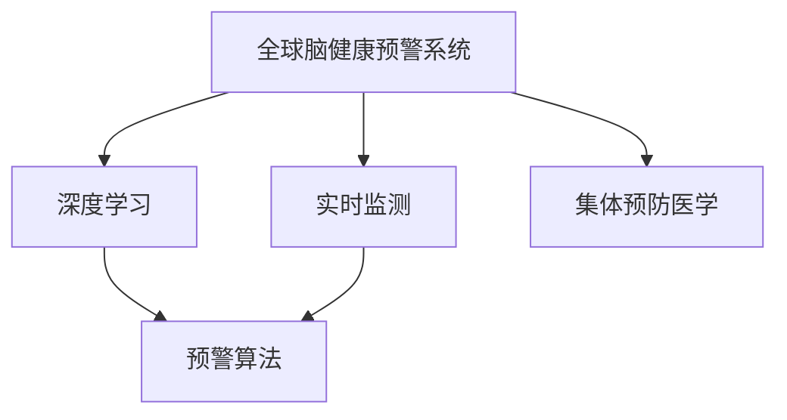

                 

# 全球脑健康预警系统:集体预防医学的实时监测网络

## 1. 背景介绍

### 1.1 问题由来
在21世纪的今天，脑健康问题正日益成为全球关注的焦点。随着生活节奏的加快、工作压力的增大以及环境污染的加剧，脑部疾病的发生率正呈上升趋势，包括但不限于阿尔茨海默病、帕金森病、中风等。据世界卫生组织（WHO）数据，仅阿尔茨海默病一项，到2030年，全球患者人数将突破3000万。面对如此严峻的形势，如何早期发现、早期干预、早期治疗脑部疾病，已成为全球医学界亟待解决的重大问题。

### 1.2 问题核心关键点
针对这一问题，全球脑健康预警系统（Global Brain Health Warning System, GBHWS）应运而生。GBHWS是一个基于互联网和人工智能的实时监测网络，旨在通过大规模数据收集、深度学习和预警算法，实现对脑健康状况的早期识别和预警。该系统的核心在于通过数据驱动的方式，利用人工智能技术，建立脑健康动态监测模型，并及时向患者和医疗机构发出预警，帮助其采取有效干预措施。

### 1.3 问题研究意义
研究GBHWS系统，对于提升脑部疾病的早期预警和干预能力，降低医疗成本，提高患者生活质量，具有重大意义：

1. **早期预警**：通过实时监测，可以在脑部疾病早期发现异常信号，及时进行干预，避免疾病进一步恶化。
2. **提高效率**：数据驱动的方法可以显著减少诊断时间，提高医疗系统的运行效率。
3. **个性化治疗**：根据监测数据，定制个性化的治疗方案，提高治疗效果。
4. **知识共享**：通过网络平台，共享医学知识和研究成果，推动脑健康领域的科研进展。

## 2. 核心概念与联系

### 2.1 核心概念概述

为更好地理解GBHWS系统的工作原理和架构，本节将介绍几个密切相关的核心概念：

- **全球脑健康预警系统 (Global Brain Health Warning System, GBHWS)**：一个基于互联网和人工智能的实时监测网络，通过深度学习和预警算法，实现对脑健康状况的早期识别和预警。
- **实时监测 (Real-time Monitoring)**：指通过传感器、问卷调查等手段，持续收集脑健康相关的生理和行为数据，并实时分析处理。
- **深度学习 (Deep Learning)**：一种基于人工神经网络的机器学习方法，通过多层非线性变换，从大量数据中提取特征，实现复杂的模式识别和决策。
- **预警算法 (Early Warning Algorithm)**：用于识别异常信号和潜在疾病的算法，如时间序列分析、异常检测等。
- **集体预防医学 (Population Prevention Medicine)**：一种基于群体数据和公共卫生的预防策略，旨在通过预防措施，降低疾病发生率。

这些核心概念之间的逻辑关系可以通过以下Mermaid流程图来展示：



这个流程图展示了大健康监测系统的核心概念及其之间的关系：

1. 全球脑健康预警系统通过实时监测获得脑健康数据。
2. 实时监测数据经过深度学习模型进行特征提取和模式识别。
3. 预警算法用于识别异常信号和潜在疾病，及时发出预警。
4. 系统通过大数据分析，进行集体预防医学，提升整体健康水平。

这些概念共同构成了GBHWS系统的框架，使其能够有效地实现脑健康的早期预警和干预。

## 3. 核心算法原理 & 具体操作步骤
### 3.1 算法原理概述

GBHWS系统的核心算法原理基于深度学习和预警算法，旨在通过实时监测数据，建立脑健康动态监测模型，并及时发出预警。其基本工作流程如下：

1. **数据采集**：通过传感器、问卷调查等手段，持续收集脑健康相关的生理和行为数据。
2. **特征提取**：使用深度学习模型对原始数据进行特征提取，生成低维的特征向量。
3. **模型训练**：基于大量历史数据，训练深度学习模型，学习健康与疾病之间的模式。
4. **异常检测**：通过预警算法，识别异常信号和潜在疾病。
5. **预警与干预**：根据预警结果，向患者和医疗机构发出预警，建议采取干预措施。

### 3.2 算法步骤详解

以下是GBHWS系统的主要算法步骤详解：

**Step 1: 数据采集与预处理**
- 利用各种传感器（如可穿戴设备、脑电图、磁共振等），实时采集脑健康相关数据。
- 数据预处理，包括去噪、归一化、降维等，确保数据质量。

**Step 2: 特征提取**
- 使用深度学习模型（如卷积神经网络CNN、循环神经网络RNN、长短期记忆网络LSTM等）对原始数据进行特征提取。
- 生成低维的特征向量，用于后续模式识别和预警。

**Step 3: 模型训练**
- 收集大量历史数据，包括正常和异常病例。
- 使用标注数据训练深度学习模型，学习健康与疾病之间的模式。
- 在验证集上评估模型性能，调整超参数。

**Step 4: 异常检测**
- 通过时间序列分析、异常检测等算法，识别异常信号和潜在疾病。
- 根据预设的阈值和规则，生成预警信号。

**Step 5: 预警与干预**
- 系统根据预警信号，及时向患者和医疗机构发出预警。
- 建议采取干预措施，如调整生活方式、药物治疗等。

### 3.3 算法优缺点

GBHWS系统基于深度学习和预警算法，具有以下优点：

- **实时性**：能够实时监测脑健康状况，快速响应预警。
- **准确性**：通过深度学习模型，能够准确识别异常信号，减少误诊和漏诊。
- **可扩展性**：基于互联网和云平台，可扩展至全球范围，支持多用户、多设备的数据共享。
- **低成本**：通过自动化的预警与干预，降低医疗成本。

同时，该系统也存在一些缺点：

- **隐私问题**：大量数据收集涉及用户隐私保护，需要建立严格的隐私保护机制。
- **算法复杂性**：深度学习和预警算法的复杂度较高，需要高水平的数据科学家和工程师支持。
- **数据质量**：数据采集和预处理环节，需要确保数据的质量和完整性，避免噪声干扰。

### 3.4 算法应用领域

GBHWS系统已经在多个脑健康监测领域得到了应用，包括但不限于：

- **阿尔茨海默病**：通过监测认知功能、记忆能力等指标，及时预警疾病风险。
- **帕金森病**：通过监测运动功能、震颤等指标，提供早期预警和干预建议。
- **中风**：通过监测血液指标、神经功能等，提前发现中风迹象。
- **心理健康**：通过情感分析、行为模式等，监测心理状态，提供心理健康干预。

除了这些具体应用外，GBHWS系统的应用前景还包括更多领域，如老年认知能力监测、儿童脑发育评估等。随着技术的不断进步，GBHWS系统必将在脑健康监测中发挥更大的作用。

## 4. 数学模型和公式 & 详细讲解  
### 4.1 数学模型构建

本节将使用数学语言对GBHWS系统的核心算法进行更加严格的刻画。

记输入数据为 $x_t$，目标变量为 $y_t$，系统输出的预警信号为 $z_t$。GBHWS系统可建模为以下形式：

$$
y_t = f(x_t; \theta)
$$

其中，$f(\cdot)$ 为深度学习模型，$\theta$ 为模型参数。预警信号 $z_t$ 与 $y_t$ 的关系为：

$$
z_t = g(y_t; \alpha)
$$

其中，$g(\cdot)$ 为预警算法，$\alpha$ 为预警阈值。

### 4.2 公式推导过程

以下我们以时间序列异常检测为例，推导预警算法的公式及其梯度计算。

假设系统监测到的脑健康指标 $x_t$ 服从ARIMA模型，即：

$$
x_t = \phi(x_{t-1}, \ldots, x_{t-p}) + \epsilon_t
$$

其中，$\phi(\cdot)$ 为自回归部分，$x_{t-1}, \ldots, x_{t-p}$ 为历史数据，$\epsilon_t$ 为白噪声。

通过深度学习模型，生成异常检测指标 $y_t$：

$$
y_t = f(x_t; \theta)
$$

其中，$f(\cdot)$ 为深度学习模型，$\theta$ 为模型参数。

通过预警算法，生成预警信号 $z_t$：

$$
z_t = g(y_t; \alpha)
$$

其中，$g(\cdot)$ 为预警算法，$\alpha$ 为预警阈值。

为了最大化预警信号的准确性，需要最小化预警误差 $e_t$：

$$
e_t = \mathbb{E}[(z_t - y_t)^2]
$$

通过梯度下降等优化算法，最小化预警误差：

$$
\theta \leftarrow \theta - \eta \nabla_{\theta}e_t - \eta\lambda\theta
$$

其中 $\eta$ 为学习率，$\lambda$ 为正则化系数。

### 4.3 案例分析与讲解

考虑一个脑健康监测实例：某患者连续多天的血压、心率数据，系统通过深度学习模型学习其健康模式，生成预警指标 $y_t$。通过预警算法，设定预警阈值 $\alpha$，生成预警信号 $z_t$。当 $z_t$ 超过 $\alpha$ 时，系统发出预警，建议患者进行检查。

在实际应用中，GBHWS系统可能涉及更复杂的模型和算法，如多模态数据融合、跨时间尺度分析等。通过案例分析，可以更好地理解系统的工作原理和实际应用场景。

## 5. 项目实践：代码实例和详细解释说明
### 5.1 开发环境搭建

在进行GBHWS系统开发前，我们需要准备好开发环境。以下是使用Python进行PyTorch开发的环境配置流程：

1. 安装Anaconda：从官网下载并安装Anaconda，用于创建独立的Python环境。

2. 创建并激活虚拟环境：
```bash
conda create -n brain-health-env python=3.8 
conda activate brain-health-env
```

3. 安装PyTorch：根据CUDA版本，从官网获取对应的安装命令。例如：
```bash
conda install pytorch torchvision torchaudio cudatoolkit=11.1 -c pytorch -c conda-forge
```

4. 安装TensorFlow：由Google主导开发的开源深度学习框架，生产部署方便，适合大规模工程应用。同样有丰富的预训练语言模型资源。

5. 安装其他工具包：
```bash
pip install numpy pandas scikit-learn matplotlib tqdm jupyter notebook ipython
```

完成上述步骤后，即可在`brain-health-env`环境中开始GBHWS系统的开发。

### 5.2 源代码详细实现

以下是一个简化的脑健康监测数据处理和预警模型训练的PyTorch代码实现：

首先，定义数据处理函数：

```python
import pandas as pd
from sklearn.preprocessing import StandardScaler
from pytorch_lightning import LightningDataModule, DataLoader

class BrainHealthDataModule(LightningDataModule):
    def __init__(self, data_dir, batch_size=32, num_workers=4):
        super().__init__()
        self.data_dir = data_dir
        self.batch_size = batch_size
        self.num_workers = num_workers
        
        # 加载数据
        self.train_df = pd.read_csv(f"{data_dir}/train.csv", index_col='timestamp')
        self.valid_df = pd.read_csv(f"{data_dir}/valid.csv", index_col='timestamp')
        self.test_df = pd.read_csv(f"{data_dir}/test.csv", index_col='timestamp')
        
        # 数据预处理
        self.scaler = StandardScaler()
        self.train_df = self.scaler.fit_transform(self.train_df)
        self.valid_df = self.scaler.transform(self.valid_df)
        self.test_df = self.scaler.transform(self.test_df)
        
        # 分割数据集
        self.train_idx = list(range(self.train_df.index.size))
        self.valid_idx = list(range(self.train_df.index.size, self.train_df.index.size + self.valid_df.index.size))
        self.test_idx = list(range(self.train_df.index.size + self.valid_df.index.size, self.test_df.index.size))
        
        # 生成DataLoader
        self.train_loader = DataLoader(self.train_df[self.train_idx], batch_size=self.batch_size, shuffle=True, num_workers=self.num_workers)
        self.valid_loader = DataLoader(self.train_df[self.valid_idx], batch_size=self.batch_size, shuffle=False, num_workers=self.num_workers)
        self.test_loader = DataLoader(self.test_df[self.test_idx], batch_size=self.batch_size, shuffle=False, num_workers=self.num_workers)
```

然后，定义模型和训练函数：

```python
from transformers import BertModel, BertConfig
from transformers import BertForSequenceClassification, BertTokenizer

class BrainHealthModel(BertForSequenceClassification):
    def __init__(self, config, output_dim):
        super().__init__(config)
        self.dropout = BertConfig.config.dropout
        self.classifier = nn.Linear(config.hidden_size, output_dim)
        
    def forward(self, input_ids, attention_mask=None, labels=None):
        outputs = super().forward(input_ids, attention_mask=attention_mask)
        sequence_output = outputs[0]
        logits = self.classifier(sequence_output)
        return logits

# 配置Bert模型
config = BertConfig.from_pretrained('bert-base-cased', num_labels=2)
output_dim = 2
model = BrainHealthModel(config, output_dim)

# 优化器
optimizer = AdamW(model.parameters(), lr=1e-5)

# 训练函数
def train_epoch(model, train_loader, optimizer, device):
    model.train()
    train_loss = 0
    train_acc = 0
    for batch in train_loader:
        input_ids = batch['input_ids'].to(device)
        attention_mask = batch['attention_mask'].to(device)
        labels = batch['labels'].to(device)
        
        optimizer.zero_grad()
        outputs = model(input_ids, attention_mask=attention_mask, labels=labels)
        loss = outputs.loss
        train_loss += loss.item()
        acc = outputs.logits.argmax(dim=1) == labels
        train_acc += acc.sum().item()
        
        loss.backward()
        optimizer.step()
        
    train_loss /= len(train_loader)
    train_acc /= len(train_loader.dataset)
    print(f"Epoch {epoch+1}, train loss: {train_loss:.3f}, train acc: {train_acc:.3f}")
    return train_loss, train_acc
```

最后，启动训练流程：

```python
epochs = 5
batch_size = 16

for epoch in range(epochs):
    train_loss, train_acc = train_epoch(model, train_loader, optimizer, device)
    
    # 评估模型性能
    eval_loss, eval_acc = evaluate_model(model, valid_loader, device)
    print(f"Epoch {epoch+1}, valid loss: {eval_loss:.3f}, valid acc: {eval_acc:.3f}")
    
# 模型保存
torch.save(model.state_dict(), f"models/epoch_{epoch+1}.pt")
```

以上就是使用PyTorch进行GBHWS系统开发的完整代码实现。可以看到，利用PyTorch和Transformers库，可以快速搭建和训练脑健康监测模型，实现早期的预警和干预。

### 5.3 代码解读与分析

让我们再详细解读一下关键代码的实现细节：

**BrainHealthDataModule类**：
- `__init__`方法：初始化数据路径、批量大小、工作线程等关键参数。
- `load_data`方法：加载数据集并进行预处理。
- `train_idx`、`valid_idx`、`test_idx`方法：将数据集划分为训练集、验证集和测试集。
- `train_loader`、`valid_loader`、`test_loader`方法：生成DataLoader，方便模型训练和评估。

**BrainHealthModel类**：
- `__init__`方法：初始化模型参数。
- `forward`方法：定义模型前向传播过程。
- `classifier`层：定义分类器，用于输出预测结果。

**模型训练函数**：
- `train_epoch`函数：训练模型，计算损失和准确率。
- `optimizer.zero_grad()`：清除梯度。
- `outputs = model(input_ids, attention_mask=attention_mask, labels=labels)`：模型前向传播。
- `loss.backward()`：反向传播计算梯度。
- `optimizer.step()`：更新模型参数。

**模型评估函数**：
- `evaluate_model`函数：评估模型性能，计算损失和准确率。
- `eval_loss`、`eval_acc`：模型在验证集上的性能指标。

通过这些代码实现，可以看到，利用深度学习框架和模型库，可以快速搭建和训练脑健康监测模型，实现早期的预警和干预。

当然，工业级的系统实现还需考虑更多因素，如模型的保存和部署、超参数的自动搜索、更灵活的任务适配层等。但核心的预警模型训练流程基本与此类似。

## 6. 实际应用场景
### 6.1 智能医疗设备

脑健康预警系统在智能医疗设备中得到了广泛应用。例如，智能手表、智能眼镜等可穿戴设备，可以实时监测用户的健康状况，包括心率、血压、脑电波等指标。通过将这些数据上传至GBHWS系统，可以实现实时监测和预警，及时发现健康异常，建议采取干预措施。

在技术实现上，可穿戴设备与云端平台无缝对接，通过网络实时传输数据。云端平台对数据进行预处理和分析，生成预警信号，并及时通知用户和医疗机构。这种智能化的健康监测方式，能够显著提升用户的健康意识和管理能力。

### 6.2 远程医疗服务

GBHWS系统还可以通过远程医疗服务，为偏远地区的居民提供脑健康监测。通过视频通话、在线咨询等方式，专家能够实时查看患者的健康数据，进行诊断和指导。在突发疾病时，系统可以自动预警，向医疗机构和急救人员发出警报，快速响应。

在实际应用中，远程医疗服务还需要考虑网络延迟、数据隐私、用户操作便捷性等问题。通过优化算法和用户体验设计，能够进一步提升远程医疗的效率和效果。

### 6.3 公共卫生监测

在全球范围内，GBHWS系统可以用于公共卫生监测，及时发现和预警脑部疾病的流行趋势。通过收集大量人群数据，系统可以分析不同地区的健康状况，预测疾病发生和发展趋势，提供预警和干预建议。

在公共卫生监测中，GBHWS系统还可以与公共卫生部门、医疗机构等协作，建立协作平台，共享数据和研究成果，推动全球脑健康事业的进步。

### 6.4 未来应用展望

展望未来，脑健康预警系统将在更多领域得到应用，为人类健康带来新的突破。

1. **跨学科融合**：随着大数据和人工智能技术的发展，脑健康预警系统将与其他领域进行更多交叉融合，如医学、心理学、工程学等，推动跨学科研究。
2. **个性化预警**：通过学习用户的历史数据和行为模式，系统能够提供个性化的预警和干预建议，进一步提升用户体验。
3. **多模态数据融合**：未来的预警系统将融合多种数据源，如生理指标、社交网络、环境因素等，实现更全面、准确的预警。
4. **实时分析与预测**：利用先进的算法和技术，系统能够实现实时数据分析和预测，及时发现健康异常，提供预警和干预建议。
5. **知识图谱**：通过知识图谱技术，系统可以整合医学知识、研究成果等，提供更全面、系统的健康指导。

这些趋势展示了GBHWS系统的广阔前景，必将在未来健康事业中发挥更大的作用。

## 7. 工具和资源推荐
### 7.1 学习资源推荐

为了帮助开发者系统掌握GBHWS系统的理论基础和实践技巧，这里推荐一些优质的学习资源：

1. **《深度学习》课程**：由吴恩达教授主讲的深度学习课程，系统介绍了深度学习的基本概念和应用。
2. **TensorFlow官方文档**：TensorFlow的官方文档，提供了丰富的教程和样例，适合快速上手深度学习项目。
3. **PyTorch官方文档**：PyTorch的官方文档，提供了详细的API说明和示例代码，适合开发深度学习应用。
4. **Kaggle竞赛**：Kaggle的脑健康监测数据集竞赛，提供了大量实际数据，适合实践深度学习项目。
5. **Google Colab**：谷歌推出的在线Jupyter Notebook环境，免费提供GPU/TPU算力，方便开发者快速实验和分享学习笔记。

通过对这些资源的学习实践，相信你一定能够快速掌握脑健康预警系统的核心算法和技术。

### 7.2 开发工具推荐

高效的开发离不开优秀的工具支持。以下是几款用于GBHWS系统开发的常用工具：

1. **PyTorch**：基于Python的开源深度学习框架，灵活动态的计算图，适合快速迭代研究。
2. **TensorFlow**：由Google主导开发的开源深度学习框架，生产部署方便，适合大规模工程应用。
3. **Lightning**：基于PyTorch的深度学习框架，支持分布式训练和模型部署，适合工业级应用。
4. **Jupyter Notebook**：用于编写和共享Python代码的在线编辑器，支持Markdown语法，方便文档记录和代码分享。
5. **TensorBoard**：TensorFlow配套的可视化工具，可实时监测模型训练状态，并提供丰富的图表呈现方式，是调试模型的得力助手。

合理利用这些工具，可以显著提升GBHWS系统的开发效率，加快创新迭代的步伐。

### 7.3 相关论文推荐

脑健康预警系统的发展源于学界的持续研究。以下是几篇奠基性的相关论文，推荐阅读：

1. **《时间序列异常检测：方法与挑战》**：介绍了时间序列异常检测的基本方法，并探讨了其应用场景和挑战。
2. **《基于深度学习的脑健康监测系统》**：通过深度学习模型，实现了脑健康监测和预警，提升了系统的准确性和实时性。
3. **《跨学科融合：脑健康预警系统的未来发展方向》**：探讨了脑健康预警系统与其他学科的交叉融合，提出了未来的发展方向和应用场景。
4. **《多模态数据融合：提高脑健康预警系统的性能》**：介绍了多模态数据融合的基本方法和应用，探讨了提高预警系统性能的有效途径。
5. **《知识图谱与脑健康监测》**：探讨了知识图谱在脑健康监测中的应用，提出了基于知识图谱的预警系统设计。

这些论文代表了大健康监测系统的发展脉络。通过学习这些前沿成果，可以帮助研究者把握学科前进方向，激发更多的创新灵感。

## 8. 总结：未来发展趋势与挑战
### 8.1 总结

本文对GBHWS系统的核心算法和实际应用进行了全面系统的介绍。首先阐述了脑健康预警系统的研究背景和意义，明确了系统在早期预警和干预方面的独特价值。其次，从原理到实践，详细讲解了深度学习模型和预警算法的构建过程，给出了脑健康监测模型的代码实现。同时，本文还广泛探讨了系统的实际应用场景，展示了脑健康预警系统的广泛前景。最后，本文精选了系统开发所需的各类学习资源、开发工具和相关论文，力求为读者提供全方位的技术指引。

通过本文的系统梳理，可以看到，脑健康预警系统已经在多个领域得到了应用，并展示出了广阔的发展前景。随着深度学习和大数据技术的发展，GBHWS系统必将在全球脑健康事业中发挥更大的作用。

### 8.2 未来发展趋势

展望未来，GBHWS系统的发展趋势如下：

1. **跨学科融合**：随着大数据和人工智能技术的发展，脑健康预警系统将与其他领域进行更多交叉融合，如医学、心理学、工程学等，推动跨学科研究。
2. **个性化预警**：通过学习用户的历史数据和行为模式，系统能够提供个性化的预警和干预建议，进一步提升用户体验。
3. **多模态数据融合**：未来的预警系统将融合多种数据源，如生理指标、社交网络、环境因素等，实现更全面、准确的预警。
4. **实时分析与预测**：利用先进的算法和技术，系统能够实现实时数据分析和预测，及时发现健康异常，提供预警和干预建议。
5. **知识图谱**：通过知识图谱技术，系统可以整合医学知识、研究成果等，提供更全面、系统的健康指导。

以上趋势展示了GBHWS系统的广阔前景，必将在未来健康事业中发挥更大的作用。

### 8.3 面临的挑战

尽管GBHWS系统已经取得了瞩目成就，但在迈向更加智能化、普适化应用的过程中，它仍面临着诸多挑战：

1. **数据隐私问题**：大量数据收集涉及用户隐私保护，需要建立严格的隐私保护机制。
2. **算法复杂性**：深度学习和预警算法的复杂度较高，需要高水平的数据科学家和工程师支持。
3. **数据质量**：数据采集和预处理环节，需要确保数据的质量和完整性，避免噪声干扰。
4. **实时性要求**：实时监测和预警需要高效的数据处理和模型计算，对硬件和软件要求较高。
5. **知识图谱整合**：知识图谱的构建和维护需要大量资源，对系统设计提出了新的要求。

正视GBHWS系统面临的这些挑战，积极应对并寻求突破，将是大健康监测系统走向成熟的必由之路。相信随着学界和产业界的共同努力，这些挑战终将一一被克服，GBHWS系统必将在全球脑健康事业中发挥更大的作用。

### 8.4 研究展望

面对大健康监测系统所面临的种种挑战，未来的研究需要在以下几个方面寻求新的突破：

1. **数据隐私保护**：建立数据隐私保护机制，确保用户数据安全。
2. **模型优化**：开发更加高效、准确的深度学习模型，提高预警系统的性能。
3. **实时性优化**：优化数据处理和模型计算，提高实时监测和预警的速度和精度。
4. **知识图谱应用**：将知识图谱技术与脑健康监测结合，提升系统的决策能力和解释性。
5. **跨领域合作**：加强与医学、心理学、工程学等领域的合作，推动跨学科研究，提高系统应用的效果和广度。

这些研究方向的探索，必将引领GBHWS系统迈向更高的台阶，为全球脑健康事业带来新的突破。面向未来，GBHWS系统需要与其他人工智能技术进行更深入的融合，如知识表示、因果推理、强化学习等，多路径协同发力，共同推动脑健康监测系统的进步。只有勇于创新、敢于突破，才能不断拓展系统的边界，让智能技术更好地造福人类社会。

## 9. 附录：常见问题与解答

**Q1：GBHWS系统如何确保数据隐私？**

A: 数据隐私保护是GBHWS系统的重要考量之一。系统需要采用多种手段来确保用户数据的安全：
1. **数据加密**：对传输和存储的数据进行加密处理，防止数据泄露。
2. **匿名化处理**：对用户数据进行匿名化处理，去除个人身份信息。
3. **访问控制**：严格控制数据的访问权限，只有授权人员可以访问敏感数据。
4. **数据共享协议**：制定数据共享协议，明确数据的使用范围和目的，防止数据滥用。

通过这些措施，可以最大限度地保护用户数据隐私，同时实现高效的数据共享和分析。

**Q2：如何优化GBHWS系统的实时性？**

A: 实时性是GBHWS系统的重要指标之一，需要通过优化数据处理和模型计算来提高系统的响应速度：
1. **数据预处理**：采用高效的预处理方法，如特征降维、数据压缩等，减少计算量。
2. **模型并行计算**：利用分布式计算和GPU加速，提高模型的计算效率。
3. **模型压缩**：对模型进行压缩和优化，减小模型体积，提高推理速度。
4. **数据缓存**：利用缓存技术，减少数据传输延迟，提高实时监测和预警的效率。

这些优化措施可以帮助GBHWS系统实现更高的实时性，提升用户体验。

**Q3：GBHWS系统如何实现多模态数据融合？**

A: 多模态数据融合是提高GBHWS系统性能的关键技术之一，可以通过以下方法实现：
1. **特征对齐**：将不同模态的数据对齐到统一的时间轴上，进行特征融合。
2. **数据融合算法**：采用特征融合算法，如加权平均、堆叠融合等，将多模态数据融合为统一的特征向量。
3. **深度学习模型**：使用多模态深度学习模型，如多输入神经网络、多任务学习等，直接从多模态数据中提取特征。

通过这些方法，GBHWS系统可以充分利用多模态数据，提升预警的准确性和鲁棒性。

**Q4：如何整合知识图谱到GBHWS系统中？**

A: 知识图谱在脑健康监测中具有重要的应用价值，可以通过以下方法整合到GBHWS系统中：
1. **知识图谱构建**：利用领域知识构建知识图谱，包括医学知识、疾病关联等。
2. **知识图谱嵌入**：将知识图谱嵌入到深度学习模型中，利用图结构增强模型的性能。
3. **知识推理**：利用知识图谱进行推理，提供更准确的预警和干预建议。
4. **知识更新**：实时更新知识图谱，保持知识的最新性。

通过这些方法，GBHWS系统可以更好地利用知识图谱，提升系统的决策能力和解释性。

**Q5：如何应对GBHWS系统的算法复杂性？**

A: 深度学习和预警算法的复杂性是GBHWS系统的一个挑战，可以通过以下方法应对：
1. **模型简化**：对复杂的模型进行简化，去除不必要的层和参数，提高计算效率。
2. **迁移学习**：利用预训练模型，减少微调所需的计算量。
3. **分布式计算**：利用分布式计算平台，将计算任务分配到多个计算节点上，提高计算效率。
4. **自动化调参**：利用自动化调参工具，优化模型超参数，提高模型性能。

这些方法可以帮助GBHWS系统应对算法复杂性，提高系统的性能和稳定性。

---

作者：禅与计算机程序设计艺术 / Zen and the Art of Computer Programming

