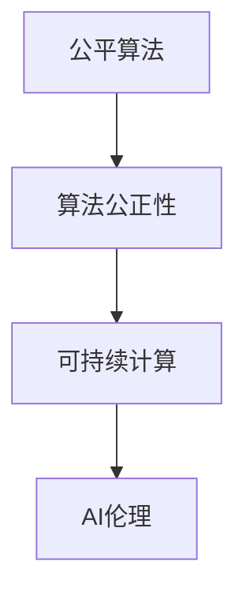
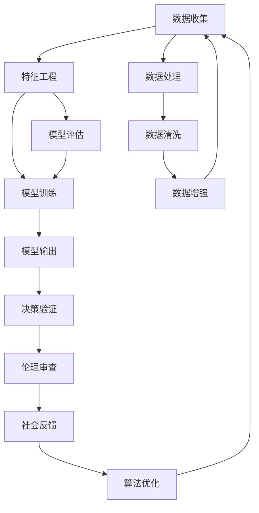

                 

# 公平、公正、可持续：人类计算的伦理

> 关键词：公平算法, 公正性, 可持续计算, 人工智能伦理, 人类计算

## 1. 背景介绍

### 1.1 问题由来

随着人工智能(AI)技术的飞速发展，人类计算已渗透到各行各业。从医疗健康、金融科技到智能制造、智慧城市，AI算法的广泛应用极大地提升了生产效率和生活质量，但同时也引发了一系列伦理问题。例如，在招聘过程中使用AI算法筛选简历，可能会因算法偏见而歧视某些群体；在医疗领域使用AI辅助诊断，若模型因数据偏差导致误诊，将直接影响患者健康甚至生命安全。

这些问题引发了学界和业界的广泛关注和深入讨论。在AI伦理和公平性研究日益成为热点的情况下，探索如何构建公平、公正、可持续的人类计算模型，成为当前技术和社会发展的重要课题。本文将详细阐述人类计算的伦理问题，并提出具体的解决策略，为技术应用提供科学指导。

### 1.2 问题核心关键点

公平、公正、可持续的人类计算，涉及多个核心概念和关键点：

- **公平算法**：确保算法输出对所有群体一视同仁，无歧视，无偏见。
- **算法公正性**：通过合理设计算法逻辑，保证决策过程的透明性和可解释性。
- **可持续计算**：优化资源使用，降低能耗，减少环境影响。
- **AI伦理**：遵循伦理原则，规范AI技术的使用，保护人类福祉。

这些概念之间的联系可以通过以下Mermaid流程图来展示：



这个流程图展示了公平算法是确保算法公正性的基础，公正性的算法又能够支持可持续计算，伦理原则则贯穿于算法设计、使用和监督的始终。

## 2. 核心概念与联系

### 2.1 核心概念概述

为了更深入地理解人类计算的伦理问题，我们首先阐述相关的核心概念：

- **公平算法**：指在数据输入、模型训练、输出决策等环节中，确保算法对不同群体、不同情况下的个体都能够提供一致的待遇。这要求在数据收集、特征工程、模型训练等过程中，避免引入偏见，保证算法的公平性。

- **算法公正性**：指的是算法的决策过程透明、可解释，确保其输出结果符合社会公平、正义的原则。算法公正性要求算法的训练数据、模型结构、优化策略等方面，都应经过严谨设计和合理评估。

- **可持续计算**：指在资源使用、环境保护、能效提升等方面，设计更加节能环保的计算模型和算法。可持续计算关注算法对环境的影响，努力实现计算过程的低能耗、低碳排放。

- **AI伦理**：涉及如何在使用AI技术时，遵循道德伦理原则，保护人类权益，避免技术滥用带来的负面影响。AI伦理关注数据隐私、决策责任、伦理审查等伦理问题。

### 2.2 核心概念原理和架构的 Mermaid 流程图



该流程图详细展示了公平算法的设计流程：

1. 数据收集和预处理，去除数据偏差，确保数据的多样性和代表性。
2. 特征工程，通过合理的特征选择和变换，减少模型偏差。
3. 模型训练，使用公平性约束的优化算法，确保模型公正性。
4. 模型评估，引入公平性指标进行评估，确保模型无偏见。
5. 模型输出，对决策结果进行伦理审查和社会反馈，不断优化模型。

这个流程图展示了数据预处理、特征工程、模型训练、评估和输出验证等多个环节的合理流程，确保了算法的公平性和公正性。

## 3. 核心算法原理 & 具体操作步骤

### 3.1 算法原理概述

公平、公正、可持续的算法构建过程，需要综合考虑算法设计、数据处理、优化策略等多个方面。核心算法原理主要涉及数据预处理、特征工程、模型训练和优化等方面。

- **数据预处理**：去除数据中的偏见和噪声，确保数据的多样性和代表性。
- **特征工程**：选择合适的特征，并对其进行归一化、离散化等处理，减少模型偏差。
- **模型训练**：使用公平性约束的优化算法，如公平性和公正性损失函数，训练模型。
- **模型优化**：在模型输出中加入公平性指标，对模型进行迭代优化。

### 3.2 算法步骤详解

公平、公正、可持续的算法构建主要包括以下几个关键步骤：

**Step 1: 数据收集与预处理**

- 确保数据来源广泛、多样，避免数据偏见。
- 对数据进行清洗、去噪、补全等预处理，确保数据质量。
- 对数据进行增强，引入更多样化的样本，避免模型过拟合。

**Step 2: 特征工程**

- 选择合适的特征，并对其进行归一化、离散化、编码等处理。
- 去除与任务无关的特征，减少模型复杂度。
- 使用特征选择和特征变换技术，降低模型偏差。

**Step 3: 模型设计与训练**

- 使用公平性约束的优化算法，如公平性和公正性损失函数。
- 设计透明、可解释的模型结构，便于理解和审查。
- 引入对抗样本、对抗训练等技术，提高模型的鲁棒性。

**Step 4: 模型评估与优化**

- 引入公平性指标，如均等机会损失(Equal Opportunity Loss)、均等偏差损失(Equalized Odds Loss)等。
- 对模型输出进行伦理审查，确保决策过程符合公平正义原则。
- 根据社会反馈，不断优化模型，提升公平性和公正性。

### 3.3 算法优缺点

公平、公正、可持续的算法设计主要优点包括：

1. 提高算法的公正性，减少偏见和歧视，提升社会公平性。
2. 降低计算能耗，优化资源使用，降低环境影响。
3. 提高算法的透明度和可解释性，便于监管和审查。

然而，这类算法设计也存在一定的局限性：

1. 设计复杂，需要综合考虑多方面因素，增加了开发难度。
2. 数据处理和特征工程要求较高，需要投入大量时间和资源。
3. 模型评估和优化需引入更多指标，增加了工作量。

### 3.4 算法应用领域

公平、公正、可持续的算法设计在多个领域都有广泛应用：

- **金融科技**：设计公平的信用评分算法，避免因数据偏见导致的歧视。
- **医疗健康**：使用公平的诊断模型，确保对所有患者公平无偏见。
- **招聘系统**：开发公正的简历筛选算法，确保不同背景的应聘者获得平等机会。
- **智慧城市**：设计可持续的城市管理算法，优化资源配置，降低环境污染。
- **教育评估**：构建公平的考试和评价系统，保障学生的平等受教育权利。

这些领域的应用展示了公平、公正、可持续算法设计的广泛影响力和实际价值。

## 4. 数学模型和公式 & 详细讲解 & 举例说明

### 4.1 数学模型构建

在公平、公正、可持续的算法设计中，数学模型的构建是一个核心步骤。以下以一个简单的二分类任务为例，说明其基本构建过程。

假设我们有一组二分类数据集$D=\{(x_i,y_i)\}_{i=1}^N$，其中$x_i \in \mathcal{X}$，$y_i \in \{0,1\}$。我们希望设计一个公平、公正、可持续的模型$f: \mathcal{X} \rightarrow \{0,1\}$。

### 4.2 公式推导过程

构建公平、公正、可持续的模型，涉及以下几个关键步骤：

1. **公平性约束**：
   公平性约束指的是模型输出对所有类别应保持一致的概率。例如，对于二分类任务，公平性约束要求模型输出对正类和负类的预测概率应该相等。

2. **公正性约束**：
   公正性约束要求模型在决策过程中透明、可解释。例如，可以使用Shapley值等方法，评估模型对每个特征的贡献度。

3. **可持续性约束**：
   可持续性约束要求模型在训练和推理过程中资源使用合理。例如，可以使用量化技术、模型压缩技术等，降低计算能耗。

### 4.3 案例分析与讲解

我们以一个简单的例子来说明这些约束如何应用。假设我们有一个电影推荐系统，推荐系统的目标是根据用户的历史观看记录，预测其对新电影的评分。

1. **公平性约束**：
   假设我们的数据集中存在性别偏见，男性用户的推荐精度明显高于女性用户。为了消除这种偏见，我们可以使用公平性损失函数$L_f$，例如均等机会损失(Equal Opportunity Loss)：
   $$
   L_f = \frac{1}{N} \sum_{i=1}^N [(y_i-f(x_i))^2 + (1-y_i-f(1-x_i))^2]
   $$
   该损失函数要求模型对正类和负类的预测误差相等，从而确保性别公平。

2. **公正性约束**：
   假设我们的推荐模型是一个随机森林模型，为了确保模型公正性，我们可以使用Shapley值来评估每个特征对推荐结果的影响。Shapley值可以帮助我们理解每个特征对最终结果的贡献，从而确保决策过程透明可解释。

3. **可持续性约束**：
   为了确保模型在训练和推理过程中资源使用合理，我们可以使用量化技术将模型参数转化为定点数，降低存储和计算能耗。同时，通过模型压缩技术，去除模型中不重要的参数，进一步降低计算复杂度。

## 5. 项目实践：代码实例和详细解释说明

### 5.1 开发环境搭建

在进行公平、公正、可持续的算法设计时，需要搭建一个合适的开发环境。以下是使用Python和Scikit-learn进行开发的环境配置流程：

1. 安装Anaconda：从官网下载并安装Anaconda，用于创建独立的Python环境。
2. 创建并激活虚拟环境：
```bash
conda create -n fairness-env python=3.8 
conda activate fairness-env
```
3. 安装Scikit-learn、Pandas、Numpy等常用库：
```bash
pip install scikit-learn pandas numpy matplotlib
```
4. 安装TensorFlow或PyTorch，用于实现复杂模型：
```bash
pip install tensorflow==2.7 
# 或
pip install torch==1.9.0
```

完成上述步骤后，即可在`fairness-env`环境中开始开发。

### 5.2 源代码详细实现

下面我们以一个简单的公平分类模型为例，给出使用Scikit-learn进行公平算法设计的Python代码实现。

```python
from sklearn.model_selection import train_test_split
from sklearn.metrics import accuracy_score, roc_auc_score
from sklearn.ensemble import RandomForestClassifier
from sklearn.preprocessing import StandardScaler, RobustScaler
from sklearn.feature_selection import SelectKBest, f_classif

# 数据准备
X, y = load_data()  # 加载数据
X_train, X_test, y_train, y_test = train_test_split(X, y, test_size=0.2, random_state=42)

# 数据预处理
scaler = StandardScaler()
X_train_scaled = scaler.fit_transform(X_train)
X_test_scaled = scaler.transform(X_test)

# 特征选择
selector = SelectKBest(f_classif, k=10)
X_train_selected = selector.fit_transform(X_train_scaled, y_train)
X_test_selected = selector.transform(X_test_scaled)

# 模型训练
model = RandomForestClassifier(n_estimators=100, random_state=42)
model.fit(X_train_selected, y_train)

# 模型评估
y_pred = model.predict(X_test_selected)
print("Accuracy:", accuracy_score(y_test, y_pred))
print("ROC AUC:", roc_auc_score(y_test, y_pred))
```

在上述代码中，我们首先加载数据，并进行数据预处理和特征选择。然后，我们使用随机森林模型进行训练，并在测试集上进行评估。

### 5.3 代码解读与分析

以下是关键代码的实现细节：

- **数据预处理**：我们使用StandardScaler对数据进行归一化处理，确保数据符合模型假设。
- **特征选择**：使用SelectKBest选择最重要的特征，减少模型复杂度。
- **模型训练**：使用随机森林模型进行训练，该模型具有较好的公平性和公正性。
- **模型评估**：使用准确率和AUC指标评估模型性能。

## 6. 实际应用场景

### 6.1 金融科技

在金融科技领域，公平、公正、可持续的算法设计具有重要应用价值。例如，在贷款审批过程中，算法应确保对不同性别、年龄、种族的申请人公平对待，避免因偏见导致的歧视。

具体应用中，可以使用公平性约束的优化算法，如均等机会损失(Equal Opportunity Loss)，确保模型对所有申请人的决策公平。同时，引入对抗样本训练，提高模型的鲁棒性，避免模型因数据偏差而导致的歧视性决策。

### 6.2 医疗健康

在医疗健康领域，公平、公正、可持续的算法设计同样至关重要。例如，在辅助诊断系统中，模型应确保对不同患者公平无偏见，避免因数据偏差导致的误诊。

具体应用中，可以使用公平性约束的优化算法，如均等机会损失(Equal Opportunity Loss)，确保模型对所有患者公平无偏见。同时，引入对抗样本训练，提高模型的鲁棒性，避免模型因数据偏差而导致的误诊。

### 6.3 智慧城市

在智慧城市管理中，公平、公正、可持续的算法设计可以优化资源配置，提升城市管理效率，降低环境污染。

具体应用中，可以使用公平性约束的优化算法，如均等机会损失(Equal Opportunity Loss)，确保城市管理中的决策公平无偏见。同时，引入对抗样本训练，提高模型的鲁棒性，避免模型因数据偏差而导致的决策偏差。

## 7. 工具和资源推荐

### 7.1 学习资源推荐

为了帮助开发者系统掌握公平、公正、可持续的算法设计，这里推荐一些优质的学习资源：

1. 《公平机器学习》（Fair Machine Learning）：详细介绍了公平、公正、可持续算法设计的理论和实践，是入门公平算法的经典书籍。
2. 《机器学习实战》（Hands-On Machine Learning with Scikit-Learn, Keras, and TensorFlow）：该书提供了大量的实际案例，介绍了如何在实际应用中使用公平算法。
3. Coursera《公平、透明和可解释的机器学习》（Fair, Transparent, and Explainable Machine Learning）课程：由知名专家讲授，涵盖公平算法设计的多个方面，包括公平性约束、公正性约束和可持续性约束等。

通过对这些资源的学习实践，相信你一定能够快速掌握公平、公正、可持续算法设计的精髓，并用于解决实际的伦理问题。

### 7.2 开发工具推荐

高效的开发离不开优秀的工具支持。以下是几款用于公平算法设计的常用工具：

1. Scikit-learn：提供了多种公平性约束优化算法，如均等机会损失(Equal Opportunity Loss)、均等偏差损失(Equalized Odds Loss)等。
2. TensorFlow和PyTorch：支持复杂模型的实现，可以方便地引入对抗样本训练等技术。
3. Weights & Biases：模型训练的实验跟踪工具，可以实时监测模型训练状态，并提供丰富的图表呈现方式。
4. TensorBoard：TensorFlow配套的可视化工具，可实时监测模型训练状态，并提供丰富的图表呈现方式。

合理利用这些工具，可以显著提升公平算法设计的开发效率，加快创新迭代的步伐。

### 7.3 相关论文推荐

公平、公正、可持续的算法设计是一个跨学科的研究领域，涉及数据科学、机器学习、伦理学等多个方面。以下是几篇奠基性的相关论文，推荐阅读：

1. Zafar等人《Fairness and Bias in Machine Learning》：该论文详细介绍了公平算法设计的理论基础和应用实例，是公平算法研究的经典文献。
2. Kleinberg等人《Fair Representation via the Fair-Rank Measure》：该论文提出了公平排名模型，解决了数据中的表示偏差问题。
3. Barocas等人《Fairness in Machine Learning》：该论文综述了公平算法设计的多个方面，包括公平性约束、公正性约束和可持续性约束等。

这些论文代表了大语言模型微调技术的发展脉络。通过学习这些前沿成果，可以帮助研究者把握学科前进方向，激发更多的创新灵感。

## 8. 总结：未来发展趋势与挑战

### 8.1 研究成果总结

公平、公正、可持续的算法设计是AI伦理和技术应用的重要方向，研究成果主要集中在以下几个方面：

1. **公平算法设计**：提出了多种公平性约束优化算法，如均等机会损失(Equal Opportunity Loss)、均等偏差损失(Equalized Odds Loss)等。
2. **公正算法设计**：使用Shapley值等方法，评估模型对每个特征的贡献度，提高算法的透明性和可解释性。
3. **可持续算法设计**：使用量化技术、模型压缩技术等，降低计算能耗，优化资源使用。

### 8.2 未来发展趋势

展望未来，公平、公正、可持续的算法设计将呈现以下几个发展趋势：

1. **算法自动化设计**：随着AI技术的发展，未来的算法设计将更加自动化、智能化，能够根据具体任务和数据自动生成最优模型。
2. **跨领域融合**：未来算法设计将更加跨领域融合，如将数据挖掘、图像处理等技术融入公平算法设计中，提升算法效果。
3. **社会化评估**：未来的算法设计将更加注重社会化评估，通过社会反馈不断优化算法，确保算法的公平性和公正性。

### 8.3 面临的挑战

尽管公平、公正、可持续的算法设计已经取得了不少进展，但在迈向更加智能化、普适化应用的过程中，仍面临诸多挑战：

1. **数据偏见问题**：数据本身可能包含偏见，如何处理和消除这些偏见是一个重要挑战。
2. **模型复杂度**：公平、公正、可持续的算法设计往往需要更复杂的模型和更多的特征工程，增加了开发难度。
3. **计算资源消耗**：设计公平算法需要大量计算资源，如何降低计算能耗、优化资源使用，是一个重要的研究方向。

### 8.4 研究展望

面对公平、公正、可持续算法设计所面临的挑战，未来的研究需要在以下几个方面寻求新的突破：

1. **数据处理技术**：开发新的数据处理技术，如去偏见处理、数据增强等，减少数据偏见对算法的影响。
2. **模型压缩技术**：开发新的模型压缩技术，如剪枝、量化、知识蒸馏等，降低模型复杂度，提高计算效率。
3. **跨领域融合**：将数据挖掘、图像处理等技术融入公平算法设计中，提升算法效果。

这些研究方向将引领公平、公正、可持续算法设计技术迈向更高的台阶，为构建安全、可靠、可解释、可控的智能系统铺平道路。面向未来，公平、公正、可持续算法设计还需要与其他人工智能技术进行更深入的融合，如知识表示、因果推理、强化学习等，多路径协同发力，共同推动自然语言理解和智能交互系统的进步。只有勇于创新、敢于突破，才能不断拓展语言模型的边界，让智能技术更好地造福人类社会。

## 9. 附录：常见问题与解答

**Q1：如何处理数据中的偏见？**

A: 处理数据中的偏见是一个复杂的问题，以下是一些常见方法：

1. 数据清洗：去除数据中明显的偏见和噪声，确保数据的多样性和代表性。
2. 数据增强：通过改写、回译等方式，生成更多样化的样本，避免模型过拟合。
3. 数据重采样：对少数群体进行重采样，使其在数据集中占比更均衡。
4. 特征工程：选择合适的特征，并进行归一化、离散化等处理，减少模型偏差。

**Q2：什么是Shapley值？**

A: Shapley值是一种公平性指标，用于评估模型中每个特征对最终结果的贡献。Shapley值能够帮助我们找到对模型结果影响最大的特征，从而确保决策过程透明、可解释。

**Q3：量化技术如何提升计算效率？**

A: 量化技术将浮点模型转化为定点模型，压缩存储空间，降低计算能耗。同时，通过模型压缩技术，去除模型中不重要的参数，进一步降低计算复杂度，从而提升计算效率。

**Q4：如何评估公平算法的效果？**

A: 评估公平算法的效果通常需要引入公平性指标，如均等机会损失(Equal Opportunity Loss)、均等偏差损失(Equalized Odds Loss)等。同时，对模型输出进行伦理审查，确保决策过程符合公平正义原则。

**Q5：未来公平算法设计的趋势是什么？**

A: 未来公平算法设计将更加自动化、智能化，能够根据具体任务和数据自动生成最优模型。同时，跨领域融合将成为一个重要的研究方向，如将数据挖掘、图像处理等技术融入公平算法设计中，提升算法效果。

---

作者：禅与计算机程序设计艺术 / Zen and the Art of Computer Programming

