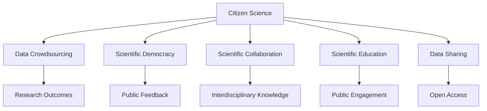

                 

# 公民科学：公众参与科学研究的新模式

> 关键词：公民科学,科学民主化,数据共享,众包,科学合作,科学教育

## 1. 背景介绍

### 1.1 问题由来
近年来，科学研究正经历着前所未有的变革。随着信息技术的发展，数据生成和存储的能力空前提高，与此同时，传统学术体系与公众的隔阂也日益凸显。公众对科学研究的关注和参与度愈发高涨，但科学界的沟通、数据分享机制尚未能与之匹配。公众的智慧和力量未能被充分利用，而科学研究的普及性和民主性也未能充分体现。

公民科学（Citizen Science）正是顺应这一趋势而发展起来的科学研究新模式。它鼓励公众参与科研过程，收集、处理和分析数据，甚至提出假设和验证结果。通过这种方式，科学研究的成果和过程得以民主化，科研数据和知识得以广泛传播和共享，公众也从科学发展的受益者转化为积极参与者。

### 1.2 问题核心关键点
公民科学的核心在于激发公众的科学兴趣，充分利用其智慧和资源，使其成为科学研究的重要组成部分。主要关键点包括：

1. **数据收集与共享**：公民科学强调数据的广泛收集和开放共享，充分利用公众的观测和实验数据。
2. **公众参与与教育**：鼓励公众参与科学研究，提升科学素养，培养科研兴趣。
3. **科学普及与交流**：将科研成果通过公众平台公开展示，促进科学知识的普及与交流。
4. **多样性和包容性**：突破传统科研体系，包容不同背景的科研参与者，促进科研多样性。
5. **持续性与动态性**：鼓励长期持续的数据收集与分析，保持科研过程的动态更新。

这些关键点共同构成公民科学的核心，旨在打造一个公众与科研人员共同探索未知世界的平台。

## 2. 核心概念与联系

### 2.1 核心概念概述

为更好地理解公民科学的概念和机制，本节将介绍几个密切相关的核心概念：

- **公民科学**：公众在科研中扮演积极角色，通过收集数据、设计实验、验证结果等方式参与科学发现和创新过程。
- **数据众包**：利用众包平台集聚公众数据，通过众包方式收集科学数据。
- **科学民主化**：科研成果和过程对公众开放，通过公众评审和反馈来改进科研过程。
- **科学合作**：跨学科、跨领域的科研合作，打破科研壁垒，促进知识流动。
- **科学教育**：通过实际参与科研，提升公众的科学知识和素养，培养科研兴趣。
- **数据共享**：科研成果和科研数据公开共享，促进科研的透明化和可复现性。

这些核心概念之间的逻辑关系可以通过以下Mermaid流程图来展示：



这个流程图展示出公民科学的主要组成模块及其相互关系：

1. **数据收集**：公民科学依托数据众包，广泛收集科学数据。
2. **科研民主**：通过科学民主化，科研成果和过程对公众开放，提升公众参与度。
3. **跨领域合作**：科研合作促进跨学科知识的融合和创新。
4. **科学教育**：通过公众参与科研，提升公众科学素养。
5. **数据共享**：科研成果和数据开放共享，促进科研透明度和可复现性。

这些模块共同构成公民科学的整体架构，为公众参与科研提供了坚实的支持。

## 3. 核心算法原理 & 具体操作步骤

### 3.1 算法原理概述

公民科学的核心算法原理主要基于以下三点：

1. **数据收集算法**：通过众包平台和协作网络，将公众的观测数据和实验数据收集起来，进行初步处理和清洗。
2. **数据融合算法**：将不同来源的数据进行融合，消除噪音和冗余，形成高质量的数据集。
3. **结果验证算法**：设计简单的实验和验证过程，让公众参与到结果的验证和修正中来。

整个公民科学的数据流程可以简要概括为数据收集、数据融合和结果验证三个阶段，其核心在于公众的广泛参与和贡献。

### 3.2 算法步骤详解

公民科学的算法步骤大致可以分为以下几部分：

1. **平台搭建**：建立科学数据收集和共享的平台，提供在线工具和界面，支持公众上传数据。
2. **数据标准化**：制定数据格式和标准化规则，确保不同来源的数据可以互相兼容和整合。
3. **任务设计**：设计适合公众参与的科研任务，如数据收集、实验设计等。
4. **数据审核**：对收集到的数据进行初步审核，去除明显错误和不完整数据。
5. **数据融合**：采用数据融合算法，将审核后的数据进行整合，生成高质量的数据集。
6. **结果验证**：设计简单易行的实验或验证方法，让公众参与验证结果，提出改进意见。
7. **模型训练**：利用公众数据和反馈，训练机器学习模型，提升科研分析能力。
8. **成果分享**：将研究成果和数据公开分享，促进科学知识的普及和交流。

### 3.3 算法优缺点

公民科学的优点主要在于其广泛性和民主性：

1. **广泛性**：充分利用公众的智慧和资源，涵盖更多数据源，增强科研结果的代表性和全面性。
2. **民主性**：科研成果和过程对公众开放，提升科研透明度和公众参与度。

但同时也存在一些缺点：

1. **数据质量参差不齐**：公众数据质量可能不如专业科研数据，需进行严格筛选和清洗。
2. **分析复杂性增加**：不同背景的公众数据需进行不同处理，增加了数据融合和分析的复杂性。
3. **结果可重复性问题**：结果验证可能存在主观性，影响结果的可重复性。

### 3.4 算法应用领域

公民科学广泛应用于各类科研领域，如生物多样性监测、气象观测、天文观测、环境监测等。以下是几个典型应用示例：

1. **生物多样性监测**：利用手机应用收集公众的野生动植物照片和记录，进行物种识别和数量统计。
2. **气候变化研究**：通过众包平台收集公众的气象观测数据，进行气候变化趋势分析。
3. **天文观测**：利用在线平台收集公众的天文观测数据，进行天体运动和星象研究。
4. **环境监测**：通过环境监测设备收集公众的空气、水质数据，评估环境健康状况。

## 4. 数学模型和公式 & 详细讲解 & 举例说明

### 4.1 数学模型构建

公民科学的数学模型主要建立在数据分析和机器学习的基础之上。假设公众收集的数据集为 $D=\{(x_i, y_i)\}_{i=1}^N$，其中 $x_i$ 为观测值，$y_i$ 为标签。设 $f(x; \theta)$ 为拟合模型，$\theta$ 为模型参数。公民科学的数学模型目标是最小化损失函数 $\mathcal{L}(\theta)$，即：

$$
\theta^* = \mathop{\arg\min}_{\theta} \mathcal{L}(f(x; \theta), y)
$$

常见的损失函数包括均方误差（MSE）、交叉熵（CE）等。

### 4.2 公式推导过程

以均方误差（MSE）为例，公式推导如下：

设 $f(x; \theta)$ 为线性回归模型，则：

$$
y_i = f(x_i; \theta) + \epsilon_i
$$

其中 $\epsilon_i$ 为噪声项。均方误差损失函数为：

$$
\mathcal{L}(\theta) = \frac{1}{N} \sum_{i=1}^N (y_i - f(x_i; \theta))^2
$$

对 $\theta$ 求导，得到梯度：

$$
\nabla_{\theta} \mathcal{L}(\theta) = \frac{1}{N} \sum_{i=1}^N -2(x_i - \bar{x})(y_i - f(x_i; \theta))
$$

利用梯度下降等优化算法，最小化损失函数即可得到最优参数 $\theta^*$。

### 4.3 案例分析与讲解

**案例：基于公民科学的植物多样性研究**

假设有一个公众平台，收集公众提交的野生植物照片和位置信息。平台需要对这些数据进行处理和分析，以评估某一区域内的植物多样性。

1. **数据收集**：平台通过手机应用收集公众上传的照片和位置信息，存储在数据库中。
2. **数据清洗**：对数据进行初步筛选，去除噪声和不完整信息，如模糊照片、错误位置等。
3. **数据标准化**：对位置信息进行标准化处理，如转换为经纬度坐标，对照片进行尺寸调整。
4. **模型训练**：利用标准化后的数据集，训练植物识别模型，识别照片中的植物种类。
5. **结果验证**：设计简单的实验，让公众验证识别结果，提出改进意见。
6. **分析报告**：根据验证结果，生成植物多样性分析报告，提交给科研机构和公众共享。

## 5. 项目实践：代码实例和详细解释说明

### 5.1 开发环境搭建

在进行公民科学项目开发前，我们需要准备好开发环境。以下是使用Python进行Flask框架开发的环境配置流程：

1. 安装Anaconda：从官网下载并安装Anaconda，用于创建独立的Python环境。
2. 创建并激活虚拟环境：
```bash
conda create -n citizen-sci-dev python=3.8 
conda activate citizen-sci-dev
```
3. 安装Flask：
```bash
pip install flask
```
4. 安装必要的库：
```bash
pip install requests numpy pandas sklearn
```
完成上述步骤后，即可在`citizen-sci-dev`环境中开始开发公民科学项目。

### 5.2 源代码详细实现

以下是一个简单的公民科学数据收集平台的Flask应用实现：

```python
from flask import Flask, request, jsonify
import requests
import numpy as np
import pandas as pd
from sklearn.model_selection import train_test_split
from sklearn.linear_model import LinearRegression

app = Flask(__name__)

@app.route('/upload_data', methods=['POST'])
def upload_data():
    data = request.json
    photos = data['photos']
    locations = data['locations']
    return jsonify({'status': 'success'})

@app.route('/train_model', methods=['GET'])
def train_model():
    # 加载上传的数据集
    df = pd.read_csv('data.csv')
    X = df[['location', 'elevation', 'temperature', 'humidity']]
    y = df['plantspecies']
    X_train, X_test, y_train, y_test = train_test_split(X, y, test_size=0.2, random_state=42)
    # 训练线性回归模型
    model = LinearRegression()
    model.fit(X_train, y_train)
    # 返回模型参数
    return jsonify({'theta': model.coef_.tolist()})

if __name__ == '__main__':
    app.run(debug=True)
```

这个Flask应用包含两个API接口：`/upload_data`用于上传数据，`/train_model`用于训练模型。

1. **`/upload_data`**：接收公众上传的数据，包括照片和位置信息。
2. **`/train_model`**：加载上传的数据集，训练线性回归模型，并返回模型参数。

### 5.3 代码解读与分析

让我们再详细解读一下关键代码的实现细节：

**`/upload_data`函数**：
- `request.json`：接收JSON格式的数据。
- `photos`和`locations`：分别获取上传的植物照片和位置信息。
- `jsonify`：将响应数据转换为JSON格式。

**`/train_model`函数**：
- `pd.read_csv('data.csv')`：从数据文件中读取数据集。
- `train_test_split`：将数据集划分为训练集和测试集。
- `LinearRegression`：使用线性回归模型。
- `model.fit(X_train, y_train)`：训练模型。
- `jsonify`：将模型参数转换为JSON格式。

**数据文件`data.csv`**：
- 包含上传的植物照片和位置信息。
- 格式为CSV，每行包含照片、位置、植物种类等字段。

### 5.4 运行结果展示

运行上述Flask应用，可以通过访问`http://localhost:5000/upload_data`上传数据，访问`http://localhost:5000/train_model`获取模型参数。开发完成后，可以将应用部署到云端服务器或云平台，如AWS、Google Cloud等，以支持公众数据的上传和处理。

## 6. 实际应用场景

### 6.1 生物多样性监测

生物多样性监测是公民科学的一个重要应用场景。通过收集公众提交的野生动植物观测数据，科研机构可以评估和监测特定区域的生物多样性变化趋势。

实际应用中，公众可以通过手机应用或网站提交观测数据，包括物种种类、数量、时间和位置等信息。科研人员将这些数据汇总并分析，形成生物多样性报告，用于生态保护和环境保护的决策支持。

### 6.2 气候变化研究

气候变化研究也需要大量观测数据，尤其是气象数据。公众通过气象站或个人设备收集气象观测数据，如温度、湿度、风速、降水等，上传到公民科学平台，进行数据融合和分析。

科研人员可以利用这些数据，结合历史气象数据和模型预测，评估气候变化趋势和极端气候事件的频次，为政策制定和灾害应对提供科学依据。

### 6.3 天文观测

天文学观测需要大量的天文数据，公众可以通过望远镜或相机收集天文观测数据，上传到公民科学平台。这些数据可以帮助科研人员进行天文现象的观测和分析，如星系运动、恒星演化等。

通过公民科学的方式，公众参与天文观测，不仅提升了科研数据的丰富性，还激发了公众对天文学的兴趣和参与感。

## 7. 工具和资源推荐

### 7.1 学习资源推荐

为了帮助开发者系统掌握公民科学的相关技术，这里推荐一些优质的学习资源：

1. **《Citizen Science: Harnessing Public Participation for Research》**：一本详细介绍公民科学理论和实践的书籍，适合深入学习。
2. **Coursera上的“Crowdsourcing Data in Science”课程**：由斯坦福大学开设，介绍了如何通过众包方式收集科学数据。
3. **Kaggle上的“Citizen Science Projects”**：Kaggle平台上收集和分析公民科学项目数据，实践案例丰富。
4. **Open Science Framework（OSF）**：一个开放科学社区平台，提供科研项目管理和数据共享服务。

通过这些资源的学习实践，相信你一定能够快速掌握公民科学的核心技术和实践方法。

### 7.2 开发工具推荐

高效的开发离不开优秀的工具支持。以下是几款用于公民科学项目开发的常用工具：

1. **Flask**：一个轻量级的Web框架，适合快速开发API接口。
2. **TensorFlow**：一个强大的机器学习框架，支持各种复杂模型的训练。
3. **Jupyter Notebook**：一个交互式编程环境，适合数据处理和模型训练。
4. **GitHub**：一个代码托管平台，适合版本控制和协作开发。
5. **Docker**：一个容器化技术，适合部署和运维应用。

合理利用这些工具，可以显著提升公民科学项目的开发效率，加快创新迭代的步伐。

### 7.3 相关论文推荐

公民科学是一个新兴的研究方向，近年来得到了广泛关注和深入研究。以下是几篇奠基性的相关论文，推荐阅读：

1. **“Crowdsourced Biodiversity Data Synthesize Ecological Insights”**：研究了公众数据在生态学研究中的应用，展示了公民科学项目对科研的贡献。
2. **“Citizen Science: Integrating the Public in Scientific Research”**：探讨了公民科学的理论基础和实际应用，提供了丰富的案例分析。
3. **“The role of citizen science in research and policy-making”**：分析了公民科学在政策制定和科学决策中的作用，强调了公众参与的重要性。

这些论文代表了大规模公民科学项目的最新研究进展，有助于理解公民科学的理论和实践。

## 8. 总结：未来发展趋势与挑战

### 8.1 总结

本文对公民科学的概念、原理和实践进行了全面系统的介绍。首先阐述了公民科学的背景和意义，明确了公民科学在提升公众参与度和科研透明性方面的独特价值。其次，从算法原理到具体实践，详细讲解了公民科学的数学模型和操作步骤，给出了具体的代码实例和分析。同时，本文还广泛探讨了公民科学在生物多样性监测、气候变化研究、天文观测等实际应用场景中的应用前景，展示了公民科学技术的广泛潜力和发展方向。

通过本文的系统梳理，可以看到，公民科学为公众参与科研提供了新的途径，充分调动了公众的智慧和资源，推动了科研的民主化和透明化。未来，公民科学将在更多领域得到应用，成为科学研究不可或缺的重要组成部分。

### 8.2 未来发展趋势

展望未来，公民科学将呈现以下几个发展趋势：

1. **技术成熟度提升**：随着数据处理和机器学习技术的进步，公民科学的算法和工具将更加成熟，数据融合和分析能力将显著提升。
2. **平台和社区建设**：更多专注于公民科学的平台和社区将涌现，提供一站式的数据收集、分析和共享服务。
3. **跨学科融合**：公民科学将与更多学科（如生物学、气象学、天文学等）融合，形成更加全面和深入的科研体系。
4. **公众参与度增强**：通过更多互动和激励机制，激发公众的科学兴趣和参与热情。
5. **全球化协作**：跨国和跨文化的公民科学项目将增多，促进全球科学知识的共享和协作。

这些趋势将推动公民科学从概念走向实践，成为科学研究中不可或缺的一部分。

### 8.3 面临的挑战

尽管公民科学潜力巨大，但在实现其大规模应用的过程中，仍面临诸多挑战：

1. **数据质量管理**：公众数据的质量和可靠性难以保证，需建立严格的数据审核机制。
2. **技术门槛降低**：提高数据收集和分析的易用性和普适性，降低技术门槛。
3. **隐私保护**：确保公众数据的隐私和安全，避免数据滥用。
4. **结果可信度**：保证公众参与结果的科学性和可信度，避免误导性信息传播。
5. **公众参与激励**：设计有效的激励机制，提升公众参与的积极性和持久性。

这些挑战需要科研机构、技术公司和政策制定者共同努力，才能实现公民科学的可持续发展。

### 8.4 研究展望

面对公民科学面临的挑战，未来的研究需要在以下几个方面寻求新的突破：

1. **数据质量管理**：开发高效的数据审核和清洗算法，提高公众数据的可靠性。
2. **技术普及与普适性**：降低技术门槛，提供简单易用的数据收集和分析工具。
3. **隐私保护与伦理考量**：设计隐私保护机制，确保数据使用的合法性和伦理性。
4. **结果验证与可信度**：建立结果验证机制，保证公众参与结果的科学性和可信度。
5. **激励机制设计**：设计有效的激励机制，提升公众参与的积极性和持久性。

这些研究方向的探索将推动公民科学技术的不断进步，为公众参与科研提供更高效、透明和安全的平台。面向未来，公民科学将成为科学研究中不可或缺的一部分，助力人类探索未知世界的旅程。

## 9. 附录：常见问题与解答

**Q1：公民科学如何确保数据的质量和可靠性？**

A: 确保数据质量和可靠性是公民科学项目的关键。以下是几种常见的方法：

1. **数据审核**：设置数据审核机制，人工或自动审核数据质量。
2. **数据清洗**：对数据进行初步清洗，去除噪音和冗余信息。
3. **多源数据融合**：将不同来源的数据进行融合，提高数据的一致性和准确性。
4. **模型验证**：使用机器学习模型验证数据的真实性，如通过分类器判断数据是否符合标准。
5. **公众反馈**：设计简单易行的实验，让公众参与数据验证，提出改进意见。

这些方法可以综合应用，确保公众数据的可靠性和准确性。

**Q2：如何设计有效的激励机制，提升公众参与度？**

A: 设计有效的激励机制是提升公众参与度的重要手段。以下是几种常见的方法：

1. **物质奖励**：如现金奖励、实物礼品等，激励公众提交更多高质量数据。
2. **荣誉奖励**：如公开表彰、奖励证书等，提升公众的荣誉感和参与感。
3. **教育激励**：通过科普讲座、竞赛活动等方式，提升公众的科学素养。
4. **社区互动**：建立公众社区，鼓励公众之间的交流和协作，增强参与热情。

这些激励机制需要根据公众的兴趣和需求进行灵活设计，激发公众的积极性和持久性。

**Q3：公民科学在数据隐私和安全方面需要注意什么？**

A: 公民科学项目需要在数据隐私和安全方面进行严格管理和保护。以下是几种常见的方法：

1. **数据匿名化**：去除个人身份信息，保护用户隐私。
2. **访问控制**：设置严格的访问权限，确保只有授权人员可以访问敏感数据。
3. **数据加密**：对数据进行加密处理，防止数据泄露。
4. **合规检查**：确保数据处理和使用的合规性，遵守相关法律法规。
5. **数据删除**：设置数据删除机制，用户可以随时撤回上传的数据。

这些方法可以综合应用，确保公众数据的安全和隐私保护。

**Q4：公民科学如何在跨学科融合中发挥作用？**

A: 公民科学在跨学科融合中具有独特优势，可以连接不同领域的科研人员和数据资源。以下是几种常见的方法：

1. **跨学科项目设计**：设计跨学科的科研任务，促进不同领域的数据共享和交流。
2. **跨领域合作平台**：建立跨学科的合作平台，提供数据共享和协作工具。
3. **跨学科知识整合**：将不同领域的知识整合，形成更全面的科研模型。
4. **跨领域培训**：提供跨学科的培训课程，提升科研人员的多学科能力。

这些方法可以综合应用，推动公民科学在跨学科融合中的作用。

---

作者：禅与计算机程序设计艺术 / Zen and the Art of Computer Programming

