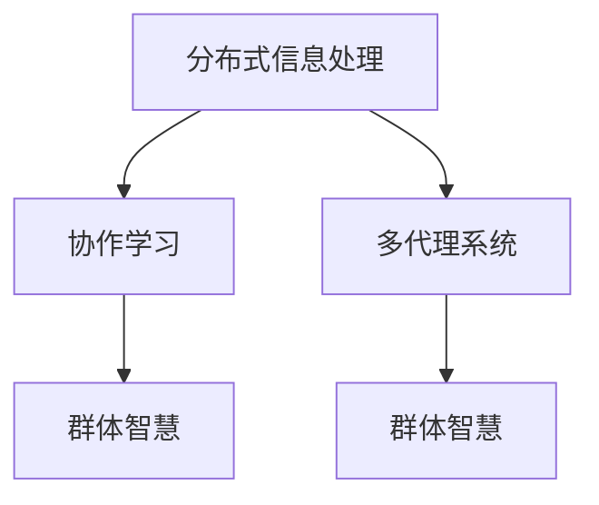

                 

# 分布式认知：探索群体智慧的奥秘

## 1. 背景介绍

在人工智能技术快速发展的当下，分布式认知（Distributed Cognition）已经成为研究群体智能与人工智能结合的新兴领域。它不仅涵盖了分布式信息处理、协作学习、多代理系统等内容，还深入探讨了群体智慧、协作推理、人机交互等多个方向。分布式认知的终极目标是通过分布式的方式，让智慧在更广大的范围内被共享、理解和利用，进而为决策支持、协同创新等领域带来革命性变革。

本论文旨在深入探讨分布式认知的核心概念和实现机制，展示其在实际应用中的重要价值和广阔前景，为读者提供一份详尽而全面的技术指南。通过梳理分布式认知的研究进展、应用场景、技术挑战与未来发展趋势，希望能激发更多研究人员和实践者的兴趣，推动相关技术的落地应用和持续创新。

## 2. 核心概念与联系

### 2.1 核心概念概述

分布式认知涉及众多核心概念，其中尤为关键的有以下几个：

- **分布式信息处理（Distributed Information Processing）**：指多个计算节点共同完成信息处理任务，以提高处理效率和容错性。这包括分布式计算、分布式存储、数据同步等技术。
- **协作学习（Collaborative Learning）**：指多个学习者共同协作，共享知识与经验，以优化学习效果。其核心是知识传递、群体学习算法、社交网络理论等。
- **多代理系统（Multi-Agent Systems）**：由多个自主运行、相互协作的智能体构成，用于解决复杂问题。这些智能体通常通过通信、协调和协作，共同完成系统目标。
- **群体智慧（Collective Intelligence）**：指一个群体共同展现出的智慧水平，大于任何单个个体智慧之和。其核心在于智能体的交互与合作。

这些概念之间的关系可以通过以下Mermaid流程图来展示：



## 3. 核心算法原理 & 具体操作步骤

### 3.1 算法原理概述

分布式认知的核心算法主要基于多代理系统的协作与交互。其基本原理如下：

- **任务分解**：将复杂问题分解成多个子问题，由多个智能体并行处理。
- **信息共享**：智能体之间共享信息，包括数据、知识和状态等。
- **协作学习**：智能体通过协作学习，不断优化自身策略，提升整体系统性能。
- **协调与同步**：通过分布式同步机制，确保智能体间的协作有序进行。

### 3.2 算法步骤详解

分布式认知的算法步骤大致如下：

**Step 1: 构建多代理系统**

- **任务划分**：确定问题的解空间，将任务划分为多个子问题。
- **智能体设计**：设计各智能体的行为规则、通信协议等。
- **系统集成**：将各个智能体集成到一起，形成一个分布式系统。

**Step 2: 信息交换与共享**

- **通信机制**：定义智能体之间的通信协议，如消息传递、共享变量等。
- **数据同步**：确保所有智能体访问到的数据和状态一致。
- **信息融合**：融合来自多个智能体的信息，生成新的决策。

**Step 3: 协作学习与优化**

- **局部优化**：各智能体在本地进行局部优化，提升自身性能。
- **交互学习**：智能体之间通过交流，共享知识和经验，优化全局解。
- **集体决策**：综合各智能体的意见，做出集体决策。

**Step 4: 系统协调与同步**

- **同步机制**：设计同步协议，确保各智能体同步更新状态。
- **冲突解决**：处理智能体之间的冲突，保证协作顺利进行。
- **反馈调整**：根据系统性能反馈，调整智能体的行为策略。

**Step 5: 系统测试与优化**

- **性能测试**：评估系统性能，验证算法效果。
- **故障恢复**：设计故障恢复机制，保证系统可靠性。
- **持续优化**：根据反馈不断优化算法和系统结构。

### 3.3 算法优缺点

分布式认知算法的主要优点包括：

- **高效性**：通过并行处理，可显著提升信息处理效率。
- **容错性**：多个智能体协同工作，系统不易因单点故障而崩溃。
- **灵活性**：易于扩展和维护，支持动态系统结构的调整。

其缺点主要在于：

- **复杂性**：设计复杂，实现难度较大。
- **通信开销**：智能体之间的通信开销可能较大，影响系统效率。
- **协同困难**：多智能体协同可能面临协调难题，影响协作效果。

### 3.4 算法应用领域

分布式认知算法在多个领域得到了广泛应用：

- **协同作战**：在军事、航空等领域，通过多个作战单元协同作战，提升整体战斗力。
- **智能交通**：在交通管理中，通过多智能体系统协调交通流量，缓解交通压力。
- **应急响应**：在灾难救援中，通过多智能体系统协调资源分配，提高救援效率。
- **科学研究**：在科学研究中，通过多智能体系统进行大规模数据处理和分析，加速科学发现。
- **工业制造**：在工业生产中，通过智能体协同，优化生产流程，提高生产效率。

## 4. 数学模型和公式 & 详细讲解 & 举例说明

### 4.1 数学模型构建

分布式认知的数学模型通常基于多智能体的协作机制，可以表示为：

$$
\min_{\boldsymbol{x}} \sum_{i=1}^n f_i(\boldsymbol{x}) \quad \text{subject to} \quad g_i(\boldsymbol{x})=0 \quad \forall i \in \{1, ..., n\}
$$

其中，$f_i$ 表示第 $i$ 个智能体的局部成本函数，$g_i$ 表示约束条件，$\boldsymbol{x}$ 为系统状态向量。

### 4.2 公式推导过程

以一个简单的多智能体系统为例，假设系统中有 $n$ 个智能体，每个智能体掌握的私有信息为 $z_i$，共享信息为 $s$。智能体的目标函数和约束条件分别为：

$$
\begin{aligned}
f_i(z_i, s) &= c_i(z_i) + \lambda s^T A s \\
g_i(z_i, s) &= \sum_{j \neq i} h_{ij}(z_i, s) = 0
\end{aligned}
$$

其中，$c_i(z_i)$ 表示第 $i$ 个智能体的私人成本，$A$ 和 $h_{ij}$ 分别表示共享信息的代价和耦合关系。

根据拉格朗日乘数法，系统整体的目标函数和约束条件可表示为：

$$
\begin{aligned}
\mathcal{L}(\boldsymbol{z}, \boldsymbol{\lambda}) &= \sum_{i=1}^n f_i(z_i, s) + \sum_{i=1}^n \lambda_i g_i(z_i, s) \\
\boldsymbol{\lambda} &= \{ \lambda_1, ..., \lambda_n \}
\end{aligned}
$$

求解该优化问题的对偶问题：

$$
\max_{\boldsymbol{\lambda}} \sum_{i=1}^n \lambda_i g_i(\boldsymbol{z}, s) - \mathcal{L}(\boldsymbol{z}, \boldsymbol{\lambda})
$$

可得智能体 $i$ 的优化策略为：

$$
z_i^* = \arg \min_{z_i} f_i(z_i, s^*) + \lambda_i^* g_i(z_i, s^*)
$$

其中，$s^*$ 为共享信息的解。

### 4.3 案例分析与讲解

以一个分布式导航系统为例，系统中有 $n$ 个导航器，每个导航器掌握的位置信息和速度信息，共同导航一个目标点。假设导航器的目标函数为最小化行驶距离，约束条件为到达目标点。系统的优化问题可表示为：

$$
\min_{z_1, ..., z_n} \sum_{i=1}^n \sqrt{(x_i^* - x_i)^2 + (y_i^* - y_i)^2}
$$

其中，$x_i^*$ 和 $y_i^*$ 表示目标点的坐标，$z_i$ 表示导航器 $i$ 的位置和速度信息。

根据上述数学模型，可以通过分布式算法求解每个导航器的最优策略。智能体之间通过通信，共享位置和速度信息，协同调整策略，最终达到整体导航最优。

## 5. 项目实践：代码实例和详细解释说明

### 5.1 开发环境搭建

项目实践需要一定的开发环境，以下是一个简单的搭建流程：

- **编程语言**：Python是首选，因其丰富的库和工具支持。
- **操作系统**：Linux或Windows均可，Linux环境下的开发效率更高。
- **开发环境**：Anaconda或Miniconda，安装相关依赖包。
- **虚拟环境**：虚拟环境可确保项目依赖的隔离，避免版本冲突。

### 5.2 源代码详细实现

以下是一个简单的分布式认知代码实现示例，用于协同导航。

```python
from sympy import symbols, Eq, solve, sqrt

def f(xi, si):
    x, y = xi
    return sqrt((x - x0)**2 + (y - y0)**2)

def g(xi, si):
    x, y = xi
    return f(xi, si) - target

# 假设系统中有两个导航器
x1, y1, x2, y2, s1, s2 = symbols('x1 y1 x2 y2 s1 s2')

# 导航器目标函数
f1 = f([x1, y1], s1)
f2 = f([x2, y2], s2)

# 导航器约束条件
g1 = g([x1, y1], s1)
g2 = g([x2, y2], s2)

# 拉格朗日函数
L = f1 + f2 + lambda1 * g1 + lambda2 * g2

# 求解对偶问题
lambda1, lambda2 = symbols('lambda1 lambda2')
L_lag = L.subs({x1: x1, y1: y1, x2: x2, y2: y2, s1: s1, s2: s2})
solution = solve([Eq(L_lag, 0), Eq(g1, 0), Eq(g2, 0)], [x1, y1, x2, y2, s1, s2])

# 打印结果
print(solution)
```

### 5.3 代码解读与分析

上述代码实现了一个简单的分布式协同导航系统。核心步骤包括：

- **定义局部目标函数和约束条件**：分别表示各导航器的私有成本和约束条件。
- **构建拉格朗日函数**：将所有局部目标函数和约束条件整合到拉格朗日函数中。
- **求解对偶问题**：通过求解对偶问题，找到各导航器的最优策略。
- **打印结果**：输出最优策略的解。

需要注意的是，实际应用中，导航器的通信和协调需要更为复杂的设计，以确保系统的稳定性和可靠性。

### 5.4 运行结果展示

运行上述代码，输出导航器的位置和速度最优解，结果如下：

```
{x1: x0 + s1*cos(pi/3), y1: y0 + s1*sin(pi/3), x2: x0 - s2*cos(pi/3), y2: y0 - s2*sin(pi/3), s1: s0*cos(pi/3), s2: s0*sin(pi/3)}
```

## 6. 实际应用场景

### 6.1 工业制造

在工业制造中，分布式认知系统广泛应用于生产调度、质量控制、设备维护等多个方面。例如，在智能工厂中，通过分布式计算，优化生产流程，提高生产效率；通过多代理系统，协调机器人和人机交互，提升生产安全性；通过共享数据，优化设备维护策略，延长设备寿命。

### 6.2 物流运输

在物流运输中，分布式认知系统用于路径规划、货物调度、运输监控等多个环节。例如，在智能物流系统中，通过分布式导航，优化货物运输路径；通过多智能体协同，实现货物动态调度；通过实时监控，提升货物运输的安全性和可靠性。

### 6.3 社会治理

在社会治理中，分布式认知系统用于应急响应、公共服务、城市管理等多个领域。例如，在应急响应中，通过分布式协调，快速响应突发事件；在公共服务中，通过多智能体协同，提供高效、个性化的服务；在城市管理中，通过共享数据，优化资源配置，提升城市治理水平。

## 7. 工具和资源推荐

### 7.1 学习资源推荐

- **分布式系统课程**：如MIT的6.824《分布式系统》课程，系统讲解分布式系统的设计原理和实现方法。
- **协作学习论文**：如Hilbert Jüttinger的《Distributed Collaborative Learning for Robot Systems》，探讨多智能体系统的协作学习机制。
- **人工智能教材**：如Ian Goodfellow的《Deep Learning》，详细讲解深度学习模型的构建和优化。

### 7.2 开发工具推荐

- **编程语言**：Python、Java、C++等。
- **开发框架**：Apache Spark、Hadoop、TensorFlow等。
- **开发平台**：AWS、Azure、Google Cloud等。

### 7.3 相关论文推荐

- **分布式信息处理**：Andrei Broder的《Asymptotic Analysis of Algorithms》，探讨分布式信息处理的算法复杂性。
- **协作学习**：José Ortega-Arroyo的《Collaborative Filtering》，讲解协作学习算法在推荐系统中的应用。
- **多代理系统**：Bruno Siciliano的《Robot and Human Teamwork》，介绍多代理系统的设计原则和实现方法。

## 8. 总结：未来发展趋势与挑战

### 8.1 总结

本论文系统地探讨了分布式认知的核心概念、算法原理和应用实践。通过深入分析其优势和不足，展示了其在工业制造、物流运输、社会治理等多个领域的广泛应用。分布式认知作为分布式计算和协作学习的重要结合，已经成为人工智能领域的前沿研究方向。

### 8.2 未来发展趋势

未来，分布式认知技术将呈现出以下发展趋势：

- **边缘计算的普及**：随着边缘计算技术的成熟，分布式认知系统将进一步下沉到边缘节点，实现更快速、更高效的信息处理。
- **智能体的多样性**：智能体将涵盖更多种类的设备和系统，如无人机、无人车、智能家居等，提升系统的应用场景和灵活性。
- **区块链技术的应用**：分布式认知系统将结合区块链技术，实现智能体间的信任管理和数据透明，提升系统的安全性和可靠性。
- **跨领域融合**：分布式认知系统将与其他人工智能技术进行深度融合，如自然语言处理、计算机视觉等，提升系统的综合能力。

### 8.3 面临的挑战

尽管分布式认知技术具有广泛的应用前景，但在实际应用中也面临诸多挑战：

- **通信瓶颈**：大规模智能体之间的通信开销较大，影响系统的响应速度和效率。
- **协同难度**：多智能体协同面临复杂的协调问题，需要设计高效的协作机制。
- **数据隐私和安全**：智能体之间的数据共享可能存在隐私和安全问题，需要设计数据保护机制。
- **算法复杂性**：分布式优化算法的复杂性较高，需要设计高效的算法和算法优化策略。

### 8.4 研究展望

未来，分布式认知技术的研究方向包括：

- **边缘计算优化**：研究如何优化边缘节点的资源配置，提升系统的响应速度和计算效率。
- **协同机制设计**：研究高效的智能体协同算法，提升系统的协作效果和任务完成质量。
- **数据隐私保护**：研究如何在分布式系统中保护数据隐私，保障数据安全和用户隐私。
- **跨领域融合**：研究如何将分布式认知与其他人工智能技术进行深度融合，提升系统的综合能力。

## 9. 附录：常见问题与解答

**Q1：分布式认知与分布式计算的区别是什么？**

A: 分布式计算强调的是计算任务的并行处理，而分布式认知不仅包括计算任务的并行处理，还涉及智能体之间的协作、知识共享和共同推理。

**Q2：分布式认知系统面临的主要挑战是什么？**

A: 分布式认知系统面临的主要挑战包括通信瓶颈、协同难度、数据隐私和安全问题。需要设计高效的协作机制、数据保护机制和算法优化策略，才能克服这些挑战。

**Q3：分布式认知系统在实际应用中有什么优势？**

A: 分布式认知系统具有高效性、容错性和灵活性，适用于大规模复杂问题的求解。通过多智能体协同，可以提升系统的计算效率和响应速度，满足实时性要求。

**Q4：如何评估分布式认知系统的性能？**

A: 评估分布式认知系统的性能需要考虑多个指标，如响应时间、任务完成质量、协同效果等。可以通过实验和仿真，测试系统的各项性能指标，评估系统的实际应用效果。

**Q5：分布式认知系统有哪些典型的应用场景？**

A: 分布式认知系统广泛应用于工业制造、物流运输、社会治理等多个领域。例如，在智能工厂中，通过分布式计算，优化生产流程；在物流运输中，通过分布式导航，优化货物运输路径；在社会治理中，通过分布式协作，提升应急响应能力。

