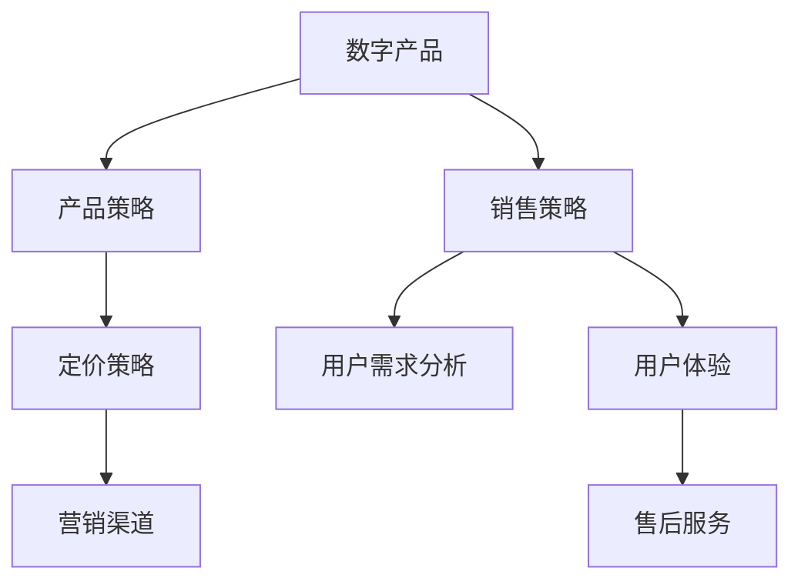

                 

# 创建和销售数字产品的策略

> 关键词：数字产品, 产品策略, 销售策略, 用户需求, 市场调研, 定价策略, 营销渠道, 用户体验, 售后服务

## 1. 背景介绍

在当今数字化时代，数字产品（Digital Products）如软件、应用程序、在线服务等逐渐成为企业竞争的关键。数字产品不仅能提升用户体验，还能创造巨大的商业价值。然而，创建和销售数字产品并非易事。本文将从产品策略、销售策略、用户需求分析、定价策略、营销渠道、用户体验以及售后服务等多个方面，系统阐述如何打造成功的数字产品，并帮助企业最大化其销售潜力和用户满意度。

## 2. 核心概念与联系

### 2.1 核心概念概述

为更好地理解创建和销售数字产品的策略，本节将介绍几个关键概念及其之间的联系：

- **数字产品(Digital Product)**：指通过数字化技术开发和提供的产品，包括软件、应用程序、在线服务等。

- **产品策略(Product Strategy)**：企业在创建和销售数字产品时所采取的战略方针和策略，包括产品定位、功能规划、开发流程等。

- **销售策略(Sales Strategy)**：在数字产品销售过程中所采用的策略，包括目标市场、销售渠道、推广方式等。

- **用户需求分析(User Needs Analysis)**：通过调研和分析用户需求，制定符合用户期望的产品策略和销售策略。

- **定价策略(Pricing Strategy)**：数字产品的定价方法，需要综合考虑成本、市场需求、竞争对手定价等因素。

- **营销渠道(Marketing Channels)**：用于推广和销售数字产品的渠道，包括社交媒体、官网、电商平台等。

- **用户体验(User Experience)**：用户与数字产品交互的体验，直接影响用户满意度和留存率。

- **售后服务(Support and Service)**：产品售出后提供的后续服务，如技术支持、用户反馈处理等。

这些概念之间的逻辑关系可以通过以下Mermaid流程图来展示：



这个流程图展示了几大核心概念之间的联系：

1. 数字产品是基础，产品策略、销售策略、用户需求分析、定价策略、营销渠道、用户体验和售后服务等都围绕着数字产品展开。
2. 产品策略和销售策略直接影响数字产品的开发方向和市场表现。
3. 用户需求分析是制定产品策略和销售策略的依据。
4. 定价策略、营销渠道、用户体验和售后服务等则是在产品发布后，确保其成功销售和用户满意的重要因素。

## 3. 核心算法原理 & 具体操作步骤
### 3.1 算法原理概述

创建和销售数字产品的策略主要遵循以下几个核心原理：

- **用户中心设计**：以用户需求为导向，设计产品功能和界面，提升用户体验。
- **市场细分与定位**：通过市场调研，确定目标市场，制定符合市场需求的销售策略。
- **成本与价值分析**：综合考虑开发成本和市场价值，制定合理的定价策略。
- **多渠道营销**：利用多种营销渠道，增加产品曝光度和用户覆盖面。
- **持续优化**：基于用户反馈和市场变化，不断优化产品功能和销售策略。

### 3.2 算法步骤详解

创建和销售数字产品的策略主要包括以下关键步骤：

**Step 1: 市场调研**
- 收集目标市场的数据，包括用户需求、竞争对手分析、市场趋势等。
- 进行用户访谈和问卷调查，深入了解用户痛点和期望。

**Step 2: 产品规划**
- 根据调研结果，确定产品的核心功能和特色。
- 制定详细的开发计划和时间表。

**Step 3: 开发与测试**
- 进行产品开发，遵循敏捷开发和迭代改进的原则。
- 进行用户测试，收集反馈并及时调整产品功能。

**Step 4: 定价与营销**
- 基于成本和市场竞争，制定合理的定价策略。
- 选择适合的营销渠道，如社交媒体、官网、电商平台等。

**Step 5: 用户体验与售后服务**
- 在产品发布前，进行用户界面和交互设计的优化。
- 提供优质的售后服务，建立用户反馈机制，不断提升用户体验。

**Step 6: 持续迭代**
- 基于用户反馈和市场变化，持续优化产品功能和销售策略。
- 定期进行市场调研和用户需求分析，确保产品与市场同步。

### 3.3 算法优缺点

创建和销售数字产品的策略具有以下优点：

- **用户导向**：通过用户需求分析，确保产品功能和设计符合用户期望。
- **市场灵活**：利用市场调研和细分策略，找到最佳的销售机会和渠道。
- **成本效益**：通过合理的定价和成本控制，最大化商业价值。
- **多渠道覆盖**：通过多渠道营销，提高产品曝光度和用户覆盖面。

然而，该策略也存在以下局限性：

- **复杂度高**：涉及多个环节和部门协同工作，管理复杂。
- **市场风险**：市场调研和用户需求分析可能出现偏差，影响决策。
- **成本投入**：产品开发、测试、营销等环节需要大量资源投入。
- **用户体验改进难度大**：用户体验和售后服务需持续优化，成本较高。

### 3.4 算法应用领域

创建和销售数字产品的策略广泛应用于各种数字产品的开发和销售中，包括：

- **应用程序开发**：如社交媒体应用、电子商务应用、在线教育应用等。
- **软件服务**：如云服务、数据处理软件、企业管理系统等。
- **数字内容**：如在线课程、电子书、视频服务等。

这些领域的产品都需要基于用户需求进行详细分析，制定合理的策略，并通过持续优化和迭代，确保成功销售和用户满意。

## 4. 数学模型和公式 & 详细讲解 & 举例说明
### 4.1 数学模型构建

在创建和销售数字产品的策略中，可以使用数学模型来量化和优化各个环节。以下以定价策略为例，构建数学模型：

假设产品开发成本为 $C$，市场需求为 $D$，竞争对手定价为 $P_{\text{comp}}$，市场价格为 $P$。根据成本加成定价模型，定价公式为：

$$
P = C + r \times (D - P_{\text{comp}})
$$

其中 $r$ 为加成率，取决于产品的独特性和市场需求。

### 4.2 公式推导过程

根据上述定价公式，推导过程如下：

1. 设定定价变量 $P$，开发成本 $C$，市场需求 $D$，竞争对手定价 $P_{\text{comp}}$。
2. 根据成本加成定价模型，构建定价公式：
$$
P = C + r \times (D - P_{\text{comp}})
$$
3. 简化公式，得到：
$$
P = \frac{C + r \times D}{1 - r}
$$

这个公式表明，定价取决于成本、市场需求和加成率。加成率越高，市场需求越高，定价就越高。

### 4.3 案例分析与讲解

以一个在线教育平台的课程定价为例，假设课程开发成本为 $C=500$ 美元，市场需求为 $D=1000$ 美元，竞争对手定价为 $P_{\text{comp}}=300$ 美元。加成率为 $r=0.5$。根据定价公式：

$$
P = \frac{500 + 0.5 \times 1000}{1 - 0.5} = \frac{1500}{0.5} = 3000
$$

因此，课程的定价应为 $3000$ 美元。这个定价策略考虑了开发成本、市场需求和竞争情况，能够最大化商业价值。

## 5. 项目实践：代码实例和详细解释说明
### 5.1 开发环境搭建

在进行项目实践前，需要先搭建开发环境。以下是使用Python进行项目开发的流程：

1. 安装Python和相关库：从官网下载Python，安装必要的库，如TensorFlow、NumPy、Pandas等。

2. 配置开发环境：安装Git、Docker、Jenkins等工具，用于版本控制、容器化和持续集成。

3. 设置开发工具：配置IDE（如PyCharm）和文本编辑器，用于编写和调试代码。

完成上述步骤后，即可开始项目开发。

### 5.2 源代码详细实现

下面以一个在线课程平台为例，给出代码实现步骤：

1. 定义用户类 `User`：
```python
class User:
    def __init__(self, name, email, payment_info):
        self.name = name
        self.email = email
        self.payment_info = payment_info
```

2. 定义课程类 `Course`：
```python
class Course:
    def __init__(self, title, content, price):
        self.title = title
        self.content = content
        self.price = price
```

3. 定义订单类 `Order`：
```python
class Order:
    def __init__(self, user, course):
        self.user = user
        self.course = course
        self.status = "pending"
```

4. 定义支付类 `PaymentProcessor`：
```python
class PaymentProcessor:
    def process_payment(self, payment_info):
        # 处理支付逻辑
        return True
```

5. 定义订单处理类 `OrderProcessor`：
```python
class OrderProcessor:
    def process_order(self, order):
        if order.status == "pending":
            if PaymentProcessor().process_payment(order.user.payment_info):
                order.status = "completed"
```

### 5.3 代码解读与分析

让我们详细解读一下关键代码的实现细节：

**User类**：
- 定义了用户的基本信息，包括姓名、邮箱和支付信息。

**Course类**：
- 定义了课程的基本信息，包括标题、内容和价格。

**Order类**：
- 定义了订单的基本信息，包括用户和课程，以及订单状态。

**PaymentProcessor类**：
- 定义了支付处理器，用于处理用户的支付信息。

**OrderProcessor类**：
- 定义了订单处理器，用于处理订单状态，包括订单的支付逻辑。

### 5.4 运行结果展示

在实际运行中，可以通过调用 `OrderProcessor` 类的方法，处理订单状态和支付逻辑。例如：

```python
user = User("John Doe", "john.doe@example.com", "1234567890")
course = Course("Introduction to Python", "Python 3.8 course", 199)
order = Order(user, course)
OrderProcessor().process_order(order)
```

运行后，订单状态将从 "pending" 变为 "completed"，表示订单处理成功。

## 6. 实际应用场景

### 6.4 未来应用展望

数字产品的应用场景不断扩展，未来将更加多样化和智能化。以下是几个未来应用展望：

1. **个性化推荐**：基于用户行为数据和偏好，提供个性化的产品推荐，提升用户体验。
2. **智能客服**：通过自然语言处理技术，实现智能客服机器人，提高用户互动效率。
3. **区块链技术**：利用区块链技术，确保数字产品的版权和交易透明，提高用户信任度。
4. **虚拟现实**：结合虚拟现实技术，提供沉浸式的产品体验，增强用户参与度。
5. **边缘计算**：利用边缘计算技术，减少数据传输和服务器压力，提高产品响应速度。

这些应用场景将进一步推动数字产品的发展，带来新的商业机会和用户价值。

## 7. 工具和资源推荐
### 7.1 学习资源推荐

为了帮助开发者系统掌握数字产品的开发和销售策略，这里推荐一些优质的学习资源：

1. **《数字产品设计指南》**：介绍数字产品的设计原则和最佳实践，包括用户中心设计、用户界面设计等。

2. **《数字营销》**：讲解数字产品的营销策略，包括SEO、社交媒体营销、内容营销等。

3. **《定价策略》**：详细分析数字产品的定价模型和策略，包括成本加成定价、价值定价等。

4. **《用户体验设计》**：介绍用户体验设计的基本原理和实战案例，提升用户体验。

5. **《敏捷开发实践》**：讲解敏捷开发方法论，提升产品开发效率和质量。

6. **《DevOps实践》**：介绍DevOps工具和流程，提高软件开发的自动化水平和持续集成能力。

这些资源可以帮助开发者全面掌握数字产品的开发和销售策略，提升工作效率和产品质量。

### 7.2 开发工具推荐

高效的开发离不开优秀的工具支持。以下是几款用于数字产品开发和销售的常用工具：

1. **Git**：版本控制系统，支持多人协作和版本管理。
2. **Jenkins**：持续集成工具，支持自动化测试和部署。
3. **JIRA**：项目管理工具，支持任务跟踪和问题管理。
4. **Confluence**：文档协作工具，支持知识共享和团队协作。
5. **Slack**：团队沟通工具，支持即时消息和视频会议。
6. **Zendesk**：客户支持工具，支持工单管理和客户服务。

这些工具能够提升开发效率，促进团队协作和客户支持，是数字产品开发和销售的关键工具。

### 7.3 相关论文推荐

数字产品开发和销售涉及多学科知识，相关研究领域十分广泛。以下是几篇经典论文，推荐阅读：

1. **《用户体验设计基础》**：介绍用户体验设计的基本原理和实践方法，提升用户满意度。

2. **《数字产品定价策略》**：分析数字产品的定价模型和策略，提供多种定价方案。

3. **《数字产品营销框架》**：构建数字产品的营销框架，提升市场覆盖面和用户转化率。

4. **《敏捷开发方法论》**：讲解敏捷开发方法论，提升产品开发效率和质量。

5. **《DevOps实践》**：介绍DevOps工具和流程，提高软件开发和部署的自动化水平。

这些论文代表了大规模数字产品开发和销售的核心技术，能够帮助开发者系统掌握相关知识。

## 8. 总结：未来发展趋势与挑战

### 8.1 总结

本文对创建和销售数字产品的策略进行了全面系统的介绍。首先阐述了数字产品的重要性和其开发和销售策略的复杂性。其次，从用户需求分析、产品规划、开发与测试、定价与营销、用户体验与售后服务等多个方面，详细讲解了数字产品策略的实施步骤。最后，推荐了相关学习资源、开发工具和论文，以供参考。

通过本文的系统梳理，可以看到，创建和销售数字产品的策略涵盖了产品设计、市场分析、开发测试、定价营销等多个环节。只有从用户需求出发，制定合理的策略，并持续优化和迭代，才能打造成功的产品，赢得市场竞争。

### 8.2 未来发展趋势

展望未来，数字产品的开发和销售将呈现以下几个发展趋势：

1. **智能化和自动化**：结合人工智能技术，提高产品开发和运营的智能化水平，如自动测试、智能客服、推荐系统等。
2. **个性化和定制化**：根据用户需求和行为，提供个性化和定制化的产品和服务，提升用户体验。
3. **多渠道融合**：利用多渠道融合技术，实现全渠道营销和客户服务，提升用户覆盖面和满意度。
4. **区块链技术应用**：利用区块链技术，确保数字产品的版权和交易透明，提升用户信任度。
5. **可持续发展**：结合可持续发展理念，开发环保型产品，提升企业社会责任。

这些趋势将推动数字产品的发展，带来更多的商业机会和用户价值。

### 8.3 面临的挑战

尽管数字产品的开发和销售策略已经取得了显著成果，但在迈向更加智能化、个性化、可持续化发展过程中，仍面临诸多挑战：

1. **技术复杂性**：数字产品的开发涉及多学科技术，需要跨领域协作和持续学习。
2. **市场竞争激烈**：数字产品市场竞争激烈，需要不断创新和优化，才能保持竞争力。
3. **用户体验优化难度大**：用户体验优化需要大量资源投入，且效果难以量化评估。
4. **成本控制困难**：数字产品的开发和运营成本高，需要精细化的成本控制和预算管理。
5. **法律法规约束**：数字产品的开发和销售需要符合法律法规要求，如隐私保护、数据安全等。

这些挑战需要企业在产品开发和销售过程中，不断探索和创新，寻求突破。

### 8.4 研究展望

面对数字产品开发和销售的挑战，未来的研究需要在以下几个方面寻求新的突破：

1. **技术创新**：结合前沿技术，如人工智能、区块链、大数据等，提升数字产品的智能化和自动化水平。
2. **用户体验优化**：通过用户反馈和行为分析，不断优化用户体验，提升用户满意度和忠诚度。
3. **成本控制**：引入精益管理方法，优化资源配置和流程管理，降低开发和运营成本。
4. **法律法规合规**：加强法律法规研究，确保数字产品的开发和销售符合法律法规要求。
5. **可持续发展**：结合可持续发展理念，开发环保型数字产品，提升企业社会责任。

这些研究方向的探索，将引领数字产品开发和销售策略的不断演进，为数字产业带来新的变革和机遇。

## 9. 附录：常见问题与解答

**Q1: 如何确保数字产品的市场需求？**

A: 通过市场调研和用户需求分析，了解目标用户的需求和痛点，制定符合市场需求的产品策略。同时，利用数据驱动的决策方式，持续优化产品功能和市场表现。

**Q2: 如何提升数字产品的用户满意度？**

A: 通过用户体验设计，提供高质量的用户界面和交互体验。同时，建立用户反馈机制，及时处理用户问题和建议，不断改进产品功能和用户体验。

**Q3: 如何优化数字产品的定价策略？**

A: 根据成本和市场需求，制定合理的定价模型。同时，关注竞争对手定价，灵活调整定价策略，以最大化商业价值。

**Q4: 如何构建有效的数字产品营销渠道？**

A: 通过多渠道融合技术，利用社交媒体、官网、电商平台等多种渠道进行推广和销售。同时，利用数据分析工具，优化渠道效果和用户覆盖面。

**Q5: 如何确保数字产品的可持续发展？**

A: 结合可持续发展理念，开发环保型数字产品。同时，加强环境评估和可持续性管理，提升企业社会责任。

---

作者：禅与计算机程序设计艺术 / Zen and the Art of Computer Programming

