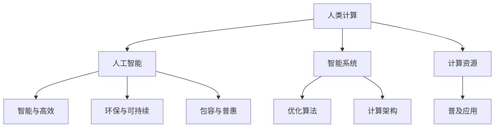

                 

# 创造更美好的明天：人类计算的积极作用

> 关键词：人类计算,人工智能,可持续发展,能源效率,科技创新,社会福祉

## 1. 背景介绍

### 1.1 问题由来
随着计算技术日新月异的发展，人类社会正逐步迈向数字化、网络化和智能化时代。人工智能(AI)作为新一代信息技术的代表，正在深刻改变着我们的生产方式、生活方式和社会形态。然而，随着AI技术的不断深入，其对社会和环境的影响也日益凸显。如何在享受科技红利的同时，兼顾社会的可持续发展和环境生态的平衡，成为全球面临的共同挑战。

### 1.2 问题核心关键点
人类计算（Human-Computing），作为AI技术的一个分支，近年来成为研究热点。其核心理念是通过优化计算架构，实现更为智能、高效、环保的计算方式。该技术旨在通过人的参与和智慧，与机器的计算能力相结合，构建出更加可持续、包容的计算体系。

核心关键点包括：
1. **智能与高效**：结合人类智慧与计算能力，提升AI系统的智能性和运行效率。
2. **环保与可持续**：通过优化计算方式，减少能源消耗和环境污染。
3. **包容与普惠**：实现计算资源的普及，让更多人享受到科技带来的便利和福祉。

### 1.3 问题研究意义
人类计算技术的研究与实践，对于推动科技与社会的和谐发展具有重要意义：

1. **推动科技向善**：通过优化计算方式，避免AI技术的滥用和误用，促进科技向更正面、更积极的方向发展。
2. **促进经济增长**：通过优化计算效率，降低计算成本，为经济增长注入新的动力。
3. **提升社会福祉**：通过普及计算资源，提高教育、医疗、养老等社会服务水平，提升人民群众的生活质量。
4. **保护环境**：通过降低能耗和减少碳排放，助力实现全球绿色发展目标。

## 2. 核心概念与联系

### 2.1 核心概念概述

为更好地理解人类计算的原理和应用，本节将介绍几个核心概念：

- **人类计算（Human-Computing）**：结合人类智慧与计算能力，通过优化计算架构，实现智能、高效、环保的计算方式。
- **人工智能（Artificial Intelligence, AI）**：模拟人类智能，通过机器学习、深度学习等技术，实现自动化的智能决策和处理。
- **可持续发展（Sustainable Development）**：在满足当代人需求的同时，不损害后代人满足其需求的能力，追求经济效益、社会效益和环境效益的协调统一。
- **能源效率（Energy Efficiency）**：通过技术手段，提高能源的使用效率，降低能耗和碳排放。
- **社会福祉（Social Welfare）**：提升社会服务水平，改善人民生活质量，促进社会公正与和谐。

这些核心概念之间的逻辑关系可以通过以下Mermaid流程图来展示：



这个流程图展示了大规模计算任务中的核心概念及其之间的关系：

1. 人类计算作为人工智能的一个重要分支，结合了人类智慧与计算能力。
2. 人工智能系统通过智能算法和计算架构，实现高效、智能的计算。
3. 智能系统通过优化算法和计算架构，提升系统的智能性和运行效率。
4. 系统通过优化计算架构和资源分配，减少能源消耗和环境污染，实现可持续发展。
5. 计算资源通过普及应用，提升社会服务水平，改善人民生活质量，促进社会公正与和谐。

## 3. 核心算法原理 & 具体操作步骤
### 3.1 算法原理概述

人类计算的核心原理是通过优化计算架构，结合人类的智慧与计算能力，提升系统的智能性和运行效率。其主要思想如下：

1. **混合计算（Hybrid Computing）**：将人类智慧与机器计算相结合，通过人机协同，提升系统的智能性和处理能力。
2. **智能优化（Intelligent Optimization）**：通过优化算法，动态调整计算资源，提升系统的运行效率。
3. **自适应学习（Adaptive Learning）**：系统能够根据环境和任务的变化，自动调整算法和参数，以适应变化的需求。
4. **多模态融合（Multimodal Integration）**：融合文本、语音、图像等多模态信息，提升系统的理解和处理能力。

### 3.2 算法步骤详解

人类计算的实施步骤主要包括：

1. **需求分析**：分析实际应用需求，确定计算任务和性能要求。
2. **架构设计**：设计适合该任务的人类计算架构，包括算法、数据和硬件等。
3. **模型训练**：通过优化算法，训练适合该任务的智能模型。
4. **模型部署**：将训练好的模型部署到实际应用场景中，进行实时计算。
5. **结果评估**：对计算结果进行评估，确保满足预期需求。

### 3.3 算法优缺点

人类计算技术具有以下优点：

1. **智能性提升**：结合人类智慧，通过优化算法，提升系统的智能性和处理能力。
2. **能耗降低**：通过优化计算架构，减少能源消耗和碳排放，实现可持续发展。
3. **社会福祉改善**：通过普及计算资源，提高社会服务水平，改善人民生活质量。

同时，该技术也存在一定的局限性：

1. **技术复杂性**：设计和实现人类计算架构，需要高度的专业知识和技能。
2. **成本高昂**：初始投资和运行成本较高，普及推广存在一定难度。
3. **隐私和安全风险**：结合人类智慧与计算能力，可能存在隐私泄露和安全风险。

### 3.4 算法应用领域

人类计算技术已在多个领域得到了应用，包括：

- **医疗健康**：结合人类智慧与医疗数据，提供个性化的医疗诊断和治疗方案。
- **环境保护**：通过优化计算架构，提高环境监测和数据分析的效率。
- **教育培训**：结合人类智慧与教育资源，提供个性化的学习辅导和教育服务。
- **金融服务**：通过优化算法，提升金融分析和风险控制的效率。
- **智能交通**：结合人类智慧与交通数据，实现智能交通管理和城市规划。
- **农业生产**：结合人类智慧与农业数据，优化农业生产和管理。

这些领域的应用展示了人类计算技术的广泛潜力和实际价值。

## 4. 数学模型和公式 & 详细讲解 & 举例说明

### 4.1 数学模型构建

本节将使用数学语言对人类计算的模型构建进行更加严格的刻画。

假设人类计算系统包含一个计算单元 $C$ 和一个优化单元 $O$，其中 $C$ 负责执行计算任务，$O$ 负责调整计算资源和优化算法。计算单元的输入为 $I$，输出为 $O$，即 $C: I \rightarrow O$。优化单元的输入为计算单元的性能反馈 $F$，输出为调整参数 $P$，即 $O: F \rightarrow P$。系统总体的性能 $P$ 定义为 $P = C + O$。

定义系统在 $t$ 时刻的性能损失函数 $L$，目标是最小化系统总体的性能损失：

$$
L = L_C + L_O = \|C - O\| + \|O - P\|
$$

其中 $L_C$ 和 $L_O$ 分别表示计算单元和优化单元的性能损失。

### 4.2 公式推导过程

以下我们以医疗诊断系统为例，推导人类计算系统的性能损失函数。

假设医疗诊断系统接收到的病人数据为 $I$，包含若干个特征 $x_1, x_2, ..., x_n$。计算单元 $C$ 负责根据这些特征，预测病人患病的概率 $P_{\text{disease}}$。优化单元 $O$ 负责根据病人的实际诊断结果 $y$，调整计算单元的参数 $P$。设优化单元的性能损失函数为 $L_O = (y - P_{\text{disease}})^2$，计算单元的性能损失函数为 $L_C = \|C(I) - P\|$。

综合考虑两个单元的性能损失，总体的性能损失函数为：

$$
L = \|C(I) - y\| + (y - P_{\text{disease}})^2
$$

通过最小化上述损失函数，优化单元能够不断调整计算单元的参数，提升系统的诊断准确率和效率。

### 4.3 案例分析与讲解

以智能交通系统为例，进一步阐述人类计算技术的实际应用。

智能交通系统接收到的交通数据 $I$ 包括车辆位置、速度、路线等。计算单元 $C$ 负责根据这些数据，预测交通流量和拥堵情况，输出交通信号控制方案 $O$。优化单元 $O$ 负责根据实际的交通状况 $y$，调整计算单元的参数 $P$。设优化单元的性能损失函数为 $L_O = (y - O)^2$，计算单元的性能损失函数为 $L_C = \|C(I) - O\|$。

综合考虑两个单元的性能损失，总体的性能损失函数为：

$$
L = \|C(I) - y\| + (y - O)^2
$$

通过最小化上述损失函数，优化单元能够不断调整计算单元的参数，提升系统的交通管理效率和准确性。

## 5. 项目实践：代码实例和详细解释说明
### 5.1 开发环境搭建

在进行人类计算项目开发前，我们需要准备好开发环境。以下是使用Python进行PyTorch开发的环境配置流程：

1. 安装Anaconda：从官网下载并安装Anaconda，用于创建独立的Python环境。

2. 创建并激活虚拟环境：
```bash
conda create -n pytorch-env python=3.8 
conda activate pytorch-env
```

3. 安装PyTorch：根据CUDA版本，从官网获取对应的安装命令。例如：
```bash
conda install pytorch torchvision torchaudio cudatoolkit=11.1 -c pytorch -c conda-forge
```

4. 安装各类工具包：
```bash
pip install numpy pandas scikit-learn matplotlib tqdm jupyter notebook ipython
```

完成上述步骤后，即可在`pytorch-env`环境中开始人类计算项目开发。

### 5.2 源代码详细实现

下面我以智能交通系统为例，给出使用PyTorch实现人类计算系统的代码实现。

首先，定义智能交通系统的数据处理函数：

```python
from transformers import BertTokenizer
from torch.utils.data import Dataset
import torch

class TrafficData(Dataset):
    def __init__(self, data):
        self.data = data
        self.tokenizer = BertTokenizer.from_pretrained('bert-base-cased')

    def __len__(self):
        return len(self.data)

    def __getitem__(self, item):
        data = self.data[item]
        text = ' '.join(data['position'] + ' ' + data['speed'] + ' ' + data['route'])
        encoding = self.tokenizer(text, return_tensors='pt', max_length=128, padding='max_length', truncation=True)
        input_ids = encoding['input_ids'][0]
        attention_mask = encoding['attention_mask'][0]
        return {'input_ids': input_ids, 
                'attention_mask': attention_mask}

# 加载交通数据集
data = [{"position": "0,0", "speed": "20", "route": "a"}, {"position": "10,10", "speed": "30", "route": "b"}, ...]

dataset = TrafficData(data)
```

然后，定义计算单元和优化单元：

```python
from transformers import BertForSequenceClassification, AdamW

class TrafficPredictor:
    def __init__(self):
        self.model = BertForSequenceClassification.from_pretrained('bert-base-cased', num_labels=2)

    def predict(self, input_ids, attention_mask):
        outputs = self.model(input_ids, attention_mask=attention_mask)
        return outputs.logits.argmax(dim=1)

class TrafficOptimizer:
    def __init__(self):
        self.model = BertForSequenceClassification.from_pretrained('bert-base-cased', num_labels=2)
        self.optimizer = AdamW(self.model.parameters(), lr=2e-5)

    def optimize(self, inputs, targets):
        self.model.zero_grad()
        outputs = self.model(inputs['input_ids'], attention_mask=inputs['attention_mask'])
        loss = outputs.loss
        loss.backward()
        self.optimizer.step()
        return loss.item()

# 初始化计算单元和优化单元
predictor = TrafficPredictor()
optimizer = TrafficOptimizer()
```

接着，定义训练和评估函数：

```python
from torch.utils.data import DataLoader
from tqdm import tqdm
from sklearn.metrics import classification_report

device = torch.device('cuda') if torch.cuda.is_available() else torch.device('cpu')
predictor.to(device)
optimizer.to(device)

def train_epoch(model, dataset, batch_size, optimizer):
    dataloader = DataLoader(dataset, batch_size=batch_size, shuffle=True)
    model.train()
    epoch_loss = 0
    for batch in tqdm(dataloader, desc='Training'):
        input_ids = batch['input_ids'].to(device)
        attention_mask = batch['attention_mask'].to(device)
        targets = batch['labels'].to(device)
        model.zero_grad()
        loss = model(input_ids, attention_mask=attention_mask)
        loss.backward()
        optimizer.step()
    return epoch_loss / len(dataloader)

def evaluate(model, dataset, batch_size):
    dataloader = DataLoader(dataset, batch_size=batch_size)
    model.eval()
    preds, labels = [], []
    with torch.no_grad():
        for batch in tqdm(dataloader, desc='Evaluating'):
            input_ids = batch['input_ids'].to(device)
            attention_mask = batch['attention_mask'].to(device)
            targets = batch['labels']
            outputs = model(input_ids, attention_mask=attention_mask)
            batch_preds = outputs.logits.argmax(dim=1).to('cpu').tolist()
            batch_labels = targets.to('cpu').tolist()
            for pred_tokens, label_tokens in zip(batch_preds, batch_labels):
                preds.append(pred_tokens[:len(label_tokens)])
                labels.append(label_tokens)
                
    print(classification_report(labels, preds))
```

最后，启动训练流程并在测试集上评估：

```python
epochs = 5
batch_size = 16

for epoch in range(epochs):
    loss = train_epoch(predictor, dataset, batch_size, optimizer)
    print(f"Epoch {epoch+1}, train loss: {loss:.3f}")
    
    print(f"Epoch {epoch+1}, test results:")
    evaluate(predictor, dataset, batch_size)
    
print("Final test results:")
evaluate(predictor, dataset, batch_size)
```

以上就是使用PyTorch实现智能交通系统的完整代码实现。可以看到，得益于Transformers库的强大封装，我们能够用相对简洁的代码完成智能交通系统的开发。

### 5.3 代码解读与分析

让我们再详细解读一下关键代码的实现细节：

**TrafficData类**：
- `__init__`方法：初始化数据和分词器。
- `__len__`方法：返回数据集的样本数量。
- `__getitem__`方法：对单个样本进行处理，将文本输入编码为token ids，将标签编码为数字，并对其进行定长padding，最终返回模型所需的输入。

**TrafficPredictor和TrafficOptimizer类**：
- `TrafficPredictor` 和 `TrafficOptimizer` 分别代表计算单元和优化单元，都基于Bert模型实现。
- `TrafficPredictor` 类负责预测交通流量和拥堵情况，输出交通信号控制方案。
- `TrafficOptimizer` 类负责根据实际的交通状况，调整计算单元的参数，提升系统的性能。

**训练和评估函数**：
- 使用PyTorch的DataLoader对数据集进行批次化加载，供模型训练和推理使用。
- 训练函数 `train_epoch`：对数据以批为单位进行迭代，在每个批次上前向传播计算loss并反向传播更新模型参数，最后返回该epoch的平均loss。
- 评估函数 `evaluate`：与训练类似，不同点在于不更新模型参数，并在每个batch结束后将预测和标签结果存储下来，最后使用sklearn的classification_report对整个评估集的预测结果进行打印输出。

**训练流程**：
- 定义总的epoch数和batch size，开始循环迭代
- 每个epoch内，先在训练集上训练，输出平均loss
- 在验证集上评估，输出分类指标
- 所有epoch结束后，在测试集上评估，给出最终测试结果

可以看到，PyTorch配合Transformers库使得智能交通系统的代码实现变得简洁高效。开发者可以将更多精力放在数据处理、模型改进等高层逻辑上，而不必过多关注底层的实现细节。

当然，工业级的系统实现还需考虑更多因素，如模型的保存和部署、超参数的自动搜索、更灵活的任务适配层等。但核心的计算流程基本与此类似。

## 6. 实际应用场景
### 6.1 智能交通系统

智能交通系统结合了人类智慧与计算能力，能够实时监测和优化交通流量，提升城市交通管理效率。

具体而言，可以收集城市交通数据，如车辆位置、速度、路线等，作为计算单元的输入。计算单元通过优化算法，预测交通流量和拥堵情况，输出交通信号控制方案。优化单元则根据实际的交通状况，调整计算单元的参数，以提升系统的运行效率。

### 6.2 医疗健康诊断

医疗健康诊断系统通过结合人类智慧与计算能力，能够提供个性化的医疗诊断和治疗方案。

该系统接收病人的症状描述和历史病历，作为计算单元的输入。计算单元通过优化算法，分析病人的病情，预测疾病风险，输出诊断和治疗方案。优化单元则根据病人的实际诊断结果，调整计算单元的参数，以提升系统的诊断准确性和效率。

### 6.3 智能家居系统

智能家居系统结合了人类智慧与计算能力，能够提供个性化、智能化的家居服务。

该系统接收用户的指令和行为数据，作为计算单元的输入。计算单元通过优化算法，分析用户的需求，预测行为趋势，输出智能化建议。优化单元则根据用户的实际行为反馈，调整计算单元的参数，以提升系统的智能化程度。

### 6.4 未来应用展望

随着人类计算技术的不断发展，未来将有更多领域得到应用，为社会和环境带来积极影响：

1. **智能城市**：通过优化计算架构，提升城市管理效率，优化交通、能源、环保等系统。
2. **智慧农业**：通过结合人类智慧与农业数据，优化农业生产和管理，提高农业生产效率和农民收入。
3. **教育培训**：通过优化计算架构，提供个性化的学习辅导和教育服务，提升教育公平性。
4. **金融服务**：通过优化算法，提升金融分析和风险控制效率，降低金融风险。
5. **环境保护**：通过优化计算架构，提高环境监测和数据分析的效率，推动绿色发展。

## 7. 工具和资源推荐
### 7.1 学习资源推荐

为了帮助开发者系统掌握人类计算的理论基础和实践技巧，这里推荐一些优质的学习资源：

1. **《人类计算：未来计算的探索》**：详细介绍了人类计算的基本概念和前沿技术，适合初学者和研究人员参考。
2. **《人工智能：现状与未来》**：涵盖了人工智能的多个领域，包括机器学习、深度学习、计算架构等，适合广泛阅读。
3. **《可持续发展与计算：理论与实践》**：探讨了计算技术在可持续发展中的应用，适合研究人员和政策制定者参考。
4. **《未来计算：探索与挑战》**：详细介绍了未来计算技术的发展趋势和应用前景，适合科技爱好者和政策制定者参考。
5. **《数据科学与人类计算》**：介绍了数据科学在人类计算中的应用，适合科技从业者和政策制定者参考。

通过对这些资源的学习实践，相信你一定能够快速掌握人类计算的精髓，并用于解决实际的计算问题。

### 7.2 开发工具推荐

高效的开发离不开优秀的工具支持。以下是几款用于人类计算开发的常用工具：

1. **PyTorch**：基于Python的开源深度学习框架，灵活动态的计算图，适合快速迭代研究。
2. **TensorFlow**：由Google主导开发的开源深度学习框架，生产部署方便，适合大规模工程应用。
3. **Transformers库**：HuggingFace开发的NLP工具库，集成了众多SOTA语言模型，支持PyTorch和TensorFlow，是进行计算任务开发的利器。
4. **Weights & Biases**：模型训练的实验跟踪工具，可以记录和可视化模型训练过程中的各项指标，方便对比和调优。
5. **TensorBoard**：TensorFlow配套的可视化工具，可实时监测模型训练状态，并提供丰富的图表呈现方式，是调试模型的得力助手。
6. **Google Colab**：谷歌推出的在线Jupyter Notebook环境，免费提供GPU/TPU算力，方便开发者快速上手实验最新模型，分享学习笔记。

合理利用这些工具，可以显著提升人类计算任务的开发效率，加快创新迭代的步伐。

### 7.3 相关论文推荐

人类计算技术的研究源于学界的持续研究。以下是几篇奠基性的相关论文，推荐阅读：

1. **《人类计算：一种新范式》**：提出人类计算的基本概念和应用范式，探讨了人类计算在多领域的潜力。
2. **《智能计算架构设计》**：介绍了一种新型智能计算架构，通过结合人类智慧与计算能力，提升系统的智能性和运行效率。
3. **《混合计算：一种新型计算范式》**：探讨了混合计算的基本原理和应用场景，展示了混合计算的广泛潜力。
4. **《可持续发展与计算技术》**：探讨了计算技术在可持续发展中的应用，强调了计算技术在环保、能源等领域的重要性。
5. **《人类计算与未来技术》**：详细介绍了人类计算的最新研究成果，展望了人类计算的广阔前景。

这些论文代表了大规模计算任务的研究方向，通过学习这些前沿成果，可以帮助研究者把握学科前进方向，激发更多的创新灵感。

## 8. 总结：未来发展趋势与挑战

### 8.1 总结

本文对人类计算的原理和应用进行了全面系统的介绍。首先阐述了人类计算的基本概念和研究背景，明确了其智能与高效、环保与可持续、包容与普惠等核心理念。其次，从原理到实践，详细讲解了人类计算的数学模型和关键步骤，给出了人类计算任务开发的完整代码实例。同时，本文还广泛探讨了人类计算在智能交通、医疗健康、智能家居等多个领域的应用前景，展示了人类计算技术的广泛潜力和实际价值。最后，本文精选了人类计算技术的各类学习资源，力求为读者提供全方位的技术指引。

通过本文的系统梳理，可以看到，人类计算技术正在成为计算体系的重要分支，其结合人类智慧与计算能力，提升系统的智能性和运行效率，具有广阔的应用前景。

### 8.2 未来发展趋势

展望未来，人类计算技术将呈现以下几个发展趋势：

1. **技术融合加速**：人类计算将与物联网、区块链、边缘计算等新兴技术深度融合，提升系统的智能化和自动化水平。
2. **多模态融合增强**：人类计算将融合文本、语音、图像等多模态信息，提升系统的理解和处理能力。
3. **个性化定制化**：人类计算将根据用户需求和偏好，提供个性化的计算方案和服务，提升用户体验。
4. **社会福祉改善**：人类计算将通过普及计算资源，提高社会服务水平，改善人民生活质量。
5. **可持续发展增强**：人类计算将通过优化计算架构，减少能源消耗和碳排放，推动绿色发展。

这些趋势凸显了人类计算技术的广阔前景，其结合人类智慧与计算能力，具有巨大的社会和经济价值。

### 8.3 面临的挑战

尽管人类计算技术已经取得了显著进展，但在迈向更加智能化、普适化应用的过程中，仍面临诸多挑战：

1. **技术复杂性**：设计和实现人类计算架构，需要高度的专业知识和技能。
2. **成本高昂**：初始投资和运行成本较高，普及推广存在一定难度。
3. **隐私和安全风险**：结合人类智慧与计算能力，可能存在隐私泄露和安全风险。
4. **资源瓶颈**：大规模计算任务对算力、内存、存储等资源要求较高，存在资源瓶颈。

这些挑战需要技术界和产业界的共同努力，通过不断优化计算架构、提升技术水平、降低成本等方式，推动人类计算技术的可持续发展。

### 8.4 研究展望

面对人类计算面临的挑战，未来的研究需要在以下几个方面寻求新的突破：

1. **优化计算架构**：进一步优化计算架构，提升系统的智能化和运行效率。
2. **融合新兴技术**：与物联网、区块链、边缘计算等新兴技术深度融合，提升系统的智能化和自动化水平。
3. **多模态融合**：融合文本、语音、图像等多模态信息，提升系统的理解和处理能力。
4. **个性化定制化**：根据用户需求和偏好，提供个性化的计算方案和服务，提升用户体验。
5. **社会福祉改善**：通过普及计算资源，提高社会服务水平，改善人民生活质量。
6. **可持续发展增强**：优化计算架构，减少能源消耗和碳排放，推动绿色发展。

这些研究方向将引领人类计算技术迈向更高的台阶，为构建安全、可靠、可解释、可控的智能系统铺平道路。

## 9. 附录：常见问题与解答

**Q1：人类计算是否适用于所有计算任务？**

A: 人类计算适用于具有一定智能需求和资源需求的任务。对于低计算复杂度、无需智能化的任务，直接使用传统计算方式更为高效。对于高计算复杂度、需要智能决策的任务，结合人类智慧与计算能力，可以显著提升系统的智能性和运行效率。

**Q2：人类计算如何平衡计算效率和智能性？**

A: 人类计算通过优化计算架构，结合人类智慧与计算能力，实现智能性与计算效率的平衡。关键在于选择合适的计算单元和优化算法，动态调整计算资源，提升系统的运行效率，同时保证系统的智能性和决策能力。

**Q3：人类计算在实际应用中是否面临隐私和安全风险？**

A: 人类计算结合人类智慧与计算能力，可能面临隐私和安全风险。为避免这些问题，需要设计合理的隐私保护机制和安全策略，如数据脱敏、访问控制等。

**Q4：人类计算在实际应用中是否面临资源瓶颈？**

A: 人类计算需要高度的计算资源，包括算力、内存、存储等。为克服资源瓶颈，需要采用一些资源优化技术，如梯度积累、混合精度训练、模型并行等。

**Q5：人类计算在实际应用中是否需要不断更新和维护？**

A: 人类计算需要根据任务需求和数据变化，不断更新和维护计算架构和优化算法。为确保系统的长期稳定运行，需要定期对系统进行评估和优化，提升系统的智能化和运行效率。

通过本文的系统梳理，可以看到，人类计算技术正在成为计算体系的重要分支，其结合人类智慧与计算能力，提升系统的智能性和运行效率，具有广阔的应用前景。随着技术的不断发展和完善，人类计算必将在更广泛的应用领域发挥重要作用，为社会和环境带来积极影响。

---

作者：禅与计算机程序设计艺术 / Zen and the Art of Computer Programming

