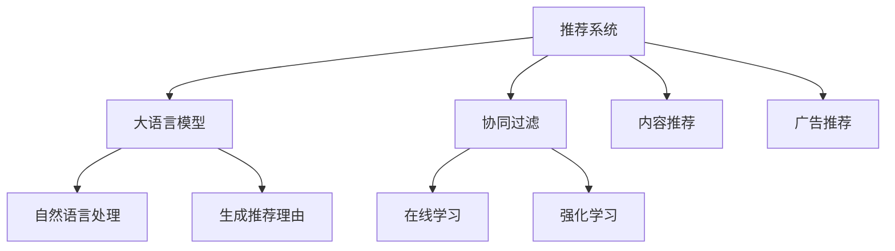

                 

# 利用LLM优化推荐系统的多场景适配

> 关键词：大语言模型,推荐系统,多场景适配,自然语言处理(NLP),协同过滤,深度学习,在线学习,强化学习,内容推荐,广告推荐

## 1. 背景介绍

### 1.1 问题由来
推荐系统在电商、社交、新闻等众多领域内应用广泛，承担着内容发现与推荐的重任。其核心任务是针对用户的个性化需求，从海量的商品或内容中筛选出最符合用户兴趣的候选项，从而提升用户体验、增加转化率、增加平台收入。然而，当前推荐系统存在如下问题：

- **多样性不足**：推荐系统往往聚焦于热门商品或内容，忽视了长尾商品或内容，难以满足用户多样化的需求。
- **冷启动困难**：新用户或新商品往往缺乏足够的历史行为数据，难以进行有效的个性化推荐。
- **模型过拟合**：在用户或商品稀疏的场景下，推荐模型容易发生过拟合，导致泛化能力不足。
- **动态变化性**：用户的兴趣和行为模式随时间动态变化，传统模型难以捕捉这些动态特征。
- **多场景适配性差**：推荐系统在不同场景下的行为逻辑、数据特点差异较大，统一建模难以兼顾各个场景。

近年来，基于深度学习的方法在推荐系统中得到了广泛应用，极大地提升了推荐效果。其中，基于大语言模型(Large Language Model, LLM)的推荐系统方法，因其能够理解文本语义、生成自然语言解释和推荐理由，成为新兴的推荐方向。然而，现有的大语言模型往往基于通用的无监督预训练，缺乏对推荐场景的深度适配，难以在具体应用中发挥最大效能。

本文聚焦于大语言模型在推荐系统中的多场景适配方法，利用LLM的语义理解能力和自然语言生成能力，在不同推荐场景下优化推荐效果。我们首先介绍推荐系统、大语言模型及协同过滤的原理，然后从推荐场景的差异入手，详细阐述LLM在不同推荐任务中的应用和优化策略，最后总结并展望未来。

## 2. 核心概念与联系

### 2.1 核心概念概述

为了更好地理解利用LLM优化推荐系统的多场景适配方法，本节将介绍几个密切相关的核心概念：

- **推荐系统**：利用用户行为数据和商品/内容特征信息，对用户进行建模并预测用户对商品的偏好程度，从而进行个性化推荐的技术。
- **大语言模型(LLM)**：通过自监督预训练或监督微调获取语义表示的语言模型，具备强大的语义理解能力和自然语言生成能力，如BERT、GPT、Transformer等。
- **协同过滤**：一种基于用户或商品相似性进行推荐的方法，分为基于用户的协同过滤和基于物品的协同过滤。
- **在线学习**：实时更新模型参数以适应新数据流的方法，一般用于处理动态变化的数据场景。
- **强化学习**：利用奖励信号引导模型选择最优决策的机器学习方法，常用于构建带有互动元素的推荐系统。
- **内容推荐**：基于内容属性进行推荐，如视频、书籍、新闻等内容的个性化推荐。
- **广告推荐**：基于广告属性进行推荐，如展示广告、点击广告、视频广告等形式的推荐。

这些核心概念之间的逻辑关系可以通过以下Mermaid流程图来展示：



这个流程图展示了大语言模型在推荐系统中的应用场景：

1. 推荐系统通过协同过滤等方法进行用户或商品建模。
2. 大语言模型理解语义，生成自然语言解释和推荐理由。
3. 协同过滤、在线学习和强化学习为推荐系统提供更智能的推荐策略。
4. 内容推荐和广告推荐是具体的应用场景，利用大语言模型进行多场景适配。

## 3. 核心算法原理 & 具体操作步骤
### 3.1 算法原理概述

利用LLM优化推荐系统的多场景适配，本质上是一个多任务学习和迁移学习的过程。其核心思想是：将大语言模型视作一个强大的语义理解工具，通过在不同类型的推荐场景上进行微调，使得模型能够适应不同的推荐任务和数据特点，从而提升推荐效果。

形式化地，假设推荐系统涉及 $N$ 种推荐任务 $T=\{T_1, T_2, ..., T_N\}$，每种任务的训练数据集为 $D=\{(x_i, y_i)\}_{i=1}^M$，其中 $x_i$ 为输入特征，$y_i$ 为输出标签。推荐系统的目标是找到最优的参数 $\theta$，使得模型 $M_{\theta}$ 在不同任务上的表现均达到最优：

$$
\theta^* = \mathop{\arg\min}_{\theta} \sum_{k=1}^N \mathcal{L}_k(M_{\theta},D_k)
$$

其中 $\mathcal{L}_k$ 为任务 $k$ 上的损失函数，通常为交叉熵损失、均方误差损失等。通过梯度下降等优化算法，微调过程不断更新模型参数 $\theta$，最小化损失函数 $\mathcal{L}$，使得模型输出逼近真实标签。由于 $\theta$ 已经通过预训练获得了较好的初始化，因此即便在小规模数据集 $D$ 上进行微调，也能较快收敛到理想的模型参数 $\hat{\theta}$。

### 3.2 算法步骤详解

利用LLM优化推荐系统的多场景适配，一般包括以下几个关键步骤：

**Step 1: 准备预训练模型和数据集**
- 选择合适的预训练语言模型 $M_{\theta}$ 作为初始化参数，如 BERT、GPT、XLNet 等。
- 准备推荐系统的不同推荐任务 $T$ 的训练集 $D=\{(x_i, y_i)\}_{i=1}^M$，划分为训练集、验证集和测试集。一般要求不同任务的标注数据与预训练数据的分布不要差异过大。

**Step 2: 任务适配层设计**
- 根据不同推荐任务的特点，设计合适的输出层和损失函数。
- 对于内容推荐任务，通常在顶层添加线性分类器和交叉熵损失函数。
- 对于广告推荐任务，通常使用语言模型的解码器输出概率分布，并以负对数似然为损失函数。

**Step 3: 设置微调超参数**
- 选择合适的优化算法及其参数，如 AdamW、SGD 等，设置学习率、批大小、迭代轮数等。
- 设置正则化技术及强度，包括权重衰减、Dropout、Early Stopping 等。
- 确定冻结预训练参数的策略，如仅微调顶层，或全部参数都参与微调。

**Step 4: 执行梯度训练**
- 将训练集数据分批次输入模型，前向传播计算损失函数。
- 反向传播计算参数梯度，根据设定的优化算法和学习率更新模型参数。
- 周期性在验证集上评估模型性能，根据性能指标决定是否触发 Early Stopping。
- 重复上述步骤直到满足预设的迭代轮数或 Early Stopping 条件。

**Step 5: 测试和部署**
- 在测试集上评估微调后模型 $M_{\hat{\theta}}$ 的性能，对比微调前后的精度提升。
- 使用微调后的模型对新样本进行推理预测，集成到实际的应用系统中。
- 持续收集新的数据，定期重新微调模型，以适应数据分布的变化。

以上是利用LLM优化推荐系统多场景适配的一般流程。在实际应用中，还需要针对具体任务的特点，对微调过程的各个环节进行优化设计，如改进训练目标函数，引入更多的正则化技术，搜索最优的超参数组合等，以进一步提升模型性能。

### 3.3 算法优缺点

利用LLM优化推荐系统的多场景适配方法具有以下优点：
1. 简单易用。利用大语言模型强大的语义理解能力，能够快速适配不同推荐场景，设计相对简单的任务适配层。
2. 泛化能力强。通过在多个推荐任务上进行微调，模型能够学习到不同场景下的通用知识，提升泛化能力。
3. 可解释性强。能够生成自然语言解释和推荐理由，增强用户对推荐结果的理解和信任。
4. 多任务学习。利用多任务学习机制，优化多个推荐任务，提高整体推荐效果。

同时，该方法也存在一定的局限性：
1. 数据依赖强。推荐任务的标注数据往往需要精心构建，成本较高，且数据质量对模型效果有较大影响。
2. 计算资源要求高。大语言模型参数量较大，训练和推理需要较高的计算资源。
3. 可扩展性差。不同推荐任务的适配层和微调策略可能需要大量人工干预，难以自动扩展。
4. 动态变化性差。难以实时更新模型以适应动态变化的用户行为数据。
5. 鲁棒性不足。在存在噪声或对抗样本的场景下，可能出现模型退化。

尽管存在这些局限性，但就目前而言，利用LLM优化推荐系统的方法仍是大规模推荐系统中一个重要方向。未来相关研究的重点在于如何进一步降低推荐任务对标注数据的依赖，提高模型的动态适应性，同时兼顾可解释性和鲁棒性等因素。

### 3.4 算法应用领域

利用大语言模型优化推荐系统的多场景适配方法，在电商、社交、新闻等众多领域内得到了广泛应用，覆盖了以下推荐场景：

- **内容推荐**：推荐视频、书籍、新闻等内容的个性化推荐，如Netflix、Amazon、今日头条等。
- **广告推荐**：推荐展示广告、点击广告、视频广告等形式的广告推荐，如Facebook、Google Ad、YouTube等。
- **推荐系统优化**：优化协同过滤、在线学习和强化学习等推荐算法，提升推荐效果，如Tencent EDA等。
- **个性化标签生成**：自动生成商品/内容的个性化标签，如词向量、实体识别等，辅助推荐系统优化。
- **自然语言生成**：利用自然语言生成技术，生成推荐理由或解释，增强用户对推荐结果的理解。

除了上述这些经典任务外，大语言模型在推荐系统的应用也在不断创新，如情感分析、多模态推荐、智能客服推荐等，为推荐技术带来了全新的突破。随着预训练语言模型和推荐方法的不断进步，相信推荐系统必将在更广阔的应用领域大放异彩。

## 4. 数学模型和公式 & 详细讲解
### 4.1 数学模型构建

本节将使用数学语言对利用大语言模型优化推荐系统的多场景适配过程进行更加严格的刻画。

记推荐系统涉及 $N$ 种推荐任务 $T=\{T_1, T_2, ..., T_N\}$，每种任务的训练集为 $D=\{(x_i, y_i)\}_{i=1}^M$，其中 $x_i$ 为输入特征，$y_i$ 为输出标签。定义模型 $M_{\theta}$ 在输入特征 $x$ 上的输出为 $\hat{y}=M_{\theta}(x)$。推荐系统的目标是找到最优参数 $\theta$，使得模型在各个任务上均取得最小损失：

$$
\theta^* = \mathop{\arg\min}_{\theta} \sum_{k=1}^N \mathcal{L}_k(M_{\theta},D_k)
$$

其中 $\mathcal{L}_k$ 为任务 $k$ 上的损失函数，通常为交叉熵损失、均方误差损失等。定义任务 $k$ 上的经验风险为：

$$
\mathcal{L}_k(\theta) = \frac{1}{M}\sum_{i=1}^M \ell_k(M_{\theta}(x_i),y_i)
$$

在实际应用中，我们通常使用基于梯度的优化算法（如SGD、Adam等）来近似求解上述最优化问题。设 $\eta$ 为学习率，$\lambda$ 为正则化系数，则参数的更新公式为：

$$
\theta \leftarrow \theta - \eta \nabla_{\theta}\mathcal{L}(\theta) - \eta\lambda\theta
$$

其中 $\nabla_{\theta}\mathcal{L}(\theta)$ 为损失函数对参数 $\theta$ 的梯度，可通过反向传播算法高效计算。

### 4.2 公式推导过程

以下我们以内容推荐任务为例，推导交叉熵损失函数及其梯度的计算公式。

假设模型 $M_{\theta}$ 在输入特征 $x$ 上的输出为 $\hat{y}=M_{\theta}(x) \in [0,1]$，表示物品 $x$ 被用户 $i$ 推荐的概率。真实标签 $y_i \in \{0,1\}$，为1表示物品 $x$ 被用户 $i$ 推荐。则交叉熵损失函数定义为：

$$
\ell_k(M_{\theta}(x_i),y_i) = -[y_i\log \hat{y} + (1-y_i)\log (1-\hat{y})]
$$

将其代入经验风险公式，得：

$$
\mathcal{L}_k(\theta) = -\frac{1}{M}\sum_{i=1}^M [y_i\log M_{\theta}(x_i)+(1-y_i)\log(1-M_{\theta}(x_i))]
$$

根据链式法则，损失函数对参数 $\theta_k$ 的梯度为：

$$
\frac{\partial \mathcal{L}_k(\theta)}{\partial \theta_k} = -\frac{1}{M}\sum_{i=1}^M (\frac{y_i}{M_{\theta}(x_i)}-\frac{1-y_i}{1-M_{\theta}(x_i)}) \frac{\partial M_{\theta}(x_i)}{\partial \theta_k}
$$

其中 $\frac{\partial M_{\theta}(x_i)}{\partial \theta_k}$ 可进一步递归展开，利用自动微分技术完成计算。

在得到损失函数的梯度后，即可带入参数更新公式，完成模型的迭代优化。重复上述过程直至收敛，最终得到适应不同推荐任务的最优模型参数 $\theta^*$。

## 5. 项目实践：代码实例和详细解释说明
### 5.1 开发环境搭建

在进行推荐系统多场景适配的实践前，我们需要准备好开发环境。以下是使用Python进行PyTorch开发的环境配置流程：

1. 安装Anaconda：从官网下载并安装Anaconda，用于创建独立的Python环境。

2. 创建并激活虚拟环境：
```bash
conda create -n pytorch-env python=3.8 
conda activate pytorch-env
```

3. 安装PyTorch：根据CUDA版本，从官网获取对应的安装命令。例如：
```bash
conda install pytorch torchvision torchaudio cudatoolkit=11.1 -c pytorch -c conda-forge
```

4. 安装TensorFlow：
```bash
conda install tensorflow
```

5. 安装Transformers库：
```bash
pip install transformers
```

6. 安装各类工具包：
```bash
pip install numpy pandas scikit-learn matplotlib tqdm jupyter notebook ipython
```

完成上述步骤后，即可在`pytorch-env`环境中开始推荐系统多场景适配的实践。

### 5.2 源代码详细实现

下面我们以内容推荐任务为例，给出使用Transformers库对BERT模型进行微调的PyTorch代码实现。

首先，定义推荐任务的数据处理函数：

```python
from transformers import BertTokenizer
from torch.utils.data import Dataset
import torch

class RecommendationDataset(Dataset):
    def __init__(self, features, labels, tokenizer, max_len=128):
        self.features = features
        self.labels = labels
        self.tokenizer = tokenizer
        self.max_len = max_len
        
    def __len__(self):
        return len(self.features)
    
    def __getitem__(self, item):
        feature = self.features[item]
        label = self.labels[item]
        
        encoding = self.tokenizer(feature, return_tensors='pt', max_length=self.max_len, padding='max_length', truncation=True)
        input_ids = encoding['input_ids'][0]
        attention_mask = encoding['attention_mask'][0]
        
        encoded_label = torch.tensor(label, dtype=torch.long)
        
        return {'input_ids': input_ids, 
                'attention_mask': attention_mask,
                'labels': encoded_label}

# 定义标签与id的映射
tag2id = {'0': 0, '1': 1}
id2tag = {v: k for k, v in tag2id.items()}

# 创建dataset
tokenizer = BertTokenizer.from_pretrained('bert-base-cased')

train_dataset = RecommendationDataset(train_features, train_labels, tokenizer)
dev_dataset = RecommendationDataset(dev_features, dev_labels, tokenizer)
test_dataset = RecommendationDataset(test_features, test_labels, tokenizer)
```

然后，定义模型和优化器：

```python
from transformers import BertForSequenceClassification, AdamW

model = BertForSequenceClassification.from_pretrained('bert-base-cased', num_labels=len(tag2id))

optimizer = AdamW(model.parameters(), lr=2e-5)
```

接着，定义训练和评估函数：

```python
from torch.utils.data import DataLoader
from tqdm import tqdm
from sklearn.metrics import classification_report

device = torch.device('cuda') if torch.cuda.is_available() else torch.device('cpu')
model.to(device)

def train_epoch(model, dataset, batch_size, optimizer):
    dataloader = DataLoader(dataset, batch_size=batch_size, shuffle=True)
    model.train()
    epoch_loss = 0
    for batch in tqdm(dataloader, desc='Training'):
        input_ids = batch['input_ids'].to(device)
        attention_mask = batch['attention_mask'].to(device)
        labels = batch['labels'].to(device)
        model.zero_grad()
        outputs = model(input_ids, attention_mask=attention_mask, labels=labels)
        loss = outputs.loss
        epoch_loss += loss.item()
        loss.backward()
        optimizer.step()
    return epoch_loss / len(dataloader)

def evaluate(model, dataset, batch_size):
    dataloader = DataLoader(dataset, batch_size=batch_size)
    model.eval()
    preds, labels = [], []
    with torch.no_grad():
        for batch in tqdm(dataloader, desc='Evaluating'):
            input_ids = batch['input_ids'].to(device)
            attention_mask = batch['attention_mask'].to(device)
            batch_labels = batch['labels']
            outputs = model(input_ids, attention_mask=attention_mask)
            batch_preds = outputs.logits.argmax(dim=2).to('cpu').tolist()
            batch_labels = batch_labels.to('cpu').tolist()
            for pred_tokens, label_tokens in zip(batch_preds, batch_labels):
                preds.append(pred_tokens[:len(label_tokens)])
                labels.append(label_tokens)
                
    print(classification_report(labels, preds))
```

最后，启动训练流程并在测试集上评估：

```python
epochs = 5
batch_size = 16

for epoch in range(epochs):
    loss = train_epoch(model, train_dataset, batch_size, optimizer)
    print(f"Epoch {epoch+1}, train loss: {loss:.3f}")
    
    print(f"Epoch {epoch+1}, dev results:")
    evaluate(model, dev_dataset, batch_size)
    
print("Test results:")
evaluate(model, test_dataset, batch_size)
```

以上就是使用PyTorch对BERT进行内容推荐任务微调的完整代码实现。可以看到，得益于Transformers库的强大封装，我们可以用相对简洁的代码完成BERT模型的加载和微调。

### 5.3 代码解读与分析

让我们再详细解读一下关键代码的实现细节：

**RecommendationDataset类**：
- `__init__`方法：初始化特征、标签、分词器等关键组件。
- `__len__`方法：返回数据集的样本数量。
- `__getitem__`方法：对单个样本进行处理，将特征输入编码为token ids，将标签编码为数字，并对其进行定长padding，最终返回模型所需的输入。

**tag2id和id2tag字典**：
- 定义了标签与数字id之间的映射关系，用于将token-wise的预测结果解码回真实的标签。

**训练和评估函数**：
- 使用PyTorch的DataLoader对数据集进行批次化加载，供模型训练和推理使用。
- 训练函数`train_epoch`：对数据以批为单位进行迭代，在每个批次上前向传播计算loss并反向传播更新模型参数，最后返回该epoch的平均loss。
- 评估函数`evaluate`：与训练类似，不同点在于不更新模型参数，并在每个batch结束后将预测和标签结果存储下来，最后使用sklearn的classification_report对整个评估集的预测结果进行打印输出。

**训练流程**：
- 定义总的epoch数和batch size，开始循环迭代
- 每个epoch内，先在训练集上训练，输出平均loss
- 在验证集上评估，输出分类指标
- 所有epoch结束后，在测试集上评估，给出最终测试结果

可以看到，PyTorch配合Transformers库使得BERT微调的内容推荐任务的代码实现变得简洁高效。开发者可以将更多精力放在数据处理、模型改进等高层逻辑上，而不必过多关注底层的实现细节。

当然，工业级的系统实现还需考虑更多因素，如模型的保存和部署、超参数的自动搜索、更灵活的任务适配层等。但核心的微调范式基本与此类似。

## 6. 实际应用场景
### 6.1 智能推荐引擎

基于大语言模型优化推荐系统的多场景适配方法，可以广泛应用于智能推荐引擎的构建。推荐引擎承担着内容发现与推荐的重任，能够大幅提升用户体验、增加转化率、增加平台收入。利用微调后的内容推荐模型，可以更加精准地为用户推荐个性化内容，提升点击率和留存率。

在技术实现上，可以收集用户的历史浏览、点击、评论、分享等行为数据，提取和商品交互的物品标题、描述、标签等文本内容。将文本内容作为模型输入，用户的后续行为（如是否点击、购买等）作为监督信号，在此基础上微调预训练语言模型。微调后的模型能够从文本内容中准确把握用户的兴趣点。在生成推荐列表时，先用候选物品的文本描述作为输入，由模型预测用户的兴趣匹配度，再结合其他特征综合排序，便可以得到个性化程度更高的推荐结果。

### 6.2 广告推荐系统

广告推荐系统通过向用户展示有价值的内容，实现流量变现。广告推荐系统需要动态地为每个用户匹配最合适的广告内容，以提高点击率和转化率。利用微调后的广告推荐模型，可以更加精准地为用户推荐广告，提升广告投放效果。

在技术实现上，可以收集用户的点击、展示、购买等广告行为数据，提取广告的标题、描述、标签等文本内容。将文本内容作为模型输入，用户的后续行为（如是否点击、购买等）作为监督信号，在此基础上微调预训练语言模型。微调后的模型能够从文本内容中准确把握用户的兴趣点，生成有吸引力的广告内容。在推荐广告时，通过广告的标题、描述、图片等特征信息进行多模态融合，得到更加精准的推荐结果。

### 6.3 电商个性化推荐

电商推荐系统需要为每个用户推荐个性化的商品，以增加用户的购买率和平台收益。利用微调后的电商推荐模型，可以更加精准地为用户推荐商品，提升点击率和转化率。

在技术实现上，可以收集用户的历史浏览、点击、购买等行为数据，提取商品的标题、描述、标签等文本内容。将文本内容作为模型输入，用户的后续行为（如是否购买、点击等）作为监督信号，在此基础上微调预训练语言模型。微调后的模型能够从文本内容中准确把握用户的兴趣点，生成个性化推荐结果。在推荐商品时，通过商品的图片、评论、评分等多模态信息进行融合，得到更加精准的推荐结果。

### 6.4 未来应用展望

随着大语言模型和微调方法的不断发展，利用LLM优化推荐系统的多场景适配技术也将呈现以下趋势：

1. **模型规模增大**：超大规模语言模型蕴含的丰富语言知识，有望支撑更加复杂多变的推荐任务微调。
2. **任务适配层设计多样化**：不同推荐任务具有不同的逻辑和数据特点，适配层的优化设计将成为重要研究方向。
3. **动态变化性提升**：推荐系统需要适应用户行为模式的动态变化，未来的微调方法需要具备实时更新的能力。
4. **多模态融合增强**：将视觉、语音等多模态信息与文本信息进行深度融合，提升推荐系统的智能化水平。
5. **增强可解释性**：通过生成自然语言解释和推荐理由，增强用户对推荐结果的理解和信任。

以上趋势凸显了大语言模型微调方法在推荐系统中的广泛应用前景。这些方向的探索发展，必将进一步提升推荐系统的效果和用户满意度，为推荐技术的产业化进程提供新的动力。

## 7. 工具和资源推荐
### 7.1 学习资源推荐

为了帮助开发者系统掌握大语言模型优化推荐系统的多场景适配方法，这里推荐一些优质的学习资源：

1. 《深度学习推荐系统》书籍：全面介绍了深度学习推荐系统的原理和实践，包含协同过滤、在线学习、强化学习等推荐技术。
2. 《Recommender Systems: Algorithms, Recommendations, and Applications》书籍：从理论到实践，全面介绍了推荐系统的发展历程和最新研究。
3. CS4676《推荐系统》课程：斯坦福大学开设的推荐系统课程，有Lecture视频和配套作业，适合推荐系统领域的深入学习。
4. Kaggle推荐系统竞赛：Kaggle平台上的推荐系统竞赛，包括内容推荐、广告推荐、电商推荐等多个任务，提供了丰富的数据集和代码实现。
5. arXiv上的推荐系统论文：arXiv上的推荐系统论文库，提供了最新的学术研究进展和实现代码。

通过对这些资源的学习实践，相信你一定能够快速掌握大语言模型优化推荐系统的精髓，并用于解决实际的推荐问题。
###  7.2 开发工具推荐

高效的开发离不开优秀的工具支持。以下是几款用于推荐系统多场景适配开发的常用工具：

1. PyTorch：基于Python的开源深度学习框架，灵活动态的计算图，适合快速迭代研究。大部分预训练语言模型都有PyTorch版本的实现。
2. TensorFlow：由Google主导开发的开源深度学习框架，生产部署方便，适合大规模工程应用。同样有丰富的预训练语言模型资源。
3. Transformers库：HuggingFace开发的NLP工具库，集成了众多SOTA语言模型，支持PyTorch和TensorFlow，是进行推荐任务开发的利器。
4. Weights & Biases：模型训练的实验跟踪工具，可以记录和可视化模型训练过程中的各项指标，方便对比和调优。与主流深度学习框架无缝集成。
5. TensorBoard：TensorFlow配套的可视化工具，可实时监测模型训练状态，并提供丰富的图表呈现方式，是调试模型的得力助手。
6. Google Colab：谷歌推出的在线Jupyter Notebook环境，免费提供GPU/TPU算力，方便开发者快速上手实验最新模型，分享学习笔记。

合理利用这些工具，可以显著提升推荐系统多场景适配任务的开发效率，加快创新迭代的步伐。

### 7.3 相关论文推荐

大语言模型和推荐系统的发展源于学界的持续研究。以下是几篇奠基性的相关论文，推荐阅读：

1. Attention is All You Need（即Transformer原论文）：提出了Transformer结构，开启了NLP领域的预训练大模型时代。
2. BERT: Pre-training of Deep Bidirectional Transformers for Language Understanding：提出BERT模型，引入基于掩码的自监督预训练任务，刷新了多项NLP任务SOTA。
3. Introduction to Deep Learning for Recommendation Systems：介绍了深度学习在推荐系统中的应用，包含协同过滤、在线学习、强化学习等技术。
4. Comprehensive Analysis of Recommendation System: A Survey：对推荐系统的发展历程和最新研究进行了全面的综述。
5. Deep Learning Recommender Systems: A Survey and Outlook：综述了深度学习在推荐系统中的应用，展望了未来发展方向。

这些论文代表了大语言模型和推荐系统的发展脉络。通过学习这些前沿成果，可以帮助研究者把握学科前进方向，激发更多的创新灵感。

## 8. 总结：未来发展趋势与挑战

### 8.1 总结

本文对利用大语言模型优化推荐系统的多场景适配方法进行了全面系统的介绍。首先阐述了推荐系统、大语言模型及协同过滤的原理，明确了微调在优化推荐系统性能、提升推荐效果方面的独特价值。其次，从推荐场景的差异入手，详细阐述LLM在不同推荐任务中的应用和优化策略，最后总结并展望了未来。

通过本文的系统梳理，可以看到，利用大语言模型优化推荐系统的方法正在成为推荐系统中一个重要方向，极大地拓展了预训练语言模型的应用边界，催生了更多的落地场景。得益于大语言模型强大的语义理解能力和自然语言生成能力，推荐系统能够更好地满足用户多样化的需求，提升推荐效果和用户体验。未来，伴随大语言模型和推荐方法的不断进步，推荐系统必将在更广阔的应用领域大放异彩，深刻影响人类的生产生活方式。

### 8.2 未来发展趋势

展望未来，大语言模型优化推荐系统的多场景适配技术将呈现以下几个发展趋势：

1. **模型规模持续增大**。随着算力成本的下降和数据规模的扩张，预训练语言模型的参数量还将持续增长。超大规模语言模型蕴含的丰富语言知识，有望支撑更加复杂多变的推荐任务微调。
2. **多任务学习**。利用多任务学习机制，优化多个推荐任务，提高整体推荐效果。
3. **动态变化性增强**。推荐系统需要适应用户行为模式的动态变化，未来的微调方法需要具备实时更新的能力。
4. **多模态融合增强**。将视觉、语音等多模态信息与文本信息进行深度融合，提升推荐系统的智能化水平。
5. **增强可解释性**。通过生成自然语言解释和推荐理由，增强用户对推荐结果的理解和信任。

以上趋势凸显了大语言模型优化推荐系统方法在推荐系统中的广泛应用前景。这些方向的探索发展，必将进一步提升推荐系统的效果和用户满意度，为推荐技术的产业化进程提供新的动力。

### 8.3 面临的挑战

尽管大语言模型优化推荐系统的多场景适配方法已经取得了瞩目成就，但在迈向更加智能化、普适化应用的过程中，它仍面临着诸多挑战：

1. **数据依赖强**。推荐任务的标注数据往往需要精心构建，成本较高，且数据质量对模型效果有较大影响。
2. **计算资源要求高**。大语言模型参数量较大，训练和推理需要较高的计算资源。
3. **动态变化性差**。难以实时更新模型以适应动态变化的用户行为数据。
4. **可解释性不足**。难以解释其内部工作机制和决策逻辑，特别是在处理对抗样本或噪声数据时。
5. **鲁棒性不足**。在存在噪声或对抗样本的场景下，可能出现模型退化。

尽管存在这些局限性，但就目前而言，利用LLM优化推荐系统的方法仍是大规模推荐系统中一个重要方向。未来相关研究的重点在于如何进一步降低推荐任务对标注数据的依赖，提高模型的动态适应性，同时兼顾可解释性和鲁棒性等因素。

### 8.4 研究展望

面对大语言模型优化推荐系统所面临的挑战，未来的研究需要在以下几个方面寻求新的突破：

1. **探索无监督和半监督微调方法**。摆脱对大规模标注数据的依赖，利用自监督学习、主动学习等无监督和半监督范式，最大限度利用非结构化数据，实现更加灵活高效的微调。
2. **开发参数高效和计算高效的微调范式**。开发更加参数高效的微调方法，在固定大部分预训练参数的同时，只更新极少量的任务相关参数。同时优化微调模型的计算图，减少前向传播和反向传播的资源消耗，实现更加轻量级、实时性的部署。
3. **引入更多先验知识**。将符号化的先验知识，如知识图谱、逻辑规则等，与神经网络模型进行巧妙融合，引导微调过程学习更准确、合理的语言模型。同时加强不同模态数据的整合，实现视觉、语音等多模态信息与文本信息的协同建模。
4. **结合因果分析和博弈论工具**。将因果分析方法引入微调模型，识别出模型决策的关键特征，增强输出解释的因果性和逻辑性。借助博弈论工具刻画人机交互过程，主动探索并规避模型的脆弱点，提高系统稳定性。
5. **纳入伦理道德约束**。在模型训练目标中引入伦理导向的评估指标，过滤和惩罚有偏见、有害的输出倾向。同时加强人工干预和审核，建立模型行为的监管机制，确保输出符合人类价值观和伦理道德。

这些研究方向的探索，必将引领大语言模型优化推荐系统技术迈向更高的台阶，为构建安全、可靠、可解释、可控的智能推荐系统铺平道路。面向未来，大语言模型优化推荐系统技术还需要与其他人工智能技术进行更深入的融合，如知识表示、因果推理、强化学习等，多路径协同发力，共同推动推荐系统的进步。只有勇于创新、敢于突破，才能不断拓展语言模型的边界，让智能技术更好地造福人类社会。

## 9. 附录：常见问题与解答

**Q1：大语言模型优化推荐系统是否适用于所有推荐场景？**

A: 大语言模型优化推荐系统方法在大多数推荐场景上都能取得不错的效果，特别是对于数据量较小的任务。但对于一些特定领域的任务，如医学、法律等，仅仅依靠通用语料预训练的模型可能难以很好地适应。此时需要在特定领域语料上进一步预训练，再进行微调，才能获得理想效果。此外，对于一些需要时效性、个性化很强的任务，如对话推荐、实时广告推荐等，微调方法也需要针对性的改进优化。

**Q2：微调过程中如何选择合适的学习率？**

A: 微调的学习率一般要比预训练时小1-2个数量级，如果使用过大的学习率，容易破坏预训练权重，导致过拟合。一般建议从1e-5开始调参，逐步减小学习率，直至收敛。也可以使用warmup策略，在开始阶段使用较小的学习率，再逐渐过渡到预设值。需要注意的是，不同的优化器(如AdamW、Adafactor等)以及不同的学习率调度策略，可能需要设置不同的学习率阈值。

**Q3：采用大语言模型微调时会面临哪些资源瓶颈？**

A: 目前主流的预训练大模型动辄以亿计的参数规模，对算力、内存、存储都提出了很高的要求。GPU/TPU等高性能设备是必不可少的，但即便如此，超大批次的训练和推理也可能遇到显存不足的问题。因此需要采用一些资源优化技术，如梯度积累、混合精度训练、模型并行等，来突破硬件瓶颈。同时，模型的存储和读取也可能占用大量时间和空间，需要采用模型压缩、稀疏化存储等方法进行优化。

**Q4：如何缓解微调过程中的过拟合问题？**

A: 过拟合是微调面临的主要挑战，尤其是在标注数据不足的情况下。常见的缓解策略包括：
1. 数据增强：通过回译、近义替换等方式扩充训练集
2. 正则化：使用L2正则、Dropout、Early Stopping 等避免过拟合
3. 对抗训练：引入对抗样本，提高模型鲁棒性
4. 参数高效微调：只调整少量参数(如Adapter、Prefix等)，减小过拟合风险
5. 多模型集成：训练多个微调模型，取平均输出，抑制过拟合

这些策略往往需要根据具体任务和数据特点进行灵活组合。只有在数据、模型、训练、推理等各环节进行全面优化，才能最大限度地发挥大语言模型微调的威力。

**Q5：利用LLM优化推荐系统时需要注意哪些问题？**

A: 利用LLM优化推荐系统时，需要注意以下问题：
1. 数据收集和预处理：收集高质量的推荐数据和标签，进行清洗、归一化等预处理。
2. 任务适配层的优化设计：根据推荐任务的特点，设计合适的输出层和损失函数，提升推荐效果。
3. 模型裁剪和优化：去除不必要的层和参数，减小模型尺寸，加快推理速度。
4. 模型压缩和稀疏化：采用模型压缩、稀疏化存储等方法，优化模型的存储和推理效率。
5. 动态变化性的处理：利用在线学习等技术，实时更新模型以适应动态变化的用户行为数据。
6. 鲁棒性和可解释性的增强：引入对抗训练、生成自然语言解释等技术，提高模型的鲁棒性和可解释性。

利用LLM优化推荐系统的方法需要综合考虑数据、模型、训练、推理等多方面因素，进行全面优化。只有在各个环节进行协同发力，才能真正实现大语言模型在推荐系统中的最大效能。

---

作者：禅与计算机程序设计艺术 / Zen and the Art of Computer Programming

