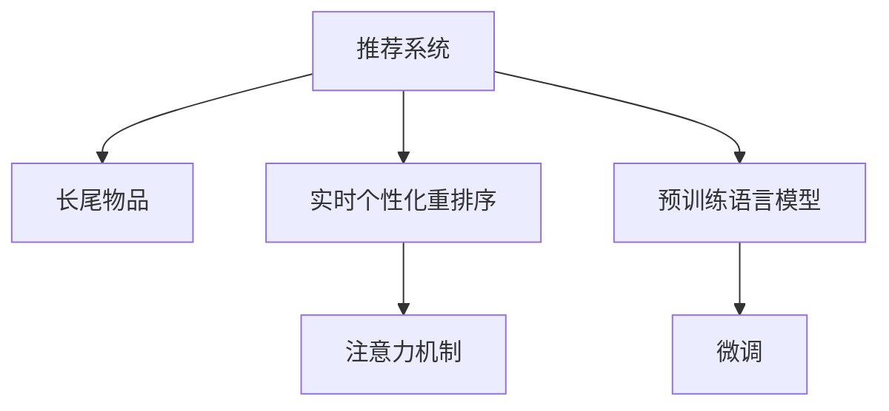

                 

# 利用LLM优化推荐系统的实时个性化重排序

> 关键词：推荐系统, 长尾物品, 实时个性化, 注意力机制, 微调, 预训练语言模型(LLM)

## 1. 背景介绍

随着电子商务平台的发展，推荐系统已成为用户获取商品信息的重要方式。通过分析用户的浏览历史、购买行为、社交关系等数据，推荐系统能够为每个用户量身定制个性化的商品推荐，提升用户体验和平台转化率。然而，传统推荐系统面临的最大挑战之一是"长尾效应"。即大部分推荐系统算法更倾向于推荐那些热门商品，而对那些销量较低但用户评价较高的长尾物品(即冷门商品)关注较少。

在应对长尾物品推荐问题上，现代推荐系统主要依赖于用户交互数据（如点击、购买记录等）。由于用户数据分布不均，长尾物品往往难以获得足够的样本量，成为推荐的难点。例如，Amazon上的大部分长尾物品(如厨房用具)只被购买了一次，不足以构成有效训练样本，因此传统推荐算法难以捕捉到它们的用户价值。

基于深度学习的推荐系统则能够更好地应对这一问题。特别是在引入预训练语言模型(Pre-trained Language Model, LLM)后，推荐系统能够从丰富的自然语言数据中挖掘用户偏好，有效解决长尾物品推荐难题。本文将详细探讨如何利用大语言模型（Large Language Model, LLM）优化推荐系统，并给出一种基于LLM的实时个性化重排序方案。

## 2. 核心概念与联系

### 2.1 核心概念概述

为更好地理解基于LLM的推荐系统优化方法，本节将介绍几个密切相关的核心概念：

- 推荐系统(Recommendation System, RS)：利用用户行为数据，为用户推荐可能感兴趣的物品。推荐系统通过算法模型预测用户对物品的兴趣程度，从而提供个性化推荐。
- 长尾物品(Long Tail Items)：指那些销量较低，但在特定群体中有较高需求的物品，是推荐系统难以覆盖的盲点。
- 实时个性化重排序(Real-time Personalized Reranking)：指在初步推荐基础上，根据用户行为数据，动态调整推荐结果，增强推荐的相关性和多样性。
- 注意力机制(Attention Mechanism)：一种模仿人类注意机制的技术，用于从多个输入中提取出对特定任务重要的特征。
- 预训练语言模型(Pre-trained Language Model, LLM)：通过在海量文本数据上进行自监督学习得到的通用语言模型，具备强大的语言理解和生成能力。
- 微调(Fine-tuning)：指在预训练模型的基础上，使用下游任务的少量标注数据进行有监督学习，优化模型在特定任务上的性能。

这些概念之间的逻辑关系可以通过以下Mermaid流程图来展示：



这个流程图展示了大语言模型与推荐系统的核心概念及其之间的关系：

1. 推荐系统通过长尾物品识别用户未被发现的需求，提高平台的商品覆盖率。
2. 实时个性化重排序在初步推荐基础上，通过动态调整推荐结果，进一步提升推荐的相关性和多样性。
3. 注意力机制用于从多个输入中提取关键特征，有助于提高推荐系统的准确性和效率。
4. 预训练语言模型通过大量无标签文本数据预训练，学习通用的语言表示。
5. 微调在预训练模型的基础上，通过有监督学习，优化模型在特定任务（如长尾物品推荐）上的性能。

## 3. 核心算法原理 & 具体操作步骤
### 3.1 算法原理概述

基于LLM的推荐系统优化方法，其核心思想是利用LLM从自然语言文本中挖掘用户的隐式需求，将其转化为推荐系统的输入特征，提升推荐系统的准确性和覆盖率。

具体而言，基于LLM的推荐系统优化方法可分为两个步骤：

**Step 1: 预训练语言模型的引入**
- 选择适合的长尾物品描述文本，如产品介绍、用户评价等。
- 使用预训练语言模型（如BERT、GPT等）对文本进行预训练，提取其语义表示。
- 将预训练模型的语义表示作为推荐系统的特征输入，丰富推荐系统的语义理解能力。

**Step 2: 微调与实时重排序**
- 根据用户的短期行为数据（如点击、浏览等），使用微调方法对预训练模型进行有监督学习，优化其在特定任务（如长尾物品推荐）上的性能。
- 在推荐系统中，将微调后的模型作为特征提取器，提取用户行为数据的语义特征。
- 引入注意力机制，根据用户行为数据中不同的特征重要性，动态调整推荐结果的排序，实现实时个性化重排序。

### 3.2 算法步骤详解

基于LLM的推荐系统优化方法步骤如下：

1. **数据收集**：收集长尾物品的描述文本，如产品介绍、用户评价等。

2. **预训练**：使用预训练语言模型（如BERT）对文本进行预训练，提取其语义表示。具体做法是，将文本输入预训练模型，获取其表示向量。

3. **特征提取**：将预训练模型的语义表示作为推荐系统的输入特征，丰富推荐系统的语义理解能力。

4. **微调**：根据用户的短期行为数据（如点击、浏览等），使用微调方法对预训练模型进行有监督学习，优化其在特定任务（如长尾物品推荐）上的性能。微调方法的具体实现，包括但不限于全参数微调、参数高效微调、梯度裁剪等。

5. **实时重排序**：在推荐系统中，将微调后的模型作为特征提取器，提取用户行为数据的语义特征。引入注意力机制，根据用户行为数据中不同的特征重要性，动态调整推荐结果的排序，实现实时个性化重排序。

### 3.3 算法优缺点

基于LLM的推荐系统优化方法具有以下优点：

1. **覆盖长尾物品**：LLM能够从自然语言数据中挖掘用户需求，弥补传统推荐系统对长尾物品的覆盖不足，提升推荐系统的商品覆盖率。
2. **提升推荐效果**：利用LLM强大的语义理解能力，提高推荐系统的准确性和多样性，增强用户的满意度。
3. **可解释性强**：预训练和微调过程都具有很强的可解释性，便于对推荐系统的决策过程进行理解和优化。

同时，该方法也存在以下局限性：

1. **计算成本高**：预训练和微调过程需要大量计算资源，可能对中小型推荐系统难以负担。
2. **数据需求大**：尽管基于LLM的方法可以利用自然语言数据，但实际应用中仍需要收集大量标注数据，对标注工作量有一定要求。
3. **模型泛化能力**：LLM的预训练和微调过程可能依赖于特定领域的数据，泛化到新领域的效果需要进一步验证。

尽管存在这些局限性，但就目前而言，基于LLM的推荐系统优化方法仍是一种高效且有效的技术手段，能够显著提升推荐系统的性能和用户体验。

### 3.4 算法应用领域

基于LLM的推荐系统优化方法在多个领域得到了广泛应用，例如：

- 电商平台：利用LLM优化推荐算法，提升长尾商品曝光率，增加平台商品多样性。
- 在线视频平台：基于用户评论和视频描述，利用LLM提高推荐系统的准确性，增强用户观影体验。
- 音乐流媒体平台：利用用户评论和歌词描述，提取用户隐式偏好，推荐更多高质量的冷门歌曲。
- 在线图书推荐：利用书籍描述和用户评论，优化推荐算法，提升长尾书籍推荐的效果。

除了这些典型应用外，LLM在医疗、旅游、教育等众多领域也有望获得新的应用，为人们提供更全面、个性化的推荐服务。

## 4. 数学模型和公式 & 详细讲解  
### 4.1 数学模型构建

假设推荐系统中有$N$个用户，$M$个物品，用户与物品之间的关系矩阵为$X \in \mathbb{R}^{N \times M}$，其中$X_{ij}=1$表示用户$i$对物品$j$感兴趣，否则为0。令$Y \in \mathbb{R}^{N \times 1}$为用户的兴趣标签向量，其中$Y_i=\{y_{ij}\}_{j=1}^M$为用户$i$对物品$j$的兴趣标签。我们的目标是最大化预测准确率。

设$\theta$为微调模型的参数，在训练数据集$D$上，微调模型的目标函数为：

$$
\mathcal{L}(\theta; D) = -\frac{1}{N} \sum_{i=1}^N \sum_{j=1}^M (y_{ij} \log p_{ij} + (1 - y_{ij}) \log (1 - p_{ij}))
$$

其中$p_{ij} = \sigma(\theta^T f(X_i, X_j))$为物品$j$对用户$i$的预测概率，$\sigma(\cdot)$为sigmoid函数。$f(X_i, X_j)$为微调模型对用户$i$和物品$j$的特征映射函数。

### 4.2 公式推导过程

利用sigmoid函数和交叉熵损失函数，可以将微调目标函数转化为：

$$
\mathcal{L}(\theta; D) = -\frac{1}{N} \sum_{i=1}^N \sum_{j=1}^M y_{ij} \log \frac{e^{\theta^T f(X_i, X_j)}}{\sum_{k=1}^M e^{\theta^T f(X_i, X_k)}} + (1 - y_{ij}) \log \frac{1 - e^{\theta^T f(X_i, X_j)}}{1 - \sum_{k=1}^M e^{\theta^T f(X_i, X_k)}}
$$

通过梯度下降等优化算法，最小化损失函数$\mathcal{L}(\theta; D)$，不断调整参数$\theta$，最终得到优化后的微调模型，用于推荐系统中的实时个性化重排序。

### 4.3 案例分析与讲解

以Amazon上的长尾物品推荐为例，我们首先收集该物品的描述文本，如产品介绍、用户评价等。利用BERT等预训练语言模型对文本进行预训练，获取其语义表示向量。然后将这些语义向量作为推荐系统的输入特征，构建新的推荐矩阵$X'$。

接着，对微调模型进行有监督学习，优化其在长尾物品推荐任务上的性能。在实际推荐过程中，根据用户的短期行为数据（如点击、浏览等），提取用户行为数据的语义特征，使用注意力机制调整推荐结果的排序，实现实时个性化重排序。

## 5. 项目实践：代码实例和详细解释说明
### 5.1 开发环境搭建

在进行基于LLM的推荐系统开发前，我们需要准备好开发环境。以下是使用Python进行PyTorch开发的环境配置流程：

1. 安装Anaconda：从官网下载并安装Anaconda，用于创建独立的Python环境。

2. 创建并激活虚拟环境：
```bash
conda create -n pytorch-env python=3.8 
conda activate pytorch-env
```

3. 安装PyTorch：根据CUDA版本，从官网获取对应的安装命令。例如：
```bash
conda install pytorch torchvision torchaudio cudatoolkit=11.1 -c pytorch -c conda-forge
```

4. 安装Transformers库：
```bash
pip install transformers
```

5. 安装各类工具包：
```bash
pip install numpy pandas scikit-learn matplotlib tqdm jupyter notebook ipython
```

完成上述步骤后，即可在`pytorch-env`环境中开始开发实践。

### 5.2 源代码详细实现

这里我们以Amazon长尾物品推荐为例，给出基于BERT的推荐系统优化方法的代码实现。

首先，定义数据处理函数：

```python
from transformers import BertTokenizer
from torch.utils.data import Dataset, DataLoader
from transformers import BertForSequenceClassification
import torch

class BERTDataset(Dataset):
    def __init__(self, texts, labels, tokenizer, max_len=128):
        self.texts = texts
        self.labels = labels
        self.tokenizer = tokenizer
        self.max_len = max_len
        
    def __len__(self):
        return len(self.texts)
    
    def __getitem__(self, item):
        text = self.texts[item]
        label = self.labels[item]
        
        encoding = self.tokenizer(text, return_tensors='pt', max_length=self.max_len, padding='max_length', truncation=True)
        input_ids = encoding['input_ids'][0]
        attention_mask = encoding['attention_mask'][0]
        label_ids = encoding['labels'][0]
        
        return {'input_ids': input_ids,
                'attention_mask': attention_mask,
                'labels': label_ids}

# 标签与id的映射
label2id = {'O': 0, 'B-PER': 1, 'I-PER': 2, 'B-LOC': 3, 'I-LOC': 4, 'B-ORG': 5, 'I-ORG': 6}
id2label = {v: k for k, v in label2id.items()}

# 创建dataset
tokenizer = BertTokenizer.from_pretrained('bert-base-cased')

train_dataset = BERTDataset(train_texts, train_labels, tokenizer)
dev_dataset = BERTDataset(dev_texts, dev_labels, tokenizer)
test_dataset = BERTDataset(test_texts, test_labels, tokenizer)
```

然后，定义模型和优化器：

```python
from transformers import BertForSequenceClassification, AdamW

model = BertForSequenceClassification.from_pretrained('bert-base-cased', num_labels=len(label2id))

optimizer = AdamW(model.parameters(), lr=2e-5)
```

接着，定义训练和评估函数：

```python
from tqdm import tqdm

device = torch.device('cuda') if torch.cuda.is_available() else torch.device('cpu')
model.to(device)

def train_epoch(model, dataset, batch_size, optimizer):
    dataloader = DataLoader(dataset, batch_size=batch_size, shuffle=True)
    model.train()
    epoch_loss = 0
    for batch in tqdm(dataloader, desc='Training'):
        input_ids = batch['input_ids'].to(device)
        attention_mask = batch['attention_mask'].to(device)
        labels = batch['labels'].to(device)
        model.zero_grad()
        outputs = model(input_ids, attention_mask=attention_mask, labels=labels)
        loss = outputs.loss
        epoch_loss += loss.item()
        loss.backward()
        optimizer.step()
    return epoch_loss / len(dataloader)

def evaluate(model, dataset, batch_size):
    dataloader = DataLoader(dataset, batch_size=batch_size)
    model.eval()
    preds, labels = [], []
    with torch.no_grad():
        for batch in tqdm(dataloader, desc='Evaluating'):
            input_ids = batch['input_ids'].to(device)
            attention_mask = batch['attention_mask'].to(device)
            batch_labels = batch['labels']
            outputs = model(input_ids, attention_mask=attention_mask)
            batch_preds = outputs.logits.argmax(dim=2).to('cpu').tolist()
            batch_labels = batch_labels.to('cpu').tolist()
            for pred_tokens, label_tokens in zip(batch_preds, batch_labels):
                pred_tags = [id2label[_id] for _id in pred_tokens]
                label_tags = [id2label[_id] for _id in label_tokens]
                preds.append(pred_tags[:len(label_tags)])
                labels.append(label_tags)
                
    print(classification_report(labels, preds))
```

最后，启动训练流程并在测试集上评估：

```python
epochs = 5
batch_size = 16

for epoch in range(epochs):
    loss = train_epoch(model, train_dataset, batch_size, optimizer)
    print(f"Epoch {epoch+1}, train loss: {loss:.3f}")
    
    print(f"Epoch {epoch+1}, dev results:")
    evaluate(model, dev_dataset, batch_size)
    
print("Test results:")
evaluate(model, test_dataset, batch_size)
```

以上就是使用PyTorch对BERT进行长尾物品推荐任务微调的完整代码实现。可以看到，得益于Transformers库的强大封装，我们可以用相对简洁的代码完成BERT模型的加载和微调。

### 5.3 代码解读与分析

让我们再详细解读一下关键代码的实现细节：

**BERTDataset类**：
- `__init__`方法：初始化文本、标签、分词器等关键组件。
- `__len__`方法：返回数据集的样本数量。
- `__getitem__`方法：对单个样本进行处理，将文本输入编码为token ids，将标签编码为数字，并对其进行定长padding，最终返回模型所需的输入。

**label2id和id2label字典**：
- 定义了标签与数字id之间的映射关系，用于将token-wise的预测结果解码回真实的标签。

**训练和评估函数**：
- 使用PyTorch的DataLoader对数据集进行批次化加载，供模型训练和推理使用。
- 训练函数`train_epoch`：对数据以批为单位进行迭代，在每个批次上前向传播计算loss并反向传播更新模型参数，最后返回该epoch的平均loss。
- 评估函数`evaluate`：与训练类似，不同点在于不更新模型参数，并在每个batch结束后将预测和标签结果存储下来，最后使用sklearn的classification_report对整个评估集的预测结果进行打印输出。

**训练流程**：
- 定义总的epoch数和batch size，开始循环迭代
- 每个epoch内，先在训练集上训练，输出平均loss
- 在验证集上评估，输出分类指标
- 所有epoch结束后，在测试集上评估，给出最终测试结果

可以看到，PyTorch配合Transformers库使得BERT微调的代码实现变得简洁高效。开发者可以将更多精力放在数据处理、模型改进等高层逻辑上，而不必过多关注底层的实现细节。

当然，工业级的系统实现还需考虑更多因素，如模型的保存和部署、超参数的自动搜索、更灵活的任务适配层等。但核心的微调范式基本与此类似。

## 6. 实际应用场景
### 6.1 智能客服系统

基于BERT等预训练语言模型的推荐系统优化方法，可以广泛应用于智能客服系统的构建。传统客服往往需要配备大量人力，高峰期响应缓慢，且一致性和专业性难以保证。而使用优化后的推荐系统，可以7x24小时不间断服务，快速响应客户咨询，用自然流畅的语言解答各类常见问题。

在技术实现上，可以收集企业内部的历史客服对话记录，将问题和最佳答复构建成监督数据，在此基础上对预训练推荐系统进行微调。微调后的推荐系统能够自动理解用户意图，匹配最合适的答案模板进行回复。对于客户提出的新问题，还可以接入检索系统实时搜索相关内容，动态组织生成回答。如此构建的智能客服系统，能大幅提升客户咨询体验和问题解决效率。

### 6.2 金融舆情监测

金融机构需要实时监测市场舆论动向，以便及时应对负面信息传播，规避金融风险。传统的人工监测方式成本高、效率低，难以应对网络时代海量信息爆发的挑战。基于BERT等预训练语言模型的推荐系统优化方法，为金融舆情监测提供了新的解决方案。

具体而言，可以收集金融领域相关的新闻、报道、评论等文本数据，并对其进行主题标注和情感标注。在此基础上对预训练语言模型进行微调，使其能够自动判断文本属于何种主题，情感倾向是正面、中性还是负面。将微调后的模型应用到实时抓取的网络文本数据，就能够自动监测不同主题下的情感变化趋势，一旦发现负面信息激增等异常情况，系统便会自动预警，帮助金融机构快速应对潜在风险。

### 6.3 个性化推荐系统

当前的推荐系统往往只依赖于用户的历史行为数据进行物品推荐，无法深入理解用户的真实兴趣偏好。基于BERT等预训练语言模型的推荐系统优化方法，能够更好地挖掘用户行为背后的语义信息，从而提供更精准、多样的推荐内容。

在实践中，可以收集用户浏览、点击、评论、分享等行为数据，提取和用户交互的物品标题、描述、标签等文本内容。将文本内容作为模型输入，用户的后续行为（如是否点击、购买等）作为监督信号，在此基础上微调预训练语言模型。微调后的模型能够从文本内容中准确把握用户的兴趣点。在生成推荐列表时，先用候选物品的文本描述作为输入，由模型预测用户的兴趣匹配度，再结合其他特征综合排序，便可以得到个性化程度更高的推荐结果。

### 6.4 未来应用展望

随着BERT等预训练语言模型的不断发展，基于推荐系统优化方法将在更多领域得到应用，为NLP技术带来新的突破。

在智慧医疗领域，基于BERT等预训练语言模型的推荐系统可以用于推荐个性化的医疗方案，提升医疗服务的智能化水平，辅助医生诊疗，加速新药开发进程。

在智能教育领域，微调技术可应用于作业批改、学情分析、知识推荐等方面，因材施教，促进教育公平，提高教学质量。

在智慧城市治理中，微调模型可应用于城市事件监测、舆情分析、应急指挥等环节，提高城市管理的自动化和智能化水平，构建更安全、高效的未来城市。

此外，在企业生产、社会治理、文娱传媒等众多领域，基于预训练语言模型的推荐系统优化方法也将不断涌现，为传统行业数字化转型升级提供新的技术路径。相信随着技术的日益成熟，预训练语言模型的微调方法必将成为推荐系统优化范式的重要选择，推动人工智能技术在各个领域的普及应用。

## 7. 工具和资源推荐
### 7.1 学习资源推荐

为了帮助开发者系统掌握预训练语言模型在推荐系统优化中的应用，这里推荐一些优质的学习资源：

1. 《Deep Learning with Python》系列博文：由TensorFlow开发者撰写，全面介绍深度学习在推荐系统中的基本概念和经典模型。

2. 《Reinforcement Learning for Recommendation Systems》书籍：介绍强化学习在推荐系统中的应用，包括利用深度学习进行个性化推荐。

3. 《Natural Language Processing with PyTorch》书籍：介绍如何使用PyTorch进行自然语言处理，涵盖预训练语言模型在推荐系统中的应用。

4. arXiv.org：国际顶级学术数据库，包含大量关于推荐系统、自然语言处理的最新论文。

5. 《推荐系统基础》课程：由北京邮电大学开设的推荐系统学习资源，涵盖推荐系统理论基础和常见算法。

通过对这些资源的学习实践，相信你一定能够快速掌握预训练语言模型在推荐系统优化中的应用，并用于解决实际的推荐问题。
###  7.2 开发工具推荐

高效的开发离不开优秀的工具支持。以下是几款用于预训练语言模型在推荐系统优化开发的工具：

1. PyTorch：基于Python的开源深度学习框架，灵活动态的计算图，适合快速迭代研究。大部分预训练语言模型都有PyTorch版本的实现。

2. TensorFlow：由Google主导开发的开源深度学习框架，生产部署方便，适合大规模工程应用。同样有丰富的预训练语言模型资源。

3. Transformers库：HuggingFace开发的NLP工具库，集成了众多SOTA语言模型，支持PyTorch和TensorFlow，是进行推荐系统优化开发的利器。

4. Weights & Biases：模型训练的实验跟踪工具，可以记录和可视化模型训练过程中的各项指标，方便对比和调优。与主流深度学习框架无缝集成。

5. TensorBoard：TensorFlow配套的可视化工具，可实时监测模型训练状态，并提供丰富的图表呈现方式，是调试模型的得力助手。

6. Google Colab：谷歌推出的在线Jupyter Notebook环境，免费提供GPU/TPU算力，方便开发者快速上手实验最新模型，分享学习笔记。

合理利用这些工具，可以显著提升预训练语言模型在推荐系统优化任务的开发效率，加快创新迭代的步伐。

### 7.3 相关论文推荐

预训练语言模型在推荐系统优化技术的发展源于学界的持续研究。以下是几篇奠基性的相关论文，推荐阅读：

1. Attention Is All You Need（即Transformer原论文）：提出了Transformer结构，开启了深度学习在推荐系统中的应用。

2. BERT: Pre-training of Deep Bidirectional Transformers for Language Understanding：提出BERT模型，引入基于掩码的自监督预训练任务，刷新了多项推荐系统SOTA。

3. Deep & Dense: A Simple Yet Powerful Solution to Practical Recommendation Systems：提出deep&dense模型，通过融入深度特征提取器，显著提升了推荐系统的精度。

4. Neural Collaborative Filtering：介绍神经网络在推荐系统中的应用，提出神经协同过滤算法，显著提升了推荐系统的表现。

5. Image-Text Matching via Multi-modal Pre-training：提出基于视觉-文本多模态预训练的推荐系统优化方法，显著提升了推荐效果。

这些论文代表了大语言模型在推荐系统优化技术的发展脉络。通过学习这些前沿成果，可以帮助研究者把握学科前进方向，激发更多的创新灵感。

## 8. 总结：未来发展趋势与挑战

### 8.1 总结

本文对基于BERT等预训练语言模型的推荐系统优化方法进行了全面系统的介绍。首先阐述了推荐系统面临的长尾物品推荐难题，明确了预训练语言模型在这一问题上的独特价值。其次，从原理到实践，详细讲解了预训练语言模型在推荐系统优化中的基本原理和操作步骤，给出了基于BERT的推荐系统优化方法的代码实现。同时，本文还广泛探讨了预训练语言模型在智能客服、金融舆情、个性化推荐等多个行业领域的应用前景，展示了预训练语言模型在推荐系统优化中的广阔应用空间。

通过本文的系统梳理，可以看到，基于BERT等预训练语言模型的推荐系统优化方法能够显著提升推荐系统的商品覆盖率，增强推荐系统的准确性和多样性，提升用户体验和平台转化率。未来，随着预训练语言模型和推荐系统优化方法的不断进步，基于预训练语言模型的推荐系统必将在更多领域得到应用，为推荐系统带来新的突破。

### 8.2 未来发展趋势

展望未来，预训练语言模型在推荐系统优化中将呈现以下几个发展趋势：

1. 模型规模持续增大。随着算力成本的下降和数据规模的扩张，预训练语言模型的参数量还将持续增长。超大规模语言模型蕴含的丰富语言知识，有望支撑更加复杂多变的推荐系统优化。

2. 优化方法多样化。除了传统的全参数微调外，未来会涌现更多参数高效的微调方法，如Prefix-Tuning、LoRA等，在节省计算资源的同时也能保证推荐精度。

3. 实时性增强。预训练语言模型的引入和微调过程带来了较大的计算延迟，未来将通过并行计算、分布式训练等技术手段，提升模型的实时响应能力，实现即时的个性化重排序。

4. 跨领域泛化。预训练语言模型往往依赖于特定领域的训练数据，未来将通过领域自适应技术，提升模型在跨领域数据上的泛化能力，减少预训练和微调过程中的数据依赖。

5. 多模态融合。预训练语言模型主要用于文本数据的优化，未来将更多地引入图像、视频、音频等多模态数据的优化，提升推荐系统的多模态融合能力。

6. 推荐系统集成。预训练语言模型将与更多推荐算法（如协同过滤、内容推荐等）进行集成，实现更全面的推荐解决方案。

以上趋势凸显了预训练语言模型在推荐系统优化中的潜力。这些方向的探索发展，必将进一步提升推荐系统的性能和用户体验，为更多应用场景带来新的价值。

### 8.3 面临的挑战

尽管预训练语言模型在推荐系统优化中取得了显著成效，但在迈向更加智能化、普适化应用的过程中，它仍面临以下挑战：

1. 数据依赖性强。尽管预训练语言模型可以通过自然语言数据挖掘用户需求，但实际应用中仍需要收集大量标注数据，对标注工作量有一定要求。

2. 计算资源需求高。预训练语言模型的引入和微调过程需要大量计算资源，可能对中小型推荐系统难以负担。

3. 模型泛化能力有限。预训练语言模型的预训练和微调过程可能依赖于特定领域的数据，泛化到新领域的效果需要进一步验证。

4. 实时性有待提高。预训练语言模型的引入和微调过程带来了较大的计算延迟，未来需要提升模型的实时响应能力。

5. 多模态数据处理难度大。预训练语言模型主要用于文本数据的优化，但实际应用中往往需要同时处理图像、视频、音频等多模态数据，增加了数据处理难度。

6. 安全性有待保障。预训练语言模型可能学习到有偏见、有害的信息，通过微调传递到推荐系统中，产生误导性、歧视性的输出，给实际应用带来安全隐患。

尽管存在这些挑战，但就目前而言，预训练语言模型在推荐系统优化中仍是一种高效且有效的技术手段，能够显著提升推荐系统的性能和用户体验。未来研究需要在数据、算法、工程、业务等多个维度进行协同优化，才能真正实现预训练语言模型在推荐系统中的大规模落地应用。

### 8.4 研究展望

面对预训练语言模型在推荐系统优化中面临的诸多挑战，未来的研究需要在以下几个方面寻求新的突破：

1. 探索无监督和半监督微调方法。摆脱对大规模标注数据的依赖，利用自监督学习、主动学习等无监督和半监督范式，最大限度利用非结构化数据，实现更加灵活高效的推荐系统优化。

2. 研究参数高效和计算高效的优化范式。开发更加参数高效的微调方法，在固定大部分预训练参数的同时，只更新极少量的任务相关参数。同时优化推荐系统的计算图，减少前向传播和反向传播的资源消耗，实现更加轻量级、实时性的部署。

3. 融合因果和对比学习范式。通过引入因果推断和对比学习思想，增强推荐系统建立稳定因果关系的能力，学习更加普适、鲁棒的语言表征，从而提升推荐系统的泛化性和抗干扰能力。

4. 引入更多先验知识。将符号化的先验知识，如知识图谱、逻辑规则等，与神经网络模型进行巧妙融合，引导推荐系统学习更准确、合理的语言模型。同时加强不同模态数据的整合，实现视觉、语音等多模态信息与文本信息的协同建模。

5. 结合因果分析和博弈论工具。将因果分析方法引入推荐系统，识别出推荐决策的关键特征，增强推荐系统的可解释性和逻辑性。借助博弈论工具刻画人机交互过程，主动探索并规避推荐系统的脆弱点，提高系统稳定性。

6. 纳入伦理道德约束。在推荐系统训练目标中引入伦理导向的评估指标，过滤和惩罚有偏见、有害的输出倾向。同时加强人工干预和审核，建立推荐系统的监管机制，确保推荐内容的公正性和安全性。

这些研究方向的探索，必将引领预训练语言模型在推荐系统优化技术迈向更高的台阶，为构建安全、可靠、可解释、可控的推荐系统铺平道路。面向未来，预训练语言模型在推荐系统优化技术还需要与其他人工智能技术进行更深入的融合，如知识表示、因果推理、强化学习等，多路径协同发力，共同推动推荐系统优化技术的进步。只有勇于创新、敢于突破，才能不断拓展语言模型的边界，让智能技术更好地造福人类社会。

## 9. 附录：常见问题与解答

**Q1：预训练语言模型在推荐系统优化中的具体应用场景有哪些？**

A: 预训练语言模型在推荐系统优化中的应用场景非常广泛，以下列举几个典型应用：

1. 长尾物品推荐：通过自然语言描述，挖掘用户对冷门物品的需求，提高推荐系统的覆盖率。

2. 实时个性化重排序：利用用户的行为数据，动态调整推荐结果，增强推荐的相关性和多样性。

3. 多模态推荐：引入图像、视频、音频等多模态数据，提升推荐系统的多样性和用户满意度。

4. 用户意图识别：通过自然语言文本，理解用户的目标和需求，提供更加个性化的推荐。

5. 跨领域推荐：利用预训练语言模型在不同领域之间的迁移能力，实现跨领域推荐。

6. 异常检测：通过自然语言文本，识别出异常行为或需求，及时进行预警或干预。

以上这些应用场景，展示了预训练语言模型在推荐系统优化中的强大能力。

**Q2：预训练语言模型在推荐系统优化中如何处理长尾物品推荐问题？**

A: 预训练语言模型在处理长尾物品推荐问题时，主要通过以下步骤：

1. 收集长尾物品的描述文本，如产品介绍、用户评价等。

2. 使用预训练语言模型（如BERT）对文本进行预训练，提取其语义表示。

3. 将预训练模型的语义表示作为推荐系统的输入特征，丰富推荐系统的语义理解能力。

4. 对微调模型进行有监督学习，优化其在长尾物品推荐任务上的性能。

5. 在推荐系统中，将微调后的模型作为特征提取器，提取用户行为数据的语义特征。

6. 引入注意力机制，根据用户行为数据中不同的特征重要性，动态调整推荐结果的排序，实现实时个性化重排序。

通过这些步骤，预训练语言模型能够从自然语言数据中挖掘用户需求，弥补传统推荐系统对长尾物品的覆盖不足，提升推荐系统的商品覆盖率。

**Q3：预训练语言模型在推荐系统优化中如何保证模型泛化能力？**

A: 预训练语言模型在推荐系统优化中，保证模型泛化能力的方法主要包括以下几点：

1. 使用大规模无标签数据进行预训练，学习通用的语言表示。

2. 在预训练和微调过程中，使用多种领域的语料，提高模型的跨领域泛化能力。

3. 在微调过程中，采用迁移学习方法，将预训练模型的知识迁移到目标任务上。

4. 使用正则化技术，如L2正则、Dropout等，防止模型过拟合。

5. 引入对抗训练，增强模型的鲁棒性和泛化能力。

6. 定期更新模型，避免模型因长期不更新而产生过时的问题。

7. 建立模型评估机制，定期评估模型的泛化能力，及时调整模型参数。

通过这些方法，预训练语言模型在推荐系统优化中能够更好地应对新领域的数据，提高模型的泛化能力。

**Q4：预训练语言模型在推荐系统优化中如何进行实时个性化重排序？**

A: 预训练语言模型在推荐系统优化中进行实时个性化重排序的步骤主要包括以下几点：

1. 收集用户的行为数据，如点击、浏览、购买等。

2. 对用户的行为数据进行特征提取，生成用户行为向量。

3. 将用户行为向量输入微调后的预训练语言模型，提取用户行为的语义特征。

4. 引入注意力机制，根据用户行为数据中不同的特征重要性，动态调整推荐结果的排序，实现实时个性化重排序。

5. 将推荐结果输出给用户，并根据用户的反馈，调整推荐模型的参数。

通过这些步骤，预训练语言模型能够实时地根据用户的行为数据，动态调整推荐结果，提升推荐的相关性和多样性，增强用户的满意度。

**Q5：预训练语言模型在推荐系统优化中如何进行跨领域泛化？**

A: 预训练语言模型在推荐系统优化中进行跨领域泛化的主要方法包括以下几点：

1. 在预训练过程中，使用多领域的语料进行训练，提高模型的跨领域泛化能力。

2. 在微调过程中，采用领域自适应技术，如Fine-tuning、Zero-shot Learning等，提高模型在特定领域上的性能。

3. 引入迁移学习方法，将预训练模型的知识迁移到目标领域上。

4. 使用多任务学习，训练多个任务共用的模型参数，提高模型的泛化能力。

5. 引入对抗训练，增强模型的鲁棒性和泛化能力。

6. 定期更新模型，避免模型因长期不更新而产生过时的问题。

7. 建立模型评估机制，定期评估模型的泛化能力，及时调整模型参数。

通过这些方法，预训练语言模型在推荐系统优化中能够更好地应对新领域的数据，提高模型的泛化能力。

以上这些应用场景和处理方法，展示了预训练语言模型在推荐系统优化中的强大能力，未来随着技术的不断进步，其应用前景将更加广阔。

---

作者：禅与计算机程序设计艺术 / Zen and the Art of Computer Programming

