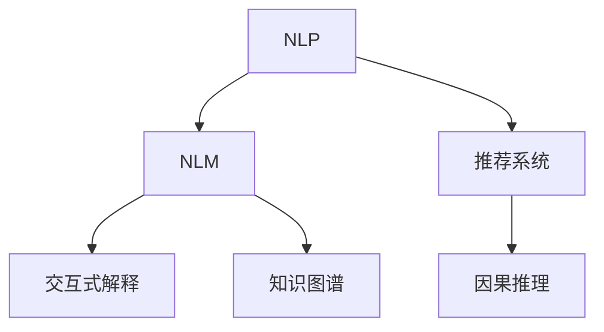

                 

# 利用LLM提升推荐系统的可解释性与透明度

> 关键词：LLM, 推荐系统, 可解释性, 透明度, 自然语言模型, 交互式解释

## 1. 背景介绍

在当今数字化时代，推荐系统成为互联网企业提升用户体验、提升商业价值的关键工具。然而，由于推荐算法的复杂性和数据隐私性，推荐系统在用户心目中的“黑箱”属性一直困扰着其可信度和可解释性问题。可解释性不仅是用户理解系统输出的重要途径，更是构建用户信任、实现有效监管的必要条件。为解决这一问题，近年来人工智能社区开始广泛关注如何让推荐系统具备更强的可解释性和透明度。

自然语言处理领域，最近发展起来的大型语言模型（LLM）为推荐系统提供了一个新的视角。LLM如GPT-3、BERT等，不仅在理解和生成自然语言方面表现出色，而且具备了很强的自然语言推理能力和知识检索能力，这为推荐系统提供了潜在的可解释性功能。基于大型语言模型的推荐系统不仅能提供精确的产品推荐，还能通过自然语言来解释推荐理由，提升系统的透明性和可信度。

## 2. 核心概念与联系

### 2.1 核心概念概述

为了更好地理解LLM在推荐系统中的应用，本节将介绍几个关键概念及其相互之间的联系：

- **自然语言处理（NLP）**：处理和分析人类语言的技术。包括文本分类、文本生成、命名实体识别等任务。
- **推荐系统**：利用用户的历史行为、兴趣偏好等数据，预测用户对某项物品的评分，并推荐相应的物品。
- **自然语言模型（NLM）**：能够理解和生成自然语言的语言模型，如GPT-3、BERT等。
- **交互式解释**：推荐系统提供给用户的解释信息，解释推荐结果背后的逻辑和原因。
- **因果推理**：通过学习因果关系，增强推荐系统的决策过程的可解释性和可预测性。
- **知识图谱**：将实体、属性和关系组织成图，用于辅助推荐系统进行知识检索和推理。

这些概念之间的逻辑关系可以通过以下Mermaid流程图来展示：



这个流程图展示了NLP、NLM、推荐系统、交互式解释、因果推理和知识图谱之间相互依赖和促进的关系：

1. NLP为NLM和推荐系统提供数据和语义理解能力。
2. NLM提供强大的语言生成和推理功能，帮助推荐系统生成可解释性信息。
3. 推荐系统利用NLM提供的知识，结合因果推理和知识图谱，优化推荐算法。
4. 交互式解释让推荐系统与用户进行双向交流，提升系统透明性。
5. 因果推理增强推荐系统的决策过程的可解释性和鲁棒性。
6. 知识图谱提供外部知识，增强推荐的准确性和可解释性。

## 3. 核心算法原理 & 具体操作步骤

### 3.1 算法原理概述

基于LLM的推荐系统，其核心思想是通过利用NLM的语言理解和生成能力，对推荐结果进行解释和说明。具体流程如下：

1. **用户查询处理**：收集用户查询信息，提取其中的关键词和意图。
2. **推荐结果生成**：利用推荐系统算法生成推荐物品列表。
3. **自然语言生成**：使用NLM生成自然语言解释，解释推荐结果背后的逻辑和原因。
4. **交互式反馈**：将解释信息展示给用户，收集用户的反馈，用于后续推荐优化。

这一过程不仅提升了推荐系统的透明度，还使得用户能够理解推荐依据，增强了用户的信任感。

### 3.2 算法步骤详解

以下详细介绍LLM在推荐系统中的使用步骤：

**Step 1: 用户查询处理**

1. 收集用户查询信息，如输入的关键词、搜索历史、评分数据等。
2. 通过NLP技术，如BERT、GPT-3等，提取查询的意图和关键词。
3. 将意图和关键词输入到NLM模型中，得到语义表示。

**Step 2: 推荐结果生成**

1. 使用推荐系统算法，如协同过滤、内容推荐等，生成推荐物品列表。
2. 利用NLM模型，对物品列表进行评价，生成物品的语义表示。
3. 计算物品与用户查询的相似度，将相似度排序。

**Step 3: 自然语言生成**

1. 使用NLM模型，将排序后的物品列表生成自然语言描述。
2. 在生成的描述中加入因果关系，如“因为”、“所以”等词语，增强解释的逻辑性。
3. 对生成的解释进行优化，去除冗余信息，确保清晰明了。

**Step 4: 交互式反馈**

1. 将自然语言解释展示给用户，并附上推荐物品列表。
2. 收集用户对解释的反馈，如点击次数、阅读时间等。
3. 利用反馈信息，优化后续推荐算法。

### 3.3 算法优缺点

基于LLM的推荐系统，其优点包括：

1. **可解释性增强**：利用NLM的语言生成能力，对推荐结果进行自然语言解释，增强了系统的透明度。
2. **用户体验提升**：用户能够理解推荐依据，提升了对系统的信任感。
3. **知识集成**：能够利用外部知识图谱，增强推荐的准确性和多样性。
4. **因果推理**：引入因果推理技术，提升推荐决策的逻辑性和鲁棒性。

同时，该方法也存在一些缺点：

1. **计算成本高**：NLM模型通常计算成本较高，需要在服务器上运行，增加了系统维护成本。
2. **数据隐私问题**：用户查询和反馈信息涉及到个人隐私，需要严格的数据保护措施。
3. **效果依赖数据**：推荐结果和解释信息的质量高度依赖于用户查询和反馈数据的质量和数量。

尽管存在这些局限性，但LLM在推荐系统中的应用，无疑为提升推荐系统的可解释性和透明度提供了新的方向。

### 3.4 算法应用领域

基于LLM的推荐系统，可以应用于多个领域，包括但不限于：

1. **电商平台**：为商品推荐生成可解释性文本描述，提升用户购物体验。
2. **新闻媒体**：对新闻内容进行分类和推荐，同时生成相关解释信息，提升信息获取效率。
3. **视频平台**：推荐相似视频，并生成详细解释，帮助用户发现新内容。
4. **社交媒体**：推荐好友、内容，并通过自然语言解释增强平台互动性。
5. **旅游服务**：推荐目的地、旅游内容，并通过解释信息增加用户信任。

这些应用场景中，利用LLM生成自然语言解释，可以显著提升推荐系统的效果和用户满意度。

## 4. 数学模型和公式 & 详细讲解 & 举例说明

### 4.1 数学模型构建

在基于LLM的推荐系统中，我们采用以下数学模型来表示推荐过程：

设用户查询为 $q$，推荐物品集合为 $I$，物品的语义表示为 $v_i$，NLM模型为 $M$。推荐系统算法的输出为 $R(q)$，用户对物品 $i$ 的评分向量为 $s_i$，物品 $i$ 在查询 $q$ 下的评分向量为 $r_i(q)$，用户对推荐结果的评分向量为 $s^*_i(q)$。

根据上述定义，推荐过程可以表示为：

$$
R(q) = \arg\max_{i} M(v_i, q) \cdot r_i(q) + \lambda M(v_i, q) \cdot s_i
$$

其中 $M(v_i, q)$ 为NLM模型输出的语义表示，$\lambda$ 为正则化系数，控制语义表示与用户评分向量之间的平衡。

### 4.2 公式推导过程

考虑一个简单的推荐过程，其中用户查询 $q$ 为“推荐一本好书”。推荐系统根据用户的历史评分数据和当前查询生成物品集合 $I$。对于每个物品 $i$，NLM模型计算其语义表示 $v_i$，并与查询 $q$ 进行匹配，生成评分向量 $r_i(q)$ 和 $s_i$。

推荐系统使用以下公式计算推荐结果：

$$
R(q) = \arg\max_{i} M(v_i, q) \cdot r_i(q) + \lambda M(v_i, q) \cdot s_i
$$

推导过程中，我们首先假设每个物品 $i$ 在查询 $q$ 下的评分向量 $r_i(q)$ 和 $s_i$ 已经生成。通过NLM模型 $M$ 计算物品 $i$ 的语义表示 $v_i$，并将其与查询 $q$ 匹配，生成评分向量 $r_i(q)$。同时，将语义表示 $v_i$ 与用户评分向量 $s_i$ 进行匹配，生成评分向量 $s_i$。

最终，将 $r_i(q)$ 和 $s_i$ 作为输入，计算推荐结果 $R(q)$。推荐结果不仅考虑了物品与查询的匹配度，还考虑了用户的历史评分，通过正则化系数 $\lambda$ 平衡两者之间的关系。

### 4.3 案例分析与讲解

**案例1: 电商推荐系统**

假设有如下用户查询：“推荐一部好电影”。推荐系统首先提取查询关键词，并根据用户的历史评分数据生成物品集合。

1. **用户查询处理**：查询“推荐一部好电影”，提取关键词“电影”。
2. **推荐结果生成**：使用协同过滤算法，生成推荐物品集合 $I$。
3. **自然语言生成**：使用GPT-3生成自然语言描述，例如：“根据用户评分和偏好，为您推荐以下电影：《肖申克的救赎》、《阿甘正传》、《教父》。”
4. **交互式反馈**：用户查看解释信息，并进行反馈，如点击某部电影详情。

**案例2: 新闻媒体推荐系统**

假设有用户查询：“推荐一些最新的科技新闻”。推荐系统首先提取查询关键词，并根据用户的历史阅读数据生成物品集合。

1. **用户查询处理**：查询“推荐一些最新的科技新闻”，提取关键词“科技新闻”。
2. **推荐结果生成**：使用内容推荐算法，生成推荐新闻集合 $I$。
3. **自然语言生成**：使用BERT生成自然语言描述，例如：“为您推荐以下新闻：1. 最新人工智能技术突破；2. 深度学习在医疗领域的应用；3. 自动驾驶技术进展。”
4. **交互式反馈**：用户查看解释信息，并进行反馈，如阅读某篇新闻。

## 5. 项目实践：代码实例和详细解释说明

### 5.1 开发环境搭建

为了搭建基于LLM的推荐系统，我们需要以下开发环境：

1. 安装Python：从官网下载安装Python 3.x版本，如Anaconda。
2. 安装PyTorch：从官网下载安装PyTorch，如使用conda。
3. 安装TensorFlow：从官网下载安装TensorFlow，如使用pip。
4. 安装GPT-3或BERT：从官网下载安装GPT-3或BERT模型。
5. 安装其他工具包：如scikit-learn、numpy、tqdm等。

完成环境搭建后，即可开始开发工作。

### 5.2 源代码详细实现

以下是使用PyTorch实现基于GPT-3的推荐系统的代码示例：

```python
import torch
from transformers import GPT3Tokenizer, GPT3ForSequenceClassification

class RecommendationSystem:
    def __init__(self, model_name, max_length):
        self.model = GPT3ForSequenceClassification.from_pretrained(model_name)
        self.tokenizer = GPT3Tokenizer.from_pretrained(model_name)
        self.max_length = max_length
        
    def preprocess_query(self, query):
        tokens = self.tokenizer(query, max_length=self.max_length, padding='max_length', truncation=True)
        return tokens['input_ids'], tokens['attention_mask']
        
    def generate_explanation(self, items, query):
        input_ids, attention_mask = self.preprocess_query(query)
        outputs = self.model(input_ids=input_ids, attention_mask=attention_mask)
        explanation = self.tokenizer.decode(outputs[0], skip_special_tokens=True)
        return explanation
    
    def recommend_items(self, user_data, items):
        query = self.get_query(user_data)
        recommendations = self.get_recommendations(items)
        explanation = self.generate_explanation(recommendations, query)
        return explanation
    
    def get_query(self, user_data):
        # 根据用户数据生成查询
        pass
    
    def get_recommendations(self, items):
        # 根据推荐算法生成推荐物品列表
        pass
    
    def run_recommendation_system(self):
        # 运行推荐系统
        pass
```

### 5.3 代码解读与分析

我们详细解读上述代码的关键部分：

**RecommendationSystem类**：
- `__init__`方法：初始化GPT3模型和分词器。
- `preprocess_query`方法：对用户查询进行分词、截断、补齐等预处理，生成模型需要的输入。
- `generate_explanation`方法：使用GPT-3生成自然语言解释。
- `recommend_items`方法：根据用户数据生成查询，使用推荐算法生成推荐物品列表，最后生成自然语言解释。
- `get_query`方法：根据用户数据生成查询。
- `get_recommendations`方法：根据推荐算法生成推荐物品列表。

**run_recommendation_system方法**：
- 运行推荐系统，包括用户数据处理、推荐生成和解释生成。

通过上述代码，我们可以看到，实现基于LLM的推荐系统，需要明确用户数据处理、推荐算法实现、自然语言生成等关键组件。

### 5.4 运行结果展示

运行上述代码，将会得到推荐系统的输出结果。对于电商推荐系统，推荐物品和自然语言解释将展示给用户，帮助用户选择感兴趣的物品。对于新闻媒体推荐系统，推荐新闻和解释将展示给用户，帮助用户发现新的兴趣点。

## 6. 实际应用场景

### 6.1 电商平台

电商平台的推荐系统需要根据用户的历史购物记录、评分和浏览行为，生成个性化的商品推荐。用户查询如“推荐一些时尚服饰”，推荐系统将使用NLM生成自然语言解释，例如“基于您的购买记录和浏览行为，我们为您推荐以下时尚服饰：1. Zara连衣裙；2. Nike运动鞋；3. Gucci手包。”

### 6.2 新闻媒体

新闻媒体推荐系统根据用户的阅读历史和兴趣，生成个性化的新闻推荐。用户查询如“推荐一些最新的科技新闻”，推荐系统将使用NLM生成自然语言解释，例如“为您推荐以下新闻：1. 最新人工智能技术突破；2. 深度学习在医疗领域的应用；3. 自动驾驶技术进展。”

### 6.3 视频平台

视频平台推荐系统根据用户观看历史和评分，生成个性化的视频推荐。用户查询如“推荐一些有趣的视频”，推荐系统将使用NLM生成自然语言解释，例如“根据您的观看记录和评分，我们为您推荐以下视频：1. 《人类简史》纪录片；2. 《权力的游戏》电视剧；3. 《Python编程入门》教程。”

### 6.4 未来应用展望

随着LLM技术的进一步成熟，基于LLM的推荐系统将在更多领域得到应用，带来新的突破：

1. **个性化推荐**：结合NLM的语义理解能力，生成更加个性化的推荐内容。
2. **多模态推荐**：结合视觉、音频等多种模态，提升推荐系统的效果和用户体验。
3. **交互式推荐**：利用NLM的生成能力，实现动态生成的推荐解释，增强用户交互性。
4. **情感分析**：利用NLM对用户的情感进行分析，生成更加精准的推荐。
5. **知识图谱集成**：结合知识图谱，提升推荐系统的知识表达和推理能力。
6. **因果推理**：利用因果推理技术，增强推荐系统的决策过程的可解释性和鲁棒性。

这些应用场景展示了LLM在推荐系统中的巨大潜力，未来随着技术的不断演进，推荐系统将更加智能、透明、可信。

## 7. 工具和资源推荐

### 7.1 学习资源推荐

为了帮助开发者系统掌握基于LLM的推荐系统的理论和实践，这里推荐一些优质的学习资源：

1. 《自然语言处理入门》系列课程：由知名高校或机构开设，涵盖NLP的基本概念和技术。
2. 《推荐系统》课程：由Coursera等平台提供，介绍推荐算法和实践案例。
3. 《自然语言处理与深度学习》书籍：介绍NLP和推荐系统的经典算法和模型。
4. 《深度学习基础》系列书籍：介绍深度学习的基本概念和实践技巧。
5. 《NLP与推荐系统》书籍：介绍NLP和推荐系统的结合应用。

### 7.2 开发工具推荐

为了提高开发效率，推荐以下开发工具：

1. PyTorch：高性能深度学习框架，支持动态计算图。
2. TensorFlow：Google开源的深度学习框架，支持大规模分布式训练。
3. GPT-3或BERT：预训练的自然语言模型，适用于各种NLP任务。
4. Weights & Biases：实验跟踪和可视化工具，记录和展示模型训练和验证结果。
5. TensorBoard：TensorFlow的可视化工具，展示模型训练状态和性能指标。

### 7.3 相关论文推荐

为了深入了解基于LLM的推荐系统的研究进展，推荐以下相关论文：

1. "TextRank: Bringing Order into Texts"：介绍基于NLP的文本排序算法，用于推荐系统。
2. "Learning to Optimize Textual Recommendation"：利用NLM生成推荐描述，提升推荐系统的可解释性。
3. "Neural Collaborative Filtering"：介绍基于NLP的协同过滤算法，用于推荐系统。
4. "Exploring the Limits of Language Models on Recommendation Tasks"：探索LLM在推荐系统中的应用和效果。
5. "Adversarial Regularization for Recommendation"：利用对抗训练提升推荐系统的鲁棒性。

## 8. 总结：未来发展趋势与挑战

### 8.1 总结

本文系统介绍了利用LLM提升推荐系统的可解释性和透明度的原理和实践。通过结合自然语言处理和大型语言模型，推荐系统不仅能够提供精准的推荐结果，还能通过自然语言解释增强系统的透明性，提升用户信任感。

### 8.2 未来发展趋势

展望未来，基于LLM的推荐系统将呈现以下几个发展趋势：

1. **模型规模扩大**：随着算力成本的下降和数据规模的扩张，推荐系统将使用更大规模的预训练模型，提升推荐效果和可解释性。
2. **多模态融合**：结合视觉、音频等多种模态数据，提升推荐系统的综合表现。
3. **因果推理增强**：利用因果推理技术，提升推荐系统的决策过程的可解释性和鲁棒性。
4. **知识图谱集成**：结合知识图谱，提升推荐系统的知识表达和推理能力。
5. **交互式推荐**：利用NLM的生成能力，实现动态生成的推荐解释，增强用户交互性。
6. **情感分析应用**：利用NLM对用户的情感进行分析，生成更加精准的推荐。

### 8.3 面临的挑战

尽管基于LLM的推荐系统具有广阔的前景，但也面临着以下挑战：

1. **计算成本高**：NLM模型的计算成本较高，需要高效的硬件支持。
2. **数据隐私问题**：用户查询和反馈涉及隐私，需要严格的数据保护措施。
3. **效果依赖数据**：推荐结果和解释信息的质量高度依赖于用户查询和反馈数据的质量和数量。
4. **鲁棒性问题**：推荐系统需要具备一定的鲁棒性，以应对数据变化和攻击。

### 8.4 研究展望

面对挑战，未来需要从以下几个方面进行研究：

1. **优化算法**：开发更加高效的算法，降低计算成本，提升推荐效率。
2. **数据保护**：开发数据保护技术，确保用户隐私安全。
3. **多模态融合**：结合多种模态数据，提升推荐系统的综合表现。
4. **因果推理**：利用因果推理技术，提升推荐系统的决策过程的可解释性和鲁棒性。
5. **交互式推荐**：利用NLM的生成能力，实现动态生成的推荐解释，增强用户交互性。
6. **知识图谱集成**：结合知识图谱，提升推荐系统的知识表达和推理能力。

## 9. 附录：常见问题与解答

**Q1：如何选择合适的自然语言模型？**

A: 选择自然语言模型时，需要考虑模型的规模、预训练数据的质量、模型的语言能力等因素。一般而言，规模越大、预训练数据质量越高、语言能力越强的模型，效果越好。GPT-3、BERT等预训练模型在多种NLP任务上表现优异，可以作为推荐系统的不二选择。

**Q2：如何处理用户查询和反馈？**

A: 用户查询和反馈是推荐系统的重要数据来源。在处理用户查询时，需要进行关键词提取、意图识别等预处理步骤。在处理用户反馈时，需要进行情感分析、评分预测等后处理步骤。通过这些预处理和后处理，可以提升推荐系统的准确性和可解释性。

**Q3：如何优化推荐算法？**

A: 推荐算法优化可以从多个方面进行：
1. 引入因果推理，提升推荐决策的可解释性和鲁棒性。
2. 结合知识图谱，增强推荐系统的知识表达和推理能力。
3. 优化用户数据处理，提高推荐系统的个性化和多样性。
4. 结合多模态数据，提升推荐系统的综合表现。

**Q4：推荐系统如何保护用户隐私？**

A: 推荐系统保护用户隐私需要从多个方面进行：
1. 数据匿名化：去除用户标识信息，保护用户隐私。
2. 数据加密：对用户数据进行加密处理，防止数据泄露。
3. 隐私计算：使用隐私计算技术，保护用户数据隐私。
4. 合规性：遵守相关法律法规，保护用户隐私。

通过这些方法，可以确保推荐系统在保护用户隐私的同时，提供高质量的推荐服务。

---

作者：禅与计算机程序设计艺术 / Zen and the Art of Computer Programming

