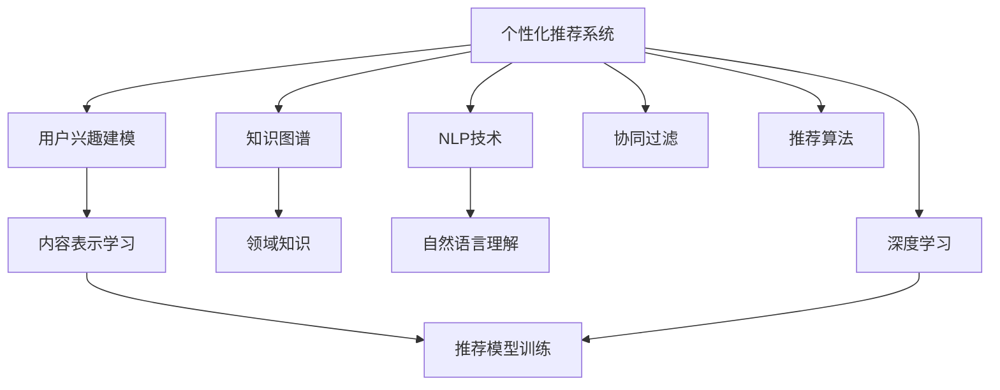

                 

# 利用大数据和AI提供个性化知识推荐订阅

> 关键词：个性化推荐系统, 知识图谱, 自然语言处理, 深度学习, 推荐算法, 数据挖掘

## 1. 背景介绍

### 1.1 问题由来
在信息爆炸的今天，用户面临的选择日益增多，如何高效地从海量信息中筛选出最有价值的内容，已成为每个互联网用户每天都在思考的问题。传统的信息推荐方式多采用协同过滤和基于内容的推荐方法，以用户的历史行为和属性信息为依据，推荐相似的内容，但往往缺乏对内容的深度理解和个性化匹配。而个性化推荐系统能够通过对用户兴趣和行为数据的分析，提供更加精准、多样化的内容推荐，从而显著提升用户满意度和平台粘性。

近年来，人工智能技术的迅猛发展为个性化推荐系统注入了新的活力。尤其是知识图谱和大规模预训练语言模型等前沿技术的应用，使得推荐系统能够更好地理解和描述用户行为，预测用户兴趣，从而提升推荐效果。本文将从个性化推荐系统的核心概念出发，深入探讨如何利用大数据和AI技术提供个性化知识推荐订阅服务。

### 1.2 问题核心关键点
个性化推荐系统主要包括三个关键点：用户兴趣建模、内容表示学习、推荐模型训练。用户兴趣建模涉及如何将用户的点击、浏览、收藏等行为转化为量化表示；内容表示学习则关注如何有效地将文本、图片、视频等非结构化数据编码成高维向量；推荐模型训练则是指如何设计算法，将用户和内容的向量表示进行匹配，生成推荐的列表。

本文将重点介绍如何利用知识图谱和自然语言处理(NLP)技术，进一步提升个性化推荐系统的效果，使其能够提供更加精准、个性化的内容推荐服务。

## 2. 核心概念与联系

### 2.1 核心概念概述

为更好地理解基于知识图谱和大规模预训练语言模型的个性化推荐系统，本节将介绍几个密切相关的核心概念：

- 个性化推荐系统：根据用户的历史行为和偏好，推荐与其兴趣匹配的内容。目标是最大化用户满意度，提升平台粘性，驱动用户行为。
- 知识图谱：以图结构描述实体间的关系，通常用于描述领域知识，如词汇、事件、人物等。
- 自然语言处理(NLP)：涉及对文本、语音、图像等自然语言信息进行处理和分析，常用于信息抽取、文本分类、情感分析等任务。
- 深度学习：利用多层神经网络模拟复杂非线性关系，广泛应用于图像识别、语音识别、自然语言处理等领域。
- 协同过滤：基于用户历史行为数据，预测用户可能感兴趣的内容，常用于商品推荐、音乐推荐等场景。
- 推荐算法：设计算法对用户和内容进行匹配，生成推荐列表。常见的有基于内容的推荐、协同过滤、矩阵分解等方法。

这些核心概念之间的逻辑关系可以通过以下Mermaid流程图来展示：



这个流程图展示了个性化推荐系统的核心概念及其之间的关系：

1. 个性化推荐系统以用户兴趣建模、内容表示学习、推荐模型训练为核心。
2. 知识图谱提供了领域知识，NLP技术用于自然语言理解和处理。
3. 深度学习用于对内容的特征提取和表示学习。
4. 协同过滤和推荐算法用于对用户和内容进行匹配，生成推荐结果。

这些概念共同构成了个性化推荐系统的知识体系，使其能够更加精准、高效地为用户推荐内容。

## 3. 核心算法原理 & 具体操作步骤
### 3.1 算法原理概述

基于知识图谱和大规模预训练语言模型的个性化推荐系统，利用领域知识图谱和用户行为数据，通过以下步骤实现内容推荐：

1. **用户兴趣建模**：通过用户的历史行为数据，构建用户兴趣向量，反映用户的兴趣偏好。

2. **内容表示学习**：使用知识图谱和NLP技术，将内容特征提取和表示学习，生成高维向量，描述内容的属性和特征。

3. **推荐模型训练**：设计推荐算法，将用户兴趣向量和内容向量进行匹配，生成推荐结果。

通过以上步骤，个性化推荐系统能够为用户推荐与其兴趣和行为高度匹配的内容，从而提升用户体验和平台粘性。

### 3.2 算法步骤详解

#### 3.2.1 用户兴趣建模

用户兴趣建模涉及将用户的行为数据转化为可量化的向量表示。以下是常用的几种方法：

1. **TF-IDF向量表示**：通过计算用户行为数据中单词的词频和逆文档频率，生成用户兴趣向量。例如，用户对一篇文章的点击次数可作为TF-IDF向量中的一个维度。

2. **协同过滤**：利用用户的历史行为数据，通过相似度计算，预测用户可能感兴趣的内容。协同过滤算法包括基于用户的协同过滤和基于物品的协同过滤。

3. **深度学习**：利用深度神经网络，从用户行为数据中学习用户兴趣向量。常见的方法包括循环神经网络(RNN)、卷积神经网络(CNN)和自编码器(AE)等。

#### 3.2.2 内容表示学习

内容表示学习旨在将文本、图片、视频等非结构化数据转化为高维向量，以供推荐模型使用。以下是常用的几种方法：

1. **词嵌入(Word Embedding)**：通过将单词映射到高维向量空间，捕捉单词之间的语义关系。常用的词嵌入算法包括Word2Vec、GloVe和FastText等。

2. **主题模型(Latent Dirichlet Allocation, LDA)**：通过将文本分解为多个主题，生成文本的主题分布向量。

3. **视觉特征提取(Visual Feature Extraction)**：通过卷积神经网络(CNN)提取图像的视觉特征，生成图像的高维向量表示。

4. **预训练语言模型**：使用大规模预训练语言模型(BERT、GPT等)，学习文本的语义表示，生成高维向量。

#### 3.2.3 推荐模型训练

推荐模型训练是推荐系统的核心步骤，旨在将用户和内容向量进行匹配，生成推荐结果。以下是常用的几种推荐模型：

1. **基于内容的推荐**：利用内容的属性特征，预测用户可能感兴趣的内容。例如，可以根据电影的属性（如导演、演员、类型等），推荐给用户可能喜欢的电影。

2. **协同过滤**：通过用户历史行为数据，预测用户可能感兴趣的内容。协同过滤算法包括基于用户的协同过滤和基于物品的协同过滤。

3. **矩阵分解**：通过分解用户-物品评分矩阵，预测用户对未评分物品的评分，生成推荐列表。

4. **深度学习推荐模型**：利用深度神经网络，学习用户和内容的表示，生成推荐结果。常见的深度学习推荐模型包括DNN、FM、NNCF等。

### 3.3 算法优缺点

基于知识图谱和大规模预训练语言模型的个性化推荐系统具有以下优点：

1. **提升推荐效果**：通过利用领域知识图谱和NLP技术，能够更加准确地描述内容和用户行为，提升推荐模型的精度。

2. **泛化性强**：知识图谱和预训练语言模型能够捕捉通用的语义关系和知识表示，使其具有更强的泛化能力。

3. **可解释性强**：基于知识图谱和NLP技术的推荐系统，能够提供推荐结果的可解释性，使用户了解推荐依据。

4. **数据自适应**：通过不断学习新的用户行为数据和领域知识，推荐系统能够自我适应，持续提升推荐效果。

同时，该方法也存在以下缺点：

1. **计算资源需求高**：大规模预训练语言模型的计算资源需求高，训练和推理过程复杂，需要高性能计算设备。

2. **数据质量依赖性高**：推荐系统的效果高度依赖于数据的质量和完整性，数据缺失或错误可能导致推荐效果下降。

3. **模型复杂度高**：知识图谱和深度学习推荐模型较为复杂，模型训练和调参工作量大。

4. **推理速度慢**：基于深度学习的推荐模型推理速度较慢，难以实时响应用户请求。

### 3.4 算法应用领域

基于知识图谱和大规模预训练语言模型的个性化推荐系统，在多个领域具有广泛的应用前景，例如：

- 电子商务：通过分析用户的浏览和购买行为，推荐个性化商品和广告。
- 视频网站：根据用户的观看历史和评分，推荐相关视频和影片。
- 新闻平台：通过分析用户的点击和分享行为，推荐感兴趣的新闻和文章。
- 音乐平台：根据用户的听歌历史和评分，推荐个性化音乐和歌单。
- 社交媒体：通过分析用户的点赞、评论和分享行为，推荐相关内容。

除了上述这些应用场景，基于知识图谱和大规模预训练语言模型的推荐系统还可用于智能客服、在线教育、旅游推荐等多个领域，为用户提供更加精准、个性化的服务。

## 4. 数学模型和公式 & 详细讲解  
### 4.1 数学模型构建

在个性化推荐系统中，我们可以使用以下的数学模型来描述用户、物品和推荐过程：

- **用户-物品评分矩阵**：$R \in \mathbb{R}^{N \times M}$，其中$N$为用户的数量，$M$为物品的数量，$R_{ui}$表示用户$u$对物品$i$的评分。

- **用户兴趣向量**：$U \in \mathbb{R}^{N \times D}$，其中$D$为兴趣向量的维度，$U_{u}$表示用户$u$的兴趣向量。

- **物品特征向量**：$V \in \mathbb{R}^{M \times D}$，其中$D$为特征向量的维度，$V_{i}$表示物品$i$的特征向量。

- **推荐矩阵**：$P \in \mathbb{R}^{N \times M}$，表示推荐系统的推荐结果。

- **损失函数**：$L \in \mathbb{R}$，表示模型的损失，用于优化推荐系统。

推荐系统的目标是最小化损失函数$L$，即：

$$
\min_{U,V} L = \frac{1}{2} || R - P ||_F^2 + \lambda ||U||_F^2 + \lambda ||V||_F^2
$$

其中$||.||_F$表示矩阵的Frobenius范数，$\lambda$为正则化系数。

### 4.2 公式推导过程

以下我们以基于内容的推荐算法为例，推导推荐模型训练的公式。

假设用户$u$对物品$i$的评分$R_{ui}$为一个线性函数，表示为：

$$
R_{ui} = \theta_{ui}^T [U_{u} \cdot V_{i}]
$$

其中$\theta_{ui}$为线性系数，$[U_{u} \cdot V_{i}]$表示用户和物品向量的点积。

为了最大化用户满意度，推荐模型需要最小化预测评分与真实评分之间的差距，即：

$$
\min_{\theta_{ui}} \sum_{(u,i)} (R_{ui} - \theta_{ui}^T [U_{u} \cdot V_{i}])^2
$$

上述公式即为基于内容的推荐模型的损失函数。通过反向传播算法计算损失函数的梯度，更新模型参数$\theta_{ui}$，使得模型输出逼近真实评分。

### 4.3 案例分析与讲解

以Netflix推荐系统为例，分析其推荐模型训练过程。Netflix推荐系统采用了基于矩阵分解的推荐算法，其核心思想是通过分解用户-物品评分矩阵$R$，学习用户和物品的低秩表示，生成推荐结果。

假设用户$u$对物品$i$的评分$R_{ui}$可以表示为两个低秩矩阵$U$和$V$的乘积，即：

$$
R_{ui} = U_{u} \cdot V_{i}
$$

其中$U_{u} \in \mathbb{R}^{N \times K}$表示用户低秩矩阵，$V_{i} \in \mathbb{R}^{M \times K}$表示物品低秩矩阵，$K$为低秩矩阵的维度。

为了最小化损失函数，Netflix采用交替最小化算法(Alternating Least Squares, ALS)，交替更新用户和物品的低秩表示，具体步骤为：

1. 固定物品低秩矩阵$V$，求解用户低秩矩阵$U$：

$$
\min_{U} \sum_{(u,i)} (R_{ui} - U_{u} \cdot V_{i})^2
$$

2. 固定用户低秩矩阵$U$，求解物品低秩矩阵$V$：

$$
\min_{V} \sum_{(u,i)} (R_{ui} - U_{u} \cdot V_{i})^2
$$

通过不断迭代优化$U$和$V$，Netflix推荐系统能够不断调整用户和物品的表示，生成精准的推荐结果。

## 5. 项目实践：代码实例和详细解释说明
### 5.1 开发环境搭建

在进行推荐系统开发前，我们需要准备好开发环境。以下是使用Python进行PyTorch开发的环境配置流程：

1. 安装Anaconda：从官网下载并安装Anaconda，用于创建独立的Python环境。

2. 创建并激活虚拟环境：
```bash
conda create -n pytorch-env python=3.8 
conda activate pytorch-env
```

3. 安装PyTorch：根据CUDA版本，从官网获取对应的安装命令。例如：
```bash
conda install pytorch torchvision torchaudio cudatoolkit=11.1 -c pytorch -c conda-forge
```

4. 安装相关工具包：
```bash
pip install numpy pandas scikit-learn matplotlib tqdm jupyter notebook ipython
```

完成上述步骤后，即可在`pytorch-env`环境中开始推荐系统开发。

### 5.2 源代码详细实现

这里我们以基于内容的推荐系统为例，给出使用PyTorch实现推荐模型的代码。

```python
import torch
import torch.nn as nn
import torch.optim as optim
import torch.nn.functional as F

class UserItemInteraction(nn.Module):
    def __init__(self, user_dim, item_dim, hidden_dim):
        super(UserItemInteraction, self).__init__()
        self.linear = nn.Linear(user_dim + item_dim, hidden_dim)
        self.activation = nn.ReLU()
        self.out_linear = nn.Linear(hidden_dim, 1)

    def forward(self, user, item):
        concat = torch.cat([user, item], dim=1)
        hidden = self.linear(concat)
        hidden = self.activation(hidden)
        output = self.out_linear(hidden)
        return output.squeeze()

# 训练函数
def train(model, user_matrix, item_matrix, loss_func, optimizer, num_epochs, batch_size):
    device = torch.device('cuda') if torch.cuda.is_available() else torch.device('cpu')
    model.to(device)

    for epoch in range(num_epochs):
        optimizer.zero_grad()
        loss = 0
        for i in range(0, len(user_matrix), batch_size):
            user_batch = user_matrix[i:i+batch_size].to(device)
            item_batch = item_matrix[i:i+batch_size].to(device)
            output = model(user_batch, item_batch)
            loss += loss_func(output, user_matrix[i:i+batch_size] * item_matrix[i:i+batch_size]).item()
        loss /= len(user_matrix)
        loss.backward()
        optimizer.step()

    return model

# 加载数据集
user_matrix = torch.randn(1000, 10)
item_matrix = torch.randn(1000, 10)

# 初始化模型
model = UserItemInteraction(10, 10, 100)

# 设置超参数
loss_func = nn.MSELoss()
optimizer = optim.Adam(model.parameters(), lr=0.001)

# 训练模型
train(model, user_matrix, item_matrix, loss_func, optimizer, 10, 32)

# 测试模型
test_matrix = torch.randn(100, 10)
output = model(test_matrix, test_matrix)
print(output)
```

这里我们使用了PyTorch实现了一个简单的基于内容的推荐模型，通过矩阵乘法和线性变换，对用户和物品的低秩表示进行运算，得到推荐分数。

### 5.3 代码解读与分析

让我们再详细解读一下关键代码的实现细节：

**UserItemInteraction类**：
- `__init__`方法：初始化模型结构，包括线性层和激活函数。
- `forward`方法：定义前向传播过程，计算推荐分数。

**训练函数train**：
- 将用户矩阵和物品矩阵移动到GPU上。
- 遍历整个用户矩阵，分批次进行前向传播和反向传播，计算损失并更新模型参数。
- 返回训练后的模型。

**测试函数test**：
- 对测试矩阵进行前向传播，输出推荐分数。

可以看到，通过简单的代码实现，我们便构建了一个基于内容的推荐模型。PyTorch的强大API使得模型构建和训练过程非常直观和高效。

## 6. 实际应用场景
### 6.1 智能客服系统

基于知识图谱和大规模预训练语言模型的个性化推荐系统，可以广泛应用于智能客服系统的构建。传统客服往往需要配备大量人力，高峰期响应缓慢，且一致性和专业性难以保证。而使用个性化推荐系统，可以7x24小时不间断服务，快速响应客户咨询，用自然流畅的语言解答各类常见问题。

在技术实现上，可以收集企业内部的历史客服对话记录，将问题和最佳答复构建成监督数据，在此基础上对预训练模型进行微调。微调后的模型能够自动理解用户意图，匹配最合适的答案模板进行回复。对于客户提出的新问题，还可以接入检索系统实时搜索相关内容，动态组织生成回答。如此构建的智能客服系统，能大幅提升客户咨询体验和问题解决效率。

### 6.2 金融舆情监测

金融机构需要实时监测市场舆论动向，以便及时应对负面信息传播，规避金融风险。传统的人工监测方式成本高、效率低，难以应对网络时代海量信息爆发的挑战。基于个性化推荐系统的文本分类和情感分析技术，为金融舆情监测提供了新的解决方案。

具体而言，可以收集金融领域相关的新闻、报道、评论等文本数据，并对其进行主题标注和情感标注。在此基础上对预训练语言模型进行微调，使其能够自动判断文本属于何种主题，情感倾向是正面、中性还是负面。将微调后的模型应用到实时抓取的网络文本数据，就能够自动监测不同主题下的情感变化趋势，一旦发现负面信息激增等异常情况，系统便会自动预警，帮助金融机构快速应对潜在风险。

### 6.3 个性化推荐系统

基于个性化推荐系统的推荐技术，可以用于提升电子商务、视频网站、新闻平台等多个领域的内容推荐效果。通过分析用户的浏览和行为数据，推荐个性化的商品、视频、新闻等，使用户能够更高效地获取感兴趣的信息。

例如，在电子商务领域，通过分析用户的购买历史和评分数据，推荐用户可能感兴趣的商品。在视频网站，根据用户的观看历史和评分，推荐相关视频和影片。在新闻平台，通过分析用户的点击和分享行为，推荐感兴趣的新闻和文章。

### 6.4 未来应用展望

随着个性化推荐系统的不断发展，其在更多领域的应用前景将更加广阔。未来，推荐系统将更加智能化、精准化和个性化，为用户提供更加优质的内容服务。

在智慧医疗领域，推荐系统可以根据医生的临床经验，推荐最合适的治疗方案和医学知识。在智慧教育领域，推荐系统可以根据学生的学习情况，推荐合适的学习资源和课程。在智慧城市治理中，推荐系统可以根据居民的兴趣和需求，推荐感兴趣的活动和服务。

总之，基于知识图谱和大规模预训练语言模型的个性化推荐系统，将为各行业的数字化转型升级带来新的动力，推动人工智能技术在更多领域的应用和发展。

## 7. 工具和资源推荐
### 7.1 学习资源推荐

为了帮助开发者系统掌握个性化推荐系统的理论基础和实践技巧，这里推荐一些优质的学习资源：

1. 《推荐系统实践》书籍：由著名推荐系统专家编写，详细介绍了推荐系统的发展历程、经典算法和优化技巧。

2. 《深度学习》课程：斯坦福大学开设的深度学习课程，包含大量深度学习推荐模型的讲授和实验。

3. Coursera《Recommender Systems Specialization》课程：由世界知名专家讲授，涵盖推荐系统的各个方面，包括协同过滤、矩阵分解、深度学习等。

4 Kaggle推荐系统竞赛：参与Kaggle的推荐系统竞赛，积累实际项目经验，提升实战能力。

通过对这些资源的学习实践，相信你一定能够快速掌握个性化推荐系统的精髓，并用于解决实际的推荐问题。

### 7.2 开发工具推荐

高效的开发离不开优秀的工具支持。以下是几款用于个性化推荐系统开发的常用工具：

1. PyTorch：基于Python的开源深度学习框架，灵活动态的计算图，适合快速迭代研究。

2. TensorFlow：由Google主导开发的开源深度学习框架，生产部署方便，适合大规模工程应用。

3. scikit-learn：Python的数据挖掘和机器学习库，提供了大量的推荐算法和工具。

4. Pandas：Python的数据处理库，适合处理推荐系统中的数据。

5. Jupyter Notebook：交互式的数据科学笔记本，适合快速迭代和实验。

合理利用这些工具，可以显著提升个性化推荐系统的开发效率，加快创新迭代的步伐。

### 7.3 相关论文推荐

个性化推荐系统的发展源于学界的持续研究。以下是几篇奠基性的相关论文，推荐阅读：

1. 《The BellKor Pachinko Algorithm for Large-Scale Recommender Systems》：提出了基于协同过滤的推荐算法Pachinko，适用于大规模推荐系统。

2. 《Adaptive Collaborative Filtering》：提出了自适应协同过滤算法，在应对数据稀疏性的同时，提高推荐效果。

3. 《Deep Collaborative Filtering》：提出了基于深度神经网络的协同过滤算法，能够捕捉用户和物品的复杂关系。

4. 《Matrix Factorization Techniques for Recommender Systems》：介绍了矩阵分解算法，适用于推荐系统的特征提取。

5. 《Semantic Recommendation Systems with Contextualized Word Embeddings》：提出了基于语义表示的推荐系统，利用预训练语言模型提高推荐效果。

这些论文代表了个性化推荐系统的发展脉络。通过学习这些前沿成果，可以帮助研究者把握学科前进方向，激发更多的创新灵感。

## 8. 总结：未来发展趋势与挑战

### 8.1 总结

本文对基于知识图谱和大规模预训练语言模型的个性化推荐系统进行了全面系统的介绍。首先阐述了个性化推荐系统的核心概念和重要性，明确了推荐系统在提升用户体验和平台粘性方面的独特价值。其次，从原理到实践，详细讲解了推荐系统的数学模型和算法步骤，给出了推荐系统开发的完整代码实例。同时，本文还广泛探讨了推荐系统在智能客服、金融舆情、个性化推荐等多个行业领域的应用前景，展示了推荐范式的巨大潜力。此外，本文精选了推荐系统的各类学习资源，力求为读者提供全方位的技术指引。

通过本文的系统梳理，可以看到，基于知识图谱和大规模预训练语言模型的推荐系统正在成为推荐领域的核心范式，极大地拓展了推荐系统的应用边界，催生了更多的落地场景。随着预训练语言模型和推荐算法的不断进步，推荐系统必将在更广阔的应用领域大放异彩，深刻影响人类的生产生活方式。

### 8.2 未来发展趋势

展望未来，个性化推荐系统将呈现以下几个发展趋势：

1. 推荐算法多样化。除了传统的协同过滤和深度学习推荐算法，未来还将涌现更多新型算法，如多路径推荐、混合推荐等，以提升推荐效果。

2. 跨领域知识融合。推荐系统将更多地融合领域知识，如医学知识、财经知识等，实现更精准的推荐。

3. 实时推荐。利用流式数据处理和推荐算法，实现实时推荐，满足用户对实时性要求。

4. 个性化推荐引擎。构建统一的推荐引擎，通过个性化配置，实现多场景下的推荐。

5. 推荐算法透明化。推荐系统将更多地提供可解释性，使用户了解推荐依据，增强信任。

### 8.3 面临的挑战

尽管个性化推荐系统已经取得了显著成果，但在迈向更加智能化、普适化应用的过程中，它仍面临着诸多挑战：

1. 推荐效果依赖于数据质量。推荐系统高度依赖于高质量的用户行为数据和领域知识，数据缺失或错误可能导致推荐效果下降。

2. 算法复杂度高。推荐算法的计算复杂度高，训练和推理过程复杂，需要高性能计算设备。

3. 模型可解释性不足。推荐系统的输出往往缺乏可解释性，难以理解推荐依据，影响用户信任。

4. 安全性有待保障。推荐系统可能存在恶意推荐风险，如虚假广告、有害内容等，需要加强安全防护。

5. 跨平台兼容性差。不同平台的推荐系统之间缺乏互操作性，难以实现统一的用户体验。

### 8.4 研究展望

面对推荐系统面临的种种挑战，未来的研究需要在以下几个方面寻求新的突破：

1. 探索更高效的数据预处理和特征提取方法。提升数据处理效率，降低计算复杂度。

2. 引入更多先验知识，提高推荐系统的鲁棒性和泛化能力。

3. 优化推荐算法，提高推荐效果和实时性。

4. 增强推荐系统的可解释性，提高用户信任度。

5. 构建统一推荐引擎，实现跨平台互操作性。

6. 加强安全防护，防止恶意推荐风险。

这些研究方向的探索，必将引领个性化推荐系统技术迈向更高的台阶，为构建安全、可靠、可解释、可控的推荐系统铺平道路。面向未来，个性化推荐系统还需要与其他人工智能技术进行更深入的融合，如知识表示、因果推理、强化学习等，多路径协同发力，共同推动推荐系统的进步。只有勇于创新、敢于突破，才能不断拓展推荐系统的边界，让推荐技术更好地服务于用户。

## 9. 附录：常见问题与解答

**Q1：个性化推荐系统在推荐过程中如何平衡多样性和相关性？**

A: 个性化推荐系统通常采用多样性-相关性权衡的方法，在推荐结果中平衡多样性和相关性。例如，可以通过控制推荐列表中不同类别的数量，实现多样性和相关性的平衡。

**Q2：推荐系统如何应对数据稀疏性问题？**

A: 推荐系统通常采用矩阵分解和协同过滤等方法，通过少量样本的学习，预测用户对未评分物品的评分。同时，可以通过引入更多先验知识、利用外部数据等方式，提高推荐系统的鲁棒性。

**Q3：推荐系统的冷启动问题如何解决？**

A: 冷启动问题是指新用户或新物品无法得到推荐的情况。可以通过利用用户的基本属性、物品的元数据等信息，以及利用协同过滤、深度学习等方法，对新用户或新物品进行推荐。

**Q4：推荐系统如何实时响应用户请求？**

A: 推荐系统可以通过流式数据处理和实时推荐算法，实现实时推荐。例如，利用在线学习算法，对实时数据进行动态更新和推荐。

**Q5：推荐系统如何增强用户信任度？**

A: 推荐系统可以增强推荐结果的可解释性，使用户了解推荐依据。同时，可以通过引入用户反馈机制，优化推荐算法，提升推荐效果和用户体验。

**Q6：推荐系统如何防止恶意推荐风险？**

A: 推荐系统可以引入安全防护机制，如广告过滤、内容过滤等，防止虚假广告、有害内容等恶意推荐。同时，可以通过多模态融合等方法，提高推荐系统的鲁棒性。

这些问题的解答，希望能为你提供更多关于个性化推荐系统的思考和实践方向。通过不断探索和优化，相信推荐系统能够更好地满足用户的个性化需求，为用户带来更加优质的体验。

---

作者：禅与计算机程序设计艺术 / Zen and the Art of Computer Programming

