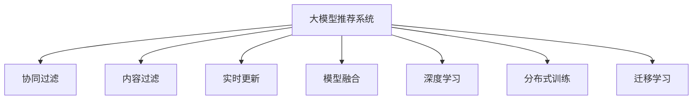

                 

# 利用大模型优化推荐系统的实时更新机制

> 关键词：大模型推荐系统，实时更新，深度学习，协同过滤，内容过滤，用户行为分析

## 1. 背景介绍

### 1.1 问题由来

推荐系统是现代互联网应用中不可或缺的一部分，从电商到新闻，从视频到社交网络，推荐系统帮助用户发现潜在感兴趣的内容，极大提升了用户体验和平台活跃度。传统的推荐系统依赖于用户历史行为数据，通过协同过滤、内容过滤等算法进行推荐。然而，在用户行为发生变化的场景下，旧模型需要被重新训练，才能适应新场景。这一过程既耗费时间又消耗资源，降低了推荐系统的实时性。

近年来，深度学习在推荐系统中的应用逐渐增多。深度学习模型可以更直接地从用户数据中学习出特征表示，通过预训练和微调提升模型效果。但深度学习模型依然面临长周期训练的挑战，难以实时更新模型，且在大规模数据集上的训练成本和存储成本较高。

为解决这一问题，利用大模型进行实时更新成为一种新的趋势。大模型如BERT、GPT-3、XLNet等，通过在海量数据上进行预训练，学习出丰富的特征表示，能够以较小的学习率进行微调，快速适应新数据。同时，大模型通常采用分布式训练，可以显著降低训练和存储成本。

### 1.2 问题核心关键点

利用大模型优化推荐系统的实时更新机制，核心在于：

1. 使用大模型进行预训练和微调，提高模型对用户行为和内容特征的刻画能力。
2. 设计高效的微调策略，确保在少量数据上也能快速收敛。
3. 引入实时更新的机制，保持模型的长期稳定性和实时响应性。

这些关键点将指导我们理解和实现基于大模型的推荐系统。

### 1.3 问题研究意义

利用大模型进行推荐系统实时更新的研究具有重要意义：

1. 提升推荐系统实时性。大模型微调可以在短周期内完成，迅速适应新数据，提升推荐系统响应速度。
2. 优化推荐系统性能。大模型能够学习更丰富的用户和内容表示，提升推荐精度和多样性。
3. 降低推荐系统成本。大模型分布式训练和微调机制，可降低资源和存储需求，降低维护成本。
4. 拓展推荐系统应用。大模型带来的表示学习能力，可以用于更多类型的推荐任务，提升推荐系统灵活性。
5. 增强推荐系统安全性。大模型可引入因果推理、对抗训练等技术，提高推荐系统鲁棒性，降低恶意行为风险。

## 2. 核心概念与联系

### 2.1 核心概念概述

为了更好地理解利用大模型优化推荐系统的实时更新机制，本节将介绍几个密切相关的核心概念：

- 大模型推荐系统(Recommendation System based on Large Models)：以预训练的大语言模型或大深度学习模型为特征提取器，进行用户行为分析和内容特征表示，最终通过微调优化推荐模型。

- 协同过滤(Collaborative Filtering)：通过分析用户和物品的相似性进行推荐，如基于用户行为的矩阵分解、基于物品的邻域推荐等。

- 内容过滤(Content-Based Filtering)：根据物品的属性和用户偏好进行推荐，如基于物品标签的检索、基于用户兴趣的关联推荐等。

- 实时更新(Real-time Updating)：通过高效的微调策略，对推荐模型进行实时更新，适应新数据和用户行为变化。

- 模型融合(Model Fusion)：结合多种推荐算法，通过加权、集成等方式提升推荐效果，实现优势互补。

- 深度学习(Deep Learning)：通过多层神经网络学习特征表示，提升模型的表达能力。

- 分布式训练(Distributed Training)：通过多台机器并行计算，加速模型训练。

- 迁移学习(Transfer Learning)：利用预训练模型学习到的知识，减少新任务上的学习负担，提升模型效果。

这些核心概念之间的逻辑关系可以通过以下Mermaid流程图来展示：



这个流程图展示了大模型推荐系统的核心概念及其之间的关系：

1. 大模型推荐系统通过协同过滤、内容过滤等方法，对用户行为和内容特征进行表示。
2. 实时更新机制，通过高效的微调策略，快速适应新数据和用户行为变化。
3. 模型融合、深度学习和分布式训练，进一步提升推荐效果和系统性能。
4. 迁移学习，利用预训练知识，减少新任务上的学习负担。

这些概念共同构成了大模型推荐系统的学习框架，使其能够在推荐任务中发挥更大的作用。通过理解这些核心概念，我们可以更好地把握大模型推荐系统的设计思路和优化方向。

## 3. 核心算法原理 & 具体操作步骤
### 3.1 算法原理概述

利用大模型优化推荐系统的实时更新机制，本质上是将大模型作为推荐系统的核心组件，通过高效的微调策略，确保在少量数据上也能快速收敛，提升推荐系统的实时性和效果。

具体来说，包括以下几个关键步骤：

1. 收集用户行为数据：对用户点击、浏览、评分等行为进行记录，作为推荐模型的训练数据。
2. 预训练大模型：使用大规模无标签数据对大模型进行预训练，学习通用的特征表示。
3. 微调推荐模型：利用用户行为数据对预训练大模型进行微调，学习特定推荐任务的特征表示。
4. 实时更新机制：在新的用户行为数据到来时，通过在线微调算法，更新推荐模型参数，保持模型的实时性。
5. 模型融合与部署：将微调后的模型与现有推荐算法进行融合，集成到推荐系统中，实现推荐功能的提升。

### 3.2 算法步骤详解

下面详细介绍基于大模型的推荐系统实时更新机制的详细步骤：

**Step 1: 准备预训练模型和数据集**

- 选择合适的预训练模型，如BERT、GPT-3等，作为初始化参数。
- 准备推荐任务的数据集，包括用户行为数据和物品属性数据，划分为训练集、验证集和测试集。

**Step 2: 添加推荐适配层**

- 根据推荐任务类型，在预训练模型顶层设计合适的输出层和损失函数。
- 对于协同过滤任务，通常在顶层添加线性回归器或交叉熵损失函数。
- 对于内容过滤任务，通常使用ReLU或tanh激活函数，输出物品相关性分数。

**Step 3: 设置微调超参数**

- 选择合适的优化算法及其参数，如AdamW、SGD等，设置学习率、批大小、迭代轮数等。
- 设置正则化技术及强度，包括权重衰减、Dropout、Early Stopping等。
- 确定冻结预训练参数的策略，如仅微调顶层，或全部参数都参与微调。

**Step 4: 执行梯度训练**

- 将训练集数据分批次输入模型，前向传播计算损失函数。
- 反向传播计算参数梯度，根据设定的优化算法和学习率更新模型参数。
- 周期性在验证集上评估模型性能，根据性能指标决定是否触发Early Stopping。
- 重复上述步骤直到满足预设的迭代轮数或Early Stopping条件。

**Step 5: 实时更新机制**

- 在新数据到来时，重新载入最新数据集，继续执行梯度训练。
- 通过在线微调算法，如增量学习(Incremental Learning)，仅更新模型参数中的部分层，而非全部参数。
- 定期在测试集上评估模型性能，调整超参数，确保模型的长期稳定性和实时响应性。

**Step 6: 模型融合与部署**

- 将微调后的模型与现有推荐算法进行融合，如加权、集成等方式。
- 集成到推荐系统中，实现推荐功能的提升。
- 不断优化和部署，提升系统性能和响应速度。

以上是基于大模型的推荐系统实时更新机制的一般流程。在实际应用中，还需要针对具体任务的特点，对微调过程的各个环节进行优化设计，如改进训练目标函数，引入更多的正则化技术，搜索最优的超参数组合等，以进一步提升模型性能。

### 3.3 算法优缺点

基于大模型的推荐系统实时更新机制具有以下优点：

1. 实时性高。大模型微调可以在短周期内完成，迅速适应新数据，提升推荐系统响应速度。
2. 效果显著。大模型学习通用的特征表示，能够更好地刻画用户行为和内容特征，提升推荐精度。
3. 成本低。大模型分布式训练和微调机制，可降低资源和存储需求，降低维护成本。
4. 适应性强。大模型能够学习更丰富的用户和内容表示，适应更多类型的推荐任务，提升推荐系统灵活性。
5. 鲁棒性好。大模型引入对抗训练等技术，提高推荐系统鲁棒性，降低恶意行为风险。

同时，该方法也存在一定的局限性：

1. 对标注数据依赖。微调的效果很大程度上取决于标注数据的质量和数量，获取高质量标注数据的成本较高。
2. 对数据变化敏感。当目标数据与预训练数据的分布差异较大时，微调的性能提升有限。
3. 可解释性不足。大模型带来的黑盒特性，难以解释其内部工作机制和决策逻辑。
4. 硬件资源需求高。大模型通常需要高性能GPU/TPU等硬件支持，维护成本较高。

尽管存在这些局限性，但就目前而言，基于大模型的推荐系统实时更新机制仍然是一种高效且具有前景的技术范式。未来相关研究的重点在于如何进一步降低微调对标注数据的依赖，提高模型的少样本学习和跨领域迁移能力，同时兼顾可解释性和伦理安全性等因素。

### 3.4 算法应用领域

利用大模型优化推荐系统的实时更新机制已经在推荐系统领域得到了广泛的应用，覆盖了几乎所有常见推荐任务，例如：

- 电商推荐：如商品推荐、个性化广告等。通过微调学习用户行为和物品相关性特征。
- 视频推荐：如电影、电视剧、综艺等。通过微调学习用户兴趣和内容特征。
- 音乐推荐：如歌曲、专辑等。通过微调学习用户行为和音乐特征。
- 新闻推荐：如文章、视频、图片等。通过微调学习用户兴趣和内容特征。
- 社交推荐：如好友推荐、内容推荐等。通过微调学习用户关系和内容特征。

除了上述这些经典任务外，大模型推荐系统实时更新机制还被创新性地应用到更多场景中，如跨领域推荐、实时个性化、行为预测等，为推荐系统带来了全新的突破。随着预训练模型和微调方法的不断进步，相信推荐系统必将在更多领域大放异彩。

## 4. 数学模型和公式 & 详细讲解 & 举例说明

### 4.1 数学模型构建

本节将使用数学语言对基于大模型的推荐系统实时更新机制进行更加严格的刻画。

记推荐系统为 $R=\{U, I, P, S\}$，其中 $U$ 为用户集合，$I$ 为物品集合，$P$ 为用户与物品的相关性矩阵，$S$ 为用户行为数据集。假设预训练模型为 $M_{\theta}$，其中 $\theta$ 为预训练得到的模型参数。

定义推荐系统损失函数为：

$$
\mathcal{L}(\theta) = \frac{1}{N}\sum_{i=1}^N \sum_{j=1}^M P_{ij} \log \hat{P}_{ij}
$$

其中 $\hat{P}_{ij}=M_{\theta}(i,j)$ 为模型预测的相关性分数，$P_{ij}$ 为真实相关性分数。

在实际应用中，$P$ 通常以稀疏矩阵的形式存在，表示为 $P_{ij}=P_{ji}$。为了计算方便，我们采用平方误差损失函数：

$$
\mathcal{L}(\theta) = \frac{1}{N}\sum_{i=1}^N \sum_{j=1}^M (P_{ij} - \hat{P}_{ij})^2
$$

通过最小化损失函数 $\mathcal{L}(\theta)$，更新模型参数 $\theta$，即可实现对推荐模型的优化。

### 4.2 公式推导过程

以下我们以协同过滤推荐任务为例，推导平方误差损失函数及其梯度的计算公式。

假设模型 $M_{\theta}$ 在输入 $(i,j)$ 上的输出为 $\hat{P}_{ij}=M_{\theta}(i,j) \in [0,1]$，表示物品 $j$ 对用户 $i$ 的相关性。真实相关性 $P_{ij} \in \{0,1\}$。则平方误差损失函数定义为：

$$
\mathcal{L}(\theta) = \frac{1}{N}\sum_{i=1}^N \sum_{j=1}^M (P_{ij} - \hat{P}_{ij})^2
$$

将其代入经验风险公式，得：

$$
\mathcal{L}(\theta) = \frac{1}{N}\sum_{i=1}^N \sum_{j=1}^M (P_{ij} - M_{\theta}(i,j))^2
$$

根据链式法则，损失函数对参数 $\theta_k$ 的梯度为：

$$
\frac{\partial \mathcal{L}(\theta)}{\partial \theta_k} = \frac{2}{N}\sum_{i=1}^N \sum_{j=1}^M P_{ij} - \hat{P}_{ij}\frac{\partial M_{\theta}(i,j)}{\partial \theta_k}
$$

其中 $\frac{\partial M_{\theta}(i,j)}{\partial \theta_k}$ 可进一步递归展开，利用自动微分技术完成计算。

在得到损失函数的梯度后，即可带入参数更新公式，完成模型的迭代优化。重复上述过程直至收敛，最终得到适应推荐任务的最优模型参数 $\theta^*$。

### 4.3 案例分析与讲解

**案例一：协同过滤推荐系统**

假设我们有一家电商公司，希望通过协同过滤推荐系统，推荐用户感兴趣的商品。我们需要首先收集用户行为数据 $S$，包括用户的点击、购买、评分等记录。然后，将用户和物品的关系矩阵 $P$ 作为微调数据，对预训练的BERT模型进行微调，学习出用户与物品的相关性表示。在每次有新的用户行为数据到来时，重新载入数据，通过在线微调算法更新模型参数，最终得到推荐结果。

**案例二：内容过滤推荐系统**

假设我们需要为用户推荐感兴趣的文章。首先，通过自然语言处理技术，将文章内容表示为向量 $v$。然后，将文章向量 $v$ 和用户兴趣向量 $u$ 作为输入，通过BERT模型学习出相关性分数 $\hat{P}$。在每次有新的用户行为数据到来时，重新载入数据，通过在线微调算法更新模型参数，最终得到推荐结果。

## 5. 项目实践：代码实例和详细解释说明
### 5.1 开发环境搭建

在进行推荐系统微调实践前，我们需要准备好开发环境。以下是使用Python进行PyTorch开发的环境配置流程：

1. 安装Anaconda：从官网下载并安装Anaconda，用于创建独立的Python环境。

2. 创建并激活虚拟环境：
```bash
conda create -n pytorch-env python=3.8 
conda activate pytorch-env
```

3. 安装PyTorch：根据CUDA版本，从官网获取对应的安装命令。例如：
```bash
conda install pytorch torchvision torchaudio cudatoolkit=11.1 -c pytorch -c conda-forge
```

4. 安装TensorFlow：如果需要支持其他深度学习框架，可以通过conda安装。

5. 安装Transformers库：
```bash
pip install transformers
```

6. 安装各类工具包：
```bash
pip install numpy pandas scikit-learn matplotlib tqdm jupyter notebook ipython
```

完成上述步骤后，即可在`pytorch-env`环境中开始推荐系统微调实践。

### 5.2 源代码详细实现

下面我们以协同过滤推荐系统为例，给出使用Transformers库对BERT模型进行微调的PyTorch代码实现。

首先，定义推荐系统数据处理函数：

```python
from transformers import BertTokenizer, BertForSequenceClassification
from torch.utils.data import Dataset, DataLoader
import torch

class RecommendationDataset(Dataset):
    def __init__(self, user_item_pairs, user_ids, item_ids, user_ratings):
        self.user_item_pairs = user_item_pairs
        self.user_ids = user_ids
        self.item_ids = item_ids
        self.user_ratings = user_ratings
        self.tokenizer = BertTokenizer.from_pretrained('bert-base-cased')

    def __len__(self):
        return len(self.user_item_pairs)

    def __getitem__(self, idx):
        user_id, item_id, rating = self.user_item_pairs[idx]
        user_tokens = self.tokenizer(user_id, return_tensors='pt')
        item_tokens = self.tokenizer(item_id, return_tensors='pt')
        return {
            'user_ids': user_id,
            'item_ids': item_id,
            'user_ratings': rating,
            'user_tokens': user_tokens,
            'item_tokens': item_tokens
        }
```

然后，定义模型和优化器：

```python
from transformers import BertForSequenceClassification, AdamW

model = BertForSequenceClassification.from_pretrained('bert-base-cased', num_labels=1)

optimizer = AdamW(model.parameters(), lr=2e-5)
```

接着，定义训练和评估函数：

```python
from sklearn.metrics import mean_squared_error

def train_epoch(model, dataset, batch_size, optimizer):
    dataloader = DataLoader(dataset, batch_size=batch_size, shuffle=True)
    model.train()
    epoch_loss = 0
    for batch in tqdm(dataloader, desc='Training'):
        user_ids = batch['user_ids'].to(device)
        item_ids = batch['item_ids'].to(device)
        user_ratings = batch['user_ratings'].to(device)
        user_tokens = batch['user_tokens'].to(device)
        item_tokens = batch['item_tokens'].to(device)
        model.zero_grad()
        outputs = model(user_tokens, item_tokens)
        loss = outputs.logits - user_ratings
        epoch_loss += loss.item()
        loss.backward()
        optimizer.step()
    return epoch_loss / len(dataloader)

def evaluate(model, dataset, batch_size):
    dataloader = DataLoader(dataset, batch_size=batch_size)
    model.eval()
    preds, labels = [], []
    with torch.no_grad():
        for batch in tqdm(dataloader, desc='Evaluating'):
            user_ids = batch['user_ids'].to(device)
            item_ids = batch['item_ids'].to(device)
            user_ratings = batch['user_ratings'].to(device)
            user_tokens = batch['user_tokens'].to(device)
            item_tokens = batch['item_tokens'].to(device)
            batch_preds = model(user_tokens, item_tokens).logits
            batch_labels = user_ratings
            for pred, label in zip(batch_preds, batch_labels):
                preds.append(pred.item())
                labels.append(label.item())
    return mean_squared_error(labels, preds)
```

最后，启动训练流程并在测试集上评估：

```python
epochs = 5
batch_size = 16

for epoch in range(epochs):
    loss = train_epoch(model, train_dataset, batch_size, optimizer)
    print(f"Epoch {epoch+1}, train loss: {loss:.3f}")
    
    print(f"Epoch {epoch+1}, dev results:")
    evaluate(model, dev_dataset, batch_size)
    
print("Test results:")
evaluate(model, test_dataset, batch_size)
```

以上就是使用PyTorch对BERT进行协同过滤推荐系统微调的完整代码实现。可以看到，得益于Transformers库的强大封装，我们可以用相对简洁的代码完成BERT模型的加载和微调。

### 5.3 代码解读与分析

让我们再详细解读一下关键代码的实现细节：

**RecommendationDataset类**：
- `__init__`方法：初始化用户、物品、评分、分词器等关键组件。
- `__len__`方法：返回数据集的样本数量。
- `__getitem__`方法：对单个样本进行处理，将用户和物品的ID和评分转换为分词器可用的格式，并返回模型所需的输入。

**平方误差损失函数**：
- 通过平方误差损失函数，计算模型预测与真实标签之间的差距，并求平方和，作为模型训练的目标。

**训练和评估函数**：
- 使用PyTorch的DataLoader对数据集进行批次化加载，供模型训练和推理使用。
- 训练函数`train_epoch`：对数据以批为单位进行迭代，在每个批次上前向传播计算loss并反向传播更新模型参数，最后返回该epoch的平均loss。
- 评估函数`evaluate`：与训练类似，不同点在于不更新模型参数，并在每个batch结束后将预测和标签结果存储下来，最后使用sklearn的mean_squared_error函数对整个评估集的预测结果进行打印输出。

**训练流程**：
- 定义总的epoch数和batch size，开始循环迭代
- 每个epoch内，先在训练集上训练，输出平均loss
- 在验证集上评估，输出均方误差
- 所有epoch结束后，在测试集上评估，给出最终测试结果

可以看到，PyTorch配合Transformers库使得BERT微调的代码实现变得简洁高效。开发者可以将更多精力放在数据处理、模型改进等高层逻辑上，而不必过多关注底层的实现细节。

当然，工业级的系统实现还需考虑更多因素，如模型的保存和部署、超参数的自动搜索、更灵活的任务适配层等。但核心的微调范式基本与此类似。

## 6. 实际应用场景
### 6.1 智能客服系统

基于大模型优化推荐系统的实时更新机制，可以广泛应用于智能客服系统的构建。传统客服往往需要配备大量人力，高峰期响应缓慢，且一致性和专业性难以保证。而使用推荐系统实时更新机制的智能客服系统，可以7x24小时不间断服务，快速响应客户咨询，用自然流畅的语言解答各类常见问题。

在技术实现上，可以收集企业内部的历史客服对话记录，将问题和最佳答复构建成监督数据，在此基础上对预训练模型进行微调。微调后的推荐模型能够自动理解用户意图，匹配最合适的答复模板进行回复。对于客户提出的新问题，还可以接入检索系统实时搜索相关内容，动态组织生成回答。如此构建的智能客服系统，能大幅提升客户咨询体验和问题解决效率。

### 6.2 金融舆情监测

金融机构需要实时监测市场舆论动向，以便及时应对负面信息传播，规避金融风险。传统的人工监测方式成本高、效率低，难以应对网络时代海量信息爆发的挑战。基于大模型优化推荐系统的实时更新机制，可以构建智能舆情监测系统。

具体而言，可以收集金融领域相关的新闻、报道、评论等文本数据，并对其进行主题标注和情感标注。在此基础上对预训练语言模型进行微调，使其能够自动判断文本属于何种主题，情感倾向是正面、中性还是负面。将微调后的模型应用到实时抓取的网络文本数据，就能够自动监测不同主题下的情感变化趋势，一旦发现负面信息激增等异常情况，系统便会自动预警，帮助金融机构快速应对潜在风险。

### 6.3 个性化推荐系统

当前的推荐系统往往只依赖用户的历史行为数据进行物品推荐，无法深入理解用户的真实兴趣偏好。基于大模型优化推荐系统的实时更新机制，可以更好地挖掘用户行为背后的语义信息，从而提供更精准、多样的推荐内容。

在实践中，可以收集用户浏览、点击、评论、分享等行为数据，提取和用户交互的物品标题、描述、标签等文本内容。将文本内容作为模型输入，用户的后续行为（如是否点击、购买等）作为监督信号，在此基础上微调预训练语言模型。微调后的模型能够从文本内容中准确把握用户的兴趣点。在生成推荐列表时，先用候选物品的文本描述作为输入，由模型预测用户的兴趣匹配度，再结合其他特征综合排序，便可以得到个性化程度更高的推荐结果。

### 6.4 未来应用展望

随着大模型推荐系统实时更新机制的不断发展，其在更多领域的应用前景将愈发广阔。

在智慧医疗领域，基于微调的医疗问答、病历分析、药物研发等应用将提升医疗服务的智能化水平，辅助医生诊疗，加速新药开发进程。

在智能教育领域，微调技术可应用于作业批改、学情分析、知识推荐等方面，因材施教，促进教育公平，提高教学质量。

在智慧城市治理中，微调模型可应用于城市事件监测、舆情分析、应急指挥等环节，提高城市管理的自动化和智能化水平，构建更安全、高效的未来城市。

此外，在企业生产、社会治理、文娱传媒等众多领域，基于大模型微调的人工智能应用也将不断涌现，为经济社会发展注入新的动力。相信随着技术的日益成熟，微调方法将成为人工智能落地应用的重要范式，推动人工智能技术在垂直行业的规模化落地。总之，微调需要开发者根据具体任务，不断迭代和优化模型、数据和算法，方能得到理想的效果。

## 7. 工具和资源推荐
### 7.1 学习资源推荐

为了帮助开发者系统掌握大模型优化推荐系统的实时更新机制的理论基础和实践技巧，这里推荐一些优质的学习资源：

1. 《深度学习推荐系统》课程：斯坦福大学开设的深度学习课程，介绍了推荐系统的基本原理和经典模型。

2. 《Recommender Systems: From Theory to Application》书籍：系统介绍了推荐系统的理论基础和工程实践，推荐给有志于从事推荐系统开发的研究者。

3. 《推荐系统实战》书籍：深入浅出地介绍了推荐系统的开发流程和优化技巧，适合工程开发人员学习。

4. HuggingFace官方文档：提供了丰富的预训练模型和微调样例代码，是上手实践的必备资料。

5. Apache Spark MLlib推荐系统模块：Apache Spark提供的大规模机器学习库，支持多种推荐算法，适用于大数据场景。

通过对这些资源的学习实践，相信你一定能够快速掌握大模型优化推荐系统的实时更新机制，并用于解决实际的推荐问题。

### 7.2 开发工具推荐

高效的开发离不开优秀的工具支持。以下是几款用于大模型优化推荐系统实时更新机制开发的常用工具：

1. PyTorch：基于Python的开源深度学习框架，灵活动态的计算图，适合快速迭代研究。大部分预训练语言模型都有PyTorch版本的实现。

2. TensorFlow：由Google主导开发的开源深度学习框架，生产部署方便，适合大规模工程应用。同样有丰富的预训练语言模型资源。

3. Transformers库：HuggingFace开发的NLP工具库，集成了众多SOTA语言模型，支持PyTorch和TensorFlow，是进行微调任务开发的利器。

4. Apache Spark：Apache提供的分布式计算框架，支持大规模数据处理，适用于大数据推荐系统。

5. Weights & Biases：模型训练的实验跟踪工具，可以记录和可视化模型训练过程中的各项指标，方便对比和调优。与主流深度学习框架无缝集成。

6. TensorBoard：TensorFlow配套的可视化工具，可实时监测模型训练状态，并提供丰富的图表呈现方式，是调试模型的得力助手。

合理利用这些工具，可以显著提升大模型优化推荐系统实时更新机制的开发效率，加快创新迭代的步伐。

### 7.3 相关论文推荐

大模型优化推荐系统实时更新机制的研究源于学界的持续研究。以下是几篇奠基性的相关论文，推荐阅读：

1. 《Deep Recommendation Systems: A Review》：综述了深度学习在推荐系统中的应用，包括协同过滤、内容过滤、混合推荐等方法。

2. 《Scalable Deep Learning Recommendation Systems with Imbalanced Dataset》：介绍了基于深度学习的大规模推荐系统架构，并提出了梯度裁剪、自适应学习率等优化策略。

3. 《An Incremental Learning Framework for Scalable Recommender Systems》：提出了增量学习框架，实现了推荐系统的在线微调，提高了实时性。

4. 《Real-time Personalization through Incremental Data Exploration》：探讨了在线微调机制，通过增量学习实现推荐系统的实时更新。

5. 《Scalable Matrix Factorization for Recommender Systems》：介绍了基于矩阵分解的推荐系统方法，适用于大规模数据集。

这些论文代表了大模型优化推荐系统实时更新机制的发展脉络。通过学习这些前沿成果，可以帮助研究者把握学科前进方向，激发更多的创新灵感。

## 8. 总结：未来发展趋势与挑战
### 8.1 总结

本文对基于大模型优化推荐系统的实时更新机制进行了全面系统的介绍。首先阐述了大模型推荐系统的研究背景和意义，明确了实时更新机制在提升推荐系统实时性和效果方面的独特价值。其次，从原理到实践，详细讲解了推荐系统的数学模型和微调步骤，给出了微调任务开发的完整代码实例。同时，本文还广泛探讨了实时更新机制在智能客服、金融舆情、个性化推荐等多个行业领域的应用前景，展示了实时更新机制的巨大潜力。此外，本文精选了推荐系统的各类学习资源，力求为读者提供全方位的技术指引。

通过本文的系统梳理，可以看到，基于大模型的推荐系统实时更新机制正在成为推荐系统的一个重要方向，极大地提升了推荐系统响应速度和效果。利用大模型进行推荐系统实时更新，可以在短周期内完成微调，迅速适应新数据，提升推荐系统实时性。同时，大模型能够学习更丰富的用户和内容表示，提升推荐精度和多样性，降低推荐系统成本。未来，随着深度学习技术的发展，推荐系统实时更新机制必将进一步优化，推动推荐系统向更加智能、高效的演进。

### 8.2 未来发展趋势

展望未来，大模型优化推荐系统实时更新机制将呈现以下几个发展趋势：

1. 模型规模持续增大。随着算力成本的下降和数据规模的扩张，预训练语言模型的参数量还将持续增长。超大规模语言模型蕴含的丰富语言知识，有望支撑更加复杂多变的推荐任务。

2. 微调方法日趋多样。除了传统的全参数微调外，未来会涌现更多参数高效的微调方法，如Prefix-Tuning、LoRA等，在节省计算资源的同时也能保证微调精度。

3. 持续学习成为常态。随着数据分布的不断变化，微调模型也需要持续学习新知识以保持性能。如何在不遗忘原有知识的同时，高效吸收新样本信息，将成为重要的研究课题。

4. 标注样本需求降低。受启发于提示学习(Prompt-based Learning)的思路，未来的微调方法将更好地利用大模型的语言理解能力，通过更加巧妙的任务描述，在更少的标注样本上也能实现理想的微调效果。

5. 实时更新机制提升。随着增量学习、增量推理等在线微调技术的发展，推荐系统的实时更新机制将进一步优化，提升推荐系统的实时响应能力。

6. 多模态推荐崛起。当前的推荐系统主要聚焦于纯文本数据，未来会进一步拓展到图像、视频、语音等多模态数据推荐。多模态信息的融合，将显著提升推荐系统对现实世界的理解和建模能力。

以上趋势凸显了大模型优化推荐系统实时更新机制的广阔前景。这些方向的探索发展，必将进一步提升推荐系统性能和应用范围，为推荐系统带来新的突破。

### 8.3 面临的挑战

尽管大模型优化推荐系统实时更新机制已经取得了瞩目成就，但在迈向更加智能化、普适化应用的过程中，它仍面临着诸多挑战：

1. 标注成本瓶颈。微调的效果很大程度上取决于标注数据的质量和数量，获取高质量标注数据的成本较高。如何进一步降低微调对标注样本的依赖，将是一大难题。

2. 模型鲁棒性不足。当目标数据与预训练数据的分布差异较大时，微调的性能提升有限。对于测试样本的微小扰动，微调模型的预测也容易发生波动。如何提高微调模型的鲁棒性，避免灾难性遗忘，还需要更多理论和实践的积累。

3. 推理效率有待提高。大规模语言模型虽然精度高，但在实际部署时往往面临推理速度慢、内存占用大等效率问题。如何在保证性能的同时，简化模型结构，提升推理速度，优化资源占用，将是重要的优化方向。

4. 可解释性亟需加强。当前微调模型更像是"黑盒"系统，难以解释其内部工作机制和决策逻辑。对于医疗、金融等高风险应用，算法的可解释性和可审计性尤为重要。如何赋予微调模型更强的可解释性，将是亟待攻克的难题。

5. 安全性有待保障。预训练语言模型难免会学习到有偏见、有害的信息，通过微调传递到推荐任务，产生误导性、歧视性的输出，给实际应用带来安全隐患。如何从数据和算法层面消除模型偏见，避免恶意用途，确保输出的安全性，也将是重要的研究课题。

6. 知识整合能力不足。现有的微调模型往往局限于任务内数据，难以灵活吸收和运用更广泛的先验知识。如何让微调过程更好地与外部知识库、规则库等专家知识结合，形成更加全面、准确的信息整合能力，还有很大的想象空间。

正视微调面临的这些挑战，积极应对并寻求突破，将是大模型优化推荐系统实时更新机制走向成熟的必由之路。相信随着学界和产业界的共同努力，这些挑战终将一一被克服，大模型优化推荐系统实时更新机制必将在构建安全、可靠、可解释、可控的智能系统铺平道路。面向未来，大模型优化推荐系统实时更新机制还需要与其他人工智能技术进行更深入的融合，如知识表示、因果推理、强化学习等，多路径协同发力，共同推动推荐系统向更高效、更智能、更安全的演进。只有勇于创新、敢于突破，才能不断拓展推荐系统的边界，让智能技术更好地造福人类社会。

### 8.4 研究展望

面向未来，大模型优化推荐系统实时更新机制的研究方向包括：

1. 探索无监督和半监督微调方法。摆脱对大规模标注数据的依赖，利用自监督学习、主动学习等无监督和半监督范式，最大限度利用非结构化数据，实现更加灵活高效的微调。

2. 研究参数高效和计算高效的微调范式。开发更加参数高效的微调方法，在固定大部分预训练参数的同时，只更新极少量的任务相关参数。同时优化微调模型的计算图，减少前向传播和反向传播的资源消耗，实现更加轻量级、实时性的部署。

3. 融合因果和对比学习范式。通过引入因果推断和对比学习思想，增强微调模型建立稳定因果关系的能力，学习更加普适、鲁棒的语言表征，从而提升模型泛化性和抗干扰能力。

4. 引入更多先验知识。将符号化的先验知识，如知识图谱、逻辑规则等，与神经网络模型进行巧妙融合，引导微调过程学习更准确、合理的语言模型。同时加强不同模态数据的整合，实现视觉、语音等多模态信息与文本信息的协同建模。

5. 结合因果分析和博弈论工具。将因果分析方法引入微调模型，识别出模型决策的关键特征，增强输出解释的因果性和逻辑性。借助博弈论工具刻画人机交互过程，主动探索并规避模型的脆弱点，提高系统稳定性。

6. 纳入伦理道德约束。在模型训练目标中引入伦理导向的评估指标，过滤和惩罚有偏见、有害的输出倾向。同时加强人工干预和审核，建立模型行为的监管机制，确保输出符合人类价值观和伦理道德。

这些研究方向的探索，必将引领大模型优化推荐系统实时更新机制迈向更高的台阶，为构建安全、可靠、可解释、可控的智能系统铺平道路。面向未来，大模型优化推荐系统实时更新机制还需要与其他人工智能技术进行更深入的融合，如知识表示、因果推理、强化学习等，多路径协同发力，共同推动推荐系统向更高效、更智能、更安全的演进。只有勇于创新、敢于突破，才能不断拓展推荐系统的边界，让智能技术更好地造福人类社会。

## 9. 附录：常见问题与解答

**Q1：大模型微调是否适用于所有推荐任务？**

A: 大模型微调在大多数推荐任务上都能取得不错的效果，特别是对于数据量较小的任务。但对于一些特定领域的任务，如医学、法律等，仅仅依靠通用语料预训练的模型可能难以很好地适应。此时需要在特定领域语料上进一步预训练，再进行微调，才能获得理想效果。此外，对于一些需要时效性、个性化很强的任务，如对话、推荐等，微调方法也需要针对性的改进优化。

**Q2：微调过程中如何选择合适的学习率？**

A: 微调的学习率一般要比预训练时小1-2个数量级，如果使用过大的学习率，容易破坏预训练权重，导致过拟合。一般建议从1e-5开始调参，逐步减小学习率，直至收敛。也可以使用warmup策略，在开始阶段使用较小的学习率，再逐渐过渡到预设值。需要注意的是，不同的优化器(如AdamW、Adafactor等)以及不同的学习率调度策略，可能需要设置不同的学习率阈值。

**Q3：采用大模型微调时会面临哪些资源瓶颈？**

A: 目前主流的预训练大模型动辄以亿计的参数规模，对算力、内存、存储都提出了很高的要求。GPU/TPU等高性能设备是必不可少的，但即便如此，超大批次的训练和推理也可能遇到显存不足的问题。因此需要采用一些资源优化技术，如梯度积累、混合精度训练、模型并行等，来突破硬件瓶颈。同时，模型的存储和读取也可能占用大量时间和空间，需要采用模型压缩、稀疏化存储等方法进行优化。

**Q4：如何缓解微调过程中的过拟合问题？**

A: 过拟合是微调面临的主要挑战，尤其是在标注数据不足的情况下。常见的缓解策略包括：
1. 数据增强：通过回译、近义替换等方式扩充训练集
2. 正则化：使用L2正则、Dropout、Early Stopping等避免过拟合
3. 对抗训练：引入对抗样本，提高模型鲁棒性
4. 参数高效微调：只调整少量参数(如Adapter、Prefix等)，减小过拟合风险
5. 多模型集成：训练多个微调模型，取平均输出，抑制过拟合

这些策略往往需要根据具体任务和数据特点进行灵活组合。只有在数据、模型、训练、推理等各环节进行全面优化，才能最大限度地发挥大模型微调的威力。

**Q5：微调模型在落地部署时需要注意哪些问题？**

A: 将微调模型转化为实际应用，还需要考虑以下因素：
1. 模型裁剪：去除不必要的层和参数，减小模型尺寸，加快推理速度
2. 量化加速：将浮点模型转为定点模型，压缩存储空间，提高计算效率
3. 服务化封装：将模型封装为标准化服务接口，便于集成调用
4. 弹性伸缩：根据请求流量动态调整资源配置，平衡服务质量和成本
5. 监控告警：实时采集系统指标，设置异常告警阈值，确保服务稳定性
6. 安全防护：采用访问鉴权、数据脱敏等措施，保障数据和模型安全

大模型微调为推荐系统实时更新机制带来了高效、灵活的推荐方式，但如何将强大的性能转化为稳定、高效、安全的业务价值，还需要工程实践的不断打磨。唯有从数据、算法、工程、业务等多个维度协同发力，才能真正实现人工智能技术在垂直行业的规模化落地。总之，微调需要开发者根据具体任务，不断迭代和优化模型、数据和算法，方能得到理想的效果。

---

作者：禅与计算机程序设计艺术 / Zen and the Art of Computer Programming

